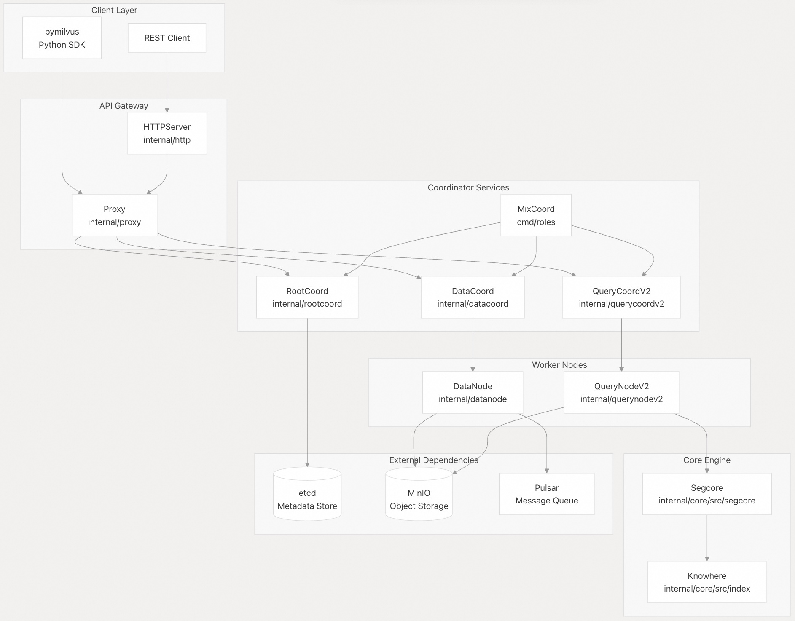
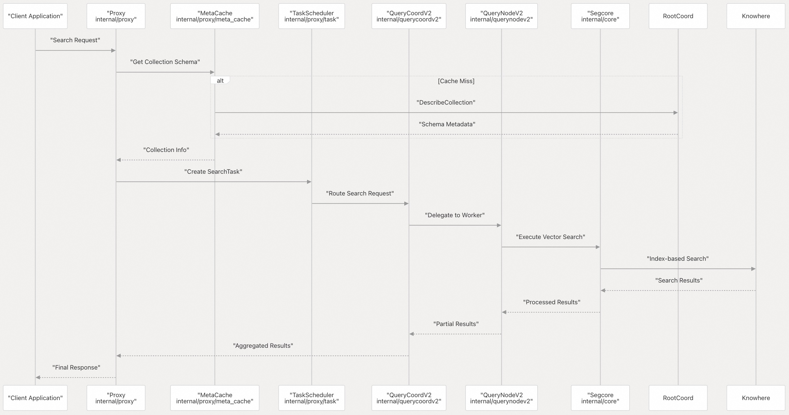

## Milvus 源码学习: 1 什么是 Milvus?   
            
### 作者           
digoal          
         
### 日期        
2025-10-24        
          
### 标签          
Milvus , 源码学习           
          
----          
          
## 背景      
本文对 Milvus 进行了高层次的介绍。Milvus 是一个专为 AI 应用设计的开源分布式向量数据库。它涵盖了系统架构、核心组件、数据流、部署选项以及使 Milvus 成为可扩展向量搜索平台的关键特性。  
  
## 什么是 Milvus（What is Milvus）  
  
Milvus 是一个为大规模应用而构建的高性能、云原生向量数据库。它能高效地组织和搜索表示为向量嵌入（vector embeddings）的大量非结构化数据，为语义搜索、检索增强生成（RAG）、推荐系统和图像相似性搜索等 AI 应用提供支持。  
  
该系统主要用 Go 和 C++ 编写，实现了 CPU/GPU 的硬件加速，以实现最佳的向量搜索性能。Milvus 具有完全分布式、Kubernetes 原生的架构，支持水平扩展和实时流式更新，同时保持数据的新鲜度。  
  
**来源：** [README.md 13-25](https://github.com/milvus-io/milvus/blob/18371773/README.md#L13-L25)  
  
## 架构概述（Architecture Overview）  
  
Milvus 实现了分布式、云原生的架构，计算层和存储层清晰分离。系统遵循微服务设计，每个组件都是无状态的，实现了高弹性和容错性。  
  
### 分布式系统架构（Distributed System Architecture）  
  
  
  
该架构由四个主要层组成：  
  
1.  **客户端层（Client Layer）**: 用于应用集成的 SDK 和 REST API  
2.  **API 网关（API Gateway）**: 通过 `Proxy` 进行请求路由和负载均衡  
3.  **协调层（Coordination Layer）**: 元数据管理和工作负载分配  
4.  **执行层（Execution Layer）**: 数据处理和查询执行节点  
  
**来源：** [README.md 17](https://github.com/milvus-io/milvus/blob/18371773/README.md#L17-L17) [internal/proxy](https://github.com/milvus-io/milvus/blob/18371773/internal/proxy) [internal/rootcoord](https://github.com/milvus-io/milvus/blob/18371773/internal/rootcoord) [internal/querycoordv2](https://github.com/milvus-io/milvus/blob/18371773/internal/querycoordv2) [internal/datacoord](https://github.com/milvus-io/milvus/blob/18371773/internal/datacoord) [internal/querynodev2](https://github.com/milvus-io/milvus/blob/18371773/internal/querynodev2) [internal/datanode](https://github.com/milvus-io/milvus/blob/18371773/internal/datanode)  
  
## 核心组件（Core Components）  
  
### Proxy 服务（Proxy Service）  
  
`Proxy` 作为系统的 API 网关，处理客户端请求并将其路由到适当的协调器(Coordinators)。它通过 `MetaCache` 组件实现请求验证、任务调度和元数据缓存。  
  
### 协调器（Coordinators）  
  
* **RootCoord**: 管理集合（collection）模式、DDL 操作和全局元数据  
* **QueryCoordV2**: 处理查询规划、负载均衡和查询节点管理  
* **DataCoord**: 监督段（segment）生命周期、压缩调度和垃圾回收  
  
### 工作节点（Worker Nodes）  
  
* **QueryNodeV2**: 使用 `Segcore` 引擎执行向量搜索和查询  
* **DataNode**: 处理数据摄取、持久化和压缩操作  
  
### 核心引擎（Core Engine）  
  
* **Segcore**: 用于向量操作的高性能 C++ 段处理引擎  
* **Knowhere**: 向量索引库，支持多种索引类型（HNSW, IVF, DiskANN）  
  
**来源：** [internal/proxy/proxy.go](https://github.com/milvus-io/milvus/blob/18371773/internal/proxy/proxy.go) [internal/rootcoord/root_coordinator.go](https://github.com/milvus-io/milvus/blob/18371773/internal/rootcoord/root_coordinator.go) [internal/querycoordv2/coordinator.go](https://github.com/milvus-io/milvus/blob/18371773/internal/querycoordv2/coordinator.go) [internal/datacoord/coordinator.go](https://github.com/milvus-io/milvus/blob/18371773/internal/datacoord/coordinator.go) [internal/querynodev2/querynode.go](https://github.com/milvus-io/milvus/blob/18371773/internal/querynodev2/querynode.go) [internal/datanode/data_node.go](https://github.com/milvus-io/milvus/blob/18371773/internal/datanode/data_node.go) [internal/core/src/segcore](https://github.com/milvus-io/milvus/blob/18371773/internal/core/src/segcore) [internal/core/src/index](https://github.com/milvus-io/milvus/blob/18371773/internal/core/src/index)  
  
## 请求处理流程（Request Processing Flow）  
  
  
  
该流程演示了请求如何从客户端到核心搜索引擎，进行适当的元数据解析和结果聚合。  
  
**来源：** [internal/proxy/task_search.go](https://github.com/milvus-io/milvus/blob/18371773/internal/proxy/task_search.go) [internal/proxy/meta_cache.go](https://github.com/milvus-io/milvus/blob/18371773/internal/proxy/meta_cache.go) [internal/querycoordv2/handlers.go](https://github.com/milvus-io/milvus/blob/18371773/internal/querycoordv2/handlers.go) [internal/querynodev2/delegator.go](https://github.com/milvus-io/milvus/blob/18371773/internal/querynodev2/delegator.go) [internal/core/src/segcore/search_c.cpp](https://github.com/milvus-io/milvus/blob/18371773/internal/core/src/segcore/search_c.cpp)  
  
## 部署选项（Deployment Options）  
  
### 独立模式（Standalone Mode）  
  
Milvus 可以作为单个进程运行，将所有组件结合在一起，适用于开发和小型部署。`MixCoord` 组件在此模式下管理所有协调功能。  
  
### 分布式模式（Distributed Mode）  
  
生产部署使用分布式架构，每个组件都有单独的进程，支持独立扩展和高可用性。组件通过 gRPC 进行通信，并使用外部依赖进行协调和存储。  
  
### Milvus Lite  
  
一个轻量级的 Python 嵌入式版本，通过 `pymilvus` 提供，用于快速原型设计和本地开发。  
  
**来源：** [cmd/roles/mix_coord.go](https://github.com/milvus-io/milvus/blob/18371773/cmd/roles/mix_coord.go) [README.md 17](https://github.com/milvus-io/milvus/blob/18371773/README.md#L17-L17) [README.md 36-40](https://github.com/milvus-io/milvus/blob/18371773/README.md#L36-L40)  
  
## 关键特性（Key Features）  
  
### 向量搜索能力（Vector Search Capabilities）  
  
* **多种索引类型**: 支持 HNSW、IVF、FLAT、SCANN、DiskANN 及其量化变体  
* **硬件加速**: 支持包括 NVIDIA CAGRA 在内的 GPU 索引  
* **混合搜索**: 结合了密集和稀疏向量以及元数据过滤  
* **全文搜索**: 集成了原生 BM25 支持，用于文本搜索并与向量相似性搜索融合  
  
### 可扩展性和性能（Scalability and Performance）  
  
* **水平扩展**: 计算和存储层的独立扩展  
* **实时更新**: 流式数据摄取，即时可查询  
* **多租户**: 数据库、集合和分区级别的隔离策略  
* **冷热存储**: 内存、SSD 和经济高效存储之间的自动数据分层  
  
### 企业特性（Enterprise Features）  
  
* **安全**: 用户认证、TLS 加密和基于角色的访问控制（RBAC, Role-Based Access Control）  
* **高可用性**: 自动故障转移、协调器 HA 和副本支持  
* **监控**: 集成 Prometheus/Grafana 实现可观测性  
* **数据管理**: 用于同步的 CDC、备份/恢复功能  
  
**来源：** [README.md 79-96](https://github.com/milvus-io/milvus/blob/18371773/README.md#L79-L96) [internal/core/src/index](https://github.com/milvus-io/milvus/blob/18371773/internal/core/src/index) [pkg/util/paramtable](https://github.com/milvus-io/milvus/blob/18371773/pkg/util/paramtable) [internal/proxy/authentication.go](https://github.com/milvus-io/milvus/blob/18371773/internal/proxy/authentication.go)  
  
## 开发环境（Development Environment）  
  
### 构建系统（Build System）  
  
Milvus 使用混合构建系统，将 Go 模块和 C++ 组件的 CMake 结合起来。构建过程采用容器化，以确保环境一致性。  
  
关键构建命令：  
  
* `make`: 完整系统构建  
* `make milvus`: 二进制文件编译  
* `make unittest`: 测试执行  
* `./scripts/install_deps.sh`: 依赖项安装  
  
### 依赖项（Dependencies）  
  
* **Go**: 系统服务要求 ≥1.21  
* **CMake**: C++ 组件要求 ≥3.26.4  
* **Conan**: C++ 包管理要求 1.61  
* **Docker**: 基于容器的开发和部署  
  
**来源：** [DEVELOPMENT.md 98-103](https://github.com/milvus-io/milvus/blob/18371773/DEVELOPMENT.md#L98-L103) [DEVELOPMENT.md 125-129](https://github.com/milvus-io/milvus/blob/18371773/DEVELOPMENT.md#L125-L129) [README.md 165-189](https://github.com/milvus-io/milvus/blob/18371773/README.md#L165-L189) [Makefile](https://github.com/milvus-io/milvus/blob/18371773/Makefile) [scripts/install_deps.sh](https://github.com/milvus-io/milvus/blob/18371773/scripts/install_deps.sh)  
  
## 生态系统集成（Ecosystem Integration）  
  
Milvus 与包括 LangChain、LlamaIndex、OpenAI 和 HuggingFace 在内的完整 AI 开发工具集成。生态系统包括：  
  
* **管理**: Attu GUI、Birdwatcher 调试器  
* **数据管道**: Spark、Kafka、Fivetran、Airbyte 连接器  
* **嵌入模型**: 通过 `pymilvus[model]` 的内置工具支持  
* **监控**: Prometheus/Grafana 可观测性堆栈  
  
**来源：** [README.md 151-153](https://github.com/milvus-io/milvus/blob/18371773/README.md#L151-L153) [client/python](https://github.com/milvus-io/milvus/blob/18371773/client/python) [deployments/docker](https://github.com/milvus-io/milvus/blob/18371773/deployments/docker)  
      
#### [期望 PostgreSQL|开源PolarDB 增加什么功能?](https://github.com/digoal/blog/issues/76 "269ac3d1c492e938c0191101c7238216")
  
  
#### [PolarDB 开源数据库](https://openpolardb.com/home "57258f76c37864c6e6d23383d05714ea")
  
  
#### [PolarDB 学习图谱](https://www.aliyun.com/database/openpolardb/activity "8642f60e04ed0c814bf9cb9677976bd4")
  
  
#### [PostgreSQL 解决方案集合](../201706/20170601_02.md "40cff096e9ed7122c512b35d8561d9c8")
  
  
#### [德哥 / digoal's Github - 公益是一辈子的事.](https://github.com/digoal/blog/blob/master/README.md "22709685feb7cab07d30f30387f0a9ae")
  
  
#### [About 德哥](https://github.com/digoal/blog/blob/master/me/readme.md "a37735981e7704886ffd590565582dd0")
  
  

  
