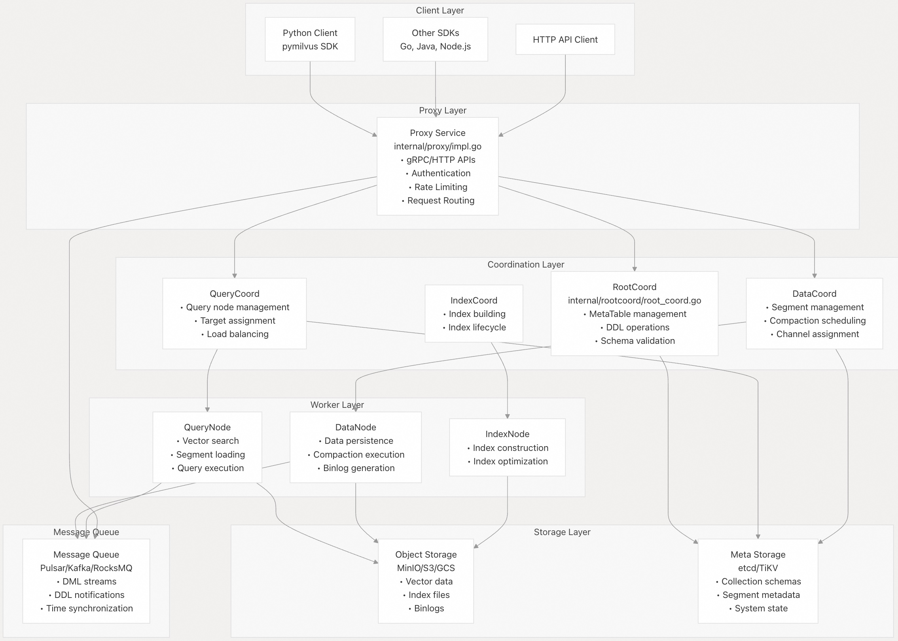
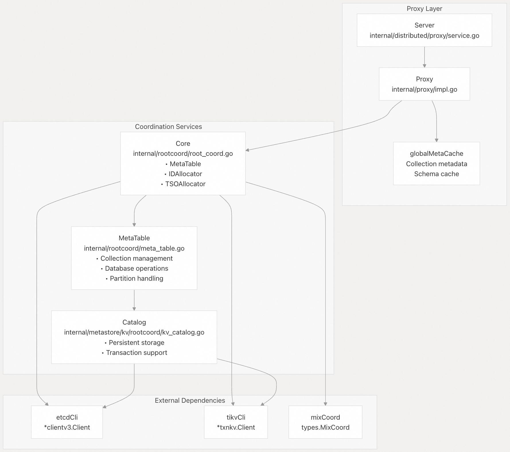
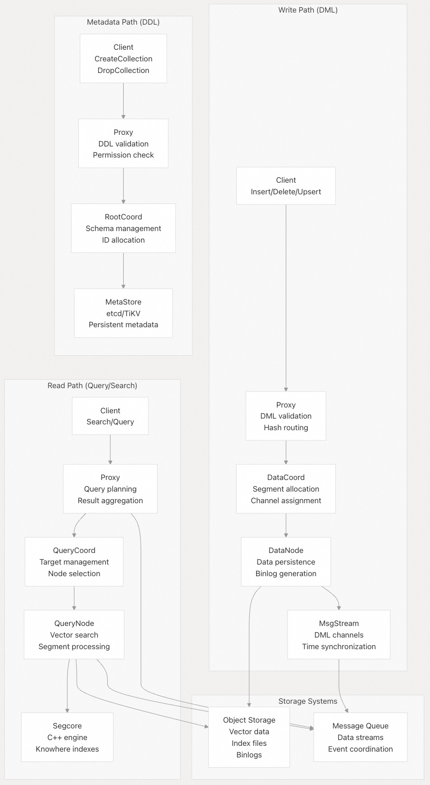
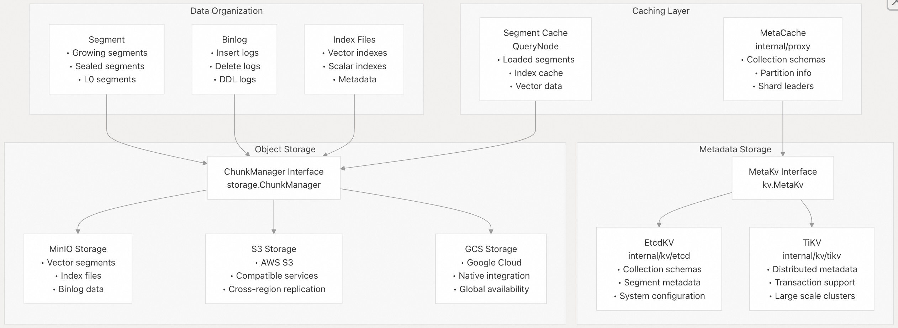
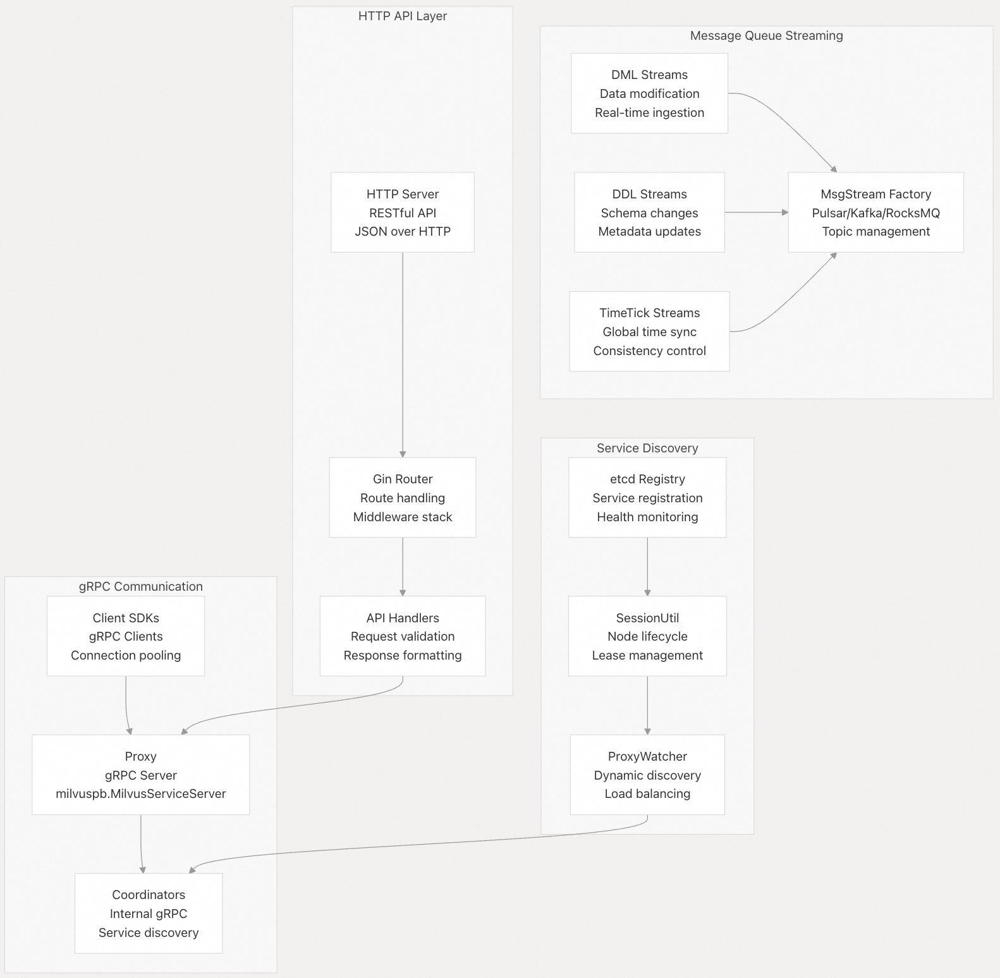

## Milvus 源码学习: 1.1 架构（Architecture）  
              
### 作者             
digoal            
           
### 日期          
2025-10-24          
            
### 标签            
Milvus , 源码学习             
            
----            
            
## 背景        
本文介绍 Milvus 的分布式微服务架构，并展示组件如何交互以及数据如何在系统中流动。涵盖了核心服务组件、它们的职责以及实现可扩展向量数据库操作的通信模式。  
  
## 整体分布式架构（Overall Distributed Architecture）  
  
Milvus 实现了计算与存储分离的云原生分布式架构，从而实现水平扩展和高可用性（High Availability）。系统由无状态微服务（stateless microservices）组成，分为三个主要层：代理层（proxy）、协调层（coordination）和工作节点层（worker nodes）。  
  
    
  
该架构实现了几个关键设计原则：  
  
* **无状态服务（Stateless Services）**: 所有计算组件都是无状态的，将状态存储在外部系统  
* **关注点分离（Separation of Concerns）**: 每个服务都有明确定义的职责  
* **水平可扩展性（Horizontal Scalability）**: 服务可以根据工作负载独立扩展  
* **高可用性（High Availability）**: 协调器故障转移（Coordinator failover）和副本(replica)支持确保系统弹性  
  
**来源:** [internal/proxy/impl.go 1-100](https://github.com/milvus-io/milvus/blob/18371773/internal/proxy/impl.go#L1-L100) [internal/rootcoord/root_coord.go 91-133](https://github.com/milvus-io/milvus/blob/18371773/internal/rootcoord/root_coord.go#L91-L133) [internal/distributed/proxy/service.go 90-110](https://github.com/milvus-io/milvus/blob/18371773/internal/distributed/proxy/service.go#L90-L110) [README.md 79-96](https://github.com/milvus-io/milvus/blob/18371773/README.md#L79-L96)  
  
## 核心组件交互（Core Component Interactions）  
  
协调层（coordination layer）管理整个系统状态，并协调跨工作节点（worker nodes）的操作。每个协调器（coordinator）都有特定的职责，并维护系统元数据（metadata）的不同方面。  
  
    
  
`Proxy` 服务充当系统的入口点，实现 `milvuspb.MilvusServiceServer` 接口。它维护一个元数据缓存（`globalMetaCache`）以提高性能，并将请求路由到适当的协调器。  
  
`RootCoord` 通过 `MetaTable` 接口管理系统的主元数据（master metadata），该接口提供数据库、集合（collections）和分区（partitions）的操作。`MetaTable` 的实现将持久化（persistence）委托给 `Catalog` 接口，该接口抽象了底层键值存储（key-value store）。  
  
**来源:** [internal/proxy/impl.go 72-100](https://github.com/milvus-io/milvus/blob/18371773/internal/proxy/impl.go#L72-L100) [internal/rootcoord/root_coord.go 91-133](https://github.com/milvus-io/milvus/blob/18371773/internal/rootcoord/root_coord.go#L91-L133) [internal/rootcoord/meta_table.go 50-60](https://github.com/milvus-io/milvus/blob/18371773/internal/rootcoord/meta_table.go#L50-L60) [internal/metastore/kv/rootcoord/kv_catalog.go 1-30](https://github.com/milvus-io/milvus/blob/18371773/internal/metastore/kv/rootcoord/kv_catalog.go#L1-L30)  
  
## 数据流架构（Data Flow Architecture）  
  
Milvus 为写入操作（DML）、读取操作（查询/搜索）和元数据操作（DDL）实现了单独的数据路径，以针对不同的工作负载模式优化性能。  
  
    
  
**写入路径（Write Path）**: `Proxy` 验证 DML 请求并将其路由到 `DataCoord` 进行段（segment）分配。`DataNode` 将数据持久化到对象存储（object storage），并发布到消息流（message streams）以供实时消费。  
  
**读取路径（Read Path）**: `Proxy` 规划查询，`QueryCoord` 选择适当的 `QueryNode` 实例。`QueryNode` 使用 `Segcore` C++ 引擎和 `Knowhere` 向量索引执行搜索。  
  
**元数据路径（Metadata Path）**: `Proxy` 验证 DDL 操作，`RootCoord` 管理模式更改（schema changes）和 ID 分配，持久化由元数据存储（metadata store）处理。  
  
**来源:** [internal/proxy/impl.go 553-640](https://github.com/milvus-io/milvus/blob/18371773/internal/proxy/impl.go#L553-L640) [internal/rootcoord/root_coord.go 165-213](https://github.com/milvus-io/milvus/blob/18371773/internal/rootcoord/root_coord.go#L165-L213) [internal/distributed/proxy/service.go 200-300](https://github.com/milvus-io/milvus/blob/18371773/internal/distributed/proxy/service.go#L200-L300)  
  
## 存储架构（Storage Architecture）  
  
Milvus 实现了热元数据（hot metadata，频繁访问）和冷数据存储（cold data storage，大量向量数据）的分离，以优化性能和成本。  
  
    
  
存储层提供以下几个关键功能：  
  
* **元数据存储（Metadata Store）**: 支持 etcd（单区域）和 TiKV（多区域）进行元数据持久化  
* **对象存储（Object Storage）**: 通过 `ChunkManager` 接口抽象多个云存储提供商  
* **数据组织（Data Organization）**: 段（Segments）包含向量数据，binlogs 提供更改历史，索引文件（index files）实现快速搜索  
* **缓存（Caching）**: 多层缓存减少频繁访问数据的延迟  
  
`RootCoord` 中的 `metaKVCreator` 函数根据配置选择适当的元数据后端：  
```  
if Params.MetaStoreCfg.MetaStoreType.GetValue() == util.MetaStoreTypeTiKV {  
    // TiKV implementation  
} else {  
    // etcd implementation    
}  
```  
  
**来源:** [internal/rootcoord/root_coord.go 309-323](https://github.com/milvus-io/milvus/blob/18371773/internal/rootcoord/root_coord.go#L309-L323) [internal/metastore/kv/rootcoord/kv_catalog.go 1-50](https://github.com/milvus-io/milvus/blob/18371773/internal/metastore/kv/rootcoord/kv_catalog.go#L1-L50) [internal/metastore/kv/datacoord/kv_catalog.go 1-50](https://github.com/milvus-io/milvus/blob/18371773/internal/metastore/kv/datacoord/kv_catalog.go#L1-L50)  
  
## 通信模式（Communication Patterns）  
  
Milvus 使用多种通信机制，针对不同的交互模式进行了优化：用于请求-响应(request-response)的同步 gRPC、用于数据流的异步消息队列（asynchronous message queues）和用于分布式一致性的时间同步。  
  
    
  
**gRPC 通信（gRPC Communication）**: 客户端-服务器和跨服务通信的主要协议。`Proxy` 实现 `milvuspb.MilvusServiceServer`，具有连接池（connection pooling）和服务发现（service discovery）。  
  
**消息流（Message Streaming）**: 用于数据流和事件协调的异步通信。`MsgStream` 抽象支持多个消息队列后端，并带有基于主题的路由（topic-based routing）。  
  
**HTTP API**: 使用 Gin 框架的 RESTful 接口，用于基于 Web 的集成。请求被转换为内部 gRPC 调用进行处理。  
  
**服务发现（Service Discovery）**: 基于 etcd 的注册表，用于动态服务发现和健康监测。`SessionUtil` 管理节点生命周期，`ProxyWatcher` 支持客户端负载均衡（client-side load balancing）。  
  
通信层实现了几种可靠性模式：  
  
* 连接池和重试逻辑（retry logic）以实现容错  
* 熔断器（Circuit breakers）以防止级联故障  
* 限速（Rate limiting）和配额管理（quota management）以保护资源  
* 分布式追踪（Distributed tracing）以实现可观测性  
  
**来源:** [internal/distributed/proxy/service.go 90-110](https://github.com/milvus-io/milvus/blob/18371773/internal/distributed/proxy/service.go#L90-L110) [internal/proxy/impl.go 17-70](https://github.com/milvus-io/milvus/blob/18371773/internal/proxy/impl.go#L17-L70) [pkg/util/sessionutil](https://github.com/milvus-io/milvus/blob/18371773/pkg/util/sessionutil) [pkg/mq/msgstream](https://github.com/milvus-io/milvus/blob/18371773/pkg/mq/msgstream)  
    
#### [期望 PostgreSQL|开源PolarDB 增加什么功能?](https://github.com/digoal/blog/issues/76 "269ac3d1c492e938c0191101c7238216")
  
  
#### [PolarDB 开源数据库](https://openpolardb.com/home "57258f76c37864c6e6d23383d05714ea")
  
  
#### [PolarDB 学习图谱](https://www.aliyun.com/database/openpolardb/activity "8642f60e04ed0c814bf9cb9677976bd4")
  
  
#### [PostgreSQL 解决方案集合](../201706/20170601_02.md "40cff096e9ed7122c512b35d8561d9c8")
  
  
#### [德哥 / digoal's Github - 公益是一辈子的事.](https://github.com/digoal/blog/blob/master/README.md "22709685feb7cab07d30f30387f0a9ae")
  
  
#### [About 德哥](https://github.com/digoal/blog/blob/master/me/readme.md "a37735981e7704886ffd590565582dd0")
  
  

  
