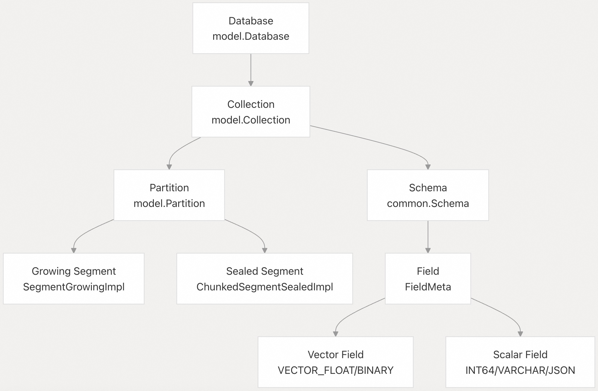
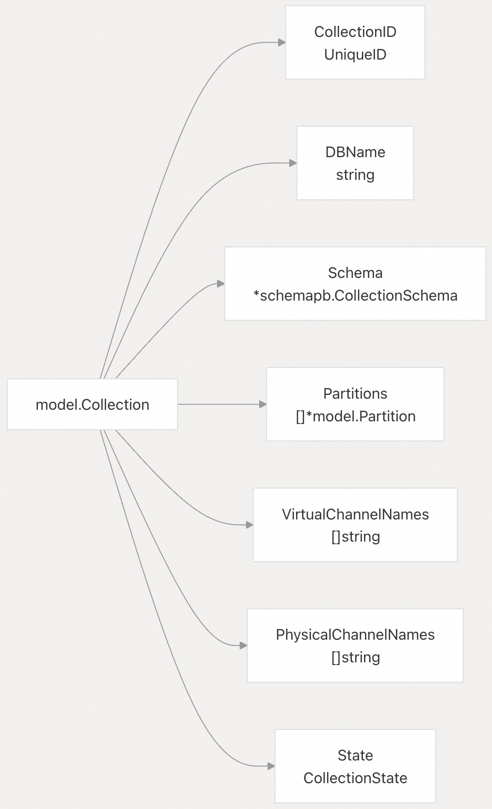
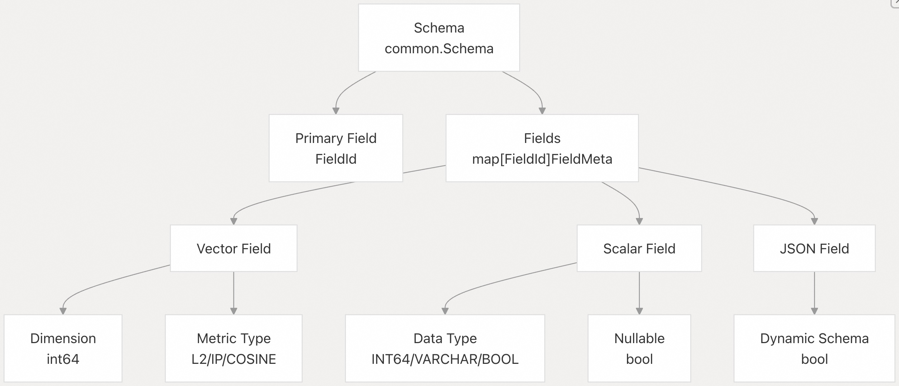
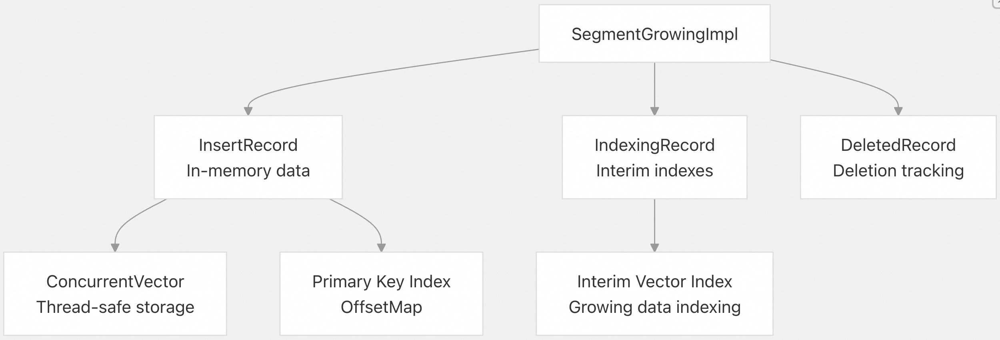
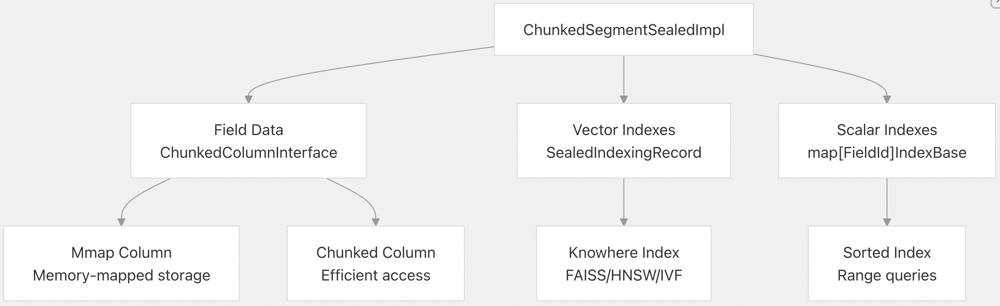
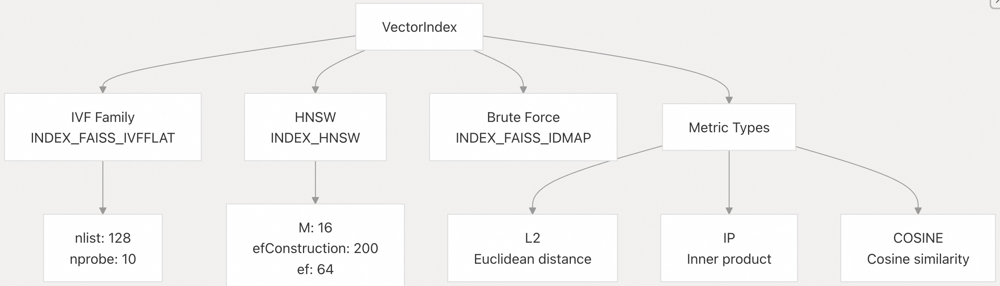
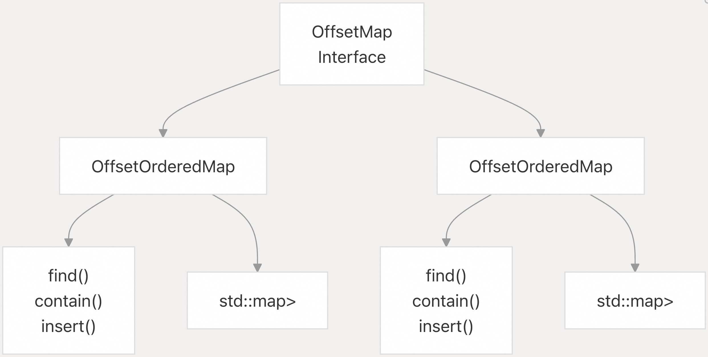

## Milvus 源码学习: 1.2 关键概念（Key Concepts）  
                
### 作者               
digoal              
             
### 日期            
2025-10-24            
              
### 标签              
Milvus , 源码学习               
              
----              
              
## 背景          
本文介绍构成 Milvus 向量数据库系统基础的基本概念。涵盖分层数据组织、段（segment）生命周期、索引机制以及开发人员在处理 Milvus 内部结构时需要理解的核心数据类型。  
  
## 分层数据组织（Hierarchical Data Organization）  
  
Milvus 以四级层次结构组织数据：数据库（Database）→ 集合（Collection）→ 分区（Partition）→ 段（Segment）。这种结构提供了逻辑组织，同时实现了高效的分布式存储和查询。  
  
    
  
**来源：** [internal/rootcoord/meta_table.go 120-138](https://github.com/milvus-io/milvus/blob/18371773/internal/rootcoord/meta_table.go#L120-L138) [internal/metastore/model 1-50](https://github.com/milvus-io/milvus/blob/18371773/internal/metastore/model#L1-L50) [internal/core/src/segcore/SegmentInterface.h 59-188](https://github.com/milvus-io/milvus/blob/18371773/internal/core/src/segcore/SegmentInterface.h#L59-L188)  
  
### 数据库（Database）  
  
`Database` 表示用于组织集合的顶层命名空间。`MetaTable` 管理数据库元数据，包括属性和访问控制。  
  
| 属性（Property） | 类型（Type） | 描述（Description） |  
| --- | --- | --- |  
| ID | `int64` | 唯一的数据库标识符 |  
| Name | `string` | 数据库名称（在集群内唯一） |  
| State | `DatabaseState` | 当前状态（Creating/Created/Dropping） |  
| Properties | `map[string]string` | 配置属性 |  
  
**来源：** [internal/metastore/model/database.go 1-50](https://github.com/milvus-io/milvus/blob/18371773/internal/metastore/model/database.go#L1-L50) [internal/rootcoord/meta_table.go 418-452](https://github.com/milvus-io/milvus/blob/18371773/internal/rootcoord/meta_table.go#L418-L452)  
  
### 集合（Collection）  
  
`Collection` 类似于传统数据库中的表，包含具有相同模式（schema）的实体。集合由 `RootCoord` 管理并存储在 `MetaTable` 中。  
  
    
  
**来源：** [internal/metastore/model/collection.go 1-100](https://github.com/milvus-io/milvus/blob/18371773/internal/metastore/model/collection.go#L1-L100) [internal/rootcoord/meta_table.go 454-486](https://github.com/milvus-io/milvus/blob/18371773/internal/rootcoord/meta_table.go#L454-L486)  
  
### 分区（Partition）  
  
`Partition` 提供了集合内的逻辑细分，以实现更好的组织和查询性能。分区与其父集合共享相同的模式。  
    
**来源：** [internal/metastore/model/partition.go 1-50](https://github.com/milvus-io/milvus/blob/18371773/internal/metastore/model/partition.go#L1-L50) [internal/rootcoord/meta_table.go 77-80](https://github.com/milvus-io/milvus/blob/18371773/internal/rootcoord/meta_table.go#L77-L80)  
  
## 模式和字段（Schema and Fields）  
  
`Schema` 定义了集合内数据的结构，指定了字段类型、约束和索引要求。  
  
    
  
### 字段类型和数据类型（Field Types and Data Types）  
  
Milvus 支持多种数据类型，并将其组织到以下类别中：  
  
| 类别（Category） | 数据类型（Data Types） | 代码符号（Code Symbol） | 用途（Usage） |  
| --- | --- | --- | --- |  
| 向量（Vector） | `VECTOR_FLOAT`、`VECTOR_BINARY` | `DataType::VECTOR_FLOAT` | 相似性搜索 |  
| 标量（Scalar） | `INT64`、`VARCHAR`、`BOOL`、`DOUBLE` | `DataType::INT64` | 过滤、主键 |  
| 数组（Array） | `ARRAY` | `DataType::ARRAY` | 多值字段 |  
| JSON | `JSON` | `DataType::JSON` | 动态模式支持 |  
  
**来源：** [internal/core/src/common/Schema.h 50-100](https://github.com/milvus-io/milvus/blob/18371773/internal/core/src/common/Schema.h#L50-L100) [pkg/v2/proto/schemapb/schema.pb.go 100-200](https://github.com/milvus-io/milvus/blob/18371773/pkg/v2/proto/schemapb/schema.pb.go#L100-L200)  
  
## 段生命周期和类型（Segment Lifecycle and Types）  
  
段（Segments）是 Milvus 中最基本的存储单元，存在于两种状态，代表不同的生命周期阶段。  
  
### 增长中段（Growing Segments）  
  
`SegmentGrowingImpl` 处理活动数据摄取，采用针对写入操作优化的内存存储。  
  
    
  
关键特点：  
  
* **可变（Mutable）**: 接受新的插入和删除  
* **内存驻留（Memory-resident）**: 数据存储在 `ConcurrentVector` 结构中  
* **临时索引（Interim indexing）**: 增量构建索引以提高搜索性能  
  
**来源：** [internal/core/src/segcore/SegmentGrowingImpl.h 41-225](https://github.com/milvus-io/milvus/blob/18371773/internal/core/src/segcore/SegmentGrowingImpl.h#L41-L225) [internal/core/src/segcore/InsertRecord.h 35-80](https://github.com/milvus-io/milvus/blob/18371773/internal/core/src/segcore/InsertRecord.h#L35-L80)  
  
### 密封段（Sealed Segments）  
  
`ChunkedSegmentSealedImpl` 提供不可变（immutable）、持久化的存储，并具有优化的查询性能。  
  
    
  
关键特点：  
  
* **不可变（Immutable）**: 不接受新的写入  
* **持久化（Persistent）**: 数据通过内存映射存储在磁盘上  
* **完全索引（Fully indexed）**: 完整的向量和标量索引，以实现最佳查询性能  
  
**来源：** [internal/core/src/segcore/ChunkedSegmentSealedImpl.h 41-200](https://github.com/milvus-io/milvus/blob/18371773/internal/core/src/segcore/ChunkedSegmentSealedImpl.h#L41-L200) [internal/core/src/mmap/ChunkedColumnInterface.h 1-50](https://github.com/milvus-io/milvus/blob/18371773/internal/core/src/mmap/ChunkedColumnInterface.h#L1-L50)  
  
## 向量索引（Vector Indexing）  
  
向量索引是 Milvus 相似性搜索能力的核心，通过 Knowhere 库实现。  
  
### 索引类型和参数（Index Types and Parameters）  
  
    
  
### 索引构建过程（Index Building Process）  
  
索引构建过程涉及多个组件：  
  
1.  **索引工厂（Index Factory）**: `IndexFactory::CreateIndex()` 实例化适当的索引类型  
2.  **构建配置（Build Configuration）**: 例如 `nlist`、`M`、`efConstruction` 等参数  
3.  **索引加载（Index Loading）**: `LoadIndexInfo` 结构携带索引元数据和二进制数据  
4.  **缓存（Caching）**: `CacheIndexBasePtr` 提供索引的内存管理  
  
**来源：** [internal/core/src/index/IndexFactory.h 30-60](https://github.com/milvus-io/milvus/blob/18371773/internal/core/src/index/IndexFactory.h#L30-L60) [internal/core/src/segcore/ChunkedSegmentSealedImpl.cpp 104-151](https://github.com/milvus-io/milvus/blob/18371773/internal/core/src/segcore/ChunkedSegmentSealedImpl.cpp#L104-L151) [internal/core/src/common/LoadInfo.h 100-150](https://github.com/milvus-io/milvus/blob/18371773/internal/core/src/common/LoadInfo.h#L100-L150)  
  
## 主键和实体标识（Primary Keys and Entity Identity）  
  
主键为集合中的实体提供唯一标识，支持两种数据类型，并采用不同的索引策略。  
  
### 主键类型（Primary Key Types）  
  
| 类型（Type） | 代码符号（Code Symbol） | 索引类型（Index Type） | 用例（Use Case） |  
| --- | --- | --- | --- |  
| 整数（Integer） | `DataType::INT64` | `OffsetOrderedMap<int64_t>` | 高性能查找 |  
| 字符串（String） | `DataType::VARCHAR` | `OffsetOrderedMap<std::string>` | 自然标识符 |  
  
### 主键索引（Primary Key Indexing）  
  
`OffsetMap` 接口提供统一的主键索引：  
  
    
  
**来源：** [internal/core/src/segcore/InsertRecord.h 45-81](https://github.com/milvus-io/milvus/blob/18371773/internal/core/src/segcore/InsertRecord.h#L45-L81) [internal/core/src/segcore/Utils.cpp 35-49](https://github.com/milvus-io/milvus/blob/18371773/internal/core/src/segcore/Utils.cpp#L35-L49)  
  
## 时间一致性（Temporal Consistency）  
  
Milvus 使用基于时间戳的版本控制来提供跨分布式操作的一致查询结果。  
  
### 时间戳使用（Timestamp Usage）  
  
* **插入时间戳（Insert Timestamps）**: 每个实体(entity)插入都带有时间戳  
* **查询时间戳（Query Timestamps）**: 查询指定一个时间点视图  
* **删除时间戳（Delete Timestamps）**: 删除带有时间戳以实现正确的排序  
* **集合 TTL（Collection TTL）**: 自动数据清理的生存时间  
  
`TimestampIndex` 实现了高效的时间范围查询和一致性保证。  
  
**来源：** [internal/core/src/segcore/TimestampIndex.h 1-50](https://github.com/milvus-io/milvus/blob/18371773/internal/core/src/segcore/TimestampIndex.h#L1-L50) [internal/core/src/segcore/DeletedRecord.h 50-100](https://github.com/milvus-io/milvus/blob/18371773/internal/core/src/segcore/DeletedRecord.h#L50-L100)  
  
## 附录: Milvus如何保证分布式节点的时间戳一致性    
    
Milvus通过**混合逻辑时钟(HLC)**和**时间戳分配器(Timestamp Allocator)**来保证分布式节点的时间戳一致性。      
    
### 核心机制    
    
#### 1. 混合逻辑时钟(HLC)    
    
Milvus使用64位时间戳,由46位物理时间和18位逻辑时间组成。 物理部分接近本地墙上时钟, 逻辑部分用于区分具有相同物理时间的事件。     
    
HLC通过NTP同步各节点的物理时钟, 在数据中心局域网中通常能保持数十毫秒的误差。     
    
#### 2. 中心化时间戳分配    
    
所有请求的时间戳由**Proxy**统一分配。 Proxy使用`tsoAllocator`(时间戳分配器)为每个请求分配全局唯一且单调递增的时间戳。     
    
对于批量请求, 所有子请求共享相同的issue时间。当有多个Proxy时, 不同Proxy的issue时间被视为来自中央时钟。     
    
#### 3. GuaranteeTimestamp机制    
    
Milvus使用**GuaranteeTimestamp**和**timetick水印**来确保读链路的一致性。     
    
在插入数据到消息队列时,Milvus不仅为记录打上时间戳,还会持续插入timetick。 当下游消费者(如QueryNode)看到某个timetick时, 意味着所有早于该timetick的数据都已被消费。     
    
在查询和搜索任务中,系统会根据一致性级别解析GuaranteeTimestamp:    
    
- **Strong一致性**: GuaranteeTs设置为系统最新时间戳,QueryNode会等待ServiceTime大于等于GuaranteeTs。      
- **Bounded Staleness**: GuaranteeTs设置为较早的时间戳(如1分钟前),可在容忍范围内立即执行查询。      
- **Session一致性**: GuaranteeTs设置为客户端最后一次写入的时间戳,确保每个客户端都能看到自己的所有数据。      
    
在代码实现中,`searchTask`和`queryTask`的`PreExecute`方法会根据一致性级别调用`parseGuaranteeTsFromConsistency`函数来计算GuaranteeTimestamp。      
    
#### 4. 状态同步    
    
WAL中的每条日志都附带时间戳,binlog记录、表行和索引单元也保留该时间戳。 这样,不同的数据形式可以为给定时间T提供一致的快照。     
    
### Notes    
    
Milvus的时间戳一致性保证是通过多层机制实现的:中心化的时间戳分配确保全局唯一性和单调性, HLC提供物理时间的近似性, GuaranteeTimestamp机制则在读取时提供可调节的一致性级别。 这种设计在吞吐量和一致性之间取得了平衡,允许异步状态同步以提高性能。      
      
#### [期望 PostgreSQL|开源PolarDB 增加什么功能?](https://github.com/digoal/blog/issues/76 "269ac3d1c492e938c0191101c7238216")
  
  
#### [PolarDB 开源数据库](https://openpolardb.com/home "57258f76c37864c6e6d23383d05714ea")
  
  
#### [PolarDB 学习图谱](https://www.aliyun.com/database/openpolardb/activity "8642f60e04ed0c814bf9cb9677976bd4")
  
  
#### [PostgreSQL 解决方案集合](../201706/20170601_02.md "40cff096e9ed7122c512b35d8561d9c8")
  
  
#### [德哥 / digoal's Github - 公益是一辈子的事.](https://github.com/digoal/blog/blob/master/README.md "22709685feb7cab07d30f30387f0a9ae")
  
  
#### [About 德哥](https://github.com/digoal/blog/blob/master/me/readme.md "a37735981e7704886ffd590565582dd0")
  
  

  
