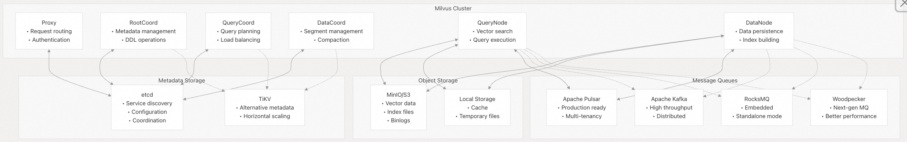
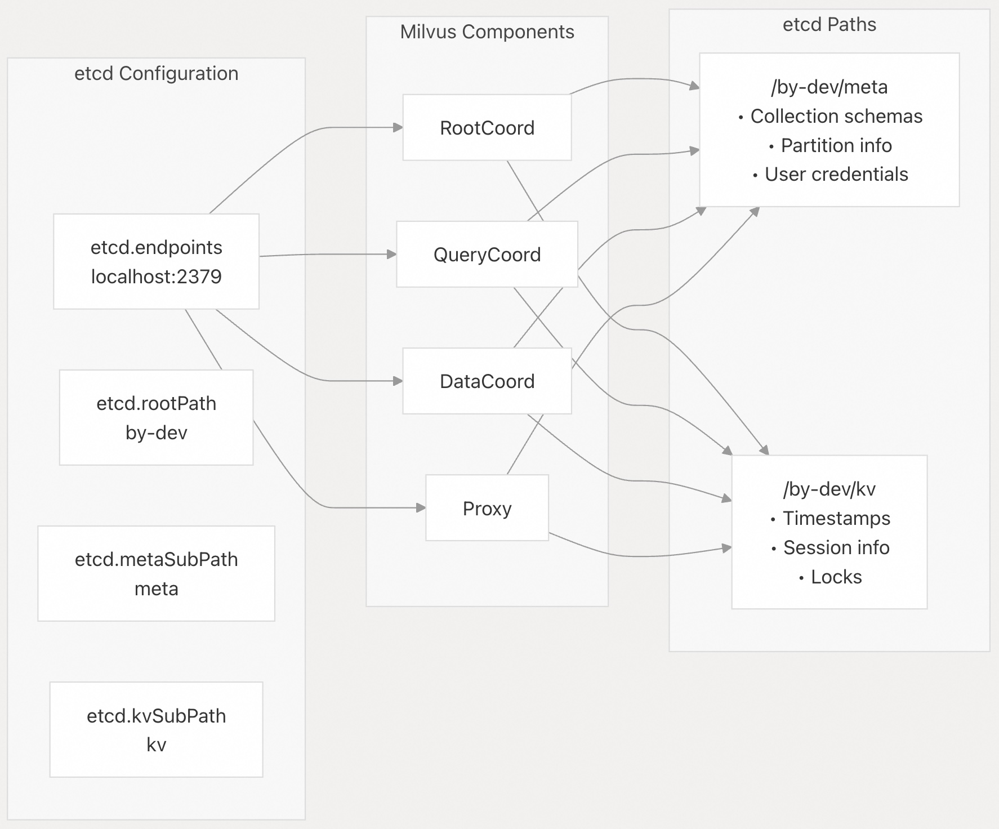
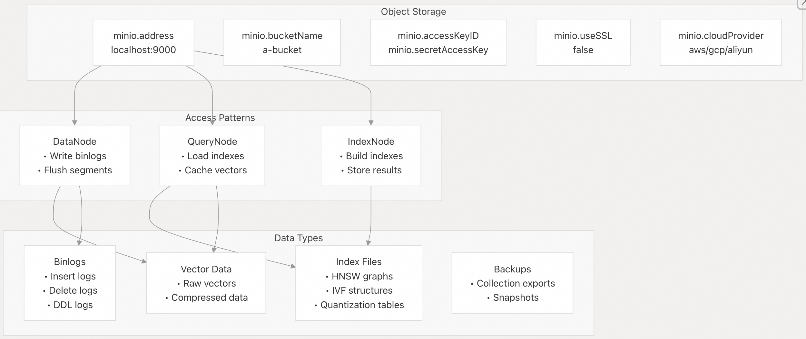
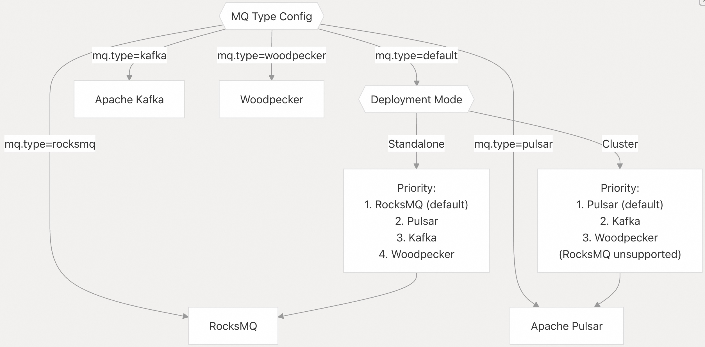
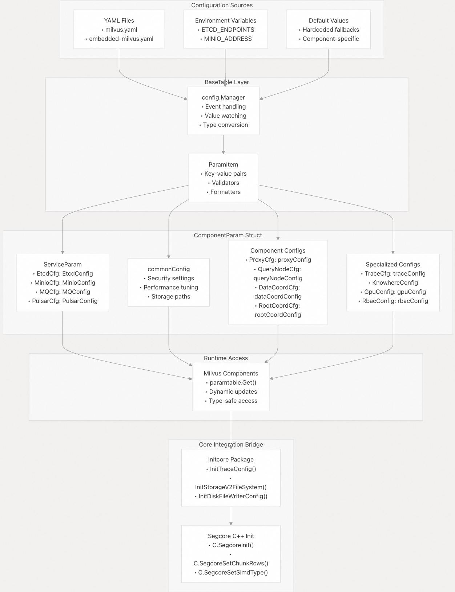
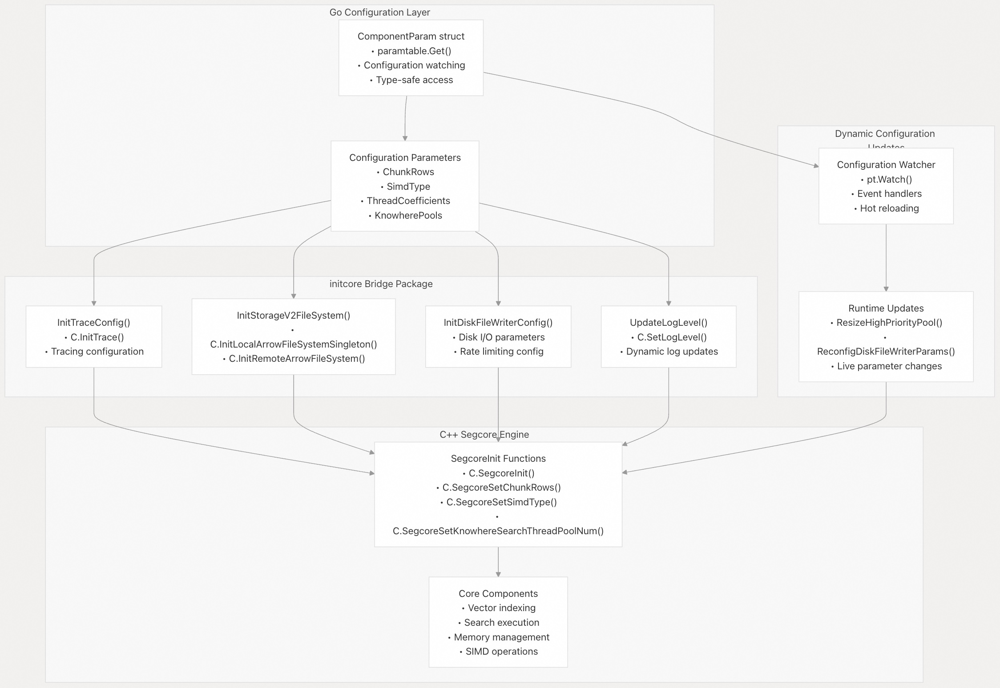
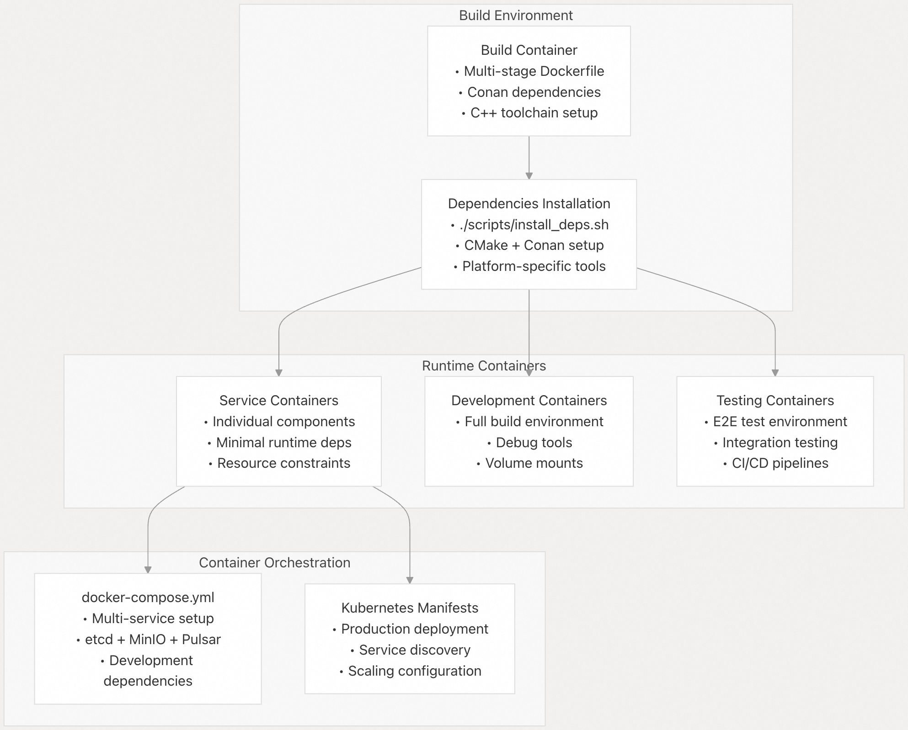

## Milvus 源码学习: 1.3 依赖与集成(Dependencies and Integration)  
                  
### 作者                 
digoal                
               
### 日期              
2025-10-24              
                
### 标签                
Milvus , 源码学习                 
                
----                
                
## 背景            
本文介绍 Milvus 的外部依赖、集成模式和配置管理系统。解释 Milvus 如何与存储系统、消息队列、元数据存储以及其他外部服务集成，以提供一个分布式向量数据库平台。  
  
## 核心外部依赖  
  
Milvus 作为一个分布式系统，依赖于几个关键的外部依赖项。这些依赖项主要分为三类：元数据存储、对象存储和消息队列系统。  
  
### 依赖架构  
  
  
  
来源: [`configs/milvus.yaml 17-275`](https://github.com/milvus-io/milvus/blob/18371773/configs/milvus.yaml#L17-L275) [`pkg/util/paramtable/service_param.go 42-69`](https://github.com/milvus-io/milvus/blob/18371773/pkg/util/paramtable/service_param.go#L42-L69)  
  
## 元数据存储依赖  
  
### etcd 集成  
  
etcd 作为 Milvus 的主要元数据存储和协调服务。它负责处理服务发现、配置管理以及组件之间的分布式协调。  
  
**关键配置参数：**  
  
* **Endpoints**：服务发现地址  
* **Root Path**：用于多个 Milvus 实例的命名空间隔离  
* **SSL/TLS**：安全通信选项  
* **Authentication**：用于访问控制的用户凭证  
  
  
  
来源: [`configs/milvus.yaml 17-64`](https://github.com/milvus-io/milvus/blob/18371773/configs/milvus.yaml#L17-L64) [`pkg/util/paramtable/service_param.go 117-315`](https://github.com/milvus-io/milvus/blob/18371773/pkg/util/paramtable/service_param.go#L117-L315)  
  
### TiKV 替代方案  
  
TiKV 为需要比 etcd 更好水平扩展性的场景提供了一个替代的元数据存储解决方案。  
  
**使用场景：**  
  
* 具有大量元数据的大规模部署  
* 更高的水平扩展性要求  
* 与现有 TiDB 生态系统的兼容性  
  
来源: [`configs/milvus.yaml 71-86`](https://github.com/milvus-io/milvus/blob/18371773/configs/milvus.yaml#L71-L86) [`pkg/util/paramtable/service_param.go 633-711`](https://github.com/milvus-io/milvus/blob/18371773/pkg/util/paramtable/service_param.go#L633-L711)  
  
## 对象存储依赖  
  
### MinIO/S3 集成  
  
对象存储处理持久性数据，包括向量数据、索引文件和预写日志（binlogs）。  
  
**支持的存储类型：**  
  
* **MinIO**：自托管对象存储  
* **Amazon S3**：云对象存储  
* **Google Cloud Storage**：GCP 原生存储  
* **兼容 API**：任何 S3 兼容的存储  
  
  
  
来源: [`configs/milvus.yaml 93-160`](https://github.com/milvus-io/milvus/blob/18371773/configs/milvus.yaml#L93-L160) [`pkg/util/paramtable/service_param.go 1269-1463`](https://github.com/milvus-io/milvus/blob/18371773/pkg/util/paramtable/service_param.go#L1269-L1463)  
  
### 本地存储  
  
本地存储提供缓存和临时文件管理以提高性能。  
  
**配置：**  
  
* **Path**：缓存文件的本地目录  
* **Usage**：搜索/查询操作期间的临时数据  
* **Benefits**：减少网络延迟和提高吞吐量  
  
来源: [`configs/milvus.yaml 87-91`](https://github.com/milvus-io/milvus/blob/18371773/configs/milvus.yaml#L87-L91) [`pkg/util/paramtable/service_param.go 1195-1206`](https://github.com/milvus-io/milvus/blob/18371773/pkg/util/paramtable/service_param.go#L1195-L1206)  
  
## 消息队列依赖  
  
Milvus 支持多种消息队列系统，用于流式数据和协调。选择取决于部署模式和性能要求。  
  
### 消息队列选择逻辑  
  
  
  
来源: [`configs/milvus.yaml 161-179`](https://github.com/milvus-io/milvus/blob/18371773/configs/milvus.yaml#L161-L179) [`pkg/util/paramtable/service_param.go 970-1003`](https://github.com/milvus-io/milvus/blob/18371773/pkg/util/paramtable/service_param.go#L970-L1003)  
  
### Pulsar 集成  
  
Apache Pulsar 作为集群部署的默认消息队列，提供多租户和可靠的消息传递。  
  
**主要功能：**  
  
* **多租户**：为不同的 Milvus 实例分隔命名空间  
* **积压管理**：自动清理以防止存储溢出  
* **Schema 注册表**：消息格式验证  
* **地理复制**：跨区域数据复制  
  
来源: [`configs/milvus.yaml 217-247`](https://github.com/milvus-io/milvus/blob/18371773/configs/milvus.yaml#L217-L247) [`pkg/util/paramtable/service_param.go 1464-1654`](https://github.com/milvus-io/milvus/blob/18371773/pkg/util/paramtable/service_param.go#L1464-L1654)  
  
### Kafka 集成  
  
Apache Kafka 提供具有分布式分区的高吞吐量消息流。  
  
**配置选项：**  
  
* **Broker endpoints**：Kafka 集群地址  
* **安全协议**：SASL、SSL 和明文选项  
* **Consumer/Producer 设置**：可通过参数前缀进行配置  
  
来源: [`configs/milvus.yaml 248-262`](https://github.com/milvus-io/milvus/blob/18371773/configs/milvus.yaml#L248-L262) [`pkg/util/paramtable/service_param.go 1655-1749`](https://github.com/milvus-io/milvus/blob/18371773/pkg/util/paramtable/service_param.go#L1655-L1749)  
  
### RocksMQ (嵌入式)  
  
RocksMQ 为独立部署提供了一个嵌入式消息队列解决方案，消除了外部依赖。  
  
**特点：**  
  
* **嵌入式**：在 Milvus 进程内运行  
* **RocksDB 后端**：持久本地存储  
* **内存管理**：可配置的缓存比例  
* **压缩**：自动清理旧消息  
  
来源: [`configs/milvus.yaml 263-275`](https://github.com/milvus-io/milvus/blob/18371773/configs/milvus.yaml#L263-L275) [`pkg/util/paramtable/service_param.go 1750-1817`](https://github.com/milvus-io/milvus/blob/18371773/pkg/util/paramtable/service_param.go#L1750-L1817)  
  
### Woodpecker (下一代)  
  
Woodpecker 代表了下一代消息队列系统，旨在提供最佳性能和操作简便性。  
  
**高级功能：**  
  
* **更优性能**：针对向量数据库工作负载进行优化  
* **简化操作**：降低操作复杂性  
* **成本效益**：更低的资源需求  
  
来源: [`configs/milvus.yaml 181-216`](https://github.com/milvus-io/milvus/blob/18371773/configs/milvus.yaml#L181-L216) [`pkg/streaming/walimpls/impls/wp/builder.go 25-76`](https://github.com/milvus-io/milvus/blob/18371773/pkg/streaming/walimpls/impls/wp/builder.go#L25-L76)  
  
## 配置管理系统  
  
Milvus 使用复杂的配置管理系统，集中处理所有组件的参数。  
  
### ComponentParam 架构  
  
  
  
来源: [`pkg/util/paramtable/component_param.go 62-201`](https://github.com/milvus-io/milvus/blob/18371773/pkg/util/paramtable/component_param.go#L62-L201) [`pkg/util/paramtable/service_param.go 42-69`](https://github.com/milvus-io/milvus/blob/18371773/pkg/util/paramtable/service_param.go#L42-L69) [`internal/util/initcore/init_core.go 51-89`](https://github.com/milvus-io/milvus/blob/18371773/internal/util/initcore/init_core.go#L51-L89) [`internal/querynodev2/server.go 247-287`](https://github.com/milvus-io/milvus/blob/18371773/internal/querynodev2/server.go#L247-L287)  
  
### 配置类别  
  
| 类别 | 用途 | 关键组件 | 结构类型 |  
| :--- | :--- | :--- | :--- |  
| **ServiceParam** | 外部服务连接 | `EtcdCfg`, `MinioCfg`, `MQCfg`, `PulsarCfg`, `KafkaCfg` | `EtcdConfig`, `MinioConfig`, `MQConfig`, `PulsarConfig` |  
| **CommonCfg** | 跨组件设置 | 安全性、性能、存储路径、SIMD | 具有 `ParamItem` 字段的 `commonConfig` |  
| **Component-specific** | 单个服务配置 | `ProxyCfg`, `QueryNodeCfg`, `DataCoordCfg`, `RootCoordCfg` | `proxyConfig`, `queryNodeConfig`, `dataCoordConfig` |  
| **Specialized** | 高级功能 | `TraceCfg`, `KnowhereConfig`, `GpuConfig`, `RbacConfig` | `traceConfig`, `knowhereConfig`, `gpuConfig` |  
| **Security** | 认证和授权 | RBAC、TLS 证书、用户管理 | `rbacConfig`, `credentialConfig` |  
| **Performance** | 资源分配 | 线程池、内存限制、超时 | CPU 系数、批量大小、缓存设置 |  
  
来源: [`pkg/util/paramtable/component_param.go 68-89`](https://github.com/milvus-io/milvus/blob/18371773/pkg/util/paramtable/component_param.go#L68-L89) [`pkg/util/paramtable/service_param.go 42-55`](https://github.com/milvus-io/milvus/blob/18371773/pkg/util/paramtable/service_param.go#L42-L55)  
  
## 核心集成桥梁  
  
Milvus 包含一个关键的集成层，用于连接 Go 配置管理和 C++ 核心引擎 (`Segcore`)。该桥梁确保配置更改正确传播到高性能的 C++ 组件。  
  
### 核心初始化过程  
  
  
  
来源: [`internal/util/initcore/init_core.go 57-124`](https://github.com/milvus-io/milvus/blob/18371773/internal/util/initcore/init_core.go#L57-L124) [`internal/querynodev2/server.go 195-244`](https://github.com/milvus-io/milvus/blob/18371773/internal/querynodev2/server.go#L195-L244) [`internal/querynodev2/server.go 247-287`](https://github.com/milvus-io/milvus/blob/18371773/internal/querynodev2/server.go#L247-L287)  
  
## 开发和构建依赖  
  
### 构建系统依赖  
  
Milvus 从源代码构建需要几个开发工具和库：  
  
**核心要求：**  
  
* **Go**：>= 1.21 用于服务逻辑  
* **CMake**：>= 3.26.4 用于 C++ 组件  
* **Conan**：1.61-1.64 用于 C++ 依赖管理  
* **GCC/Clang**：编译器工具链 (GCC 9.5+ 或 LLVM 15+)  
  
**平台相关要求：**  
  
* **Linux**：Ubuntu 20.04+, GCC 9.5, Python 3.8-3.11  
* **macOS x86\_64**：LLVM 15+, Big Sur 11.5+, Python 3.8-3.11  
* **macOS ARM64**：原生 Apple Silicon 支持, Monterey 12.0.1+  
  
来源: [`DEVELOPMENT.md 94-174`](https://github.com/milvus-io/milvus/blob/18371773/DEVELOPMENT.md#L94-L174) [`README.md 165-189`](https://github.com/milvus-io/milvus/blob/18371773/README.md#L165-L189)  
  
### Docker 集成  
  
Docker 提供容器化的构建和部署环境，具有复杂的依赖管理：  
  
  
  
来源: [`build/README.md 1-140`](https://github.com/milvus-io/milvus/blob/18371773/build/README.md#L1-L140) [`build/docker/heaptrack/Dockerfile 1-44`](https://github.com/milvus-io/milvus/blob/18371773/build/docker/heaptrack/Dockerfile#L1-L44) [`DEVELOPMENT.md 176-181`](https://github.com/milvus-io/milvus/blob/18371773/DEVELOPMENT.md#L176-L181)  
  
## 集成模式  
  
### 客户端 SDK 集成  
  
Milvus 提供多种客户端 SDK 和 API 以进行应用集成：  
  
**SDK 类型：**  
  
* **Python SDK** (`pymilvus`)：主要的客户端库  
* **Go SDK**：原生 Go 应用  
* **Java SDK**：企业级 Java 应用  
* **Node.js SDK**：JavaScript/TypeScript 应用  
  
**API 协议：**  
  
* **gRPC**：高性能二进制协议  
* **HTTP REST API**：Web 友好的 JSON 接口  
* **Protocol Buffers**：跨语言消息格式  
  
来源: [`README.md 28-73`](https://github.com/milvus-io/milvus/blob/18371773/README.md#L28-L73) [`README_CN.md 32-48`](https://github.com/milvus-io/milvus/blob/18371773/README_CN.md#L32-L48)  
  
### 生态系统集成  
  
Milvus 与各种 AI 和数据处理框架集成：  
  
**AI 框架：**  
  
* **LangChain**：LLM 应用开发  
* **LlamaIndex**：文档索引和检索  
* **Haystack**：搜索管道  
* **OpenAI**：嵌入生成  
  
**数据连接器：**  
  
* **Apache Spark**：大规模数据处理  
* **Apache Kafka**：流式数据摄取  
* **Airbyte**：ELT 数据管道  
* **Fivetran**：自动化数据复制  
  
来源: [`README.md 150-153`](https://github.com/milvus-io/milvus/blob/18371773/README.md#L150-L153)  
  
### 监控和可观测性  
  
**指标和监控：**  
  
* **Prometheus**：指标收集和警报  
* **Grafana**：可视化和仪表板  
* **Jaeger**：分布式追踪  
* **自定义指标**：应用特定的监控  
  
**管理工具：**  
  
* **Attu**：基于 Web 的管理界面  
* **Birdwatcher**：系统调试和诊断  
* **Milvus CDC**：变更数据捕获和同步  
  
来源: [`README.md 151`](https://github.com/milvus-io/milvus/blob/18371773/README.md#L151-L151) [`internal/querynodev2/server.go 72-82`](https://github.com/milvus-io/milvus/blob/18371773/internal/querynodev2/server.go#L72-L82)  
    
#### [期望 PostgreSQL|开源PolarDB 增加什么功能?](https://github.com/digoal/blog/issues/76 "269ac3d1c492e938c0191101c7238216")
  
  
#### [PolarDB 开源数据库](https://openpolardb.com/home "57258f76c37864c6e6d23383d05714ea")
  
  
#### [PolarDB 学习图谱](https://www.aliyun.com/database/openpolardb/activity "8642f60e04ed0c814bf9cb9677976bd4")
  
  
#### [PostgreSQL 解决方案集合](../201706/20170601_02.md "40cff096e9ed7122c512b35d8561d9c8")
  
  
#### [德哥 / digoal's Github - 公益是一辈子的事.](https://github.com/digoal/blog/blob/master/README.md "22709685feb7cab07d30f30387f0a9ae")
  
  
#### [About 德哥](https://github.com/digoal/blog/blob/master/me/readme.md "a37735981e7704886ffd590565582dd0")
  
  

  
