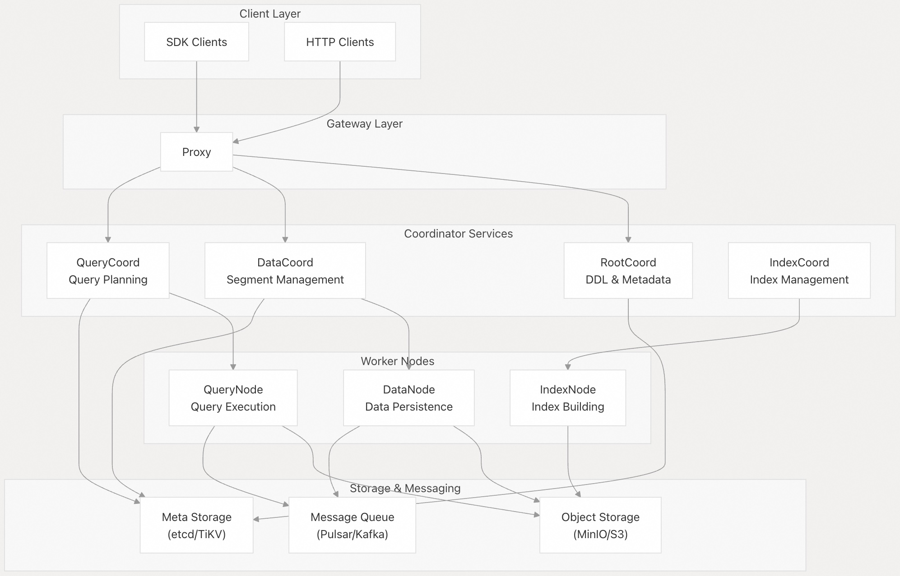
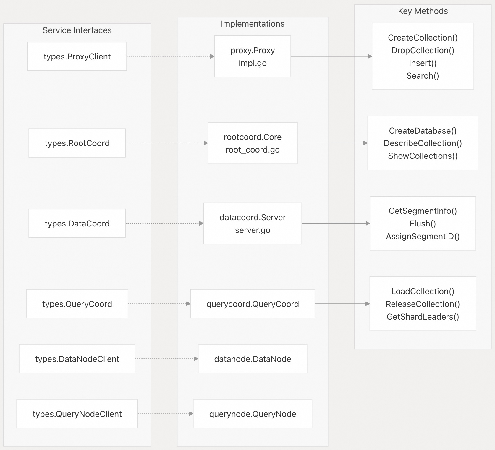
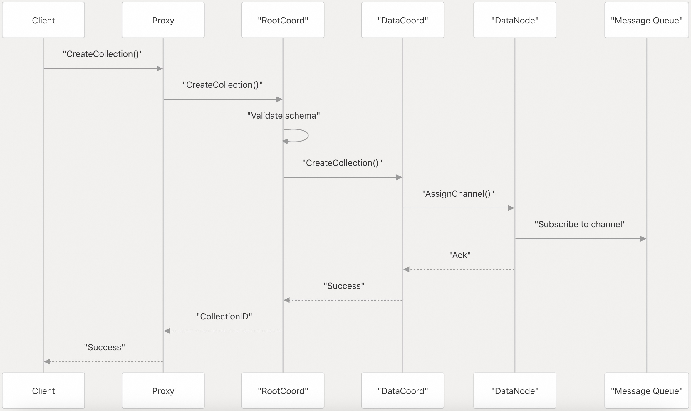

## Milvus 源码学习: 2 核心组件(Core Components)    
                    
### 作者                   
digoal                  
                 
### 日期                
2025-10-24                
                  
### 标签                  
Milvus , 源码学习                   
                  
----                  
                  
## 背景              
本文介绍 Milvus 的核心微服务及其在分布式向量数据库架构中的职责。涵盖构成 Milvus 运作支柱的基础协调器和工作节点组件。  
  
## 架构概览  
  
Milvus 遵循云原生微服务架构，其中不同的组件负责特定的职责。该系统设计清晰地分离为管理元数据和编排的协调服务(coordination services)，以及处理计算和数据处理的工作节点(worker nodes)。  
  
  
  
**来源:** [`internal/proxy/impl.go 1-70`](https://github.com/milvus-io/milvus/blob/18371773/internal/proxy/impl.go#L1-L70) [`internal/rootcoord/root_coord.go 91-133`](https://github.com/milvus-io/milvus/blob/18371773/internal/rootcoord/root_coord.go#L91-L133) [`internal/datacoord/server.go 102-171`](https://github.com/milvus-io/milvus/blob/18371773/internal/datacoord/server.go#L102-L171) [`internal/types/types.go 1-400`](https://github.com/milvus-io/milvus/blob/18371773/internal/types/types.go#L1-L400)  
  
## 核心服务类型  
  
下图将 Milvus 核心组件映射到它们主要的 Go 实现和关键接口：  
  
  
  
**来源:** [`internal/types/types.go 50-400`](https://github.com/milvus-io/milvus/blob/18371773/internal/types/types.go#L50-L400) [`internal/proxy/impl.go 72-100`](https://github.com/milvus-io/milvus/blob/18371773/internal/proxy/impl.go#L72-L100) [`internal/rootcoord/root_coord.go 91-133`](https://github.com/milvus-io/milvus/blob/18371773/internal/rootcoord/root_coord.go#L91-L133) [`internal/datacoord/server.go 102-171`](https://github.com/milvus-io/milvus/blob/18371773/internal/datacoord/server.go#L102-L171)  
  
## 组件职责  
  
### Proxy 服务  
  
`Proxy` 作为无状态网关和服务入口点，处理所有客户端请求。它负责认证、请求路由和协议转换。  
  
| 职责 | 实现 | 关键方法 |  
| :--- | :--- | :--- |  
| 客户端 API 网关 | `proxy.Proxy` | `CreateCollection()`、`Search()`、`Insert()` |  
| 认证和授权 | `proxy.Proxy` | 认证中间件 |  
| 请求路由 | `proxy.Proxy` | 路由到适当的协调器 |  
| 速率限制 | `proxy.Proxy` | 内置速率限制 |  
| 元数据缓存 | `globalMetaCache` | Collection schema 缓存 |  
  
**来源:** [`internal/proxy/impl.go 233-805`](https://github.com/milvus-io/milvus/blob/18371773/internal/proxy/impl.go#L233-L805)  
  
### Root 协调器 (RootCoord)  
  
`RootCoord` 管理集群元数据、数据库和 collection schema，并处理所有 DDL（数据定义语言）操作。  
  
| 职责 | 实现 | 关键组件 |  
| :--- | :--- | :--- |  
| 元数据管理 | `rootcoord.Core` | `meta IMetaTable` |  
| DDL 操作 | `rootcoord.Core` | `scheduler IScheduler` |  
| ID 分配 | `rootcoord.Core` | `idAllocator allocator.Interface` |  
| 时间戳服务 | `rootcoord.Core` | `tsoAllocator tso2.Allocator` |  
| 配额管理 | `rootcoord.Core` | `quotaCenter *QuotaCenter` |  
  
**来源:** [`internal/rootcoord/root_coord.go 91-133`](https://github.com/milvus-io/milvus/blob/18371773/internal/rootcoord/root_coord.go#L91-L133) [`internal/rootcoord/meta_table.go 1-100`](https://github.com/milvus-io/milvus/blob/18371773/internal/rootcoord/meta_table.go#L1-L100)  
  
### Data 协调器 (DataCoord)  
  
`DataCoord` 管理数据段（segment）、协调数据持久化并处理压缩（compaction）操作。  
  
| 职责 | 实现 | 关键组件 |  
| :--- | :--- | :--- |  
| Segment 管理 | `datacoord.Server` | `segmentManager Manager` |  
| Data Node 协调 | `datacoord.Server` | `cluster Cluster` |  
| 压缩管理 | `datacoord.Server` | `compactionTrigger trigger` |  
| 垃圾回收 | `datacoord.Server` | `garbageCollector *garbageCollector` |  
| Channel 管理 | `datacoord.Server` | `channelManager ChannelManager` |  
  
**来源:** [`internal/datacoord/server.go 102-171`](https://github.com/milvus-io/milvus/blob/18371773/internal/datacoord/server.go#L102-L171) [`internal/datacoord/services.go 17-56`](https://github.com/milvus-io/milvus/blob/18371773/internal/datacoord/services.go#L17-L56)  
  
### Query 协调器 (QueryCoord)  
  
`QueryCoord` 管理查询执行计划、协调 QueryNodes 并处理查询的数据分布。  
  
| 职责 | 实现 | 关键功能 |  
| :--- | :--- | :--- |  
| 查询规划 | `QueryCoord` | 负载均衡和查询分布 |  
| 节点管理 | `QueryCoord` | QueryNode 生命周期管理 |  
| Collection 加载 | `QueryCoord` | 将 collections 加载到内存 |  
| Shard 管理 | `QueryCoord` | 查询 shard leader 管理 |  
  
**来源:** [`internal/types/types.go 200-250`](https://github.com/milvus-io/milvus/blob/18371773/internal/types/types.go#L200-L250)  
  
## 组件间通信(Inter-Component Communication)  
  
组件通过明确定义的 gRPC 接口和消息队列进行通信：  
  
  
  
### 通信模式  
  
| 模式 | 组件 | 协议 | 用途 |  
| :--- | :--- | :--- | :--- |  
| 请求-响应(Request-Response) | Proxy ↔ Coordinators | gRPC | 同步操作 |  
| 事件流 | DataNode ↔ Message Queue | Pulsar/Kafka | 数据流事件 |  
| 服务发现 | 所有组件 | etcd | 组件注册 |  
| 心跳(Heartbeat) | 工作节点 → Coordinators | gRPC | 健康监测 |  
  
**来源:** [`internal/datacoord/services.go 58-113`](https://github.com/milvus-io/milvus/blob/18371773/internal/datacoord/services.go#L58-L113) [`internal/rootcoord/root_coord.go 165-213`](https://github.com/milvus-io/milvus/blob/18371773/internal/rootcoord/root_coord.go#L165-L213)  
  
## 状态管理  
  
每个组件维护特定的状态信息：  
  
### Proxy 状态  
  
* 元数据缓存 (`globalMetaCache`)  
* 连接管理  
* 速率限制计数器  
  
### RootCoord 状态  
  
* Collection 和 partition 元数据  
* 用户和角色信息  
* 全局 ID 分配状态  
* TSO（时间戳预言机）状态  
  
### DataCoord 状态  
  
* Segment 元数据和生命周期  
* Channel 到 DataNode 的分配  
* 压缩任务状态  
* 垃圾回收跟踪  
  
### 工作节点状态(Worker Node State)  
  
* 本地数据段 (DataNode)  
* 已加载的 collections 和 partitions (QueryNode)  
* 索引构建进度 (IndexNode)  
  
**来源:** [`internal/rootcoord/root_coord.go 91-133`](https://github.com/milvus-io/milvus/blob/18371773/internal/rootcoord/root_coord.go#L91-L133) [`internal/datacoord/server.go 102-171`](https://github.com/milvus-io/milvus/blob/18371773/internal/datacoord/server.go#L102-L171) [`internal/datacoord/meta.go 85-106`](https://github.com/milvus-io/milvus/blob/18371773/internal/datacoord/meta.go#L85-L106)  
      
#### [期望 PostgreSQL|开源PolarDB 增加什么功能?](https://github.com/digoal/blog/issues/76 "269ac3d1c492e938c0191101c7238216")
  
  
#### [PolarDB 开源数据库](https://openpolardb.com/home "57258f76c37864c6e6d23383d05714ea")
  
  
#### [PolarDB 学习图谱](https://www.aliyun.com/database/openpolardb/activity "8642f60e04ed0c814bf9cb9677976bd4")
  
  
#### [PostgreSQL 解决方案集合](../201706/20170601_02.md "40cff096e9ed7122c512b35d8561d9c8")
  
  
#### [德哥 / digoal's Github - 公益是一辈子的事.](https://github.com/digoal/blog/blob/master/README.md "22709685feb7cab07d30f30387f0a9ae")
  
  
#### [About 德哥](https://github.com/digoal/blog/blob/master/me/readme.md "a37735981e7704886ffd590565582dd0")
  
  

  
