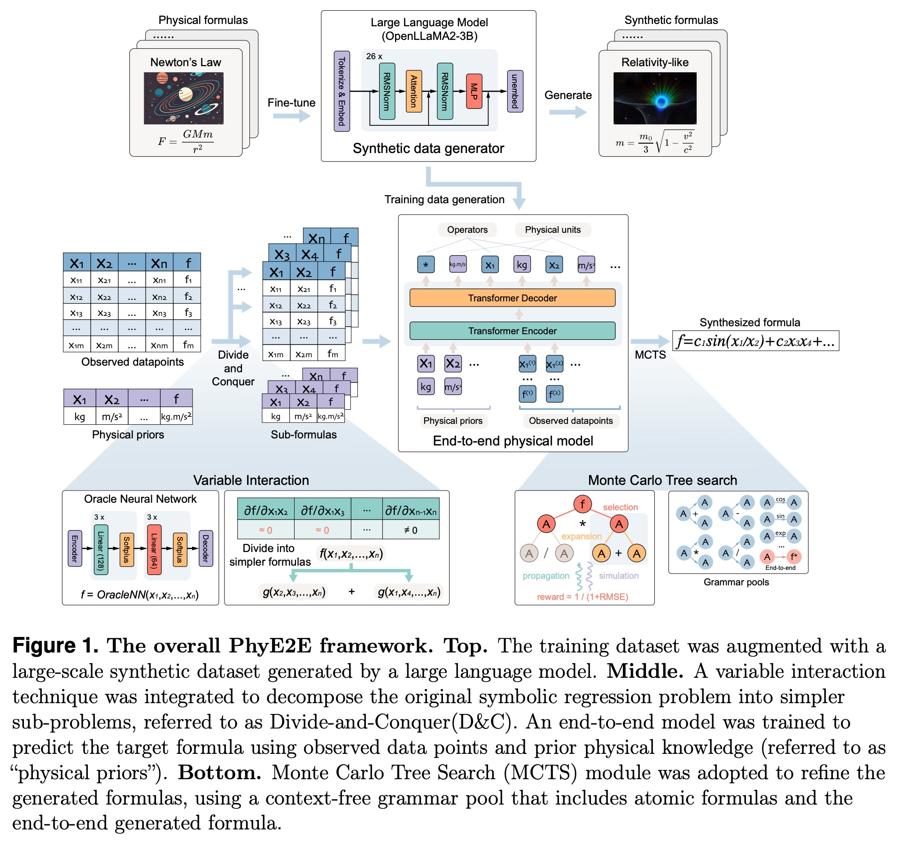
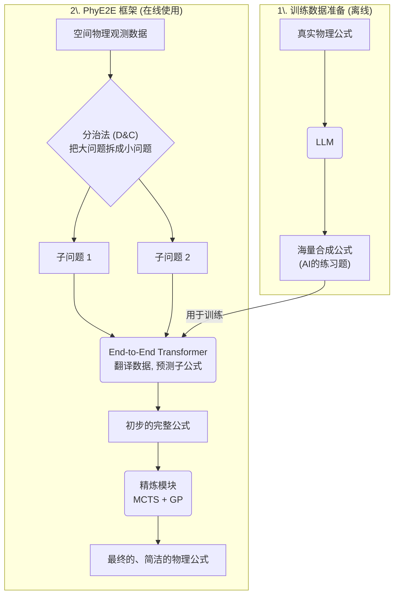
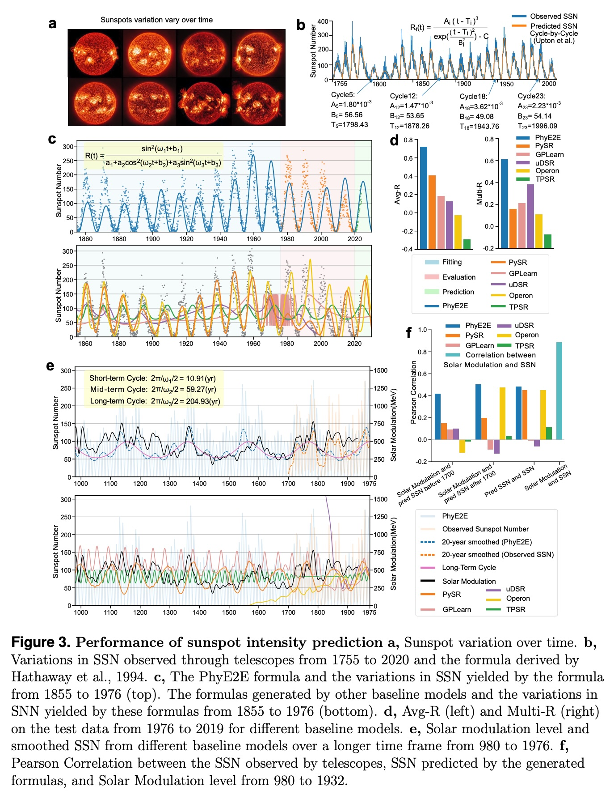
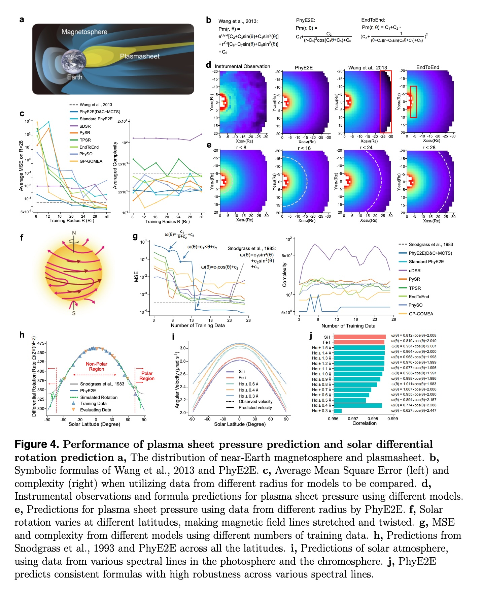
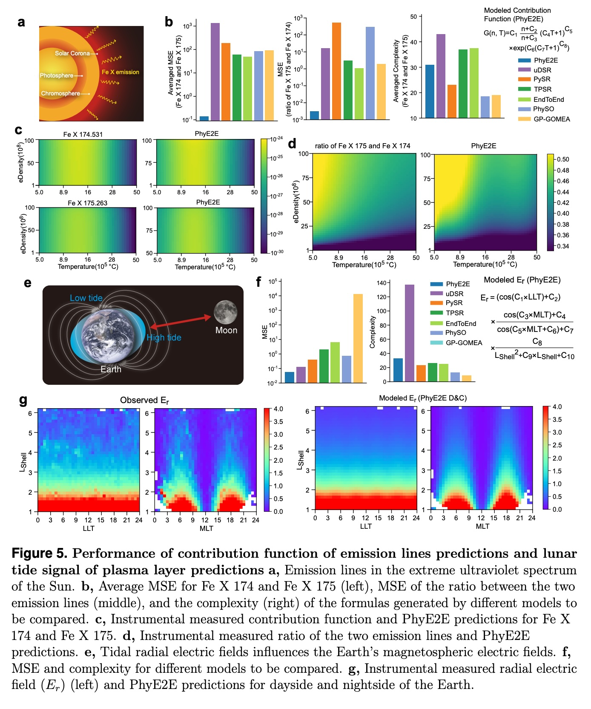
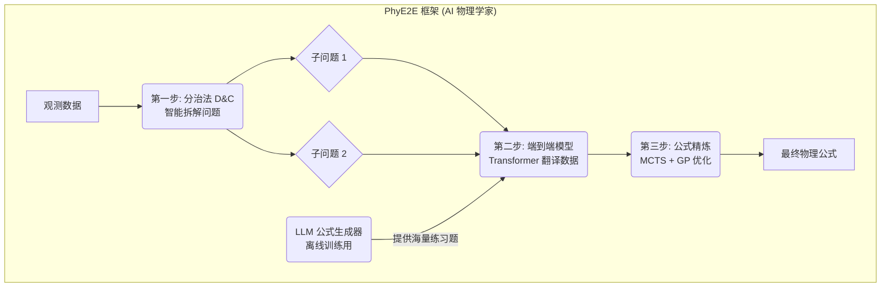

## AI论文解读 | A Neural Symbolic Model for Space Physics
        
### 作者        
digoal        
        
### 日期        
2025-10-26        
        
### 标签        
PostgreSQL , PolarDB , DuckDB , AI , 论文解读        
        
----        
        
## 背景  
      
https://arxiv.org/pdf/2503.07994v2        
  
提示:          
```          
读懂《A Neural Symbolic Model for Space Physics》这篇论文需要提前掌握哪些基础知识, 请使用中文通熟易懂的讲解这些基础知识, 可以引用论文中的图、表或使用Markdown支持的图形(text,mermaid等)增加解释性. 
  
使用中文通熟易懂的解读《A Neural Symbolic Model for Space Physics》这篇论文, 其中的关键内容请着重讲解, 可以引用论文中的图、表或使用Markdown支持的图形(text,mermaid等)增加解释性. 
  
提取《A Neural Symbolic Model for Space Physics》这篇论文中的重要术语, 使用中文对这些术语进行通熟易懂的讲解, 可以引用论文中的图、表或使用Markdown支持的图形(text,mermaid等)增加解释性. 
```     
  
## 1 前置知识 
  
要读懂这篇名为《A Neural Symbolic Model for Space Physics》（一种用于空间物理的神经符号模型）的论文 ，你需要具备三个主要领域的“跨界”基础知识： **人工智能（AI）** 、**计算机科学（算法）** 和 **物理学（特别是空间物理）** 。

这篇论文的核心目标是，开发一个名叫 **PhyE2E** 的 AI 框架 ，它能像科学家一样，从观测数据中自动“发现”或“推导”出有意义的物理公式 。

下面我将用通俗易懂的方式，为你讲解阅读这篇论文所需的关键基础知识。

-----

### 领域一：人工智能 (AI) 与机器学习 (Machine Learning)

这是论文的“方法论核心”，即“Neural (神经)”这个词的来源。你需要了解 AI 是如何“学习”的。

#### 1\. 神经网络 (Neural Networks)

  * **它是什么？** 神经网络是 AI 的一种，它模仿人脑神经元的工作方式。你可以把它想象成一个极其复杂的“黑盒”函数。你给它输入数据（比如一堆 $(x, y)$ 数据点），它会调整内部无数个参数，直到它能准确地预测 $y$ 。
  * **论文中的应用：** 论文使用神经网络来拟合数据，并通过分析其“二阶导数”（即变化率的变化率）来分解复杂的物理问题 。

#### 2\. Transformer (变换器) 模型

  * **它是什么？** 这是 AI 领域一个革命性的模型，也是 ChatGPT 等工具的核心。Transformer 极其擅长处理“序列”信息。最经典的例子是语言翻译：它读取一个序列（一句法语），然后生成另一个序列（一句英语）。

  * **论文中的应用：** PhyE2E 框架巧妙地将“发现公式”看作一个“翻译”任务 。它训练 Transformer 模型  读取一个“数据序列”（观测到的数字），然后“翻译”并生成一个“符号序列”（即物理公式，比如 `+`、`x`、`2`、`sin` 等符号组成的字符串）。

    ```mermaid
    graph LR
        A["观测数据 (序列)"] -- "Transformer (翻译)" --> B["符号公式 (序列)<br>例如: f(x) = x² + c"];
    ```

#### 3\. 大型语言模型 (Large Language Models, LLMs)

  * **它是什么？** 你可以将其理解为“超大号”的 Transformer，比如 OpenLLaMA2-3B 。它们通过阅读海量互联网文本学会了语言、知识和推理。
  * **论文中的应用：** AI 训练需要海量数据。但人类发现的物理公式相对较少 。作者们想出了一个绝妙的办法：他们用已知的物理公式（比如来自“费曼物理学讲座”的公式 ）去“微调”一个 LLM，教会它“物理公式的风格” 。然后，他们让这个 LLM *生成了 26 万多个“看起来像真物理”的合成公式* 。这样，他们的主模型（Transformer）就有了足够的“练习题”来进行训练 。这一步显示在论文的图 1 顶部 (Fig. 1 top) 。    

-----

### 领域二：计算机科学 (Computer Science) 与算法

这是论文“解决问题”的“工具箱”，即“Symbolic (符号)”这个词的来源。

#### 1\. 符号回归 (Symbolic Regression, SR)

  * **它是什么？** 这是本文要解决的核心问题 。
  * **通俗解释：**
      * **普通回归 (Regression)：** 你 *先假定* 公式是 $y = mx + b$ ，然后 AI 帮你找出最好的 $m$ 和 $b$ 。公式的 *结构* 是固定的。
      * **符号回归 (Symbolic Regression)：** 你 *什么都不假定*。AI 需要自己去“探索”公式的结构，它要自己决定是用 $y = x^2$ 、 $y = \sin(x)$ 还是 $y = a \cdot \exp(-bx)$ 。这比普通回归难得多，因为可能的公式组合是无限的。

#### 2\. 遗传编程 (Genetic Programming, GP)

  * **它是什么？** 一种受“进化论”启发的搜索算法，论文用它来“精炼”公式 。
  * **通俗解释：** 想象一下“公式的适者生存”：
    1.  **创造：** 随机生成 100 个不同的公式（比如 $x+y$ 、 $x^2$ 、 $\sin(y/x)$ ...）。
    2.  **评估：** 看看哪个公式能最好地拟合观测数据。
    3.  **繁殖/变异：** 保留那些“好”的公式，让它们“杂交”（ 比如把 $x^2$ 和 $\sin(y)$ 组合成 $x^2 + \sin(y)$ ）或“变异”（ 比如把 $x^2$ 变成 $x^3$ ）。
    4.  **淘汰：** 淘汰掉“差”的公式。
    5.  **重复** 上述过程几百代，最后“幸存”下来的就是最强的公式。

#### 3\. 蒙特卡洛树搜索 (Monte-Carlo Tree Search, MCTS)

  * **它是什么？** 另一种强大的搜索算法，常用于 AI 下棋（比如 AlphaGo）。论文也用它来“精炼”公式 。
  * **通俗解释：** 它像是在“探索”一棵“公式决策树”。
      * 从一个空的公式开始（根节点）。
      * 第一个决策点：是加法、乘法还是 $\sin$ ？（树的分支）。
      * 如果选了加法，第二个决策点：加号左边是 $x$ 还是 $y$ ？
      * MCTS 会“随机模拟”很多次，看看沿着哪些“分支”走下去（比如“先+再\*”）似乎最有希望得到好公式，然后它会重点探索那些“有希望”的分支 。

这篇论文的 **PhyE2E 框架** 巧妙地结合了以上所有技术，你可以通过下面的流程图（简化自论文图 1）来理解：



-----

### 领域三：物理学 (Physics)

这是论文的“应用领域”和“检验标准”。不了解物理，你就无法判断 AI 发现的公式是“有意义的”还是“纯粹的数字巧合”。

#### 1\. 物理单位 (Physical Units)

  * **它是什么？** 物理学的基础。长度（米）、时间（秒）、质量（千克）等。
  * **论文中的重要性：** 一个物理公式必须在“单位”上是自洽的。例如，你不能把 1 米和 1 秒直接相加。这是物理学家“与生俱来”的直觉，但 AI 很难学会 。这篇论文的 **PhyE2E 模型一个关键优势就是它在训练中考虑了物理单位** ，因此它生成的公式在物理单位上是正确的（准确率达 99.27% ）。

#### 2\. 空间物理学 (Space Physics) 概念

你需要对论文中提到的几个“应用案例”  有个大概了解，这些案例是用来证明 PhyE2E 有多强大的：

  * **太阳黑子 (Sunspot) 预测 (图 3 )：** 太阳黑子是太阳活动的标志，它有一个大约 11 年的周期 。PhyE2E 通过 400 年的数据，不仅发现了这个 11 年周期，还发现了 59 年和 205 年的更长周期 。    
  * **等离子体 (Plasma) 压力 (图 4 )：** 地球周围的空间（磁层）充满了等离子体（一种带电气体）。PhyE2E 发现了一个公式，描述了等离子体压力 $P$ 随距离 $r$ 的衰减关系 $P \propto r^2$ 。    
  * **太阳谱线 (Emission Lines) (图 5 )：** 太阳高温大气（日冕）会发出特定波长的光（谱线）。PhyE2E 发现了一个公式，能通过温度和电子密度，准确预测这些谱线的强度 。    

### 总结

要读懂这篇论文，你不需要成为三个领域的专家，但你需要：

1.  **（AI 基础）** 知道 **Transformer** 是一个“序列翻译”模型，而 **LLM** 可以用来“生成训练数据”。
2.  **（算法基础）** 理解 **符号回归** 是在“寻找公式结构”，而 **GP** 和 **MCTS** 是实现这种搜索的“进化”和“下棋”策略。
3.  **（物理基础）** 明白 **物理单位** 对公式至关重要，并对 **太阳黑子**、**等离子体** 等空间物理名词有个基本印象。
  
## 2 解读论文 
  
好的，很高兴为你解读这篇论文。

这是一篇非常有意思的“跨界”研究，它结合了最前沿的人工智能（AI）技术和专业的空间物理学，试图解决一个古老而核心的科学问题：**我们能否让 AI 像科学家一样，从观测数据中自动“发现”物理定律？** 

简单来说，这篇论文介绍了一个名为 **PhyE2E** 的新型 AI 框架 ，它就像一个“AI 物理学家”，专门被训练用来寻找隐藏在空间物理数据背后的数学公式 。

下面，我将为你重点讲解这篇论文的关键内容。

-----

### 1\. 核心挑战：AI 发现公式为什么这么难？

传统的 AI（如神经网络）非常擅长“拟合”数据，你给它数据，它能给你一个预测结果。但它给你的通常是一个极其复杂的“黑盒” ，你根本不知道里面是什么。

而科学家追求的是**简洁、可解释的“符号公式”** ，比如 $E=mc^2$ 。这个过程被称为“符号回归”（Symbolic Regression）。

“符号回归”的挑战在于“搜索空间”是无限的 。公式可能是 $x^2$ ，也可能是 $\sin(\log(y/x)) + z^3$ ，AI 怎么知道该从哪里找起呢？

### 2\. 关键创新：PhyE2E 框架是如何工作的？

这篇论文的**最大亮点**就是他们设计的 **PhyE2E** 框架。你可以把它理解为一个高度智能的“公式发现流水线”。

这套流水线（见论文图 1）主要由 4 个巧妙的部件组成：    



下面我们来逐一讲解这几个关键部件：

#### 关键点 1：用 LLM (大语言模型) 解决“数据饥饿”

  * **问题：** 训练 AI 需要海量数据，但人类发现的物理公式总共也没多少，AI“练习题”不够怎么办？
  * **PhyE2E 的妙招：** 他们找来一个大语言模型（OpenLLaMA2-3B），先用已知的真实物理公式（比如费曼物理学讲座里的公式）对它进行“微调”，教会它“物理公式的文法和风格” 。
  * **结果：** 这个 LLM 学会了举一反三，**自动生成了 26 万多个“看起来像真的”物理公式** 。这样，AI 就有了足够多的“练习题”来进行训练。

#### 关键点 2：用 Transformer (翻译模型) 解决“公式生成”

  * **问题：** AI 怎么把一堆数字“变成”一个公式？
  * **PhyE2E 的妙招：** 他们使用了 Transformer 架构（ChatGPT 的核心技术）。他们把这个任务当成一个“翻译”任务 ：
      * “源语言” = 观测数据点
      * “目标语言” = 物理公式的符号（比如 `+`, `sin`, `x`, `2`...）
  * **结果：** Transformer 模型学会了读取数据，然后“翻译”出一串最有可能是正确答案的数学符号 。

#### 关键点 3：用“分治法” (D\&C) 解决“问题复杂度”（核心创新）

这是 PhyE2E 最聪明的地方之一。

  * **问题：** 真实的物理问题可能非常复杂，比如一个公式 $f = A(x, y) + B(z)$ ，AI 很难一次性把它找出来。

  * **PhyE2E 的妙招：** 它先用一个神经网络去拟合数据，然后通过分析这个网络的“二阶导数”来判断：**哪些变量之间是“非线性耦合”的，哪些是“可分离”的？** 。

  * **结果：** 比如，AI 发现 $x$ 和 $y$ 关系密切，但它们和 $z$ 关系不大。于是它会自动把一个复杂的大问题，拆解成两个简单的小问题：先找出 $A(x, y)$ ，再找出 $B(z)$ ，最后把它们加起来 。

    ```mermaid
    graph LR
        A["复杂问题<br>f(x, y, z)"] -- "D&C 模块分析" --> B(发现 x,y 耦合<br>z 独立);
        B --> C["子问题1: f1(x, y)"];
        B --> D["子问题2: f2(z)"];
        C --> E(E2E 模型);
        D --> E(E2E 模型);
        E -- "合并" --> F["最终公式<br>f = f1(x, y) + f2(z)"];
    ```

#### 关键点 4：用 MCTS 和 GP 解决“公式精炼”

  * **问题：** Transformer“翻译”出的公式可能只是一个“初步草稿”，还不够完美。
  * **PhyE2E 的妙招：** 它在最后一步引入了两种经典的搜索算法：蒙特卡洛树搜索 (MCTS，AlphaGo 也用它) 和遗传编程 (GP) 。
  * **结果：** 这两个“精炼器”会对“公式草稿”进行各种“变异”和“进化”，保留好的部分、剔除坏的部分，最终“打磨”出一个在数据拟合精度和简洁度上都最优的公式 。

-----

### 3\. 实验结果：PhyE2E 真的发现新东西了吗？

这篇论文最令人兴奋的是后半部分的应用。PhyE2E **不需要针对新问题重新训练**，可以直接拿去解决真实的物理难题 。

作者们在 5 个真实的空间物理应用中““考验”了 PhyE2E，结果非常惊艳：

1.  **预测太阳黑子周期 (图 3)：**    

      * **PhyE2E 的发现：** 它不仅准确拟合了已知的 11 年太阳活动周期，还从数据中“挖”出了两个更长的周期：**59.27 年和 204.93 年** 。
      * **意义：** 59 年的周期与中国古代的“六十甲子”天文历法惊人地吻合 。这个结果是 AI 从数据中直接推导出来的，为太阳的长期活动提供了新的见解 。

2.  **拟合地球等离子体压力 (图 4)：**    

      * **PhyE2E 的发现：** 之前科学家用一个包含 9 个常数和指数项的复杂公式 。PhyE2E 找到了一个**更简洁、物理意义更明确**的公式，揭示了等离子体压力 $P$ 随地球距离 $r$ 的衰减关系大致为 $P \propto r^2$ 。
      * **意义：** 这个 $r^2$ 的关系可以被后续的物理理论（比如磁压和等离子体 beta 值）所验证 ，证明 AI 找到的不是数字巧合，而是真实的物理规律。

3.  **预测太阳自转速度 (图 4)：**

      * **PhyE2E 的发现：** 它用极少的数据（仅 14 个点）就推导出了太阳自转角速度随纬度变化的公式 。
      * **意义：** 当与最先进的超级计算机模拟数据（来自日本“富岳”超算）对比时，PhyE2E 的公式在太阳两极地区的**预测表现超过了人类科学家之前提出的经典公式** 。

4.  **解释太阳谱线 (图 5)：**    

      * **PhyE2E 的发现：** 它找到了一个公式来描述太阳高温谱线（Fe X 174/175）的强度比率如何随温度 $T$ 和电子密度 $n$ 变化 。
      * **意义：** 关键在于，PhyE2E 找到的公式**自动地将 $T$ 和 $n$ 的项分离开来**（解耦）。这完美符合日冕物理中已知的理论：电离过程和碰撞过程是可以分开处理的 。AI 再次“独立思考”并发现了正确的物理结构。

5.  **发现月球对地球电场的影响 (图 5)：**

      * **PhyE2E 的发现：** 这是一个涉及 3 个变量（L-shell, MLT, LLT）的超级难题 。PhyE2E 的“分治法”（D\&C）模块立了大功：它自动检测到**这三个变量是相互独立的**（非耦合）。
      * **意义：** 它将一个三维难题拆解成三个一维问题 ，最终得到的公式简洁、准确 ，并且其物理含义（如电场随 L-shell 的平方衰减）与理论完全一致 。

-----

### 总结：这篇论文的价值

这篇论文的真正价值在于，它展示了一条“AI 辅助科学发现”的实用路径。

PhyE2E 框架 **不是一个“黑盒”** ，它是一个“白盒”工具。它通过巧妙地结合**大语言模型**（提供海量练习）、**Transformer**（翻译数据）、**分治法**（拆解难题）和**经典算法**（精炼结果），成功地从真实、复杂、嘈杂的观测数据中，**自动发现了简洁、准确、且具有深刻物理意义的数学公式**。

它就像一个永不疲倦的“AI 物理学家”，有潜力帮助人类科学家在海量数据中，更快地找到理解宇宙运行规律的“钥匙”。
  
## 3 术语 
  
以下是这篇论文《A Neural Symbolic Model for Space Physics》中几个最关键的术语及其通俗易懂的讲解：

### 1\. 符号回归 (Symbolic Regression, SR)

  * **它是什么？**
    这是这篇论文要解决的核心问题 。

  * **通俗讲解：**
    想象一下你有一堆 $(x, y)$ 数据点。

      * **普通回归 (Regression)：** 你 *事先假设* 它们的关系是一个直线（ $y = ax + b$ ），然后让 AI 帮你找出最好的 $a$ 和 $b$ 。在这里，公式的“结构”（ $ax+b$ ）是你定的。
      * **符号回归 (SR)：** 你 *什么都不假设*。你只是把数据扔给 AI，让 AI 自己去“发现”公式的结构。它需要自己决定是用 $y = x^2$ ，还是 $y = \sin(x)$ ，还是 $y = \frac{a}{x} + b$ 。

    简而言之，SR 的目标是让 AI 像科学家一样，**自动从数据中“发现”数学公式本身**。

### 2\. PhyE2E

  * **它是什么？**
    作者们开发的这套新型 AI 框架的名字 。
  * **通俗讲解：**
    "Phy" 代表物理 (Physics)，"E2E" 代表“端到端” (End-to-End)。
    这个名字的含义是：这是一个专门为“物理”设计的，能够“端到端”（从原始数据一步到位）直接产生“物理公式”的 AI 系统。

### 3\. 端到端 (End-to-End, E2E) Transformer

  * **它是什么？**
    PhyE2E 框架的核心“引擎” 。

  * **通俗讲解：**

      * **Transformer (变换器)：** 这是目前 AI 领域最强大的架构之一，ChatGPT 和许多 AI 翻译软件的核心就是它。它极其擅长处理“序列”信息，比如把一个法语句子（序列）翻译成一个英语句子（序列）。
      * **E2E (端到端)：** 意味着它能“一步到位”完成任务，中间不需要人为干预 。

    在这篇论文中，作者巧妙地把“发现公式”变成了一个“翻译”任务：

    ```mermaid
    graph LR
        A["观测数据<br>(一长串数字序列)"] -- "PhyE2E 的 Transformer 引擎" --> B["物理公式<br>(一长串符号序列, 如 'sin', 'x', '+', 'c')"];
    ```

    AI 被训练来读取“数据”这种语言，然后把它“翻译”成“数学公式”这种语言 。

### 4\. 大型语言模型 (Large Language Model, LLM)

  * **它是什么？**
    指类似 ChatGPT 或 LLaMA 这样的大型 AI 模型 。

  * **通俗讲解：**
    训练 AI“翻译”公式需要海量的“练习题”（公式和对应的数据）。但人类发现的物理公式数量是有限的。

    作者的妙招是：他们用已知的真实物理公式去“微调”（Fine-tune）一个 LLM，教会它“物理公式的风格和语法”。然后，他们让这个 LLM **“合成”了 26 万多个“看起来像真物理”的公式**，作为“练习题”来训练 PhyE2E 。

    这就像（见论文图 1 顶部 ）：    

    1.  用《莎士比亚全集》教会 AI 莎士比亚的文风。
    2.  让 AI 自动写出 100 万篇“莎士比亚风格”的新文章来。

### 5\. 分治法 (Divide-and-Conquer, D\&C)

  * **它是什么？**
    PhyE2E 框架中一个极其聪明的核心策略，用于“拆解”复杂问题 。

  * **通俗讲解：**
    如果一个物理问题太复杂，比如 $f(x, y, z) = \sin(x \cdot y) + z^2$ ，让 AI 一次性猜对太难了。

    PhyE2E 的 D\&C 策略（见论文图 1 左下 ）会这样做：

    1.  它先训练一个“神谕神经网络” (Oracle Neural Network) 来拟合数据 。
    2.  然后，它通过分析这个网络的“二阶导数”（Hessian 矩阵） 来判断：哪些变量是“紧密耦合”的（ 比如 $x$ 和 $y$ ），哪些是“独立可分离”的（ 比如 $z$ ）。
    3.  一旦发现 $z$ 和 $(x, y)$ 是可分离的，它就会把一个“三变量难题”拆解成两个“小问题”：一个是 $g(x, y)$ ，另一个是 $h(z)$ 。

    这种“拆解”大大降低了 AI 寻找公式的难度 。

### 6\. 遗传编程 (GP) 与蒙特卡洛树搜索 (MCTS)

  * **它们是什么？**
    两种经典的 AI 搜索算法，被 PhyE2E 用作“精炼模块” 。

  * **通俗讲解：**
    Transformer“翻译”出的公式可能只是一个还不错的“草稿”。GP 和 MCTS 负责“打磨”这个草稿。

      * **GP (遗传编程)：** 模拟“生物进化” 。它会随机组合、变异公式的各个部分，拟合得好的“公式后代”被保留，拟合得差的被“淘汰”。
      * **MCTS (蒙特卡洛树搜索)：** 模拟 AI“下棋”（AlphaGo 就用它）。它会探索构建公式的每一步（比如是先用 `+` 还是 `*`），并评估哪条“路径”最有希望得到好公式。

    这两个工具（见论文图 1 右下 ）确保了 PhyE2E 最终找到的公式不仅准确，而且尽可能简洁。

### 7\. 物理单位 (Physical Units)

  * **它是什么？**
    物理学的基本约束，比如米（长度）、秒（时间）、千克（质量）。

  * **通俗讲解：**
    一个物理公式必须在“单位”上是自洽的（比如，你不能把“1米”和“1秒”直接相加）。

    这是传统符号回归的巨大难点，但却是 **PhyE2E 的一个核心优势**。它在训练时就**明确地考虑了物理单位** 。因此，它生成的公式不仅在数学上是对的，在物理上也是有意义的，其单位准确率高达 99.27% 。
  
## 参考        
         
https://arxiv.org/pdf/2503.07994v2    
        
<b> 以上内容基于DeepSeek、Qwen、Gemini及诸多AI生成, 轻微人工调整, 感谢杭州深度求索人工智能、阿里云、Google等公司. </b>        
        
<b> AI 生成的内容请自行辨别正确性, 当然也多了些许踩坑的乐趣, 毕竟冒险是每个男人的天性.  </b>        
    
#### [期望 PostgreSQL|开源PolarDB 增加什么功能?](https://github.com/digoal/blog/issues/76 "269ac3d1c492e938c0191101c7238216")
  
  
#### [PolarDB 开源数据库](https://openpolardb.com/home "57258f76c37864c6e6d23383d05714ea")
  
  
#### [PolarDB 学习图谱](https://www.aliyun.com/database/openpolardb/activity "8642f60e04ed0c814bf9cb9677976bd4")
  
  
#### [PostgreSQL 解决方案集合](../201706/20170601_02.md "40cff096e9ed7122c512b35d8561d9c8")
  
  
#### [德哥 / digoal's Github - 公益是一辈子的事.](https://github.com/digoal/blog/blob/master/README.md "22709685feb7cab07d30f30387f0a9ae")
  
  
#### [About 德哥](https://github.com/digoal/blog/blob/master/me/readme.md "a37735981e7704886ffd590565582dd0")
  
  

  
