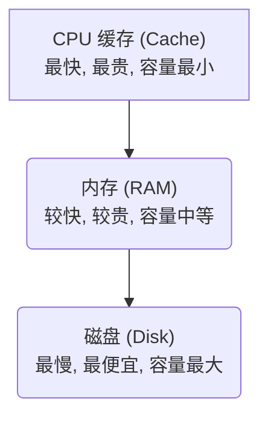
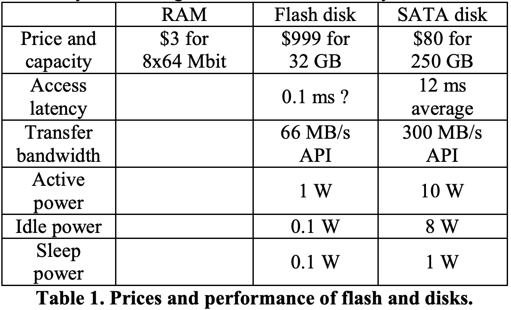
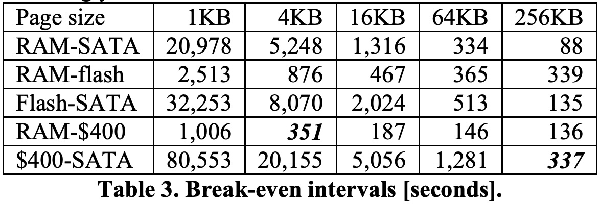
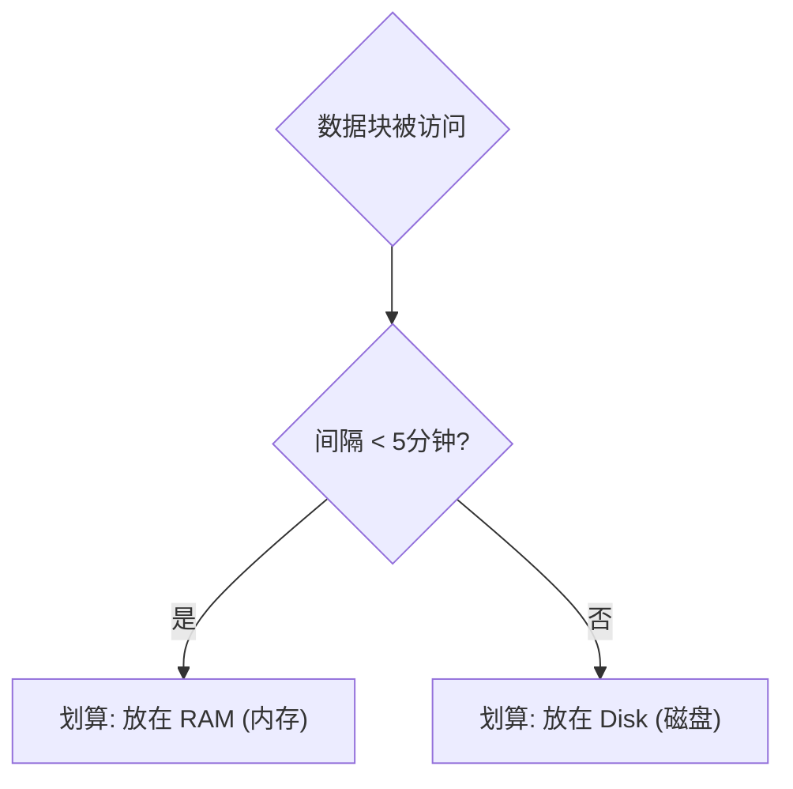
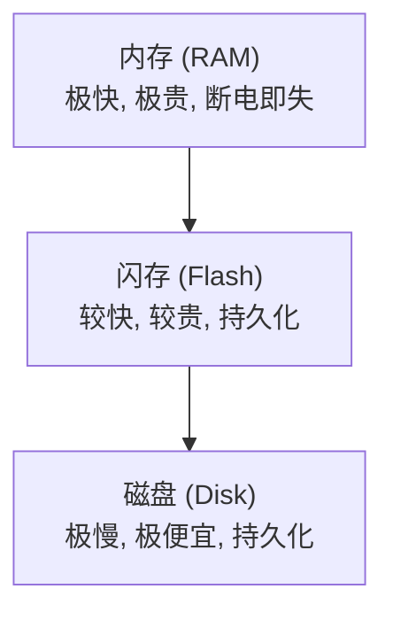
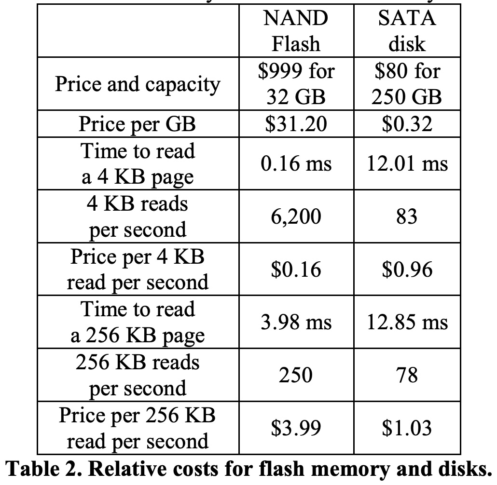
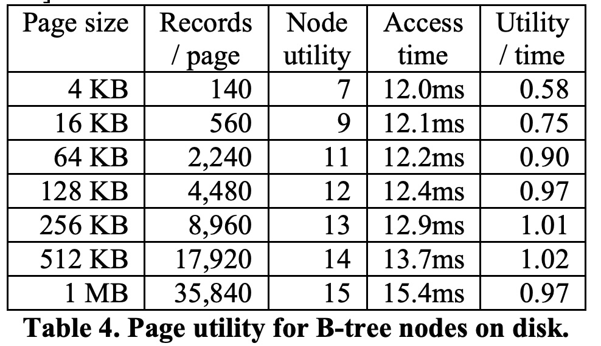
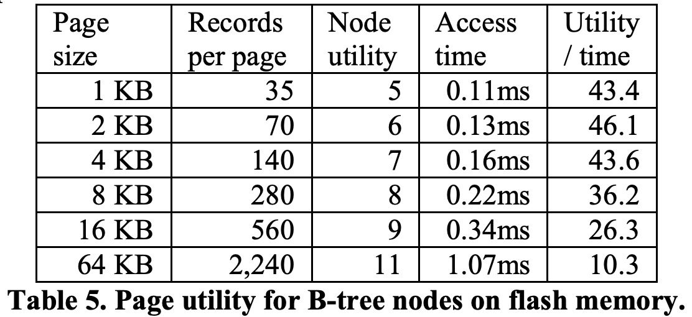
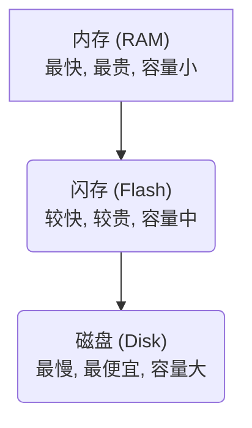

## AI论文解读 | The five-minute rule twenty years later, and how flash memory changes the rules
        
### 作者        
digoal        
        
### 日期        
2025-10-27        
        
### 标签        
PostgreSQL , PolarDB , DuckDB , AI , 论文解读        
        
----        
        
## 背景  
      
https://dl.acm.org/doi/pdf/10.1145/1363189.1363198        
  
提示:          
```          
读懂《The five-minute rule twenty years later, and how flash memory changes the rules》这篇论文需要提前掌握哪些基础知识, 请使用中文通熟易懂的讲解这些基础知识, 可以引用论文中的图、表或使用Markdown支持的图形(text,mermaid等)增加解释性. 
  
使用中文通熟易懂的解读《The five-minute rule twenty years later, and how flash memory changes the rules》这篇论文, 其中的关键内容请着重讲解, 可以引用论文中的图、表或使用Markdown支持的图形(text,mermaid等)增加解释性. 
  
提取《The five-minute rule twenty years later, and how flash memory changes the rules》这篇论文中的重要术语, 使用中文对这些术语进行通熟易懂的讲解, 可以引用论文中的图、表或使用Markdown支持的图形(text,mermaid等)增加解释性. 
```     
  
## 1 前置知识 
  
理解这篇论文  需要一些关于计算机系统、数据库和存储技术的基础知识。这篇论文的核心是探讨一种经典的性能优化法则（五分钟法则）在引入了“闪存 (Flash Memory)”这一新技术后所发生的变化。

以下是帮助你理解这篇论文所需的基础知识，我会用通俗的语言来解释：

### 1\. 计算机存储金字塔 (Storage Hierarchy)

你需要理解计算机的存储系统是分“等级”的，就像一个金字塔。

  * **塔尖：** CPU 缓存 (Cache)。速度最快，但容量极小，而且非常昂贵。
  * **中间：** 内存 (RAM)。速度很快，容量中等，价格较贵。CPU 可以直接访问。
  * **塔底：** 磁盘 (Disk)。速度最慢，但容量巨大，而且非常便宜。

这个金字塔的基本法则是：**速度越快，每 GB 的价格越贵，容量也越小。**



**论文的切入点：** 闪存 (Flash Memory)  完美地插入到了内存 (RAM) 和磁盘 (Disk) 之间。它比 RAM 慢但比磁盘快，比 RAM 便宜但比磁盘贵 。这就把传统的“三层金字塔”变成了“四层”，论文就是要研究这个新夹层带来的影响。

### 2\. 核心矛盾：I/O 瓶颈

“I/O” 指的是输入/输出 (Input/Output)，在本文中主要指代从磁盘读取或写入数据。

计算机的 CPU（大脑）计算速度极快，但传统的机械磁盘（像老式唱片机）需要机械臂（磁头）移动到指定位置去“找”数据，这个“找”的过程非常非常慢。

这就导致了 **I/O 瓶颈**：CPU 经常需要停下来，啥也不干，就干等着磁盘把数据读进来。

为了衡量 I/O 性能，论文中（如表1 ）提到了两个关键指标：    

  * **访问延迟 (Access Latency):** 你发出“我要数据”的命令后，需要等多久才能收到*第一个*字节。这是机械磁盘的致命弱点（论文中提到磁盘是 12ms，而闪存是 0.1ms）。
  * **传输带宽 (Transfer Bandwidth):** 开始传输数据后，每秒能传多少数据。这方面磁盘其实不差 。

### 3\. “五分钟法则” (The Five-Minute Rule)

这是理解论文标题  的关键。

这是 1987 年提出的一个经典经济学法则 。它回答了一个问题：**对于一个数据块 (Page)，我应该花钱买更多内存 (RAM) 把它“常驻”在内存里，还是应该省钱，每次用的时候再花时间从磁盘 (Disk) 去读？** 

这个法则通过计算成本（买内存的钱 vs. 买磁盘I/O能力的钱）得出了一个“盈亏平衡点”时间 。

  * **法则：** 如果一个数据块的平均访问间隔**短于** 5 分钟，那么把它放在 RAM 里更划算 。
  * **反之：** 如果访问间隔**长于** 5 分钟，那每次都从磁盘去读更划算（因为它不值得占用宝贵的 RAM 空间）。

**论文的切入点：** 论文首先回顾了这个法则，发现过了20年，因为硬件价格的变化，这个“盈亏平衡点”已经不是5分钟了（对于4KB的页，变成了约90分钟）。更重要的是，引入闪存后，我们现在需要计算三个“法则”：

1.  RAM vs. 闪存 (论文计算约为 6-15 分钟) 
2.  闪存 vs. 磁盘 (论文计算约为 2.25 小时) 
3.  RAM vs. 磁盘 (论文计算约为 90 分钟) 

这些数据你可以在论文的 **表3 (Table 3)**  中找到。    

### 4\. 缓冲池 (Buffer Pool) 与 LRU 算法

系统不会傻傻地每次都从磁盘读数据。它们会在 RAM 里开辟一块空间，叫做“缓冲池” (Buffer Pool)，用来缓存（暂时存放）从磁盘读来的数据。

  * 当 CPU 需要数据时，它先去缓冲池里找。
  * **命中 (Hit)：** 找到了，皆大欢喜，直接从 RAM 读取，速度飞快。
  * **未命中 (Miss)：** 没找到，系统就必须去磁盘（或闪存）把数据读进来，放入缓冲池。

**问题来了：** 缓冲池空间是有限的。当它满了以后，再读入新数据，就必须“踢掉”一个旧的。踢掉谁呢？

这就需要**替换算法 (Replacement Algorithm)**。最常用的一种叫 **LRU (Least Recently Used)**，即“最近最少使用” 。系统会维护一个队列，谁刚被访问过，就把它放到队首；当需要踢人时，就把队尾的（即最久没被访问过的）踢出去 。

**论文的切入点：** 论文提出了两种利用闪存的架构 ：

1.  **扩展缓冲池 (Extended Buffer Pool):** 把闪存当作 RAM 的“二级缓存”。数据从 RAM 的 LRU 队尾被踢出去后，进入闪存的 LRU 队列；只有从闪存的队尾被踢出去，才最终回到磁盘 。
2.  **扩展磁盘 (Extended Disk):** 把闪存当作一个“超级快的磁盘”，它和传统磁盘一样，都是“持久化存储” 。

### 5\. 数据库 (Database) vs. 文件系统 (File System)

这是论文后半部分的核心论点 。你需要知道这两种系统在“数据可靠性”上的根本区别。

#### 数据库 (Database) 基础

数据库（如 MySQL, Oracle）是“怕死”的，它必须保证数据绝对不能丢失。它依赖两个核心机制：

1.  **B-Tree (B树):** 数据库最核心的数据结构，几乎所有的索引都用它 。它是一种树状结构，能让你在海量数据中快速定位到你要找的记录。它的特点是数据按“页” (Page) 或“节点” (Node) 来组织。
2.  **日志与检查点 (Logging & Checkpoint):**
      * **预写日志 (Write-Ahead Logging, WAL):** 当你修改数据时，数据库*不会*马上修改磁盘上的数据页（因为随机写磁盘太慢了）。它会先把你“干了什么”这件事，顺序地写入一个叫“恢复日志 (Recovery Log)”的文件里 。写日志是很快的。
      * **脏页 (Dirty Page):** 内存（缓冲池）中已经被修改，但还没被写回磁盘的数据页，被称为“脏页” 。
      * **检查点 (Checkpoint):** 数据库会定期（比如每隔几分钟）触发一个“检查点” 。这个动作会 *强制* 把内存中所有的“脏页”都写回到 *持久化存储（磁盘）* 上 。这是为了防止系统突然断电，内存里的修改全丢了。

#### 文件系统 (File System) 基础

传统的文件系统（如 Windows的FAT32/NTFS 或 Linux的ext4）在设计上主要关心“元数据” (Metadata) 的一致性（即文件名、目录结构、文件大小等不能乱），但它*通常不保证*文件*内容*的事务性（没有像数据库那样的日志和检查点机制）。

-----

### 论文的核心论证（融会贯通）

理解了以上知识后，你就能看懂论文的核心论证了：

**为什么数据库和文件系统会用不同的闪存架构？**

1.  **文件系统：应该用“扩展缓冲池” (Extended Buffer Pool)** 

      * **原因：** 文件系统没有检查点机制 。它把闪存当作一个临时的、断电即焚的“大缓存” 。如果数据在闪存里时系统崩溃了，没关系，反正磁盘上还有一份旧的、完整的 。它用闪存来加速*读取*，但不需要闪存来保证*持久性*。

2.  **数据库：应该用“扩展磁盘” (Extended Disk)** 

      * **原因：** 恰恰因为数据库有“检查点” ！
      * **反证法：** 假设数据库把闪存当作“缓冲池”。当检查点触发时，它必须把 RAM 和*闪存*里的所有脏页都写回*传统磁盘* 。这会产生巨大的 I/O 流量，导致闪存非但没提速，反而成了瓶颈 。
      * **正解：** 如果把闪存当作“持久化存储”（即扩展磁盘），当检查点触发时，系统只需要把 RAM 里的脏页写到*闪存*上就完事了 。因为闪存的随机写入（低延迟）非常快，这使得检查点可以变得极其迅速 。而闪存上的数据什么时候被“降级”到更慢的传统磁盘，可以由 LRU 算法在后台慢慢做，不影响前台性能 。

**总结：** 读懂这篇论文，你需要先建立起“存储金字塔”和“I/O 瓶颈”的宏观概念，然后理解“五分钟法则”这个经济账，最后，也是最重要的，是必须区分数据库（有日志和检查点）和文件系统（没有）在保证数据安全方面的根本机制差异。
  
## 2 解读论文 
  
这是一篇在 2007 年发表的经典论文，它探讨了一个非常重要的问题：当“闪存 (Flash)”（我们现在熟知的 SSD 固态硬盘的核心技术）作为一种新的存储介质出现时，计算机系统，特别是数据库和文件系统，应该如何调整架构来利用它 。

论文的核心是围绕着一个叫做“五分钟法则”的经典理论展开的 。

为了完全理解这篇论文，我们将分步骤解读：

1.  **经典的“五分钟法则”是什么？**
2.  **20年后（2007年）为什么需要重估它？**
3.  **新玩家：闪存 (Flash) 的登场**
4.  **核心论点：数据库 vs. 文件系统，谁该如何使用闪存？**
5.  **衍伸结论：闪存带来了新的“最佳页大小”**

-----

### 1\. 经典的“五分钟法则”是什么？

“五分钟法则” (The Five-Minute Rule) 是 1987 年由 Jim Gray 和 Franco Putzolu 提出的一个关于“性价比”的法则 。

它解决的问题是：**一个数据块（Page），我应该花钱买昂贵的内存 (RAM) 把它“常驻”在内存里，还是应该省钱，每次用的时候再花时间从便宜但缓慢的磁盘 (Disk) 去读取？** 

这个法则是通过计算“持有成本”和“读取成本”的“盈亏平衡点” (break-even interval) 来决策的 。

  * **持有成本：** 数据块常驻内存，需要花费的 RAM 成本（占用了宝贵的内存空间）。
  * **读取成本：** 数据块放在磁盘，每次读取它所花费的 I/O 成本（占用了磁盘的访问能力）。

**法则结论（1987年）：**
如果一个数据块的平均访问间隔**短于 5 分钟**，那么把它放在 RAM 里更划算 。如果访问间隔**长于 5 分钟**，那每次都从磁盘去读更划算 。



-----

### 2\. 20年后（2007年）为什么需要重估它？

这篇论文（2007年）距离法则提出时（1987年）过去了 20 年。硬件发生了翻天覆地的变化：

1.  **RAM 价格暴跌：** 论文提到，1987 年 1MB 内存要 $5,000，而 1997 年只要 $15 。到 2007 年更是便宜到 $0.05 左右 。
2.  **磁盘性能提升：** 磁盘的访问延迟和带宽也大幅改善 。
3.  **新技术的出现：** 最大的变化是**闪存 (Flash Memory)** 出现了 。

**重估结果：**
论文作者（Goetz Graefe）重新计算了 2007 年的“盈亏平衡点”。他发现：

  * 对于 4KB 大小的数据页，RAM 和 SATA 磁盘之间的平衡点，**已经不再是 5 分钟，而是变成了 90 分钟（1.5 小时）！** 

这意味着，经典的“五分钟法则”在 2007 年的硬件上已经“死亡”了。

-----

### 3\. 新玩家：闪存 (Flash) 的登场

闪存的特性是它完美地填补了 RAM 和磁盘之间的巨大鸿沟 。



如论文 **表1 (Table 1)** 和 **表2 (Table 2)** 所示，闪存在访问延迟 (Access Latency) 上远胜磁盘（0.1ms vs 12ms），但在每 GB 价格上又远贵于磁盘（ `$31.20/GB` vs `$0.32/GB` ）。  

  

  

这就带来了一个全新的、也是本文**最核心的问题**：系统软件（操作系统、数据库）应该如何管理这个新的存储层级？

作者提出了两种架构 ：

1.  **扩展缓冲池 (Extended Buffer Pool)：** 把闪存当作 RAM 的“二级缓存”。它像内存一样，被视为“临时的”存储 。
2.  **扩展磁盘 (Extended Disk)：** 把闪存当作一个“超级快的磁盘”。它被视为“持久化”存储 。

-----

### 4\. 核心论点：数据库 vs. 文件系统

这篇论文最关键的论点是：**文件系统 (File Systems) 和数据库 (Database Systems) 会，并且也应该采用完全不同的闪存架构** 。

#### 论点 A：文件系统将采用“扩展缓冲池” (Extended Buffer Pool) 

文件系统（如 Windows 或 Linux 的文件管理）会把闪存当作一个超大的、临时的“缓存” 。

  * **原因 1：缺乏日志机制。** 传统文件系统缺乏数据库那样的事务日志 (Recovery Log) 来保护*文件内容* 。
  * **原因 2：追踪成本高。** 如果把闪存当作“持久存储”，那么当一个数据块在闪存和磁盘之间移动时，文件系统必须费力地更新指向它的“指针页” (pointer page) 。这个更新本身就是一次昂贵的随机 I/O 。
  * **结论：** 对文件系统而言，最简单的用法是把闪存当作“二级缓存”。如果系统崩溃，闪存里的数据丢了就丢了（反正磁盘上还有一份），重启后重新加载即可 。这避免了复杂的页面追踪开销 。

#### 论点 B：数据库将采用“扩展磁盘” (Extended Disk) 

数据库（如 MySQL, Oracle）则会把闪存当作一个真正的“持久化”存储层，即一个速度飞快的“磁盘” 。

**这是为什么？论文给出了两个关键理由（重点）：**

**理由 1：检查点 (Checkpoint) 的效率** 

  * **背景：** 数据库为了保证数据不丢失，会定期执行“检查点” (Checkpoint) 。这个操作会把内存 (RAM) 中所有被修改过的“脏页” (Dirty Pages) 强制刷入*持久存储* 。
  * **反证法（如果闪存是缓冲池）：** 如果闪存被当作“缓冲池”（临时存储），那么当检查点发生时，RAM 里的脏页必须被写入*磁盘* 。更糟糕的是，如果某个脏页已经被“踢”到了闪存里，系统必须：1. 把它从闪存读回 RAM，2. 再从 RAM 写入磁盘 。这会让检查点变得奇慢无比，闪存反而成了累赘 。
  * **正解（如果闪存是扩展磁盘）：** 如果闪存被视为“持久存储”，那么当检查点发生时，系统只需要把 RAM 里的脏页极速写入*闪存*就完事了 。闪存的极低延迟使得这个过程非常快 。至于这些数据何时被“降级”到更慢的传统磁盘，可以由后台慢慢处理，不影响前台性能 。

**理由 2：B-Tree 的高效页面追踪** 

  * **背景：** 数据库的核心数据结构是 B-Tree（B树）。
  * **优势：** B-Tree 的结构（父节点指向子节点）天生就是一套“页面追踪系统” 。
  * **结论：** 当数据库需要把一个页面从闪存移动到磁盘时（例如数据变冷了），它不需要像文件系统那样去写一个笨重的“指针页”。它只需要：1. 更新B-Tree父节点中指向该页的指针；2. 在日志中记录这个修改 。这个操作的成本极低（只是一次微小的日志写入）。

**总结：** 数据库独特的“检查点机制”和“B-Tree结构”，使其采用“扩展磁盘”架构的收益极大，而文件系统则正好相反。

-----

### 5\. 衍伸结论：不同的存储，不同的“页”大小

论文还得出了一个重要结论：由于闪存和磁盘的物理特性截然不同，用于它们的最佳数据块（页）大小也完全不同 。

  * **传统磁盘 (Disk)：** 瓶颈在于“访问延迟” (Access Latency)，即磁头寻道和盘片旋转的时间（12ms）。为了摊销这个巨大的延迟成本，磁盘适合使用**大页 (Large Pages)**，例如 256KB 。这样一次“寻道”可以换回更多数据。（如 **表4** 所示）    
  * **闪存 (Flash)：** 瓶颈在于“传输带宽” (Transfer Bandwidth)，因为它的“访问延迟”极低（0.1ms）。因此，闪存适合使用**小页 (Small Pages)**，例如 2KB 或 4KB 。使用大页反而浪费时间。（如 **表5** 所示）    

这个发现意味着，一个高效的系统需要支持两种不同的页面大小 ，例如：

  * RAM \<-\> 闪存：使用 4KB 的小页进行 I/O 。
  * 闪存 \<-\> 磁盘：使用 256KB 的大页（区）进行 I/O 。

-----

### 论文的总结与“新五分钟法则”

论文最后总结道，经典的“五分钟法则”虽然在原有的 RAM vs. Disk 场景下失效了（变成了90分钟），但这个“5分钟”的平衡点却在新的硬件组合下“重生”了 。

作者在 **表3 (Table 3)** 中进行了详细计算 ，并指出了两个新的“五分钟法则” ：     

1.  **`$400` 闪存 vs. SATA 磁盘（256KB 大页）：** 盈亏平衡点为 337 秒（约 5.6 分钟）。
2.  **RAM vs. $400 闪存（4KB 小页）：** 盈亏平衡点为 351 秒（约 5.8 分钟）。

**最终结论：** 闪存的到来 ，迫使我们重新设计系统架构 。文件系统应采用“扩展缓冲池”模式 ，而数据库因其检查点  和 B-Tree 机制 ，必须采用“扩展磁盘”模式  才能发挥最大效能。
  
## 3 术语 
  
以下是《The five-minute rule twenty years later, and how flash memory changes the rules》这篇论文中几个核心术语的通俗解读。

-----

### 1\. 存储层次结构 (Storage Hierarchy)

**通俗讲解：**
计算机的存储系统就像一个金字塔，分为不同的“等级” 。

  * **塔尖 (RAM):** 内存。速度最快，但价格最贵，容量也最小 。
  * **塔底 (Disk):** 传统机械磁盘。速度最慢，但价格最便宜，容量巨大 。

这篇论文的核心是，**闪存 (Flash Memory)**（我们现在用的固态硬盘SSD）完美地插入到了金字塔的中间，它比内存慢但比磁盘快，比内存便宜但比磁盘贵 。



*图解：闪存填补了 RAM 和磁盘之间的空白*

-----

### 2\. 五分钟法则 (The Five-Minute Rule)

**通俗讲解：**
这是 1987 年提出的一个经典的“经济账”法则 。它回答了一个问题：**一个数据块，是花钱买昂贵的内存 (RAM) 把它“常驻”内存里划算，还是省钱让它待在磁盘 (Disk) 上，每次用的时候再花时间去读划算？** 

这个法则就像在比较“租房”和“住酒店”：

  * 如果你访问一个数据（去一个地方）的频率**高于**某个临界点（比如5分钟内一次），那么“租”下它（放在内存里）更划算 。
  * 如果访问频率**低于**这个临界点（比如几小时才访问一次），那么每次“住酒店”（用的时候从磁盘读）更划算 。

-----

### 3\. 盈亏平衡间隔 (Break-even interval)

**通俗讲解：**
这正是“五分钟法则”计算出来的那个“临界时间点” 。

在 1987 年，对于 1KB 的数据，这个时间点算出来大约是 400 秒，被凑整为 5 分钟 。

但这篇 2007 年的论文重新计算后发现，随着硬件价格的变化，对于 4KB 的数据页，RAM 和磁盘的平衡点已经**不再是 5 分钟，而是变成了 90 分钟（1.5小时）** 。

更有趣的是，论文计算了闪存的加入（参见论文表3 ）：     

  * **RAM vs. 闪存：** 平衡点大约是 **6 到 15 分钟** 。
  * **闪存 vs. 磁盘：** 平衡点大约是 **2.25 小时** 。

-----

### 4\. 扩展缓冲池 (Extended Buffer Pool)

**通俗讲解：**
这是论文提出的两种使用闪存的架构之一 。

你可以把它理解为：**把闪存当作内存 (RAM) 的“扩展包”或“二级缓存”** 。

  * **工作模式：** 数据从最快的 RAM 被淘汰出去后，先不直接写入最慢的磁盘，而是先“降级”到闪存里待着 。
  * **数据性质：** 在这个模式下，闪存被视为“临时的”存储 。如果系统崩溃，闪存里的数据可能会丢失（反正磁盘上还有最终的备份）。

-----

### 5\. 扩展磁盘 (Extended Disk)

**通俗讲解：**
这是论文提出的第二种架构 。

你可以把它理解为：**把闪存当作一个“超级快的磁盘”** 。

  * **工作模式：** 闪存和传统磁盘一样，都被视为“持久化存储” 。
  * **数据性质：** 在这个模式下，数据写入闪存就代表“已安全保存” 。系统断电重启，数据也不会丢失 。

**论文的核心论点是：文件系统 适合用“扩展缓冲池”模式 ，而 数据库 必须用“扩展磁盘”模式 。**

-----

### 6\. 脏页 (Dirty Page) 与 检查点 (Checkpoint)

**通俗讲解：**
这两个术语是理解数据库为什么必须使用“扩展磁盘”模式的关键。

  * **脏页 (Dirty Page):** 当内存（缓冲池）里的数据被修改了，但这个修改*还未*被“保存”到持久化存储（如磁盘）上时，这个内存页就被称为“脏页” 。
  * **检查点 (Checkpoint):** 这是数据库的一种“强制保存”机制 。数据库会定期（比如每隔几分钟）执行一次检查点，把内存中*所有*的“脏页”都刷写到持久化存储上，以确保数据在系统崩溃后可以恢复 。

**关键冲突点（论文的核心论据）：**
如果数据库把闪存当作“缓冲池”（临时存储），那么每次“检查点”时，系统就必须把脏页从 RAM 甚至闪存，全部写入到*最慢的传统磁盘*上 。这会带来巨大的 I/O 负担，让检查点变得奇慢无比 。

但如果数据库把闪存当作“扩展磁盘”（持久存储），“检查点”只需要把脏页极速写入*闪存*就完事了 。闪存的极低延迟使得这个过程飞快，系统性能因此大增。

-----

### 7\. B树 (B-tree)

**通俗讲解：**
这是数据库用来组织和索引数据的“主力”数据结构 。

你可以把它想象成一本书的“目录系统” 。B树的“父节点”（高级目录）负责指向“子节点”（低级目录或最终的数据页）。

**它为什么重要：**
B树的这种结构天生就是一套“地址簿”。当数据库（使用“扩展磁盘”模式）需要把一个数据页从闪存移动到磁盘时（比如数据变冷了），它不需要像文件系统那样费力地更新全局指针。它只需要在 B 树的父节点里，把指向这个页的“地址”改一下（从闪存地址改成磁盘地址）。这个追踪成本极低 。

-----

### 8\. 访问延迟 (Access Latency) vs. 传输带宽 (Transfer Bandwidth)

**通俗讲解：**
这是衡量 I/O 性能的两个关键指标，闪存和磁盘在这两方面特性完全不同 。

  * **访问延迟 (Access Latency):** 你点外卖，从“下单”到“外卖员接单”所花的时间。

      * **磁盘 (Disk):** 延迟极高（论文中为 12ms）。因为机械磁头需要移动，盘片需要旋转才能找到数据，这个“起步”非常慢 。
      * **闪存 (Flash):** 延迟极低（论文中为 0.1ms）。它是电子读写，几乎“秒接单”。

  * **传输带宽 (Transfer Bandwidth):** 外卖员接单后，“骑车送餐”的速度（每秒送多少）。

      * 在这方面，闪存和磁盘的差距反而没有延迟那么夸张 。

**结论：** 闪存的革命性优势在于其**极低的访问延迟**。

-----

### 9\. 页面大小 (Page Size)

**通俗讲解：**
系统从存储中一次读取数据的“最小单位” 。好比你去图书馆借书，是“一页一页”地借，还是“一本一本”地借。

论文指出，由于“延迟”和“带宽”的特性不同，闪存和磁盘的最佳页面大小也完全不同：

  * **磁盘 (Disk):** 因为“延迟”高（借书手续繁琐），所以适合用**大页 (Large Pages)**，比如 256KB 。这样一次繁琐的手续可以换回更多数据，才划算。
  * **闪存 (Flash):** 因为“延迟”低（借书手续秒办），所以适合用**小页 (Small Pages)**，比如 2KB 或 4KB 。需要多少就借多少，非常灵活。
  
## 参考        
         
https://dl.acm.org/doi/pdf/10.1145/1363189.1363198    
        
<b> 以上内容基于DeepSeek、Qwen、Gemini及诸多AI生成, 轻微人工调整, 感谢杭州深度求索人工智能、阿里云、Google等公司. </b>        
        
<b> AI 生成的内容请自行辨别正确性, 当然也多了些许踩坑的乐趣, 毕竟冒险是每个男人的天性.  </b>        
    
#### [期望 PostgreSQL|开源PolarDB 增加什么功能?](https://github.com/digoal/blog/issues/76 "269ac3d1c492e938c0191101c7238216")
  
  
#### [PolarDB 开源数据库](https://openpolardb.com/home "57258f76c37864c6e6d23383d05714ea")
  
  
#### [PolarDB 学习图谱](https://www.aliyun.com/database/openpolardb/activity "8642f60e04ed0c814bf9cb9677976bd4")
  
  
#### [PostgreSQL 解决方案集合](../201706/20170601_02.md "40cff096e9ed7122c512b35d8561d9c8")
  
  
#### [德哥 / digoal's Github - 公益是一辈子的事.](https://github.com/digoal/blog/blob/master/README.md "22709685feb7cab07d30f30387f0a9ae")
  
  
#### [About 德哥](https://github.com/digoal/blog/blob/master/me/readme.md "a37735981e7704886ffd590565582dd0")
  
  

  
