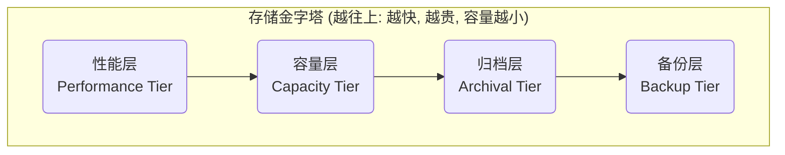
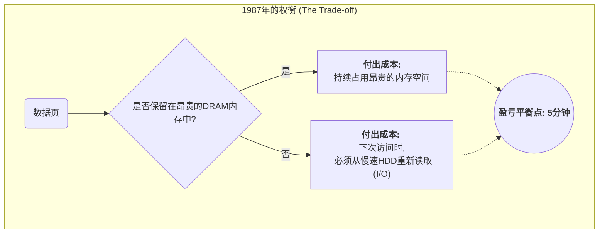
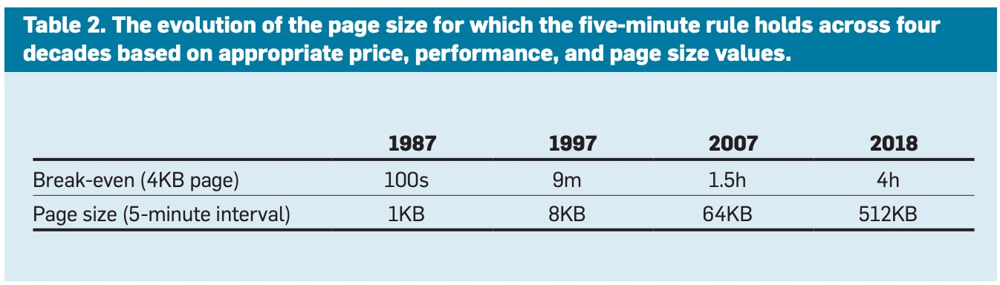
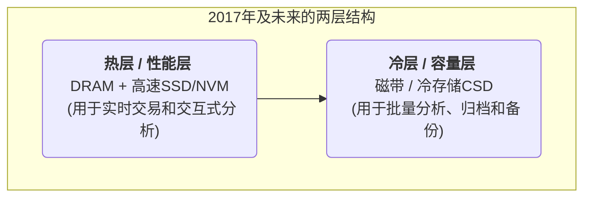
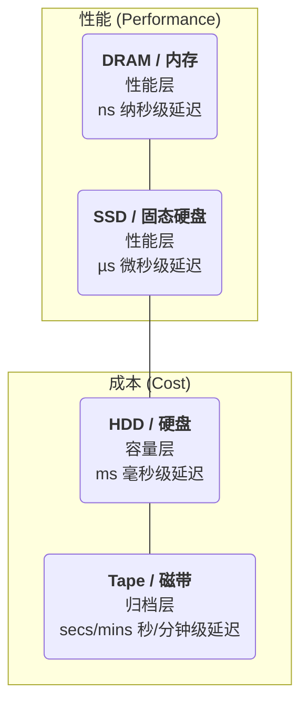
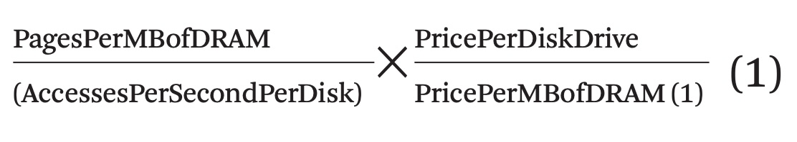

## AI论文解读 | The FiveMinute Rule 30 Years Later and Its Impact on the Storage Hierarchy
        
### 作者        
digoal        
        
### 日期        
2025-10-27        
        
### 标签        
PostgreSQL , PolarDB , DuckDB , AI , 论文解读        
        
----        
        
## 背景  
      
https://dl.acm.org/doi/pdf/10.1145/3318163        
  
提示:          
```          
读懂《The FiveMinute Rule 30 Years Later and Its Impact on the Storage Hierarchy》这篇论文需要提前掌握哪些基础知识, 请使用中文通熟易懂的讲解这些基础知识, 可以引用论文中的图、表或使用Markdown支持的图形(text,mermaid等)增加解释性. 
  
使用中文通熟易懂的解读《The FiveMinute Rule 30 Years Later and Its Impact on the Storage Hierarchy》这篇论文, 其中的关键内容请着重讲解, 可以引用论文中的图、表或使用Markdown支持的图形(text,mermaid等)增加解释性. 
  
提取《The FiveMinute Rule 30 Years Later and Its Impact on the Storage Hierarchy》这篇论文中的重要术语, 使用中文对这些术语进行通熟易懂的讲解, 可以引用论文中的图、表或使用Markdown支持的图形(text,mermaid等)增加解释性. 
```     
  
## 1 前置知识 
  
要读懂这篇论文，你需要对计算机的存储系统有一些基本的了解。这篇论文的核心是关于一个经典的“法则”在30年后如何演变，以及这对我们今天如何设计数据库和数据系统（特别是存储部分）意味着什么。

以下是你需要提前掌握的基础知识，我会用通俗的中文来解释：

### 1\. 什么是存储分层 (Storage Hierarchy)？

想象一个金字塔。在计算机系统中，数据存储也像一个金字塔，这被称为“存储分层”。

  * **塔尖 (Top):** 速度最快、最昂贵、但容量最小。比如 CPU 缓存（论文没细讲，但属于这层）和 **DRAM (内存)** 。
  * **塔中 (Middle):** 速度、价格、容量都居中。比如 **SSD (固态硬盘)**  和 **HDD (机械硬盘)** 。
  * **塔底 (Bottom):** 速度最慢、最便宜、但容量巨大。比如 **Tape (磁带)** 。

我们之所以需要分层，是因为我们既想要极快的访问速度（内存），又想用低廉的价格存储海量数据（磁带或硬盘）。存储分层的目标就是在“性能”和“成本”之间找到最佳平衡。

论文中的 **图 1 (Figure 1)**  完美地展示了这一点：     

  * **纵轴 (Y-axis):** 存储成本 (Storage Cost) ，越往上越贵。
  * **横轴 (X-axis):** 数据访问延迟 (Data Access Latency) ，越往右越慢（从纳秒ns、微秒µs、毫秒ms到小时hour）。

论文将现代存储分为四个层级 ：

1.  **性能层 (Performance):** 供需要快速响应的应用使用 (如 DRAM, SSD) 。
2.  **容量层 (Capacity):** 供对延迟不敏感的应用使用 (如 HDD) 。
3.  **归档层 (Archival):** 存储不常用数据，但仍需自动访问 (如 VTL) 。
4.  **备份层 (Backup):** 离线存储，用于灾难恢复 (如 Offline Tape) 。




### 2\. 什么是“五分钟法则” (The Five-Minute Rule)？

这是理解论文的**核心概念**。

  * **提出者：** Jim Gray 和 Gianfranco Putzolu 在 1987 年提出 。
  * **解决的问题：** 当时只有两层：昂贵的 **DRAM (内存)** 和便宜的 **HDD (磁盘)** 。DRAM 被用作 HDD 的“缓存”（Cache）。那么，一个数据“页面”（Page，数据在磁盘和内存间移动的基本单位）应该在昂贵的内存里“待多久”才划算？
  * **核心权衡 (Trade-off)：**
    1.  把数据**留在内存里**：会持续占用昂贵的内存空间（付出**内存成本**）。
    2.  把数据**踢出内存**：下次用它时，必须再去慢速磁盘上读（付出**I/O成本**）。
  * **法则的答案（1987年）：** 通过计算当时的内存价格和磁盘性能，他们得出一个“盈亏平衡点”：**五分钟** 。
      * 如果一个数据页面**每隔五分钟之内**就会被再次访问，那么它“值得”被缓存在昂贵的内存中。
      * 如果它超过五分钟才被访问一次，那么把它踢出内存，等需要时再从磁盘读一次，反而更“省钱”。
  * **这篇论文的意义：** 30年过去了，DRAM、HDD 和新出现的 SSD 的价格、性能都发生了翻天覆地的变化 。因此，那个“五分钟”的阈值也必须重新计算。论文的剧透是：原来的“五分钟法则”（DRAM-HDD）现在已经变成了“**四小时法则**” 。

### 3\. 关键的存储技术（和指标）

你需要了解论文中反复对比的几种存储介质：

1.  **DRAM (内存):**
      * **特点：** 极快（纳秒级延迟 ），按GB算非常贵，断电数据丢失。
2.  **HDD (机械硬盘):**
      * **特点：** 较慢（毫秒级延迟 ），因为有旋转的盘片和移动的磁头。按GB算非常便宜 。
3.  **SSD (固态硬盘) / 闪存 (NAND Flash):**
      * **特点：** 速度和价格都介于DRAM和HDD之间 （微秒级延迟 ）。没有机械部件，抗震，省电 。
4.  **Tape (磁带):**
      * **特点：** 访问极慢（分钟到小时级 ），但存储成本是最低的，通常用于离线备份 。

**关键性能指标：**

  * **延迟 (Latency):** 你发出一个请求（比如读一个数据块）到你收到数据，需要等待多长时间。这是衡量“快不快”的关键。
  * **IOPS (Input/Output Operations Per Second):** 每秒钟能处理多少次“随机”的读写请求。这个指标对数据库（比如查询很多个不同的用户信息）非常重要 。
  * **带宽 (Bandwidth / Throughput):** 衡量“顺序”读写的速度，即数据流有多“粗”。比如看高清电影或分析一整个大文件，你更关心带宽 。
  * **`$/GB` (每GB成本):** 存储单位数据的价格 。

### 4\. “盈亏平衡”的计算逻辑

论文是如何计算那个“X分钟”的？它把这个计算分成了两个比率 ：

1.  **技术比率 (Technology Ratio):**
      * 它衡量的是硬件的**物理性能**。
      * 分子是 `Pages Per MB of DRAM`（1MB内存能放多少个数据页）。
      * 分母是 `Accesses Per Second Per Disk`（1秒钟磁盘能响应多少次访问，即 IOPS）。
      * 这个比率反映了内存密度和磁盘I/O能力之间的对比。
2.  **经济比率 (Economic Ratio):**
      * 它衡量的是硬件的**经济成本**。
      * 分子是 `Price Per Disk Drive`（一个磁盘驱动器的价格）。
      * 分母是 `Price Per MB of DRAM`（1MB内存的价格）。
      * 这个比率反映了买一个完整磁盘和买一点内存哪个更贵。

**`盈亏平衡时间 = (技术比率) x (经济比率)`**

你不需要自己去算，但要理解：**技术的进步（如SSD的IOPS猛增 ）和价格的下降（如DRAM和HDD的`$/MB`都在暴跌 ）是不同步的** 。这两个比率的相对变化，共同导致了“五分钟”这个数字的巨大变化。

### 5\. 两种不同的“工作负载” (Workload)

最后，你需要知道论文为什么要把“性能层”和“容量层”分开讨论。因为它们服务于两种完全不同的数据访问模式：

1.  **随机访问 (Random Access):**

      * **场景：** 实时交易 (OLTP)、高并发的Web服务 。
      * **特点：** 访问的数据小、零散、不可预测（比如在几亿用户里随机查几个人的账户余额）。
      * **要求：** 极低的**延迟**和极高的 **IOPS** 。
      * **对应：** 论文第4节讨论的“性能层”（DRAM、SSD、3D XPoint）。

2.  **顺序扫描 (Sequential Access / Scan):**

      * **场景：** 批量分析 (Batch Analytics)、数据仓库、科学计算 。
      * **特点：** 一次性读取海量连续的数据（比如分析过去一整年的销售总额）。
      * **要求：** 高**带宽**（能多快读完）。对“开始”的延迟不那么敏感 。
      * **对应：** 论文第5节讨论的“容量层”（HDD、Tape、冷存储）。在这一节，评价指标也从 IOPS 变成了 `$/TBscan`（扫描1TB数据的成本）。

-----

**总结一下：**

只要你提前理解了**存储金字塔（分层）的概念，以及“五分钟法则”这个（内存成本 vs. 磁盘I/O成本）的经济权衡**，再结合 **DRAM、HDD、SSD** 三种主要介质在 **IOPS、带宽、延迟、价格** 上的核心差异，你就掌握了阅读这篇论文所需的全部基础知识。
  
## 2 解读论文 
  
这是一篇在数据库和系统领域非常著名的论文。它探讨了一个诞生于1987年的经典法则——“五分钟法则”——在三十年后（即2017年）的硬件环境下发生了怎样翻天覆地的变化，以及这些变化对我们今天如何设计数据存储系统（如数据库）所带来的深刻启示。

我会为你通俗地拆解这篇论文的核心内容。

### 1\. 什么是“五分钟法则”？ (1987年的原始问题)

想象一下1987年的电脑，它主要有两层存储 ：

1.  **DRAM (内存):** 速度极快，但价格极其昂贵。
2.  **HDD (机械硬盘):** 速度很慢（有机械臂在旋转的盘片上寻道），但价格非常便宜。

为了提升性能，系统会把最常用的数据从慢速的HDD中加载到昂贵的DRAM中，把DRAM当作“缓存” 。

**核心问题来了：** 内存这么贵，我应该把一块数据（称为“页”）在内存里保留多久才“划算”？

Jim Gray 和 Gianfranco Putzolu 算了一笔**经济账** ：

  * **方案A (保留在内存):** 数据占着昂贵的内存空间，持续产生“内存租金成本”。
  * **方案B (踢出内存):** 节省了“内存租金”，但下次用它时，必须再去慢速硬盘上读一次，产生“I/O访问成本”。

当这两种成本相等时，就达到了“盈亏平衡点” 。在1987年，这个时间点被计算为约400秒，被取整为**五分钟** 。

> **五分钟法则 (1987) ：**
> 如果一个数据页（Page）每隔**五分钟之内**会被访问一次，那么它就“值得”被保留在昂贵的DRAM内存中。如果访问间隔超过五分钟，那么把它踢出内存，等需要时再从HDD读一次，反而更省钱。



### 2\. 为什么30年后要重温？(存储的“地壳运动”)

如果DRAM和HDD的价格、性能按同等比例进化，那么“五分钟”这个数字将永远不变 。但现实是，它们没有。

更重要的是，存储的版图发生了巨变 ：

1.  **新玩家入场：** NAND 闪存（即 **SSD 固态硬盘**）出现了 。它的速度和价格完美地插在了DRAM和HDD之间 。
2.  **层级变复杂了：** 存储系统从“DRAM-HDD”两层，演变成了**四层结构**（参见论文图1）。     

**现代企业存储四层结构 (Figure 1 简化解读)**

  * **性能层 (Performance):** 极快，用于实时交易。 (DRAM, SSD) 
  * **容量层 (Capacity):** 较慢，用于批量分析。 (HDD) 
  * **归档层 (Archival):** 很慢，用于合规性存档。 (VTL 虚拟磁带库) 
  * **备份层 (Backup):** 离线，用于灾难恢复。 (Offline Tape 离线磁带) 

因此，这篇论文（2017年）重新计算了所有关键层级之间的“盈亏平衡点”。

### 3\. 核心发现：法则的巨变 (看懂 Table 2)

论文的核心结论都浓缩在 **Table 2** 中。我们来看看那些“X分钟法则”现在变成了什么：     

| 存储层级 (缓存 vs. 底层) | 1987 | 1997 | 2007 | **2017 (今天)** | 解读 |
| :--- | :---: | :---: | :---: | :---: | :--- |
| **DRAM - HDD** (内存缓存硬盘) | **5分钟**  | 5分钟  | 1.5小时  | **4 小时**  | 硬盘太慢了，内存太便宜了，数据值得在内存里待非常久。 |
| **DRAM - SSD** (内存缓存固态盘) | - | - | 15分钟  | **\~7 分钟**  | SSD速度较快，内存缓存它的“窗口期”没那么长。 |
| **SSD - HDD** (固态盘缓存硬盘) | - | - | 2.25小时  | **1 天**  | SSD相对HDD快太多了，用SSD给HDD当缓存非常划算。 |

*(注：2017年的 DRAM-SSD 时间，如果使用更快的 PCIe SSD，这个时间会进一步缩短到仅 **40-50秒** )*

-----

### 4\. 论文的深刻启示：这对我们意味着什么？

这些数字的惊人变化，给数据系统设计带来了两大启示：

#### 启示一：对“性能层”——HDD已死，DRAM的价值在重构

1.  **HDD彻底退出性能舞台：**
    DRAM-HDD 的“4小时法则”和 SSD-HDD 的“1天法则”传达了一个清晰的信号：HDD的随机I/O性能已经和DRAM/SSD完全脱节 。任何对性能有要求的数据（比如数据库），都不应该再考虑使用HDD了 。HDD被彻底降级为“容量层”，只适合存冷数据 。

2.  **从“内存”数据库到“持久内存”数据库：**
    更有趣的是 DRAM-SSD 的间隔。在2007年，这个间隔是15分钟 ，用DRAM缓存SSD是合理的。
    但在2017年，随着 PCIe SSD 和 3D XPoint (一种新型NVM) 等技术的发展，这个间隔缩短到了 **40-50秒** 。

      * **这意味着：** SSD 已经快到几乎可以“准内存”的速度来使用了。用昂贵的DRAM来为它做缓存的“经济窗口期”变得极短。
      * **论文预测：** 系统的设计思想将发生转变。不再是假设“所有数据都在DRAM”（In-Memory），而是转向“所有数据都在高速SSD/NVM上”（Persistent-Memory） 。DRAM的角色从“主战场”退化为“CPU前的高速缓存”。

#### 启示二：对“容量层”——HDD的形态在变，磁带可能复兴

1.  **HDD必须“顺序化”：**
    论文指出，既然HDD的随机I/O已经没救了，那我们只能用它的“顺序读写”能力（即一次读一大块）。为了让“五分钟法则”在2017年的DRAM-HDD上成立，数据页的大小需要从4KB暴涨到 **512KB** 。这意味着系统必须以“大块头”的方式去读写HDD，把它当作一种“类磁带”的顺序设备 。

2.  **磁带的逆袭（扫描成本）：**
    论文比较了 HDD 和 Tape (磁带) 在“批量分析”场景下的成本。它们使用了一个新指标：`$/TBscan`（扫描1TB数据的总成本）。

      * **1997年：** HDD 扫描成本比磁带**便宜70倍** 。

      * **2017年：** HDD 扫描成本只比磁带**便宜10倍** 。

      * **这意味着：** 磁带的顺序带宽在疯狂追赶HDD，而成本优势巨大 。

      * **论文预测：** 既然“容量层”(HDD) 已经被迫只用于顺序扫描（批量分析），而“归档层”(Tape) 的扫描成本又快追上来了。那么，未来“容量层”和“归档层”很可能会**合并** 。企业可能不再需要昂贵的HDD集群做批量分析，而是可以直接在更便宜的磁带（或冷存储CSD）上运行这些任务 。

### 总结：未来的存储层级可能在“收缩”

这篇论文的最终结论是，新的存储技术（如SSD和NVM）非但没有让存储层级变得更复杂，反而可能在促使它**收缩** 。

未来的存储结构可能演变成一个更简单的两层模型 ：



而传统的 **HDD (机械硬盘)**，它在性能上被SSD完胜，在成本和密度上被磁带逼近，其生态位正被两端不断挤压，逐渐被边缘化。
  
## 3 术语 
  
根据这篇论文（《The Five-Minute Rule 30 Years Later and Its Impact on the Storage Hierarchy》），以下是一些核心术语及其通俗易懂的中文讲解：

### 核心概念：法则与权衡

#### 1\. 存储层次结构 (Storage Hierarchy)

在1980年代，数据库引擎主要使用两层存储：DRAM（内存）和HDD（硬盘） 。而如今，企业数据库引擎通常使用三层存储层次结构 ，如论文中的图1所示 。    

这个结构可以形象地理解为一个金字塔，越往上，速度越快，但价格（每GB成本）也越贵 ；越往下，速度越慢，但容量大且便宜。



  * **性能层 (Performance Tier):** 使用DRAM或NAND闪存SSD 。用于托管对延迟非常敏感的事务处理和实时分析应用 。
  * **容量层 (Capacity Tier):** 使用HDD 。用于托管对延迟不敏感的批量分析应用 。
  * **归档层 (Archival Tier):** 主要基于磁带 。用于存储极少访问的数据（例如用于合规审计或灾难恢复） 。

#### 2\. 五分钟法则 (The Five-Minute Rule)

这是1987年由 Jim Gray 和 Gianfranco Putzolu 提出的一个经典法则 。

  * **解决的问题：** 当时DRAM（内存）非常昂贵，而HDD（硬盘）相对便宜但速度慢 。工程师需要一个准则来决定：数据是应该缓存在昂贵的DRAM中，还是应该在使用时才从HDD中读取 ？
  * **法则内容：** “每五分钟被引用（访问）一次的1KB记录，应该常驻内存” 。
  * **通俗解释：** 这条法则计算了一个“时间平衡点”。如果数据A的访问间隔*短于*这个平衡点（比如每3分钟访问一次），那么把它放在内存里（支付内存租金）比每次都去硬盘拿（支付I/O成本）要更划算。

#### 3\. 收支平衡区间 (Break-even interval)

这是“五分钟法则”计算出的核心结果 。

  * **定义：** 它指的是，数据需要在此时间窗口内被“再次访问”，才使得将它缓存在DRAM（内存）中比从磁盘I/O获取更具经济效益 。
  * **法则的演变：** 论文的核心观点是，这个“平衡区间”在过去30年里发生了巨大变化 ：
      * **DRAM vs HDD (内存 vs 硬盘):** 1987年，1KB页面的平衡区间是400秒（约五分钟） 。今天，4KB页面的平衡区间已经变成了**4小时** 。这意味着，现在将数据缓存在内存中（相比于从HDD读取）的经济效益要高得多，HDD变得越来越像过去的磁带 。
      * **DRAM vs SSD (内存 vs 固态硬盘):** 如今，对于DRAM和SSD，4KB页面的平衡区间恰好是**5分钟** 。这意味着，最初为HDD设计的“五分钟法则”现在适用于SSD了 。

#### 4\. 技术比率 (Technology Ratio) & 经济比率 (Economic Ratio)

这是“五分钟法则”计算公式（公式1）的两个组成部分 。    

  * **技术比率 (Technology Ratio):** 反映了硬件技术本身的能力，主要指二级存储（如硬盘）的随机I/O访问能力和页面大小 。
  * **经济比率 (Economic Ratio):** 反映了两种硬件的价格差异，即每MB DRAM的价格与每台磁盘驱动器价格的比值 。

### 关键存储技术与趋势

#### 5\. NVM (非易失性存储器)

NVM (Non-volatile memory) 是指断电后数据也不会丢失的存储器 。

  * **趋势：** 论文指出，NAND闪存正从通过PCIe总线连接的SSD设备 ，转变为直接插入内存总线（DIMM插槽）的NVM设备（也称NVDIMM） 。
  * **例如 3D XPoint：** 这是一种新型NVM技术（如Intel Optane） 。它提供了比NAND闪存更低的延迟和更高的吞吐量 。
  * **影响：** 论文计算出，DRAM与新型NVM（如PCIe SSD或3D XPoint）的平衡区间仅为**1分钟** 。这预示着未来数据库引擎可能会从“基于DRAM”转向“基于NVM的持久内存” 。

#### 6\. 冷存储 (Cold Storage)

“冷数据”是指不经常被访问的数据 。据估计，多达80%的企业数据是“冷”的，并且是增长最快的部分 。

  * **传统方案：** 过去冷数据存储在HDD（容量层） 或磁带（归档层） 中。
  * **HDD的问题：** HDD即使在空闲时也会消耗大量电力 ，导致总拥有成本（TCO）增加 。
  * **磁带的演变：** 磁带的顺序读取带宽已经可以媲美甚至超过HDD 。

#### 7\. CSD (冷存储设备)

CSD (Cold Storage Devices) 是为存储冷数据而构建的新型设备 。

  * **工作原理：** 它们通常采用 MAID（Massive Array of Idle Disks，海量空闲磁盘阵列）设置，即一组HDD中只有一小部分磁盘在任何给定时间处于活动（旋转）状态 。
  * **性能特点：** 访问已启动的磁盘，延迟和带宽与传统HDD相当 ；但访问已“休眠”（spun-down）的磁盘则需要几秒钟的启动时间 。
  * **定位：** CSD在成本和访问延迟方面，构成了HDD和磁带之间的完美中间地带 。

### 关键衡量指标

#### 8\. `$/Kaps`, `$/Maps`, `$/TBscan`

对于HDD和磁带这样的大容量设备，传统的随机访问指标（如IOPS）已不那么重要 。论文采用了Gray和Graefe提出的新指标 ：

  * **`$/Kaps` (每KB访问/秒的成本):** 衡量小规模随机访问的成本效益 。在此指标上，DRAM远胜HDD，HDD远胜磁带 。
  * **`$/Maps` (每MB访问/秒的成本):** 衡量中等规模顺序访问的成本效益 。
  * **`$/TBscan` (每TB扫描成本):** 衡量完整扫描整个设备的成本效益 。这是批量分析应用（Batch Analytics）的关键指标 。

**核心发现：**
论文在比较 $/TBscan 指标时发现，1997年，HDD比磁带便宜70倍 ；而今天，HDD仅比磁带便宜10倍 。这个差距正在迅速缩小 。

**结论（Implications）：**
这一趋势表明，将HDD构成的“容量层”  和磁带构成的“归档层”  合并为一个统一的“冷存储层”在经济上是可行的 。
  
## 参考        
         
https://dl.acm.org/doi/pdf/10.1145/3318163    
        
<b> 以上内容基于DeepSeek、Qwen、Gemini及诸多AI生成, 轻微人工调整, 感谢杭州深度求索人工智能、阿里云、Google等公司. </b>        
        
<b> AI 生成的内容请自行辨别正确性, 当然也多了些许踩坑的乐趣, 毕竟冒险是每个男人的天性.  </b>        
    
#### [期望 PostgreSQL|开源PolarDB 增加什么功能?](https://github.com/digoal/blog/issues/76 "269ac3d1c492e938c0191101c7238216")
  
  
#### [PolarDB 开源数据库](https://openpolardb.com/home "57258f76c37864c6e6d23383d05714ea")
  
  
#### [PolarDB 学习图谱](https://www.aliyun.com/database/openpolardb/activity "8642f60e04ed0c814bf9cb9677976bd4")
  
  
#### [PostgreSQL 解决方案集合](../201706/20170601_02.md "40cff096e9ed7122c512b35d8561d9c8")
  
  
#### [德哥 / digoal's Github - 公益是一辈子的事.](https://github.com/digoal/blog/blob/master/README.md "22709685feb7cab07d30f30387f0a9ae")
  
  
#### [About 德哥](https://github.com/digoal/blog/blob/master/me/readme.md "a37735981e7704886ffd590565582dd0")
  
  

  
