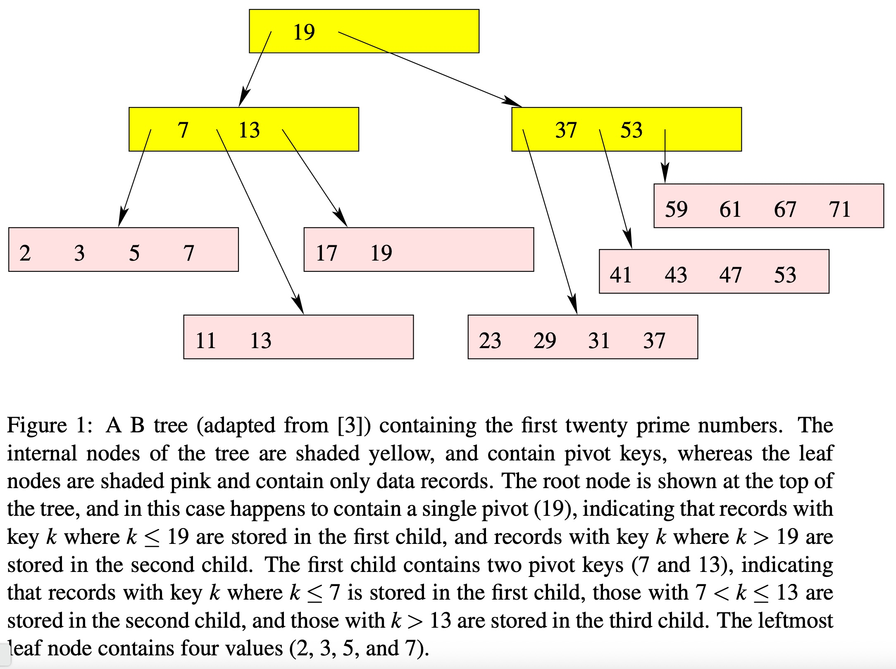
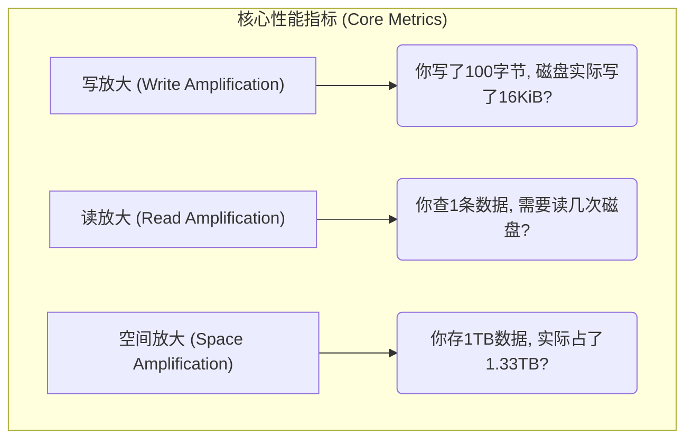
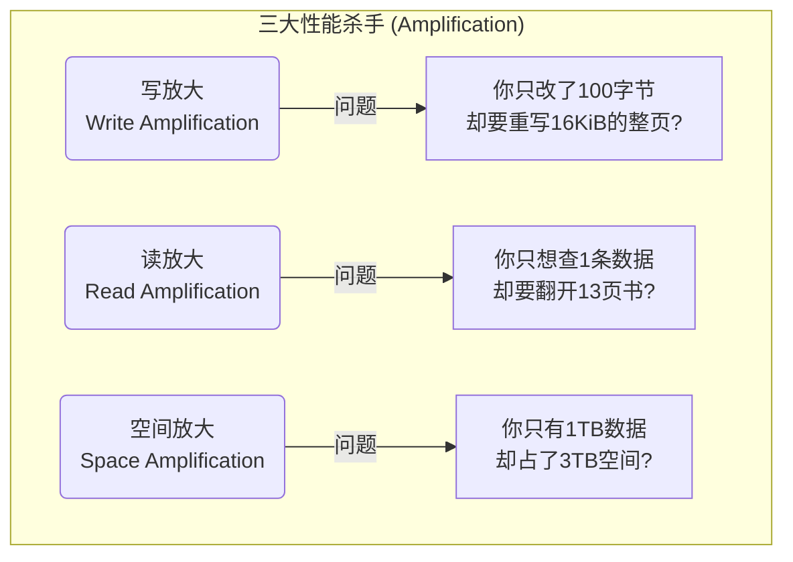
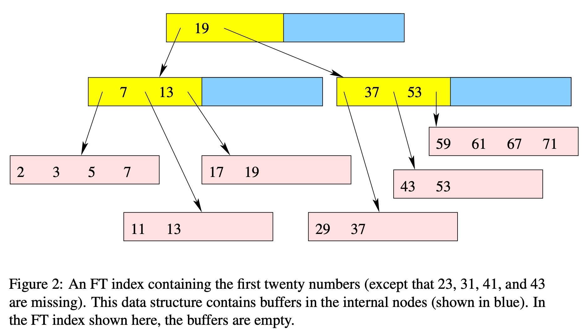
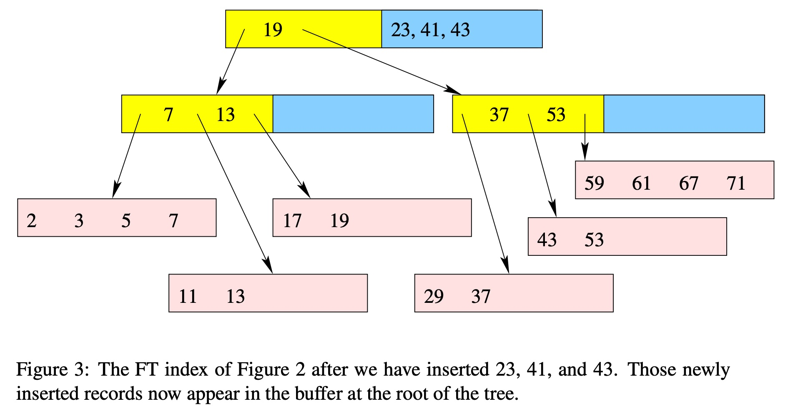
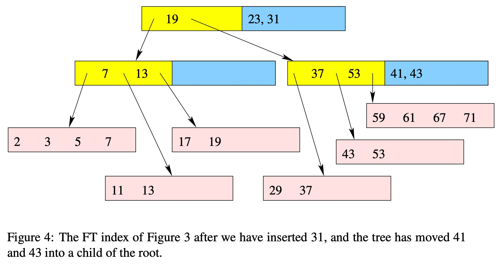
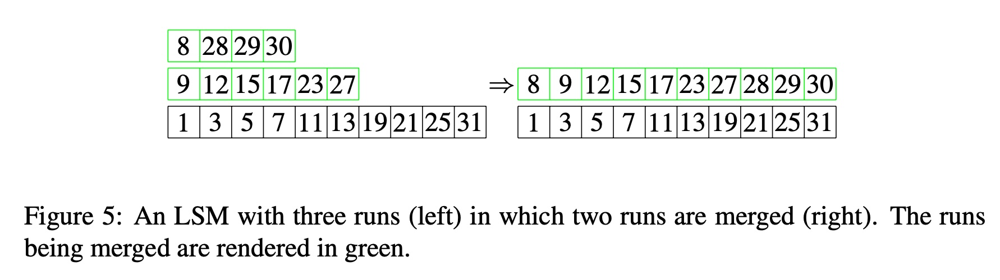
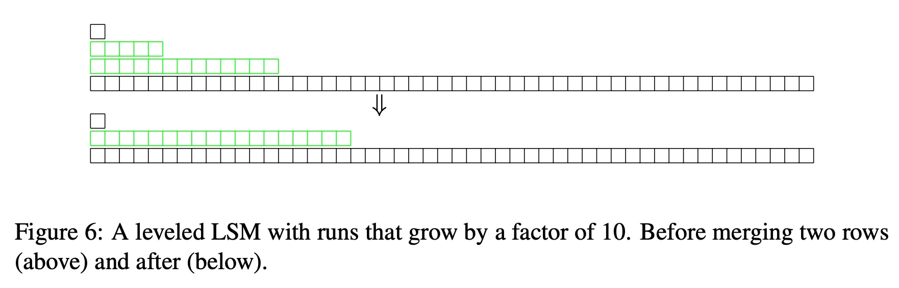
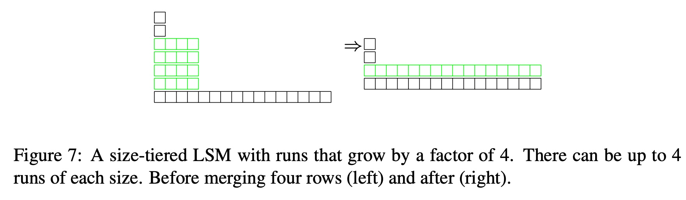
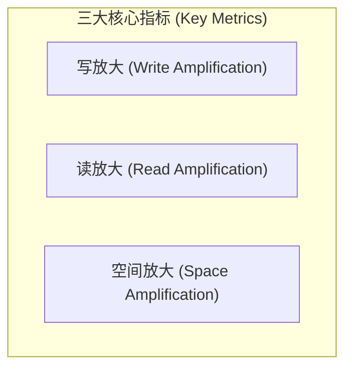

## AI论文解读 | A Comparison of Fractal Trees to Log-Structured Merge (LSM) Trees
        
### 作者        
digoal        
        
### 日期        
2025-10-27        
        
### 标签        
PostgreSQL , PolarDB , DuckDB , AI , 论文解读        
        
----        
        
## 背景  
      
https://github.com/lonng/db-papers/blob/main/papers/storage-structure/a-comparison-of-fractal-trees-to-log-structured-merge-(lsm)-trees.pdf        
  
提示:          
```          
读懂《A Comparison of Fractal Trees to Log-Structured Merge (LSM) Trees》这篇论文需要提前掌握哪些基础知识, 请使用中文通熟易懂的讲解这些基础知识, 可以引用论文中的图、表或使用Markdown支持的图形(text,mermaid等)增加解释性. 
  
使用中文通熟易懂的解读《A Comparison of Fractal Trees to Log-Structured Merge (LSM) Trees》这篇论文, 其中的关键内容请着重讲解, 可以引用论文中的图、表或使用Markdown支持的图形(text,mermaid等)增加解释性. 
  
提取《A Comparison of Fractal Trees to Log-Structured Merge (LSM) Trees》这篇论文中的重要术语, 使用中文对这些术语进行通熟易懂的讲解, 可以引用论文中的图、表或使用Markdown支持的图形(text,mermaid等)增加解释性. 
```     
  
## 1 前置知识 
  
要读懂这篇比较分形树（Fractal Trees）和日志结构合并树（LSM-Trees）的论文 ，你需要对数据库系统，特别是磁盘I/O（输入/输出）性能相关的基础知识有所了解。这篇论文的核心是比较两种数据结构在处理“写密集型”负载时的效率。

以下是你需要提前掌握的核心基础知识：

### 1\. 基础数据结构：B树 (B-Tree)

这篇论文在第3节  和图1  中专门回顾了B树，因为它几乎是所有传统关系型数据库（如InnoDB ）存储索引的标准。分形树本身也是B树的一种变体 。   

  * **它是什么？** B树是一种平衡搜索树，专门为存储在磁盘等慢速设备上的数据而优化。
  * **为什么用它？** 它与普通二叉搜索树最大的不同是，B树的每个节点可以有很多个子节点（论文中称为“扇出” $k$ ）。这使得树变得“又矮又胖”。
  * **关键点：** 磁盘读写非常慢，但一次读写一个字节和一次读写一个“块”（Block，例如16KiB ）的“寻道”开销差不多。B树的设计目标是，通过让树的高度变得非常低（例如，存储上亿条数据的树可能也只有3-4层），使得任何一次查询（从根节点到叶节点）都只需要极少的磁盘I/O次数。
  * **看懂图1 ：**
      * 黄色的**内部节点 (Internal Nodes)**  存储“枢轴键” (pivot keys) ，它们就像路标，告诉你下一步该去哪个子节点查找。
      * 粉色的**叶节点 (Leaf Nodes)**  存储真正的数据记录 。
      * 一次查询就是从根（顶部的 "19" ）一路向下，直到找到叶子。

### 2\. 数据库的存储层级与 I/O

这篇论文的讨论是基于一个核心矛盾：数据太大，内存太小。

  * **内存 vs. 外存（磁盘）：** 论文假设一个“典型”场景：数据库有10TB，而机器内存（RAM）只有64GB 。这意味着绝大部分数据必须存在磁盘上。访问内存（RAM）非常快（纳秒级），而访问磁盘（无论是旋转磁盘HDD还是固态硬盘SSD）非常慢（毫秒级）。
  * **I/O (输入/输出)：** 这是指从磁盘读取数据或向磁盘写入数据的操作。它是数据库性能的主要瓶颈。这篇论文比较数据结构，本质上就是在比较谁的I/O效率更高。
  * **块 (Block / Page)：** 操作系统和磁盘交互的最小单位是一个“块” 。即使你只想修改100字节的数据，数据库也可能必须从磁盘读取一个16KiB的块，在内存中修改它，然后再把整个16KiB的块写回磁盘 。
  * **冷缓存 vs. 热缓存 (Cold vs. Warm Cache) ：**
      * **热缓存：** 你经常访问的数据（比如B树的顶层内部节点 ）被缓存在宝贵的内存（RAM）中。此时查询它们几乎不需要I/O 。
      * **冷缓存：** 你要访问的数据不在内存中，必须从磁盘读取 。这是性能最差的情况。

### 3\. 核心性能指标："放大" (Amplification)

这篇论文使用三个“放大”指标来衡量数据结构的优劣（在第2节  和总结表  中有详细说明）。理解这三个指标是理解整篇论文的关键。



  * **写放大 (Write Amplification) ：**

      * **定义：** 实际写入存储的数据量 vs. 应用程序请求写入的数据量 。
      * **为什么重要：** B树的写放大很糟糕 。如上所述，修改100字节的行，可能导致整个16KiB的块被重写，写放高达160倍 。这在SSD上尤其致命，因为SSD的闪存有擦写次数限制 ，高写放会急剧缩短SSD寿命 。LSM树和分形树的设计目标就是显著降低写放大 。

  * **读放大 (Read Amplification) ：**

      * **定义：** 为满足一个查询（比如查找一个键或一个范围）所需要的I/O次数 。
      * **为什么重要：** B树在热缓存下读放大极好，通常只需1次I/O 。LSM树为了降低写放大，在读取时可能需要检查多个不同的数据“运行” (runs) ，导致读放大变高（例如在热缓存下范围查询需要3次或13次I/O ）。

  * **空间放大 (Space Amplification) ：**

      * **定义：** 数据结构实际占用的磁盘空间 vs. 存储的原始数据大小 。
      * **为什么重要：** 空间就是成本。B树因为块内的数据不总是满的（平均75%），有 $4/3$ （约1.33）的空间放大 。LSM树在合并（compaction）过程中可能需要临时存储数据副本，导致空间放大 。

### 4\. 渐进分析 (Asymptotic Analysis - Big O)

论文中充满了 $O(log_B N)$ 这样的数学符号 ，这叫“大O表示法”，用来描述算法的扩展性。

  * **$N$ (数据库大小) ：** 你的数据库里有多少数据 。
  * **$B$ (块大小) ：** 磁盘I/O的单位大小 。
  * **$k$ (扇出) ：** B树或分形树一个节点有多少个子节点 。
  * **$O(log_B N/B)$ ：** 读作“对数阶”。这是B树的读取成本（I/O次数）。它的意思是，即使数据库大小 $N$ 增大100倍，查询所需的I/O次数可能只会增加1次。这是**非常好**的性能。
  * **$O(B)$ ：** 读作“线性阶”。这是B树的写放大 。它的意思是，写放与你的块大小 $B$ 成正比。如果 $B$ 是16KiB，写放就是16KiB的级别。这是**非常糟糕**的性能。

### 总结

如果你能提前掌握 **B树** 的工作原理、**磁盘I/O** 是性能瓶颈，并理解 **“三种放大”** （写/读/空间）的含义，你就能轻松看懂这篇论文。这篇论文  的核心就是在分析和比较图8  中的那些性能权衡（Trade-offs）：   

  * **B树：** 写放大很差，读放大很好 。
  * **LSM树（Size-tiered）：** 写放大极好，但牺牲了读放大和空间放大 。
  * **LSM树（Leveled）：** 写放大较好，但读放大很差 。
  * **分形树（FT-indexes）：** 试图在写放大和读放大之间取得最佳平衡 。
  
## 2 解读论文 
  
好的，这是一篇非常经典的数据库内核论文。我来为你通俗地解读一下。

这篇论文的核心是 **“在磁盘上存储数据，怎样才能写得又快又好？”** 

想象一下，你有一本超大的魔法书（你的10TB数据库），但你桌子（你的64GB内存）很小。你每次更新书中内容时，都不能把整本书搬到桌上。你只能一次从书架上取一页（一个Block），在桌上修改，再放回去。这个过程（I/O）非常慢。

这篇论文就是在比较几种不同的“书本整理术”，看哪种方法在增、删、改、查时效率最高。

### 1\. 核心问题：万恶的“放大”效应

论文在第2节和图8中提出了三个关键衡量指标，这是理解全文的钥匙 ：  



  * **写放大 (Write Amplification)：** 这是论文最关心的问题。在SSD（固态硬盘）上，每个存储单元的擦写次数是有限的 。如果你每次只改一点点数据，就要重写整个数据块（比如16KiB），你的SSD很快就会被“写死”。这个比率就是写放大 。
  * **读放大 (Read Amplification)：** 你要找一条数据，需要从磁盘读取多少次（I/O）？ 读的次数越少越好。
  * **空间放大 (Space Amplification)：** 为了维护数据结构，你额外占用了多少存储空间？

-----

### 2\. 三种数据结构（整理术）的对比

#### (1) 传统方法：B树 (B-Tree) - （第3节）

B树是传统关系型数据库（如MySQL的InnoDB）的标准做法。

  * **工作方式：** 就像一个图书馆的索引卡系统（见**图1**）。它是一棵“又矮又胖”的树 。内部节点（黄色）是索引 ，叶子节点（粉色）存真实数据 。查询时，从根节点一路找到叶子节点，效率很高 。   
  * **优点：** 读性能极好。一旦索引被缓存到内存（热缓存），查询一条数据通常只需要**1次**磁盘I/O 。
  * **致命缺点：** **写放大非常高** 。当你插入或更新一行数据时，你必须找到对应的叶子节点（一个16KiB的块），把它读到内存，修改，然后再把**整个块**写回磁盘 。论文指出，这在随机写入时是“灾难性”的 。
  * **论文总结：** 写放大太高了，现在很少有应用应该使用它 。

#### (2) 论文主角A：分形树 (Fractal Tree) - （第4节）

这是作者公司（Tokutek）的产品 ，是B树的超级改进版。

  * **工作方式：** 它在B树的“索引节点”（内部节点）上加了 **“缓冲区”（Buffer）** 。
  * **看懂图2、3、4：**     
    1.  当一个新数据（如 23, 41, 43）被插入时，它**不会**立即被写到底层叶子 。
    2.  相反，它被“扔”进根节点（最顶层）的蓝色缓冲区里（见**图3**）。
    3.  这个缓冲区满了之后，才会**批量**地把数据冲刷（flush）到下一层节点的缓冲区（见**图4**）。
  * **优点：**
      * **写放大低：** 它把大量的随机小写入，变成了在树的每层之间发生的批量顺序写入。这极大地降低了写放大 。
      * **读性能好：** 它的结构本质上还是B树，所以它的读性能和B树一样优秀（热缓存下1次I/O）。
  * **论文总结：** 分形树在写放大、读放大和空间放大上都提供了“极好”的性能 。

#### (3) 论文主角B：日志结构合并树 (LSM-Tree) - （第5节）

LSM树是目前NoSQL数据库（如LevelDB, RocksDB, Cassandra）的主流选择 。

  * **工作方式：** **它从不修改老数据** 。
  * **核心思想（两步走）：**
    1.  **写入：** 所有新数据（增、删、改）都先在内存中排序，然后“打包”成一个小的、不可变的、有序的数据文件（称为“Run”）刷到磁盘上 。这个写入是100%顺序的，**速度快到极致**。
    2.  **合并 (Compaction)：** 磁盘上会堆积起越来越多的小文件（见**图5**）。系统后台会不断地把这些小文件合并（Merge）成更大的、依然有序的文件 。   
  * **这导致了两种流派：**
      * **流派一：Leveled (层级式)** - （见**图6**）  
          * **特点：** 像金字塔，数据被分成严格的“层”（Level 0, 1, 2...）。每一层只有一个（或一组）文件。下一层总是上一层的 $k$ 倍大（比如10倍）。
          * **优点：** 空间放大控制得很好（约1.1倍）。
          * **缺点：** **写放大很高！** 因为数据从L0合并到L1，未来还可能随着L1的数据一起被合并到L2... 数据在“爬楼”过程中被反复读写 。总的写放大是 $O(k \log_k N/B)$ 。
      * **流派二：Size-Tiered (规模分层式)** - （见**图7**）   
          * **特点：** 更“野蛮”，系统会找几个大小差不多的文件，把它们合并成一个大文件 。
          * **优点：** **写放大是所有方案中最低的！**  数据一生中被合并的次数相对较少。
          * **缺点：** **读放大和空间放大是“灾难性”的** 。因为在最坏情况下，你要查的数据可能存在于任何一个文件中。你可能需要检查十几个文件（比如13个）才能找到它 。空间放大也可能高达3倍 。

-----

### 3\. 最终对决：图8 (总结表)

 

这是整篇论文的精华 。作者用一个表格清晰地对比了所有选手的优劣（基于一个10TB数据库 / 64GB内存的“典型”配置）：

| 数据结构  | 写放大 (越低越好) | 读放大 (热缓存, 查范围) | 空间放大 (越低越好) | 论文的“一句话”评语 |
| :--- | :--- | :--- | :--- | :--- |
| **B-Tree** | $O(B)$ (很高) | **1** (极好) | 1.33 | 写放大太差，不推荐  |
| **FT-Index (分形树)** | $O(k \log_k N/B)$ (较低) | **1** (极好) | 极小 | **各项全能，非常优秀**  |
| **LSM (Leveled)** | $O(k \log_k N/B)$ (较低) | 3 | 1.1 (多文件) | 读放大差，不推荐  |
| **LSM (Size-Tiered)** | **$O(\log_k N/B)$ (最低)** | 13 (很差) | 3 (很高) | 除非你完全不在乎读和空间，否则别用  |

*(注： $k$ 是扇出或增长因子)*

### 结论

这篇论文的立场非常鲜明（毕竟作者是分形树公司的首席架构师 ）：

1.  传统的B树因为“写放大”问题已经过时了 。
2.  LSM树虽然解决了“写放大”问题，但付出了“读放大”或“空间放大”的巨大代价 。
3.  **分形树（FT-Index）是最佳的解决方案**，因为它通过在B树节点上增加缓冲区，既获得了B树的 **优秀读性能（1次I/O）** ，又获得了LSM树的**低写放大**，是二者的完美结合 。
  
## 3 术语 
  
以下是《A Comparison of Fractal Trees to Log-Structured Merge (LSM) Trees》这篇论文中的核心术语及其通俗讲解：

### 1\. 核心性能指标 (The "Amplifications")

这篇论文（如图8所示）使用三个“放大”指标来衡量不同数据结构的性能 。理解这三个指标是理解全文的关键。   



  * **Write Amplification (写放大):**

      * **定义：** 数据库实际写入磁盘的数据量 / 应用程序请求写入的数据量 。
      * **通俗讲解：** 你的程序只想更新100字节的数据（比如改个用户名）。但对于B树，它可能必须把包含这100字节的**一整页**（比如16KiB）从磁盘读到内存，修改后，再把**整个16KiB**写回磁盘 。在这个例子中，写放高达160倍 (16KiB / 100B) 。
      * **为什么重要：** 写放大是性能杀手。对于SSD（固态硬盘），高写放会急剧消耗其有限的写入寿命 。

  * **Read Amplification (读放大):**

      * **定义：** 为满足一个查询请求，需要执行的磁盘 I/O（读取）次数 。
      * **通俗讲解：** 你只想查找一个键（比如 `ID=123`）。如果数据结构设计不佳（比如一个有多层文件的LSM树），你可能需要去磁盘上读13个不同的地方（文件）才能找到它 。这时读放大就是13。读放大越低，查询越快。

  * **Space Amplification (空间放大):**

      * **定义：** 数据结构实际占用的磁盘空间 / 原始数据的大小 。
      * **通俗讲解：** 你存了1TB的数据。但由于B树的“碎片”（数据块通常只有75%满） 或LSM树合并时需要临时副本 ，数据库可能实际占用了1.33TB或更多的空间。这个多出来的比例就是空间放大 。

-----

### 2\. 数据结构 (Data Structures)

  * **B-Tree (B树):**

      * **定义：** 传统数据库（如MySQL InnoDB）使用的标准索引结构 。它是一种“矮胖”的搜索树，每个节点可以有很多子节点 。
      * **结构 (见 图1)：**   
          * **内部节点 (Internal Nodes)：** 黄色部分。存储“枢轴键”(pivot keys)，像路标一样指引查询方向 。
          * **叶节点 (Leaf Nodes)：** 粉色部分。存储真正的数据记录 。
      * **特点：** 读性能极好（热缓存下1次I/O），但写放大问题严重 。

  * **Fractal Tree (FT) Index (分形树索引):**

      * **定义：** B树的改进版，其核心特点是在**内部节点**（路标节点）上增加了**缓冲区 (Buffer)** 。
      * **工作方式 (见 图2, 3, 4)：**
        1.  **插入数据（如图3）：** 当新数据（如 23, 41, 43）写入时，它们不会立即被写到树的最底层（叶子） 。    
        2.  **存入缓冲区：** 它们被“暂存”在根节点的蓝色缓冲区中 。
        3.  **批量下推（如图4）：** 当缓冲区满了，数据才会被**批量**推送到下一层节点的缓冲区 。   
      * **目标：** 通过将大量随机的“小写入”汇集成批量的“大写入”，显著降低写放大 。

  * **Log-Structured Merge (LSM) Tree (日志结构合并树):**

      * **定义：** 一种“只追加、不修改”的数据结构。它维护着一系列**有序的数据运行 (sorted runs)** 。
      * **工作方式（见 图5）：**
        1.  **写入：** 所有新数据（增、删、改）都被写入内存，排序后刷到磁盘，形成一个新的、不可变的“Run”（有序文件） 。
        2.  **合并 (Compaction)：** 后台会不断地将这些小的、旧的“Runs”（如图5中两个绿色的run）合并成一个更大的、依然有序的新“Run” 。   

-----

### 3\. LSM树的核心概念

  * **Run (数据运行):**

      * **定义：** 一个包含键值对、且键已排序的数据集合 。在LSM树中，整个数据库就是由多个 "Runs" 组成的。

  * **Compaction (合并):**

      * **定义：** LSM树的后台维护过程。它读取两个或多个旧的 "Runs"，将它们合并排序，然后写入一个全新的 "Run" 。这是LSM树写放大的主要来源。

  * **Leveled Compaction (层级式合并):**

      * **定义：** 一种LSM合并策略，将数据组织成严格的“层级”(Levels)，如L0, L1, L2... 。
      * **特点 (见 图6)：** L0层是新数据，当L0满了，它会和L1层合并 。L1满了再和L2合并 。每一层的大小（比如L1）都远大于上一层（比如L0），通常有固定的倍数（如10倍）。   
      * **权衡：** 读放大较好（热缓存下3次），但写放大较高 。

  * **Size-Tiered Compaction (规模分层式合并):**

      * **定义：** 另一种LSM合并策略。它倾向于合并那些“大小相近”(size-tiered) 的 "Runs" 。
      * **特点 (见 图7)：** 比如，系统会等待，直到凑齐4个大小都在4MB左右的 "Runs"，然后把它们合并成一个16MB的 "Run" 。  
      * **权衡：** **写放大最低** ，但**读放大和空间放大都非常差** 。

-----

### 4\. 查询与缓存 (Query & Cache)

  * **Cold Cache (冷缓存) vs. Warm Cache (热缓存):**

      * **定义：** 描述内存（RAM）中是否已有数据的状态 。
      * **冷缓存：** 内存是空的，查询所需的数据必须从磁盘读取。这是最坏的查询情况 。
      * **热缓存：** 常用数据（如B树的内部索引节点）已经被缓存在内存中 。此时B树或分形树的查询通常只需1次I/O（去磁盘读叶节点）。

  * **Point Queries (点查询) vs. Range Queries (范围查询):**

      * **定义：** 两种不同的查询类型。
      * **点查询：** 查找一个特定的键，例如 `SELECT * WHERE ID = 123` 。
      * **范围查询：** 查找一个键范围内的所有数据，例如 `SELECT * WHERE Age > 30` 。

  * **Bloom Filters (布隆过滤器):**

      * **定义：** 一种高效的数据结构，可以快速判断一个元素“绝对不在”一个集合中 。
      * **用途：** 在LSM树中，它可以极大地优化**点查询** 。查询时，先用布隆过滤器检查某个 "Run"，如果它说“肯定没有”，就跳过这个 "Run"，避免一次昂贵的磁盘I/O 。但它对**范围查询**没有帮助 。
  
## 参考        
         
https://github.com/lonng/db-papers/blob/main/papers/storage-structure/a-comparison-of-fractal-trees-to-log-structured-merge-(lsm)-trees.pdf    
        
<b> 以上内容基于DeepSeek、Qwen、Gemini及诸多AI生成, 轻微人工调整, 感谢杭州深度求索人工智能、阿里云、Google等公司. </b>        
        
<b> AI 生成的内容请自行辨别正确性, 当然也多了些许踩坑的乐趣, 毕竟冒险是每个男人的天性.  </b>        
    
#### [期望 PostgreSQL|开源PolarDB 增加什么功能?](https://github.com/digoal/blog/issues/76 "269ac3d1c492e938c0191101c7238216")
  
  
#### [PolarDB 开源数据库](https://openpolardb.com/home "57258f76c37864c6e6d23383d05714ea")
  
  
#### [PolarDB 学习图谱](https://www.aliyun.com/database/openpolardb/activity "8642f60e04ed0c814bf9cb9677976bd4")
  
  
#### [PostgreSQL 解决方案集合](../201706/20170601_02.md "40cff096e9ed7122c512b35d8561d9c8")
  
  
#### [德哥 / digoal's Github - 公益是一辈子的事.](https://github.com/digoal/blog/blob/master/README.md "22709685feb7cab07d30f30387f0a9ae")
  
  
#### [About 德哥](https://github.com/digoal/blog/blob/master/me/readme.md "a37735981e7704886ffd590565582dd0")
  
  

  
