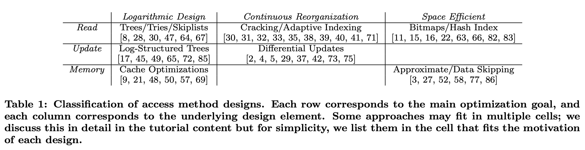
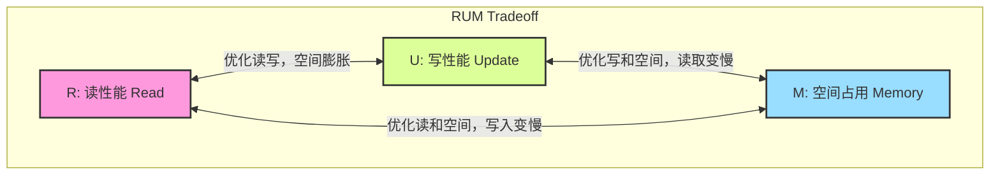

## AI论文解读 | Design Tradeoffs of Data Access Methods
        
### 作者        
digoal        
        
### 日期        
2025-10-27        
        
### 标签        
PostgreSQL , PolarDB , DuckDB , AI , 论文解读        
        
----        
        
## 背景  
      
https://dl.acm.org/doi/pdf/10.1145/2882903.2912569  
  
提示:          
```          
读懂《Design Tradeoffs of Data Access Methods》这篇论文需要提前掌握哪些基础知识, 请使用中文通熟易懂的讲解这些基础知识, 可以引用论文中的图、表或使用Markdown支持的图形(text,mermaid等)增加解释性. 
  
使用中文通熟易懂的解读《Design Tradeoffs of Data Access Methods》这篇论文, 其中的关键内容请着重讲解, 可以引用论文中的图、表或使用Markdown支持的图形(text,mermaid等)增加解释性. 
  
提取《Design Tradeoffs of Data Access Methods》这篇论文中的重要术语, 使用中文对这些术语进行通熟易懂的讲解, 可以引用论文中的图、表或使用Markdown支持的图形(text,mermaid等)增加解释性. 
```     
  
## 1 前置知识 
  
要读懂《Design Tradeoffs of Data Access Methods》这篇论文，你需要对数据库系统的一些基本概念有提前的了解。这篇论文更像是一篇“综述”和“思想总结” ，它假设读者已经对各种数据结构和数据库的内部工作有一定认识。

以下是理解这篇论文所需的核心基础知识，我会用通俗的中文来解释：

### 1\. 什么是“访问方法” (Access Method)？

简单来说，“访问方法”就是数据库管理数据的方式 。你可以把它想象成数据库为了快速“存、取、改”数据而建立的“索引” (Index) 。

  * **论文定义：** 访问方法是用于组织和访问数据的算法和数据结构的集合 。
  * **通俗理解：** 就像书本的目录。没有目录，你找一个知识点（数据），就得从第一页翻到最后一页（全表扫描）。有了目录（访问方法/索引），你就可以直接定位到对应的页码（数据位置）。

### 2\. 核心权衡：RUM 三角

这篇论文的核心思想是 "RUM" 三个字母代表的权衡 。RUM 分别指：

  * **R (Read Overhead):** 读取数据的开销（性能）。越低越好。
  * **U (Update Overhead):** 更新（增、删、改）数据的开销（性能）。越低越好。
  * **M (Memory Overhead):** 访问方法本身占用的内存或存储空间。越低越好。

论文的核心观点是：**你不可能同时优化这三者** 。优化其中两个，必然会牺牲第三个。

你可以用一个简单的文本图形来理解这个“跷跷板”关系：

```text
      R (读性能)
      /   \
     /     \
    /       \
   U ------- M
(更新性能) (空间占用)

- (R+U) 好 => M 差 (例如，LSM-Tree，读写都还行，但可能占更多空间)
- (R+M) 好 => U 差 (例如，B+ Tree，读和空间控制好，但更新慢)
- (U+M) 好 => R 差 (这种情况较少见，但理论上存在)
```

### 3\. 必须了解的基础数据结构

论文中提到了很多数据结构 ，它假设你已经知道它们是什么。你至少需要了解以下三种：

#### a. B-Tree (B树 / B+树)

  * **是什么？** 这是传统关系型数据库（如 MySQL, PostgreSQL）最常用的索引结构。
  * **特点：** 它是一种平衡树 。数据（或索引）存储在叶子节点上，并且叶子节点之间有指针相连。
  * **RUM 特性：**
      * **R (读)：** 非常快。无论是“点查询”（找特定一条）还是“范围查询”（找某个区间）都很快 。
      * **U (更新)：** 相对较慢。因为插入或删除数据时，可能需要“分裂”或“合并”树的节点来保持平衡，这涉及随机的磁盘写入。
      * **M (空间)：** 空间利用率比较高。

#### b. Hash Index (哈希索引)

  * **是什么？** 基于哈希表实现。
  * **特点：** 通过一个哈希函数，直接把“键”（Key）映射到一个存储“值”（Value）的地址。
  * **RUM 特性：**
      * **R (读)：** “点查询”极快（ 理论上是 $O(1)$ ），但完全不支持“范围查询” 。
      * **U (更新)：** 非常快。
      * **M (空间)：** 空间占用通常可控。

#### c. LSM-Tree (日志结构合并树)

  * **是什么？** 这是 NoSQL 数据库（如 Bigtable , Cassandra ）和现代分析型数据库中非常流行的结构。
  * **特点：** 它的核心思想是“延迟合并” 。
    1.  所有“更新/写入”先快速写入内存中的一个结构（叫 MemTable）。
    2.  内存写满后，排序并“刷”到磁盘上，形成一个不可变的有序文件（SSTable）。
    3.  磁盘上会积累很多层 (Level) 这样的小文件 。
    4.  系统会在后台慢慢地把这些小文件“合并”(Merge) 成更大的文件 。
  * **RUM 特性：**
      * **U (更新)：** 极快。因为写入只是追加到内存和顺序写入磁盘 ，避免了 B-Tree 的随机写入问题。
      * **R (读)：** 相对较慢。因为要找一个数据，可能需要查询内存，还要查询磁盘上的“很多层”文件 ，最后再把结果合并。
      * **M (空间)：** 较高。因为同一个数据可能存在多个版本（在合并之前），导致空间占用膨胀（写放大 Write Amplification）。

### 4\. 硬件基础：内存 vs. 磁盘

论文中反复提到硬件的变化 。你需要理解：

  * **内存 (Memory) vs. 磁盘 (Disk/Flash):** 内存非常快，但贵且小；磁盘/SSD 慢，但便宜且大。
  * **随机访问 (Random Access) vs. 顺序访问 (Sequential Access):**
      * **随机访问：** 像在书里“跳着读”（第5页 -\> 第100页 -\> 第20页）。在磁盘上，这非常慢，因为机械磁头需要移动。在内存中也比顺序访问慢 。
      * **顺序访问：** 像“从头读到尾”（第1页 -\> 第2页 -\> 第3页）。在磁盘上非常快 。
  * **知识点：** B-Tree 的更新倾向于“随机访问” ，而 LSM-Tree 的更新则巧妙地转换为了“顺序访问” 。

### 5\. 工作负载 (Workload) 类型

你需要知道数据库的两种典型使用场景，因为它们对 RUM 的需求完全不同：

  * **OLTP (在线事务处理):** 比如电商下单、银行转账。特点是“写多读少”，有大量的“更新” (Update) 操作 。
  * **OLAP (在线分析处理):** 比如数据仓库、商业智能报表 。特点是“读多写少”，数据一次性写入后，会有海量的复杂“读取” (Read) 操作。

### 如何利用论文中的表格

当你理解了上述概念后，再看论文中的 **Table 1** ，就会非常清晰：   

  * **Logarithmic Design (对数设计):**
      * `Read` (读优化): `Trees/Tries/Skiplists` (B树、Trie树等) 。
      * `Update` (写优化): `Log-Structured Trees` (LSM-Tree) 。
      * `Memory` (空间优化): `Cache Optimizations` (缓存优化) 。
  * **Continuous Reorganization (持续重组):**
      * `Read` (读优化): `Cracking/Adaptive Indexing` (数据库开裂/自适应索引) ，即根据查询实时调整索引 。
      * `Update` (写优化): `Differential Updates` (差分更新) ，即先把更新攒起来再批量处理 。
  * **Space Efficient (空间效率):**
      * `Read` (读优化): `Bitmaps/Hash Index` (位图/哈希索引) 。
      * `Memory` (空间优化): `Approximate/Data Skipping` (近似索引/数据跳过) ，比如只记录“最大/最小值”（Zonemaps ），用于跳过扫描不必要的数据块。

**总结：** 读这篇论文前，你不需要精通每一种数据结构的代码实现，但你必须理解 **B-Tree**、**Hash Index** 和 **LSM-Tree** 的核心工作原理及其在 **读性能、写性能、空间占用（RUM）** 上的根本差异。同时，理解 **硬件（随机/顺序访问）** 和 **工作负载（OLTP/OLAP）** 如何影响这些设计的选择。
  
## 2 解读论文 
  
这是一篇关于数据库核心技术“访问方法”（Access Methods）的“武功秘籍”和“设计指南” 。

简单来说，这篇论文的核心思想是：**设计数据库的存取方式（访问方法）时，你永远面临一个“三难”选择，不可能让所有性能都达到最优** 。

### 1\. 论文的核心：RUM "三难" 困境

这篇论文开宗明义地提出了一个核心观点，即所有访问方法的设计都必须在三个目标之间进行权衡 ：

1.  **R (Read Overhead):** 读取数据的开销（读性能）。
2.  **U (Update Overhead):** 更新（增、删、改）数据的开销（写性能）。
3.  **M (Memory Overhead):** 占用内存或存储空间的开销（空间占用）。

论文指出，这三者构成了一个“三向平衡”：**你优化其中任意两者，必然会导致第三者的性能变差** 。

我们可以用一个“不可能三角”来表示这个关系：



**通俗理解：**

  * **优化 读(R) 和 空间(M)：** 你的索引结构会非常紧凑且易于查询（比如经典的 B+ 树）。但当你要“写入”新数据时，为了维持这种有序和紧凑，你需要做很多“原地更新”或“页面分裂”工作，导致“写性能”(U) 下降 。
  * **优化 写(U) 和 读(R)：** 你希望读写都很快。你可能需要存储多份数据或复杂的指针，导致“空间占用”(M) 大幅增加。
  * **优化 写(U) 和 空间(M)：** 你希望写入快，且不占地方。最简单的方法是像写日记一样“追加”数据（LSM-Tree 的思路 ）。但这样一来，当你要“读取”某个特定数据时，你可能需要翻遍很多“日记本”（数据层级），导致“读性能”(R) 严重下降 。

### 2\. 什么是 "访问方法" (Access Method)？

在深入探讨之前，我们先搞清楚什么是“访问方法”。

  * **论文定义：** 访问方法是用于组织和访问数据的一系列算法和数据结构的集合 。
  * **通俗理解：** 它就是数据库的“目录”或“索引”。你告诉数据库“我要找 XXX”，访问方法就是那个帮助数据库快速定位到 XXX 存储位置的工具，而不是让数据库把所有数据都翻一遍（全表扫描）。

### 3\. (重点) 实现权衡：三大设计策略 (Table 1 解读)

这篇论文最精华的部分，在于它将所有访问方法归纳为三种基本的设计理念（列）和三个优化目标（行）。

这构成了论文中的 **Table 1** ，这是理解全文的钥匙：

 

| | Logarithmic Design (对数设计) | Continuous Reorganization (持续重组) | Space Efficient (空间效率) |
| :--- | :--- | :--- | :--- |
| **Read (读优化)** | 树/Trie/跳表  | 数据库开裂/自适应索引  | 位图/哈希索引  |
| **Update (写优化)** | 日志结构树 (LSM-Tree)  | 差分更新  | (论文未在此处列举) |
| **Memory (空间优化)**| 缓存优化  | (论文未在此处列举) | 近似索引/数据跳过  |

下面我们来通俗地解读这个表格：

#### A. Logarithmic Design (对数设计)

这是最经典的设计，核心思想是利用“树”或“分层”结构，将查找成本从 $O(N)$ （全扫描）降低到 $O(\log N)$ （对数级）。

  * **目标：优化读 (R)**

      * **代表：B-Trees (B树)** 。
      * **做法：** 传统关系型数据库（如 MySQL）的标准索引。它是一棵“矮胖”的平衡树，数据总是在叶子节点上有序排列。
      * **权衡：** 读（点查和范围查）极快 。但“写”(U) 性能较差，因为插入数据可能导致树节点分裂和重排，这是很慢的“随机写”操作。

  * **目标：优化写 (U)**

      * **代表：LSM-Tree (日志结构合并树)** 。
      * **做法：** NoSQL 数据库（如 Bigtable, Cassandra）的最爱 。它彻底放弃了“原地更新”。
        1.  所有写入都先放进内存的一个小树（Buffer）。
        2.  内存满了，就排好序，“刷”到磁盘上，形成一个**不可变**的有序文件（Run）。
        3.  磁盘上会积累很多层 (Level) 这样的文件，数据库会在后台慢慢地将小文件“合并”（Merge）成大文件 。
      * **权衡：** 写入极快，因为只是“顺序追加”文件 。但“读”(R) 性能较差，因为要找一个数据，可能需要查询内存和磁盘上的“多层”文件 。同时，由于数据在合并前存在多份，“空间”(M) 占用也会被放大。

  * **目标：优化空间 (M)**

      * **代表：Cache-sensitive $B^{+}$-Trees (缓存敏感 B+ 树)** 。
      * **做法：** 设计 B+ 树的节点大小时，使其刚好能装入 CPU 的缓存行（Cache Line）。
      * **权衡：** 极致利用 CPU 缓存，减少 cache miss，从而在特定硬件上提升“读”(R) 性能。

#### B. Continuous Reorganization (持续重组)

这种设计的思想是“懒惰”和“自适应”。它认为我们不需要一开始就建立一个完美的索引，而是应该根据“实际的查询”来动态调整数据组织 。

  * **目标：优化读 (R)**

      * **代表：Database Cracking (数据库开裂)** 。
      * **做法：** 数据刚加载时是无序的。当第一个查询（如 `WHERE X < 10`）进来时，系统才把数据“劈”成两半（`<10` 和 `>=10`）。下次再来一个 `WHERE X < 5` 的查询，它再把 `<10` 的那部分劈成两半（`<5` 和 `>=5`）。
      * **权衡：** 索引是“按需创建”的 ，避免了预先建立索引的“写”(U) 开销。但代价是“读”(R) 性能是逐渐变好的，前几次查询会比较慢 。

  * **目标：优化写 (U)**

      * **代表：Differential Updates (差分文件)** 。
      * **做法：** 这是 LSM-Tree 的前身思想。当有更新时，不要直接修改主数据文件（太慢），而是把“更新内容”先写到一个小的“差分文件”里 。
      * **权衡：** “写”(U) 非常快 。但“读”(R) 变慢了，因为读取时必须同时查看主文件和差分文件，然后把结果合并起来。

#### C. Space-Efficient Designs (空间效率)

这种设计主要关注如何用最小的“空间”(M) 来实现索引功能 。

  * **目标：优化读 (R)**

      * **代表：Hash Indexing (哈希索引) / Bitmap Indexing (位图索引)** 。
      * **做法：** 哈希索引通过哈希函数直接定位数据，非常小 。位图索引使用二进制位（0/1）来表示某个值是否存在，空间效率极高，且能通过位运算（AND, OR）快速合并查询 。
      * **权衡：** “空间”(M) 和特定类型的“读”(R)（如哈希的点查、位图的多条件查询）非常优秀。但功能受限，例如哈希索引完全不支持“范围查询” 。

  * **目标：优化空间 (M)**

      * **代表：Approximate Indexing (近似索引) / Data Skipping (数据跳过)** 。
      * **做法：**
        1.  **数据跳过 (Zonemaps):** 不索引每一条数据，而是只记录数据块（Zone）的“最小值”和“最大值” 。当查询（如 `WHERE X = 50`）时，如果 50 不在某个块的 [Min, Max] 范围内，整个块都可以被安全“跳过”，极大提升扫描性能 。
        2.  **近似索引 (Bloom Filters):** 用一个很小的位数组来“概率性”地判断一个数据“是否可能存在” 。它可能会误判（告诉你“可能存在”，但实际不存在），但绝不会漏判（如果它说“不存在”，那就一定不存在）。
      * **权衡：** “空间”(M) 占用极小。代价是牺牲了“精确性”，换取了“读”(R) 性能的提升（因为跳过了大量无关数据）。

### 4\. 总结：没有银弹，只有权衡

这篇论文的精髓在于，它提供了一个“地图”和“坐标系”（RUM），帮助数据库设计者和使用者去理解他们正在使用的技术。

  * 当你的系统（比如 MySQL）“写入”很慢时，你通过这篇论文就能理解，这是因为它选择了 B-Tree 这种“读”和“空间”优化的设计 。
  * 当你的系统（比如 Cassandra）“读取”特定数据很慢时，你也能理解，这是因为它选择了 LSM-Tree 这种“写”优化的设计 。

最后，论文指出，未来的研究方向可能是设计“可调的”或“自适应”的访问方法（Shape-shifting access methods），让系统能够根据工作负载的变化，自动在 RUM 这个“不可能三角”中找到最合适的平衡点 。
  
## 3 术语 
  
好的，这篇论文《Design Tradeoffs of Data Access Methods》是一篇关于数据库核心技术的重要综述。它探讨了在设计数据存储和读取方式时所面临的根本性权衡。

以下是这篇论文中的一些关键术语及其通俗易懂的中文讲解：

### 1\. 核心概念

#### Access Methods (访问方法)

  * **讲解：** “访问方法”是数据库用来组织、存储和访问数据的“方法” 。你可以把它理解为数据库的 **“数据目录和索引系统”** 。
  * **举例：** 当你在一本很厚的书里找一个知识点时，你不会一页一页地翻（全表扫描），而是会去查目录（索引），然后直接跳到对应的页码。这个“目录”就是一种访问方法。B-Tree、哈希索引、LSM-Tree 都是具体的访问方法。

#### RUM Overheads (RUM 开销)

  * **讲解：** 这是整篇论文的核心论点。作者提出，评估任何“访问方法”都必须考虑三个相互冲突的开销 ：
      * **R (Read Overhead):** **读取开销**。即查询数据时需要花费多大的代价（比如耗时多久）。
      * **U (Update Overhead):** **更新开销**。即插入、修改或删除数据时需要花费多大的代价 。
      * **M (Memory Overhead):** **内存/存储开销**。即这个访问方法（索引）本身需要占用多少存储空间 。
  * **核心权衡 (RUM Tradeoff):** 论文指出，你**不可能同时**让 R、U、M 三者都达到最优 。优化其中两者，必然会牺牲第三者。这就像一个“不可能三角”。


-----

### 2\. 三大设计策略 (来自 Table 1)

 

论文将主流的访问方法按其“设计理念”分成了三大类 。

#### Logarithmic Design (对数设计)

  * **讲解：** 这是最经典的设计。它的核心思想是 **“分层”或“树状”** 组织数据 。通过这种方式，查找一个数据的时间复杂度从 $O(N)$ （全扫描）降低到 $O(\log N)$ （对数级），效率极高 。
  * **R 优化 (读优化) - B-Tree (B树):**
      * B-Tree 是一种平衡树 。它非常适合“读”操作，无论是查找特定数据还是一个范围内的数据都很快 。
      * *权衡：* 它的“写”(U) 性能较差，因为插入数据时可能需要“分裂”树节点来保持平衡，这涉及较慢的随机写入。
  * **U 优化 (写优化) - LSM-Tree (日志结构合并树):**
      * LSM-Tree (Log-Structured Merge-Tree) 是为“写”而生的 。所有“写”操作都先进入内存中的一个缓冲区（Buffer）。
      * 内存写满后，数据被排好序、打包成一个不可变的小文件， **“顺序”** 写入磁盘 。
      * 系统会在后台慢慢地把这些小文件“合并”(Merge) 成更大的文件 。
      * *权衡：* “写”(U) 性能极高（因为是顺序写），但“读”(R) 性能较差，因为要找一个数据可能需要查询内存和磁盘上的“多层”文件 。

#### Continuous Reorganization (持续重组)

  * **讲解：** 这种设计的思想是 **“懒惰”和“自适应”** 。它不在一开始就建立完美的索引，而是根据实际收到的“查询”或“更新”来动态地、持续地调整数据结构 。
  * **R 优化 (读优化) - Database Cracking (数据库开裂):**
      * “开裂”是指当一个查询（比如 `WHERE age > 30`）进来时，系统才 **“顺便”** 把数据按照 `age > 30` 这个条件劈成两半（开裂）。
      * 这样，索引是随着查询“按需”建立的 。
      * *权衡：* 节省了预先建立索引的“写”(U) 开销，但代价是前几次查询会比较慢，性能是“逐渐”变好的。
  * **U 优化 (写优化) - Differential Updates (差分更新):**
      * 当需要更新数据时，系统不会“原地”修改老数据（这很慢），而是把“更新的内容”单独写在一个“差分文件”（Differential file）里 。
      * 系统会把这些更新“攒”起来，最后再批量合并 。
      * *权衡：* “写”(U) 性能很好。但“读”(R) 性能变差了，因为读取时必须同时查看原始数据和“差分文件”，然后把结果合在一起。

#### Space-Efficient Designs (空间效率设计)

  * **讲解：** 这种设计的主要目标是 **“省空间”** (优化 M) 。
  * **R 优化 (读优化) - Bitmap Indexing (位图索引):**
      * 位图索引使用一个“比特位”(Bit) 来表示某个数据是否存在。例如，用 `1` 表示“是男性”，`0` 表示“非男性”。
      * 它非常节省空间，并且在处理多个AND/OR条件的复杂查询时，可以通过CPU的位运算（Bitwise operations）实现极快的速度 。
      * *权衡：* 适合用在“基数低”（即不同取值少，如“性别”、“省份”）的列上。
  * **M 优化 (空间优化) - Data Skipping (数据跳过):**
      * 这是一种轻量级的“索引”，它不记录每条数据的位置，而是记录一个“数据块”(Zone) 的元数据（Metadata）。
      * **Zonemaps (区域图)** 是最典型的例子：它只记录一个数据块的“最小值”和“最大值” 。
      * *举例：* 当你查询 `WHERE age = 25` 时，如果系统发现某个数据块的 Zonemap 是 `[min=40, max=60]`，系统就知道 25 绝不可能在这个块里，于是就可以 **“跳过”** 扫描整个数据块，从而提升“读”(R) 性能 。
  * **M 优化 (空间优化) - Approximate Indexing (近似索引):**
      * 这是一种“不精确”的索引，它牺牲了 100% 的准确性来换取极小的空间占用 (M) 。
      * **Bloom Filters (布隆过滤器)** 是典型例子 。它能快速告诉你：“你要找的数据**一定不存在**”或者“**可能存在**”。
      * *权衡：* 它可能会“误判”（告诉你可能存在，但实际不存在），但绝不会“漏判”（如果它说不存在，就一定不存在）。这在LSM-Tree中常用于快速判断某个Key是否在某个磁盘文件层级中 。
  
## 参考        
         
https://dl.acm.org/doi/pdf/10.1145/2882903.2912569    
        
<b> 以上内容基于DeepSeek、Qwen、Gemini及诸多AI生成, 轻微人工调整, 感谢杭州深度求索人工智能、阿里云、Google等公司. </b>        
        
<b> AI 生成的内容请自行辨别正确性, 当然也多了些许踩坑的乐趣, 毕竟冒险是每个男人的天性.  </b>        
    
#### [期望 PostgreSQL|开源PolarDB 增加什么功能?](https://github.com/digoal/blog/issues/76 "269ac3d1c492e938c0191101c7238216")
  
  
#### [PolarDB 开源数据库](https://openpolardb.com/home "57258f76c37864c6e6d23383d05714ea")
  
  
#### [PolarDB 学习图谱](https://www.aliyun.com/database/openpolardb/activity "8642f60e04ed0c814bf9cb9677976bd4")
  
  
#### [PostgreSQL 解决方案集合](../201706/20170601_02.md "40cff096e9ed7122c512b35d8561d9c8")
  
  
#### [德哥 / digoal's Github - 公益是一辈子的事.](https://github.com/digoal/blog/blob/master/README.md "22709685feb7cab07d30f30387f0a9ae")
  
  
#### [About 德哥](https://github.com/digoal/blog/blob/master/me/readme.md "a37735981e7704886ffd590565582dd0")
  
  

  
