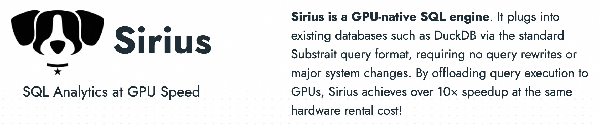
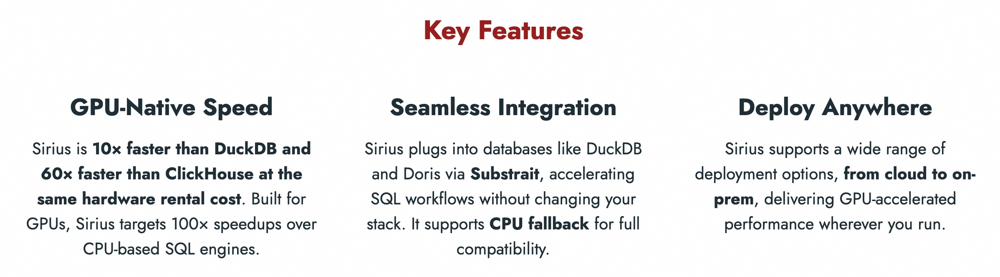
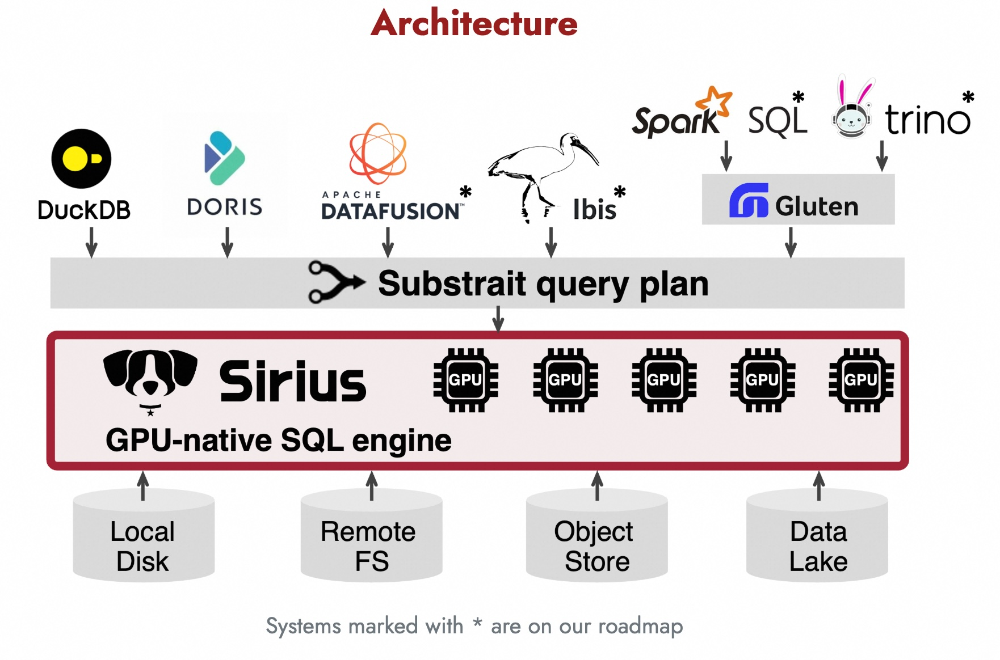

## 比鸭数据库(DuckDB)快10倍, 狼数据库(Sirius)诞生!   
      
### 作者      
digoal      
      
### 日期      
2025-10-27      
      
### 标签      
PostgreSQL , DuckDB , Sirius , CPU , GPU , pg-strom    
      
----      
      
## 背景      
比鸭数据库(DuckDB)快10倍, 狼数据库(Sirius)诞生!  
- https://www.sirius-db.com/  
- https://github.com/sirius-db/sirius  
  
Sirius 数据库, LOGO有点像狗, 差点写成狗数据库了.   
  
  
  
这个数据库有啥特色?   
  
Sirius 是一个**GPU 原生 SQL 引擎**（GPU-native SQL engine）。号称比DuckDB快10倍, 比ClickHouse快60倍. ( 在 **TPC-H SF=100**（Scale Factor = 100）基准测试中，Sirius 在相同硬件租赁成本下，相比现有 CPU 查询引擎实现了约 **10 倍的加速**，非常适合用于**交互式分析**（interactive analytics）、**金融工作负载**（financial workloads）和 **ETL 任务**（ETL jobs）。 )  
  
Sirius的标语是:   
- **让我们共同开启数据分析的 GPU 时代！**    
- **Let's kickstart the GPU era for Data Analytics!**  
  
这不禁让我想到了另一个PG的GPU数据库插件, 不知道现在怎么样了, 刚看了一眼github, 更新还很频繁, 希望能持续活下去 :  
- https://github.com/heterodb/pg-strom   
  
  
  
还可以通过标准的 **Substrait 查询格式**（Substrait query format）无缝集成到现有数据库（如 DuckDB）中，**无需重写查询语句或对系统进行重大改造**。无需改变你的技术栈即可获得性能提升, 就问你爽不爽!    
  
  
  
架构如下:   
  
  
  
Sirius 目前支持 **DuckDB** 和 **Doris**（即将推出），其他标有 * 的系统已在我们的路线图中。  
  
你不用再为数据库服务器加GPU卡找理由了, 如果对数据库来说推理只是低频操作, 计算总是高频操作吧(特别是实时数仓业务场景).   
  
未来, GPU应该成为数据库服务器标配硬件.    
  
如何使用Sirius? 别着急, 这就给您上README, 参考如下:    
- https://github.com/sirius-db/sirius  
  
## 当前限制   
  
Sirius 仍在积极开发中，目前存在以下限制：  
  
1. **数据规模限制**：    
   数据必须能完全放入 GPU 内存。若输入数据 > GPU 缓存区，或中间结果 > GPU 处理区，将报错。    
   **解决方案开发中**：分片执行、批处理、多 GPU、溢出到主机内存/磁盘、分布式执行。  
  
2. **行数限制**：    
   由于底层 **libcudf 使用 `int32_t` 存储行 ID**，最大支持约 **20 亿行**（~2B rows）。    
   正通过分片和批处理缓解。  
  
3. **数据类型支持**：    
   当前支持：`INTEGER`, `BIGINT`, `FLOAT`, `DOUBLE`, `VARCHAR`, `DATE`, `TIMESTAMP`, `DECIMAL`。    
   嵌套类型等正在开发中。  
  
4. **算子支持**：    
   已支持：`FILTER`, `PROJECTION`, `JOIN`, `GROUP-BY`, `ORDER-BY`, `AGGREGATION`, `TOP-N`, `LIMIT`, `CTE`。    
   计划支持：`WINDOW` 函数、`ASOF JOIN` 等。  
  
5. **部分空值列不支持**：    
   目前不支持仅部分值为 `NULL` 的列。  
  
> **重要**：当遇到上述限制时，Sirius 会**自动优雅降级**（gracefully fallback）到 DuckDB 的 CPU 执行模式，确保查询仍能完成。  
  
### 未来计划  
  
我们正在积极开发以下功能：  
- 磁盘/存储支持  
- 多 GPU 与多节点扩展  
- 更多 SQL 算子与数据类型  
- 支持更多数据库引擎（如 Spark、PostgreSQL 等）  
    
#### [期望 PostgreSQL|开源PolarDB 增加什么功能?](https://github.com/digoal/blog/issues/76 "269ac3d1c492e938c0191101c7238216")
  
  
#### [PolarDB 开源数据库](https://openpolardb.com/home "57258f76c37864c6e6d23383d05714ea")
  
  
#### [PolarDB 学习图谱](https://www.aliyun.com/database/openpolardb/activity "8642f60e04ed0c814bf9cb9677976bd4")
  
  
#### [PostgreSQL 解决方案集合](../201706/20170601_02.md "40cff096e9ed7122c512b35d8561d9c8")
  
  
#### [德哥 / digoal's Github - 公益是一辈子的事.](https://github.com/digoal/blog/blob/master/README.md "22709685feb7cab07d30f30387f0a9ae")
  
  
#### [About 德哥](https://github.com/digoal/blog/blob/master/me/readme.md "a37735981e7704886ffd590565582dd0")
  
  

  
