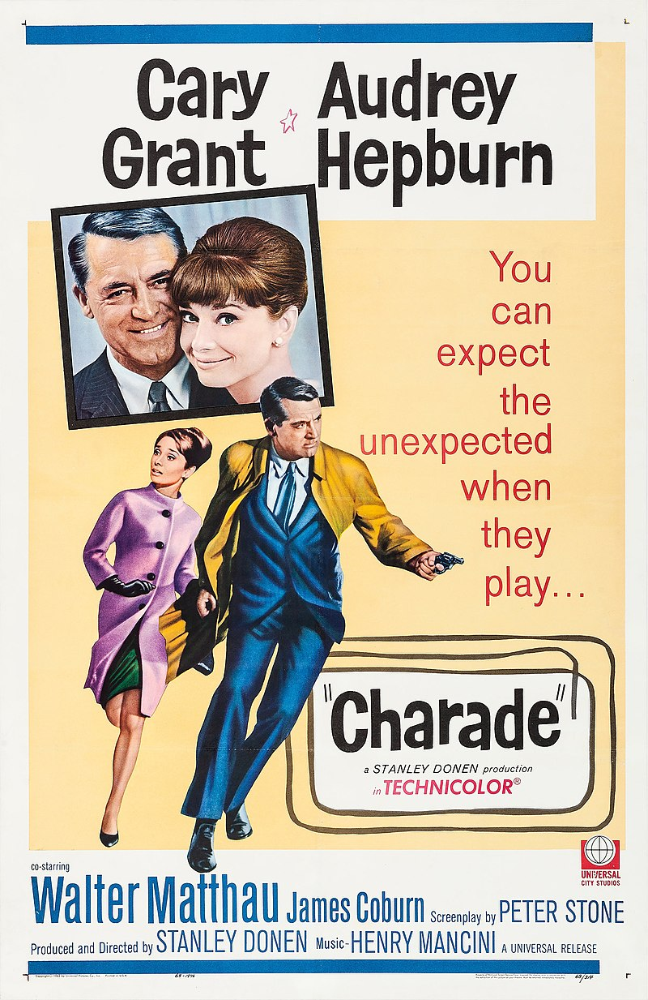

## DuckDB玩嗨了, 用470亿行存储了一部电影的所有帧, 然后是各种骚分析  
        
### 作者        
digoal        
        
### 日期        
2025-10-27        
        
### 标签        
PostgreSQL , DuckDB , 电影 , 帧 , 帧ID(时间偏移量) , 画布坐标 , x , y , 三元色 , R , G , B , 分析      
        
----        
        
## 背景     
电影画面由什么组成? 帧! , 每一帧就是一幅图片, 每秒达到10帧的话, 人眼的视觉暂留就会把他当成动图. 电影通常是25帧, 现在可能有高刷版(60帧的).   
  
画面又是由啥组成的? 像素! 每个像素有其在画布中的坐标, 每个像素的颜色则可以由三原色(也就是RGB, 红绿蓝)组成, 这个组合几乎可表达任何颜色.   
  
有了以上基础, 我们就可以把电影的每一帧拆分成若干个点, 每个点用“帧ID, x, y, r, g, b”来表示.    
  
一步电影可拆分成多少条记录? 取决于它的时长(秒)、帧率(每秒多少帧)、分辨率(`x*y`).     
  
把电影塞进DuckDB后, 能做什么分析? 这个可能属于影评、营销、导演的专业领域了.    
  
下面就看看DuckDB工程师怎么玩的? 以下内容来自： https://duckdb.org/2025/10/27/movies-in-databases    
  
其实通过这篇文章, 我们还能学习到DuckDB的炫酷特性, 例如 replacement scans、POSITIONAL JOIN、SUMMARIZE、超内存的聚合哈希表 .   
  
*TL;DR：你可以在 DuckDB 中存储甚至处理视频。在这篇文章中，我们会向你展示如何做到这一点。*    
*“你们的科学家太专注于‘能不能做到’，却从未停下来想想‘该不该这么做’。”*    
——伊恩·马尔科姆博士，《侏罗纪公园》（1993）  
  
在 DuckDB 团队，我们 *热爱* 表格。表格是一种永恒而优雅的抽象，其历史甚至比文字还要早大约一千年。关系型表格尤其可以表示 *任何* 想象得到的信息。但仅仅因为某件事 *可以* 做，并不意味着它就一定是个好主意。我们能造一枚核链式反应推进的火箭，飞行途中还会辐射它飞越的土地吗？能。我们应该这么做吗？可能不该。  
  
## 免责声明  
  
像图像和视频这样的数组型数据，是 *教科书级* 的例子，说明某些东西可能并不适合存入数据库。当然，任何二进制数据都可以作为 `BLOB` 存入表中，但这并没有带来太多附加价值。诚然，相比行业标准做法——只存一个指向图像的文件名——把图像本身放进数据库确实更不容易丢失。但除了存储和加载之外，对 BLOB 几乎做不了什么有意义的操作。如果不加上某些过度炒作的 AI 技术，你甚至无法问数据库这张图片里画的是什么。  
  
数组数据也有自己的一套高度专业化的文件格式和压缩算法。想想无处不在的 [MPEG-4 标准](https://en.wikipedia.org/wiki/MPEG-4)，它就是用来存储电影的。这些是近似（非精确、有损）格式，围绕人类感知模型设计，因此可以避免存储人类注意不到的内容。它们实现了惊人的压缩率：一部两小时的“全高清”电影，用 MPEG-4 压缩后大约只有 2 GB。  
  
## 忽略免责声明  
  
但把一部电影变成一张表格，会是什么感觉呢？（非常）深入地看，电影不过是一连串快速移动的画面（“帧”），通常每秒约 25 帧。在这个速度下，我们的猴子大脑无法区分单个图像，从而被欺骗以为看到了流畅的动作。顺便提一句，对年轻一代来说，一卷图像胶片正是我们在过去一百多年里分发电影的方式。  
  
所以，就是一连串图像。每张图像还可以进一步分解为一个二维数组（一个“矩阵”）的点，也就是所谓的“像素”。每个像素又由三个数字组成，分别代表红、绿、蓝的强度，简称 RGB。注意，本文忽略了音轨，但原则上处理方式完全一样，只是强度类型不同。  
  
还有一个额外的复杂性：关系模型（著名地）并不要求记录有绝对顺序。因此，所有各种偏移量都必须显式写出，以免丢失信息。这当然大大增加了我们的数据集大小。最终我们会得到一张这样的表：  
  
| i | y | x | r | g | b |   
|---|---|---|---|---|---|  
| 0 | 0 | 0 | 4 | 5 | 1 |   
| 0 | 0 | 1 | 4 | 5 | 1 |   
| 0 | 0 | 2 | 5 | 6 | 2 |   
| 0 | 0 | 3 | 8 | 9 | 4 |   
| 0 | 0 | 4 | 9 | 10 | 5 |   
| 0 | 0 | 5 | 11 | 12 | 8 |   
| 0 | 0 | 6 | 11 | 12 | 8 |   
| 0 | 0 | 7 | 11 | 12 | 8 |   
| 0 | 0 | 8 | 9 | 10 | 5 |   
| 0 | 0 | 9 | 9 | 10 | 5 |   
  
我们有时间偏移量或帧号 `i`，有 `x` 和 `y` 表示帧内像素位置，还有 `r`、`g` 和 `b` 表示红、绿、蓝的颜色分量。相当复杂。  
  
但现在，电影就只是一张表了。如果我们有一种传统且保证的行全序，理论上我们甚至可以省略除 `r`、`g` 和 `b` 之外的所有列，因为只要分辨率已知，其他列都可以推导出来。巧合的是，这也是实际电影数据文件的存储方式（忽略压缩）。这又是另一个原因，说明也许关系型表格并不是电影的理想归宿。但如果你手里只有锤子…… 我们也可以使用 SQL 更现代的特性，比如嵌套字段（DuckDB 中的 `LIST`）或者PG里的复合类型数组表示(把r,g,b定义为复合类型(甚至可以只用一个值表示RGB, 把这个值的bit拆成3段, 每段填入对应的RGB值, 最后得到一个值, 也可反推出原来的RGB是多少), 每个数组存`x*y`个元素, 通过算法可以将元素的下标转换为`x,y`, 例如第一个元素对应`0,0`, 以此类推.)，但我们还是坚持用一张连 System R 都能处理的表。此外，显式写出所有偏移量，就不需要依赖模糊的约定或额外的元数据来知道数组数据是按什么轴顺序序列化的。  
  
## 实验  
  
为了进一步探究这个荒唐的想法（为了科学！），我们将 1963 年的经典影片[《谜中谜》（Charade）](https://en.wikipedia.org/wiki/Charade_(1963_film)) —— 一部“浪漫闹剧式悬疑喜剧片”，由奥黛丽·赫本和加里·格兰特主演——转换成了一张 DuckDB 表。之所以选择这部电影，是因为它 *意外地进入了公共领域*，原因是版权通知措辞出了差错（真的）。因此，你实际上可以从[互联网档案馆免费下载这部电影](https://archive.org/details/Charade19631280x696)。  
  
  
  
既然我们只是在创建一张表，就会使用 DuckDB 的原生存储格式。以下是我们用来转换电影的 *完整* 代码片段。事实上，这段代码应该足够通用，可以将任何 `ffmpeg` 能读取的内容转换为表格。万一你想在家试试自己的电影呢。  
  
```python  
import imageio  
import duckdb  
# 设置电影读取  
vid = imageio.get_reader("Charade-1963.mp4", "ffmpeg")  
dim_x = vid.get_meta_data()['size'][0]  
dim_y = vid.get_meta_data()['size'][1]  
rows_per_frame = dim_y * dim_x  
# 设置 duckdb 数据库和表  
con = duckdb.connect()  
con.execute("ATTACH 'charade.duckdb' AS m (STORAGE_VERSION 'latest'); USE m;")  
con.execute("CREATE TABLE movie (i BIGINT, y USMALLINT, x USMALLINT, r UTINYINT, g UTINYINT, b UTINYINT)")  
# 这些偏移量在帧之间不变，因此预先计算  
con.execute("CREATE TEMPORARY TABLE y AS SELECT unnest(list_sort(repeat(range(?), ?))) y", [dim_y, dim_x])  
con.execute("CREATE TEMPORARY TABLE x AS SELECT unnest(repeat(range(?), ?)) x", [dim_x, dim_y])  
# 遍历电影中的每一帧并插入像素数据  
for i_idx, im in enumerate(vid):  
    v = im.flatten()  
    r = v[0:len(v):3]  
    g = v[1:len(v):3]  
    b = v[2:len(v):3]  
    con.execute('''INSERT INTO movie   
        FROM repeat(?, ?) i -- 帧偏移量   
        POSITIONAL JOIN   y -- 临时表  
        POSITIONAL JOIN   x -- 临时表  
        POSITIONAL JOIN   r -- numpy 扫描  
        POSITIONAL JOIN   g -- numpy 扫描  
        POSITIONAL JOIN   b -- numpy 扫描  
        ''', [i_idx, rows_per_frame])  
```  
  
这段脚本不仅用到了一个，而是（至少）*两个* 很酷的 DuckDB 特性。首先，我们使用所谓的[“替换扫描”（replacement scans）](https://duckdb.org/docs/stable/clients/c/replacement_scans.html)直接查询 NumPy 数组 `r`、`g` 和 `b`。注意，这些数组并没有在 DuckDB 中创建为表，也没有以任何方式注册，但在 `INSERT` 语句中却通过名称被引用。这里发生的是，DuckDB 会检查 Python 上下文，寻找缺失的“表”，并找到它能读取的同名对象。另一个[很酷的特性是 `POSITIONAL JOIN`](https://duckdb.org/docs/stable/sql/query_syntax/from.html#positional-joins)，它让我们能按位置将多个表水平拼接，而无需执行实际（昂贵的）`JOIN`。这样，我们就能为单帧组装所有需要的列，并以批量 `INSERT` 的方式高效执行。  
  
我们使用的电影文件帧率为每秒 25 帧，分辨率为 720x392 像素（接近 DVD 质量）。总时长为 01:53:02.56 秒，共 169,563 帧。由于每像素一行，我们最终得到 169,563 × 720 × 392 行，即 47,857,461,120 行——470 亿行！终于迎来[“大数据”](https://motherduck.com/blog/big-data-is-dead/)了！然而，当存储为 DuckDB 数据库时，文件大小“仅”约为 200 GB。在笔记本电脑上完全可行！  
  
DuckDB 的[轻量级压缩](https://duckdb.org/2022/10/28/lightweight-compression.html)在这里表现相当不错。在一种原生的二进制格式中，我们至少需要为每行存储 15 字节。如果乘以行数（记得吗，470 亿），我们会得到大约 700 GB 的存储空间。  
  
当然，将数据转换为关系表后，我们添加了许多原本隐含的信息，因为关系本身缺乏顺序。如果我们只存储原始像素字节，比如作为一组隐式有序的 BMP（位图）文件，那么总字节数将等于上述行数乘以三，即 133 GB。即使 *包含所有偏移量的物化存储*，DuckDB 文件的大小（200 GB）仍然与之相当。当然，将这张表的大小与 MPEG-4 版本的电影进行比较并不完全公平，因为 MPEG-4 是一种 *有损* 压缩格式。数据库可不能随便决定牺牲所存表格的数值精度！  
  
为了证明转换是准确的，我们试着把表中某一随机帧的数据还原成人类可读的图像：从 DuckDB 中检索对应行，并用一些 Python 魔法将其转回 PNG 图像文件：  
  
```python  
import duckdb  
import numpy as np  
import PIL.Image  
frame = 48000  
con = duckdb.connect('charade.duckdb', read_only=True)  
dim_y, dim_x = con.execute("SELECT max(y) + 1 dim_y, max(x) + 1 dim_x FROM movie WHERE i=0").fetchone()  
res = con.execute("SELECT r, g, b FROM movie WHERE i = ? ORDER BY y, x", [frame]).fetchnumpy()  
v = np.zeros(dim_y * dim_x * 3, dtype=np.uint8)  
v[0:len(v):3] = res['r']  
v[1:len(v):3] = res['g']  
v[2:len(v):3] = res['b']  
img = PIL.Image.fromarray(v.reshape((dim_y, dim_x, 3)))  
img.save(f'frame.png')  
```  
  
  
  
瞧！一张奥黛丽和加里的精彩画面出现了。这个技巧也可以用来生成一系列图像，并通过 `moviepy` 等库重新写入 MPEG-4 文件。  
  
但现在我们有了表格，就可以玩点有趣的了。先做一些基本探索：从 `DESCRIBE` 开始，它基本上告诉我们表的结构。我们当然早就知道这个。  
  
```sql  
DESCRIBE movie;  
```  
  
| column_name | column_type | null | key | default | extra |   
|---|---|---|---|---|---|  
| i | BIGINT | YES | NULL | NULL | NULL |   
| y | USMALLINT | YES | NULL | NULL | NULL |   
| x | USMALLINT | YES | NULL | NULL | NULL |   
| r | UTINYINT | YES | NULL | NULL | NULL |   
| g | UTINYINT | YES | NULL | NULL | NULL |   
| b | UTINYINT | YES | NULL | NULL | NULL |   
  
毫无意外。总共有多少行？  
  
```sql  
FROM movie SELECT count(*);  
```  
  
| count_star() |   
|---|  
| 47857461120 |   
  
啊，没错，470 亿。各列的数值特性如何？DuckDB 有个很酷的 `SUMMARIZE` 语句，可以在表（或任意查询）上单次扫描计算汇总统计信息。  
  
```sql  
SUMMARIZE movie;  
```  
  
这确实有点炫技了。DuckDB 能在 MacBook 上用大约 20 分钟计算出这 470 亿行的详细汇总统计。结果如下：  
  
| column_name | column_type | min | max | approx_unique | avg | std | q25 | q50 | q75 | count | null_percentage |   
|---|---|---|---|---|---|---|---|---|---|---|---|  
| i | BIGINT | 0 | 169562 | 150076 | 84781.0 | 48948.621846957954 | 42429 | 84751 | 127137 | 47857461120 | 0.00 |   
| y | USMALLINT | 0 | 391 | 430 | 195.5 | 113.16028455346597 | 98 | 196 | 294 | 47857461120 | 0.00 |   
| x | USMALLINT | 0 | 719 | 840 | 359.5 | 207.84589644146592 | 180 | 359 | 540 | 47857461120 | 0.00 |   
| r | UTINYINT | 0 | 255 | 252 | 65.32575855816732 | 44.85627602555231 | 27 | 54 | 96 | 47857461120 | 0.00 |   
| g | UTINYINT | 0 | 249 | 249 | 56.79713844669577 | 37.03562456032193 | 28 | 44 | 77 | 47857461120 | 0.00 |   
| b | UTINYINT | 0 | 255 | 252 | 43.249715985643995 | 38.39218963268899 | 16 | 28 | 61 | 47857461120 | 0.00 |   
  
既然我们本质上存储了大量颜色，那么到底有多少种不同的红、绿、蓝组合呢，DuckDB？  
  
```sql  
FROM (FROM movie SELECT DISTINCT r, g, b)  
SELECT count(*);  
```  
  
任何有经验的数据工程师都会合理地警告你不要对这么多行运行 `DISTINCT`。毕竟太多生产事故都是因为聚合溢出造成的。但得益于 [DuckDB 支持超内存的聚合哈希表](https://duckdb.org/2024/03/29/external-aggregation.html)，我们可以放心地发出这个查询。我们甚至还能看到一个漂亮的进度条，以及（自 1.4.0 起）一个出奇准确的查询耗时预估。  
  
| count_star() |   
|---|  
| 826568 |   
  
大约有 80 万种不同的颜色。计算这个花了大约 2 分钟。但这些颜色的频率如何？我们来计算使用最多的 10 种颜色的直方图！  
  
```sql  
FROM movie  
SELECT r, g, b, count(*) AS ct  
GROUP BY ALL  
ORDER BY ct DESC  
LIMIT 10;  
```  
  
| r | g | b | ct |   
|---|---|---|---|  
| 17 | 20 | 15 | 106521429 |   
| 23 | 25 | 15 | 93004303 |   
| 23 | 25 | 13 | 85552738 |   
| 13 | 22 | 15 | 81734796 |   
| 22 | 24 | 13 | 76560295 |   
| 24 | 26 | 15 | 75376896 |   
| 15 | 19 | 8 | 74285763 |   
| 23 | 24 | 19 | 72904497 |   
| 22 | 24 | 12 | 69269099 |   
| 24 | 26 | 16 | 62230136 |   
  
最常见的颜色似乎是深灰色调。这很合理！记住，MPEG-4 压缩是有损的，可能会因舍入误差产生一些奇怪的颜色。  
  
但我们还能玩得更嗨一点。我们有一个分析型数据库系统。那我们来计算每 1000 帧的平均帧，再把结果拼成一部新电影怎么样？这不过是个大型聚合。我们先创建实际的平均值：  
  
```sql  
CREATE TABLE averages AS  
    FROM movie  
    SELECT  
        i // 1000 AS idx,  
        y,  
        x,  
        avg(r)::UTINYINT AS r,  
        avg(g)::UTINYINT AS g,  
        avg(b)::UTINYINT AS b  
GROUP BY ALL  
ORDER BY idx, y, x;  
```  
  
然后，我们再次使用 Python 将这张 `averages` 表转换成一部电影：  
  
```python  
# 省略部分设置  
# 批量获取多帧数据  
res = con.execute("SELECT r, g, b FROM averages ORDER BY i, y, x").fetchnumpy()  
# 按帧再次拆分 rgb 数组  
r_splits = np.split(res['r'], num_frames)  
g_splits = np.split(res['g'], num_frames)  
b_splits = np.split(res['b'], num_frames)  
# 生成图像  
image_files = []  
for i in range(num_frames):  
    v = np.zeros(dim_y * dim_x * 3, dtype=np.uint8)  
    v[0:len(v):3] = r_splits[i]  
    v[1:len(v):3] = g_splits[i]  
    v[2:len(v):3] = b_splits[i]  
    image_files.append(v.reshape((dim_y, dim_x, 3), order='C'))  
# 写入视频文件  
clip = moviepy.video.io.ImageSequenceClip.ImageSequenceClip(image_files, fps=25)  
clip.write_videofile('averages.mp4')  
```  
  
这里有些数据整理工作，因为我们希望一次性批量获取整个帧数据集，而不是为每一帧单独查询。然后我们用 NumPy 将它们按帧拆分，并将 RGB 通道拼接成图像库喜欢的三维数组。这没有任何商业用途，但结果还挺有趣。这是第 68 号平均帧，向演员们致歉：  
  
  
  
我们还可以把所有平均帧拼在一起，制作一部有点抽搐的平均电影：  
  
> 点击此处观看由《谜中谜》生成的抽搐电影(gif)：  
  
    
  
再加点乐趣，我们甚至可以写一个 SQL 查询，把一帧变成一个每个单元格只有一像素的 HTML 表格。下面是结果，希望你的浏览器能渲染它，并再次感谢 Cloudflare 赞助我们的流量。下面是这个有点亵渎神明的查询：  
  
```sql  
SELECT '<html><body><table style="padding:0px; margin: 0px; border-collapse: collapse;">';  
FROM movie  
SELECT  
    IF(x = 0, '<tr>', '') ||  
    printf('<td style="background-color: #%02x%02x%02x; height: 1px; width: 1px"; ></td>', r, g, b) ||  
    IF(x = 719, '</tr>', '')  
WHERE i = 48000  
ORDER BY y, x;  
SELECT '</table></body></html>';  
```  
  
你可以在 [`movies-table.html`](https://blobs.duckdb.org/data/movies-table.html) 中看到结果（注意它有 20 MB 大，并且每个电影像素都渲染为一个表格单元格！）。  
  
## 结论  
  
你可能已经看出来，这篇文章并不完全严肃。我们玩得很开心。但我们学到了什么？几点：首先，基本上任何东西都可以表示为一张表格，哪怕是一部冷门的 1966 年电影。从宏观角度看，这可能不是个好主意——有像 `ffmpeg` 这样出色的开源库和像 `VLC` 这样的应用来处理电影文件，或者同样地处理它们的“数组表亲”——音乐或图像。尽管数据量暴增、行数达到数十亿，DuckDB 实际上处理得相当不错，无论是它的数据格式还是执行引擎。在 DuckDB 团队，我们的使命是提升你处理各种形态和规模数据的整体信心，希望这篇文章对此有所贡献。最后，别忘了注意你的版权声明！  
         
#### [期望 PostgreSQL|开源PolarDB 增加什么功能?](https://github.com/digoal/blog/issues/76 "269ac3d1c492e938c0191101c7238216")
  
  
#### [PolarDB 开源数据库](https://openpolardb.com/home "57258f76c37864c6e6d23383d05714ea")
  
  
#### [PolarDB 学习图谱](https://www.aliyun.com/database/openpolardb/activity "8642f60e04ed0c814bf9cb9677976bd4")
  
  
#### [PostgreSQL 解决方案集合](../201706/20170601_02.md "40cff096e9ed7122c512b35d8561d9c8")
  
  
#### [德哥 / digoal's Github - 公益是一辈子的事.](https://github.com/digoal/blog/blob/master/README.md "22709685feb7cab07d30f30387f0a9ae")
  
  
#### [About 德哥](https://github.com/digoal/blog/blob/master/me/readme.md "a37735981e7704886ffd590565582dd0")
  
  

  
