## Milvus 源码学习: 2.1 Proxy 服务   
                      
### 作者                     
digoal                    
                   
### 日期                  
2025-10-27                  
                    
### 标签                    
Milvus , 源码学习                     
                    
----                    
                    
## 背景                
Proxy 服务是 Milvus 所有客户端交互的主要入口点。它充当网关，通过 gRPC 和 HTTP API 接收客户端请求，执行身份验证和校验，并将请求路由到相应的内部服务。Proxy 通过基于任务的架构管理请求生命周期，维护元数据缓存以提升性能，并在查询节点（Query Node）和数据节点（Data Node）之间进行负载均衡。  
  
## 架构概览  
  
Proxy 服务采用多层架构，将面向客户端的 API 与内部服务编排分离：  
  
### Proxy 服务架构    
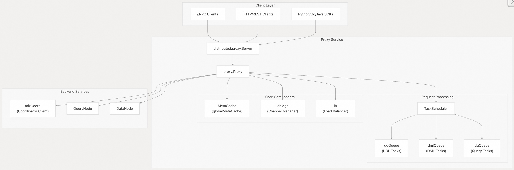     
  
来源：  
- [`internal/distributed/proxy/service.go` 90-105](https://github.com/milvus-io/milvus/blob/18371773/internal/distributed/proxy/service.go#L90-L105)    
- [`internal/proxy/impl.go` 72](https://github.com/milvus-io/milvus/blob/18371773/internal/proxy/impl.go#L72-L72)      
- [`internal/proxy/proxy.go` 80-150](https://github.com/milvus-io/milvus/blob/18371773/internal/proxy/proxy.go#L80-L150)    
  
### 服务初始化流程    
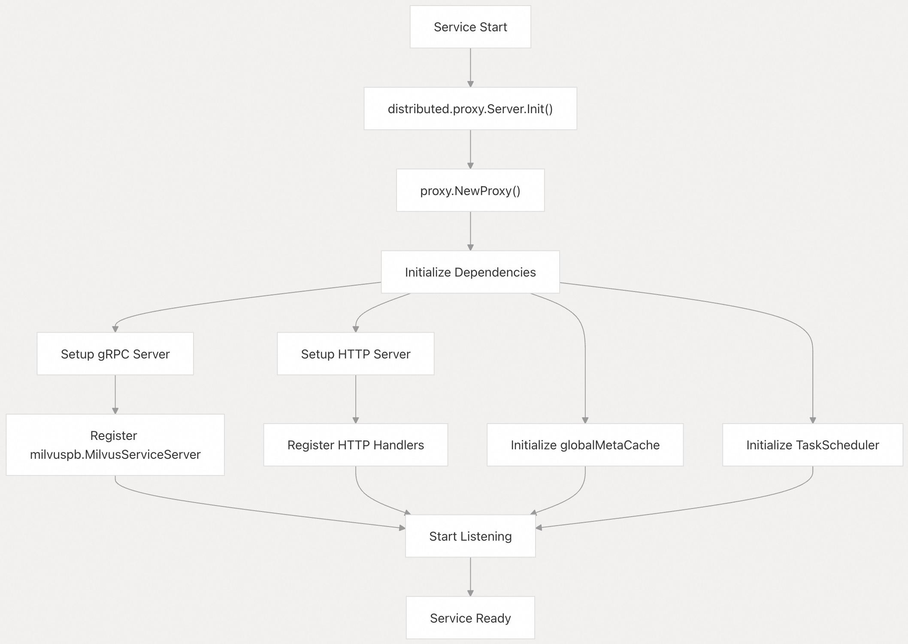     
  
来源：  
- [`internal/distributed/proxy/service.go` 200-300](https://github.com/milvus-io/milvus/blob/18371773/internal/distributed/proxy/service.go#L200-L300)      
- [`internal/proxy/proxy.go` 200-250](https://github.com/milvus-io/milvus/blob/18371773/internal/proxy/proxy.go#L200-L250)    
  
## 请求处理  
  
Proxy 通过标准化的基于任务的流水线处理请求，确保对不同类型操作的一致性处理。  
  
### 请求流程架构    
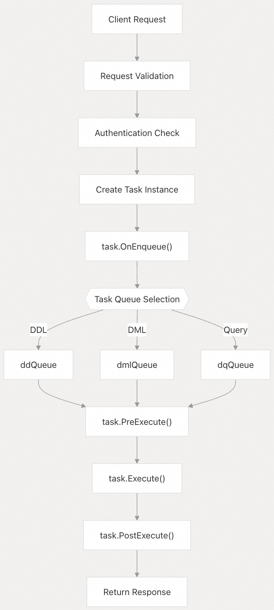     
  
来源：  
- [`internal/proxy/task.go` 130-151](https://github.com/milvus-io/milvus/blob/18371773/internal/proxy/task.go#L130-L151)      
- [`internal/proxy/impl.go` 265-275](https://github.com/milvus-io/milvus/blob/18371773/internal/proxy/impl.go#L265-L275)    
  
### 任务类型实现    
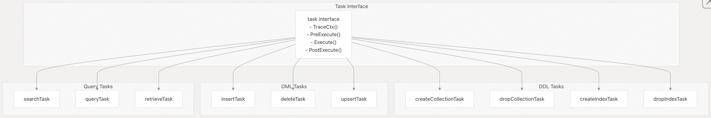     
  
来源：  
- [`internal/proxy/task.go` 130-151](https://github.com/milvus-io/milvus/blob/18371773/internal/proxy/task.go#L130-L151)      
- [`internal/proxy/task.go` 190-198](https://github.com/milvus-io/milvus/blob/18371773/internal/proxy/task.go#L190-L198)      
- [`internal/proxy/task_search.go` 54-97](https://github.com/milvus-io/milvus/blob/18371773/internal/proxy/task_search.go#L54-L97)      
- [`internal/proxy/task_query.go` 47-80](https://github.com/milvus-io/milvus/blob/18371773/internal/proxy/task_query.go#L47-L80)    
  
## 任务系统  
  
任务系统为处理不同类型的操作提供了一个统一框架，具备一致的生命周期管理、错误处理和可观测性。  
  
### 任务生命周期管理  
    
  
任务生命周期在每个阶段都包含计时和指标收集：  
  
| 阶段 | 方法 | 用途 |  
|------|------|------|  
| 创建 | `NewTaskCondition()` | 初始化任务上下文和等待机制 |  
| 入队 | `OnEnqueue()` | 设置消息类型、源 ID 和校验 |  
| 执行前 | `PreExecute()` | 校验参数、检查权限、准备请求 |  
| 执行 | `Execute()` | 将请求转发至相应服务（如 RootCoord、QueryCoord 等） |  
| 执行后 | `PostExecute()` | 处理响应、更新缓存、清理资源 |  
  
来源：  
- [`internal/proxy/task.go` 130-151](https://github.com/milvus-io/milvus/blob/18371773/internal/proxy/task.go#L130-L151)      
- [`internal/proxy/task.go` 153-180](https://github.com/milvus-io/milvus/blob/18371773/internal/proxy/task.go#L153-L180)    
  
### 搜索任务示例   
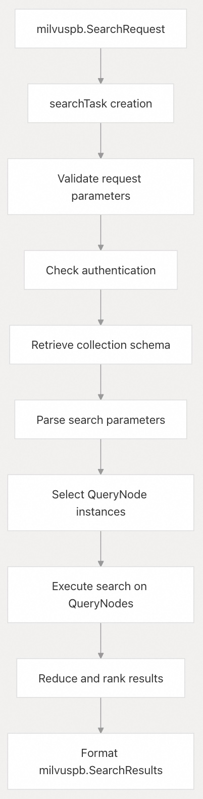    
  
来源：  
- [`internal/proxy/task_search.go` 127-287](https://github.com/milvus-io/milvus/blob/18371773/internal/proxy/task_search.go#L127-L287)      
- [`internal/proxy/task_search.go` 450-600](https://github.com/milvus-io/milvus/blob/18371773/internal/proxy/task_search.go#L450-L600)    
  
## 元数据缓存  
  
`globalMetaCache` 提供高性能缓存，用于缓存集合（collection）的 schema、分区信息和服务拓扑结构，以最小化对协调服务的调用。  
  
### 缓存架构  
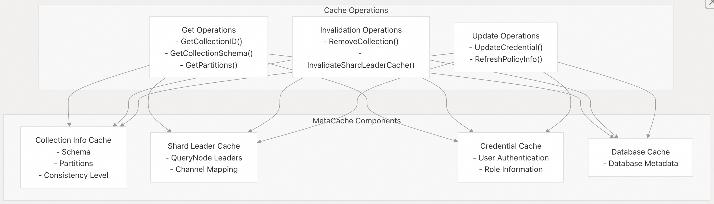    
  
### 缓存失效工作流    
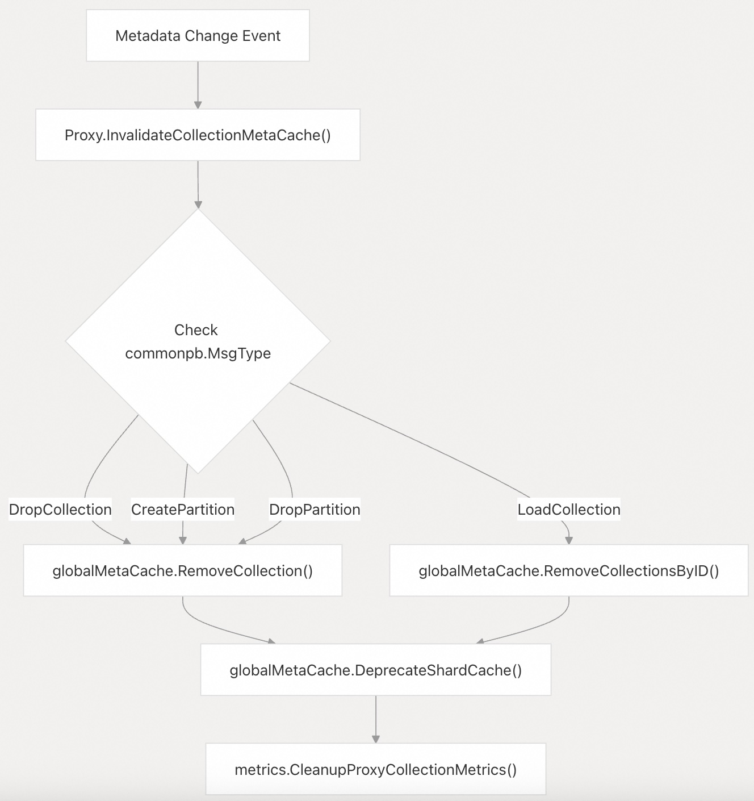    
  
来源：  
- [`internal/proxy/meta_cache.go` 53-96](https://github.com/milvus-io/milvus/blob/18371773/internal/proxy/meta_cache.go#L53-L96)      
- [`internal/proxy/impl.go` 103-208](https://github.com/milvus-io/milvus/blob/18371773/internal/proxy/impl.go#L103-L208)    
  
## 身份验证与安全  
  
Proxy 通过与凭证缓存和策略引擎集成，实现全面的身份验证和授权。  
  
### 身份验证流程  
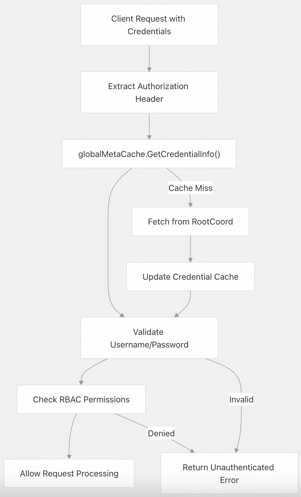    
  
### 限流与资源管理    
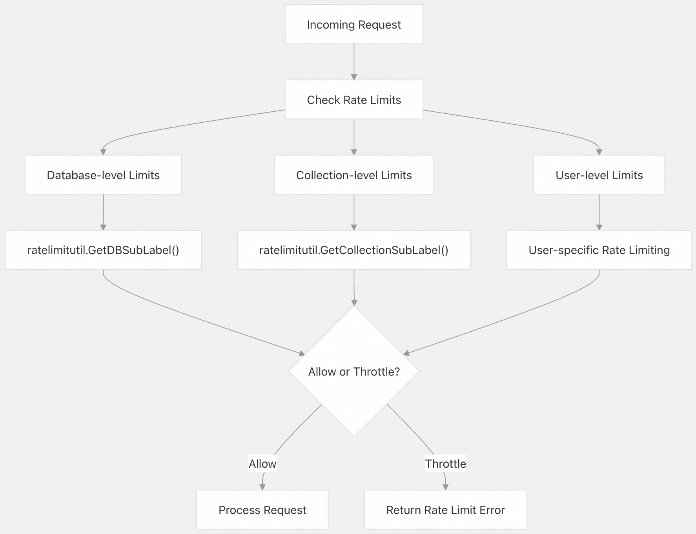    
  
来源：  
- [`internal/proxy/impl.go` 200-205](https://github.com/milvus-io/milvus/blob/18371773/internal/proxy/impl.go#L200-L205)      
- [`internal/proxy/util.go` 55-62](https://github.com/milvus-io/milvus/blob/18371773/internal/proxy/util.go#L55-L62)    
  
## 服务集成  
  
Proxy 通过定义良好的客户端接口和负载均衡策略，与多个后端服务集成。  
  
### 服务通信架构  
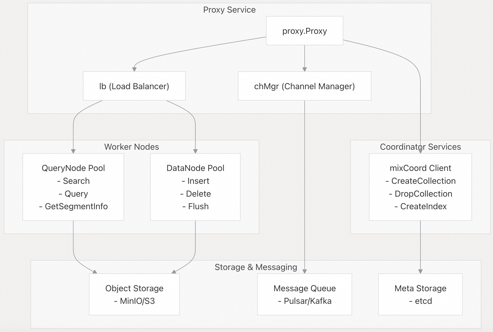    
  
### 负载均衡策略   
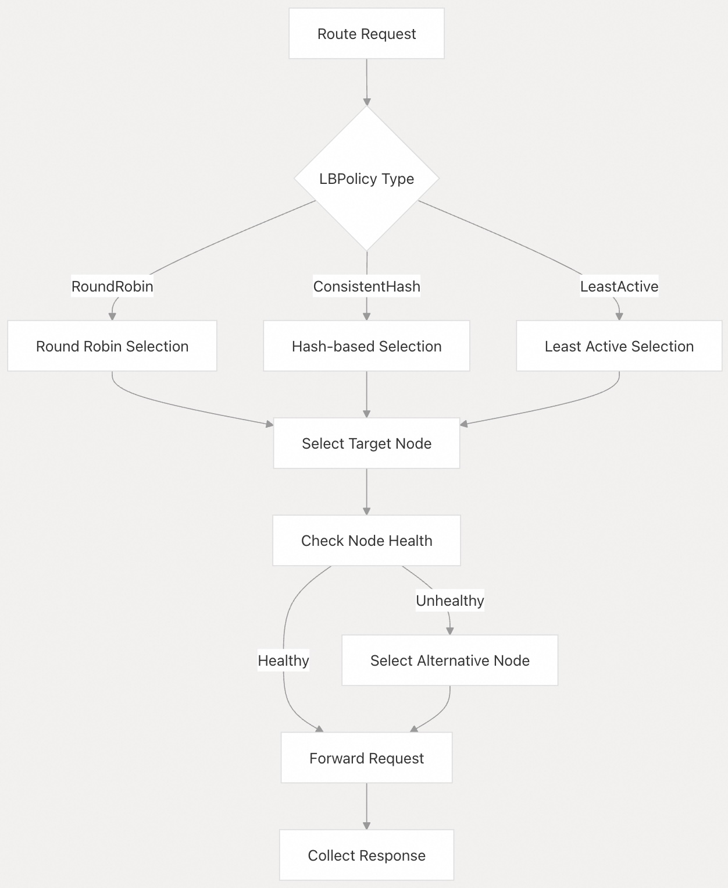    
  
来源：  
- [`internal/proxy/lb_policy.go`](https://github.com/milvus-io/milvus/blob/18371773/internal/proxy/lb_policy.go)      
- [`internal/proxy/impl.go` 80-150](https://github.com/milvus-io/milvus/blob/18371773/internal/proxy/impl.go#L80-L150)    
    
#### [期望 PostgreSQL|开源PolarDB 增加什么功能?](https://github.com/digoal/blog/issues/76 "269ac3d1c492e938c0191101c7238216")
  
  
#### [PolarDB 开源数据库](https://openpolardb.com/home "57258f76c37864c6e6d23383d05714ea")
  
  
#### [PolarDB 学习图谱](https://www.aliyun.com/database/openpolardb/activity "8642f60e04ed0c814bf9cb9677976bd4")
  
  
#### [PostgreSQL 解决方案集合](../201706/20170601_02.md "40cff096e9ed7122c512b35d8561d9c8")
  
  
#### [德哥 / digoal's Github - 公益是一辈子的事.](https://github.com/digoal/blog/blob/master/README.md "22709685feb7cab07d30f30387f0a9ae")
  
  
#### [About 德哥](https://github.com/digoal/blog/blob/master/me/readme.md "a37735981e7704886ffd590565582dd0")
  
  

  
