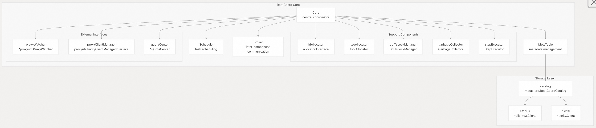
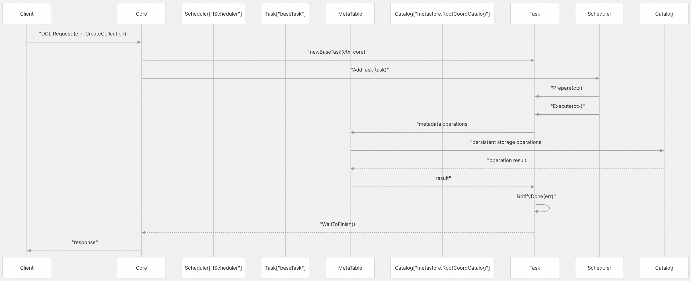
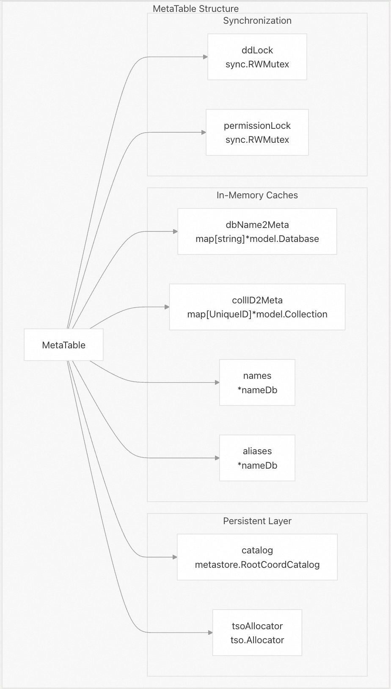
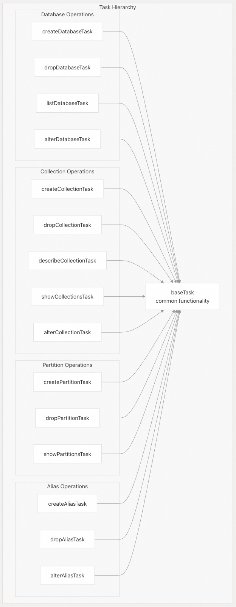
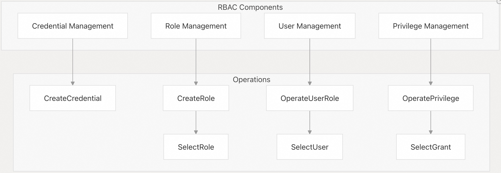
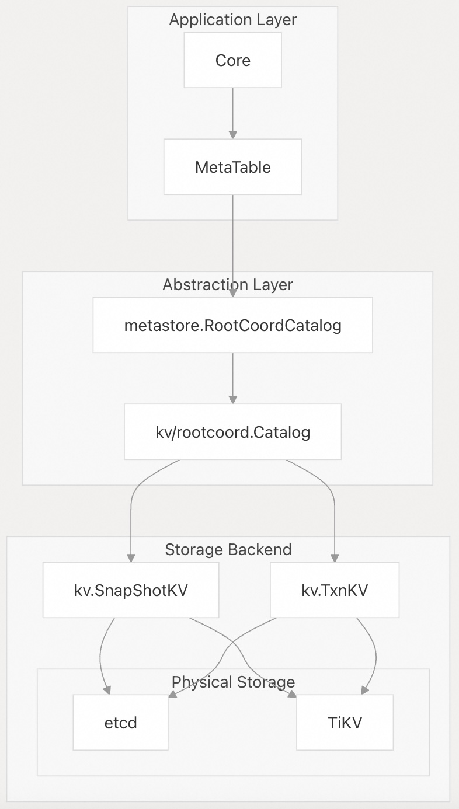
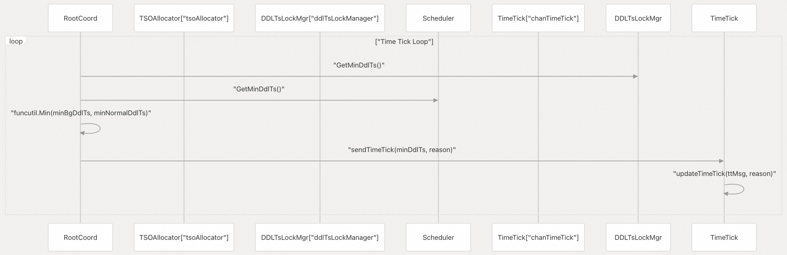
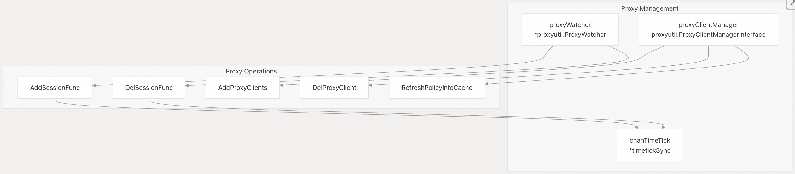

## Milvus 源码学习: 2.2 根协调器(Root Coordinator)   
                        
### 作者                       
digoal                      
                     
### 日期                    
2025-10-27                    
                      
### 标签                      
Milvus , 源码学习                       
                      
----                      
                      
## 背景                  
Root Coordinator（`RootCoord`）在 Milvus 分布式向量数据库系统中充当**中心元数据协调器和模式管理组件**。它负责管理集合（collection）的模式（schema）、数据库操作、DDL（数据定义语言）操作，并与其他系统组件协调以确保元数据一致性。  
  
## 架构概览  
  
Root Coordinator 采用基于任务的架构，围绕 `Core` 结构体构建，通过多个关键子系统协调元数据操作。  
  
### 核心组件架构    
  
  
来源：  
- [`internal/rootcoord/root_coord.go` 92-133](https://github.com/milvus-io/milvus/blob/18371773/internal/rootcoord/root_coord.go#L92-L133)  
  
### 任务处理流程    
  
  
来源：  
- [`internal/rootcoord/task.go` 46-61](https://github.com/milvus-io/milvus/blob/18371773/internal/rootcoord/task.go#L46-L61)    
- [`internal/rootcoord/root_coord.go` 825-856](https://github.com/milvus-io/milvus/blob/18371773/internal/rootcoord/root_coord.go#L825-L856)  
  
## 核心组件  
  
### Core 结构体  
  
`Core` 结构体作为主协调器，实现 RootCoord 的主要功能：  
  
| 字段 | 类型 | 用途 |  
|------|------|------|  
| `meta` | `IMetaTable` | 元数据管理接口 |  
| `scheduler` | `IScheduler` | 任务调度与执行 |  
| `broker` | `Broker` | 组件间通信 |  
| `idAllocator` | `allocator.Interface` | 唯一 ID 生成 |  
| `tsoAllocator` | `tso.Allocator` | 时间戳分配 |  
| `ddlTsLockManager` | `DdlTsLockManager` | DDL 时间戳同步 |  
| `proxyWatcher` | `*proxyutil.ProxyWatcher` | Proxy 节点监控 |  
  
来源：  
- [`internal/rootcoord/root_coord.go` 92-133](https://github.com/milvus-io/milvus/blob/18371773/internal/rootcoord/root_coord.go#L92-L133)  
  
### MetaTable  
  
`MetaTable` 负责管理数据库、集合和分区的持久化元数据：    
  
  
  
来源：  
- [`internal/rootcoord/meta_table.go` 120-138](https://github.com/milvus-io/milvus/blob/18371773/internal/rootcoord/meta_table.go#L120-L138)  
  
### 任务系统  
  
RootCoord 实现了基于任务的架构，所有 DDL 操作均作为任务执行：    
  
  
  
来源：  
- [`internal/rootcoord/task.go` 63-141](https://github.com/milvus-io/milvus/blob/18371773/internal/rootcoord/task.go#L63-L141)  
  
## 关键操作  
  
### 数据库管理  
  
RootCoord 通过专用任务实现处理数据库生命周期操作：  
  
| 操作 | 方法 | 任务类型 |  
|------|------|----------|  
| 创建数据库 | `CreateDatabase` | `createDatabaseTask` |  
| 删除数据库 | `DropDatabase` | `dropDatabaseTask` |  
| 列出数据库 | `ListDatabases` | `listDatabaseTask` |  
| 修改数据库 | `AlterDatabase` | `alterDatabaseTask` |  
  
来源：  
- [`internal/rootcoord/root_coord.go` 813-902](https://github.com/milvus-io/milvus/blob/18371773/internal/rootcoord/root_coord.go#L813-L902)  
  
### 集合管理  
  
集合(概念类似关系数据库中的表)操作是 RootCoord 功能的核心：  
  
| 操作 | 方法 | 关键组件 |  
|------|------|----------|  
| 创建集合 | `CreateCollection` | 模式验证、通道分配、元数据持久化 |  
| 删除集合 | `DropCollection` | 垃圾回收协调、元数据清理 |  
| 描述集合 | `DescribeCollection` | 模式检索、集合信息组装 |  
| 显示集合 | `ShowCollections` | 带过滤的集合列表 |  
| 修改集合 | `AlterCollection` | 模式修改、字段操作 |  
  
来源：  
- [`internal/rootcoord/root_coord.go` 944-1092](https://github.com/milvus-io/milvus/blob/18371773/internal/rootcoord/root_coord.go#L944-L1092)  
  
### RBAC 管理  
  
RootCoord 实现了全面的基于角色的访问控制（RBAC）：    
  
  
  
来源：  
- [`internal/rootcoord/meta_table.go` 94-117](https://github.com/milvus-io/milvus/blob/18371773/internal/rootcoord/meta_table.go#L94-L117)  
  
## 数据流与持久化  
  
### 元数据存储架构    
  
  
来源：  
- [`internal/metastore/kv/rootcoord/kv_catalog.go` 41-51](https://github.com/milvus-io/milvus/blob/18371773/internal/metastore/kv/rootcoord/kv_catalog.go#L41-L51)    
- [`internal/rootcoord/root_coord.go` 309-323](https://github.com/milvus-io/milvus/blob/18371773/internal/rootcoord/root_coord.go#L309-L323)  
  
### 时间同步  
  
RootCoord 通过时间滴答（time tick）机制协调分布式时间戳：    
  
  
  
来源：  
- [`internal/rootcoord/root_coord.go` 184-246](https://github.com/milvus-io/milvus/blob/18371773/internal/rootcoord/root_coord.go#L184-L246)  
  
## 与其他组件的集成  
  
### 组件间通信  
  
`Broker` 接口促进与其他 Milvus 组件的通信：  
  
| 方法 | 目标组件 | 用途 |  
|------|----------|------|  
| `ReleaseCollection` | QueryCoord | 集合卸载 |  
| `WatchChannels` | DataCoord | 通道监控 |  
| `GetSegmentStates` | DataCoord | 分段状态查询 |  
| `DropCollectionIndex` | IndexCoord | 索引清理 |  
| `BroadcastAlteredCollection` | Proxy | 模式变更通知 |  
  
来源：  
- [`internal/rootcoord/broker.go` 49-64](https://github.com/milvus-io/milvus/blob/18371773/internal/rootcoord/broker.go#L49-L64)  
  
### Proxy 集成  
  
RootCoord 通过 `ProxyWatcher` 和 `ProxyClientManager` 管理 Proxy 节点：    
  
  
  
来源：  
- [`internal/rootcoord/root_coord.go` 446-452](https://github.com/milvus-io/milvus/blob/18371773/internal/rootcoord/root_coord.go#L446-L452)    
- [`internal/rootcoord/root_coord.go` 675-690](https://github.com/milvus-io/milvus/blob/18371773/internal/rootcoord/root_coord.go#L675-L690)  
    
    
#### [期望 PostgreSQL|开源PolarDB 增加什么功能?](https://github.com/digoal/blog/issues/76 "269ac3d1c492e938c0191101c7238216")
  
  
#### [PolarDB 开源数据库](https://openpolardb.com/home "57258f76c37864c6e6d23383d05714ea")
  
  
#### [PolarDB 学习图谱](https://www.aliyun.com/database/openpolardb/activity "8642f60e04ed0c814bf9cb9677976bd4")
  
  
#### [PostgreSQL 解决方案集合](../201706/20170601_02.md "40cff096e9ed7122c512b35d8561d9c8")
  
  
#### [德哥 / digoal's Github - 公益是一辈子的事.](https://github.com/digoal/blog/blob/master/README.md "22709685feb7cab07d30f30387f0a9ae")
  
  
#### [About 德哥](https://github.com/digoal/blog/blob/master/me/readme.md "a37735981e7704886ffd590565582dd0")
  
  

  
