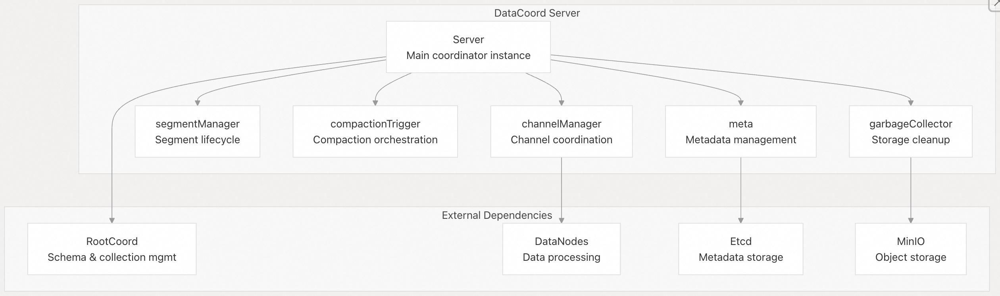
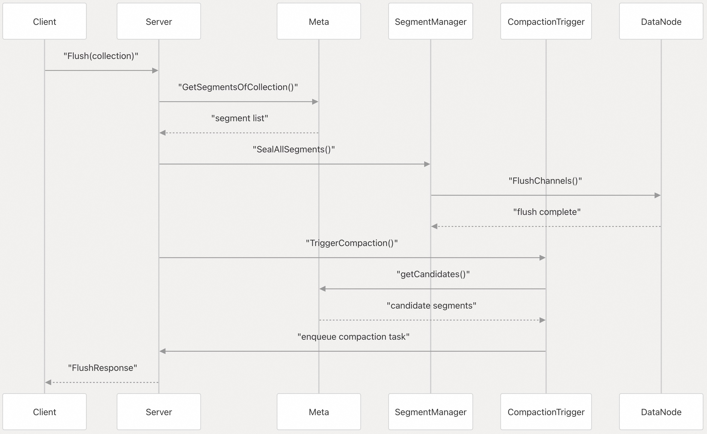
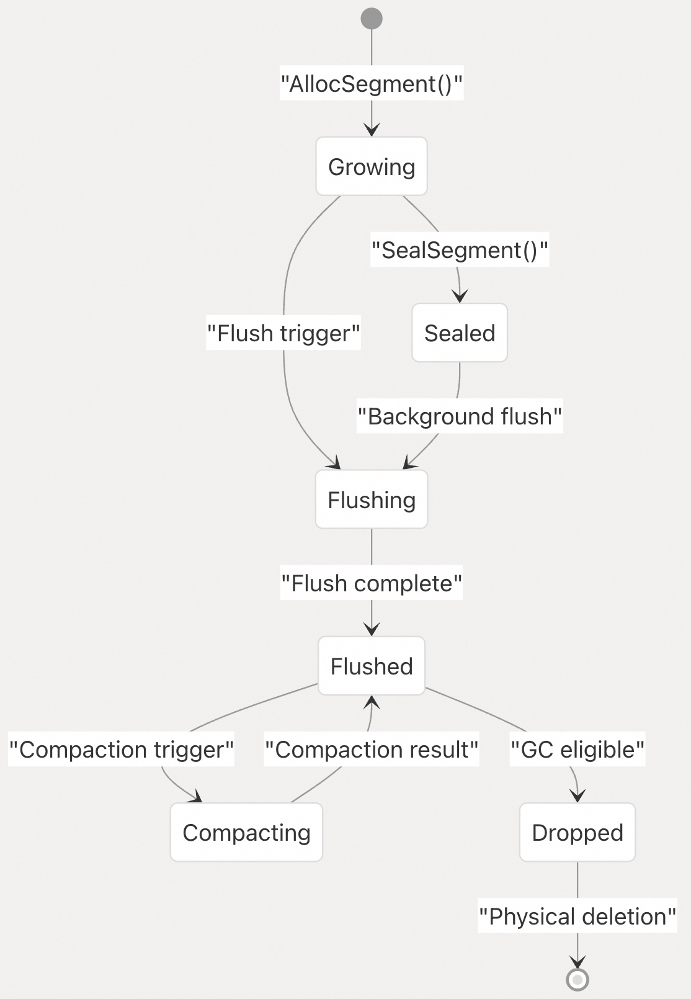
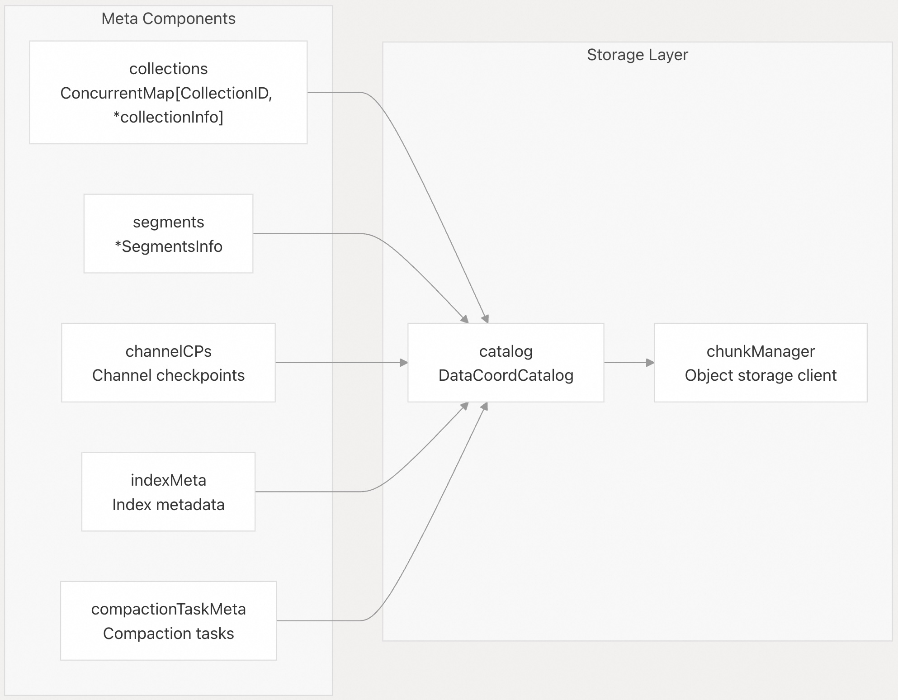
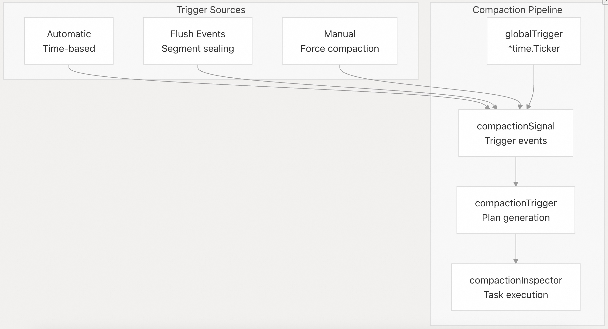
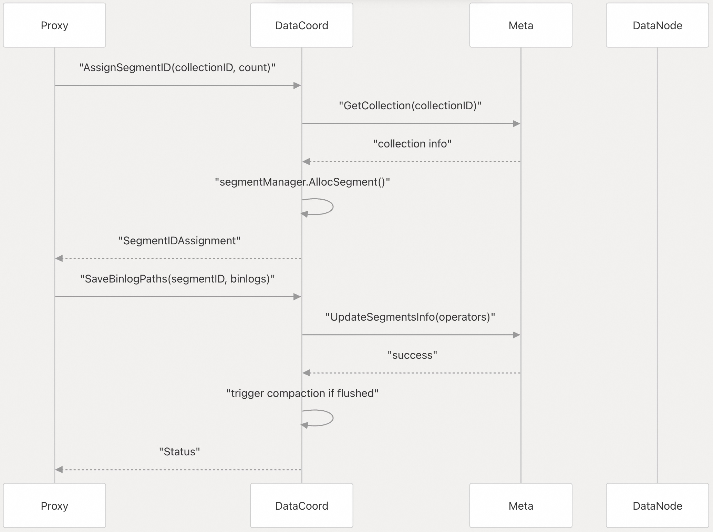
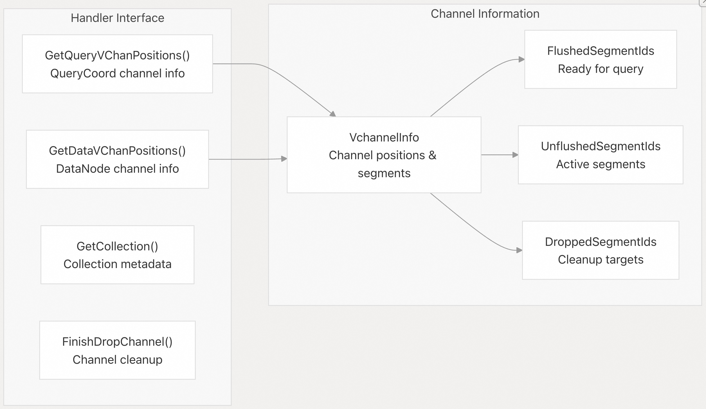
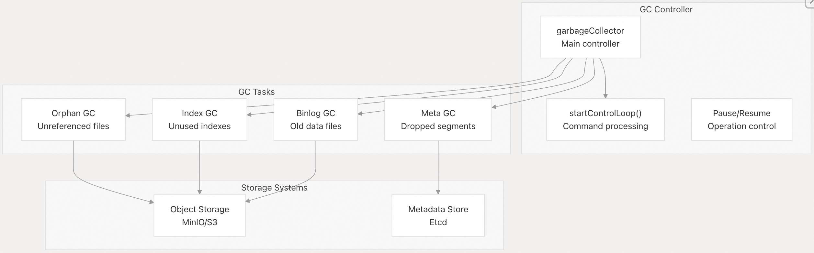

## Milvus 源码学习: 2.3 数据协调器(Data Coordinator)     
                          
### 作者                         
digoal                        
                       
### 日期                      
2025-10-27                      
                        
### 标签                        
Milvus , 源码学习                         
                        
----                        
                        
## 背景                    
Data Coordinator（DataCoord）在 Milvus 的分布式架构中负责管理**分段（segment）生命周期、压缩（compaction）和数据组织**。它作为所有数据相关操作的中心协调器，与 DataNode 紧密协作，确保数据的高效存储与检索。  
  
数据协调器（Data Coordinator）负责以下工作：  
- 分片（Segment）生命周期管理（创建、封存、压缩、垃圾回收）    
- 通道（Channel）分配以及与数据节点（DataNodes）的协调    
- 元数据持久化与同步    
- 压缩（Compaction）触发及执行协调    
- 索引构建协调    
- 存储资源管理与清理  
  
来源：  
- [`internal/datacoord/server.go` 102–171](https://github.com/milvus-io/milvus/blob/18371773/internal/datacoord/server.go#L102-L171)    
- [`internal/datacoord/services.go` 17–56](https://github.com/milvus-io/milvus/blob/18371773/internal/datacoord/services.go#L17-L56)  
  
## 架构概览  
  
### 核心服务器结构  
  
Data Coordinator 以 `Server` 结构体实现，协调多个子系统：    
  
  
  
来源：  
- [`internal/datacoord/server.go` 104–171](https://github.com/milvus-io/milvus/blob/18371773/internal/datacoord/server.go#L104-L171)    
- [`internal/datacoord/meta.go` 85–106](https://github.com/milvus-io/milvus/blob/18371773/internal/datacoord/meta.go#L85-L106)  
  
### 组件交互    
  
  
来源：  
- [`internal/datacoord/services.go` 73–113](https://github.com/milvus-io/milvus/blob/18371773/internal/datacoord/services.go#L73-L113)    
- [`internal/datacoord/compaction_trigger.go` 270–316](https://github.com/milvus-io/milvus/blob/18371773/internal/datacoord/compaction_trigger.go#L270-L316)  
  
## 核心职责  
  
### 分段生命周期管理  
  
Data Coordinator 通过 `meta` 组件和 `SegmentManager` 管理分段的完整生命周期：  
  
  
  
分段管理的关键方法：    
- `AssignSegmentID()` — 为数据插入分配新分段    
- `SaveBinlogPaths()` — 使用 binlog 路径更新分段元数据    
- `SetSegmentState()` — 转换分段状态    
- `Flush()` — 触发分段封存与刷盘    
  
来源：  
- [`internal/datacoord/services.go` 261–320](https://github.com/milvus-io/milvus/blob/18371773/internal/datacoord/services.go#L261-L320)    
- [`internal/datacoord/services.go` 571–730](https://github.com/milvus-io/milvus/blob/18371773/internal/datacoord/services.go#L571-L730)    
- [`internal/datacoord/meta.go` 687–730](https://github.com/milvus-io/milvus/blob/18371773/internal/datacoord/meta.go#L687-L730)  
  
### 元数据管理  
  
`meta` 结构体提供集中化的元数据操作：  
  
  
  
核心元数据操作：    
- `AddSegment()` — 持久化新分段信息    
- `UpdateSegmentsInfo()` — 批量更新分段元数据    
- `GetHealthySegment()` — 获取活跃分段信息    
- `UpdateChannelCheckpoint()` — 更新通道进度跟踪    
  
来源：  
- [`internal/datacoord/meta.go` 85–106](https://github.com/milvus-io/milvus/blob/18371773/internal/datacoord/meta.go#L85-L106)    
- [`internal/datacoord/meta.go` 554–601](https://github.com/milvus-io/milvus/blob/18371773/internal/datacoord/meta.go#L554-L601)  
  
### 压缩管理  
  
压缩系统采用基于触发器的架构：  
  
  
  
压缩工作流：    
- 1、`schedule()` — 周期性生成触发信号    
- 2、`handleSignal()` — 处理压缩信号    
- 3、`generatePlans()` — 生成压缩执行计划    
- 4、`enqueueCompaction()` — 将任务提交给 inspector    
  
来源：  
- [`internal/datacoord/compaction_trigger.go` 117–157](https://github.com/milvus-io/milvus/blob/18371773/internal/datacoord/compaction_trigger.go#L117-L157)    
- [`internal/datacoord/compaction_trigger.go` 173–197](https://github.com/milvus-io/milvus/blob/18371773/internal/datacoord/compaction_trigger.go#L173-L197)    
- [`internal/datacoord/compaction_trigger.go` 325–434](https://github.com/milvus-io/milvus/blob/18371773/internal/datacoord/compaction_trigger.go#L325-L434)  
  
## 关键服务 API  
  
### 数据操作  
  
主服务接口提供以下关键操作：  
  
| 方法 | 用途 | 关键参数 |  
|------|------|----------|  
| `AssignSegmentID` | 为插入分配分段 | `CollectionID`, `PartitionID`, `ChannelName` |  
| `Flush` | 封存并刷盘分段 | `CollectionID`, `SegmentIDs` |  
| `SaveBinlogPaths` | 更新分段 binlog 元数据 | `SegmentID`, `BinlogPaths` |  
| `GetSegmentInfo` | 获取分段元数据 | `SegmentIDs`, `IncludeUnHealthy` |  
  
  
  
来源：  
- [`internal/datacoord/services.go` 262–320](https://github.com/milvus-io/milvus/blob/18371773/internal/datacoord/services.go#L262-L320)    
- [`internal/datacoord/services.go` 571–730](https://github.com/milvus-io/milvus/blob/18371773/internal/datacoord/services.go#L571-L730)  
  
### 通道管理  
  
`Handler` 接口提供通道协调能力：    
  
  
  
来源：  
- [`internal/datacoord/handler.go` 37–48](https://github.com/milvus-io/milvus/blob/18371773/internal/datacoord/handler.go#L37-L48)    
- [`internal/datacoord/handler.go` 113–236](https://github.com/milvus-io/milvus/blob/18371773/internal/datacoord/handler.go#L113-L236)  
  
## 垃圾回收系统  
  
垃圾回收器通过多个专用例程管理存储清理：  
  
  
  
GC 操作以不同的间隔运行：  
- 元数据清理（Meta cleanup）：检查间隔（`checkInterval`，频率较高）    
- 孤立文件扫描（Orphan file scanning）：扫描间隔（`scanInterval`，频率较低）    
- 每种任务类型均有可配置的容忍周期（tolerance periods）。  
  
来源：  
- [`internal/datacoord/garbage_collector.go` 63–132](https://github.com/milvus-io/milvus/blob/18371773/internal/datacoord/garbage_collector.go#L63-L132)    
- [`internal/datacoord/garbage_collector.go` 184–213](https://github.com/milvus-io/milvus/blob/18371773/internal/datacoord/garbage_collector.go#L184-L213)  
  
## 配置与生命周期  
  
### 服务器初始化  
  
Data Coordinator 遵循结构化的初始化序列：  
  
  
  
关键初始化组件：    
- `initMeta()` — 从存储加载现有元数据    
- `initCluster()` — 设置 DataNode 通信    
- `initCompaction()` — 启动压缩(compaction)子系统    
- `initGarbageCollection()` — 配置存储清理    
  
来源：  
- [`internal/datacoord/server.go` 270–350](https://github.com/milvus-io/milvus/blob/18371773/internal/datacoord/server.go#L270-L350)    
- [`internal/datacoord/server.go` 425–441](https://github.com/milvus-io/milvus/blob/18371773/internal/datacoord/server.go#L425-L441)  
  
### 运行时操作  
  
服务器运行多个并发循环：  
  
| 循环类型 | 组件 | 频率 | 用途 |  
|----------|------|------|------|  
| 压缩触发器 | `compactionTrigger.schedule()` | `MixCompactionTriggerInterval` | 自动压缩 |  
| GC 元数据清理 | `garbageCollector.recycleDroppedSegments()` | `GCInterval` | 元数据清理 |  
| GC 孤立文件扫描 | `garbageCollector.recycleUnusedBinlogFiles()` | `GCScanIntervalInHour` | 存储扫描 |  
| 刷盘处理 | `startFlushLoop()` | 事件驱动 | 触发索引构建 |  
    
来源：  
- [`internal/datacoord/compaction_trigger.go` 173–197](https://github.com/milvus-io/milvus/blob/18371773/internal/datacoord/compaction_trigger.go#L173-L197)    
- [`internal/datacoord/garbage_collector.go` 245–275](https://github.com/milvus-io/milvus/blob/18371773/internal/datacoord/garbage_collector.go#L245-L275)    
- [`internal/datacoord/server.go` 729–741](https://github.com/milvus-io/milvus/blob/18371773/internal/datacoord/server.go#L729-L741)  
      
#### [期望 PostgreSQL|开源PolarDB 增加什么功能?](https://github.com/digoal/blog/issues/76 "269ac3d1c492e938c0191101c7238216")
  
  
#### [PolarDB 开源数据库](https://openpolardb.com/home "57258f76c37864c6e6d23383d05714ea")
  
  
#### [PolarDB 学习图谱](https://www.aliyun.com/database/openpolardb/activity "8642f60e04ed0c814bf9cb9677976bd4")
  
  
#### [PostgreSQL 解决方案集合](../201706/20170601_02.md "40cff096e9ed7122c512b35d8561d9c8")
  
  
#### [德哥 / digoal's Github - 公益是一辈子的事.](https://github.com/digoal/blog/blob/master/README.md "22709685feb7cab07d30f30387f0a9ae")
  
  
#### [About 德哥](https://github.com/digoal/blog/blob/master/me/readme.md "a37735981e7704886ffd590565582dd0")
  
  

  
