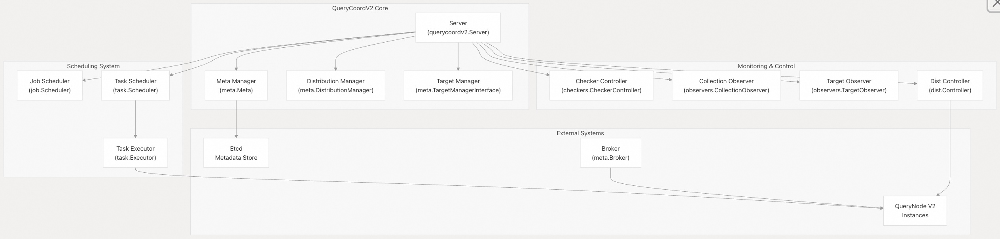
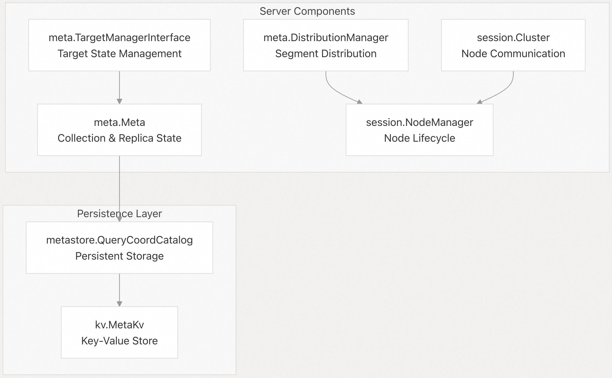
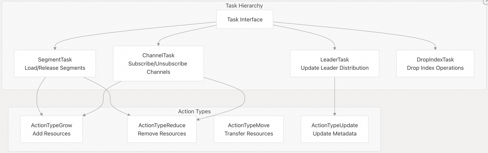
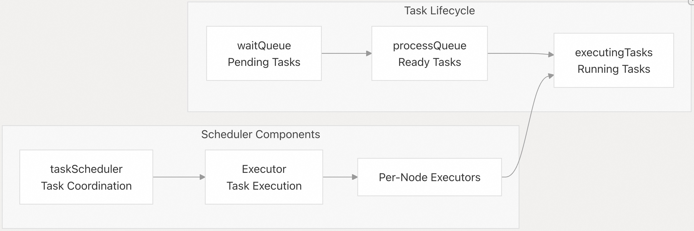
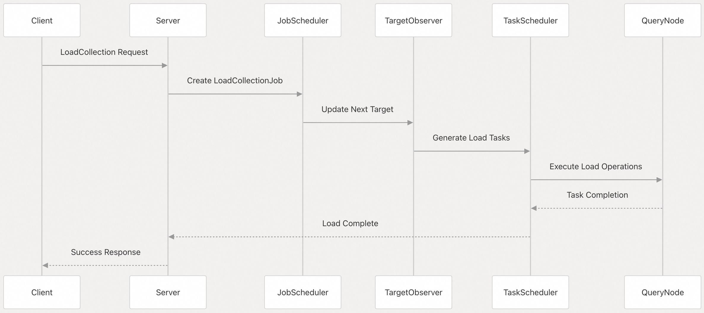
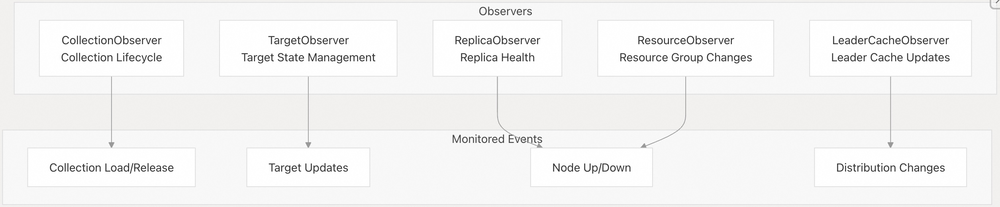
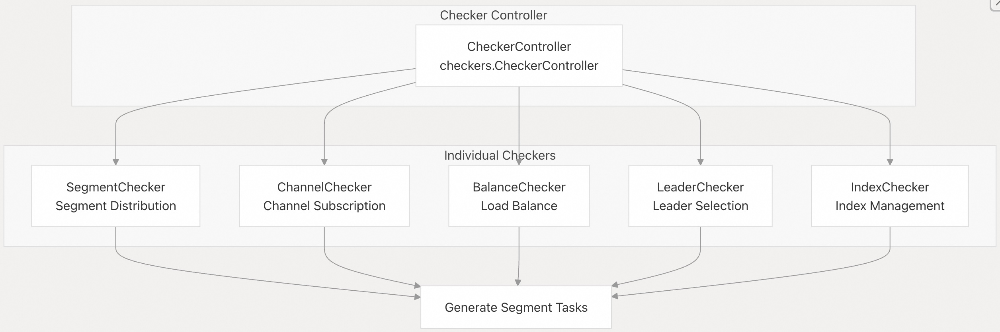
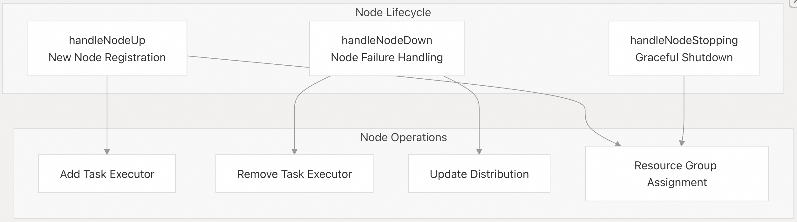

## Milvus 源码学习: 2.4 查询协调器(Query Coordinator V2)     
                            
### 作者                           
digoal                          
                         
### 日期                        
2025-10-27                        
                          
### 标签                          
Milvus , 源码学习                           
                          
----                          
                          
## 背景                      
Query Coordinator V2（QueryCoordV2）是 Milvus 分布式架构中的一个核心组件，负责管理查询操作、负载均衡以及协调查询节点。它作为系统中所有读取操作的中央协调器，处理集合加载、分片（segment）分发以及跨多个 QueryNode 实例的查询路由。  
  
## 架构概览  
QueryCoordV2 作为一个有状态的协调服务运行，维护已加载集合的元数据、管理查询节点会话，并协调分布式查询执行。它采用主从（master-worker）模式，其中 QueryCoordV2 作为主节点，协调多个 QueryNode 工作节点。  
  
### 高层架构  
  
  
来源：    
- [`internal/querycoordv2/server.go` 第 73–132 行](https://github.com/milvus-io/milvus/blob/18371773/internal/querycoordv2/server.go#L73-L132)    
- [`internal/querycoordv2/services.go`](https://github.com/milvus-io/milvus/blob/18371773/internal/querycoordv2/services.go)  
  
## 核心组件  
### Server  
主 Server 结构体协调所有 QueryCoordV2 操作，并维护以下关键组件：    
- 元数据管理：存储集合、分区和副本信息    
- 分发管理：跟踪各节点上的分片和信道（channel）分布    
- 目标管理：管理集合的当前目标状态和下一目标状态    
- 会话管理：处理 QueryNode 的生命周期和心跳    
- 任务编排：协调加载、释放和均衡操作    
  
  
  
来源：    
- [`internal/querycoordv2/server.go` 第 73–132 行](https://github.com/milvus-io/milvus/blob/18371773/internal/querycoordv2/server.go#L73-L132)    
- [`internal/querycoordv2/server.go` 第 384–431 行](https://github.com/milvus-io/milvus/blob/18371773/internal/querycoordv2/server.go#L384-L431)  
  
### 任务系统  
QueryCoordV2 使用一套复杂的任务系统来异步管理操作：  
  
#### 任务类型  
  
  
  
来源：    
- [`internal/querycoordv2/task/scheduler.go` 第 47–68 行](https://github.com/milvus-io/milvus/blob/18371773/internal/querycoordv2/task/scheduler.go#L47-L68)    
- [`internal/querycoordv2/task/task.go`](https://github.com/milvus-io/milvus/blob/18371773/internal/querycoordv2/task/task.go)  
  
#### 任务调度  
任务调度器通过优先级队列和资源约束来管理任务执行：  
  
  
  
来源：    
- [`internal/querycoordv2/task/scheduler.go` 第 283–343 行](https://github.com/milvus-io/milvus/blob/18371773/internal/querycoordv2/task/scheduler.go#L283-L343)    
- [`internal/querycoordv2/task/executor.go` 第 60–95 行](https://github.com/milvus-io/milvus/blob/18371773/internal/querycoordv2/task/executor.go#L60-L95)  
  
## 查询处理流程  
QueryCoordV2 通过标准化流程处理各种类型的操作：  
  
### 集合加载  
  
  
  
来源：    
- [`internal/querycoordv2/services.go` 第 196–311 行](https://github.com/milvus-io/milvus/blob/18371773/internal/querycoordv2/services.go#L196-L311)    
- [`internal/querycoordv2/job/job_load.go`](https://github.com/milvus-io/milvus/blob/18371773/internal/querycoordv2/job/job_load.go)  
  
### 负载均衡  
QueryCoordV2 提供自动和手动两种负载均衡能力：  
  
  
  
来源：    
- [`internal/querycoordv2/services.go` 第 707–808 行](https://github.com/milvus-io/milvus/blob/18371773/internal/querycoordv2/services.go#L707-L808)    
- [`internal/querycoordv2/checkers/balance_checker.go`](https://github.com/milvus-io/milvus/blob/18371773/internal/querycoordv2/checkers/balance_checker.go)    
- [`internal/querycoordv2/server.go` 第 323–352 行](https://github.com/milvus-io/milvus/blob/18371773/internal/querycoordv2/server.go#L323-L352)  
  
## 观察器(Observer)与检查器(Checker)  
QueryCoordV2 使用观察器（Observer）和检查器（Checker）模式进行监控和自动化管理：  
  
### 观察器系统  
  
  
  
来源：    
- [`internal/querycoordv2/observers/collection_observer.go` 第 44–95 行](https://github.com/milvus-io/milvus/blob/18371773/internal/querycoordv2/observers/collection_observer.go#L44-L95)    
- [`internal/querycoordv2/observers/target_observer.go` 第 74–127 行](https://github.com/milvus-io/milvus/blob/18371773/internal/querycoordv2/observers/target_observer.go#L74-L127)  
  
### 检查器系统  
  
  
  
来源：    
- [`internal/querycoordv2/checkers/controller.go`](https://github.com/milvus-io/milvus/blob/18371773/internal/querycoordv2/checkers/controller.go)    
- [`internal/querycoordv2/checkers/segment_checker.go` 第 44–68 行](https://github.com/milvus-io/milvus/blob/18371773/internal/querycoordv2/checkers/segment_checker.go#L44-L68)    
- [`internal/querycoordv2/checkers/balance_checker.go`](https://github.com/milvus-io/milvus/blob/18371773/internal/querycoordv2/checkers/balance_checker.go)  
  
## 服务接口  
QueryCoordV2 为客户端操作提供全面的服务接口：  
  
服务方法 | 用途 | 实现位置  
---|---|---  
`LoadCollection` | 将集合加载到查询节点 | [`services.go` 第 196–311 行](https://github.com/milvus-io/milvus/blob/18371773/services.go#L196-L311)  
`ReleaseCollection` | 从查询节点释放集合 | [`services.go` 第 313–352 行](https://github.com/milvus-io/milvus/blob/18371773/services.go#L313-L352)  
`LoadPartitions` | 加载指定分区 | [`services.go` 第 354–428 行](https://github.com/milvus-io/milvus/blob/18371773/services.go#L354-L428)  
`ReleasePartitions` | 释放指定分区 | [`services.go` 第 430–477 行](https://github.com/milvus-io/milvus/blob/18371773/services.go#L430-L477)  
`ShowLoadCollections` | 显示已加载集合的状态 | [`services.go` 第 57–128 行](https://github.com/milvus-io/milvus/blob/18371773/services.go#L57-L128)  
`ShowLoadPartitions` | 显示已加载分区的状态 | [`services.go` 第 130–194 行](https://github.com/milvus-io/milvus/blob/18371773/services.go#L130-L194)  
`LoadBalance` | 手动负载均衡 | [`services.go` 第 707–808 行](https://github.com/milvus-io/milvus/blob/18371773/services.go#L707-L808)  
`GetReplicas` | 获取副本信息 | [`services.go` 第 867–896 行](https://github.com/milvus-io/milvus/blob/18371773/services.go#L867-L896)  
`GetShardLeaders` | 获取分片（shard）领导者分布 | [`services.go` 第 898–970 行](https://github.com/milvus-io/milvus/blob/18371773/services.go#L898-L970)  
  
来源：    
- [`internal/querycoordv2/services.go`](https://github.com/milvus-io/milvus/blob/18371773/internal/querycoordv2/services.go)  
  
## 节点管理  
QueryCoordV2 通过会话管理和心跳监控来管理 QueryNode 实例：  
  
  
  
来源：    
- [`internal/querycoordv2/server.go` 第 738–785 行](https://github.com/milvus-io/milvus/blob/18371773/internal/querycoordv2/server.go#L738-L785)    
- [`internal/querycoordv2/server.go` 第 632–686 行](https://github.com/milvus-io/milvus/blob/18371773/internal/querycoordv2/server.go#L632-L686)  
  
## 配置与指标  
QueryCoordV2 支持丰富的配置和监控功能：    
- 配置：通过参数表实现动态配置    
- 指标：全面的指标收集用于监控    
- 健康检查：服务健康状态上报    
- 调试：提供调试端点用于系统内省    
  
来源：    
- [`internal/querycoordv2/server.go` 第 173–226 行](https://github.com/milvus-io/milvus/blob/18371773/internal/querycoordv2/server.go#L173-L226)    
- [`internal/querycoordv2/handlers.go`](https://github.com/milvus-io/milvus/blob/18371773/internal/querycoordv2/handlers.go)  
      
#### [期望 PostgreSQL|开源PolarDB 增加什么功能?](https://github.com/digoal/blog/issues/76 "269ac3d1c492e938c0191101c7238216")
  
  
#### [PolarDB 开源数据库](https://openpolardb.com/home "57258f76c37864c6e6d23383d05714ea")
  
  
#### [PolarDB 学习图谱](https://www.aliyun.com/database/openpolardb/activity "8642f60e04ed0c814bf9cb9677976bd4")
  
  
#### [PostgreSQL 解决方案集合](../201706/20170601_02.md "40cff096e9ed7122c512b35d8561d9c8")
  
  
#### [德哥 / digoal's Github - 公益是一辈子的事.](https://github.com/digoal/blog/blob/master/README.md "22709685feb7cab07d30f30387f0a9ae")
  
  
#### [About 德哥](https://github.com/digoal/blog/blob/master/me/readme.md "a37735981e7704886ffd590565582dd0")
  
  

  
