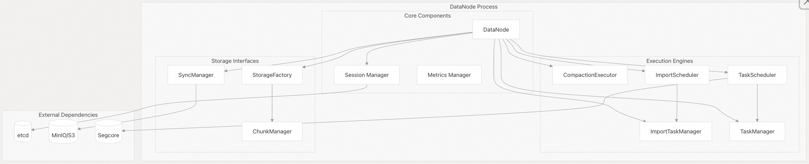
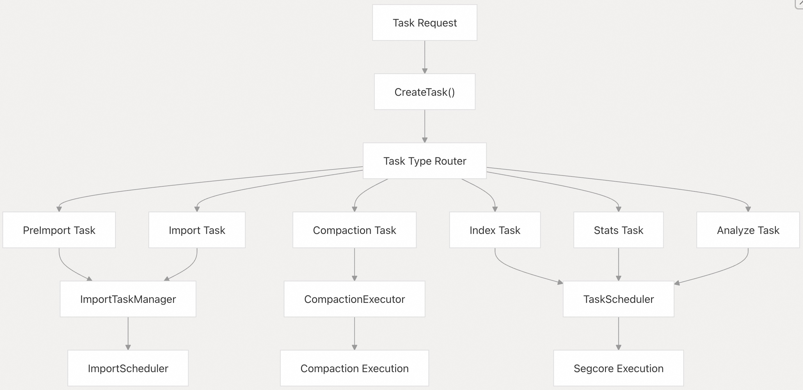
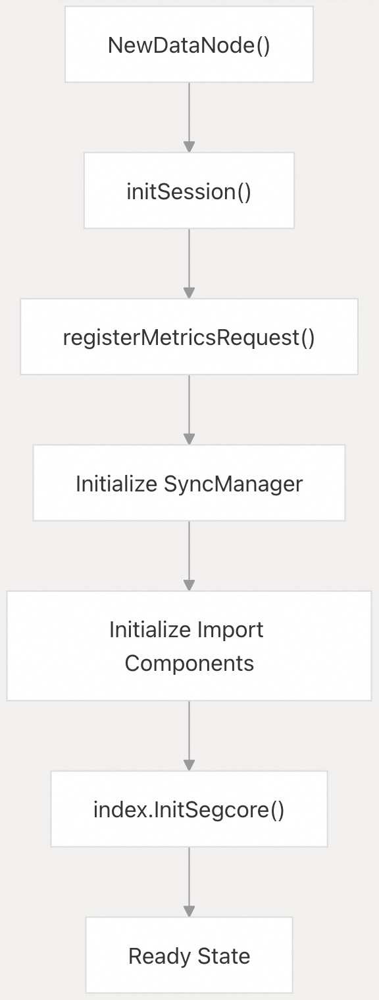

## Milvus 源码学习: 2.5 数据节点(Data Node)    
                              
### 作者                             
digoal                            
                           
### 日期                          
2025-10-27                          
                            
### 标签                            
Milvus , 源码学习                             
                            
----                            
                            
## 背景                        
Data Node 是 Milvus 中的一个核心执行组件，负责数据持久化、压缩（compaction）操作以及计算密集型任务，包括数据导入、索引构建和统计分析。它作为由 Data Coordinator 协调的数据管理操作的主要工作节点。  
  
## 架构概览  
  
DataNode 作为一个无状态的工作服务运行，执行由协调器委派的任务。它为不同类型的操作维护多个执行引擎，并通过基于槽位（slot-based）的系统管理资源分配。  
  
  
  
来源：    
- [`internal/datanode/data_node.go` 第 74-109 行](https://github.com/milvus-io/milvus/blob/18371773/internal/datanode/data_node.go#L74-L109)  
  
## 核心组件  
  
### DataNode 核心结构  
  
`DataNode` 结构体作为主协调器，同时实现了 `types.Component` 和 `types.DataNode` 接口。它管理所有执行引擎的生命周期，并维护与外部服务的连接。  
  
| 组件 | 类型 | 用途 |  
|---|---|---|  
| `syncMgr` | `syncmgr.SyncManager` | 管理数据同步至对象存储 |  
| `compactionExecutor` | `compactor.Executor` | 执行压缩任务 |  
| `importTaskMgr` | `importv2.TaskManager` | 管理导入任务的生命周期 |  
| `importScheduler` | `importv2.Scheduler` | 调度导入操作 |  
| `taskScheduler` | `index.TaskScheduler` | 调度索引和统计任务 |  
| `taskManager` | `index.TaskManager` | 管理索引任务的执行 |  
| `storageFactory` | `StorageFactory` | 创建存储管理器 |  
  
来源：    
- [`internal/datanode/data_node.go` 第 74-109 行](https://github.com/milvus-io/milvus/blob/18371773/internal/datanode/data_node.go#L74-L109)  
  
### 任务执行框架  
  
DataNode 通过统一的框架支持多种任务类型：  
  
  
  
来源：    
- [`internal/datanode/services.go` 第 535-603 行](https://github.com/milvus-io/milvus/blob/18371773/internal/datanode/services.go#L535-L603)  
  
## 核心操作  
  
### 数据导入流水线  
  
DataNode 处理两阶段的导入操作：预导入（pre-import）用于验证，实际导入（actual import）用于数据摄取。  
  
#### 预导入流程：  
  
- 1. 验证导入文件并生成统计信息    
- 2. 根据选项(options)创建 `PreImportTask` 或 `L0PreImportTask`    
- 3. 通过 `importTaskMgr` 处理文件    
  
#### 导入流程：  
  
- 1. 从已验证的数据创建分片（segment）    
- 2. 通过 `syncMgr` 将数据写入对象存储    
- 3. 向 Data Coordinator 上报完成状态    
  
来源：    
- [`internal/datanode/services.go` 第 310-344 行](https://github.com/milvus-io/milvus/blob/18371773/internal/datanode/services.go#L310-L344)    
- [`internal/datanode/services.go` 第 346-383 行](https://github.com/milvus-io/milvus/blob/18371773/internal/datanode/services.go#L346-L383)  
  
### 压缩操作  
  
DataNode 支持由 Data Coordinator 协调的多种压缩类型：  
  
| 压缩类型 | 用途 | 实现 |  
|---|---|---|  
| `Level0DeleteCompaction` | 应用来自 L0 分片的删除操作 | `LevelZeroCompactionTask` |  
| `MixCompaction` | 合并不同层级的分片 | `MixCompactionTask` |  
| `ClusteringCompaction` | 按聚类键重新组织数据 | `ClusteringCompactionTask` |  
| `SortCompaction` | 按主键对分片排序 | `SortCompactionTask` |  
  
  
  
来源：    
- [`internal/datanode/services.go` 第 162-264 行](https://github.com/milvus-io/milvus/blob/18371773/internal/datanode/services.go#L162-L264)    
- [`internal/datanode/services.go` 第 266-281 行](https://github.com/milvus-io/milvus/blob/18371773/internal/datanode/services.go#L266-L281)  
  
### 资源管理  
  
DataNode 采用基于槽位的资源管理机制，防止过载：    
- **总槽位数**：根据系统资源计算得出    
- **槽位分配**：在导入、压缩和索引任务之间分配    
- **槽位监控**：通过 `QuerySlot` API 提供    
  
来源：    
- [`internal/datanode/services.go` 第 486-523 行](https://github.com/milvus-io/milvus/blob/18371773/internal/datanode/services.go#L486-L523)    
- [`internal/datanode/data_node.go` 第 123 行](https://github.com/milvus-io/milvus/blob/18371773/internal/datanode/data_node.go#L123-L123)  
  
## 服务 API  
  
### 任务管理 API  
  
| 方法 | 用途 | 请求类型 |  
|---|---|---|  
| `CreateTask` | 创建各种类型的任务 | `workerpb.CreateTaskRequest` |  
| `QueryTask` | 查询任务状态和进度 | `workerpb.QueryTaskRequest` |  
| `DropTask` | 取消并清理任务 | `workerpb.DropTaskRequest` |  
  
### 导入管理 API  
  
| 方法 | 用途 | 请求类型 |  
|---|---|---|  
| `PreImport` | 验证导入文件 | `datapb.PreImportRequest` |  
| `ImportV2` | 执行数据导入 | `datapb.ImportRequest` |  
| `QueryPreImport` | 查询预导入状态 | `datapb.QueryPreImportRequest` |  
| `QueryImport` | 查询导入进度 | `datapb.QueryImportRequest` |  
| `DropImport` | 取消导入操作 | `datapb.DropImportRequest` |  
  
### 压缩 API  
  
| 方法 | 用途 | 请求类型 |  
|---|---|---|  
| `CompactionV2` | 执行压缩计划 | `datapb.CompactionPlan` |  
| `GetCompactionState` | 查询压缩状态 | `datapb.CompactionStateRequest` |  
| `DropCompactionPlan` | 取消压缩任务 | `datapb.DropCompactionPlanRequest` |  
  
来源：    
- [`internal/datanode/services.go` 第 51-756 行](https://github.com/milvus-io/milvus/blob/18371773/internal/datanode/services.go#L51-L756)  
  
## 生命周期管理  
  
### 初始化流程  
  
  
  
### 启动顺序  
  
- 1. **会话初始化**：建立 etcd 会话以实现服务发现    
- 2. **组件设置**：初始化所有执行引擎和管理器    
- 3. **Segcore 集成**：连接 C++ 核心引擎以执行索引操作    
- 4. **状态转换**：就绪时将状态更新为 `Healthy`    
  
来源：    
- [`internal/datanode/data_node.go` 第 186-214 行](https://github.com/milvus-io/milvus/blob/18371773/internal/datanode/data_node.go#L186-L214)    
- [`internal/datanode/data_node.go` 第 230-248 行](https://github.com/milvus-io/milvus/blob/18371773/internal/datanode/data_node.go#L230-L248)  
  
### 关闭流程  
  
DataNode 实现了优雅关闭，并进行适当的资源清理：  
  
- 1. **状态更新**：将状态设为 `Abnormal` 以停止接收新请求    
- 2. **组件清理**：按顺序停止所有执行引擎    
- 3. **会话清理**：从 etcd 注销并停止存活检查    
- 4. **资源释放**：关闭连接并释放资源    
  
来源：    
- [`internal/datanode/data_node.go` 第 272-311 行](https://github.com/milvus-io/milvus/blob/18371773/internal/datanode/data_node.go#L272-L311)  
    
#### [期望 PostgreSQL|开源PolarDB 增加什么功能?](https://github.com/digoal/blog/issues/76 "269ac3d1c492e938c0191101c7238216")
  
  
#### [PolarDB 开源数据库](https://openpolardb.com/home "57258f76c37864c6e6d23383d05714ea")
  
  
#### [PolarDB 学习图谱](https://www.aliyun.com/database/openpolardb/activity "8642f60e04ed0c814bf9cb9677976bd4")
  
  
#### [PostgreSQL 解决方案集合](../201706/20170601_02.md "40cff096e9ed7122c512b35d8561d9c8")
  
  
#### [德哥 / digoal's Github - 公益是一辈子的事.](https://github.com/digoal/blog/blob/master/README.md "22709685feb7cab07d30f30387f0a9ae")
  
  
#### [About 德哥](https://github.com/digoal/blog/blob/master/me/readme.md "a37735981e7704886ffd590565582dd0")
  
  

  
