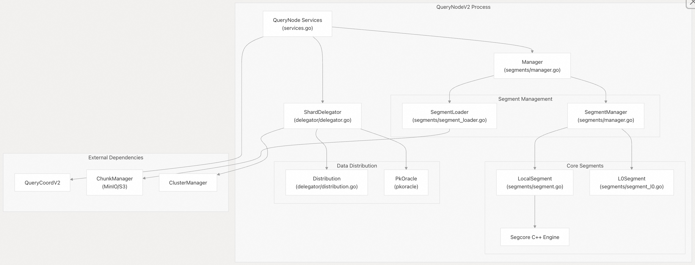
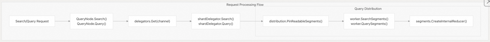
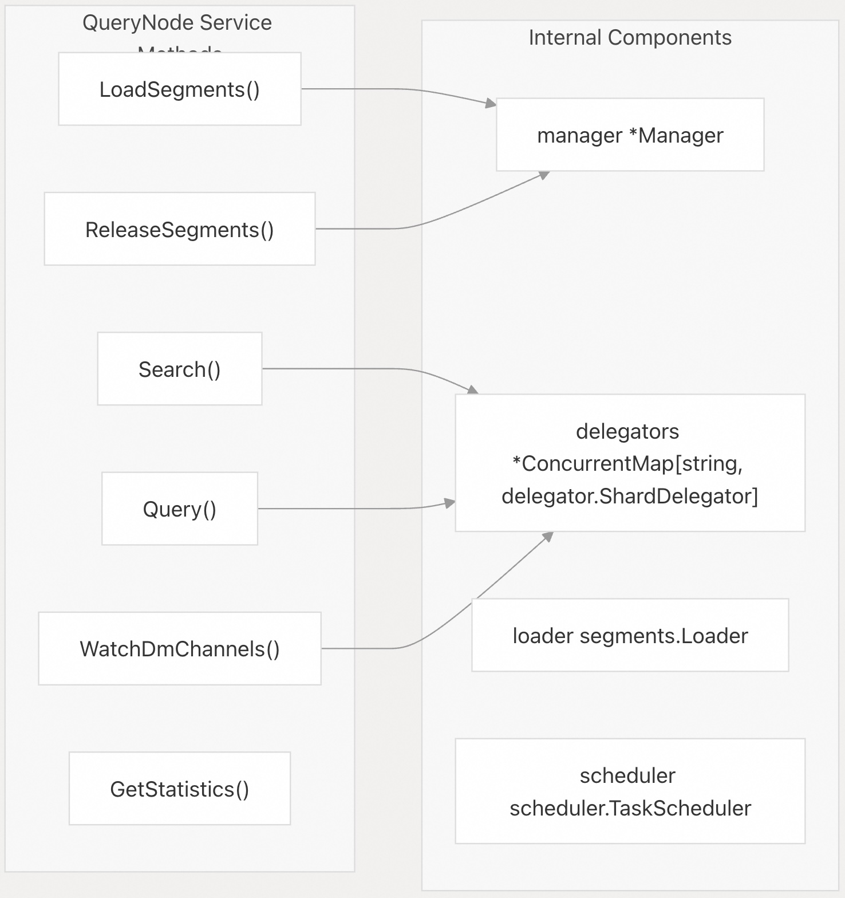
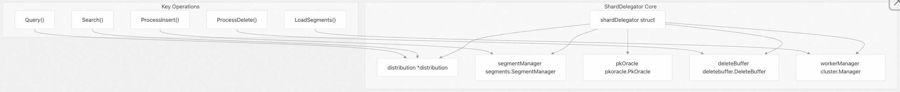
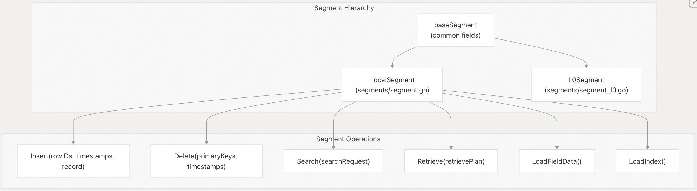
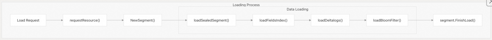
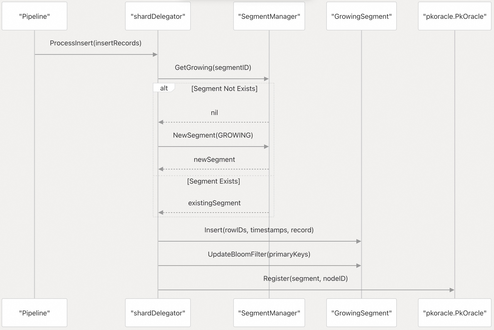
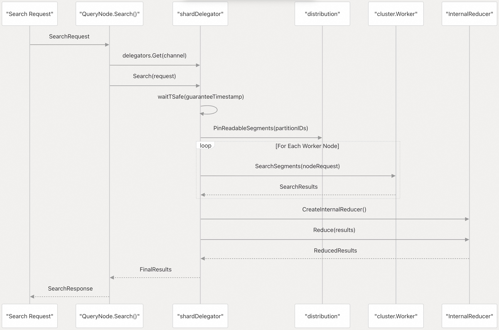
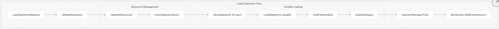
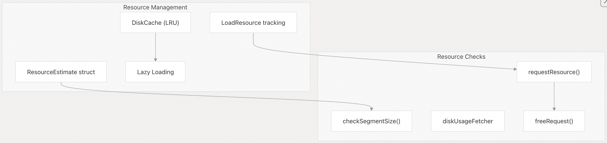

## Milvus 源码学习: 2.6 查询节点(Query Node V2)   
                                
### 作者                               
digoal                              
                             
### 日期                            
2025-10-27                            
                              
### 标签                              
Milvus , 源码学习                               
                              
----                              
                              
## 背景                          
Query Node V2 是 Milvus 中的分布式查询执行引擎，负责处理针对向量数据的搜索和查询请求。它管理数据分片（segment），协调分布式查询执行，并处理历史数据（已封存分片，sealed）和实时数据（增长中分片，growing）的加载与生命周期。    
  
## 架构概览    
Query Node V2 采用多层架构，清晰分离了服务接口、分片管理和查询执行：  
  
### 高层组件结构    
  
  
来源：    
- [`internal/querynodev2/services.go` 第 1–100 行](https://github.com/milvus-io/milvus/blob/18371773/internal/querynodev2/services.go#L1-L100)    
- [`internal/querynodev2/segments/manager.go` 第 73–78 行](https://github.com/milvus-io/milvus/blob/18371773/internal/querynodev2/segments/manager.go#L73-L78)      
- [`internal/querynodev2/delegator/delegator.go` 第 114–167 行](https://github.com/milvus-io/milvus/blob/18371773/internal/querynodev2/delegator/delegator.go#L114-L167)    
  
### 组件关系    
  
  
来源：    
- [`internal/querynodev2/services.go` 第 374–425 行](https://github.com/milvus-io/milvus/blob/18371773/internal/querynodev2/services.go#L374-L425)      
- [`internal/querynodev2/delegator/delegator.go` 第 304–371 行](https://github.com/milvus-io/milvus/blob/18371773/internal/querynodev2/delegator/delegator.go#L304-L371)      
- [`internal/querynodev2/handlers.go` 第 218–294 行](https://github.com/milvus-io/milvus/blob/18371773/internal/querynodev2/handlers.go#L218-L294)    
  
## 核心组件  
  
### QueryNode 服务层    
`QueryNode` 结构体作为主服务接口，实现了 gRPC 服务方法，用于处理来自 Proxy 和协调器的请求。    
  
  
  
来源：    
- [`internal/querynodev2/services.go` 第 62–100 行](https://github.com/milvus-io/milvus/blob/18371773/internal/querynodev2/services.go#L62-L100)      
- [`internal/querynodev2/services.go` 第 374–425 行](https://github.com/milvus-io/milvus/blob/18371773/internal/querynodev2/services.go#L374-L425)      
- [`internal/querynodev2/services.go` 第 827–892 行](https://github.com/milvus-io/milvus/blob/18371773/internal/querynodev2/services.go#L827-L892)    
  
### 分片委托器（Shard Delegator）    
`shardDelegator` 负责特定分片（DML 信道）的查询分发和数据一致性管理。    
  
  
  
来源：    
- [`internal/querynodev2/delegator/delegator.go` 第 114–167 行](https://github.com/milvus-io/milvus/blob/18371773/internal/querynodev2/delegator/delegator.go#L114-L167)      
- [`internal/querynodev2/delegator/delegator_data.go` 第 86–182 行](https://github.com/milvus-io/milvus/blob/18371773/internal/querynodev2/delegator/delegator_data.go#L86-L182)      
- [`internal/querynodev2/delegator/delegator_data.go` 第 396–514 行](https://github.com/milvus-io/milvus/blob/18371773/internal/querynodev2/delegator/delegator_data.go#L396-L514)    
  
### 分片管理    
Query Node V2 管理具有不同特性的多种分片类型：  
  
| 分片类型 | 描述 | 存储位置 | 可变性 |  
|---|---|---|---|  
| `SegmentTypeGrowing` | 接收插入操作的实时分片 | 内存 | 可变 |  
| `SegmentTypeSealed` | 封存后的历史分片 | 内存/磁盘 | 不可变 |  
| `L0Segment` | 用于删除操作的特殊增量分片 | 内存 | 不可变 |  
  
  
  
来源：    
- [`internal/querynodev2/segments/segment.go` 第 70–75 行](https://github.com/milvus-io/milvus/blob/18371773/internal/querynodev2/segments/segment.go#L70-L75)      
- [`internal/querynodev2/segments/segment.go` 第 280–379 行](https://github.com/milvus-io/milvus/blob/18371773/internal/querynodev2/segments/segment.go#L280-L379)      
- [`internal/querynodev2/segments/segment_l0.go` 第 19–50 行](https://github.com/milvus-io/milvus/blob/18371773/internal/querynodev2/segments/segment_l0.go#L19-L50)    
  
### 分片加载器（Segment Loader）    
`segmentLoader` 负责将分片数据从对象存储加载到内存中。    
  
  
  
来源：    
- [`internal/querynodev2/segments/segment_loader.go` 第 238–398 行](https://github.com/milvus-io/milvus/blob/18371773/internal/querynodev2/segments/segment_loader.go#L238-L398)      
- [`internal/querynodev2/segments/segment_loader.go` 第 817–942 行](https://github.com/milvus-io/milvus/blob/18371773/internal/querynodev2/segments/segment_loader.go#L817-L942)      
- [`internal/querynodev2/segments/segment_loader.go` 第 944–1006 行](https://github.com/milvus-io/milvus/blob/18371773/internal/querynodev2/segments/segment_loader.go#L944-L1006)    
  
## 数据处理流程  
  
### 插入数据处理    
  
  
  
来源：    
- [`internal/querynodev2/delegator/delegator_data.go` 第 86–182 行](https://github.com/milvus-io/milvus/blob/18371773/internal/querynodev2/delegator/delegator_data.go#L86-L182)    
  
### 搜索请求处理    
  
  
  
来源：    
- [`internal/querynodev2/services.go` 第 827–892 行](https://github.com/milvus-io/milvus/blob/18371773/internal/querynodev2/services.go#L827-L892)      
- [`internal/querynodev2/delegator/delegator.go` 第 304–371 行](https://github.com/milvus-io/milvus/blob/18371773/internal/querynodev2/delegator/delegator.go#L304-L371)      
- [`internal/querynodev2/handlers.go` 第 218–294 行](https://github.com/milvus-io/milvus/blob/18371773/internal/querynodev2/handlers.go#L218-L294)    
  
### 分片加载工作流    
  
  
  
来源：    
- [`internal/querynodev2/segments/segment_loader.go` 第 238–398 行](https://github.com/milvus-io/milvus/blob/18371773/internal/querynodev2/segments/segment_loader.go#L238-L398)      
- [`internal/querynodev2/segments/segment_loader.go` 第 445–513 行](https://github.com/milvus-io/milvus/blob/18371773/internal/querynodev2/segments/segment_loader.go#L445-L513)      
- [`internal/querynodev2/delegator/delegator_data.go` 第 396–514 行](https://github.com/milvus-io/milvus/blob/18371773/internal/querynodev2/delegator/delegator_data.go#L396-L514)    
  
## 分片生命周期管理  
  
### 分片状态与状态转换    
  
  
  
来源：    
- [`internal/querynodev2/segments/segment_loader.go` 第 944–1006 行](https://github.com/milvus-io/milvus/blob/18371773/internal/querynodev2/segments/segment_loader.go#L944-L1006)      
- [`internal/querynodev2/segments/manager.go` 第 90–166 行](https://github.com/milvus-io/milvus/blob/18371773/internal/querynodev2/segments/manager.go#L90-L166)    
  
### 内存与资源管理    
Query Node 实现了复杂的资源管理机制，包括：  
- **内存预估**：在加载分片之前，系统会预估内存和磁盘使用量    
- **资源限制**：通过可配置的阈值强制执行内存和磁盘容量限制    
- **惰性(lazy)加载**：封存分片（sealed segments）支持按需惰性加载，并配合磁盘缓存    
- **LRU 淘汰**：当资源受限时，未使用的分片会根据 LRU 策略从内存中淘汰  
  
  
  
来源：    
- [`internal/querynodev2/segments/segment_loader.go` 第 105–148 行](https://github.com/milvus-io/milvus/blob/18371773/internal/querynodev2/segments/segment_loader.go#L105-L148)      
- [`internal/querynodev2/segments/segment_loader.go` 第 445–531 行](https://github.com/milvus-io/milvus/blob/18371773/internal/querynodev2/segments/segment_loader.go#L445-L531)      
- [`internal/querynodev2/segments/manager.go` 第 90–166 行](https://github.com/milvus-io/milvus/blob/18371773/internal/querynodev2/segments/manager.go#L90-L166)    
  
## 集成点    
Query Node V2 与多个其他 Milvus 组件集成：  
- **Query Coordinator V2**：接收分片加载/卸载(loading/unloading)指令和目标更新    
- **Data Node**：消费 DML 信道数据，用于实时分片更新    
- **对象存储**：从 MinIO/S3 加载分片数据文件    
- **消息队列**：通过 Pulsar 订阅 DML 信道以获取流式数据    
- **Proxy**：为客户端应用程序提供搜索和查询请求服务    
  
该组件通过对上述集成的精细协调，维持 ACID 特性，确保在整个分布式系统中的数据一致性和可用性。  
  
来源：    
- [`internal/querynodev2/services.go` 第 196–390 行](https://github.com/milvus-io/milvus/blob/18371773/internal/querynodev2/services.go#L196-L390)      
- [`internal/querynodev2/delegator/delegator.go` 第 114–167 行](https://github.com/milvus-io/milvus/blob/18371773/internal/querynodev2/delegator/delegator.go#L114-L167)    
  
       
#### [期望 PostgreSQL|开源PolarDB 增加什么功能?](https://github.com/digoal/blog/issues/76 "269ac3d1c492e938c0191101c7238216")
  
  
#### [PolarDB 开源数据库](https://openpolardb.com/home "57258f76c37864c6e6d23383d05714ea")
  
  
#### [PolarDB 学习图谱](https://www.aliyun.com/database/openpolardb/activity "8642f60e04ed0c814bf9cb9677976bd4")
  
  
#### [PostgreSQL 解决方案集合](../201706/20170601_02.md "40cff096e9ed7122c512b35d8561d9c8")
  
  
#### [德哥 / digoal's Github - 公益是一辈子的事.](https://github.com/digoal/blog/blob/master/README.md "22709685feb7cab07d30f30387f0a9ae")
  
  
#### [About 德哥](https://github.com/digoal/blog/blob/master/me/readme.md "a37735981e7704886ffd590565582dd0")
  
  

  
