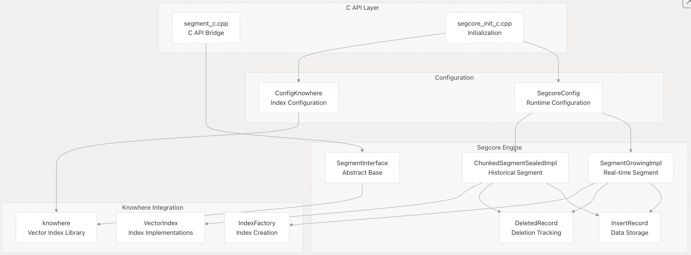
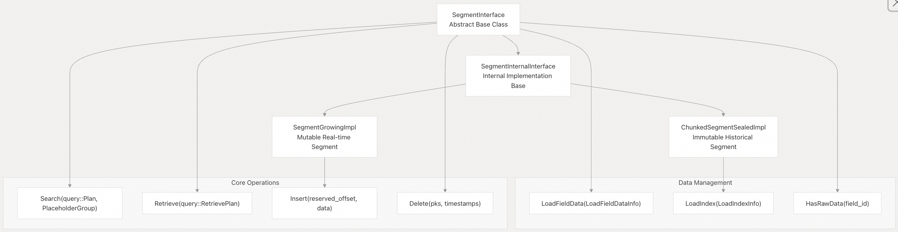
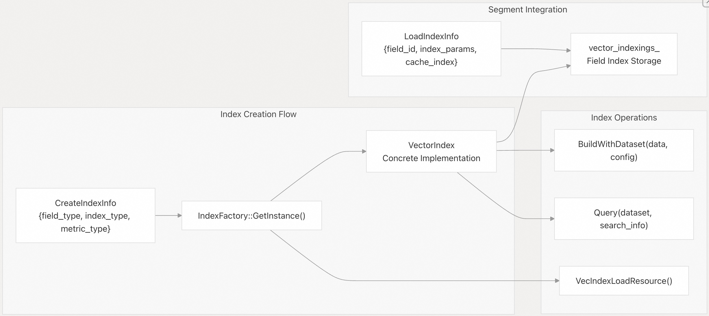
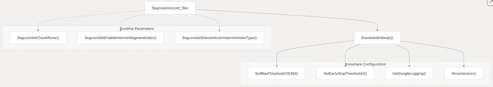
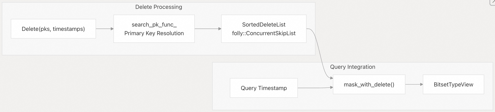

## Milvus 源码学习: 2.7 核心引擎(Core Engine)  
                                  
### 作者                                 
digoal                                
                               
### 日期                              
2025-10-27                              
                                
### 标签                                
Milvus , 源码学习                                 
                                
----                                
                                
## 背景                            
Core Engine 代表 Milvus 的高性能 C++ 计算层，负责向量操作、索引构建和分片管理。该组件为增长中（实时）和已封存（历史）数据分片提供基础计算能力，并与 Knowhere 向量索引库深度集成。    
  
## 架构概览    
Core Engine 由两个主要组件构成：用于分片管理的 **Segcore** 和用于向量索引的 **Knowhere**。Segcore 提供主要的分片实现和数据结构，而 Knowhere 负责所有向量相似性搜索操作和索引管理。  
  
### Core Engine 组件    
  
  
来源：    
- [`internal/core/src/segcore/SegmentInterface.h` 第 58–188 行](https://github.com/milvus-io/milvus/blob/18371773/internal/core/src/segcore/SegmentInterface.h#L58-L188)    
- [`internal/core/src/segcore/SegmentGrowingImpl.h` 第 41–310 行](https://github.com/milvus-io/milvus/blob/18371773/internal/core/src/segcore/SegmentGrowingImpl.h#L41-L310)    
- [`internal/core/src/segcore/ChunkedSegmentSealedImpl.h` 第 49–131 行](https://github.com/milvus-io/milvus/blob/18371773/internal/core/src/segcore/ChunkedSegmentSealedImpl.h#L49-L131)    
- [`internal/core/thirdparty/knowhere/CMakeLists.txt` 第 14–66 行](https://github.com/milvus-io/milvus/blob/18371773/internal/core/thirdparty/knowhere/CMakeLists.txt#L14-L66)  
  
## Segcore：C++ 分片引擎    
Segcore 通过两种主要的分片类型实现核心分片管理功能，二者均继承自抽象基类 `SegmentInterface`。该接口定义了向量搜索、数据检索和分片生命周期管理的通用操作。  
  
### 分片接口层次结构    
`SegmentInterface` 为所有分片实现提供了基础契约：    
  
  
  
来源：    
- [`internal/core/src/segcore/SegmentInterface.h` 第 59–188 行](https://github.com/milvus-io/milvus/blob/18371773/internal/core/src/segcore/SegmentInterface.h#L59-L188)    
- [`internal/core/src/segcore/SegmentInterface.h` 第 192–565 行](https://github.com/milvus-io/milvus/blob/18371773/internal/core/src/segcore/SegmentInterface.h#L192-L565)    
- [`internal/core/src/segcore/SegmentGrowingImpl.h` 第 41–125 行](https://github.com/milvus-io/milvus/blob/18371773/internal/core/src/segcore/SegmentGrowingImpl.h#L41-L125)    
- [`internal/core/src/segcore/ChunkedSegmentSealedImpl.h` 第 49–131 行](https://github.com/milvus-io/milvus/blob/18371773/internal/core/src/segcore/ChunkedSegmentSealedImpl.h#L49-L131)  
  
### 增长中分片（Growing Segments）    
`SegmentGrowingImpl` 处理实时数据摄取，维护一种针对并发插入和查询优化的内存结构。它使用 `InsertRecord` 进行数据存储，并支持临时索引以提升查询性能。  
  
**关键特性：**    
- **并发操作**：使用 `ConcurrentVector` 数据结构实现线程安全的插入和查询操作    
- **主键索引**：维护 `OffsetMap` 以高效支持主键查找    
- **临时索引**：在数据摄取期间，可选地通过 `IndexingRecord` 为向量字段构建临时索引    
- **内存管理**：在配置启用时，使用 `mmap_descriptor_` 实现内存映射存储  
  
增长中分片的生命周期涉及通过 `PreInsert()` 和 `Insert()` 操作持续插入数据，并根据 `segcore_config_.get_enable_interim_segment_index()` 设置周期性地构建临时索引。  
  
来源：    
- [`internal/core/src/segcore/SegmentGrowingImpl.h` 第 285–310 行](https://github.com/milvus-io/milvus/blob/18371773/internal/core/src/segcore/SegmentGrowingImpl.h#L285-L310)    
- [`internal/core/src/segcore/SegmentGrowingImpl.cpp` 第 57–246 行](https://github.com/milvus-io/milvus/blob/18371773/internal/core/src/segcore/SegmentGrowingImpl.cpp#L57-L246)    
- [`internal/core/src/segcore/InsertRecord.h` 第 45–80 行](https://github.com/milvus-io/milvus/blob/18371773/internal/core/src/segcore/InsertRecord.h#L45-L80)  
  
### 已封存分片（Sealed Segments）    
`ChunkedSegmentSealedImpl` 为历史数据提供不可变存储，具备优化的索引和分块数据组织。它同时支持字段数据加载和向量/标量索引加载，以实现最佳查询性能。  
  
**关键特性：**    
- **分块存储**：通过 `ChunkedColumnInterface` 将数据组织为分块结构，以支持高效的数据访问模式    
- **索引管理**：通过 `vector_indexings_` 和 `scalar_indexings_` 分别管理向量索引和标量索引    
- **内存映射**：广泛支持 mmap，以降低内存占用    
- **加载优化**：支持按字段选择加载原始数据或预构建的索引  
  
已封存分片支持两种主要加载模式：通过 `LoadFieldData()` 加载字段数据用于暴力搜索，以及通过 `LoadIndex()` 加载索引以加速查询。  
  
来源：    
- [`internal/core/src/segcore/ChunkedSegmentSealedImpl.h` 第 49–180 行](https://github.com/milvus-io/milvus/blob/18371773/internal/core/src/segcore/ChunkedSegmentSealedImpl.h#L49-L180)    
- [`internal/core/src/segcore/ChunkedSegmentSealedImpl.cpp` 第 90–232 行](https://github.com/milvus-io/milvus/blob/18371773/internal/core/src/segcore/ChunkedSegmentSealedImpl.cpp#L90-L232)  
  
## Knowhere 向量索引集成    
Core Engine 与 Knowhere（Milvus 的向量相似性搜索库）深度集成，提供高性能的索引和搜索能力。Knowhere 作为第三方依赖进行管理，为所有向量操作提供底层实现。  
  
### 索引工厂与管理    
  
  
  
来源：    
- [`internal/core/src/segcore/ChunkedSegmentSealedImpl.cpp` 第 123–150 行](https://github.com/milvus-io/milvus/blob/18371773/internal/core/src/segcore/ChunkedSegmentSealedImpl.cpp#L123-L150)    
- [`internal/core/unittest/test_sealed.cpp` 第 97–141 行](https://github.com/milvus-io/milvus/blob/18371773/internal/core/unittest/test_sealed.cpp#L97-L141)    
- [`internal/core/src/segcore/Utils.cpp` 第 221–242 行](https://github.com/milvus-io/milvus/blob/18371773/internal/core/src/segcore/Utils.cpp#L221-L242)  
  
### Knowhere 配置    
Knowhere 通过 `ConfigKnowhere::KnowhereInitImpl()` 进行初始化，配置 BLAS 阈值、提前终止参数以及 Google 日志集成。该配置通常在系统启动期间通过 `SegcoreInit()` 调用一次。  
  
  
  
来源：    
- [`internal/core/src/config/ConfigKnowhere.cpp` 第 30–52 行](https://github.com/milvus-io/milvus/blob/18371773/internal/core/src/config/ConfigKnowhere.cpp#L30-L52)    
- [`internal/core/src/segcore/segcore_init_c.cpp` 第 24–42 行](https://github.com/milvus-io/milvus/blob/18371773/internal/core/src/segcore/segcore_init_c.cpp#L24-L42)    
- [`internal/core/thirdparty/knowhere/CMakeLists.txt` 第 14–66 行](https://github.com/milvus-io/milvus/blob/18371773/internal/core/thirdparty/knowhere/CMakeLists.txt#L14-L66)  
  
## 数据结构与存储    
Core Engine 采用复杂的数据结构，在不同数据访问模式下优化存储效率和查询性能。  
  
### 插入记录管理    
`InsertRecord` 模板类为增长中和已封存分片中的数据存储提供基础：  
  
| 组件 | 用途 | 实现 |  
|---|---|---|  
| `ConcurrentVector<T>` | 线程安全的数据存储 | 无锁向量操作 |  
| `OffsetMap` | 主键到偏移量的映射 | `OffsetOrderedMap`（增长中） / `OffsetOrderedArray`（已封存） |  
| `AckResponder` | 插入确认跟踪 | 用于一致性的原子计数器 |  
| `TimestampIndex` | 时序数据组织 | 排序的时间戳数组 |  
  
插入记录支持两种模板特化(specializations)：`InsertRecord<false>` 用于增长中分片，`InsertRecord<true>` 用于已封存分片，针对各自使用场景采用不同的优化策略。  
  
来源：    
- [`internal/core/src/segcore/InsertRecord.h` 第 45–80 行](https://github.com/milvus-io/milvus/blob/18371773/internal/core/src/segcore/InsertRecord.h#L45-L80)    
- [`internal/core/src/segcore/InsertRecord.h` 第 83–246 行](https://github.com/milvus-io/milvus/blob/18371773/internal/core/src/segcore/InsertRecord.h#L83-L246)    
- [`internal/core/src/segcore/InsertRecord.h` 第 248–386 行](https://github.com/milvus-io/milvus/blob/18371773/internal/core/src/segcore/InsertRecord.h#L248-L386)  
  
### 删除记录跟踪    
删除操作通过 `DeletedRecord` 管理，它维护一个并发跳表（concurrent skip list）来记录已删除条目：  
  
  
  
来源：    
- [`internal/core/src/segcore/DeletedRecord.h` 第 52–85 行](https://github.com/milvus-io/milvus/blob/18371773/internal/core/src/segcore/DeletedRecord.h#L52-L85)    
- [`internal/core/src/segcore/DeletedRecord.h` 第 47–50 行](https://github.com/milvus-io/milvus/blob/18371773/internal/core/src/segcore/DeletedRecord.h#L47-L50)    
- [`internal/core/src/segcore/SegmentGrowingImpl.cpp` 第 526–567 行](https://github.com/milvus-io/milvus/blob/18371773/internal/core/src/segcore/SegmentGrowingImpl.cpp#L526-L567)  
  
## C API 桥接层    
Core Engine 通过主要在 `segment_c.cpp` 中实现的完整 C API 向 Go 层暴露其功能。该桥接层处理内存管理、错误传播以及 Go 与 C++ 域之间的类型转换。  
  
### 分片生命周期管理    
C API 提供完整的分片生命周期管理：  
  
| 函数 | 用途 | 实现 |  
|---|---|---|  
| `NewSegment()` | 创建分片实例 | 带类型选择的工厂模式 |  
| `DeleteSegment()` | 内存清理 | 正确调用析构函数 |  
| `PreInsert()` | 预留插入空间 | 线程安全的偏移分配 |  
| `Insert()` | 数据摄取 | Protobuf 反序列化并存储 |  
| `Delete()` | 记录删除 | 主键解析并标记删除 |  
  
### 搜索与检索 API    
向量搜索和数据检索操作通过异步 API 暴露，与 Go 运行时集成：  
  
  
  
来源：    
- [`internal/core/src/segcore/segment_c.cpp` 第 46–89 行](https://github.com/milvus-io/milvus/blob/18371773/internal/core/src/segcore/segment_c.cpp#L46-L89)    
- [`internal/core/src/segcore/segment_c.cpp` 第 283–445 行](https://github.com/milvus-io/milvus/blob/18371773/internal/core/src/segcore/segment_c.cpp#L283-L445)    
- [`internal/core/unittest/test_c_api.cpp` 第 70–122 行](https://github.com/milvus-io/milvus/blob/18371773/internal/core/unittest/test_c_api.cpp#L70-L122)  
  
## 配置与初始化    
Core Engine 的运行时行为通过 `SegcoreConfig` 和各种初始化函数控制，这些函数配置 Segcore 和 Knowhere 组件。  
  
### 核心配置参数    
`SegcoreConfig` 类管理关键的运行时参数：  
- **chunk_rows**：控制数据分块的粒度（默认值可配置）    
- **enable_interim_segment_index**：启用或禁用增长中分片的临时索引    
- **稠密向量索引设置**：包括 `nlist`、`nprobe` 和索引类型配置    
- **稀疏向量参数**：包括 `subdim`、`refine_ratio` 和 `index_build_ratio`  
  
配置通常在系统启动期间通过 C API 函数（如 `SegcoreSetChunkRows()` 和 `SegcoreSetEnableInterminSegmentIndex()`）完成。  
  
来源：    
- [`internal/core/src/segcore/segcore_init_c.cpp` 第 30–56 行](https://github.com/milvus-io/milvus/blob/18371773/internal/core/src/segcore/segcore_init_c.cpp#L30-L56)    
- [`internal/core/src/segcore/segcore_init_c.h` 第 24–59 行](https://github.com/milvus-io/milvus/blob/18371773/internal/core/src/segcore/segcore_init_c.h#L24-L59)    
- [`internal/core/src/config/ConfigKnowhere.cpp` 第 30–52 行](https://github.com/milvus-io/milvus/blob/18371773/internal/core/src/config/ConfigKnowhere.cpp#L30-L52)  
    
#### [期望 PostgreSQL|开源PolarDB 增加什么功能?](https://github.com/digoal/blog/issues/76 "269ac3d1c492e938c0191101c7238216")
  
  
#### [PolarDB 开源数据库](https://openpolardb.com/home "57258f76c37864c6e6d23383d05714ea")
  
  
#### [PolarDB 学习图谱](https://www.aliyun.com/database/openpolardb/activity "8642f60e04ed0c814bf9cb9677976bd4")
  
  
#### [PostgreSQL 解决方案集合](../201706/20170601_02.md "40cff096e9ed7122c512b35d8561d9c8")
  
  
#### [德哥 / digoal's Github - 公益是一辈子的事.](https://github.com/digoal/blog/blob/master/README.md "22709685feb7cab07d30f30387f0a9ae")
  
  
#### [About 德哥](https://github.com/digoal/blog/blob/master/me/readme.md "a37735981e7704886ffd590565582dd0")
  
  

  
