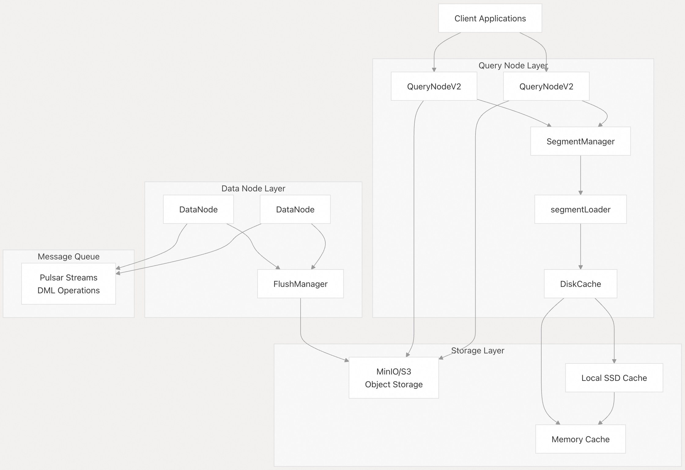
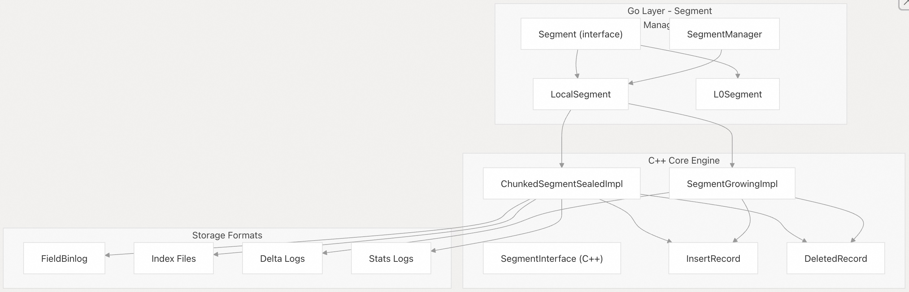
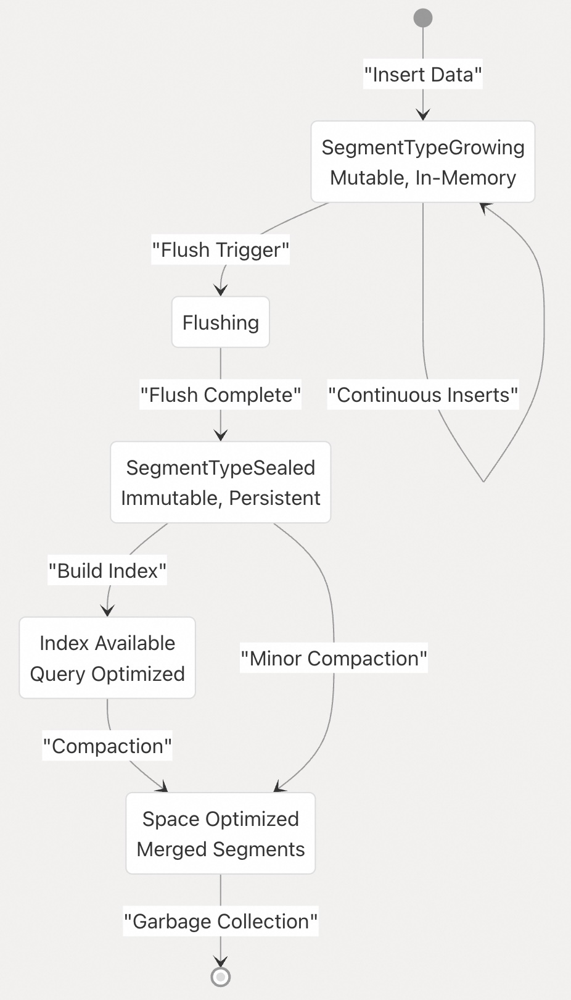
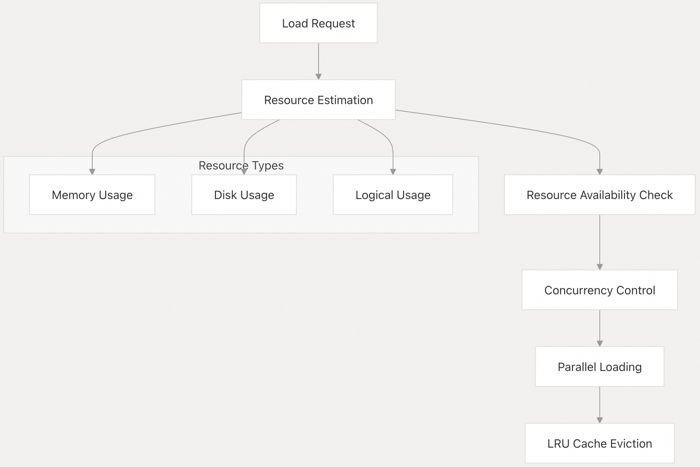
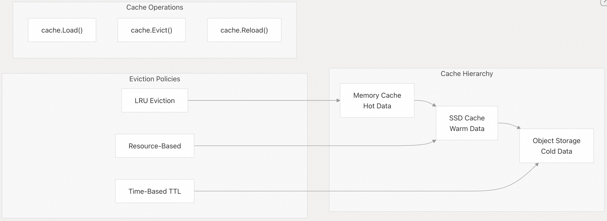
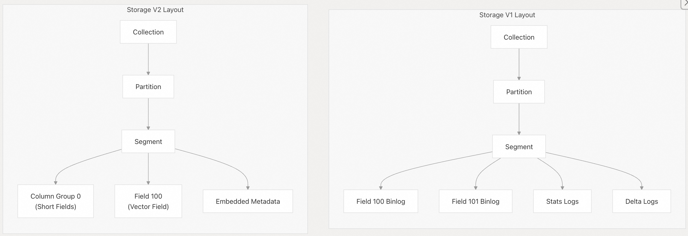
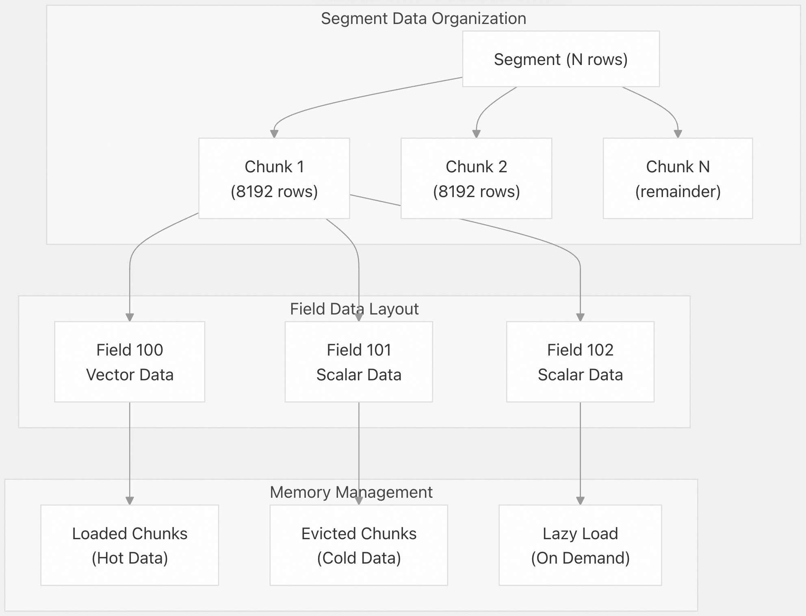
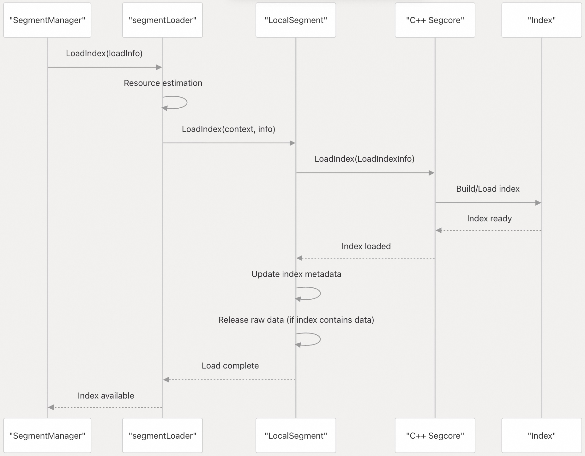

## Milvus 源码学习: 3 数据管理(Data Management)  
                                    
### 作者                                   
digoal                                  
                                 
### 日期                                
2025-10-27                                
                                  
### 标签                                  
Milvus , 源码学习                                   
                                  
----                                  
                                  
## 背景                              
本文介绍 Milvus 如何在其整个生命周期中管理向量和标量数据，包括存储格式、分片管理、数据加载策略以及内存优化。内容涵盖支撑大规模向量与标量数据集高效存储与检索的核心数据结构和处理流程。    
  
## 数据存储架构    
Milvus 采用多层数据存储架构，将计算与存储分离，从而实现水平扩展和高效的资源利用。  
  
### 存储层级结构    
  
  
  
来源：    
- [`internal/querynodev2/segments/manager.go` 第 80–166 行](https://github.com/milvus-io/milvus/blob/18371773/internal/querynodev2/segments/manager.go#L80-L166)    
- [`internal/querynodev2/segments/segment_loader.go` 第 160–193 行](https://github.com/milvus-io/milvus/blob/18371773/internal/querynodev2/segments/segment_loader.go#L160-L193)  
  
### 核心数据结构    
数据管理系统围绕若干关键的 C++ 和 Go 数据结构构建，用于处理数据存储与检索的不同方面：    
  
  
  
来源：    
- [`internal/querynodev2/segments/segment.go` 第 282–302 行](https://github.com/milvus-io/milvus/blob/18371773/internal/querynodev2/segments/segment.go#L282-L302)    
- [`internal/core/src/segcore/SegmentInterface.h` 第 59–188 行](https://github.com/milvus-io/milvus/blob/18371773/internal/core/src/segcore/SegmentInterface.h#L59-L188)    
- [`internal/core/src/segcore/ChunkedSegmentSealedImpl.h` 第 49–91 行](https://github.com/milvus-io/milvus/blob/18371773/internal/core/src/segcore/ChunkedSegmentSealedImpl.h#L49-L91)  
  
## 分片(Segment)类型与生命周期    
Milvus 通过分片（segment）管理数据，这些分片会根据其可变性和优化级别在不同状态间转换。  
  
### 分片状态转换    
  
  
  
来源：    
- [`internal/querynodev2/segments/segment.go` 第 70–75 行](https://github.com/milvus-io/milvus/blob/18371773/internal/querynodev2/segments/segment.go#L70-L75)    
- [`internal/core/src/segcore/SegmentGrowingImpl.h` 第 41–110 行](https://github.com/milvus-io/milvus/blob/18371773/internal/core/src/segcore/SegmentGrowingImpl.h#L41-L110)  
  
### 增长中分片（Growing Segments）    
增长中分片处理活跃的数据插入，并维护内存中的数据结构以确保数据即时可用：  
  
| 组件 | 用途 | 实现位置 |  
|---|---|---|  
| `InsertRecord<false>` | 以分块形式存储传入数据 | [`internal/core/src/segcore/InsertRecord.h` 第 275–400 行](https://github.com/milvus-io/milvus/blob/18371773/internal/core/src/segcore/InsertRecord.h#L275-L400) |  
| `IndexingRecord` | 构建临时索引 | [`internal/core/src/segcore/SegmentGrowingImpl.h` 第 117–120 行](https://github.com/milvus-io/milvus/blob/18371773/internal/core/src/segcore/SegmentGrowingImpl.h#L117-L120) |  
| `DeletedRecord` | 跟踪软删除操作 | [`internal/core/src/segcore/DeletedRecord.h` 第 52–80 行](https://github.com/milvus-io/milvus/blob/18371773/internal/core/src/segcore/DeletedRecord.h#L52-L80) |  
| `AckResponder` | 管理数据一致性 | [`internal/core/src/segcore/SegmentGrowingImpl.h` 第 113–116 行](https://github.com/milvus-io/milvus/blob/18371773/internal/core/src/segcore/SegmentGrowingImpl.h#L113-L116) |  
  
来源：    
- [`internal/core/src/segcore/SegmentGrowingImpl.cpp` 第 57–246 行](https://github.com/milvus-io/milvus/blob/18371773/internal/core/src/segcore/SegmentGrowingImpl.cpp#L57-L246)  
  
### 已封存分片（Sealed Segments）    
已封存分片针对查询性能进行了优化，并支持惰性加载以提高内存效率：  
  
| 特性 | 描述 | 关键方法 |  
|---|---|---|  
| 惰性加载（Lazy Loading） | 按需加载数据 | `LoadLazySegment()` |  
| 索引支持 | 预构建的向量/标量索引 | `LoadIndex()` |  
| 内存映射（Memory Mapping） | 操作系统级内存管理 | `enable_mmap` 标志 |  
| 分块存储（Chunked Storage） | 高效的数据访问模式 | `ChunkedSegmentSealedImpl` |  
  
来源：    
- [`internal/core/src/segcore/ChunkedSegmentSealedImpl.cpp` 第 91–233 行](https://github.com/milvus-io/milvus/blob/18371773/internal/core/src/segcore/ChunkedSegmentSealedImpl.cpp#L91-L233)  
  
## 数据加载与内存管理    
分片加载系统实现了复杂的资源管理机制，在防止内存溢出的同时维持查询性能。  
  
### 资源管理流水线    
  
  
来源：    
- [`internal/querynodev2/segments/segment_loader.go` 第 443–513 行](https://github.com/milvus-io/milvus/blob/18371773/internal/querynodev2/segments/segment_loader.go#L443-L513)  
  
### 加载策略    
`segmentLoader` 根据分片特性采用不同的加载策略：  
  
**即时加载（Immediate Loading）**（用于增长中分片）    
```  
// Load all data immediately into memory  
func (loader *segmentLoader) loadFieldDataInternal(loadInfo *LoadFieldDataInfo)  
```  
  
**惰性加载（Lazy Loading）**（用于已封存分片）    
```  
// Load metadata only, defer data loading until query time  
func (loader *segmentLoader) LoadLazySegment(segment Segment, loadInfo *querypb.SegmentLoadInfo)  
```  
  
**资源感知加载（Resource-Aware Loading）**  
```  
type requestResourceResult struct {  
    Resource          LoadResource  // Physical resources  
    LogicalResource   LoadResource  // Logical resources    
    CommittedResource LoadResource  // Already committed  
    ConcurrencyLevel  int          // Parallel loading degree  
}  
```  
  
来源：    
- [`internal/querynodev2/segments/segment_loader.go` 第 123–128 行](https://github.com/milvus-io/milvus/blob/18371773/internal/querynodev2/segments/segment_loader.go#L123-L128)    
- [`internal/querynodev2/segments/segment_loader.go` 第 1008–1021 行](https://github.com/milvus-io/milvus/blob/18371773/internal/querynodev2/segments/segment_loader.go#L1008-L1021)  
  
### 缓存管理    
Milvus 实现了多级缓存系统，并支持自动淘汰机制：   
  
  
  
来源：    
- [`internal/querynodev2/segments/manager.go` 第 90–155 行](https://github.com/milvus-io/milvus/blob/18371773/internal/querynodev2/segments/manager.go#L90-L155)  
  
## 存储格式与版本控制    
Milvus 支持多种存储格式，针对不同的访问模式和性能需求进行了优化。  
  
### 存储版本对比  
  
| 特性 | 存储 V1 | 存储 V2 |  
|---|---|---|  
| 组织方式 | 按字段的文件 | 列组（column group）文件 |  
| 文件格式 | 每字段一个 Binlog | 基于 Arrow 的 Parquet |  
| 元数据 | 独立的统计文件 | 内嵌于 Parquet 文件中 |  
| 压缩粒度 | 字段级 | 列组级 |  
| 查询性能 | 单字段查询表现良好 | 多字段联合查询更优 |  
  
来源：    
- [`internal/core/src/segcore/ChunkedSegmentSealedImpl.cpp` 第 236–273 行](https://github.com/milvus-io/milvus/blob/18371773/internal/core/src/segcore/ChunkedSegmentSealedImpl.cpp#L236-L273)   
- [`internal/core/src/segcore/ChunkedSegmentSealedImpl.cpp` 第 276–355 行](https://github.com/milvus-io/milvus/blob/18371773/internal/core/src/segcore/ChunkedSegmentSealedImpl.cpp#L276-L355)  
  
### 文件组织结构    
  
  
  
来源：    
- [`internal/core/src/segcore/ChunkedSegmentSealedImpl.cpp` 第 276–355 行](https://github.com/milvus-io/milvus/blob/18371773/internal/core/src/segcore/ChunkedSegmentSealedImpl.cpp#L276-L355)    
- [`internal/querynodev2/segments/segment_loader.go` 第 713–815 行](https://github.com/milvus-io/milvus/blob/18371773/internal/querynodev2/segments/segment_loader.go#L713-L815)  
  
### 按存储版本的数据加载流程  
  
**存储 V1 流程：**  
- 分别加载各字段的 binlog    
- 从专用文件中解析统计信息    
- 构建字段级索引    
- 应用 delta 日志以处理更新    
  
**存储 V2 流程：**  
- 通过 Arrow 读取器加载列组（column groups）    
- 从 Parquet 文件中提取字段数据    
- 利用内嵌的元数据    
- 针对向量化操作进行优化  
  
来源：    
- [`internal/core/src/segcore/ChunkedSegmentSealedImpl.cpp` 第 358–440 行](https://github.com/milvus-io/milvus/blob/18371773/internal/core/src/segcore/ChunkedSegmentSealedImpl.cpp#L358-L440)    
- [`internal/core/src/segcore/SegmentGrowingImpl.cpp` 第 396–522 行](https://github.com/milvus-io/milvus/blob/18371773/internal/core/src/segcore/SegmentGrowingImpl.cpp#L396-L522)  
  
## 内存管理与优化    
Milvus 实现了多种内存优化策略，以高效处理大规模数据集。  
  
### 内存使用跟踪    
系统跟踪多种类型的内存使用情况，以实现精确的资源管理：  
  
| 使用类型 | 用途 | 实现方式 |  
|---|---|---|  
| 物理内存（Physical Memory） | 操作系统级内存消耗 | `hardware.GetUsedMemoryCount()` |  
| 逻辑内存（Logical Memory） | 分片级内存估算 | `ResourceUsageEstimate()` |  
| 已提交内存（Committed Memory） | 为加载预留的内存 | `committedResource` |  
| 索引内存（Index Memory） | 向量索引开销 | `VectorIndex.GetIndexMemorySize()` |  
  
```  
type LoadResource struct {  
    MemorySize uint64  // Bytes of memory needed  
    DiskSize   uint64  // Bytes of disk space needed    
}  
```  
  
来源：    
- [`internal/querynodev2/segments/segment_loader.go` 第 130–147 行](https://github.com/milvus-io/milvus/blob/18371773/internal/querynodev2/segments/segment_loader.go#L130-L147)    
- [`internal/querynodev2/segments/segment.go` 第 233–257 行](https://github.com/milvus-io/milvus/blob/18371773/internal/querynodev2/segments/segment.go#L233-L257)  
  
### 基于分块的架构    
数据以分块（chunk）形式组织，以支持高效的内存管理和并行处理：    
  
  
  
来源：    
- [`internal/core/src/segcore/SegmentGrowingImpl.h` 第 154–173 行](https://github.com/milvus-io/milvus/blob/18371773/internal/core/src/segcore/SegmentGrowingImpl.h#L154-L173)    
- [`internal/core/src/segcore/ChunkedSegmentSealedImpl.cpp` 第 513–562 行](https://github.com/milvus-io/milvus/blob/18371773/internal/core/src/segcore/ChunkedSegmentSealedImpl.cpp#L513-L562)  
  
## 索引集成    
数据管理与索引管理紧密集成，在最小化存储开销的同时提供最优的查询性能。  
  
### 索引生命周期管理    
  
  
来源：    
- [`internal/querynodev2/segments/segment_loader.go` 第 89–103 行](https://github.com/milvus-io/milvus/blob/18371773/internal/querynodev2/segments/segment_loader.go#L89-L103)    
- [`internal/core/src/segcore/ChunkedSegmentSealedImpl.cpp` 第 91–102 行](https://github.com/milvus-io/milvus/blob/18371773/internal/core/src/segcore/ChunkedSegmentSealedImpl.cpp#L91-L102)  
  
数据管理系统通过保持数据局部性、优化内存使用，并与索引子系统协同工作，为分布式部署环境下的高性能向量相似性搜索奠定基础。    
  
      
#### [期望 PostgreSQL|开源PolarDB 增加什么功能?](https://github.com/digoal/blog/issues/76 "269ac3d1c492e938c0191101c7238216")
  
  
#### [PolarDB 开源数据库](https://openpolardb.com/home "57258f76c37864c6e6d23383d05714ea")
  
  
#### [PolarDB 学习图谱](https://www.aliyun.com/database/openpolardb/activity "8642f60e04ed0c814bf9cb9677976bd4")
  
  
#### [PostgreSQL 解决方案集合](../201706/20170601_02.md "40cff096e9ed7122c512b35d8561d9c8")
  
  
#### [德哥 / digoal's Github - 公益是一辈子的事.](https://github.com/digoal/blog/blob/master/README.md "22709685feb7cab07d30f30387f0a9ae")
  
  
#### [About 德哥](https://github.com/digoal/blog/blob/master/me/readme.md "a37735981e7704886ffd590565582dd0")
  
  

  
