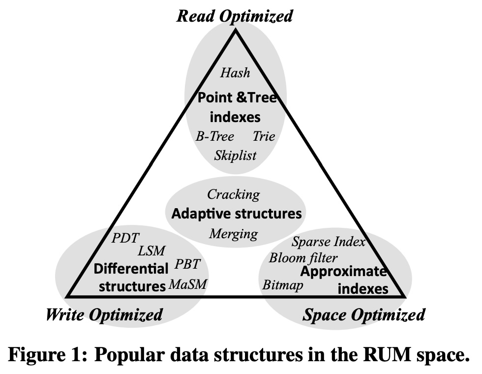
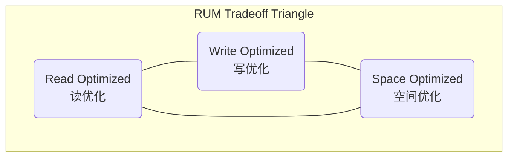
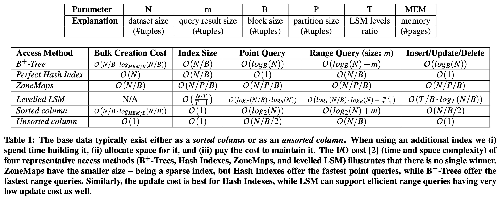
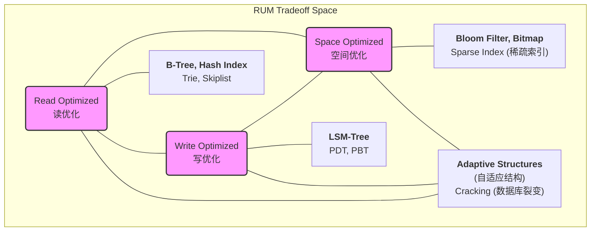
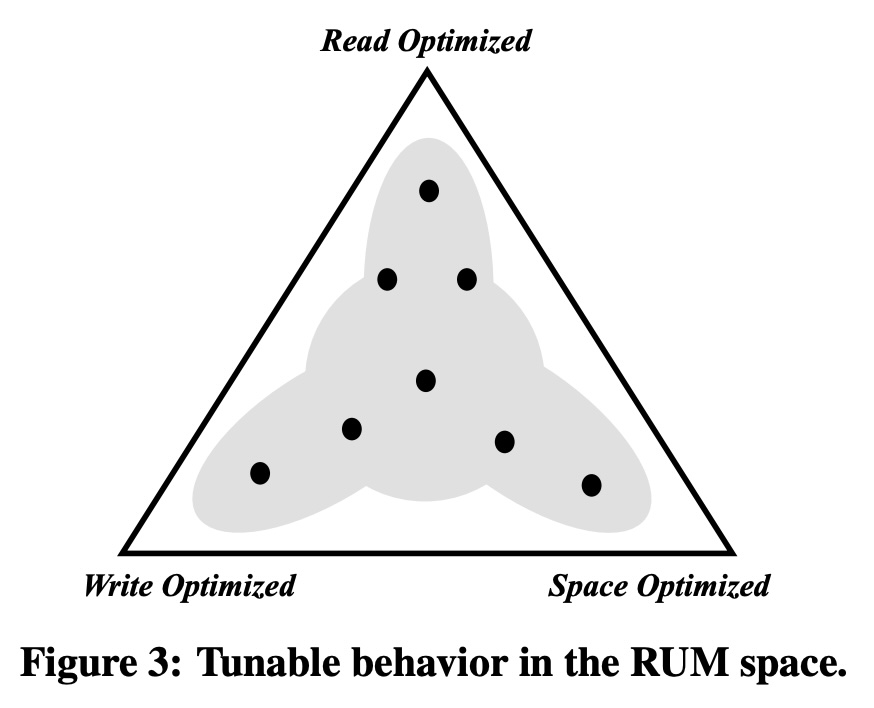

## AI论文解读 | Designing Access Methods: The RUM Conjecture
        
### 作者        
digoal        
        
### 日期        
2025-10-28        
        
### 标签        
PostgreSQL , PolarDB , DuckDB , AI , 论文解读        
        
----        
        
## 背景  
      
https://scholar.harvard.edu/files/stratos/files/rum.pdf        
  
提示:          
```          
读懂《Designing Access Methods: The RUM Conjecture》这篇论文需要提前掌握哪些基础知识, 请使用中文通熟易懂的讲解这些基础知识, 可以引用论文中的图、表或使用Markdown支持的图形(text,mermaid等)增加解释性. 
  
使用中文通熟易懂的解读《Designing Access Methods: The RUM Conjecture》这篇论文, 其中的关键内容请着重讲解, 可以引用论文中的图、表或使用Markdown支持的图形(text,mermaid等)增加解释性. 
  
提取《Designing Access Methods: The RUM Conjecture》这篇论文中的重要术语, 使用中文对这些术语进行通熟易懂的讲解, 可以引用论文中的图、表或使用Markdown支持的图形(text,mermaid等)增加解释性. 
```     
  
## 1 前置知识 
  
你好！很高兴能为你解读这篇经典的数据库论文。

这篇论文《Designing Access Methods: The RUM Conjecture》（设计访问方法：RUM猜想）  提出一个在数据库系统设计中非常核心的观点。

通俗来说，这篇论文的核心思想是：在设计一个数据存储系统时，你无法同时做到三全其美。你必须在三个关键指标之间做出取舍，这三个指标就是：

  * **R**ead (读取开销)
  * **U**pdate (更新开销)
  * **M**emory (内存/存储开销)

论文的“RUM猜想”  指出，**你最多只能优化其中两项，但第三项的性能就一定会变差** 。

为了透彻理解这篇论文的论证过程和它引用的各种技术，你需要掌握以下几个方面的基础知识：

-----

### 1\. 核心概念：什么是“访问方法” (Access Method)？

  * **通俗解释：** 你可以把“访问方法”想象成一个图书馆的“图书管理系统”。
  * **论文定义：** 访问方法是用于组织和访问数据的算法和数据结构 。
  * **为什么需要它？**
      * **没有索引 (Heap File)：** 就像一个图书馆，书（数据）全部堆在一个大仓库里，没有任何分类 。如果你要找一本书，你必须翻遍整个仓库（全表扫描），这“读取”成本太高了。
      * **有了索引 (Index)：** 你建立了一个“索引卡系统”（比如一个B-Tree索引）。现在找书（读取）非常快，你只需要查一下索引卡就知道书在哪一排哪一架 。
      * **代价：** 但是，这个索引卡系统本身需要空间（这就是**内存开销 M**），而且每次有新书入库或旧书下架时，你不仅要搬运书，还要制作和修改索引卡（这就是**更新开销 U**）。

这篇论文就是在讨论如何设计这个“图书管理系统”，并指出不同的设计（B-Tree, LSM-Tree等）是如何在 R、U、M 之间做权衡的。

### 2\. 核心权衡：RUM 三大开销 (RUM Overheads)

你需要理解论文是如何定义这三个开销的 。论文中用“放大率 (Amplification)”来量化它们：

  * **R - 读取开销 (Read Overhead / 读放大)** 

      * **含义：** 为了读取你想要的1条数据，你实际上总共读取了多少数据（包括索引数据和无关数据）。
      * **举例：** 理想情况是1（读1条就只访问1条）。但如果你为了找1条数据，不得不读取一个 4KB 的数据块，你的读放大就很高。

  * **U - 更新开销 (Update Overhead / 写放大)** 

      * **含义：** 为了修改1条数据，你实际上总共执行了多少次物理写入操作 。
      * **举例：** 在某些系统（如闪存SSD或LSM-Tree）中，你不能“原地”修改数据，你必须把整个数据块读出来，修改后，再写到一个新地方。这就会导致很高的写放大。

  * **M - 内存开销 (Memory Overhead / 空间放大)** 

      * **含义：** 为了存储1GB的原始数据，你额外用了多少空间来存索引、元数据等辅助信息 。
      * **举例：** 如果你为数据建了5个不同的索引，你的空间放大就会很高。

这三者是一个“不可能三角”，论文中的 **Figure 1**  非常直观地展示了这一点：    



你只能选择靠近其中一个或两个顶点，但无法同时占据三个顶点。

### 3\. 基础知识一：常见数据结构 (重要！)

这篇论文**假设读者已经熟悉**几种主流的数据库索引结构。它用这些结构作为例子来证明 RUM 猜想。

  * **B-Tree (B树 / B+树)**

      * **它是什么？** 绝大多数传统关系型数据库（如 MySQL, PostgreSQL）默认的索引结构。
      * **RUM 特性：** 它在 **Figure 1** 中位于“读优化” (Read Optimized) 的顶点 。    
      * **R (读取)：** 非常快。B-Tree 是平衡的，查询一条数据的时间复杂度是 $O(log N)$ （见论文 **Table 1** ）。    
      * **U (更新)：** 比较慢。因为B-Tree要求数据在磁盘上“原地”更新 (in-place updates) 且保持有序，这在机械硬盘上会产生大量随机I/O。
      * **M (内存)：** 中等。需要存储树结构。

  * **LSM-Tree (日志结构合并树)**

      * **它是什么？** 许多现代 NoSQL 数据库（如 LevelDB, RocksDB, Cassandra）使用的结构。
      * **RUM 特性：** 它在 **Figure 1** 中位于“写优化” (Write Optimized) 的顶点 。
      * **R (读取)：** 比较慢。因为数据是“日志式”写入的，最新数据和旧数据可能在不同文件里，读取时可能需要查询多个地方再合并。
      * **U (更新)：** 非常快。写入时，它只是把新数据追加 (append) 到内存中的一个结构，然后批量刷到磁盘 。这把随机写变成了顺序写，效率极高。
      * **M (内存)：** 较高。它会保留数据的多个版本，直到后台“合并” (compaction) 时才清理，所以空间占用会更大。

  * **Hash Index (哈希索引)**

      * **它是什么？** 类似编程语言中的字典 (Dictionary) 或哈希表 (HashMap)。
      * **RUM 特性：** 也是“读优化” ，但只针对“等值查询”。
      * **R (读取)：** 极快。等值查询时间复杂度是 $O(1)$ （见 **Table 1** ）。但它不支持范围查询（比如 "大于10"）。  
      * **U (更新)：** 很快，也是 $O(1)$ 。
      * **M (内存)：** 较高。哈希表为了避免冲突，通常需要预留很多空间。

  * **Approximate Indexes (近似索引)**

      * **它是什么？** 比如 Bloom Filter (布隆过滤器) 。
      * **RUM 特性：** 它在 **Figure 1** 中位于“空间优化” (Space Optimized) 的顶点 。
      * **R (读取)：** 它不能精确告诉你数据“在不在”，只能告诉你“可能在”或“绝对不在”。它可以帮你过滤掉大量无效的读取。
      * **U (更新)：** 较快。
      * **M (内存)：** 非常低。它用极小的空间来“摘要”海量数据。

### 4\. 基础知识二：计算机存储层次 (Memory Hierarchy)

论文在第4节末尾专门讨论了存储层次 。你需要理解为什么“访问磁盘”和“访问内存”是完全不同的概念。

  * **结构：** 计算机的存储不是单一的，而是分层的 。
  * **速度和成本：**
    1.  **CPU Cache (L1/L2/L3)：** 最快，最贵，最小。
    2.  **Main Memory (主存 / RAM)：** 很快，较贵，容量中等 。
    3.  **Flash (闪存 / SSD)：** 较快，价格中等，容量大 。
    4.  **Disk (磁盘 / HDD)：** 最慢，最便宜，容量最大 。
  * **为什么重要？** 访问主存和访问磁盘的速度有 **10万倍** 甚至更大的差距。数据库设计的核心目标之一就是**尽量减少对磁盘的访问**。RUM 猜想中的 R (读开销) 和 U (更新开销) 很多时候指的就是磁盘 I/O 的开销。

### 5\. 基础知识三：算法复杂度 (Big O Notation)

你需要能看懂论文 **Table 1**  中的复杂度标记。

  * **$O(1)$ (常数时间):** 最快的。无论数据多大（100条或10亿条），花费的时间都一样。例如哈希索引的查询 。
  * **$O(log N)$ (对数时间):** 非常快。数据量翻倍，时间只增加一点点。例如 B-Tree 的查询 。
  * **$O(N)$ (线性时间):** 较慢。数据量翻倍，时间也翻倍。例如全表扫描（遍历所有数据）。

-----

### 总结

要读懂这篇论文，你的知识储备应该像这样：

1.  **[ 必须掌握 ] 数据结构：** 至少要**熟练掌握 B-Tree 和 Hash Table 的工作原理**。最好再了解一下 **LSM-Tree** 的基本思想（写入日志 -\> 内存刷盘 -\> 后台合并）。
2.  **[ 必须掌握 ] 核心概念：** 深入理解 **R (读)、U (写)、M (空间)** 这三个开销在数据库系统中具体指什么，尤其是“写放大”和“读放大”的概念。
3.  **[ 应该了解 ] 计算机体系结构：** 明白**内存和磁盘之间存在巨大的性能鸿沟** ，以及为什么数据库系统要拼命减少磁盘 I/O。
4.  **[ 应该了解 ] 算法基础：** 能看懂 **$O(1)$ , $O(log N), O(N)$**，并用它们来比较不同“访问方法”的 R 和 U 。

如果你对这些基础知识（特别是 B-Tree 和 LSM-Tree）感到扎实，那么理解这篇论文的核心论点——RUM 猜想——就会非常容易了。

希望这个导读对你有帮助！你需要我为你详细解释B-Tree或LSM-Tree的工作原理吗？
  
## 2 解读论文 
  
这是一篇在数据库系统设计领域非常经典且重要的论文。它的核心思想可以用一句大家耳熟能详的俗语来概括：

> “快、好、省，三者不可兼得。” (Fast, Good, Cheap: Pick Two)

这篇论文为数据库的“访问方法”（即我们如何组织和查找数据）提出了一个类似的“不可能三角”，并将其命名为 **RUM 猜想**。

这里的 RUM 分别代表：

  * **R (Read Overhead):** 读取开销
  * **U (Update Overhead):** 更新开销
  * **M (Memory Overhead):** 内存/存储开销

**RUM 猜想的核心观点是：** 在设计一个数据访问方法时，**你最多只能优化这三项中的两项，而第三项的性能则必然会因此受到负面影响** 。

下面，我们将为你详细解读这篇论文的关键内容。

-----

### 1\. 什么是 RUM 三大开销？

论文首先为这三个开销给出了明确的定义 ，并使用“放大率 (Amplification)”的概念来衡量它们：

  * **R - 读取开销 (Read Overhead)**

      * **论文定义：** 读放大 (Read Amplification) 。
      * **通俗解释：** 为了读取你想要的 1 条数据，你实际上总共读取了多少数据？ 。这包括了你为了找到它而读取的索引、元数据或其他不相关的数据 。理想值是 1，即读 1 条就只访问 1 条。

  * **U - 更新开销 (Update Overhead)**

      * **论文定义：** 写放大 (Write Amplification) 。
      * **通俗解释：** 为了（在逻辑上）更新 1 条数据，你实际上对存储设备（如硬盘或SSD）执行了多少次物理写入？ 。例如，在 SSD 上，你不能“原地”修改数据，通常需要读取一个 4KB 的块，修改它，然后再把整个 4KB 的块写到新的位置。这就是很高的写放大。

  * **M - 内存开销 (Memory Overhead)**

      * **论文定义：** 空间放大 (Space Amplification) 。
      * **通俗解释：** 为了存储你的原始数据（例如 1GB），你额外需要多少空间来存放索引、副本或其他辅助数据？ 。如果 1GB 的数据需要额外 500MB 的索引，空间放大就是 1.5。

-----

### 2\. 为什么它们是“不可能三角”？

论文接着通过几个简单的理论例子（Hypothesis 1, 2, 3）来证明，当你试图将**一个**指标优化到极致时，另外两个指标会变得多差 。

  * **1. 极致优化 R (读开销)** 

      * **方法：** 想象一个巨大的数组，你想存数字 `17`，就直接把它存在数组的第 17 个位置 。
      * **结果：** 读取 $RO$ 最小，为 1.0 。但如果你要存数字 `1,000,000`，你就需要一个一百万大小的稀疏数组 。这导致 $MO$ （内存开销）趋近于无限 。

  * **2. 极致优化 U (更新开销)** 

      * **方法：** 像记日记一样，所有的新增、修改、删除操作，都直接“追加” (append) 到一个日志文件的末尾 。
      * **结果：** 写入 $UO$ 最小，为 1.0 。但代价是，当你要查找某个数据的最新状态时，你必须从头到尾读取整个日志文件来“重放”历史，这导致 $RO$ （读取开销）趋近于无限 。 $MO$ 也会无限增长 。

  * **3. 极致优化 M (空间开销)** 

      * **方法：** 不使用任何索引，只把数据紧密地存在一个数组里 。
      * **结果：** $MO$ 最小，为 1.0 。但代价是，每次你想查找数据时，都必须从头到尾扫描整个数组（全表扫描），导致 $RO$ （读取开销）非常高（与数据总量 $N$ 成正比） 。

**结论：** 极致优化任何一项都会带来灾难性的后果。

-----

### 3\. RUM 猜想：正式提出

基于上述分析，论文正式提出了 **RUM 猜想 (The RUM Conjecture)** ：

> “一个访问方法如果能为 R、U、M 三个开销中的任意两个设定一个上限（即优化它们），那么它必然为第三个开销设定了一个无法被优化的硬下限 (hard lower bound)。” 

换句话说，**你必须在 R、U、M 之间做出选择和妥协** 。

-----

### 4\. 关键内容：RUM 在实践中的体现 (Figure 1) 

这篇论文最核心的贡献在于它使用 RUM 猜想这个框架，将几乎所有现存的数据库访问方法（索引结构）进行了分类。

论文中的 **Figure 1** （在第3页）非常直观地展示了这一点，我们可以用一个类似的图来解释：    



下面我们来着重讲解这三个“顶点”的权衡：

#### 顶点一：读优化 (Read Optimized)

  * **代表技术：** **B-Tree (B+树)** 。这是几乎所有传统关系型数据库（如 MySQL, Oracle）的默认索引。
  * **RUM 特性：**
      * **R (低):** 读取性能极好 。B-Tree 是一种平衡树，查询一个数据的时间复杂度是 $O(log_B N)$ ，非常快 。
      * **U (高):** 更新开销高 。因为 B-Tree 要求数据在磁盘上保持严格有序，当你插入一条新数据时，可能导致树节点“分裂”，需要移动大量数据块，产生多次物理 I/O（高写放大）。
      * **M (高):** 空间开销高 。你需要额外的空间来存储整个树形结构。

#### 顶点二：写优化 (Write Optimized)

  * **代表技术：** **LSM-Tree (日志结构合并树)** 。这是许多现代 NoSQL 数据库（如 Google LevelDB, RocksDB, Cassandra）使用的核心结构。
  * **RUM 特性：**
      * **U (低):** 更新性能极好 。LSM-Tree 的设计思路是“延迟”合并。所有写入都只追加 (append) 到内存中的一个小结构，然后批量刷到磁盘上成为新的小文件 。这个过程是顺序I/O，几乎没有写放大。
      * **R (高):** 读取开销高 。因为数据被分散在内存和磁盘上的多个文件中，读取一条数据时，你可能需要依次查询所有这些文件，最后再把结果合并起来 。
      * **M (高):** 空间开销也高 。因为旧版本的数据不会马上被清理，系统会积累很多“待合并”的文件。

#### 顶点三：空间优化 (Space Optimized)

  * **代表技术：** **Bloom Filters (布隆过滤器)** , **Sparse Indexes (稀疏索引)** , **Bitmap (位图索引)** 。
  * **RUM 特性：**
      * **M (低):** 空间开销极低 。它们是“有损”或“近似”的数据结构 。例如，布隆过滤器使用极少的空间就能“摘要”海量数据。
      * **R (高):** 读取开销高 。它们通常不能精确定位数据。例如，布隆过滤器只能告诉你“数据*绝对不*存在”或“数据*可能*存在”。对于“可能存在”的情况，你必须再去访问原始数据（如 B-Tree 或磁盘）来确认，这增加了总的读取开销 。
      * **U (高):** 更新开销也可能高 （例如使用压缩时）。

-----

### 5\. 论文的结论：未来方向 (Figure 3)

  

论文的最后（第5节）指出，既然 RUM 猜想告诉我们“完美的访问方法”是不存在的 ，那么我们应该停止寻找“银弹”。

未来的方向应该是：

1.  **RUM-Aware (RUM 感知):** 我们在设计系统时，必须清楚地知道自己在 RUM 三角中选择了哪个位置，以及牺牲了什么。
2.  **Tunable (可调优):** 我们应该构建**可调优 (tunable)** 的访问方法 。
3.  **Morphing (可变形):** 理想的未来系统（如 **Figure 3**  所示），应该能够根据工作负载的变化（例如，系统从“写入密集型”变为“读取密集型”），**动态地在 RUM 空间中“移动”** 。例如，一个系统可以动态调整其 LSM-Tree 的合并策略，或者在一个 B-Tree 上动态增减其索引的密度 。

### 总结

《RUM 猜想》这篇论文提供了一个简洁而强大的理论框架，用于分析和权衡任何数据存储系统的设计。它清楚地阐明了**读取、更新和空间**这三者之间固有的、不可避免的冲突 。这使得它成为数据库和系统设计领域研究者的必读文献。

希望这个解读对你有帮助！你是否想了解更多关于B-Tree和LSM-Tree在RUM权衡上的具体对比？
  
## 3 术语 
  
以下是为您提取的《Designing Access Methods: The RUM Conjecture》论文中的核心术语及其通俗讲解。

-----

### 1\. RUM 猜想 (The RUM Conjecture)

这是整篇论文的核心论点 。

  * **通俗讲解：**
    这个猜想就像我们常说的“**快、好、省，三者不可兼得**”。在数据库设计中，RUM 分别代表：

      * **R**ead (读取开销)
      * **U**pdate (更新开销)
      * **M**emory (内存/存储开销) 

    RUM 猜想指出，你**不可能同时**让一个数据系统读得又快 (R低)、写得又快 (U低)、占空间又少 (M低) 。

    论文的猜想是：**如果你强行优化了其中两项，那么第三项的性能就必然会变差** 。你必须在三者之间做出取舍。

  * **图示 (RUM 的“不可能三角”)：**
    论文中的 **Figure 1**  直观地展示了这种权衡。不同的技术分布在这个三角的不同顶点，意味着它们各自做出了不同的牺牲。    

    ```mermaid
    graph TD
        subgraph RUM Tradeoff Triangle
            R(Read Optimized<br>读优化)
            U(Write Optimized<br>写优化)
            M(Space Optimized<br>空间优化)
        end
        R --- U
        U --- M
        M --- R
    ```

-----

### 2\. RUM 三大开销 (The RUM Overheads)

为了准确衡量 RUM，论文引入了“放大率” (Amplification) 的概念 。在讲解 RUM 之前，我们先要理解两个基本概念：

  * **基础数据 (Base data):** 你实际存储的主要数据 。
  * **辅助数据 (Auxiliary data):** 为了让数据访问更快而额外存储的信息，最常见的就是“索引” 。

#### R: 读取开销 (Read Overhead / 读放大)

  * **论文定义：** 读放大 (Read Amplification)，即“读取的总数据量”除以“你真正需要的数据量” 。
  * **通俗讲解：**
    你只想读 1 条数据，但系统为了找到这 1 条数据，可能不得不先去读取 10 页的“索引”（辅助数据），然后再读取 1 页的“基础数据”。
      * **低 R (读优化):** 比如哈希索引 (Hash Index)，能 $O(1)$ 复杂度（即一次）定位数据 。
      * **高 R:** 比如为了省空间（低 M）而使用稀疏索引，或者为了快写入（低 U）而使用 LSM-Tree，都可能导致读取时需要扫描或合并多个地方的数据，R 就变高了 。

#### U: 更新开销 (Update Overhead / 写放大)

  * **论文定义：** 写放大 (Write Amplification)，即“物理上执行的更新大小”除以“逻辑上的更新大小” 。
  * **通俗讲解：**
    你只想修改 1 个字节的数据（逻辑更新），但数据库的存储结构（例如 B-Tree）可能要求你把包含这个字节的整个 4KB 数据块 (Page) 都读入内存，修改后，再把整个 4KB 数据块写回磁盘（物理更新）。
      * **低 U (写优化):** 比如 LSM-Tree 。它不“原地”修改数据，而是像写日记一样，把新的变更“追加” (append) 到文件末尾，这非常快（U 很低）。
      * **高 U:** B-Tree  为了保持数据有序（为了低 R），在更新数据时可能需要“分裂”页面，导致多次物理写入，U 就变高了 。

#### M: 内存开销 (Memory Overhead / 空间放大)

  * **论文定义：** 空间放大 (Space Amplification)，即“辅助数据和基础数据的总空间”除以“基础数据的空间” 。
  * **通俗讲解：**
    你有 1GB 的基础数据。
      * **低 M (空间优化):** 你不建任何索引，M 接近 1.0（最小值）。代价是 R 会非常高（必须全表扫描）。
      * **高 M:** 你为了让各种查询都很快（低 R），给这张表建了 5 个不同的索引（辅助数据），这些索引额外占用了 3GB 空间。你的 M 就很高。

-----

### 3\. 访问方法 (Access Methods)

  * **论文定义：** 用于组织和访问数据的算法与数据结构 。
  * **通俗讲解：**
    就是“数据的组织方式”。好比一个图书馆，你可以选择：
      * **B-Tree (B树):** 像图书馆的索引卡系统，按字母顺序排好，查起来快（低 R），但每次来新书都要更新索引卡（高 U）。
      * **Heap File (堆文件):** 书随便堆在仓库里（低 M，低 U），但找书得翻遍全场（高 R）。

-----

### 4\. RUM 空间中的代表性技术

论文在 Figure 1  和 Table 1  中列举了真实世界中的数据结构是如何体现 RUM 权衡的：      

#### B-Tree (B树)

  * **RUM 特性：** 位于“读优化” (Read Optimized) 顶点 。
  * **权衡：** 提供了极低的读取开销 $O(log_B N)$ （R 低），但代价是更新数据时需要维护树的平衡，导致较高的更新开销（U 高），并且索引本身也占用空间（M 高）。

#### LSM-Tree (日志结构合并树)

  * **RUM 特性：** 位于“写优化” (Write Optimized) 顶点 。
  * **权衡：** 采用“差分结构” (Differential structures)，将更新批量化、顺序化 ，实现了极低的更新开销（U 低）。代价是数据被存在多个“层级”中，读取时需要合并（R 高），并且会暂时保留旧数据（等待合并），导致空间开销也偏高（M 高）。

#### Approximate Indexes (近似索引)

  * **RUM 特性：** 位于“空间优化” (Space Optimized) 顶点 。
  * **代表：** **Bloom Filter (布隆过滤器)**  或 **Sparse Index (稀疏索引)** 。
  * **权衡：** 它们用极小的空间（M 低）来“摘要”数据。代价是它们是“有损的”或“不精确的”，只能告诉你数据“可能在”或“绝对不在”。为了精确定位数据，你还是需要进行额外的读取（R 高）。

#### Adaptive Access Methods (自适应访问方法)

  * **RUM 特性：** 位于 RUM 三角的“中间地带” 。
  * **代表：** **Database Cracking (数据库裂变)** 。
  * **权衡：** 这类方法试图做到“两全其美”。它们不会预先建立索引，而是根据“查询” **在线 (online)** 地、逐步地组织数据 。它们试图在 R、U、M 之间找到一个动态平衡点，而不是像 B-Tree 或 LSM-Tree 那样固定地偏向某个顶点 。
  
## 参考        
         
https://scholar.harvard.edu/files/stratos/files/rum.pdf    
        
<b> 以上内容基于DeepSeek、Qwen、Gemini及诸多AI生成, 轻微人工调整, 感谢杭州深度求索人工智能、阿里云、Google等公司. </b>        
        
<b> AI 生成的内容请自行辨别正确性, 当然也多了些许踩坑的乐趣, 毕竟冒险是每个男人的天性.  </b>        
  
    
#### [期望 PostgreSQL|开源PolarDB 增加什么功能?](https://github.com/digoal/blog/issues/76 "269ac3d1c492e938c0191101c7238216")
  
  
#### [PolarDB 开源数据库](https://openpolardb.com/home "57258f76c37864c6e6d23383d05714ea")
  
  
#### [PolarDB 学习图谱](https://www.aliyun.com/database/openpolardb/activity "8642f60e04ed0c814bf9cb9677976bd4")
  
  
#### [PostgreSQL 解决方案集合](../201706/20170601_02.md "40cff096e9ed7122c512b35d8561d9c8")
  
  
#### [德哥 / digoal's Github - 公益是一辈子的事.](https://github.com/digoal/blog/blob/master/README.md "22709685feb7cab07d30f30387f0a9ae")
  
  
#### [About 德哥](https://github.com/digoal/blog/blob/master/me/readme.md "a37735981e7704886ffd590565582dd0")
  
  

  
