## AI论文解读 | WiscKey: Separating Keys from Values in SSD-Conscious Storage
        
### 作者        
digoal        
        
### 日期        
2025-10-28        
        
### 标签        
PostgreSQL , PolarDB , DuckDB , AI , 论文解读        
        
----        
        
## 背景  
      
https://dl.acm.org/doi/pdf/10.1145/3033273        
  
提示:          
```          
读懂《WiscKey: Separating Keys from Values in SSD-Conscious Storage》这篇论文需要提前掌握哪些基础知识, 请使用中文通熟易懂的讲解这些基础知识, 可以引用论文中的图、表或使用Markdown支持的图形(text,mermaid等)增加解释性. 
  
使用中文通熟易懂的解读《WiscKey: Separating Keys from Values in SSD-Conscious Storage》这篇论文, 其中的关键内容请着重讲解, 可以引用论文中的图、表或使用Markdown支持的图形(text,mermaid等)增加解释性. 
  
提取《WiscKey: Separating Keys from Values in SSD-Conscious Storage》这篇论文中的重要术语, 使用中文对这些术语进行通熟易懂的讲解, 可以引用论文中的图、表或使用Markdown支持的图形(text,mermaid等)增加解释性. 
```     
  
## 1 前置知识 
  
要透彻理解《WiscKey》这篇论文，你需要对数据库存储、数据结构以及存储硬件有一些基础认识。这篇论文的核心是优化，所以理解它要优化的“问题”是什么至关重要。

以下是读懂这篇论文所需的基础知识，我会用通俗的中文为你讲解：

### 1\. 基础概念：键值存储 (Key-Value Store)

  * **它是什么？**
    你可以把它想象成一个超级巨大、且能永久保存（“持久化” ）的字典（在 Python 里）或哈希表（Map）。
  * **如何工作？**
    你只用两个操作和它打交道：
      * `Put(key, value)`：存一个数据。`key` 是唯一的“标签”，`value` 是你要存的“数据”。
      * `Get(key)`：取一个数据。用 `key` 这个标签，把对应的 `value` 找出来。
      * （还有 `Delete(key)` 等）
  * **WiscKey 在做什么？**
    WiscKey 就是在构建一个性能极高、专门为 SSD 硬盘优化的“键值存储”系统 。

-----

### 2\. 核心数据结构：LSM-Tree (日志结构合并树)

这是理解 WiscKey 和它所对比的 LevelDB  的**最关键**的知识点。

  * **它是什么？**
    一种专门为**高写入性能**设计的磁盘数据结构 。LevelDB, RocksDB, WiscKey 都是基于它构建的 。

  * **它如何处理写入？**
    它遵循“写入永远是追加，读取稍后才合并”的原则。

    1.  **内存 (Memtable)：** 当你 `Put(key, value)` 时，数据先被写入内存中的一个有序结构（称为 `memtable`）。在内存里排序非常快。
    2.  **刷盘 (Flush)：** 当 `memtable` 写满了（比如达到 4MB），它会变成“不可变”状态，然后被**完整地、顺序地**写入磁盘，成为一个小的排序文件（称为 `SSTable`）。
    3.  **分层 (Levels)：** 这些磁盘上的 `SSTable` 文件被组织成多层，比如 L0, L1, L2... 。L0 是最新的，L6 是最老的。
    4.  **合并 (Compaction)：** 后台会有一个线程，不断地把上一层（ 如 L $i$ ）的文件和下一层（ L $i+1$ ）的重叠文件**读取**出来，在内存中**合并排序**，再**写回**到 L $i+1$ 层，并删除 L $i$ 的旧文件 。

  * **图解 LSM-Tree 工作流 (如论文图1 )：**   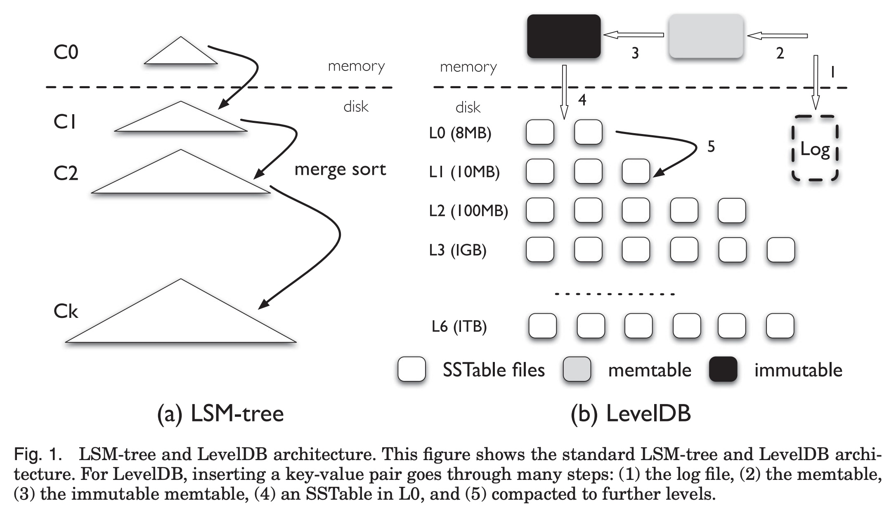  

    ```text
    用户写入 (Put)
         |
         v
    [ 内存 Memtable ]  (快速写入和排序)
         |
      (写满后)
         |
         v
    [ L0 (SSTable) ] (刷盘到磁盘)
         |
      (后台合并)
         |
         v
    [ L1 (SSTable) ]
         |
      (后台合并)
         |
         v
    [ ... ]
         |
         v
    [ Lk (SSTable) ]
    ```

-----

### 3\. 核心问题：I/O 放大 (I/O Amplification)

这是 WiscKey 要解决的**核心痛点** 。

  * **它是什么？**
    指你请求操作系统做 1 次的读写，但存储系统在底层实际上做了 10 次、50 次甚至更多的读写 。这在论文的 2.3 节  和图 4  中有详细讨论。  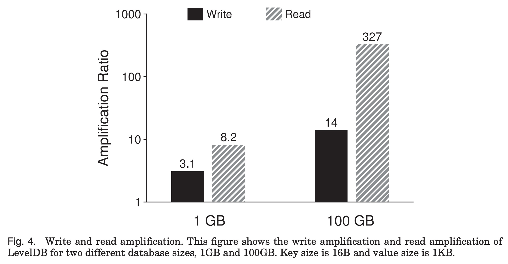  

  * **写放大 (Write Amplification):**

      * **定义：** 你只向上层应用写入了 1KB 数据，但硬盘上最终可能写了 50KB 。
      * **LSM-Tree 的问题：** 在上面的“合并 (Compaction)”过程中 ，一个键值对（比如 `{"key": "user123", "value": "..."}`）在 L0 时被写入一次，然后 L0 合并到 L1 时，它被**再次读取和写入** 。L1 到 L2... 它每向下一层，就可能被重写一次。如果 `value` 很大（比如 1MB），这个重写代价就非常高。

  * **读放大 (Read Amplification):**

      * **定义：** 你只想读 1KB 数据，但硬盘为了找到它，可能读了 300KB 。
      * **LSM-Tree 的问题：** 因为数据分布在不同层次，为了找一个 `key`，LSM-Tree 可能需要：
        1.  检查内存 `memtable` 。
        2.  检查 L0 的所有文件（因为 L0 文件可能重叠）。
        3.  检查 L1 的 1 个文件 。
        4.  检查 L2 的 1 个文件...
      * 最坏情况下，一次查询要访问 14 个文件 ，每次访问都要读取文件的索引块、布隆过滤器等元数据 ，导致读放大。

-----

### 4\. 硬件背景：SSD vs. HDD 的特性

这是理解“为什么 LSM-Tree 以前是好设计，现在（在 SSD 上）却有问题”的关键。

  * **HDD (机械硬盘):**

      * **特性：** 有机械磁头。
      * **顺序 I/O：** 磁头不动，盘片转，读写连续数据。**非常快**。
      * **随机 I/O：** 磁头需要“寻道”，跳到不同位置。**极其慢**（比顺序慢 100 倍以上）。
      * **LSM-Tree 的逻辑：** LSM-Tree 把所有写入都变成了“顺序”刷盘和“顺序”合并。用**高写放大**（多写几次）来换取**无随机写入**，在 HDD 上是**划算的买卖** 。

  * **SSD (固态硬盘):**

      * **特性：** 基于闪存芯片，没有机械部件。
      * **随机 I/O：** 随机读取性能**非常好**，和顺序读取的差距不大（不像 HDD 那样差 100 倍）。
      * **内部并行性：** SSD 内部有很多闪存芯片，可以同时处理多个请求。如果你一次性发 32 个随机读请求，它的总吞吐量可能和顺序读一样快 。这一点在论文的**图 5**  中有清晰展示（Rand-32threads 曲线追上了 Sequential）。  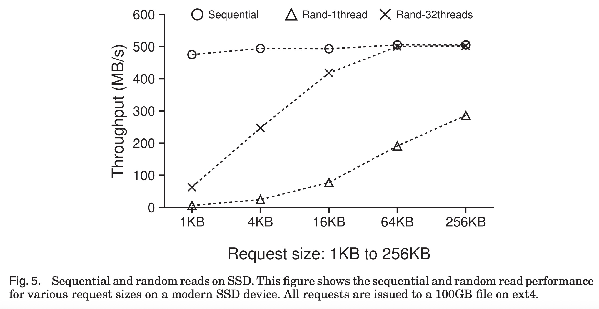  
      * **写入寿命：** 闪存有“擦写次数”限制 。

  * **新旧对比总结：**

      * 在 **HDD** 上：**随机写入**是魔鬼。LSM-Tree 避免了它，是英雄。
      * 在 **SSD** 上：**写放大**是魔鬼（浪费带宽、消耗寿命）。LSM-Tree 的高写放大（尤其是`value`很大时）成了**新问题**。而 SSD 的**随机读取**性能很好，不再是瓶颈。

-----

### 总结：WiscKey 的出发点

掌握了以上知识，你就能瞬间理解 WiscKey 的动机：

> 既然在 SSD 上，“写放大”是新问题，而“随机读”不是问题...  
>  
> 那么，LSM-Tree 合并时反复读写那个巨大的 `value` 纯属浪费 。  
>  
> **WiscKey 的核心思想：**    
> 我们只把 `key` 和 `value` 的“地址指针” (addr) 存在 LSM-Tree 中 。`key` 和 `addr` 都很小。  
>   
> 所有的 `value` (无论多大)，全部**只追加一次**到一个单独的“值日志 (Value Log / vLog)”文件中 。  
>   
> **这样做的好处：**  
> 1.  **极低的写放大：** LSM-Tree 里只有很小的 `key + addr`，合并（Compaction）成本极低 。`value` 永远只写一次，不再被重写 。  
> 2.  **可接受的读放大：** 一次 `Get(key)` 操作变成两步 ：  
> * 1. 在 LSM-Tree 中找到 `key`，拿到 `addr`（因为树很小，这一步非常快，甚至全在内存）。  
> * 2. 根据 `addr` 去 vLog 中做一次**随机读**，拿到 `value` 。  
>    
> 在 SSD 上，第二次的随机读非常快，因此这个交换是完全值得的。    
  
了解了这些基础知识后，你再去看论文中关于垃圾回收 (Garbage Collection) 、范围查询 (Range Query)  和崩溃一致性 (Crash Consistency)  等挑战时，就会明白它们都是在为“键值分离”这个核心设计打补丁了。

您希望我详细解释以上哪个概念，还是直接帮您分析 WiscKey 的架构设计呢？
  
## 2 解读论文 
  
好的，这是一篇数据库存储领域的经典论文。我来为您通俗易懂地解读《WiscKey》的核心思想、解决的问题以及它为什么如此重要。

### 核心观点（一句话总结）

**WiscKey 的核心思想是“键值分离”** 。

它将传统存储系统（如 LevelDB）中“键和值总是在一起”的设计彻底改变，**只在 LSM-Tree 中存储“键”（Key）和值的“地址”（Pointer），而将庞大的“值”（Value）单独存放在一个日志文件（vLog）中** 。

这个简单的改变， **极大地降低了在 SSD（固态硬盘）上的“写放大”** ，从而实现了性能的巨大飞跃 。

-----

### 1\. 论文要解决的“痛点”：I/O 放大

要理解 WiscKey，必须先理解它要解决的“敌人”—— **I/O 放大 (I/O Amplification)**。

I/O 放大分为两种：

#### (1) 写放大 (Write Amplification)

  * **定义：** 你（应用程序）明明只向数据库写入了 1MB 的数据，但数据库底层为了维护数据结构，实际上向硬盘写入了 30MB 甚至 50MB 的数据。这个 30 倍或 50 倍，就是“写放大” 。
  * **LSM-Tree 的“原罪”：** 像 LevelDB 这样的存储引擎，使用的是一种叫 **LSM-Tree**（日志结构合并树）的数据结构 。
  * **工作原理（见图1(b)）：**    
    1.  **内存写入：** 数据先写入内存（memtable）。
    2.  **刷盘 L0：** 内存满了，就排序后刷到磁盘 L0 层 。
    3.  **合并 (Compaction)：** 系统后台会不断地把 L0 的文件和 L1 的文件**合并**，排序后写入 L1；L1 再和 L2 合并... 。
  * **问题所在：** 在这个“合并”过程中，一个键值对 `(Key, Value)` 在 L0 被写入一次，L0-\>L1 合并时被**读取并重写**一次，L1-\>L2 又被**读取并重写**一次... 。
  * **致命缺陷：** 如果 `Key` 很小（比如 16 字节），但 `Value` 很大（比如 1MB），系统为了排序（只需要 `Key`），却**被迫一次又一次地把那 1MB 的 `Value` 也一起读出来、再写下去** 。

> **通俗比喻：**
> 你有一个图书馆（LSM-Tree），书（Value）都按书名（Key）排序。
> **LevelDB 的做法：** 每次整理书架（Compaction），你都必须把**整本厚厚的书**（Key+Value）搬下来，和另一个书架的书一起排序，再**整本**放回去。
> **WiscKey 的想法：** 为什么这么傻？我把所有厚书（Value）都堆到仓库（vLog）里，只在书架上放一张张**小卡片**（Key + 仓库地址）。整理书架时，我只需要**搬动这些小卡片**（Key+Addr）来排序，这不快得多吗？

#### (2) 读放大 (Read Amplification)

  * **定义：** 你只想读 1KB 的数据，但系统为了找到它，从硬盘上读了 300KB 。
  * **LSM-Tree 的问题：** 因为数据分布在很多层，一次读取（Get）最坏可能要检查内存、L0、L1、L2... 。每次检查文件，都要读取文件的索引块、元数据等，导致读放大 。

#### 为什么 SSD 让问题更严重？

  * **HDD (机械硬盘) 时代：** 机械硬盘“随机写”非常慢，但“顺序写”很快 。LSM-Tree 把所有写入都变成了“顺序写”（合并），所以即使有“写放大”，在 HDD 上也是个划算的买卖 。
  * **SSD (固态硬盘) 时代：**
    1.  SSD 的随机读写性能很好 ，LSM-Tree 的“顺序写”优势不那么明显了。
    2.  SSD 有**擦写寿命限制** 。
    3.  **“写放大”成了 SSD 的头号杀手**：它不仅浪费了 SSD 宝贵的带宽，还在**疯狂消耗 SSD 的寿命** 。

论文中的 **图4 (Figure 4)**  清楚地展示了 LevelDB 在一个 100GB 数据库上，写放大高达 14 倍，读放大更是达到了惊人的 327 倍 。    

-----

### 2\. WiscKey 的核心设计：“键值分离”

WiscKey 抓住了 SSD 的特性，提出了“键值分离”的全新设计。

#### (1) WiscKey 的数据布局（见图6）

WiscKey 将数据一分为二 ：  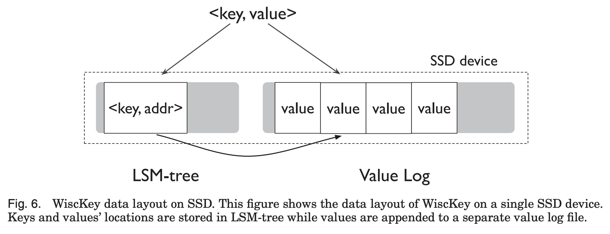  

1.  **LSM-Tree：** 只存储 `(Key, Address)`。`Key` 是键，`Address` 是一个指向 vLog 的指针（偏移量+长度）。
2.  **Value Log (vLog)：** 一个**只追加写入**的大文件，里面紧密地存放着所有的 `Value` 。

#### (2) WiscKey 的工作流程

  * **写入 (Put)：**

    1.  将 `Value` **追加**到 vLog 文件的末尾，获得它的地址 `addr` 。
    2.  将 `(Key, addr)` 写入 LSM-Tree 。

  * **读取 (Get)：**

    1.  在 LSM-Tree 中查找 `Key`，得到地址 `addr` 。
    2.  根据 `addr`，从 vLog 文件中**做一次随机读取**，拿到 `Value` 。


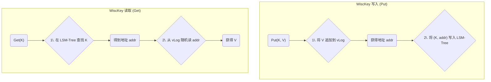

#### (3) “键值分离”带来的巨大优势

  * **写放大几乎消失：**

      * LSM-Tree 中的 `(Key, addr)` 非常小。后台合并 (Compaction) 时，读写的都是这些小数据，成本极低 。
      * 庞大的 `Value` 被写入 vLog 一次后，**永远不会被移动或重写** 。
      * **图12 (Figure 12)**  显示，当 Value 大于 1KB 时，WiscKey 的写放大迅速降至接近 1（理想值），而 LevelDB 始终高于 12 。  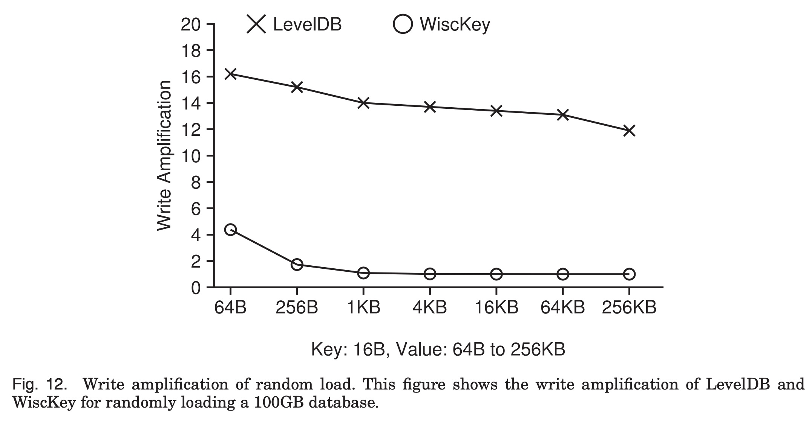  

  * **读放大大幅降低（查找更快）：**

      * 因为 LSM-Tree 只存 `(Key, addr)`，整个树变得**非常小** 。
      * **图14 (Figure 14)**  显示，同样 100GB 数据，LevelDB 的 LSM-Tree 磁盘文件总共约 100GB，而 WiscKey 的 LSM-Tree 只有 358MB 。    
      * 这个 358MB 的“索引” **可以轻松地全部加载到内存中** 。
      * 因此，WiscKey 的第1步查找（在LSM-Tree中）几乎是**纯内存操作**，极快。而 LevelDB 却需要访问磁盘上的多层文件。
      * **图15 (Figure 15)**  显示，WiscKey 的随机查找性能比 LevelDB 高 1.6 到 14 倍 。  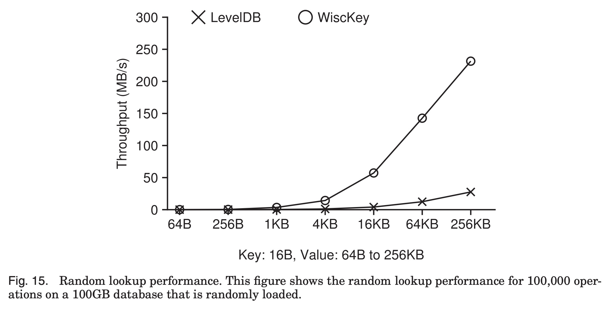  

-----

### 3\. WiscKey 必须解决的新挑战

“键值分离”不是银弹，它引入了三个必须解决的新问题：

#### (1) 挑战一：范围查询 (Range Query)

  * **问题：** LevelDB 中，键值相邻，范围查询（比如 `Scan(K1, K100)`）就是一次高速的顺序读 。但在 WiscKey 中，LSM-Tree 里的 `(Key, addr)` 是有序的，可它们指向的 `Value` 在 vLog 里是**随机分散的** 。
  * **WiscKey 的解决方案：利用 SSD 并行性。**
    1.  SSD 不怕随机读，尤其擅长**并行随机读**（见**图5** ，32 线程的随机读吞吐量几乎等于顺序读）。    
    2.  WiscKey 在执行范围查询时，先从 LSM-Tree 中快速拿到一批 `addr`。
    3.  然后启动一个**线程池**（比如 32 个线程） **并发地** 去 vLog 中读取这些 `Value` 。

#### (2) 挑战二：垃圾回收 (Garbage Collection, GC)

  * **问题：** LevelDB 中，删除或更新数据是“免费”的，在 Compaction 时顺便就把旧数据扔了 。但在 WiscKey 中，vLog 是只追加的，当你删除或更新一个 `Key` 时，它在 vLog 中的旧 `Value` 就成了 **“垃圾”** ，永远待在那里浪费空间 。
  * **WiscKey 的解决方案：在线轻量级 GC。**
    1.  **改进 vLog 结构：** 写入 vLog 时，不仅存 `Value`，也存 `Key`。vLog 中的条目变为 `<Key, Value>` 。
    2.  **GC 流程：** GC 线程从 vLog 的**尾部 (tail)** 开始读取数据块 。
    3.  对于读到的每一个 `<Key, Value>`，它去 LSM-Tree 中**反查**：LSM-Tree 中这个 `Key` 指向的地址还是不是我这个地址？
    4.  **如果是：** 说明数据仍有效，将其**重新追加**到 vLog 的**头部 (head)** 。
    5.  **如果不是：** 说明是垃圾，直接丢弃。
    6.  处理完数据块后，将 `tail` 指针前移，释放空间 。

#### (3) 挑战三：崩溃一致性 (Crash Consistency)

  * **问题：** 写入操作被分成了两步（写 vLog 和写 LSM-Tree）。如果系统在写完 vLog（第1步）后，但在写 LSM-Tree（第2步）前**崩溃**了怎么办？
  * **WiscKey 的解决方案：利用文件系统特性。**
    1.  现代文件系统保证“追加写入”的原子性（要么写成功，要么文件末尾是干净的，不会写一半留个“破”数据）。
    2.  WiscKey 依靠 GC 流程中的设计（vLog 中存了 `Key`）来保证一致性。
    3.  当读取一个 `(Key, addr)` 时，它会去 vLog 中**校验** `addr` 处的 `Key` 是否真的匹配 。
    4.  如果崩溃导致 LSM-Tree 中有 `Key` 但 vLog 中没有对应的有效数据，校验会失败，WiscKey 会认为这个 `Key` 不存在，从而保证了一致性 。

-----

### 4\. 最终效果：YCSB 性能对比

**图21 (Figure 21)**  是最终的成绩单，它对比了 WiscKey、LevelDB 和 RocksDB（LevelDB 的一个优化版）在 6 个标准 YCSB 负载下的性能。  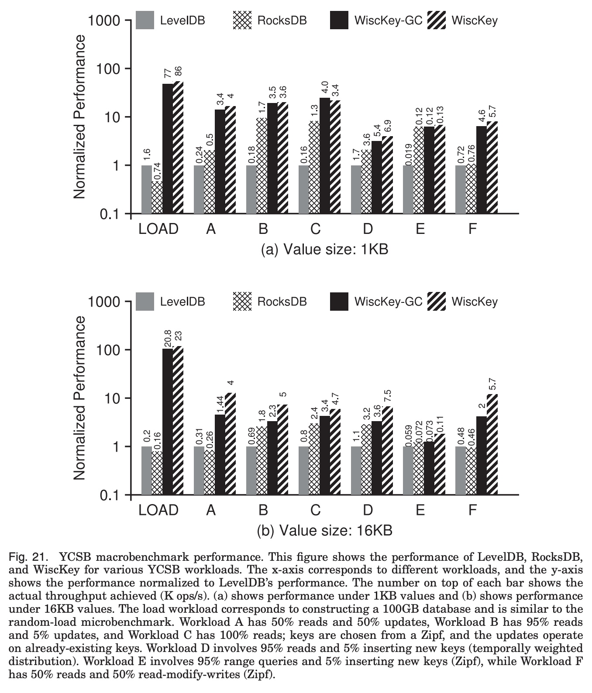  

**结果是碾压性的：**

  * 在所有 6 个负载中，WiscKey 的性能都**远超** LevelDB 和 RocksDB 。
  * 在“加载数据”（Load）这个最能体现写放大的场景中，WiscKey 的性能是竞争对手的 **50 倍到 104 倍** 。
  * 即使是 WiscKey 的最坏情况（WiscKey-GC，即 GC 始终在后台运行），其性能也比对手快 45 倍以上 。

### 总结

WiscKey 通过“键值分离”这一核心设计，巧妙地将 LSM-Tree 的数据结构与 SSD 的硬件特性完美匹配。它牺牲了 LevelDB“免费”的垃圾回收，但换来了**写放大的几乎消失**和**读放大（查找）的大幅降低**，最终在真实世界的基准测试中取得了数量级的性能提升 。
  
## 3 术语 
  
好的，这篇论文《WiscKey: Separating Keys from Values in SSD-Conscious Storage》提出了一种针对 SSD 优化的新型键值存储系统。以下是对论文中核心术语的通俗易懂的中文讲解，并结合了论文中的图示信息。

-----

### 核心背景术语

这些是理解论文“问题”所在的基础。

#### 1\. 键值存储 (Key-Value Store)

  * **中文讲解：**
    一种简单高效的数据库，你可以把它想象成一个“超级字典”。你通过一个唯一的“钥匙”（Key）来存取一个“值”（Value）。比如，`Key="user_123"`，`Value="张三的个人信息"`。
  * **论文中的应用：**
    这是现代应用的基础，用于网页索引、社交网络、电子商务等 。它支持的基本操作包括 `Put` (存入)、`Get` (获取)、`Delete` (删除) 。


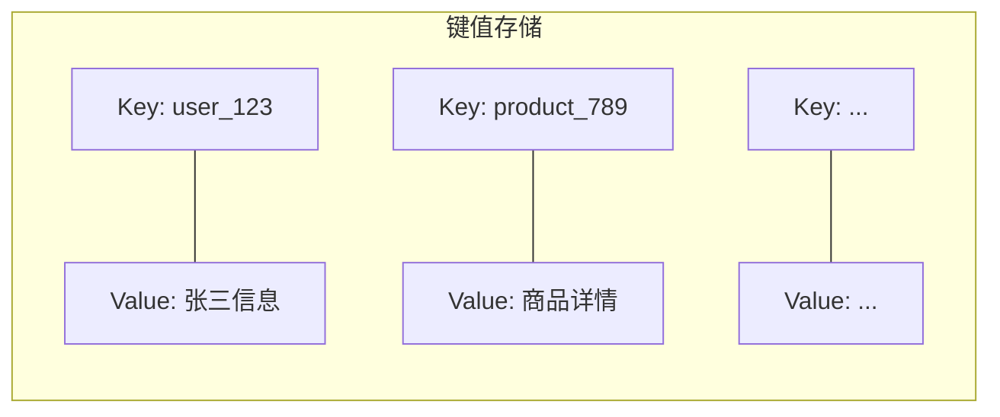

#### 2\. LSM 树 (Log-Structured Merge-Tree)

  * **中文讲解：**
    一种数据结构，专门为“高写入”场景设计 。它的核心思想是：**不立即在原来的位置修改数据**。
    1.  **批量写入：** 所有新的写入都先在内存中（ $C_0$ ）批量处理 。
    2.  **顺序刷盘：** 内存写满后，将数据排序好，*顺序*写入到磁盘上，形成一个“层”（ 如 $C_1$ ）。
    3.  **后台合并：** 系统会在后台不断地将小层（ $C_1$ ）与大层（ $C_2$ ）进行“归并排序”(merge sort)，合并成更大的、有序的文件 。
  * **论文中的图示 (图 1a)：**
    论文中的 **图 1(a)**  形象地展示了这一点：数据像瀑布一样，从内存（ $C_0$ ）流向磁盘（ $C_1$ , $C_2$ , ..., $C_k$ ），并在层与层之间不断合并 。    

#### 3\. LevelDB

  * **中文讲解：**
    Google 开发的一个著名的键值存储库，它就是基于 LSM 树实现的 。
  * **论文中的图示 (图 1b)：**
    **图 1(b)**  展示了 LevelDB 的架构。写入操作的流程是 ：
    1.  先写入 `Log` 文件（用于崩溃恢复）。
    2.  同时写入内存中的 `memtable` 。
    3.  `memtable` 写满后变成 `immutable memtable`（不可变）。
    4.  后台线程将其压缩（compact）到磁盘上的 `SSTable` 文件（L0 层）。
    5.  L0 层的文件会继续被压缩到 L1、L2...L6 层 。


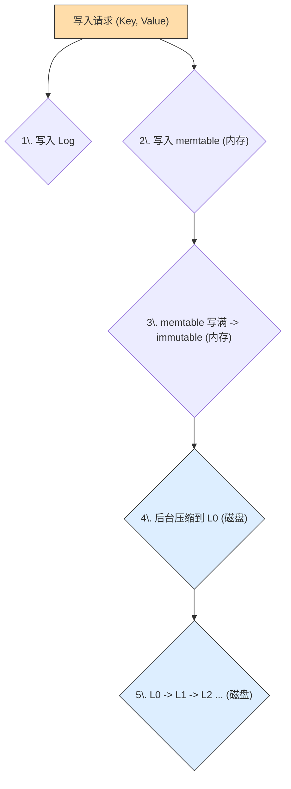

#### 4\. 读/写放大 (Read/Write Amplification)

  * **中文讲解：**
    这是 LSM 树（如 LevelDB）在 SSD 上的**核心问题** 。
  * **写放大 (Write Amplification):**
      * **定义：** 你只想写入 1KB 的数据，但数据库为了维护排序，在后台的合并（Compaction）过程中，可能把这 1KB 数据（以及它周边的几 MB 数据）反复读取、重写了 10 次 。最终你导致了 10KB 甚至更多的*实际*磁盘写入 。
      * **危害：** 浪费 SSD 带宽，并大大缩短 SSD 的使用寿命 。
  * **读放大 (Read Amplification):**
      * **定义：** 你只想读取 1KB 的数据，但数据库为了找到这个数据，可能需要检查内存中的 `memtable`，再检查 L0 层的 4 个文件，L1 层的 1 个文件，L2 层的 1 个文件... 。
      * **危害：** 每次查询都可能导致多次 I/O，读取了大量不需要的元数据（如索引块、布隆过滤器），导致查询速度变慢 。
  * **论文中的图示 (图 4)：**
    **图 4**  用数据证明了这个问题。在一个 100GB 的数据库上 ：    
      * **写放大** 达到了 **14** 倍 。
      * **读放大** 达到了惊人的 **327** 倍 。

#### 5\. 固态硬盘 (SSD) 的特性

  * **中文讲解：**
    WiscKey 专门针对 SSD 进行优化 。与传统机械硬盘（HDD）不同，SSD 的特性是 ：
    1.  **随机读快：** 随机读和顺序读的性能差距不大 。
    2.  **并行性高：** SSD 内部有多个闪存芯片，可以同时处理多个请求 。
  * **论文中的图示 (图 5)：**
    **图 5**  显示，单个线程的随机读（`Rand-1thread`）性能较差，但 32 个线程的*并行*随机读（`Rand-32threads`），其吞吐量几乎可以赶上顺序读（`Sequential`）。    

-----

### WiscKey 核心设计术语

这些是 WiscKey 用来解决上述问题的“方案”。

#### 6\. 键值分离 (Key-Value Separation)

  * **中文讲解：**
    这是 WiscKey **最核心的创新** 。
    LevelDB 的问题在于，它在后台合并时，把“Key 和 Value”绑在一起移动，但 Value 通常比 Key 大得多。WiscKey 认为：**排序只需要 Key，Value 本身不需要参与排序** 。
    因此，WiscKey 将它们分开存储 ：

    1.  **LSM 树：** 只存储 `Key` 和一个指向 Value 的“地址”（指针）。
    2.  **值日志 (vLog)：** 另开一个大文件，把所有的 `Value` 顺序追加进去 。

  * **好处：**

      * LSM 树变得非常小（因为只剩下了 Key），合并（Compaction）速度极快，**写放大** 几乎降为 1 。
      * LSM 树小到可以几乎完全缓存在内存中，查询 Key 的地址非常快 ，**读放大** 也大大降低 。

  * **论文中的图示 (图 6)：**
    **图 6**  清晰地展示了 WiscKey 的数据布局。当一个 `<Key, Value>` 写入时：    

    1.  `Value` 被追加到 `Value Log` 文件中 。
    2.  `Key` 和 `Value` 的地址（addr）被存入 `LSM-tree` 。


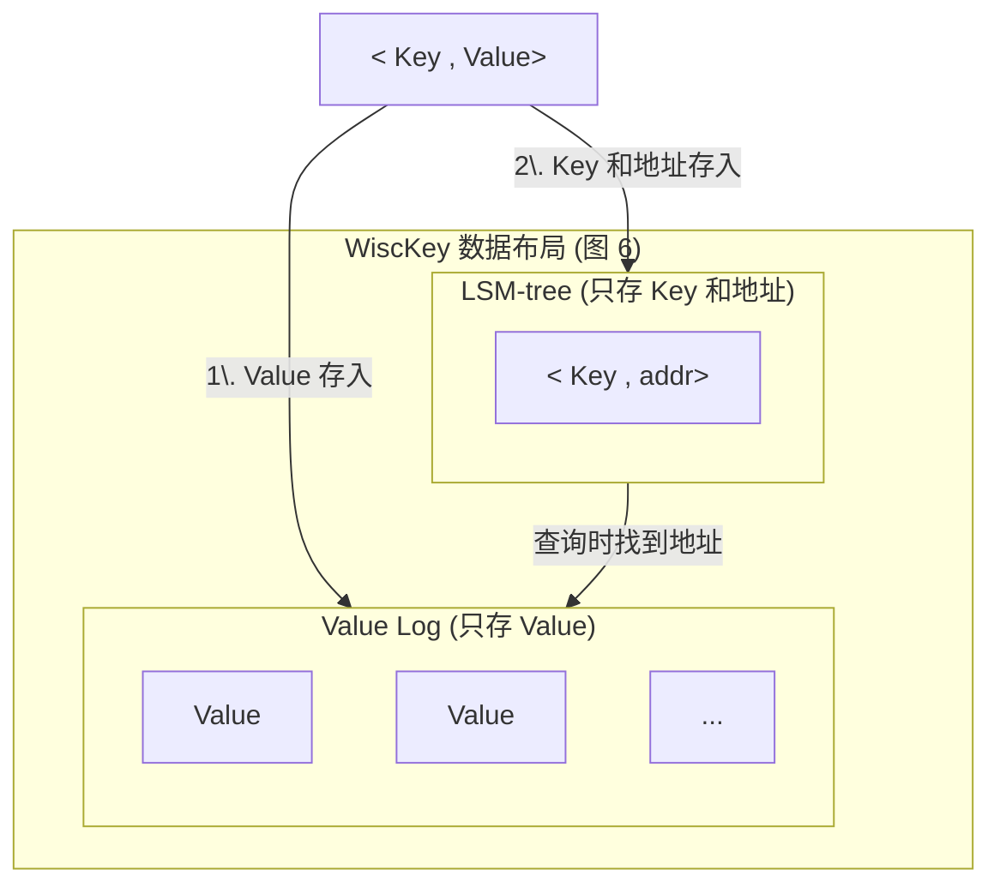

#### 7\. 值日志 (Value Log / vLog)

  * **中文讲解：**
    就是上面提到的，专门用来**顺序**存储所有 `Value` 的那个大文件 。所有新的 `Value` 都被追加（Append）到这个文件的末尾 。

#### 8\. 垃圾回收 (Garbage Collection - GC)

  * **中文讲解：**
    “键值分离”带来的**新问题** 。当你删除或更新一个 Key 时，LSM 树里的 `<Key, addr>` 被删了，但 vLog 里那个旧的 `Value` 还在，变成了“垃圾” 。WiscKey 需要一个机制来清理 vLog 中的这些垃圾。
  * **WiscKey 的方案 (图 7)：**  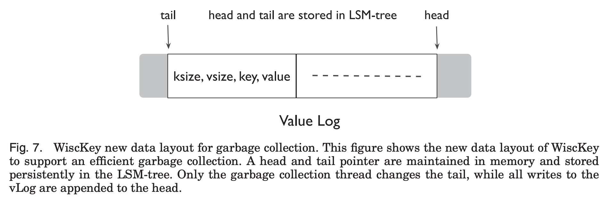  
    WiscKey 维护两个指针 `head`（头部）和 `tail`（尾部）。
    1.  `head` 是 vLog 的末尾，新数据从这里写入 。
    2.  `tail` 是 vLog 的开头，GC 从这里开始清理 。
    3.  GC 线程从 `tail` 读取一小块数据，去 LSM 树中检查这些 `Value` 对应的 `Key` 是否还“存活” 。
    4.  如果 `Value` 仍然有效（没被删除），GC 就把它重新写入到 `head` 处 。
    5.  `tail` 处的旧空间被释放，`tail` 指针向前移动 。


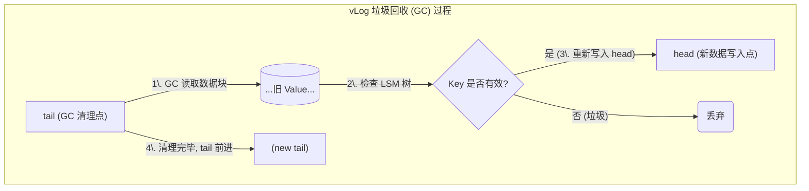

#### 9\. 并行范围查询 (Parallel Range Query)

  * **中文讲解：**
    “键值分离”带来的**另一个问题** 。在 LevelDB 中，Key 和 Value 存在一起且有序，范围查询（比如查询 Key 从 'A' 到 'C'）非常快。但在 WiscKey 中，Key 在 LSM 树中虽然有序，但对应的 `Value` 在 vLog 中是分散的，这会导致大量的随机读取 。
  * **WiscKey 的方案：**
    利用 SSD 的高并行特性（见术语 5）。
    1.  首先，WiscKey 快速地在 LSM 树中扫描，获取 'A' 到 'C' 之间所有 Key 对应的 `Value` 地址列表。
    2.  然后，WiscKey 开启一个**线程池**（例如 32 个线程），**并行地**去 vLog 中读取这些分散的 `Value` 。
    3.  通过并行化，将多次随机读的延迟隐藏起来，实现了高吞吐量的范围查询 。

希望这份讲解能帮助你理解 WiscKey 的核心思想！

您是否还想了解 WiscKey 与 LevelDB 和 RocksDB 的性能对比结果（如 YCSB 基准测试）？
  
## 参考        
         
https://dl.acm.org/doi/pdf/10.1145/3033273    
        
<b> 以上内容基于DeepSeek、Qwen、Gemini及诸多AI生成, 轻微人工调整, 感谢杭州深度求索人工智能、阿里云、Google等公司. </b>        
        
<b> AI 生成的内容请自行辨别正确性, 当然也多了些许踩坑的乐趣, 毕竟冒险是每个男人的天性.  </b>        
  
    
#### [期望 PostgreSQL|开源PolarDB 增加什么功能?](https://github.com/digoal/blog/issues/76 "269ac3d1c492e938c0191101c7238216")
  
  
#### [PolarDB 开源数据库](https://openpolardb.com/home "57258f76c37864c6e6d23383d05714ea")
  
  
#### [PolarDB 学习图谱](https://www.aliyun.com/database/openpolardb/activity "8642f60e04ed0c814bf9cb9677976bd4")
  
  
#### [PostgreSQL 解决方案集合](../201706/20170601_02.md "40cff096e9ed7122c512b35d8561d9c8")
  
  
#### [德哥 / digoal's Github - 公益是一辈子的事.](https://github.com/digoal/blog/blob/master/README.md "22709685feb7cab07d30f30387f0a9ae")
  
  
#### [About 德哥](https://github.com/digoal/blog/blob/master/me/readme.md "a37735981e7704886ffd590565582dd0")
  
  

  
