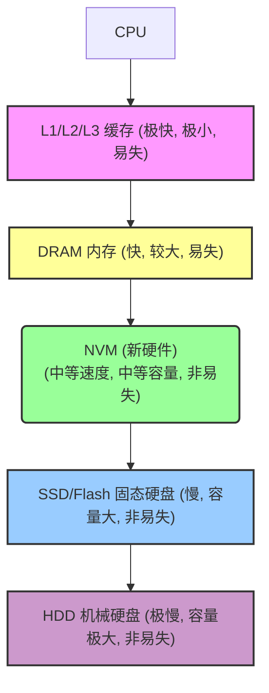
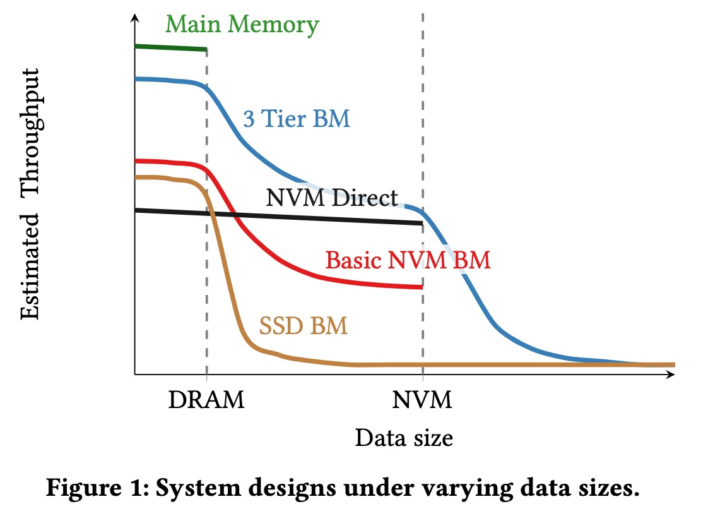
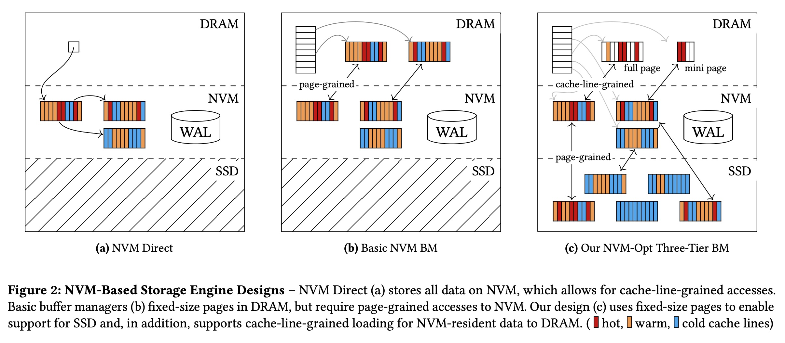
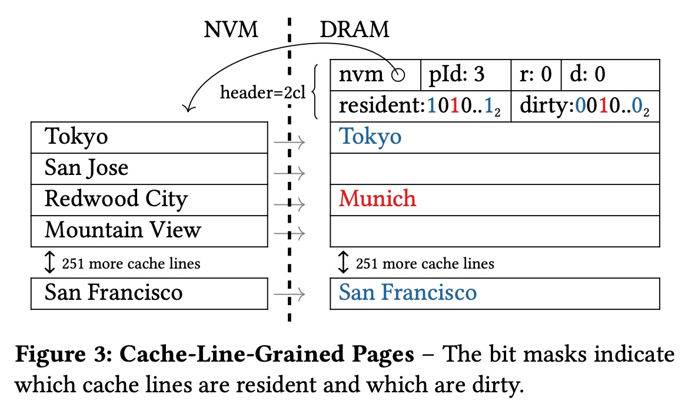
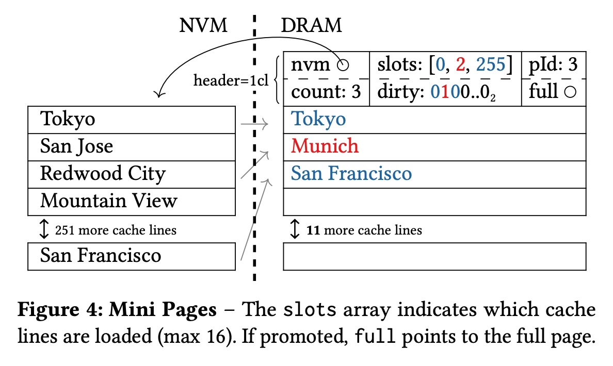
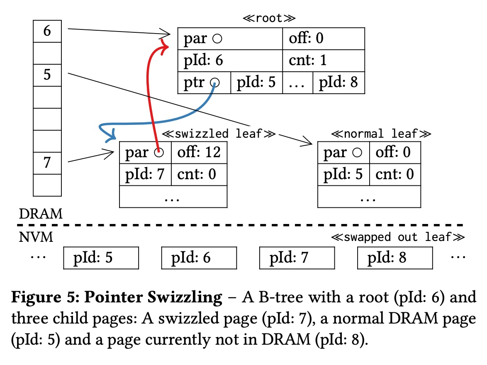
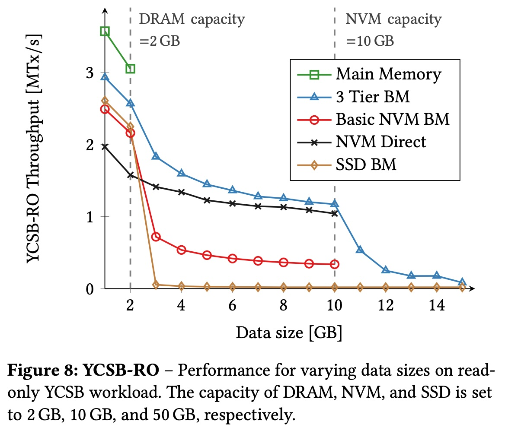
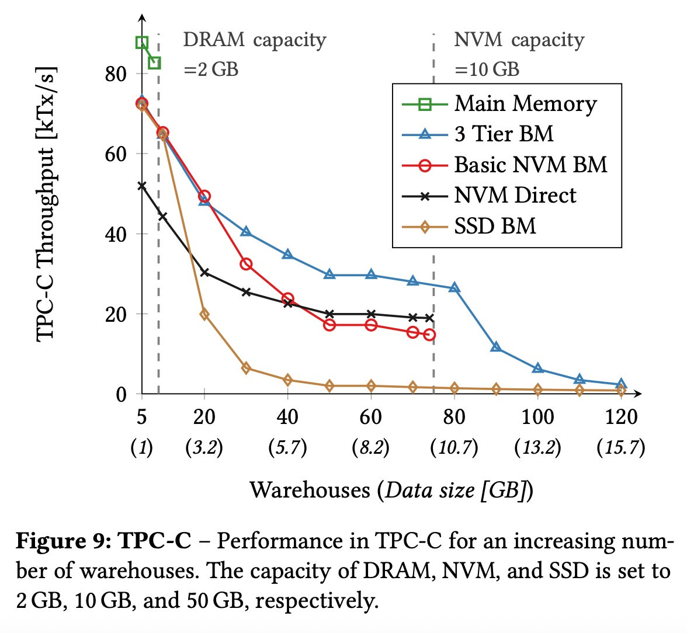
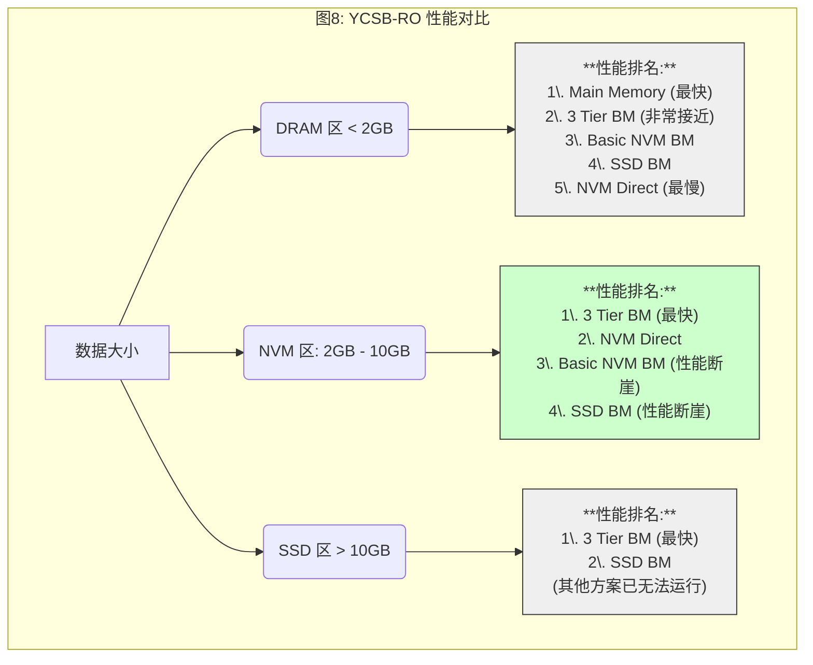
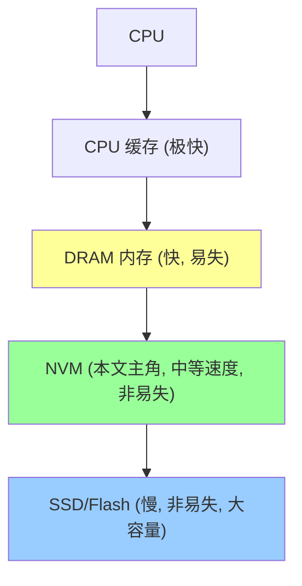

## AI论文解读 | Managing Non-Volatile Memory in Database Systems
        
### 作者        
digoal        
        
### 日期        
2025-10-28        
        
### 标签        
PostgreSQL , PolarDB , DuckDB , AI , 论文解读        
        
----        
        
## 背景  
      
https://dl.acm.org/doi/pdf/10.1145/3183713.3196897        
  
提示:          
```          
读懂《Managing Non-Volatile Memory in Database Systems》这篇论文需要提前掌握哪些基础知识, 请使用中文通熟易懂的讲解这些基础知识, 可以引用论文中的图、表或使用Markdown支持的图形(text,mermaid等)增加解释性. 
  
使用中文通熟易懂的解读《Managing Non-Volatile Memory in Database Systems》这篇论文, 其中的关键内容请着重讲解, 可以引用论文中的图、表或使用Markdown支持的图形(text,mermaid等)增加解释性. 
  
提取《Managing Non-Volatile Memory in Database Systems》这篇论文中的重要术语, 使用中文对这些术语进行通熟易懂的讲解, 可以引用论文中的图、表或使用Markdown支持的图形(text,mermaid等)增加解释性. 
```     
  
## 1 前置知识 
  
好的，这是一篇关于数据库如何利用新型硬件（非易失性内存 NVM）的经典论文。要透彻理解它，你需要一些关于计算机系统和数据库的基础知识。

这篇论文的核心是**解决一个问题**：我们有DRAM（内存，快但不持久）、SSD（固态硬盘，慢但持久），现在又来了一个新硬件 **NVM（非易失性内存）** ，它的特性介于两者之间（比DRAM慢一点，但比SSD快得多，并且像SSD一样断电不丢数据）。那么，数据库系统应该如何设计，才能最大限度地利用好这三层存储，实现最佳性能？

以下是你需要提前掌握的基础知识：

### 1\. 🖥️ 计算机存储金字塔 (Storage Hierarchy)

这是理解这篇论文最重要的背景。计算机的存储系统是分层的，越往上（越靠近CPU），速度越快，但价格越贵，容量也越小。

你可以通过这个简图来理解：



  * **DRAM（内存）** ：速度快，CPU可以直接访问它上面的每一个字节（称为**字节寻址**）。缺点是“易失”，一断电数据就全没了 。
  * **SSD（硬盘）** ：速度慢，非易失（持久）。CPU不能直接访问它，必须通过操作系统，而且是以“块”（或“页”）为单位读写（称为**块寻址**），比如一次最少读写4KB或16KB 。
  * **NVM（非易失性内存）** ：这篇论文的主角。它像DRAM一样是**字节寻址**，又像SSD一样**非易失** 。它的出现打破了原有的“内存”和“磁盘”的清晰界限。

### 2\. 🗃️ 数据库的“缓冲区管理器” (Buffer Manager)

这是数据库系统的核心组件之一。由于DRAM（内存）比SSD（磁盘）快得多，数据库会尽可能把“热”数据（经常访问的数据）从SSD读到DRAM中缓存起来。

  * **缓冲区（Buffer Pool）** ：数据库在DRAM里开辟的一块巨大内存空间，用来当作缓存。
  * **页（Page）** ：数据库从SSD读写数据的基本单位（例如16KB）。
  * **工作原理**：
    1.  当数据库需要读数据时，它会先去缓冲区里找。
    2.  如果找到了（**缓存命中**），就直接从DRAM返回，速度极快。
    3.  如果没找到（**缓存未命中**），它就去SSD上把包含该数据的**一整个页**加载到缓冲区中，然后再返回给用户 。
    4.  如果缓冲区满了，就需要按某种算法（如LRU，最近最少使用）淘汰一个“冷”的页，把它写回SSD，再腾出空间给新的页。

这篇论文提出的`3 Tier BM`（三层缓冲区管理器） 就是对这个概念的扩展，它要管理`DRAM <-> NVM <-> SSD`三层之间的缓存。

**论文中的图1**  完美地展示了这个问题。    

  * X轴是“数据大小”，Y轴是“吞吐量”（性能）。
  * **SSD BM**（传统缓冲区）和 **Basic NVM BM**（基础NVM缓冲区）：当数据大小超过DRAM或NVM的容量时，性能会 **“断崖式下跌”** （performance cliffs）。
  * **3 Tier BM**（本文方案）：性能下降得非常 **“平滑”**  ，这正是它的目标。

### 3\. 🔑 "页寻址" vs "字节寻址" (Page vs. Byte Addressable)

这是理解本文**核心创新**的关键。

  * **传统SSD BM**：从SSD读数据，必须整页读取（例如16KB），即使你只想要其中的8个字节，也得把整个16KB都读到DRAM，这很浪费 。
  * **NVM 的特性**：NVM 是字节寻址的 。
  * **本文的创新 (Cache-Line-Grained Pages)**：论文作者意识到，既然NVM是字节寻址的，我们为什么还要像对SSD一样，整页（16KB）地把它和DRAM做交换？
  * 作者提出，只把NVM中真正“热”的 **“缓存行”（Cache Line，例如64字节）** 加载到DRAM中 。
  * **好处**：极大地节省了DRAM宝贵的空间，也减少了DRAM和NVM之间的带宽占用。一个16KB的DRAM页框，在传统方案下只能放1个页；在本文方案下，可能能放下100个不同页里的“热”缓存行。

**论文中的图2**  直观地对比了不同架构：    

  * **(b) Basic NVM BM**：DRAM和NVM之间是 **page-grained（页粒度）** 交换 。
  * **(c) Our NVM-Opt Three-Tier BM**：DRAM和NVM之间是 **cache-line-grained（缓存行粒度）** 交换 。

### 4\. 🌳 B-Tree 索引 (B-Tree Indexing)

数据库如何快速找到数据？答案是索引。B-Tree（B树）或 B+-Tree 是最常用的索引结构。

你需要知道的是：

1.  B-Tree 是一种树状结构，数据（或数据的指针）存储在**叶子节点**（Leaf Nodes）。
2.  查找数据时，需要从根节点一路遍历到叶子节点。
3.  一个叶子节点通常就是一个 **“页”** （Page）。
4.  在叶子节点内部，数据是**有序存储**的，因此可以通过**二分查找**（Binary Search）快速定位 。

**这和论文有什么关系？**
论文中提到一个例子：在一个16KB的页上做二分查找，最多只需要访问 $log_2(1024) = 10$ 次（假设有1024个条目）。这10次访问可能只分散在10个不同的**缓存行**上 。

  * **传统方案**：为了这10个缓存行（约 $10 * 64 = 640$ 字节），必须从NVM加载**整个16KB**的页到DRAM 。
  * **本文方案**：只加载这10个缓存行（640字节）到DRAM，效率极高 。

### 5\. ⚡ 数据库事务 (Transactions) 和日志 (Logging)

数据库需要保证事务的 **持久性（Durability）** 。

  * **WAL（Write-Ahead Logging）** ：这是最经典的技术 。在修改数据页**之前**，必须先把“修改日志”写到持久化存储（如SSD）上。这样即使在修改数据页时系统崩溃，重启后也可以通过日志来恢复。
  * **NVM Direct 方案** ：一种对比方案。它试图直接在NVM上修改数据。但这会带来新问题，比如CPU Cache是易失的 ，而且NVM的写入延迟和寿命也是问题 。
  * **本文方案 (3 Tier BM)**：它选择了一个更稳妥的方案，更新总是在DRAM中进行 ，然后通过WAL来保证持久性 。这隐藏了NVM的写入延迟，并提高了NVM的耐久度 。

-----

### 总结

要读懂这篇论文，你需要把自己想象成一个数据库内核开发者。你需要了解：

1.  **硬件基础**：DRAM、NVM、SSD三者的速度、易失性、寻址方式的根本区别（这是“为什么”）。
2.  **数据库缓存**：缓冲区管理器（Buffer Manager）和“页”的概念（这是“老方法”）。
3.  **核心矛盾**：老方法（页粒度）无法发挥新硬件（字节寻址）的全部威力（这是“问题”）。
4.  **索引知识**：B-Tree的查找特性，解释了为什么“缓存行粒度”的优化是合理且有效的（这是“优化点”）。

这篇论文的巧妙之处在于，它没有彻底推倒重来，而是基于经典的“缓冲区管理器”架构，通过引入**缓存行粒度页面（Cache-Line-Grained Pages）** 、**迷你页（Mini Pages）**  和 **指针压缩（Pointer Swizzling）**  等一系列优化，完美地将NVM的特性“无缝”地融入了现有的`DRAM-SSD`体系中，升级为了`DRAM-NVM-SSD`三层架构。

您想了解这篇论文提出的“3 Tier BM”架构的具体工作流程吗？
  
## 2 解读论文 
  
这是一篇数据库领域关于新型硬件的重磅论文。它的核心思想是：当一个“革命性”的新硬件—— **NVM（非易失性内存）** 出现时，我们不应该简单地用老方法去套用它，而应该重新设计数据库的存储引擎，才能真正发挥它的威力。

这篇论文的“王牌”是一个名为 **"3 Tier BM"（三层缓冲区管理器）** 的新架构，它巧妙地结合了三种存储硬件：**DRAM (内存)**、**NVM (新硬件)** 和 **SSD (固态硬盘)**，实现了在所有数据规模下都能获得接近最优的性能 。

-----

### 1\. 问题的背景：NVM 带来的“甜蜜的烦恼”

在 NVM 出现之前，数据库的世界很简单：

  * **DRAM (内存)**：速度极快，但“易失”（一断电数据就丢了），而且昂贵 。
  * **SSD (硬盘)**：速度慢，但“非易失”（持久化），而且便宜 。

数据库的传统做法是使用 **Buffer Manager（缓冲区管理器）** ，在 DRAM 里开辟一块“缓存区”，把 SSD 里的“热”数据（经常访问的数据）加载进来，从而实现加速。

现在，NVM 出现了。它集两家之长：

  * **像 DRAM 一样**：可以按“字节”访问（**Byte Addressable**）。
  * **像 SSD 一样**：数据“非易失”，断电不丢 。
  * **速度**：介于 DRAM 和 SSD 之间（比 DRAM 慢，但比 SSD 快得多）。

**这带来了新的问题**：我们该如何使用 NVM？

  * **方案 A (NVM Direct)**：激进派。干脆把所有数据都放 NVM，不用 DRAM 了 。
      * **缺点**：NVM 还是比 DRAM 慢 。对于能完全放入内存的“热”数据，这个方案反而变慢了。
  * **方案 B (Basic NVM BM)**：保守派。把 NVM 当成一块“超快的 SSD” 。继续用老的 Buffer Manager，让 DRAM 缓存 NVM。
      * **缺点**：这是**最大的浪费**！老的 Buffer Manager 是为“块设备”SSD 设计的，读写单位是“页”（Page，例如 16KB）。为了读取 8 字节的数据，你却要从 NVM 加载整个 16KB 的页到 DRAM，这完全**浪费了 NVM“字节寻址”的超能力** 。

**论文的目标**：设计一个新架构，解决以上所有问题。正如论文图1所示，新架构（`3 Tier BM`）要避免传统方案（`SSD BM`、`Basic NVM BM`）在数据量增大时的“性能断崖”（Performance Cliffs），实现平滑的性能过渡 。    

### 2\. 本文的王牌架构：3 Tier BM 及其三大核心技术

作者提出的 `3 Tier BM` (三层缓冲区管理器) 是一个能在 DRAM、NVM、SSD 之间高效调度数据的智能引擎。它之所以能成功，依赖于三大核心技术：

#### 核心技术一：缓存行粒度页面 (Cache-Line-Grained Pages)

这是本文最核心的创新，是发挥 NVM 字节寻址能力的关键。

  * **传统方案 (Basic BM)**：当 DRAM 缓存 NVM 时，DRAM 需要分配一个 16KB 的内存页，然后从 NVM 读取一个 16KB 的数据页，把它**完整**复制过来（如图2b）。    
  * **本文方案 (3 Tier BM)**：DRAM 同样分配一个 16KB 的“页框”（Frame），但**它一开始是空的**。当程序需要访问 NVM 页上的某个数据时，系统**只**把被访问数据所在的 **“缓存行”（Cache Line，例如 64 字节）** 从 NVM 复制到 DRAM 页框对应的位置 。

你可以这样理解：

> NVM 上的页是一本 16KB 的大书。
>
>   * **传统方案**：为了看书中的一句话，你必须把整本书借（复制）到你的DRAM桌子上。
>   * **本文方案**：你只需要把书中你需要的那句话，抄（复制）到你DRAM桌子的便利贴上。

**如何实现？**
如图3所示，DRAM 中的页框会有一个“页头”（Header），里面有**位图 (Bitmask)**，例如 `resident` 位图 。这个位图的每一位对应 NVM 页上的一个缓存行。如果第 5 位是 1，就表示第 5 个缓存行已经被加载到 DRAM 中了 。    

**好处**：

1.  **节省带宽**：只传需要的数据，DRAM-NVM 之间的数据传输量大大减少 。
2.  **节省 DRAM**：一个 16KB 的 DRAM 页框可以只存放来自 NVM 页的几个“热”缓存行，DRAM 利用率飙升。

#### 核心技术二：迷你页 (Mini Pages)

这是技术一的自然延伸。作者想到：既然很多时候我只需要加载几个缓存行（比如总共 640 字节），那我何必在 DRAM 里给它预留一个 16KB 的“全页”空间呢？这太浪费了 。

  * **解决方案**：引入“迷你页” 。
  * **工作流程**：当一个 NVM 页第一次被访问时，系统不在 DRAM 中分配一个 16KB 的“全页”，而是分配一个很小的“迷你页”（例如 1KB）。这个迷你页（如图4）通过一个 `slots` 数组来映射它所持有的 NVM 缓存行 。    
  * **"升级"机制**：当这个迷你页被访问得越来越“热”，需要加载的缓存行越来越多，直到“迷你页”装不下时（例如超过 16 个缓存行），系统会自动将它“**提升**”（Promote）为一个 16KB 的“全页”，把数据复制过去 。

**好处**：极大地提高了 DRAM 空间的利用率 。在 DRAM 非常有限的情况下，可以用同样的内存缓存更多“极热”的数据。

#### 核心技术三：指针压缩 (Pointer Swizzling)

解决了 DRAM-NVM 的问题，作者开始优化 DRAM 内部的性能。

  * **传统开销**：在 Buffer Manager 中，数据结构（比如 B+树）是通过“Page ID”（页编号）来引用其他页的。当需要访问一个页时，必须先拿着 Page ID 去一个 **哈希表（Page Table）** 里查找，才能得到该页在 DRAM 中的真实内存地址 。这个“查哈希表”的动作，对于在 DRAM 中高速运行的程序来说，是一个不可忽视的开销。
  * **本文方案**：对于那些“极热”的、常驻 DRAM 的页，系统会进行“**指针压缩**”（Pointer Swizzling）。
  * **工作流程**：如图5所示，B+树的根节点（pId 6）原本存的是子节点的 Page ID（如 pId 7）。当 pId 7 被加载到 DRAM 并且被“压缩”后，系统会**直接修改**根节点 pId 6 里的内容，把它从 `Page ID 7` 改为指向 pId 7 的**真实 DRAM 内存地址** 。    
  * **好处**：下次访问时，CPU 直接根据内存地址跳转，**完全跳过了“查哈希表”这一步** ，使在 DRAM 中的访问性能接近了纯内存数据库。

-----

### 3\. 实验结果：用数据“吊打”对手

这篇论文最“爽”的部分就是实验图（如图8和图9）。作者对比了5种方案：      

1.  **Main Memory**：理想状态（数据全在DRAM）。
2.  **3 Tier BM**（本文方案）。
3.  **NVM Direct**（激进派，全用NVM）。
4.  **Basic NVM BM**（保守派，DRAM缓存NVM，但用老方法）。
5.  **SSD BM**（传统方案，DRAM缓存SSD）。

实验结果（以YCSB-RO，图8为例）清晰地分成了三个区域：



**结论非常震撼：**

  * **在 DRAM 区**：本文方案 `3 Tier BM` 凭借“指针压缩”技术，性能紧追纯内存方案，远超 `NVM Direct` 。
  * **在 NVM 区**：这是关键战场。`Basic NVM BM` 和 `SSD BM` 因为缓存失效，性能“断崖式下跌” 。而本文方案 `3 Tier BM` 凭借“缓存行粒度”和“迷你页”技术，DRAM 缓存效率极高，**甚至反超了 `NVM Direct`** 。
  * **在 SSD 区**：只有 `3 Tier BM` 和 `SSD BM` 能运行。`3 Tier BM` 把 NVM 当作一个巨大的二级缓存，性能**完胜**传统的 `SSD BM` 。

**性能拆解（图10）**    
作者还展示了为什么 `3 Tier BM` 这么快。在 NVM 区，相比 `Basic NVM BM`（基线）：

  * `+ 缓存行粒度`：性能提升约 **2.4 倍** 
  * `+ 迷你页`：性能累计提升约 **3.8 倍** 
  * `+ 指针压缩`：性能累计提升约 **4.2 倍** 
  * 这一套组合拳下来，性能直接超越了 `NVM Direct` 。

### 总结

这篇论文是一个教科书级的系统设计范例。它告诉我们，面对新硬件，不应该局限于“全盘替换”或“旧瓶装新酒”的思维。

它通过**三大核心技术**（缓存行粒度、迷你页、指针压缩），设计了一个全新的 **`3 Tier BM`** 架构，将 DRAM、NVM 和 SSD 三种特性迥异的硬件“无缝”地统一起来，是唯一一个在所有数据规模下（从小到大）都能提供最顶级性能的解决方案 。

您是否想进一步了解这三种硬件在三层架构中是如何进行“换入换出”（Replacement Strategies）的？
  
## 3 术语 
  
好的，这是一篇信息量非常大且很经典的论文。为了让您彻底理解，我提取了论文中的核心术语，并用最通俗易懂的中文为您讲解：

-----

### 1\. 基础硬件与背景

#### 🔸 NVM (Non-Volatile Memory) - 非易失性内存

  * **通俗讲解**：这是一种“黑科技”存储硬件，它像DRAM（内存）一样快 ，也像DRAM一样可以直接按“字节”读写（见下一个术语） ；但它又像SSD（硬盘）一样“非易失”，也就是**断电不丢数据** 。
  * **在论文中的角色**：它是一种介于DRAM（快、贵、易失）和SSD（慢、便宜、非易失）之间的“中层”硬件 。整篇论文都在探讨，数据库应该如何驾驭这个“新物种”。

#### 🔸 存储金字塔 (Storage Hierarchy)

  * **通俗讲解**：这是计算机系统的基础概念。越靠近CPU的存储越快、越贵、容量越小。这篇论文要解决的就是如何管理一个**新**的金字塔：




#### 🔸 字节寻址 (Byte Addressability)

  * **通俗讲解**：这是DRAM和NVM的“超能力” 。意思是CPU可以直接读取或写入存储上的**任意一个字节**。
  * **反例**：传统的SSD是“块寻址” 。你不能只读1个字节，你必须一次性读取一整“页”（Page，例如16KB） 。
  * **打个比方**：“字节寻址”就像你可以直接翻到字典的第20页第5个字。“块寻址”就像你为了查这个字，必须先把第20页到第30页全部复印一份。

#### 🔸 缓冲区管理器 (Buffer Manager, BM)

  * **通俗讲解**：这是数据库的“缓存”系统 。由于DRAM（内存）比SSD（硬盘）快得多，数据库会在DRAM里开辟一块大空间（称为Buffer Pool） 。当需要访问SSD上的数据时，会把它以“页”（Page）为单位加载到DRAM中 。下次再访问时，直接从DRAM读取，速度就快了。
  * **在论文中的角色**：本文的核心就是设计一个新型的Buffer Manager，来同时管理DRAM、NVM、SSD三层。

-----

### 2\. 要解决的问题：传统方案的缺陷

#### 🔸 NVM Direct

  * **通俗讲解**：这是一种“激进”的方案，也是本文的“靶子”之一。它的想法是：既然NVM又快又持久，那干脆把所有数据都放NVM上，DRAM只用来放临时数据 。
  * **论文中的图示**：如图 2(a) 所示，所有数据都在NVM层 。    
  * **缺陷**：NVM还是比DRAM慢 。对于能完全放进DRAM的热数据，这种方案反而会**导致性能下降** 。

#### 🔸 Basic NVM BM (基础NVM缓冲区管理器)

  * **通俗讲解**：这是一种“保守”的方案，也是本文的另一个“靶子”。它的想法是：把NVM **当作一块“超级SSD”** ，然后用DRAM来给它做缓存 。
  * **论文中的图示**：如图 2(b) 所示，DRAM和NVM之间以“页粒度”（page-grained）交换数据 。
  * **缺陷**：**这是最大的浪费！**  它完全无视了NVM“字节寻址”的能力。为了读取NVM上的1个字节，它还是把整个16KB的页加载到了DRAM ，效率极低。

#### 🔸 性能断崖 (Performance Cliffs)

  * **通俗讲解**：这是传统方案（如 `SSD BM` 和 `Basic NVM BM`）的共同问题 。
  * **论文中的图示**：请看图1。当数据大小（X轴）刚好超过DRAM或NVM的容量时，`SSD BM` 和 `Basic NVM BM` 的性能（Y轴）会 **“断崖式”垂直下跌** 。    
  * **本文目标**：本文提出的 `3 Tier BM` 方案，其性能曲线（图1中的蓝线）下降得非常**平滑**，避免了这种断崖 。

-----

### 3\. 论文的核心技术：3 Tier BM 的三大法宝

本文提出的新架构叫 `3 Tier BM` (三层缓冲区管理器) ，它同时利用DRAM、NVM和SSD 。它之所以强大，依赖于以下三个关键技术：

#### 🔸 缓存行粒度页 (Cache-Line-Grained Pages)

  * **通俗讲解**：这是本文**最核心的创新**。它解决了 `Basic NVM BM` 的浪费问题。
  * **工作原理**：当DRAM需要缓存NVM上的一个页时，它不再是一次性把16KB全部复制过来。而是：
    1.  DRAM先在内存里分配一个16KB的“空页框” 。
    2.  当程序需要访问NVM页上的第5个缓存行（Cache Line，例如64字节）时，系统**只把这64字节**从NVM加载到DRAM页框的对应位置 。
    3.  系统用一个“位图”（bitmask）来跟踪哪些缓存行被加载了 。
  * **论文中的图示**：图3完美地展示了这一点。DRAM中的页框有一个 `resident` 位图，显示只有“Tokyo”、“Munich”和“San Francisco”这几个（代表热数据的）缓存行被加载了，其他空间都是空的。    
  * **好处**：极大地节省了DRAM-NVM之间的数据传输带宽  和宝贵的DRAM空间 。

#### 🔸 迷你页 (Mini Pages)

  * **通俗讲解**：这是“缓存行粒度页”的**极致优化**。
  * **解决的问题**：虽然“缓存行粒度”很棒，但DRAM里还是分配了一个16KB的完整页框 。如果一个页99%都是“冷”数据，只有一个缓存行是“热”的，我只为了这64字节就占用DRAM 16KB空间，还是太浪费了 。
  * **工作原理**：
    1.  当第一次访问NVM页时，系统**不**分配16KB的“全页”，而是分配一个非常小的“**迷你页**”（例如1KB） 。
    2.  这个迷你页（如图4所示）可以存放少量（例如16个）“热”的缓存行 。    
    3.  只有当这个页越来越热，迷你页被装满了，系统才会把它“**提升**”（Promote）为一个16KB的全页 。
  * **好处**：用DRAM中极小的空间，就能缓存海量NVM页里的“最热”的那一点点数据，DRAM利用率最大化 。

#### 🔸 指针压缩 (Pointer Swizzling)

  * **通俗讲解**：这是一个优化“DRAM内部访问”的技术，让DRAM中的数据访问**快上加快**。
  * **解决的问题**：在传统BM中，数据页A如果想访问数据页B，它存储的是 `Page ID = B`。访问时，CPU必须先去一个“哈希表”（Page Table）里查找 `ID B` 对应的真实内存地址，这个“查表”动作有开销 。
  * **工作原理**：对于那些常驻DRAM的热数据页，系统会进行“压缩”（Swizzle）。它会**直接修改**页A中存储的 `Page ID B`，把它**替换成页B的真实DRAM内存地址** 。
  * **论文中的图示**：如图5所示，根节点(pId 6)访问它的子节点(pId 7)时，不再使用Page ID，而是直接用一个指针（图中的蓝色箭头）指向pId 7在DRAM中的地址 。    
  * **好处**：**完全跳过了查哈希表的开销** ，访问速度逼近纯内存数据库 。

-----

### 总结

| 术语 | 解决的问题 | 核心思想 |
| :--- | :--- | :--- |
| **NVM** | 提供了DRAM和SSD之间的中间层 | 速度像内存，断电不丢数据 |
| **NVM Direct** | 如何用NVM？（方案A） | 全放NVM。 **缺陷：** 比DRAM慢 |
| **Basic NVM BM**| 如何用NVM？（方案B） | NVM当SSD用。**缺陷：** 浪费NVM的字节寻址能力 |
| 缓存行粒度页 | 解决 `Basic NVM BM` 的浪费 | 按需加载，只把“热”的缓存行从NVM拷到DRAM |
| **迷你页** | 进一步节省DRAM空间 | 先用小内存（Mini Page）缓存，热了再“提升”为全页 |
| **指针压缩** | 加速DRAM内部的访问 | 把“Page ID”替换成“真实内存地址”，免去查表开销 |
  
## 参考        
         
https://dl.acm.org/doi/pdf/10.1145/3183713.3196897    
        
<b> 以上内容基于DeepSeek、Qwen、Gemini及诸多AI生成, 轻微人工调整, 感谢杭州深度求索人工智能、阿里云、Google等公司. </b>        
        
<b> AI 生成的内容请自行辨别正确性, 当然也多了些许踩坑的乐趣, 毕竟冒险是每个男人的天性.  </b>        
  
    
#### [期望 PostgreSQL|开源PolarDB 增加什么功能?](https://github.com/digoal/blog/issues/76 "269ac3d1c492e938c0191101c7238216")
  
  
#### [PolarDB 开源数据库](https://openpolardb.com/home "57258f76c37864c6e6d23383d05714ea")
  
  
#### [PolarDB 学习图谱](https://www.aliyun.com/database/openpolardb/activity "8642f60e04ed0c814bf9cb9677976bd4")
  
  
#### [PostgreSQL 解决方案集合](../201706/20170601_02.md "40cff096e9ed7122c512b35d8561d9c8")
  
  
#### [德哥 / digoal's Github - 公益是一辈子的事.](https://github.com/digoal/blog/blob/master/README.md "22709685feb7cab07d30f30387f0a9ae")
  
  
#### [About 德哥](https://github.com/digoal/blog/blob/master/me/readme.md "a37735981e7704886ffd590565582dd0")
  
  

  
