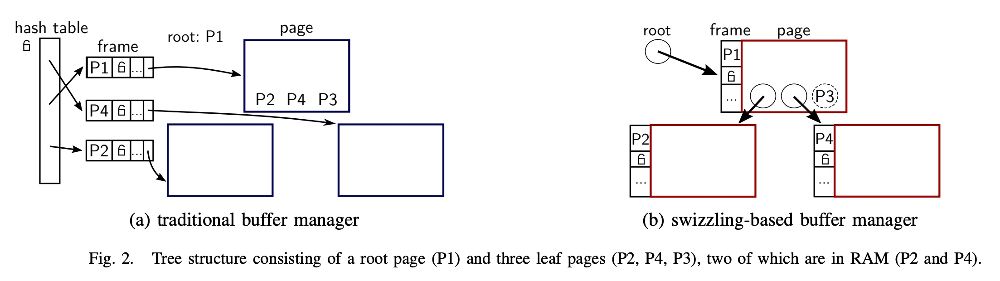
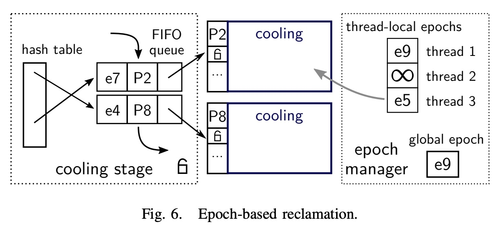
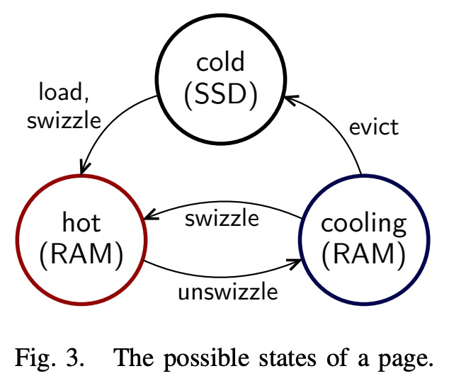
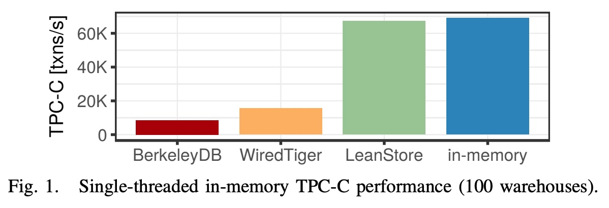
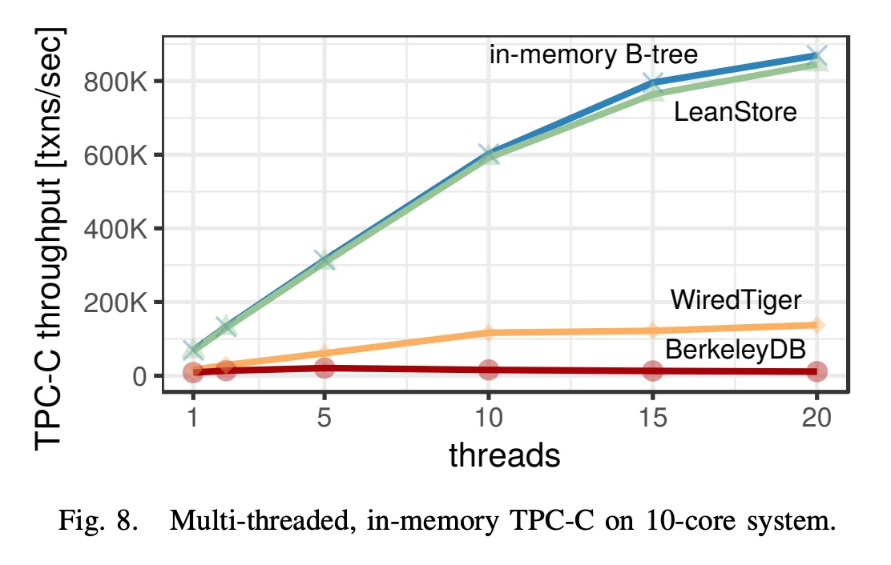
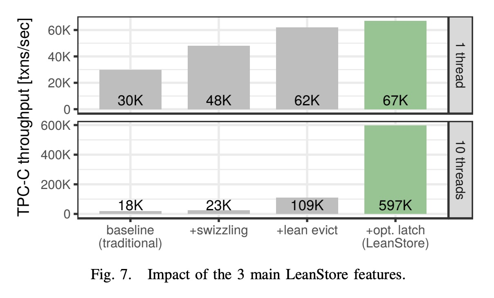
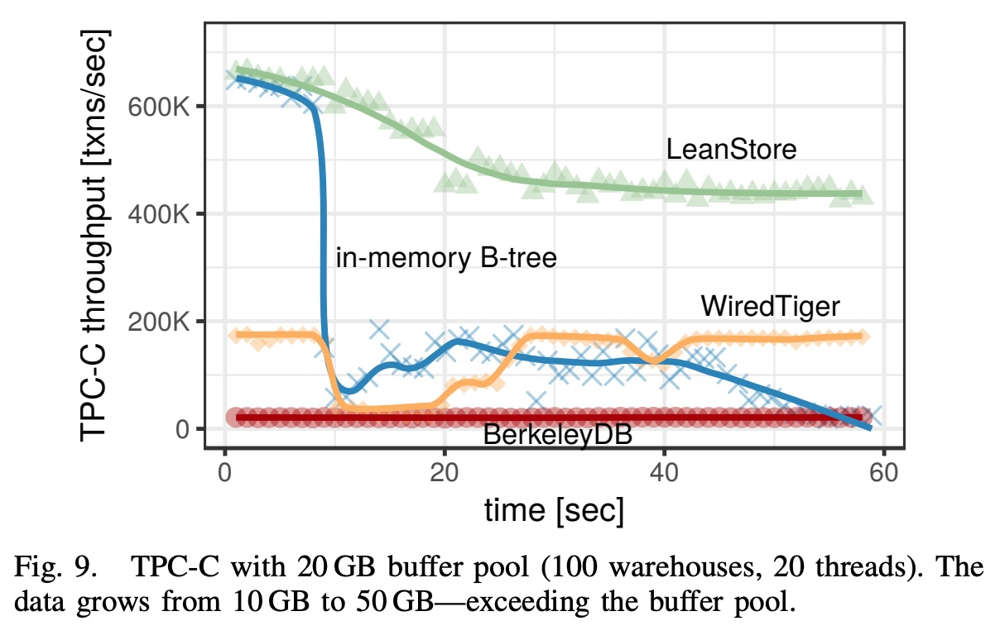

## AI论文解读 | LeanStore: In-Memory Data Management Beyond Main Memory
        
### 作者        
digoal        
        
### 日期        
2025-10-28        
        
### 标签        
PostgreSQL , PolarDB , DuckDB , AI , 论文解读        
        
----        
        
## 背景  
      
https://db.in.tum.de/~leis/papers/leanstore.pdf        
  
提示:          
```          
读懂《LeanStore: In-Memory Data Management Beyond Main Memory》这篇论文需要提前掌握哪些基础知识, 请使用中文通熟易懂的讲解这些基础知识, 可以引用论文中的图、表或使用Markdown支持的图形(text,mermaid等)增加解释性. 
  
使用中文通熟易懂的解读《LeanStore: In-Memory Data Management Beyond Main Memory》这篇论文, 其中的关键内容请着重讲解, 可以引用论文中的图、表或使用Markdown支持的图形(text,mermaid等)增加解释性. 
  
提取《LeanStore: In-Memory Data Management Beyond Main Memory》这篇论文中的重要术语, 使用中文对这些术语进行通熟易懂的讲解, 可以引用论文中的图、表或使用Markdown支持的图形(text,mermaid等)增加解释性. 
```     
  
## 1 前置知识 
  
要读懂《LeanStore》这篇论文，你需要对数据库系统的内部工作原理，特别是“存储引擎”和“内存管理”有比较扎实的理解。这篇论文的核心是设计一个*既有内存数据库的速度，又能管理比内存更大的数据集*的新型存储管理器 。

以下是理解这篇论文所需的关键基础知识，我会用通俗的语言为你讲解：

### 1\. 核心概念：缓冲区管理器 (Buffer Manager)

这是理解整篇论文的**最重要**的前提。

  * **它是什么？**
    数据库系统（尤其是基于磁盘的系统）的核心组件之一 。你可以把它想象成一个图书馆的“前台借阅处”。

  * **它做什么？**

      * **数据在磁盘上**：数据库的“全集”存储在缓慢但便宜的磁盘 (SSD/HDD) 上 。
      * **数据在内存中**：一块高速但昂贵的内存 (RAM) 被开辟为“缓冲区” (Buffer Pool) 。
      * **管理“借阅”** ：当 CPU 需要读取某条数据（比如，用户ID为100的订单）时，它不会直接去“仓库”（磁盘），而是问“前台”（缓冲区管理器）：
        1.  “请给我第5号数据页 (Page)”。
        2.  缓冲区管理器查看它的登记表（一个哈希表），看第5页是否已经在缓冲区了。
        3.  **在 (Cache Hit)**：直接把在内存中的地址（指针）告诉 CPU 。
        4.  **不在 (Cache Miss)**：去磁盘把第5页加载到缓冲区的一个空闲“帧” (Frame) 里，然后把内存地址给 CPU 。

  * **论文中的痛点：**
    这种传统方法（如论文图2a所示）对于在内存中的数据，每次访问**仍然**需要查询哈希表和使用“锁存器”(Latch) 来保证线程安全 。这在多核CPU上会产生巨大开销，导致性能远不如纯内存数据库 。    

    > **论文图2 (a) 传统缓冲区管理器**
    > 它展示了 CPU（通过 `root: P1`）要访问 P2、P4、P3。它必须通过一个“hash table”来查找 P1、P2、P4 在内存中“frame”的实际地址。这个查找就是开销来源 。

    你可以用下面的流程图理解这个传统方式：

    ```mermaid
    graph TD
        A[CPU 请求 Page_ID 5] --> B(缓冲区管理器);
        B --> C{在Hash表中查找 Page_ID 5};
        C -- "找到了 (Hit)" --> D[返回内存地址];
        C -- "没找到 (Miss)" --> E[从磁盘加载 Page 5];
        E --> F[放入缓冲区空闲 Frame];
        F --> G[更新 Hash 表];
        G --> D;
        D --> A;
    ```

### 2\. 关键技术：指针调配 (Pointer Swizzling)

这是 LeanStore 的**核心解决方案**。

  * **它是什么？**
    一种“偷懒”的优化技术，在面向对象数据库中很常见 。

  * **它做什么？**
    它利用了指针（内存地址）和页ID（磁盘地址）的格式差异。一个 8 字节的引用（论文称之为 `swip` ）:

      * **当页在内存中（热数据）** ：它就直接存储该页的**内存指针** (Pointer) 。
      * **当页在磁盘上（冷数据）** ：它就存储该页的**页ID** (Page Identifier) 。

  * **如何区分？**
    论文中提到，使用 8 字节引用中的“一位” (one bit) 作为标志位 (tagging) 来区分这是个指针还是页ID 。

  * **带来的好处：**
    当访问一个在内存中的页时，系统只需检查一下这个标志位（一个 `if` 语句），然后直接使用这个指针 。这**完全跳过**了传统缓冲区管理器的“哈希表查找”和“锁存器”开销 。

    > **论文图2 (b) 基于 Swizzling 的缓冲区管理器**
    > 你可以看到 `root` 直接指向 P1 的内存地址（实线箭头）。P1 又直接指向 P2 和 P4 的内存地址。但 P3 不在内存，所以 P1 存储的是 P3 的“页ID”（圆圈里的 P3）。

### 3\. 数据结构：B+ 树 (B+ Tree)

  * **它是什么？**
    数据库中最常用的索引结构，几乎所有的关系型数据库都在用它。
  * **它长什么样？**
    一个多分叉的树。
      * **根节点 (Root)**：树的起点。
      * **内部节点 (Inner Node)**：像“路标”，告诉你数据（或下一层节点）在哪个方向。
      * **叶子节点 (Leaf Node)**：存储实际的数据（或指向数据的指针）。
  * **为什么需要懂？**
    论文中的“页” (Page) 就是 B+ 树的“节点”。“指针调配” (Swizzling) 操作的就是从一个B+树节点（父节点）指向另一个B+树节点（子节点）的引用 。
      * 理解了 B+ 树的层级结构，你才能明白论文中提到的“父节点必须在子节点之后被换出（unswizzle）”这条规则 。

### 4\. 并发控制：锁存器 (Latch) vs 乐观锁 (Optimistic)

  * **锁存器 (Latch) 是什么？**
    一种轻量级的“锁” (Lock)。在数据库内部，当一个线程要修改一个内存页（比如 B+ 树节点）时，它会先“锁存”这个页，防止其他线程同时修改，改完再释放 。
  * **传统方式的痛点：**
    在多核 CPU 上，如果很多线程都想访问同一个“热门”数据页（比如 B+ 树的根节点），它们就会为这个 Latch 争得头破血流，导致性能急剧下降 。
  * **LeanStore 的方案 (乐观锁)：**
    LeanStore 使用了“乐观锁存器” (Optimistic Latches) 。
      * **读者 (Reader)**：根本**不加锁**！它们直接读取页面，但会记住这个页面的“版本号” 。读完后检查一下版本号，如果没变，就说明读取有效。
      * **写者 (Writer)**：修改页面时，会将版本号+1 。
      * 这使得“读”操作几乎没有开销，在多核上扩展性极好 。

### 5\. 垃圾回收：基于纪元 (Epoch-Based) 的回收

  * **前提问题：**
    在“乐观锁”下，当一个线程（写者）想删除或换出一个页时，它怎么知道没有其他线程（读者）正在读这个页呢？

  * **解决方案 (Epoch)：**

      * 系统维护一个全局的“纪元” (Global Epoch)，比如 e9，它会定期增长 。
      * 每个线程（读者）开始工作时，声明自己进入当前纪元（比如线程1进入 e9，线程3还在 e5）。
      * 当一个页被“换出”（unswizzle）时，系统记录下它被换出时的纪元（比如 P8 在 e4 被换出，P2 在 e7 被换出）。
      * **回收规则**：一个页（比如 P8）只有在“所有线程的纪元”都晚于“它被换出的纪元”时（比如所有线程都进入了 e5 或更高），才能被安全地真正释放 。
      * 这确保了“老读者”（如线程3）总能完成它的工作，不会读到被释放的内存。

    > **论文图6 (Fig. 6)**  
    > 此图清晰地展示了这个机制。P8 在 e4 被换出，P2 在 e7 被换出 。当前所有线程的“最小纪元”是 e5（来自线程3）。因为 e5 \> e4，所以 P8 可以被安全回收。但因为 e5 \< e7，P2 必须等待，直到线程3也进入 e7 或之后的纪元 。

      

### 6\. 页面替换：Lean Evict vs LRU

  * **LRU (Least Recently Used)：** 传统缓冲区管理器最常用的算法。它需要维护一个链表，**每次**访问页面都要更新这个链表，开销很大 。

  * **LeanStore 的方案 (Lean Evict)：**
    它反其道而行之：不去记录“最常用”的，而是去识别“不常用”的 。

      * **Hot (热)**：在内存中，被指针直接引用（swizzled）。
      * **Cooling (冷却中)**：当内存紧张时，系统**随机**挑一个“热”页，把它“unswizzle”（引用变回页ID），并放入一个“冷却”队列 (FIFO) 。注意，此时页**还在内存里** 。
      * **Cold (冷)**：在磁盘上 。

  * **生命周期（见论文图3）：**    

    1.  **Hot -\> Cooling**：被随机选中，推测它可能不常用 。
    2.  **Cooling -\> Hot**：如果在“冷却”期间又被访问了，说明它其实是热数据，立即把它“swizzle”回热状态，移出队列 。
    3.  **Cooling -\> Cold**：如果在冷却队列里待了很久（比如排到了队尾），都没人访问它，那它就真的“凉了”，被正式从内存中“驱逐” (evict) 到磁盘 。

    > **论文图3 (Fig. 3)**
    > 这个状态机完美地总结了这个替换策略。它只在“冷却”和“驱逐”时才产生开销，而在访问“热”数据时（绝大多数情况）零开销 。

-----

### 总结

你需要提前掌握的基础知识：

1.  **数据库存储基础**：理解什么是缓冲区 (Buffer Pool)、页 (Page)、帧 (Frame) 。
2.  **传统缓冲区管理**：知道它如何使用哈希表来映射 PageID 和内存指针，以及 LRU 替换算法 。
3.  **B+ 树**：了解其层级结构（根、内部、叶子节点）。
4.  **并发控制**：知道什么是 Latch（锁存器），以及它在多核上的争用问题 。
5.  **内存管理**：了解“垃圾回收”的基本概念，即为什么不能立即释放一个可能正在被读取的内存 。
6.  **硬件知识**：知道多核 CPU、SSD 和 NUMA（非一致性内存访问） 对性能意味着什么。

掌握了这些，你就能明白 LeanStore 是如何通过**指针调配 (Pointer Swizzling)** 、**乐观锁 (Optimistic Latches)**  和 **“冷却”替换策略 (Lean Evict)**  来解决传统数据库的性能瓶颈的。

希望这份讲解能帮助你读懂这篇出色的论文！你希望我为你详细讲解 LeanStore 的某个特定机制，比如它的 Epoch-Based Reclamation（纪元回收）吗？
  
## 2 解读论文 
  
好的，这是一篇非常出色的数据库系统论文。我来为你详细解读《LeanStore》的核心思想和关键技术。

简单来说，这篇论文解决了一个数据库领域长期存在的“鱼与熊掌”的难题：

1.  **传统磁盘数据库**（如 BerkeleyDB）：它们使用“缓冲区管理器”(Buffer Manager) 来管理比内存大得多的数据 。但这种管理方式很“重”，即使数据已经全在内存里了，访问它还是有不小的开销 。
2.  **纯内存数据库**（如 H-Store）：它们为了追求极致速度，彻底抛弃了缓冲区管理器 。数据直接用内存指针访问，非常快 。但它们的“阿喀琉斯之踵”是：一旦数据量超过内存，系统就寸步难行 。

**LeanStore 的目标**：设计一个新型存储引擎，它在数据**完全位于内存时**，能跑得和“纯内存数据库”一样快 ；同时，当数据**超出内存时**，它又能像“传统数据库”一样，透明地管理和访问存储在 SSD 上的海量数据 。

-----

### 核心痛点：传统缓冲区管理器的“三重开销”

为了理解 LeanStore 的“Lean”（精益）体现在哪里，我们必须先知道传统方法“胖”在哪里。

> **论文图 2(a) 传统缓冲区管理器**
> 这张图展示了传统方式。当你想访问一个数据页（比如 P1）时，你不能直接访问。你必须先通过一个全局的“**哈希表**”(hash table) ，用 "P1" 这个逻辑ID去查找它在内存中的实际地址（即 "frame"） 。

  

这个简单的动作在高性能场景下会产生三大开销：

1.  **哈希表查找开销**：每次访问页，都要查一次哈希表 。
2.  **锁存器（Latch）开销**：这个哈希表是全局共享的，多核 CPU 上的多线程访问时，必须用“锁存器”（一种轻量级锁）来保护它，这在多核环境下会造成严重的**扩展性瓶颈** 。
3.  **替换策略开销**：为了决定哪些“冷”数据页应该被T出内存（比如 LRU 算法），缓冲区管理器需要**在每次访问时**更新页面元数据（比如调整链表），这又是一笔开销。

-----

### LeanStore 的三大核心技术

LeanStore 通过三个精妙的设计，完美地解决了上述三个开销。

#### 1\. 关键技术一：指针调配 (Pointer Swizzling)

这是 LeanStore 的**核心**，它彻底消除了“哈希表查找开销”。

  * **什么是 Swizzling？**
    LeanStore 重新定义了“指针”。一个8字节的引用（论文称之为 `swip` ）可以有两种状态，通过其中一个“标志位”(tag bit) 来区分 ：

    1.  **Swizzled (已调配)**：如果该页**在内存中**，这个 `swip` 就**直接存储该页的内存地址**（即一个 C++ 指针）。
    2.  **Unswizzled (未调配)**：如果该页**在磁盘上**，这个 `swip` 就存储该页的**逻辑ID**（Page ID）。

  * **效果如何？**
    请看**论文图 2(b)**。当访问一个在内存中的页（如 P1, P2, P4）时，系统只需检查一下标志位，发现它是个指针，然后**直接**解引用该指针，一步到位 。     

      * **没有哈希表查找！** 
      * **没有全局锁！** 
      * 访问一个已在内存的页，其开销从“一次哈希表查找 + 锁操作”降低到“**一次 if 条件判断**” 。

    

    ```mermaid
    graph TD
        subgraph "传统方式 (图 2a)"
            A(请求 P1) --> B{查 Hash 表};
            B --> C(获取 Frame 地址);
            C --> D(访问 Page P1);
        end

        subgraph "LeanStore (图 2b)"
            X(请求 P1 的 swip) --> Y{"if (swip 是指针?)"};
            Y -- 是 --> Z(直接访问 Page P1);
            Y -- 否 --> FAULT(页面不在内存);
        end
    ```

#### 2\. 关键技术二：精益替换策略 (Lean Evict)

这解决了“替换策略开销”。LeanStore 认为，在内存大到足以容纳绝大多数“热”数据的今天，我们不应该为“保留”热数据而付出代价，而应该只为“识别”冷数据付出代价 。

为此，它设计了一个 "Hot/Cooling/Cold" 三状态生命周期：

  

> **论文图 3：页的生命周期**  
>  
> * **Hot (热)**：在内存中，且被指针引用 (Swizzled) 。  
> * **Cooling (冷却中)**：在内存中，但引用已被“推测性地”解除 (Unswizzled) 。  
> * **Cold (冷)**：在 SSD 上 。  

这个策略的精髓在于从 `Hot` 到 `Cooling` 的转变：

1.  **推测性 Unswizzle**：当内存不足时，LeanStore **随机**挑选一个 `Hot` 页面 ，把它“Unswizzle”（引用变回 Page ID），并放入一个“冷却区” (Cooling Stage) 的 FIFO 队列中 。**注意：此时页面还在内存里！** 
2.  **第二次机会**：
      * 如果这个页面**确实是热数据**，它很快会被再次访问。访问时会触发一次缺页（因为 `swip` 已经是 Page ID 了），系统检查“冷却区”，发现它还在内存，于是立刻把它重新 Swizzle 成 `Hot` 状态，并移出队列 。**没有发生任何 I/O**。
      * 如果这个页面**真的是冷数据**，它会在“冷却区”队列中一直待到队尾，期间无人问津。最后，它被正式从内存中驱逐 (Evict) 到 SSD，进入 `Cold` 状态 。
3.  **优势**：访问 `Hot` 页面（占绝大多数） **没有任何替换策略开销** 。所有开销都只发生在“冷路径”上（即缺页和驱逐时），而这部分开销（如锁住冷却区）和缓慢的 I/O 相比微不足道 。

#### 3\. 关键技术三：可扩展同步 (Scalable Synchronization)

这解决了“锁存器开销”，确保了 LeanStore 在多核 CPU 上的高性能。

  * **传统方式**：使用“页锁存器”(Page Latch) 来“钉住”(Pin) 页面，防止它在你读写时被驱逐 。这意味着每次访问都要获取和释放锁，开销巨大 。

  * **LeanStore 的方案**：

    1.  **乐观锁存器 (Optimistic Latches)**：它用一个“版本号”来代替锁 。
          * **读取者**：**不加任何锁！** 。它只管读取数据，并记住页面的版本号。读完后再检查一次版本号，如果没变，说明读取有效 。
          * **写入者**：正常加锁，并在修改后增加版本号 。
          * **效果**：读取操作（如 B+ 树遍历）完全无锁，速度极快 。
    2.  **基于纪元 (Epoch) 的回收**：解决了“读取者正在读，写入者把页面删了”这一难题。
          * **问题**：读取者不加锁，那它正在读的页面（比如 P8）万一被“冷却”并“驱逐”了怎么办？
          * **答案（见论文图 6）** ：    
              * 系统有一个全局的“纪元” (Global Epoch)，比如 e9 。
              * 每个线程开始工作时，声明自己进入当前纪元（如 线程1 在 e9，线程3 还在 e5）。
              * 当一个页面（如 P8）被 Unswizzle 放入冷却区时，记录下当时的纪元（P8 是在 e4 被放入的）。
              * **回收规则**：一个页面（P8）只有在**所有**活跃线程的纪元都晚于它的“出生纪元”（e4）时，才能被安全驱逐 。
              * **图 6 示例**：P8 (e4) 可以被驱逐，因为最老的线程（线程3）也在 e5，e5 \> e4 。但 P2 (e7) 不能被驱逐，因为线程3 还在 e5，e5 \< e7，系统必须假设线程3可能还在访问 P2 。
          * **效果**：这套机制完全取代了传统的“Pin/Unpin”计数器，避免了每次访问都去修改共享的计数器 。

-----

### 实验结果：用数据说话

LeanStore 的设计取得了惊人的效果：

  * **图 1 / 图 8 (内存性能)**：      
    在数据全在内存的 TPC-C 测试中，LeanStore 的性能 (67K txns/s)  几乎等同于纯内存 B-Tree (69K txns/s) ，并且随着线程数增加，两者的扩展性曲线几乎完美重合 。而传统缓冲区管理器 BerkeleyDB 和 WiredTiger 则被远远甩开 。

  * **图 7 (关键特性对比)**：    
    这张图揭示了为什么 LeanStore 这么快。在10核测试中：

      * `baseline (traditional)`：18K 事务/秒 。
      * `+ swizzling` (加入指针调配)：23K 事务/秒 。
      * `+ lean evict` (加入精益替换)：109K 事务/秒 。
      * `+ opt. latch` (最终的 LeanStore)：**597K 事务/秒** 。
      * **结论**：**可扩展的同步机制（乐观锁）** 是多核性能的决定性因素，而另两个特性是其基础 。

  * **图 9 (超内存性能)**：    
    这是最关键的实验。当数据量（10GB增长到50GB）远超内存（20GB）时 ：

      * **LeanStore**：性能平稳、优雅地下降，但仍保持在极高水平（约 400K+ txns/s）。这证明了其替换策略非常有效地将“热”工作集保留在了内存中 。
      * **In-memory B-tree**：在操作系统开始“交换”(Swapping) 内存后，性能瞬间崩溃，且极不稳定 。这证明了“依赖操作系统Swap”是完全不可行的方案 。

### 总结

LeanStore 是一款革命性的存储引擎。它通过**指针调配 (Pointer Swizzling)**、**精益替换策略 (Lean Evict)** 和 **乐观同步 (Optimistic Latch + Epochs)** 三大技术，成功地集成了纯内存数据库的**极致速度**与传统数据库的**海量数据管理能力**，为现代硬件（大内存、快SSD、多核CPU）提供了一个近乎完美的设计范本。
  
## 3 术语 
  
好的，这篇论文《LeanStore》提出了一个非常精巧的存储引擎设计，为了完全理解它，你需要掌握以下几个关键术语。

我会用通俗的语言为你讲解，并引用论文中的图示来帮助理解。

-----

### 1\. 缓冲区管理器 (Buffer Manager)

  * **通俗讲解：**
    你可以把它想象成一个图书馆的“借阅管理系统”。数据库的全部数据（所有的书）都存放在缓慢的磁盘（书库）上 。内存（RAM）就像是图书馆的“阅览室”，速度快但空间有限 。
    缓冲区管理器的职责就是决定：

    1.  当一个线程（读者）要读数据（书）时，这本书是否已经在阅览室里了？
    2.  如果不在，就去书库把它取来，放到阅览室的某个位置（称为 "Frame"）。
    3.  如果阅览室满了，必须把一本“最不常读”的书送回书库，以腾出位置。

  * **论文中的痛点：**
    传统的设计（如**论文图 2(a)** 所示），每次读者找书（哪怕书已在阅览室），都必须去“总服务台”（一个哈希表）查询这本书在哪个座位上 。在多核CPU（很多读者）同时访问时，这个总服务台就成了瓶颈，导致大家排队，性能很差 。    

    > **论文图 2 (a) 传统缓冲区管理器**

    > 每次访问都需要通过 `hash table` 查找，这是主要的开销来源 。

### 2\. 指针调配 (Pointer Swizzling)

  * **通俗讲解：**
    这是 LeanStore 的**核心魔法**，用来消除上述“总服务台”的开销 。
    它重新定义了数据页之间的“引用”方式。一个引用（论文中称为 `swip` ）有两种形态：

    1.  **Unswizzled (未调配)：** 当它指向的页面在磁盘（书库）时，这个引用里存的是“书号”（Page ID）。
    2.  **Swizzled (已调配)：** 当它指向的页面被读入内存（阅览室）时，这个引用**立刻被修改**，直接存储该页面在内存中的“座位号”（一个直接的内存指针）。

  * **带来的好处：**
    如**论文图 2(b)** 所示，当数据在内存中时，访问下一页不再需要查哈希表，而是像“超链接”一样直接跳转 。从“查表”变成了“一次 `if` 判断（判断是书号还是座位号？）”。

    > **论文图 2 (b) 基于 Swizzling 的缓冲区管理器**

    > `root` 直接通过指针（实线箭头）指向 P1，P1 也直接指向 P2 和 P4 。只有当访问 P3 时，才发现它是一个 Page ID（虚线圆圈），需要去加载 。

### 3\. 页面三态：Hot / Cooling / Cold (热 / 冷却 / 冷)

  * **通俗讲解：**
    这是 LeanStore 精益（Lean）的页面替换策略，用来决定什么时候把书（页面）踢出阅览室（内存）。

    ```mermaid
    graph TD
        Cold["Cold (冷)<br>在 SSD 上"]
        Hot["Hot (热)<br>在 RAM 中, Swizzled"]
        Cooling["Cooling (冷却)<br>在 RAM 中, Unswizzled"]

        Cold -- "1\. 加载 (load) " --> Hot
        Hot -- "2\. 推测性 unswizzle " --> Cooling
        Cooling -- "3\. 被再次访问 (swizzle) " --> Hot
        Cooling -- "4\. 被驱逐 (evict) " --> Cold
    ```

    1.  **Hot (热)**：页面在内存中，并且被指针（Swizzled）引用。这是最理想状态，访问极快 。
    2.  **Cooling (冷却中)**：当内存紧张时，系统**随机**挑一个 `Hot` 页面，**推测**它可能不常用了 。系统将其引用“Unswizzle”（改回 Page ID），并放入一个叫“冷却阶段”的队列 。**注意：此时页面还在内存里！** 
    3.  **Cold (冷)**：页面在磁盘上 。

  * **这个设计的精髓 (第二次机会)：**

      * 如果一个页面在 `Cooling` 状态下被再次访问（说明推测错了，它其实是热数据），系统会立刻把它重新 `Swizzle` 成 `Hot` 状态，避免了 I/O 。
      * 如果它在 `Cooling` 队列里待了很久都没人访问（推测对了），它就会被驱逐 (evict) 到磁盘，变为 `Cold` 状态 。

### 4\. 锁存器 (Latch)

  * **通俗讲解：**
    一种轻量级的“锁”。在多线程（多个读者）环境下，当一个线程要修改某个数据页（比如往 B-Tree 节点里插入数据）时，它必须先“锁存”这个页面，防止其他线程同时修改导致数据错乱 。
  * **论文中的痛点：**
    传统数据库在*每次*访问页面时都需要获取锁存器（称为 "Pinning"），以防止页面被驱逐 。这种频繁的加锁和释放锁操作，在多核 CPU 上会产生巨大的同步开销和竞争 。

### 5\. 乐观锁存器 (Optimistic Latch)

  * **通俗讲解：**
    LeanStore 用来解决上述 Latch 瓶颈的武器 。它的核心思想是“乐观”——假设冲突很少发生。
    它使用一个“版本号” (Version Counter) 来代替锁 ：
      * **读取者 (Reader)：** **不加锁！**  它直接读取页面，并记住读取开始时的“版本号”。读完后，它检查一下版本号，如果没变，说明读取有效。如果变了（说明有写入者中途修改了），读取者就*重试*一次操作 。
      * **写入者 (Writer)：** 正常加锁，修改数据，然后将“版本号”加 1 。
  * **带来的好处：**
    在读多写少的场景下，所有读取者都可以“无锁”并发执行，极大地提高了多核 CPU 的扩展性 。

### 6\. 基于纪元的回收 (Epoch-Based Reclamation)

  * **通俗讲解：**
    这是“乐观锁”的配套机制。它解决了一个棘手的问题：当读取者（Reader）不加锁时，系统怎么知道这个读取者是不是“正在读”一个页面？如果不知道，系统可能会把一个“正在被读”的页面给删了或驱逐了，导致程序崩溃 。
  * **工作原理（见论文图 6）：**    
      * 系统有一个全局的“时钟”，称为**全局纪元 (Global Epoch)**，比如 `e9` 。
      * 每个线程（读取者）开始工作时，必须先登记自己“入场”的纪元，称为**本地纪元 (Local Epoch)**（比如 线程1 在 `e9`，线程3 还在 `e5`）。
      * 当一个页面被“Unswizzle”或删除时，它被盖上一个“时间戳”，即当时的全局纪元（比如 P8 是在 `e4` 被放入冷却区的，P2 是在 `e7`）。
      * **回收规则：** 只有当**所有线程的本地纪元**都**大于**某个页面的时间戳时，系统才能安全地驱逐或重用该页面 。
  * **图 6 示例 ：**
      * 当前所有线程的“最老”纪元是 `e5`（来自线程3）。
      * P8 (时间戳 `e4`) **可以**被安全驱逐，因为 `e5 > e4`，说明所有可能在 `e4` 读过 P8 的线程都“下班”了 。
      * P2 (时间戳 `e7`) **不可以**被驱逐，因为 `e5 < e7`，系统必须假设线程3（它在 `e5` 就入场了）可能还在访问 P2 。
  
## 参考        
         
https://db.in.tum.de/~leis/papers/leanstore.pdf    
        
<b> 以上内容基于DeepSeek、Qwen、Gemini及诸多AI生成, 轻微人工调整, 感谢杭州深度求索人工智能、阿里云、Google等公司. </b>        
        
<b> AI 生成的内容请自行辨别正确性, 当然也多了些许踩坑的乐趣, 毕竟冒险是每个男人的天性.  </b>        
  
    
#### [期望 PostgreSQL|开源PolarDB 增加什么功能?](https://github.com/digoal/blog/issues/76 "269ac3d1c492e938c0191101c7238216")
  
  
#### [PolarDB 开源数据库](https://openpolardb.com/home "57258f76c37864c6e6d23383d05714ea")
  
  
#### [PolarDB 学习图谱](https://www.aliyun.com/database/openpolardb/activity "8642f60e04ed0c814bf9cb9677976bd4")
  
  
#### [PostgreSQL 解决方案集合](../201706/20170601_02.md "40cff096e9ed7122c512b35d8561d9c8")
  
  
#### [德哥 / digoal's Github - 公益是一辈子的事.](https://github.com/digoal/blog/blob/master/README.md "22709685feb7cab07d30f30387f0a9ae")
  
  
#### [About 德哥](https://github.com/digoal/blog/blob/master/me/readme.md "a37735981e7704886ffd590565582dd0")
  
  

  
