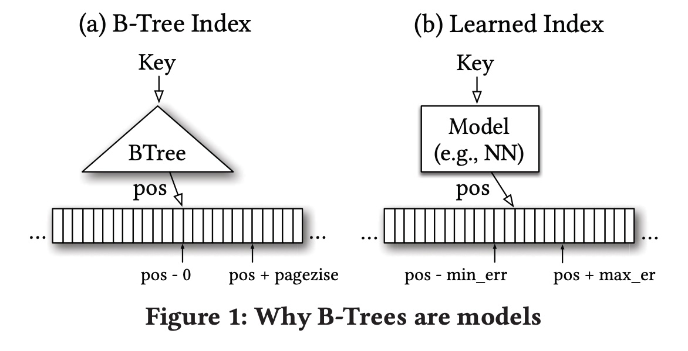
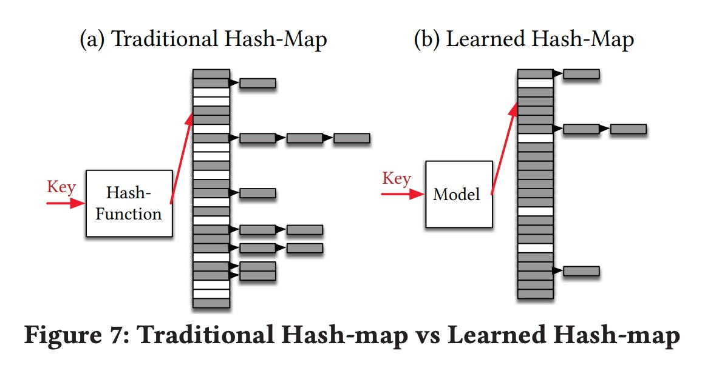
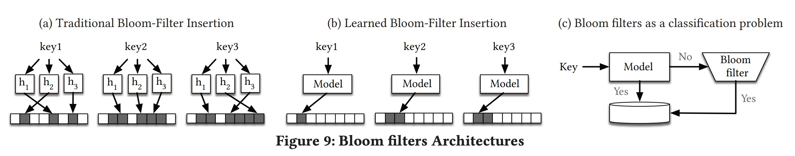
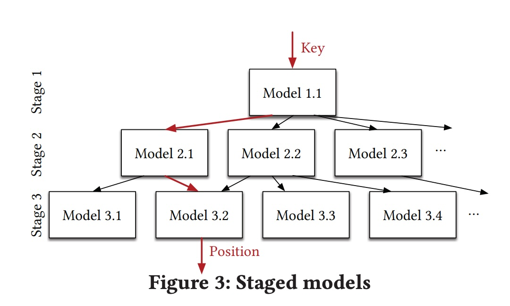
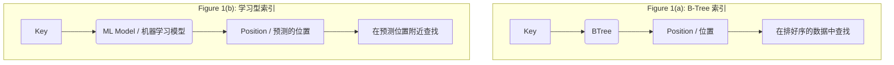
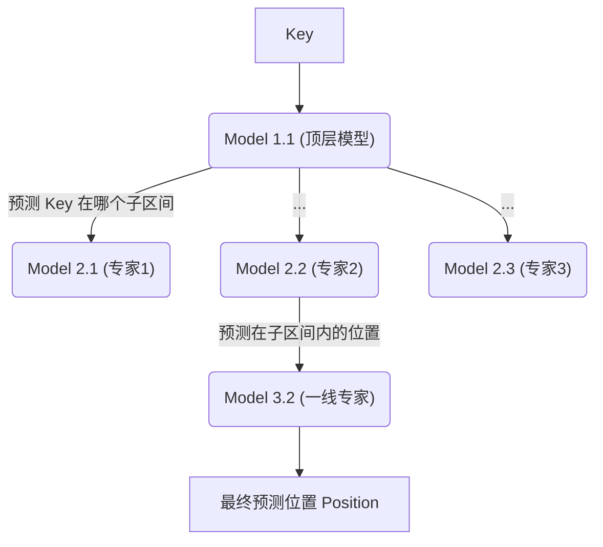
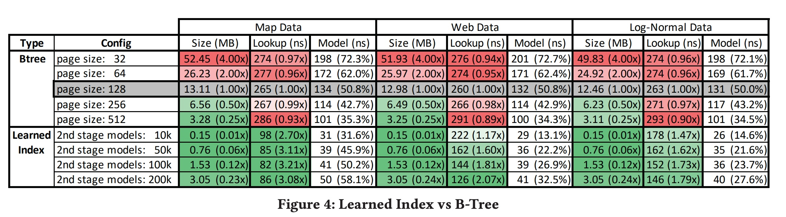
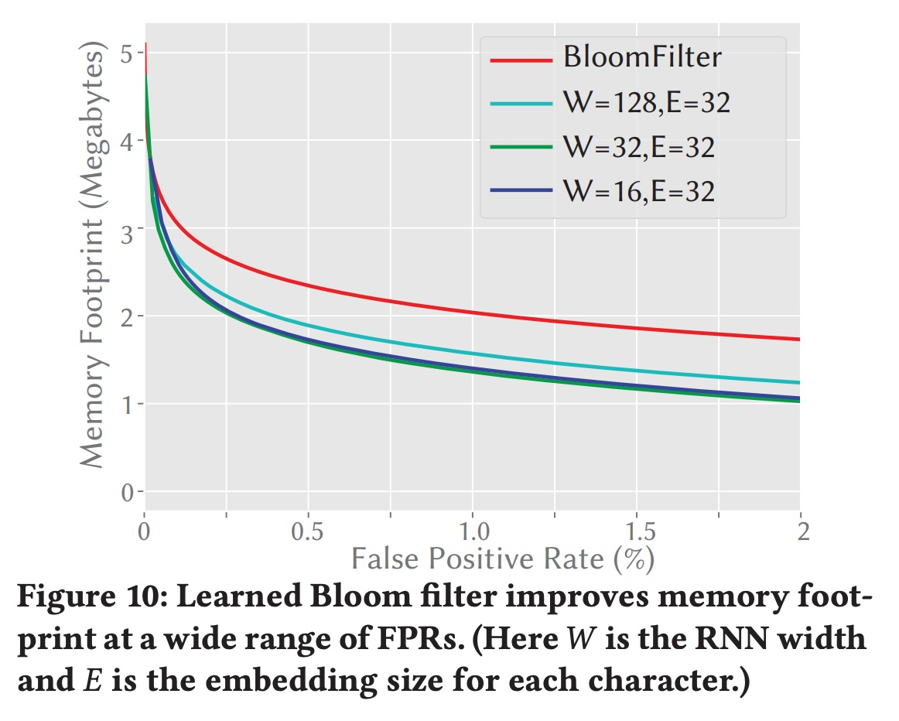
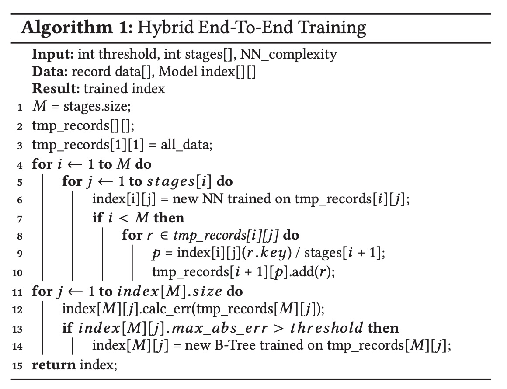

## AI论文解读 | The Case for Learned Index Structures
        
### 作者        
digoal        
        
### 日期        
2025-10-28        
        
### 标签        
PostgreSQL , PolarDB , DuckDB , AI , 论文解读        
        
----        
        
## 背景  
      
https://dl.acm.org/doi/pdf/10.1145/3183713.3196909        
  
提示:          
```          
读懂《The Case for Learned Index Structures》这篇论文需要提前掌握哪些基础知识, 请使用中文通熟易懂的讲解这些基础知识, 可以引用论文中的图、表或使用Markdown支持的图形(text,mermaid等)增加解释性. 
  
使用中文通熟易懂的解读《The Case for Learned Index Structures》这篇论文, 其中的关键内容请着重讲解, 可以引用论文中的图、表或使用Markdown支持的图形(text,mermaid等)增加解释性. 
  
提取《The Case for Learned Index Structures》这篇论文中的重要术语, 使用中文对这些术语进行通熟易懂的讲解, 可以引用论文中的图、表或使用Markdown支持的图形(text,mermaid等)增加解释性. 
```     
  
## 1 前置知识 
  
要读懂《The Case for Learned Index Structures》这篇论文, 你需要提前掌握三大块基础知识：

1.  **经典数据结构：** 了解这篇论文试图 *取代* 的是什么。
2.  **机器学习基础：** 了解这篇论文用来 *取代* 它们的工具是什么。
3.  **核心桥梁—数据分布：** 了解这篇论文的 *“灵感来源”*。

下面我们用通俗的语言, 结合论文中的图示来逐一讲解。

-----

### 📚 1. 经典数据结构 (数据库索引)

论文的出发点是, 现有的索引结构可以被看作是一种“模型” 。你首先要明白这些“模型”是什么。

#### 🌲 (A) B-Tree (B树)

  * **是什么？**
    这是最常见的数据库索引, 比如 MySQL 就在用。它是一种平衡树结构, 让你能高效地查找数据。

  * **解决什么问题？**
    快速的 **范围查询** (Range Queries) 。比如, “找出上周所有的订单” (一个时间范围)。

  * **怎么工作？**
    想象一个巨大的“电话本” (数据是排好序的) 。你不会一页一页翻, 而是：

    1.  先看“目录”, 找到“张”姓在第500页。
    2.  再跳到第500页, 找到“张三”在第510页。
        B-Tree 就是这个“目录”, 它通过一层一层的节点, 不断缩小查找范围, 查找效率是 $O(\log n)$ 。

  * **论文的视角：**
    论文说, B-Tree 其实就是一个“模型” 。你给它一个“键” (Key, 比如“张三”), 它“预测” (predict) 出这个键在排好序的数据里的“位置” (Position) 。

    论文中的 **Figure 1(a)**  展示的就是这个过程：    

    ```mermaid
    graph TD
        A[Key] --> B(BTree 索引);
        B --> C[pos / 位置];
        C --> D["排好序的数据 (pos-0 ... pos+pagesize)"];
    ```

#### Hashing (哈希)

  * **是什么？**
    一种“搅拌机”算法 (哈希函数)。你给它任何东西 (比如一个字符串), 它都能输出一个“数字” (哈希值)。

  * **解决什么问题？**
    快速的 **单点查询** (Point Lookups) 。比如, “查询用户ID为‘alex’的个人信息”。

  * **怎么工作？(以哈希表/Hash Map为例)**

    1.  你有一个大数组 (像一排快递柜)。
    2.  当你要存“alex”的信息, 你用哈希函数算一下, `hash("alex") = 5`。
    3.  你就把“alex”的信息放进5号柜子。
    4.  下次找“alex”时, 再算一遍, `hash("alex") = 5`, 直接去5号柜子拿就行了。
        理想情况下, 这次操作是 $O(1)$ (常数时间) 。

  * **核心麻烦：**
    **冲突 (Collision)** 。如果 `hash("bob")` 也等于 5, 5号柜子就“撞车”了。**Figure 7(a)**  展示的就是传统哈希表如何用“链表” (Linked-list)  解决冲突。    

    ```mermaid
    graph TD
        subgraph 传统哈希表 ["Figure 7(a)"]
            K1[Key 'alex'] --> H(Hash-Function);
            K2[Key 'bob'] --> H(Hash-Function);
            H -- "hash('alex')=5" --> B[数组];
            H -- "hash('bob')=5" --> B;
            B -- '位置 5' --> C1(alex的数据);
            C1 --> C2(bob的数据);
        end
    ```

#### (C) Bloom Filter (布隆过滤器)

  * **是什么？**
    一个“超级节省空间”的集合, 用来判断一个东西 *“在不在这里？”* 。
  * **解决什么问题？**
    快速的 **存在性检查** (Existence Check) 。比如, “这个网址是不是恶意网址？”。
  * **怎么工作？**
    它是一个很长的“位数组” (全是0) 和几个不同的哈希函数 。
    1.  **添加时 (见 Figure 9(a) )：** 比如添加 `https://www.google.com/search?q=bad.com` 。3个哈希函数算出3个位置：2, 7, 10。     
    2.  把这3个位置的 0 变成 1。
    3.  **查询时：** 比如查 "good.com"。3个哈希函数算出：3, 7, 12。
    4.  你去检查这3个位置：位置3是0, 位置7是1, 位置12是0。
    5.  **结论：** 只要有任何一个是 0, 它就 **绝对不在** 集合里 。
  * **核心特性：**
    它可能会“误判” (False Positive) 。如果查 `https://www.google.com/search?q=maybe-bad.com`, 算出来是 2, 7, 10, 它会告诉你“在”, 但其实你没加过它。
  * **论文的视角：**
    论文说, 布隆过滤器就是一个 **“二元分类器” (Binary Classifier)** 。你给它一个键, 它“分类”为“存在” (Yes) 或“不存在” (No)。

-----

### 🧠 2. 机器学习 (ML) 基础

论文的核心论点是：既然传统索引是“模型”, 为什么我们不用更强大的**机器学习模型** (比如神经网络) 来替代它们呢？ 

你需要了解以下几个ML概念：

  * **模型 (Model)：**
    就是一个“函数”。你给它输入 (Input), 它给你输出 (Output)。

  * **训练 (Training)：**
    找到这个“函数”的最佳参数的过程。比如, 神经网络的“训练”, 就是通过看大量数据, 调整内部的“权重” (Weights)。

  * **回归 (Regression) vs 分类 (Classification)：**

      * **回归：** 预测一个 *连续的数值*。比如预测房价、预测股票。
          * **对应论文：** B-Tree 预测的是“位置” (Position) , 这是一个数值, 所以论文把它看作 **回归问题** 。
      * **分类：** 预测一个 *类别*。比如判断“是垃圾邮件”还是“不是”、“存在”还是“不存在”。
          * **对应论文：** Bloom Filter 判断“在”或“不在” , 所以论文把它看作 **分类问题** 。

  * **神经网络 (Neural Networks, NN)：**
    一种强大的模型, 擅长学习数据中的复杂模式 。论文中用它来学习数据分布 。

  * **递归模型 (Recursive Model Index, RMI)：**
    这是论文提出的 **核心架构** (见 **Figure 3** )。    

    ```mermaid
    graph TD
        K[Key] --> M1(Model 1.1 / 顶层模型);
        M1 -- '决定用哪个' --> M2_1(Model 2.1);
        M1 -- '专家' --> M2_2(Model 2.2);
        M1 -- '...' --> M2_3(Model 2.3);
        
        M2_2 -- '决定用哪个' --> M3_1(Model 3.2);
        M2_2 -- '更懂行的专家' --> M3_2(Model 3.3);
        
        M3_2 --> P[Position / 最终位置];
    ```

      * **通俗理解：**
        单个神经网络“一步到位”地预测位置太难了 (所谓的 "last mile" problem )。
      * RMI 采用了“分而治之”的思想 (类似“专家混合”, Mixture of Experts )：
          * **Stage 1 (顶层模型)：** 像个“总指挥”, 看了 Key 之后, 说：“这事儿归 Model 2.2 管, 它最懂这个区域。” 
          * **Stage 2 (第二层)：** Model 2.2 是个“区域经理”, 它看了 Key, 说：“哦, 这是 Model 3.3 的活儿, 它更懂。” 
          * **Final Stage (最后一层)：** Model 3.3 是个“一线专家”, 它直接预测出最终的位置 。
      * 这样, 每个模型只需要学习它负责的那一小部分数据, 难度大大降低 。

-----

### 💡 3. 核心桥梁：数据分布 (CDF)

这是理解这篇论文的 **“灵魂”** 。你必须明白什么是“累积分布函数”(Cumulative Distribution Function, CDF)。

  * **什么是 CDF？**
    CDF(x) = 数据集中“小于等于 x” 的数据所占的 *比例*。

  * **举个例子：**
    你有100条数据, 是 1, 2, 3, ..., 100。

      * CDF(10) = “小于等于10”的数据 (1到10, 共10个) / 总数 (100) = 10%
      * CDF(50) = 50%
      * CDF(100) = 100%

  * **论文的“Aha Moment” (灵感时刻)：**
    如果你要找的数据是 **排好序的** (B-Tree 的前提), 那么：

    一个 Key 在数组中的 **位置 (Position)** = **CDF(Key) \* 数据总数 (N)** 

      * **还用上面的例子：**
      * 你想找 Key = 10 的位置。
      * 你知道 CDF(10) = 10%。
      * 你知道数据总数 N = 100。
      * 预测位置 = 10% \* 100 = 10。
      * 这正是 Key=10 在数组 (0-99) 里的位置！

  * **结论：**
    **B-Tree 索引的本质, 就是在学习数据的 CDF！** 

      * **Figure 2**  完美展示了这一点：(Key, Position) 之间的关系曲线, 形状和 CDF 曲线一模一样。    
      * 传统 B-Tree 是用“树”这种笨拙的方式 (楼梯状) 去 *拟合* 这条 CDF 曲线 。
      * 论文说：为什么我们不直接用神经网络 (一种平滑的曲线) 去 *学习 (learn)* 这条 CDF 曲线呢？
      * 如果数据是有规律的 (比如 Key 是连续的时间戳 ), 神经网络就能用极小的空间 (几个权重参数) 完美地学到这个规律 (CDF) 。

-----

### 总结：你需要掌握的知识点

为了帮你梳理, 我把读懂论文所需的基础知识和论文的创新点总结成下表：

| 索引类型 | 传统数据结构 | 论文的视角 (看作什么) | 对应的 ML 问题 | 论文的核心创新 (RMI) |
| :--- | :--- | :--- | :--- | :--- |
| **范围索引** | B-Tree  | 映射 Key -\> Position  | **回归 (Regression)**  | **学习数据的 CDF**  |
| **点索引** | 哈希表  | 映射 Key -\> Position  | **回归 (Regression)** | **学习 CDF 来减少冲突**  |
| **存在索引** | 布隆过滤器  | 映射 Key -\> Yes/No  | **分类 (Classification)**  | 训练模型区分“存在”和“不存在”  |

**一句话总结：**

你需要先懂 **B-Tree、哈希表、布隆过滤器** (它们要解决的问题), 也要懂一点 **机器学习** (回归、分类、神经网络), 但最关键的是要理解 **CDF (累积分布函数)**, 因为它是连接“数据库索引”和“机器学习”的桥梁 。

掌握了这些, 你就能明白为什么作者会说“索引就是模型” (Indexes are models) , 以及为什么他们认为用 ML 来学习数据分布  是一种更高效的索引方式。

您想让我详细解释一下 RMI (递归模型索引) 的工作机制吗？
  
## 2 解读论文 
  
这是一篇开创性的论文, 它的核心思想一言以蔽之： **“索引就是模型” (Indexes are models)** 。

传统上, 我们认为索引 (如B-Tree) 是计算机科学中的经典“数据结构”。而这篇论文的作者们认为, 索引的本质工作是 **“预测”** ——给定一个键 (Key), 它“预测”出这个键对应的数据在内存或磁盘上的位置 (Position)。

既然索引是在做“预测”, 那么我们为什么不用“机器学习 (ML)”这个天生擅长预测的工具来彻底替换掉它呢？ 这就是“学习型索引” (Learned Index Structures) 的由来。

下面, 我们将通俗地解读这篇论文如何将这个“疯狂”的想法变为现实, 并逐一“替换”掉数据库中最核心的三种索引。

-----

### 🔑 关键内容一：用“学习”取代 B-Tree (范围索引)

这是论文的核心, 也是理解后续内容的基础。

#### 1\. 传统 B-Tree 的问题

B-Tree 是一种通用的数据结构 。它不知道你的数据长什么样, 无论你的数据是 1, 2, 3, 4... 这样简单, 还是完全随机的字符串, 它都一视同仁。

  * **论文的灵魂拷问：**
    如果你要索引 1 到 1 亿的连续整数, 你还会用 B-Tree 吗？
    当然不会！你只需要一个简单的公式 `Position = Key - 1` 就能在 $O(1)$ 时间内找到任何数据, 而 B-Tree 仍需要 $O(\log n)$ 的时间 。B-Tree 浪费了大量的空间和时间, 就因为它“无视”了数据的分布规律 。

#### 2\. B-Tree 与“模型”的联系

论文指出, B-Tree 本质上是一个“模型”, 它在学习数据的位置。**Figure 1** 直观地对比了两者：    



B-Tree  和 学习型索引 (Learned Index)  都是在做 Key -\> Position 的映射。

#### 3\. 核心洞察：索引 = 学习 CDF

如果数据是排好序的 (B-Tree 的前提), 那么“Key”和它“在数组中的位置 (Position)”之间是什么关系？

答案是：**累积分布函数 (Cumulative Distribution Function, CDF)** 。

  * **什么是 CDF？**
    `CDF(Key)` = 数据集中“小于等于 Key”的数据所占的**比例**。

  * **灵感时刻 (Aha\! Moment)：**
    在一个排好序的、拥有 N 个数据的数组中：

    $Position \approx CDF(Key) \times N$ 

    **(见 Figure 2)**  这条曲线（Key 和 Position 的关系）就是数据分布的 CDF。    

**结论：** 传统 B-Tree (一种回归树 ) 是在用“树”的结构来**近似**这条 CDF 曲线；而“学习型索引”则建议：我们不如直接用一个**神经网络 (NN)** 来**学习**这条 CDF 曲线 。

#### 4\. 解决“最后一英里”问题：RMI (递归模型索引)

一个简单的神经网络虽然能学到 CDF 的大致形状, 但在“最后一英里” (即精确定位) 上表现很差 。

为此, 论文提出了 **RMI (Recursive Model Index, 递归模型索引)** 架构, 灵感来自于“专家混合” (Mixture of Experts) 。

其结构如 **Figure 3** 所示, 这是一个“模型“套“模型”的层次结构：    



  * **工作流程：** 
    1.  顶层模型 (Stage 1) 看一下 Key, 并不直接预测最终位置, 而是“挑选”一个下一阶段的“专家模型”。
    2.  这个“专家模型” (Stage 2) 只负责它那一小段数据的 CDF, 它的预测更准。
    3.  最后一层模型 (Final Stage) 给出最终的位置预测 。

这个 RMI 结构完美地模仿了 B-Tree：B-Tree 的根节点和中间节点负责“导航”, 而 RMI 的顶层模型也在做“导航” 。

#### 5\. 实验结果：颠覆性的 (见 Figure 4)

论文用 RMI 和 B-Tree 在真实数据集上进行了对比 ：

| 数据集 | 索引类型 | 配置 | 索引大小 (MB) | 查找时间 (ns) |
| :--- | :--- | :--- | :--- | :--- |
| **Map Data** | B-Tree | page size: 128 | 13.11  | 265  |
| **Map Data** | **Learned** | 2nd stage: 100k | **1.53**  | **82**  |
| **Web Data** | B-Tree | page size: 128 | 12.98  | 260  |
| **Web Data** | **Learned** | 2nd stage: 200k | **3.05**  | **126**  |
| **Log-Normal** | B-Tree | page size: 128 | 12.46  | 263  |
| **Log-Normal** | **Learned** | 2nd stage: 200k | **3.05**  | **146**  |

  

*(数据来自论文 Figure 4，选取 B-Tree 最佳性能点 (page size 128) 和 Learned Index 的几个配置对比)*

**结论：** 学习型索引 (RMI) 在所有数据集上 **同时实现** 了：

1.  **更小的空间：** 体积缩小了 **一个数量级** (例如 13.11MB -\> 1.53MB) 。
2.  **更快的速度：** 查找速度提升了 **最高 3 倍** (例如 265ns -\> 82ns) 。

-----

### 🔑 关键内容二：用“学习”取代哈希 (点索引)

B-Tree 解决了, 哈希表 (Hash-Map) 怎么办？

#### 1\. 传统哈希的问题

哈希表的目标是 $O(1)$ 查找, 它的“灵魂”是哈希函数 。但传统哈希函数是“随机”的, 它们不可避免地导致 **“冲突” (Collisions)** 。解决冲突 (如“拉链法”, 见 Figure 7a) 会带来性能和空间的开销 。    

#### 2\. 学习型哈希

论文再次使用了 CDF 的思想 。
一个“完美”的哈希函数应该长什么样？它应该知道数据长什么样, 使得**没有两个 Key 会被映射到同一个位置**。

这不就是我们刚才学的 CDF 吗？

  * **学习型哈希函数：** $h(Key) = F(Key) \times M$
      * $F(Key)$ 还是那个学习到的 CDF。
      * $M$ 是哈希表的目标大小 。

如果模型 $F$ 完美地学习了数据的经验 CDF, 那么**冲突将为零** 。

#### 3\. 实验结果：大幅减少冲突 (见 Figure 8)

| 数据集 | 传统哈希 (% 冲突) | 学习型哈希 (% 冲突) | 冲突减少比例 |
| :--- | :--- | :--- | :--- |
| **Map Data** | 35.3%  | **7.9%**  | **77.5%**  |
| **Web Data** | 35.3%  | 24.7%  | 30.0%  |
| **Log-Normal**| 35.4%  | 25.9%  | 26.7%  |

  

*(数据来自论文 Figure 8)* 

**结论：** 学习型哈希函数通过学习数据分布, 可以**显著减少哈希冲突** 。在 Map Data 这种分布相对“简单”的数据上, 效果尤其惊人, 冲突减少了 77.5% 。

-----

### 🔑 关键内容三：用“学习”取代布隆过滤器 (存在索引)

最后是布隆过滤器 (Bloom Filter), 用于判断一个元素“在不在”集合里 。

#### 1\. 传统布隆过滤器的问题

它很省空间, 但有两个问题：

1.  它有“假阳性” (False Positives), 可能会误报 。
2.  当数据量极大时 (如十亿条记录), 即使很省空间, 它的体积依然可以达到 GB 级别, 令人头疼 。

#### 2\. 学习型布隆过滤器

论文的视角：布隆过滤器本质上是在做一个 **“二元分类”** 任务 ——你给它一个 Key, 它分类为“存在” (Yes) 或“不存在” (No)。

既然是“分类”, 机器学习模型 (如 RNN 或 CNN) 当然是专家 。

  * **方案设计 (见 Figure 9c)：**     
    1.  训练一个分类模型 $f(x)$ 。
    2.  设定一个阈值 $\tau$ , 当模型预测 $f(x) \ge \tau$ 时, 我们就认为 Key 存在 。
    3.  **关键：** 传统布隆过滤器保证“绝无假阴性” (不会把有的说成没有) 。我们的 ML 模型可做不到。
    4.  **解决方案：**
          * 让模型 $f(x)$ 作为“前哨” 。
          * 对于那些模型预测为“不存在” ( $f(x) < \tau$ ), 但实际上“存在”的 Key (即模型预测错了, 发生了 False Negative), 我们把它们单独拎出来 。
          * 用一个**小得多的“溢出”布隆过滤器** (overflow Bloom filter) 来存这些“模型搞不定的”数据 。

#### 3\. 实验结果：更省空间 (见 Figure 10)
  

论文用“恶意网址黑名单” (Phishing URLs) 作为实验对象 。

  * 目标 FPR (假阳性率) 为 1% 。
  * 传统布隆过滤器需要 **2.04 MB** 。
  * **学习型布隆过滤器 (RNN模型 + 溢出过滤器) 只需要 1.31 MB** 。
  * **节省了 36% 的空间** 。

-----

### 总结

《The Case for Learned Index Structures》这篇论文完成了一次“范式转移”：

1.  **核心思想：** 索引就是模型 。传统索引是“通用模型”, 而学习型索引是“专用模型”, 它通过**学习数据的真实分布 (CDF)** 来实现优化 。
2.  **核心架构 (RMI)：** 提出了“递归模型索引” (RMI), 用层次化的“专家模型”解决了“最后一英里”的精度问题 。
3.  **颠覆性成果：** 实验证明, 学习型索引在**范围查询 (B-Tree)** 、**点查询 (Hash-Map)**  和**存在查询 (Bloom Filter)**  上, 均能以更小的空间占用, 实现持平甚至高出数倍的性能。
4.  **未来：** 这项工作为数据系统的未来设计打开了全新的大门, 证明了用 ML 来替代传统系统核心组件是完全可行的 。
  
## 3 术语 
  
以下是《The Case for Learned Index Structures》论文中的一些重要术语及其通俗易懂的中文讲解。

### 核心前提

#### 1\. Indexes are models (索引即模型)

  * **讲解：** 这是整篇论文的核心前提 。传统上, 我们认为索引 (比如B树) 是一种数据结构, 但论文作者指出, 索引的**本质工作**和“模型”是一样的：**它建立了一个从“键” (Key)到“数据位置” (Position) 的映射** 。
  * **示例：**
      * **B-Tree (B树)**：可以被看作一个模型, 它预测一个“键”在“排好序的数组”中的位置范围 。
      * **Hash-Index (哈希索引)**：可以被看作一个模型, 它预测一个“键”在“未排序数组”中的位置 。
      * **Bloom-Filter (布隆过滤器)**：可以被看作一个模型, 它预测一个“数据是否存在” (二元分类) 。

#### 2\. Learned Index Structures (学习型索引结构)

  * **讲解：** 既然“索引即模型”, 那么论文顺势提出：我们是否可以**用机器学习模型 (特别是神经网络) 来替换掉这些传统的索引结构**？

  * **对比 (见 Figure 1)：** 论文用 Figure 1(a) 和 1(b) 进行了直观对比。    

    ```mermaid
    graph TD
        subgraph "Figure 1(a): 传统 B-Tree 索引"
            K1[Key] --> B(BTree);
            B --> P1[Position / 位置];
            P1 --> D1["数据页 (pos ... pos+pagesize)"];
        end
        subgraph "Figure 1(b): 学习型索引"
            K2[Key] --> M(ML Model / 机器学习模型);
            M --> P2[Position / 预测的位置];
            P2 --> D2["数据页 (pos-min_err ... pos+max_err)"];
        end
    ```

    传统的 B-Tree  像一个“导航员”, 告诉你“往这边走, 下一跳在xx页”。而学习型索引  则像一个“预言家”, 直接“预测”你要找的东西就在“某个精确位置附近” 。

-----

### 范围索引 (Range Index) 关键术语

这是论文中替换 B-Tree 的核心内容。

#### 3\. Cumulative Distribution Function (CDF) (累积分布函数)

  * **讲解：** 这是“学习型范围索引”的**理论基础**和 **“灵魂”** 。
  * **定义：** CDF(Key) 指的是：在数据集中, “值小于或等于 Key 的数据所占的**比例**” 。
  * **论文的洞察 (见 Figure 2)：** 在一个排好序的 (Sorted) 数组中, 拥有 $N$ 条数据 。    
      * **$Position \approx F(Key) \times N$** 
      * $F(Key)$ 就是这个数据分布的 CDF 。
  * **结论：** 论文指出, **索引一个排好序的数据, 本质上就是在学习这个数据的 CDF 曲线** 。传统 B-Tree 是用“树结构”在笨拙地拟合这条曲线 ；而神经网络天生就擅长学习这种复杂的函数 。

#### 4\. Recursive Model Index (RMI) (递归模型索引)

  * **讲解：** 这是论文提出的**核心架构** (见 Figure 3), 用于解决“最后一英里” (last-mile) 的精度问题 。    

  * **为什么需要 RMI？** 用**一个**神经网络模型直接预测上亿条数据的位置, 精度很难控制 。

  * **RMI 的工作方式 (灵感来自专家混合 )：** 它是一种“模型的层次结构” 。

    ```mermaid
    graph TD
        K[Key] --> M1("Model 1.1 (顶层模型)");
        M1 -- "预测 Key 在哪个子区间" --> M2_2("Model 2.2 (第二层专家)");
        M2_2 -- "预测在子区间内的位置" --> M3_1("Model 3.2 (一线专家)");
        M3_1 --> P[Position / 最终预测位置];
    ```

      * **Stage 1 (顶层模型)：** 像个“总指挥”, 它不预测最终位置, 而是预测该由“下一层的哪个模型 (专家)”来处理这个 Key 。
      * **Stage 2 (及以后)：** “专家模型”只负责数据的一个小子集, 因此它的预测更简单、更精确 。
      * **Final Stage (最后一层)：** 预测最终的位置 。

    这种结构巧妙地模仿了 B-Tree 逐层缩小搜索范围的过程 。

#### 5\. Hybrid Indexes (混合索引)

  * **讲解：** 这是 RMI 的一个**实用化技巧** 。
  * **解决的问题：** 如果 RMI 最后一层的某个模型发现它负责的那一小块数据特别“乱”, 难以学习 (即预测的 min-max 误差太大 ), 怎么办？
  * **解决方案：** 论文在 Algorithm 1 中提出 , 如果最后一层神经网络模型的误差超过了设定的阈值 (threshold) , 系统就**自动放弃学习**, 在那个小范围上**切换回使用传统的 B-Tree** 。    
  * **好处：** 保证了索引的最坏情况性能, 实现了机器学习模型和传统数据结构的“混合”。

-----

### 点索引 (Point Index) 关键术语

这是论文中替换哈希表 (Hash-Map) 的内容。

#### 6\. Learned Hash-Map (学习型哈希)

  * **讲解：** 指的是用学习型索引来优化“点索引” (Point Index) 。
  * **传统哈希的问题 (见 Figure 7a)：** 传统哈希函数是“随机”的, 它不知道你的数据长什么样, 因此不可避免地导致“冲突” (Collisions) 。    
  * **学习型哈希的思路 (见 Figure 7b)：** 论文再次使用了 CDF 的思想 。一个“完美”的哈希函数 $h(K) = F(K) \times M$ ( $M$ 是哈希表大小 ) , 应该能完美地学习数据的经验 CDF, 使得数据均匀分布, **从根本上减少冲突** 。

-----

### 存在索引 (Existence Index) 关键术语

这是论文中替换布隆过滤器 (Bloom Filter) 的内容。

#### 7\. Learned Bloom filter (学习型布隆过滤器)

  * **讲解：** 指的是用学习型索引来优化“存在索引” (Existence Index) 。

  * **论文的视角：** 布隆过滤器本质上是在做一个 **“二元分类”** 任务：判断一个 Key 是“存在”(Yes) 还是“不存在”(No) 。

  * **解决方案 (见 Figure 9c)：**    

    1.  训练一个分类模型 (比如 RNN) 来预测 Key 存在的概率 。
    2.  如果模型说“存在” ( 概率 \> $\tau$ ), 就返回 Yes 。
    3.  **关键：** 传统布隆过滤器保证“没有假阴性” (即不会把“存在”的说成“不存在”) 。
    4.  为了维持这个保证, 论文使用了一个“溢出布隆过滤器” (overflow Bloom filter) ：所有被模型**错误地**预测为“不存在”的 Key (即 False Negatives) , 都会被放进这个小型的“备用”布隆过滤器里 。
    5.  查询时, 如果模型说“不存在”, 还需要再去这个“溢出过滤器”里确认一遍 。

    

    ```mermaid
    graph TD
        K[Key] --> M(ML 模型 / 分类器);
        M -- "预测为 'Yes' (存在)" --> R1[返回 'Yes'];
        M -- "预测为 'No' (不存在)" --> B(溢出 Bloom Filter);
        B -- "说 'Yes'" --> R1;
        B -- "说 'No'" --> R2[返回 'No'];
    ```
  
## 参考        
         
https://dl.acm.org/doi/pdf/10.1145/3183713.3196909    
        
<b> 以上内容基于DeepSeek、Qwen、Gemini及诸多AI生成, 轻微人工调整, 感谢杭州深度求索人工智能、阿里云、Google等公司. </b>        
        
<b> AI 生成的内容请自行辨别正确性, 当然也多了些许踩坑的乐趣, 毕竟冒险是每个男人的天性.  </b>        
  
    
#### [期望 PostgreSQL|开源PolarDB 增加什么功能?](https://github.com/digoal/blog/issues/76 "269ac3d1c492e938c0191101c7238216")
  
  
#### [PolarDB 开源数据库](https://openpolardb.com/home "57258f76c37864c6e6d23383d05714ea")
  
  
#### [PolarDB 学习图谱](https://www.aliyun.com/database/openpolardb/activity "8642f60e04ed0c814bf9cb9677976bd4")
  
  
#### [PostgreSQL 解决方案集合](../201706/20170601_02.md "40cff096e9ed7122c512b35d8561d9c8")
  
  
#### [德哥 / digoal's Github - 公益是一辈子的事.](https://github.com/digoal/blog/blob/master/README.md "22709685feb7cab07d30f30387f0a9ae")
  
  
#### [About 德哥](https://github.com/digoal/blog/blob/master/me/readme.md "a37735981e7704886ffd590565582dd0")
  
  

  
