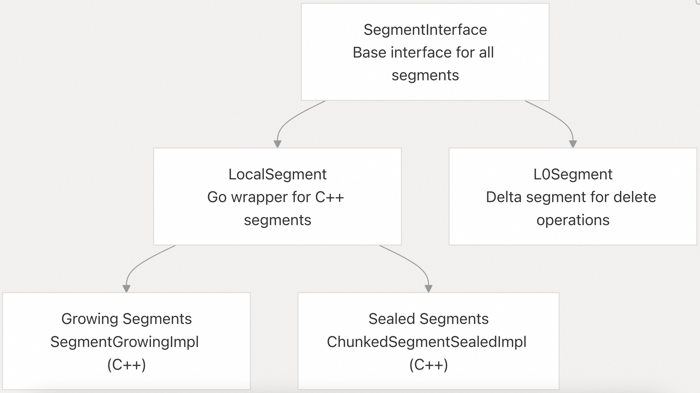
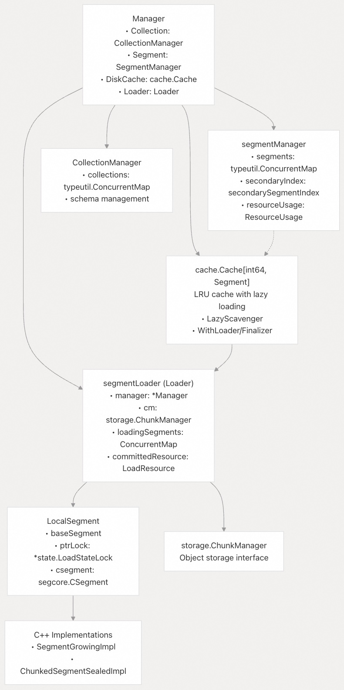
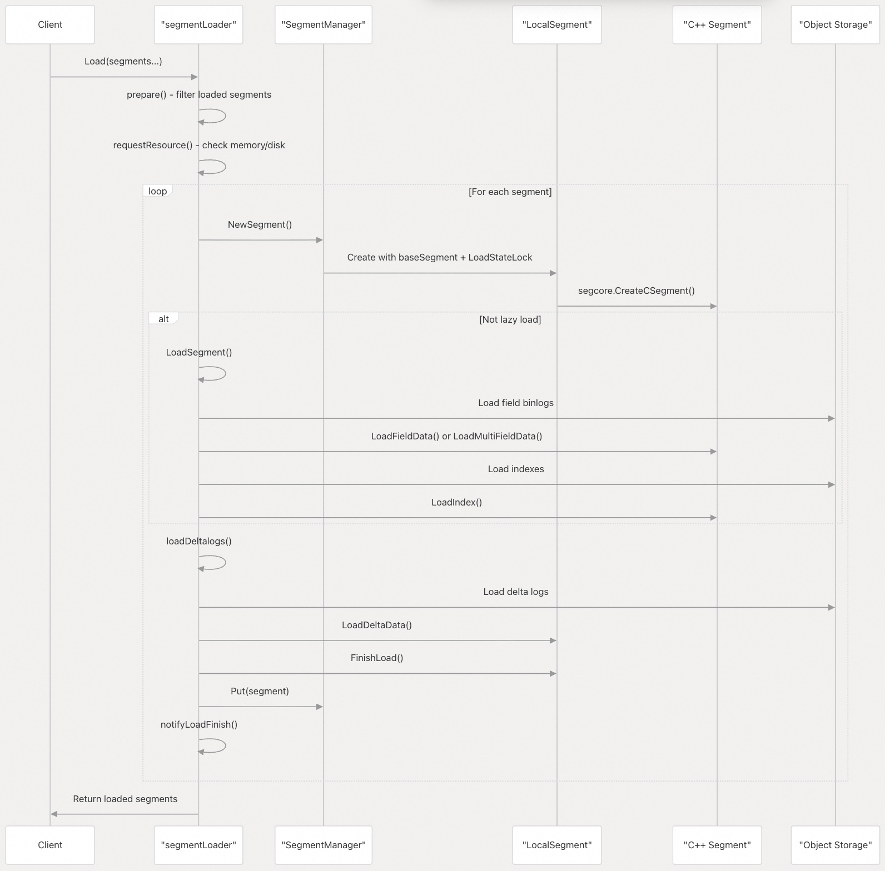
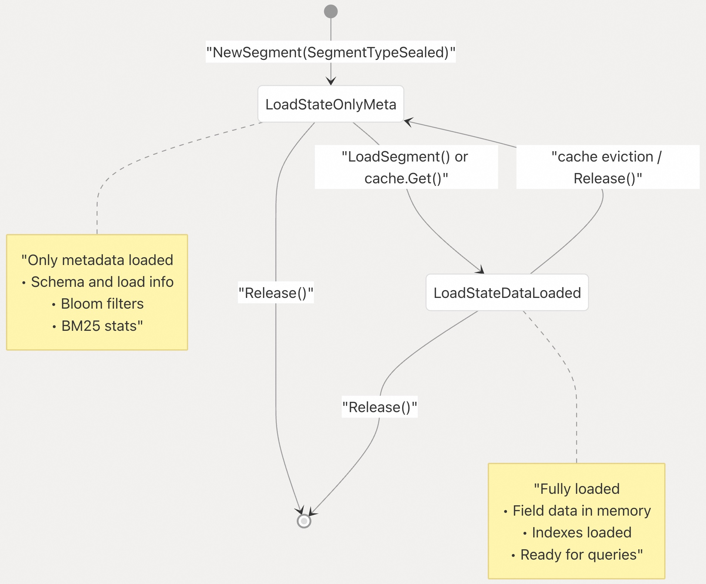

## Milvus 源码学习: 3.1 段管理(Segment Management)   
                                      
### 作者                                     
digoal                                    
                                   
### 日期                                  
2025-10-28                                  
                                    
### 标签                                    
Milvus , 源码学习                                     
                                    
----                                    
                                    
## 背景                                 
本文介绍 Milvus 中的段管理系统，该系统负责组织、加载和管理内存中的向量数据。段是基本的存储单元，用于保存向量嵌入（vector embeddings）和标量数据（scalar data），以实现高效的搜索和检索操作。  
  
## 段类型与生命周期  
  
Milvus 使用不同类型的段来针对不同的访问模式和数据状态进行优化：  
  
### 段类型层次结构  
  
  
  
**增长段**（Growing Segments）（`SegmentTypeGrowing`）是可变段，接受新的插入和删除操作。它们使用 `SegmentGrowingImpl` C++ 实现，并通过并发数据结构在内存中维护数据。  
  
**封存段**（Sealed Segments）（`SegmentTypeSealed`）是不可变段，针对搜索性能进行了优化。它们使用 `ChunkedSegmentSealedImpl` C++ 实现，支持内存映射（memory mapping）和懒加载（lazy loading）等高级功能。  
  
**L0 段**（L0 Segments）是特殊的增量段（delta segments），仅包含删除操作，用于高效地标记多个段中已被删除的记录。  
  
读到这, 你是不是感觉 Milvus 在存储方面的设计有点 LSM-Tree 和 湖仓 的思想在里面?    
  
来源：    
- [`internal/querynodev2/segments/segment.go` 第 68–73 行](https://github.com/milvus-io/milvus/blob/18371773/internal/querynodev2/segments/segment.go#L68-L73)    
- [`internal/core/src/segcore/SegmentGrowingImpl.h` 第 41 行](https://github.com/milvus-io/milvus/blob/18371773/internal/core/src/segcore/SegmentGrowingImpl.h#L41-L41)    
- [`internal/core/src/segcore/ChunkedSegmentSealedImpl.h` 第 46 行](https://github.com/milvus-io/milvus/blob/18371773/internal/core/src/segcore/ChunkedSegmentSealedImpl.h#L46-L46)  
  
## 段加载架构  
  
段加载系统在基于 Go 的编排层与 C++ 执行引擎之间进行协调：  
  
### 组件关系  
  
  
  
`Manager` 结构体通过其四个主要组件协调所有段操作。`segmentLoader` 实现了 `Loader` 接口，提供了用于不同类型数据加载的方法，而 `SegmentManager` 则使用并发数据结构跟踪段的生命周期。`LocalSegment` 提供了 Go 层面对 C++ 段实现的访问，并通过 `LoadStateLock` 实现线程安全的状态管理。  
  
来源：    
- [`internal/querynodev2/segments/manager.go` 第 73–78 行](https://github.com/milvus-io/milvus/blob/18371773/internal/querynodev2/segments/manager.go#L73-L78)    
- [`internal/querynodev2/segments/segment_loader.go` 第 220–234 行](https://github.com/milvus-io/milvus/blob/18371773/internal/querynodev2/segments/segment_loader.go#L220-L234)    
- [`internal/querynodev2/segments/segment.go` 第 283–300 行](https://github.com/milvus-io/milvus/blob/18371773/internal/querynodev2/segments/segment.go#L283-L300)    
- [`internal/querynodev2/segments/manager.go` 第 207–495 行](https://github.com/milvus-io/milvus/blob/18371773/internal/querynodev2/segments/manager.go#L207-L495)  
  
### 完整的加载流程  
  
`Loader` 接口定义了多种用于加载不同类型数据的方法：  
  
| 方法 | 用途 | 加载的数据 |  
|---|---|---|  
| `Load()` | 主段(Main segment)加载 | 字段数据、索引、增量日志（delta logs） |  
| `LoadDeltaLogs()` | 删除操作 | 被删除记录的主键和时间戳 |  
| `LoadBloomFilterSet()` | 主键过滤 | 用于存在性检查的布隆过滤器（Bloom filters） |  
| `LoadBM25Stats()` | 文本搜索优化 | 文本字段的 BM25 统计信息 |  
| `LoadIndex()` | 向量/标量索引 | Knowhere 索引、标量索引 |  
| `LoadLazySegment()` | 按需加载 | 由缓存未命中触发 |  
  
来源：  
- [`internal/querynodev2/segments/segment_loader.go` 第 74–103 行](https://github.com/milvus-io/milvus/blob/18371773/internal/querynodev2/segments/segment_loader.go#L74-L103)  
  
### 封存段(Sealed Segments)的加载流程  
  
  
加载过程会处理不同的段状态：  
- **准备阶段**：`prepare()` 使用 `loadingSegments` 并发映射来过滤段，避免重复加载。    
- **资源管理**：`requestResource()` 估算内存/磁盘使用量，并通过 `committedResource` 跟踪机制预留资源。    
- **段创建**：创建带有 `LoadStateLock` 的 `LocalSegment`，以实现线程安全的状态转换。    
- **数据加载**：根据段的配置加载字段数据、索引和增量日志（delta logs）。    
- **状态管理**：使用 `LoadStateLock` 的状态（如 `LoadStateOnlyMeta`、`LoadStateDataLoaded`）来管理加载进度。    
- **通知机制**：通过带有条件变量（condition variables）的 `loadResult` 更新加载状态。  
  
来源：    
- [`internal/querynodev2/segments/segment_loader.go` 第 238–397 行](https://github.com/milvus-io/milvus/blob/18371773/internal/querynodev2/segments/segment_loader.go#L238-L397)    
- [`internal/querynodev2/segments/segment.go` 第 302–378 行](https://github.com/milvus-io/milvus/blob/18371773/internal/querynodev2/segments/segment.go#L302-L378)    
- [`internal/querynodev2/segments/segment_loader.go` 第 944–1005 行](https://github.com/milvus-io/milvus/blob/18371773/internal/querynodev2/segments/segment_loader.go#L944-L1005)  
  
### 段状态管理与懒(lazy)加载  
  
封存段使用 `LoadStateLock` 实现线程安全的状态转换：  
  
  
  
懒加载过程使用带有资源感知驱逐策略（resource-aware eviction）的 `DiskCache`：  
  
**缓存操作**：    
- `WithLoader()`：在缓存未命中时调用 `LoadLazySegment()`    
- `WithFinalizer()`：在驱逐时调用 `Release(WithReleaseScope(ReleaseScopeData))`    
- `WithReloader()`：通过 `LoadIndex()` 和 `NeedUpdatedVersion()` 处理索引更新    
- `LazyScavenger()`：使用 `ResourceUsageEstimate().DiskSize` 进行驱逐决策    
  
**资源管理**：    
缓存通过 `ResourceUsageEstimate()` 跟踪磁盘使用情况，并在超过 `DiskCapacityLimit` 时驱逐段；而 `LoadLazySegment()` 使用 `requestResourceWithTimeout()` 等待可用资源。  
  
来源：    
- [`internal/querynodev2/segments/manager.go` 第 90–155 行](https://github.com/milvus-io/milvus/blob/18371773/internal/querynodev2/segments/manager.go#L90-L155)    
- [`internal/querynodev2/segments/segment_loader.go` 第 1008–1055 行](https://github.com/milvus-io/milvus/blob/18371773/internal/querynodev2/segments/segment_loader.go#L1008-L1055)    
- [`internal/querynodev2/segments/segment.go` 第 324–332 行](https://github.com/milvus-io/milvus/blob/18371773/internal/querynodev2/segments/segment.go#L324-L332)  
  
## 资源管理与估算  
  
### 内存与磁盘使用控制  
  
段加载器实现了复杂的资源管理机制，以防止内存溢出（out-of-memory）情况：  
  
**资源估算**：    
在加载前，系统使用 `getResourceEstimate()` 函数估算内存和磁盘需求，这些函数会分析字段数据大小、索引需求和压缩因子。  
  
**资源预留**：    
`requestResource()` 方法预留内存和磁盘空间，如果超出限制则阻塞新的加载操作。它使用已提交资源（committed resource）跟踪机制，对正在进行的操作进行核算。  
  
**并发控制**：    
加载并发度根据可用资源和系统负载动态调整。  
  
来源：    
- [`internal/querynodev2/segments/segment_loader.go` 第 460–528 行](https://github.com/milvus-io/milvus/blob/18371773/internal/querynodev2/segments/segment_loader.go#L460-L528)    
- [`internal/querynodev2/segments/segment_loader.go` 第 113–121 行](https://github.com/milvus-io/milvus/blob/18371773/internal/querynodev2/segments/segment_loader.go#L113-L121)  
  
## 段内数据组织  
  
### 分块(chunks)存储架构  
  
  
  
段将数据组织为固定大小的数据块（chunks），以实现高效的内存管理和并行处理。默认块大小可通过 `SegcoreConfig` 进行配置。  
  
**增长段(Growing Segments)** 使用 `ConcurrentVector` 数据结构，允许无锁并发插入，同时将数据维护在块中。  
  
**封存段(Sealed Segments)** 使用 `ChunkedColumn` 实现，支持内存映射，并可从对象存储中按需加载数据。  
  
来源：    
- [`internal/core/src/segcore/SegmentGrowingImpl.h` 第 134–162 行](https://github.com/milvus-io/milvus/blob/18371773/internal/core/src/segcore/SegmentGrowingImpl.h#L134-L162)    
- [`internal/core/src/segcore/ChunkedSegmentSealedImpl.cpp` 第 522–534 行](https://github.com/milvus-io/milvus/blob/18371773/internal/core/src/segcore/ChunkedSegmentSealedImpl.cpp#L522-L534)    
- [`internal/core/src/mmap/ChunkedColumn.h` 第 85–100 行](https://github.com/milvus-io/milvus/blob/18371773/internal/core/src/mmap/ChunkedColumn.h#L85-L100)  
  
### 字段数据与索引管理  
  
每个段为以下内容维护独立的存储：  
- **原始字段数据**（Raw Field Data）：以数据块（chunks）形式组织的原始向量和标量数据    
- **向量索引**（Vector Indexes）：基于 Knowhere 的索引，用于近似向量搜索    
- **标量索引**（Scalar Indexes）：用于标量过滤的 B 树和哈希索引    
- **文本索引**（Text Indexes）：用于字符串字段的全文搜索索引    
- **删除记录**（Delete Records）：被删除记录的时间戳和主键  
  
段加载过程协调从对象存储的 binlog 中加载这些不同类型的数据，并构建缺失的索引。  
  
来源：    
- [`internal/core/src/segcore/SegmentInterface.h` 第 56–180 行](https://github.com/milvus-io/milvus/blob/18371773/internal/core/src/segcore/SegmentInterface.h#L56-L180)    
- [`internal/querynodev2/segments/segment_loader.go` 第 824–937 行](https://github.com/milvus-io/milvus/blob/18371773/internal/querynodev2/segments/segment_loader.go#L824-L937)  
      
#### [期望 PostgreSQL|开源PolarDB 增加什么功能?](https://github.com/digoal/blog/issues/76 "269ac3d1c492e938c0191101c7238216")
  
  
#### [PolarDB 开源数据库](https://openpolardb.com/home "57258f76c37864c6e6d23383d05714ea")
  
  
#### [PolarDB 学习图谱](https://www.aliyun.com/database/openpolardb/activity "8642f60e04ed0c814bf9cb9677976bd4")
  
  
#### [PostgreSQL 解决方案集合](../201706/20170601_02.md "40cff096e9ed7122c512b35d8561d9c8")
  
  
#### [德哥 / digoal's Github - 公益是一辈子的事.](https://github.com/digoal/blog/blob/master/README.md "22709685feb7cab07d30f30387f0a9ae")
  
  
#### [About 德哥](https://github.com/digoal/blog/blob/master/me/readme.md "a37735981e7704886ffd590565582dd0")
  
  

  
