## Milvus 源码学习: 4 查询处理（Query Processing）  
                                          
### 作者                                         
digoal                                        
                                       
### 日期                                      
2025-10-28                                      
                                        
### 标签                                        
Milvus , 源码学习                                         
                                        
----                                        
                                        
## 背景                                     
本文介绍 Milvus 的查询处理系统，该系统负责执行来自客户端的搜索（search）和检索（retrieve）请求。内容包括基于任务(task-based)的请求处理架构、结合向量相似性与过滤条件的搜索执行、用于数据检索的查询执行，以及结果聚合与后处理。  
  
## 架构概览  
  
Milvus 的查询处理采用分布式、基于任务的架构：客户端请求被转换为内部任务，在查询节点（query nodes）之间调度执行，并将结果聚合后返回给客户端。  
  
### 高层查询处理流程  
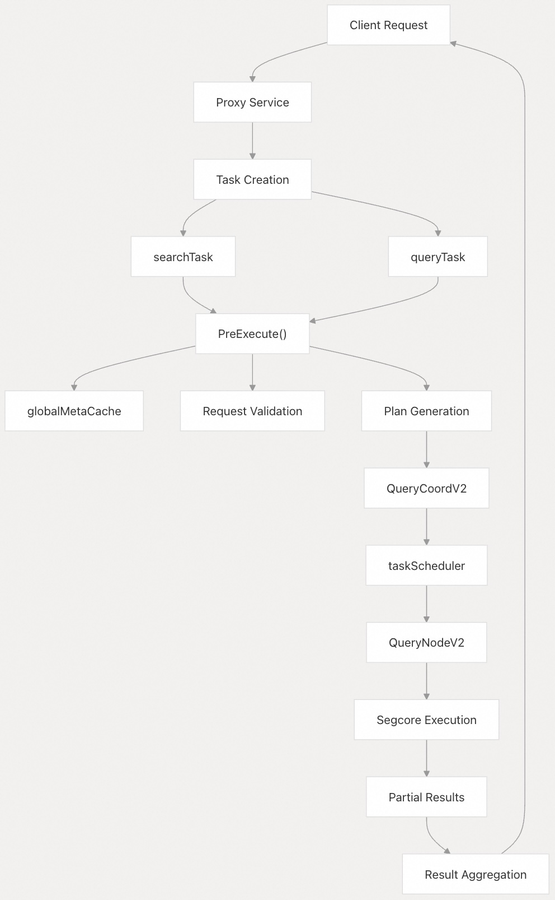    
  
来源：    
- [`internal/proxy/task_search.go` 第 54–97 行](https://github.com/milvus-io/milvus/blob/18371773/internal/proxy/task_search.go#L54-L97)    
- [`internal/proxy/task_query.go` 第 48–78 行](https://github.com/milvus-io/milvus/blob/18371773/internal/proxy/task_query.go#L48-L78)    
- [`internal/querycoordv2/task/scheduler.go` 第 282–343 行](https://github.com/milvus-io/milvus/blob/18371773/internal/querycoordv2/task/scheduler.go#L282-L343)  
  
## 任务系统架构  
  
查询处理系统围绕基于任务的架构构建，所有操作均实现 `task` 接口，并遵循统一的执行生命周期。  
  
### 基础任务接口  
  
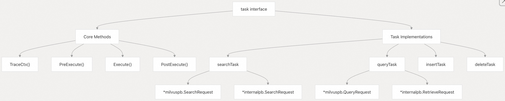    
  
基础 `task` 接口通过关键方法定义了执行生命周期：  
  
- `PreExecute()` —— 请求验证、模式解析(schema resolution)、执行计划生成    
- `Execute()` —— 通过 QueryCoordV2 执行实际查询    
- `PostExecute()` —— 结果处理、聚合与格式化    
  
来源：    
- [`internal/proxy/task.go` 第 133–154 行](https://github.com/milvus-io/milvus/blob/18371773/internal/proxy/task.go#L133-L154)    
- [`internal/proxy/task_search.go` 第 54–97 行](https://github.com/milvus-io/milvus/blob/18371773/internal/proxy/task_search.go#L54-L97)    
- [`internal/proxy/task_query.go` 第 48–78 行](https://github.com/milvus-io/milvus/blob/18371773/internal/proxy/task_query.go#L48-L78)  
  
### 任务执行生命周期  
  
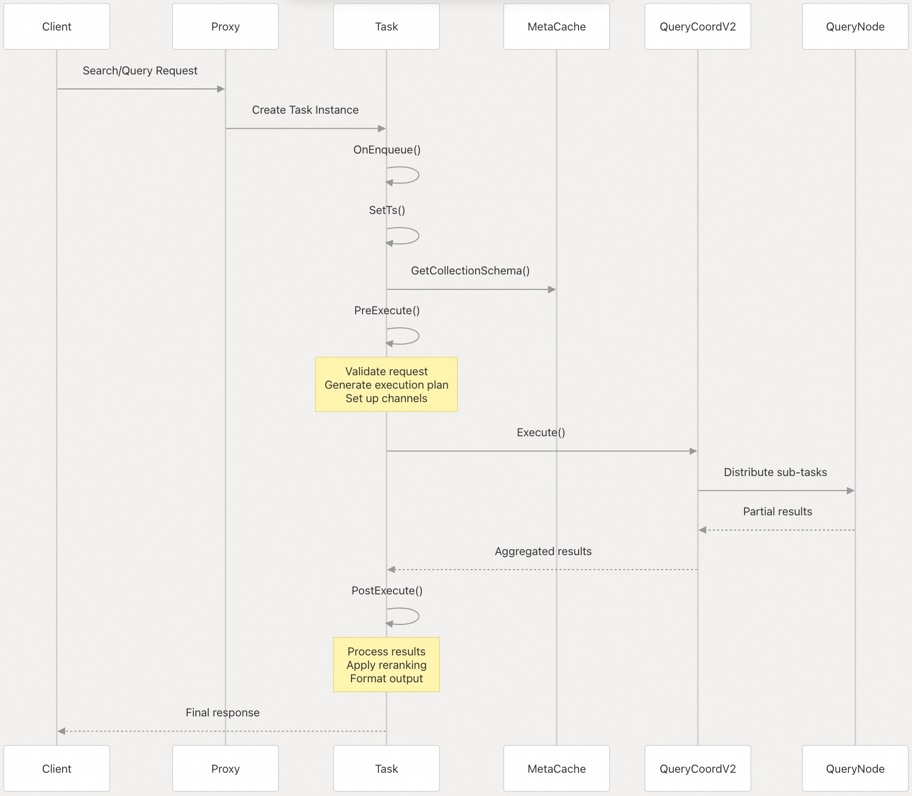    
  
来源：    
- [`internal/proxy/task.go` 第 133–154 行](https://github.com/milvus-io/milvus/blob/18371773/internal/proxy/task.go#L133-L154)    
- [`internal/proxy/task_search.go` 第 127–287 行](https://github.com/milvus-io/milvus/blob/18371773/internal/proxy/task_search.go#L127-L287)    
- [`internal/proxy/task_query.go` 第 267–350 行](https://github.com/milvus-io/milvus/blob/18371773/internal/proxy/task_query.go#L267-L350)  
  
## 搜索处理  
  
搜索处理负责处理向量相似性搜索请求，支持混合搜索（hybrid search）、重排序（reranking），以及分组（grouping）和迭代（iteration）等高级功能。  
  
### 搜索任务结构  
  
`searchTask` 结构体封装了搜索执行所需的所有状态：  
  
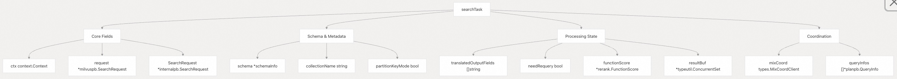    
  
来源：    
- [`internal/proxy/task_search.go` 第 54–97 行](https://github.com/milvus-io/milvus/blob/18371773/internal/proxy/task_search.go#L54-L97)  
  
### 搜索预执行处理  
  
`PreExecute()` 方法执行全面的请求验证与准备工作：  
  
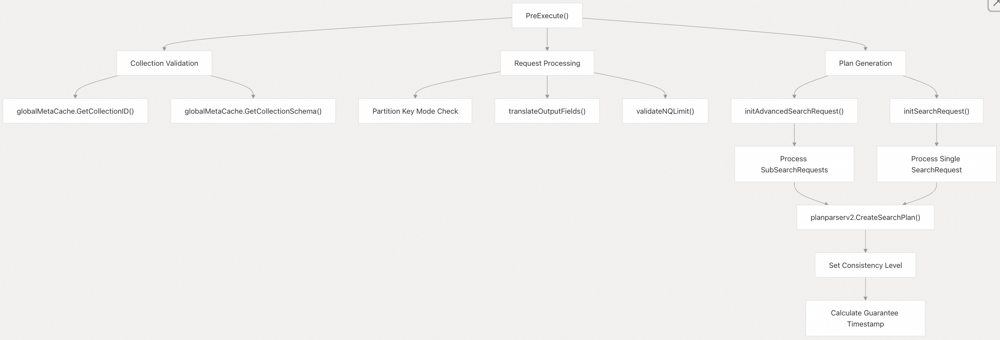    
  
来源：    
- [`internal/proxy/task_search.go` 第 127–287 行](https://github.com/milvus-io/milvus/blob/18371773/internal/proxy/task_search.go#L127-L287)    
- [`internal/proxy/task_search.go` 第 506–607 行](https://github.com/milvus-io/milvus/blob/18371773/internal/proxy/task_search.go#L506-L607)    
- [`internal/proxy/task_search.go` 第 363–491 行](https://github.com/milvus-io/milvus/blob/18371773/internal/proxy/task_search.go#L363-L491)  
  
### 高级搜索与混合搜索  
  
Milvus 支持多种高级搜索能力，包括多向量混合搜索和重排序：  
  
    
  
来源：    
- [`internal/proxy/task_search.go` 第 363–491 行](https://github.com/milvus-io/milvus/blob/18371773/internal/proxy/task_search.go#L363-L491)    
- [`internal/proxy/search_util.go` 第 1–750 行](https://github.com/milvus-io/milvus/blob/18371773/internal/proxy/search_util.go#L1-L750)  
  
## 查询处理  
  
查询处理负责处理数据检索请求，支持过滤、分页和字段选择。  
  
### 查询任务结构与执行  
  
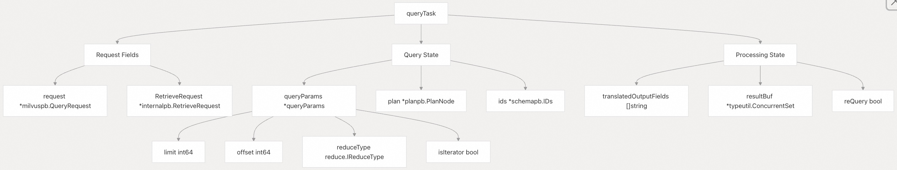    
  
来源：    
- [`internal/proxy/task_query.go` 第 48–78 行](https://github.com/milvus-io/milvus/blob/18371773/internal/proxy/task_query.go#L48-L78)    
- [`internal/proxy/task_query.go` 第 80–87 行](https://github.com/milvus-io/milvus/blob/18371773/internal/proxy/task_query.go#L80-L87)  
  
### 查询计划生成  
  
查询处理系统根据请求类型生成执行计划：  
  
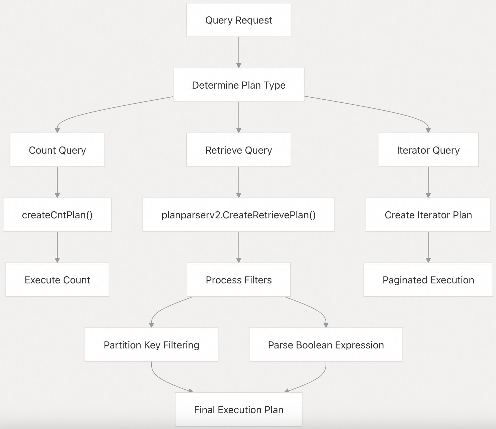    
  
来源：    
- [`internal/proxy/task_query.go` 第 267–350 行](https://github.com/milvus-io/milvus/blob/18371773/internal/proxy/task_query.go#L267-L350)    
- [`internal/proxy/task_query.go` 第 244–265 行](https://github.com/milvus-io/milvus/blob/18371773/internal/proxy/task_query.go#L244-L265)  
  
## 任务调度与执行  
  
QueryCoordV2 使用一套复杂的调度系统，在查询节点之间管理任务的调度与执行。  
  
### 任务调度器架构  
  
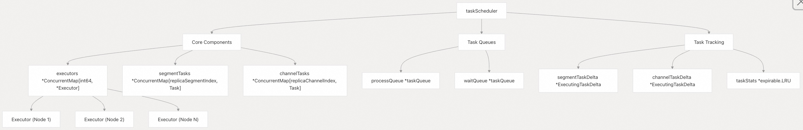    
  
来源：    
- [`internal/querycoordv2/task/scheduler.go` 第 283–343 行](https://github.com/milvus-io/milvus/blob/18371773/internal/querycoordv2/task/scheduler.go#L283-L343)    
- [`internal/querycoordv2/task/executor.go` 第 60–95 行](https://github.com/milvus-io/milvus/blob/18371773/internal/querycoordv2/task/executor.go#L60-L95)  
  
### 任务执行流程  
  
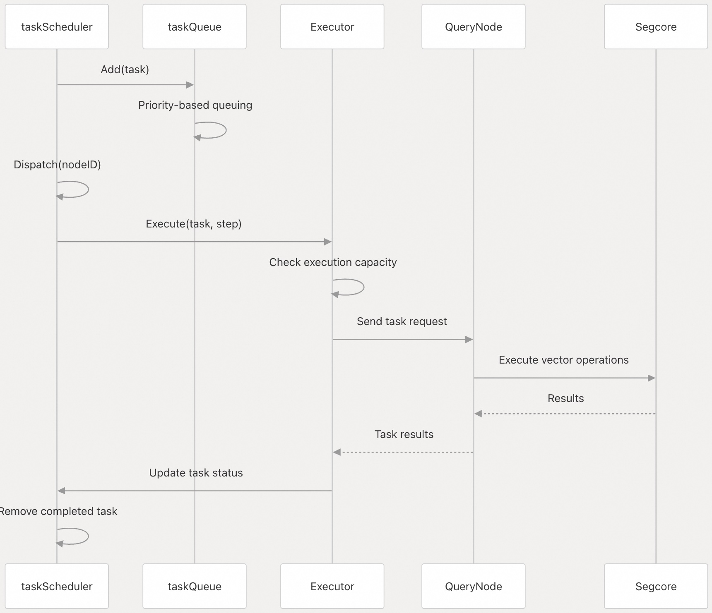    
  
来源：    
- [`internal/querycoordv2/task/scheduler.go` 第 387–419 行](https://github.com/milvus-io/milvus/blob/18371773/internal/querycoordv2/task/scheduler.go#L387-L419)    
- [`internal/querycoordv2/task/executor.go` 第 115–140 行](https://github.com/milvus-io/milvus/blob/18371773/internal/querycoordv2/task/executor.go#L115-L140)  
  
## 结果处理与聚合  
  
查询处理包含复杂的结果处理机制，支持重排序、输出字段选择和结果格式化。  
  
### 结果聚合流水线  
  
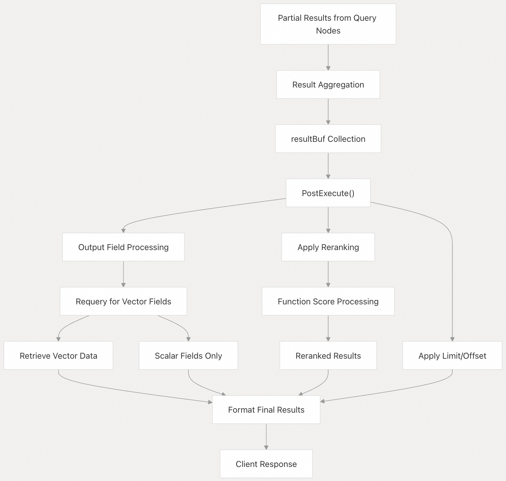    
  
来源：    
- [`internal/proxy/task_search.go` 第 1265–1400 行](https://github.com/milvus-io/milvus/blob/18371773/internal/proxy/task_search.go#L1265-L1400)    
- [`internal/proxy/task_query.go` 第 600–700 行](https://github.com/milvus-io/milvus/blob/18371773/internal/proxy/task_query.go#L600-L700)  
  
### 搜索迭代器支持  
  
Milvus 支持对大规模结果集进行搜索迭代：  
  
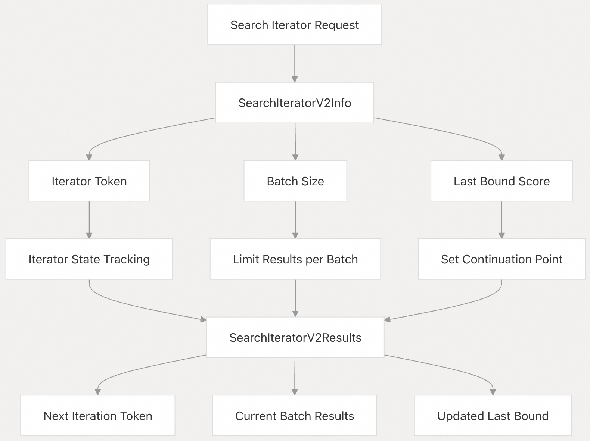    
  
来源：    
- [`internal/proxy/task_search_test.go` 第 182–224 行](https://github.com/milvus-io/milvus/blob/18371773/internal/proxy/task_search_test.go#L182-L224)    
- [`internal/proxy/task_search.go` 第 1340–1380 行](https://github.com/milvus-io/milvus/blob/18371773/internal/proxy/task_search.go#L1340-L1380)  
  
      
#### [期望 PostgreSQL|开源PolarDB 增加什么功能?](https://github.com/digoal/blog/issues/76 "269ac3d1c492e938c0191101c7238216")
  
  
#### [PolarDB 开源数据库](https://openpolardb.com/home "57258f76c37864c6e6d23383d05714ea")
  
  
#### [PolarDB 学习图谱](https://www.aliyun.com/database/openpolardb/activity "8642f60e04ed0c814bf9cb9677976bd4")
  
  
#### [PostgreSQL 解决方案集合](../201706/20170601_02.md "40cff096e9ed7122c512b35d8561d9c8")
  
  
#### [德哥 / digoal's Github - 公益是一辈子的事.](https://github.com/digoal/blog/blob/master/README.md "22709685feb7cab07d30f30387f0a9ae")
  
  
#### [About 德哥](https://github.com/digoal/blog/blob/master/me/readme.md "a37735981e7704886ffd590565582dd0")
  
  

  
