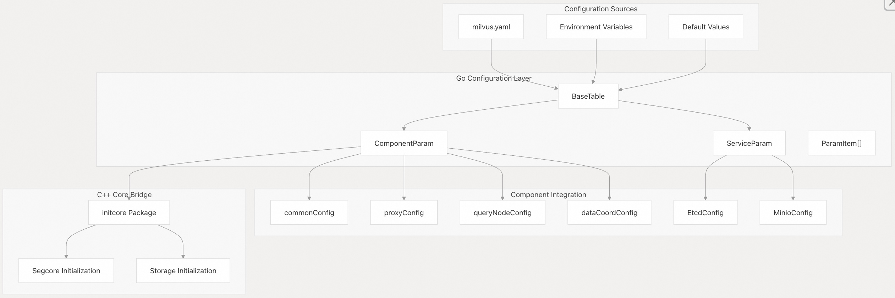
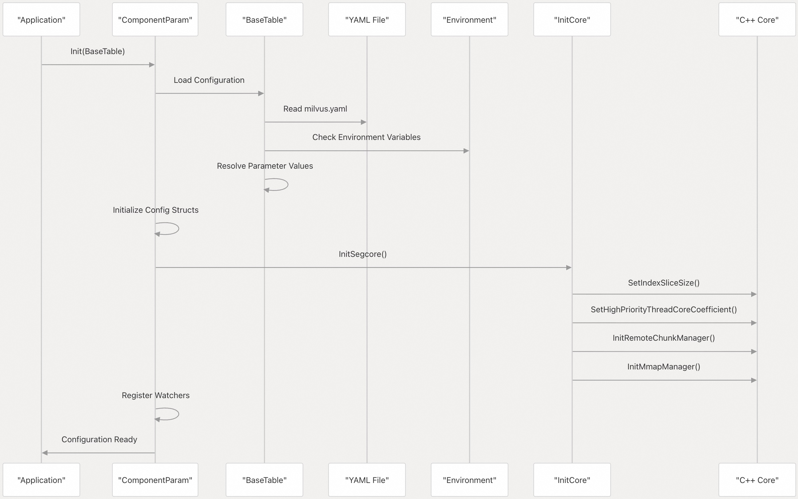
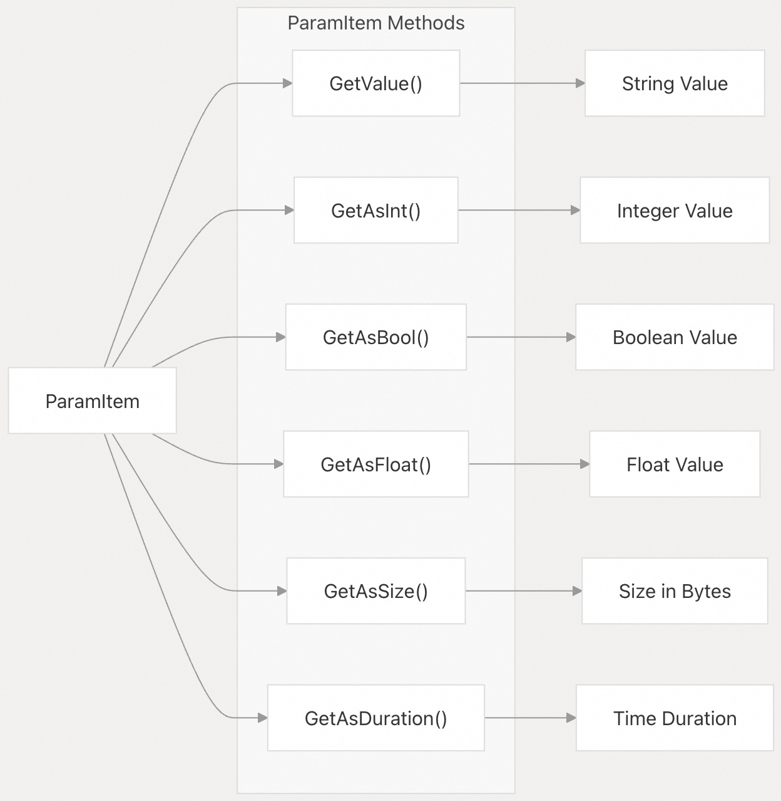
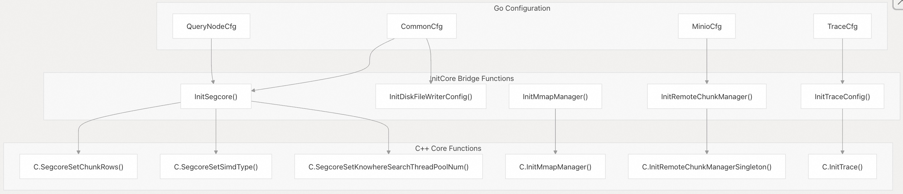
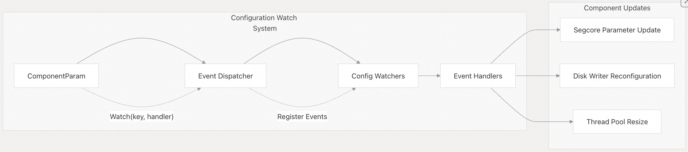
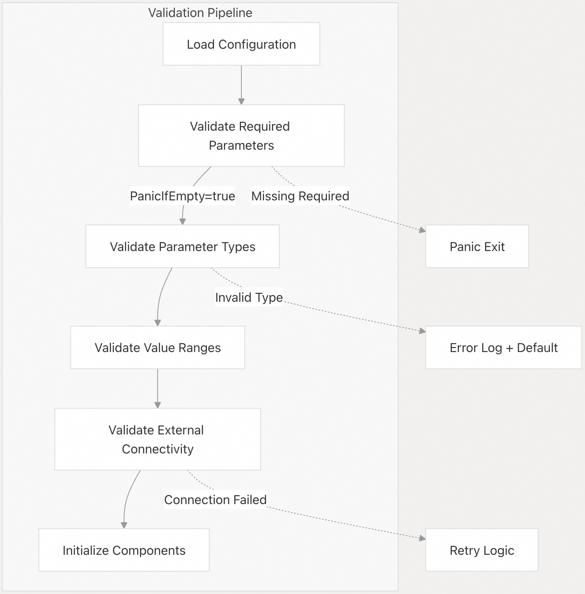

## Milvus 源码学习: 5 配置系统  
                                                
### 作者                                               
digoal                                              
                                             
### 日期                                            
2025-10-28                                            
                                              
### 标签                                              
Milvus , 源码学习                                               
                                              
----                                              
                                              
## 背景     
配置系统管理 Milvus 各组件的所有运行时参数和设置。它通过 YAML 文件提供一种集中式的方式来配置 etcd、存储、消息队列以及组件特定的设置，并支持动态更新和验证。  
  
## 配置架构  
  
配置系统采用分层架构，其中主配置文件 `milvus.yaml` 作为唯一事实来源，由基于 Go 的参数表（parameter tables）加载和管理，然后桥接到 C++ 核心组件，以支持对性能敏感的操作。  
  
  
  
来源:    
- [`configs/milvus.yaml` 1-600](https://github.com/milvus-io/milvus/blob/18371773/configs/milvus.yaml#L1-L600)    
- [`pkg/util/paramtable/component_param.go` 62-110](https://github.com/milvus-io/milvus/blob/18371773/pkg/util/paramtable/component_param.go#L62-L110)    
- [`pkg/util/paramtable/service_param.go` 42-55](https://github.com/milvus-io/milvus/blob/18371773/pkg/util/paramtable/service_param.go#L42-L55)    
  
## 配置加载流程  
  
配置系统通过多阶段初始化流程加载参数，该流程从多个来源解析参数值，并以环境变量的优先级为准。  
  
  
  
来源:    
- [`pkg/util/paramtable/component_param.go` 113-169](https://github.com/milvus-io/milvus/blob/18371773/pkg/util/paramtable/component_param.go#L113-L169)    
- [`internal/util/initcore/init_core.go` 246-365](https://github.com/milvus-io/milvus/blob/18371773/internal/util/initcore/init_core.go#L246-L365)    
  
## 参数项结构  
  
各个配置参数由 `ParamItem` 结构表示，该结构提供类型安全的访问、验证以及动态更新能力。  
  
| 字段 | 类型 | 用途 |    
|---|---|---|    
| `Key` | string | 配置键路径（例如："etcd.endpoints"） |    
| `Version` | string | 引入该参数时的 Milvus 版本 |    
| `DefaultValue` | string | 未指定时的默认值 |    
| `FallbackKeys` | []string | 用于向后兼容的备用键名 |    
| `Doc` | string | 文档说明 |    
| `Export` | bool | 该参数是否导出到外部系统 |    
| `PanicIfEmpty` | bool | 参数为空时是否触发 panic |    
| `Refreshable` | string | 该参数是否支持运行时更新 |    
  
  
  
来源:    
- [`pkg/util/paramtable/component_param.go` 325-339](https://github.com/milvus-io/milvus/blob/18371773/pkg/util/paramtable/component_param.go#L325-L339)    
- [`pkg/util/paramtable/service_param.go` 118-128](https://github.com/milvus-io/milvus/blob/18371773/pkg/util/paramtable/service_param.go#L118-L128)    
  
## 核心组件配置桥接  
  
配置系统通过 `initcore` 包将 Go 参数桥接到 C++ 核心组件，该包将 Go 配置值转换为 C 结构体和函数调用。  
  
  
  
来源:    
- [`internal/util/initcore/init_core.go` 246-365](https://github.com/milvus-io/milvus/blob/18371773/internal/util/initcore/init_core.go#L246-L365)    
- [`internal/querynodev2/server.go` 246-365](https://github.com/milvus-io/milvus/blob/18371773/internal/querynodev2/server.go#L246-L365)    
- [`internal/core/src/common/init_c.cpp` 28-124](https://github.com/milvus-io/milvus/blob/18371773/internal/core/src/common/init_c.cpp#L28-L124)    
  
## 配置分类  
  
Milvus 将配置参数组织为逻辑类别，每个类别由专用的配置结构管理。  
  
### 服务参数  
  
基础架构服务和外部依赖项。  
  
| 配置项 | 用途 | 键示例 |    
|---|---|---|    
| `EtcdConfig` | 元数据存储 | endpoints、rootPath、SSL 设置 |    
| `MinioConfig` | 对象存储 | 地址、凭证、存储桶设置 |    
| `PulsarConfig` | 消息队列 | 地址、租户、认证 |    
| `MQConfig` | 消息队列选择 | 类型、追加模式设置 |    
  
### 组件参数  
  
组件特定的运行设置。  
  
| 配置项 | 用途 | 键示例 |    
|---|---|---|    
| `commonConfig` | 共享设置 | 线程系数(coefficients)、SIMD 类型、优雅超时(graceful timeouts) |    
| `proxyConfig` | API 网关 | 最大维度、任务限制、访问日志 |    
| `queryNodeConfig` | 查询执行 | 块大小(chunk size)、mmap 设置、缓存配置 |    
| `dataCoordConfig` | 数据协调 | 段生命周期、压缩、垃圾回收 |    
  
来源:    
- [`pkg/util/paramtable/service_param.go` 42-69](https://github.com/milvus-io/milvus/blob/18371773/pkg/util/paramtable/service_param.go#L42-L69)    
- [`pkg/util/paramtable/component_param.go` 62-90](https://github.com/milvus-io/milvus/blob/18371773/pkg/util/paramtable/component_param.go#L62-L90)    
  
## 动态配置更新  
  
对于标记为可刷新（refreshable）的参数，配置系统通过观察者（watcher）模式支持运行时更新，将变更传播到相关组件。  
  
  
  
动态 segcore 更新的观察者注册示例：    
- `common.threadCoreCoefficient.highPriority` → `ResizeHighPriorityPool`    
- `common.diskWriteMode` → `ReconfigDiskFileWriterParams`    
- `common.diskWriteBufferSizeKb` → `ReconfigDiskFileWriterParams`    
  
来源:    
- [`pkg/util/paramtable/component_param.go` 184-194](https://github.com/milvus-io/milvus/blob/18371773/pkg/util/paramtable/component_param.go#L184-L194)    
- [`internal/querynodev2/server.go` 222-244](https://github.com/milvus-io/milvus/blob/18371773/internal/querynodev2/server.go#L222-L244)    
  
## 配置验证与错误处理  
  
系统提供多种验证机制，以确保配置的正确性：  
  
### 参数验证   
- **类型检查**：对无效值自动进行类型转换并处理错误    
- **范围验证**：对数值型参数进行边界检查    
- **格式验证**：对 URL、路径和枚举值进行格式校验    
- **必填参数**：对关键配置使用 `PanicIfEmpty` 标志    
  
### 初始化安全性    
- **关键错误时触发 panic**：缺少必需参数将立即导致程序失败    
- **回退值**：默认值可防止未定义行为    
- **兼容性检查**：根据 Milvus 版本对参数进行验证    
- **资源验证**：检查存储和网络连接是否可用  
  
  
  
来源:    
- [`pkg/util/paramtable/component_param.go` 325-400](https://github.com/milvus-io/milvus/blob/18371773/pkg/util/paramtable/component_param.go#L325-L400)    
- [`pkg/util/paramtable/service_param.go` 137-141](https://github.com/milvus-io/milvus/blob/18371773/pkg/util/paramtable/service_param.go#L137-L141)    
- [`internal/util/initcore/init_core.go` 329-365](https://github.com/milvus-io/milvus/blob/18371773/internal/util/initcore/init_core.go#L329-L365)    
  