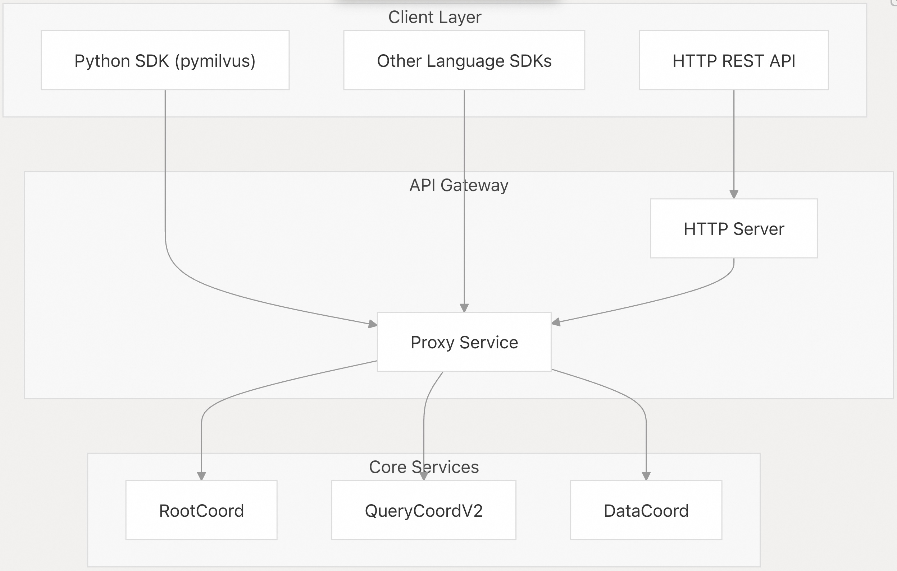
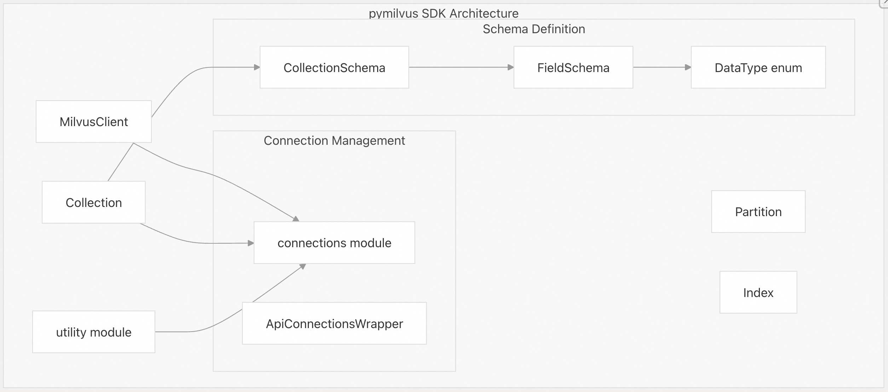
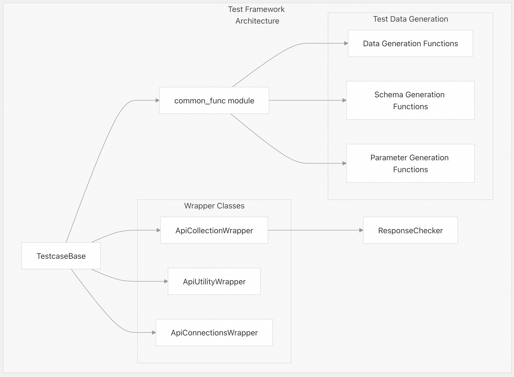
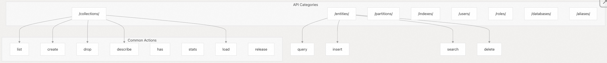
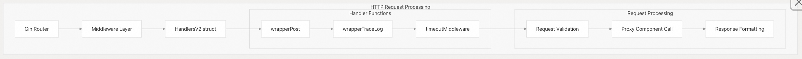
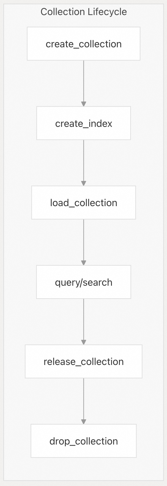

## Milvus 源码学习: 6 客户端 SDK 与 API   
                                                    
### 作者                                                   
digoal                                                  
                                                 
### 日期                                                
2025-10-28                                                
                                                  
### 标签                                                  
Milvus , 源码学习                                                   
                                                  
----                                                  
                                                  
## 背景        
本文介绍用于与 Milvus 交互的客户端接口，包括 Python SDK（`pymilvus`）和 HTTP REST API。这些接口提供了对所有 Milvus 操作的编程访问能力，包括集合管理、数据插入/查询、索引构建以及系统管理。  
  
## 客户端接口架构  
  
Milvus 提供了多种客户端接口，它们均通过 Proxy 服务与同一底层系统进行交互：  
  
    
  
来源:  
- [`internal/distributed/proxy/httpserver/handler_v2.go` 1-200](https://github.com/milvus-io/milvus/blob/18371773/internal/distributed/proxy/httpserver/handler_v2.go#L1-L200)  
- [`tests/python_client/requirements.txt` 30-32](https://github.com/milvus-io/milvus/blob/18371773/tests/python_client/requirements.txt#L30-L32)  
  
## Python SDK（pymilvus）  
  
Python SDK 是 Milvus 的主要客户端库，为所有 Milvus 操作提供全面的 Python API。该 SDK 使用 gRPC 与 Proxy 服务通信。  
  
### 核心 SDK 组件  
  
    
  
来源:  
- [`tests/python_client/common/common_func.py` 29](https://github.com/milvus-io/milvus/blob/18371773/tests/python_client/common/common_func.py#L29-L29)  
- [`tests/python_client/base/client_base.py` 20-21](https://github.com/milvus-io/milvus/blob/18371773/tests/python_client/base/client_base.py#L20-L21)  
- [`tests/python_client/base/collection_wrapper.py` 6](https://github.com/milvus-io/milvus/blob/18371773/tests/python_client/base/collection_wrapper.py#L6-L6)  
  
### 关键 Python SDK 操作  
  
SDK 提供了封装类（wrapper classes），用于处理 API 请求和响应验证：  
  
| 操作类别 | 封装类 | 关键方法 |  
|---|---|---|  
| 集合（Collections） | `ApiCollectionWrapper` | `create_collection`, `drop_collection`, `list_collections` |  
| 数据操作（Data Operations） | `ApiCollectionWrapper` | `insert`, `delete`, `query`, `search` |  
| 索引（Indexes） | `ApiIndexWrapper` | `create_index`, `drop_index`, `describe_index` |  
| 分区（Partitions） | `ApiPartitionWrapper` | `create_partition`, `drop_partition`, `list_partitions` |  
| 工具（Utilities） | `ApiUtilityWrapper` | `has_collection`, `loading_progress`, `get_query_segment_info` |  
  
来源:  
- [`tests/python_client/base/collection_wrapper.py` 24-100](https://github.com/milvus-io/milvus/blob/18371773/tests/python_client/base/collection_wrapper.py#L24-L100)  
- [`tests/python_client/base/utility_wrapper.py` 16-28](https://github.com/milvus-io/milvus/blob/18371773/tests/python_client/base/utility_wrapper.py#L16-L28)  
  
### 测试与验证框架  
  
Python 客户端包含全面的测试工具：  
  
    
  
来源:  
- [`tests/python_client/base/client_base.py` 24-59](https://github.com/milvus-io/milvus/blob/18371773/tests/python_client/base/client_base.py#L24-L59)  
- [`tests/python_client/check/func_check.py` 27-40](https://github.com/milvus-io/milvus/blob/18371773/tests/python_client/check/func_check.py#L27-L40)  
- [`tests/python_client/common/common_func.py` 591-663](https://github.com/milvus-io/milvus/blob/18371773/tests/python_client/common/common_func.py#L591-L663)  
  
## HTTP REST API  
  
HTTP REST API 提供了一种与编程语言无关的 Milvus 功能访问接口。该接口作为 HTTP 服务器实现在 Proxy 服务内部。  
  
### API 结构与端点(endpoint)  
  
REST API 按功能类别组织，并采用一致的操作模式：  
  
    
  
来源:  
- [`internal/distributed/proxy/httpserver/constant.go` 25-50](https://github.com/milvus-io/milvus/blob/18371773/internal/distributed/proxy/httpserver/constant.go#L25-L50)  
- [`internal/distributed/proxy/httpserver/handler_v2.go` 70-200](https://github.com/milvus-io/milvus/blob/18371773/internal/distributed/proxy/httpserver/handler_v2.go#L70-L200)  
  
### HTTP 处理器架构  
  
HTTP API 基于 Gin 框架实现，并采用分层的处理器结构：  
  
    
  
来源:  
- [`internal/distributed/proxy/httpserver/handler_v2.go` 58-68](https://github.com/milvus-io/milvus/blob/18371773/internal/distributed/proxy/httpserver/handler_v2.go#L58-L68)  
- [`internal/distributed/proxy/httpserver/handler_v2.go` 70-200](https://github.com/milvus-io/milvus/blob/18371773/internal/distributed/proxy/httpserver/handler_v2.go#L70-L200)  
  
### 请求与响应结构  
  
API 使用 Go 结构体定义的结构化请求/响应格式：  
  
#### 集合操作  
- `CollectionReq` — 使用 schema 创建集合    
- `CollectionNameReq` — 需要集合名称的操作    
- `CollectionDataReq` — 数据插入请求    
  
#### 查询操作  
- `QueryReqV2` — 带过滤条件和输出字段指定的查询    
- `SearchReqV2` — 向量相似性搜索    
- `CollectionIDReq` — 通过主键获取实体    
  
#### 管理操作  
- `DatabaseReq` — 数据库操作    
- `UserReq`, `RoleReq` — 基于角色的访问控制（RBAC）操作    
- `IndexParamReq` — 索引管理    
  
来源:  
- [`internal/distributed/proxy/httpserver/request_v2.go` 32-200](https://github.com/milvus-io/milvus/blob/18371773/internal/distributed/proxy/httpserver/request_v2.go#L32-L200)  
  
### 身份验证与中间件  
  
HTTP API 包含身份验证和请求处理中间件：  
  
    
  
来源:  
- [`internal/distributed/proxy/httpserver/utils.go` 82-100](https://github.com/milvus-io/milvus/blob/18371773/internal/distributed/proxy/httpserver/utils.go#L82-L100)  
- [`internal/distributed/proxy/httpserver/handler_v2.go` 63-67](https://github.com/milvus-io/milvus/blob/18371773/internal/distributed/proxy/httpserver/handler_v2.go#L63-L67)  
  
## API 操作类别  
  
### 数据操作  
  
Python SDK 与 HTTP API 均提供全面的数据管理能力：  
  
| 操作 | Python SDK 方法 | HTTP 端点 | 用途 |  
|---|---|---|---|  
| 插入（Insert） | `collection.insert(data)` | `POST /entities/insert` | 插入新实体 |  
| 查询（Query） | `collection.query(expr)` | `POST /entities/query` | 带过滤条件的查询 |  
| 搜索（Search） | `collection.search(vectors)` | `POST /entities/search` | 向量相似性搜索 |  
| 删除（Delete） | `collection.delete(expr)` | `POST /entities/delete` | 按表达式删除实体 |  
| 更新插入（Upsert） | `collection.upsert(data)` | `POST /entities/upsert` | 插入或更新实体 |  
  
来源:  
- [`tests/python_client/testcases/test_query.py` 100-124](https://github.com/milvus-io/milvus/blob/18371773/tests/python_client/testcases/test_query.py#L100-L124)  
- [`tests/python_client/testcases/test_insert.py` 36-64](https://github.com/milvus-io/milvus/blob/18371773/tests/python_client/testcases/test_insert.py#L36-L64)  
- [`internal/distributed/proxy/httpserver/handler_v2.go` 102-125](https://github.com/milvus-io/milvus/blob/18371773/internal/distributed/proxy/httpserver/handler_v2.go#L102-L125)  
  
### 集合管理  
  
两种接口均支持集合生命周期操作：  
  
    
  
来源:  
- [`tests/python_client/testcases/test_collection.py` 105-118](https://github.com/milvus-io/milvus/blob/18371773/tests/python_client/testcases/test_collection.py#L105-L118)  
- [`internal/distributed/proxy/httpserver/handler_v2.go` 77-82](https://github.com/milvus-io/milvus/blob/18371773/internal/distributed/proxy/httpserver/handler_v2.go#L77-L82)  
  
### Schema 与类型系统  
  
两种接口均支持 Milvus 丰富的数据类型系统：  
  
| 数据类型 | Python SDK | HTTP API | 描述 |  
|---|---|---|---|  
| 向量（Vectors） | `DataType.FLOAT_VECTOR` | `"FLOAT_VECTOR"` | 密集浮点向量 |  
| 标量（Scalars） | `DataType.INT64` | `"INT64"` | 64 位整数 |  
| 字符串（Strings） | `DataType.VARCHAR` | `"VARCHAR"` | 可变长度字符串 |  
| JSON | `DataType.JSON` | `"JSON"` | JSON 文档 |  
| 数组（Arrays） | `DataType.ARRAY` | `"ARRAY"` | 标量数组 |  
  
来源:  
- [`tests/python_client/common/common_type.py` 61-109](https://github.com/milvus-io/milvus/blob/18371773/tests/python_client/common/common_type.py#L61-L109)  
- [`internal/distributed/proxy/httpserver/utils.go` 203-244](https://github.com/milvus-io/milvus/blob/18371773/internal/distributed/proxy/httpserver/utils.go#L203-L244)  
  
该客户端接口层为所有与 Milvus 的交互提供了基础，在抽象分布式架构复杂性的同时，全面开放了向量数据库的功能。  
       
#### [期望 PostgreSQL|开源PolarDB 增加什么功能?](https://github.com/digoal/blog/issues/76 "269ac3d1c492e938c0191101c7238216")
  
  
#### [PolarDB 开源数据库](https://openpolardb.com/home "57258f76c37864c6e6d23383d05714ea")
  
  
#### [PolarDB 学习图谱](https://www.aliyun.com/database/openpolardb/activity "8642f60e04ed0c814bf9cb9677976bd4")
  
  
#### [PostgreSQL 解决方案集合](../201706/20170601_02.md "40cff096e9ed7122c512b35d8561d9c8")
  
  
#### [德哥 / digoal's Github - 公益是一辈子的事.](https://github.com/digoal/blog/blob/master/README.md "22709685feb7cab07d30f30387f0a9ae")
  
  
#### [About 德哥](https://github.com/digoal/blog/blob/master/me/readme.md "a37735981e7704886ffd590565582dd0")
  
  

  
