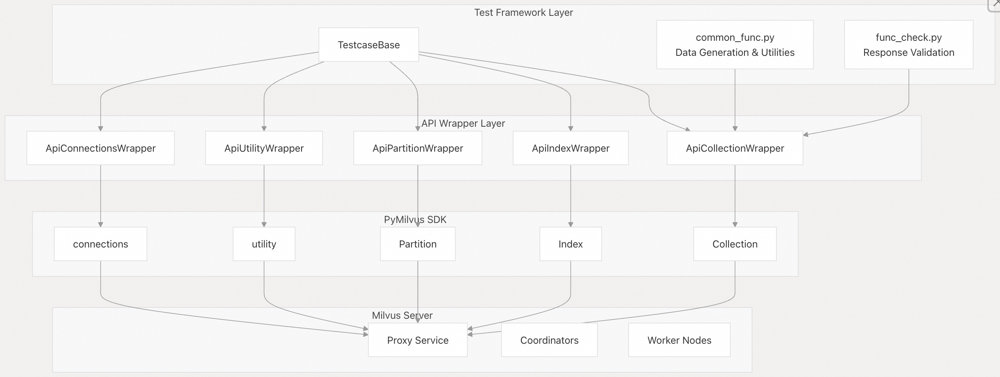
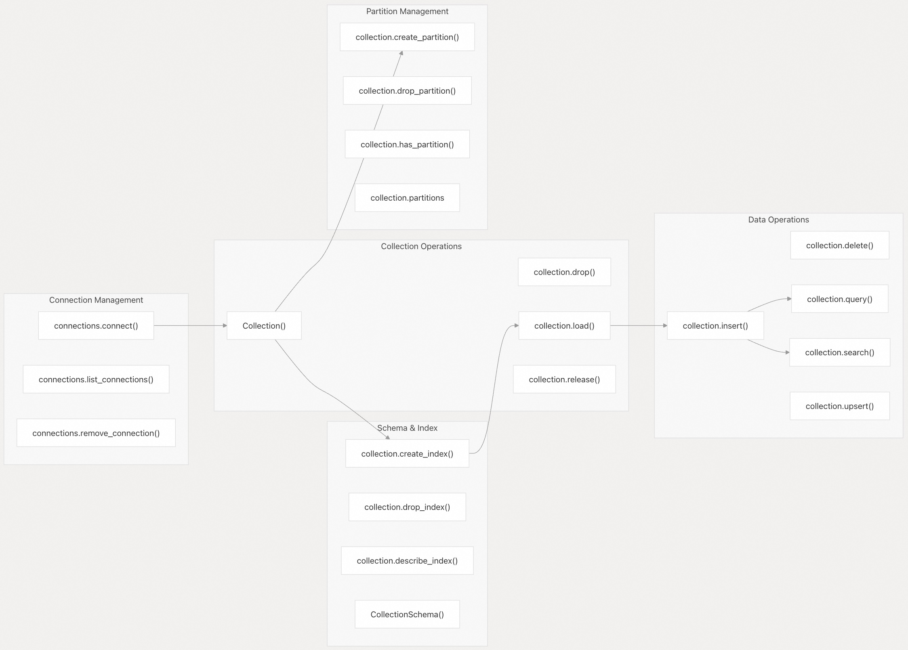
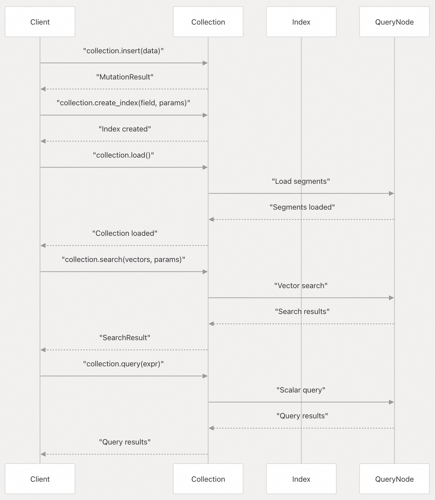
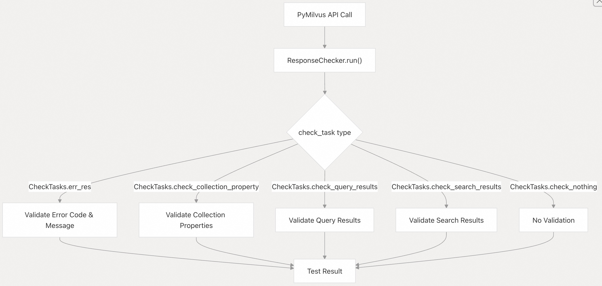

## Milvus 源码学习: 6.1 Python 客户端 SDK   
                                                      
### 作者                                                     
digoal                                                    
                                                   
### 日期                                                  
2025-10-28                                                  
                                                    
### 标签                                                    
Milvus , 源码学习                                                     
                                                    
----                                                    
                                                    
## 背景          
本文介绍 Milvus 的 Python 客户端 SDK 测试框架和使用模式，展示如何使用 PyMilvus 库与 Milvus 进行交互。该测试框架提供了客户端操作、数据处理和 API 使用模式的全面示例。  
  
## 测试框架架构  
  
Python 客户端 SDK 测试框架围绕封装 PyMilvus 操作的封装类构建，为所有客户端功能提供了全面的测试覆盖范围。  
  
  
  
**测试框架组件**  
  
来源:  
- [`tests/python_client/base/client_base.py` 24-61](https://github.com/milvus-io/milvus/blob/18371773/tests/python_client/base/client_base.py#L24-L61)  
- [`tests/python_client/check/func_check.py` 27-134](https://github.com/milvus-io/milvus/blob/18371773/tests/python_client/check/func_check.py#L27-L134)  
- [`tests/python_client/common/common_func.py` 1-50](https://github.com/milvus-io/milvus/blob/18371773/tests/python_client/common/common_func.py#L1-L50)  
  
## PyMilvus 客户端操作  
  
该测试框架展示了 PyMilvus 客户端操作在不同功能领域的全面用法：  
  
  
  
**核心客户端操作流程**  
  
来源:  
- [`tests/python_client/testcases/test_collection.py` 396-551](https://github.com/milvus-io/milvus/blob/18371773/tests/python_client/testcases/test_collection.py#L396-L551)  
- [`tests/python_client/testcases/test_query.py` 100-125](https://github.com/milvus-io/milvus/blob/18371773/tests/python_client/testcases/test_query.py#L100-L125)  
- [`tests/python_client/testcases/test_insert.py` 36-65](https://github.com/milvus-io/milvus/blob/18371773/tests/python_client/testcases/test_insert.py#L36-L65)  
  
## 测试类别和使用模式  
  
### 集合管理  
  
该框架展示了全面的集合生命周期管理：  
  
| 操作 | PyMilvus 方法 | 测试覆盖范围 |  
| --- | --- | --- |  
| 创建集合 | `Collection(name, schema)` | Schema 验证、命名规则、自动 ID |  
| 加载集合 | `collection.load()` | 副本管理、分区加载 |  
| 释放集合 | `collection.release()` | 内存清理、并发访问 |  
| 删除集合 | `collection.drop()` | 级联删除、别名处理 |  
  
来源:  
- [`tests/python_client/testcases/test_collection.py` 56-95](https://github.com/milvus-io/milvus/blob/18371773/tests/python_client/testcases/test_collection.py#L56-L95)  
- [`tests/python_client/testcases/test_collection.py` 396-551](https://github.com/milvus-io/milvus/blob/18371773/tests/python_client/testcases/test_collection.py#L396-L551)  
  
### 数据操作  
  
  
  
**数据操作序列**  
  
来源:  
- [`tests/python_client/testcases/test_insert.py` 36-65](https://github.com/milvus-io/milvus/blob/18371773/tests/python_client/testcases/test_insert.py#L36-L65)  
- [`tests/python_client/testcases/test_query.py` 100-158](https://github.com/milvus-io/milvus/blob/18371773/tests/python_client/testcases/test_query.py#L100-L158)  
- [`tests/python_client/testcases/test_index.py` 428-447](https://github.com/milvus-io/milvus/blob/18371773/tests/python_client/testcases/test_index.py#L428-L447)  
  
### 数据生成和验证  
  
该框架为测试数据生成和验证提供了广泛的工具：  
```  
# Data generation patterns from common_func.py  
def gen_default_dataframe_data(nb, dim=ct.default_dim)  
def gen_default_list_data(nb, dim=ct.default_dim)   
def gen_binary_dataframe_data(nb, dim=ct.default_dim)  
def gen_collection_schema(fields, description, primary_field, auto_id)  
```  
  
**支持的关键数据类型：**  
  
| 数据类型 | 生成器函数 | 测试覆盖范围 |  
| --- | --- | --- |  
| 整数字段 | `gen_int64_field()` | 主键、标量过滤 |  
| 浮点向量 | `gen_float_vec_field()` | 向量搜索、索引 |  
| 二进制向量 | `gen_binary_vec_field()` | 二进制向量操作 |  
| VARCHAR 字段 | `gen_string_field()` | 字符串操作、过滤 |  
| JSON 字段 | `gen_json_field()` | 复杂数据结构 |  
| 数组字段 | `gen_array_field()` | 数组操作、过滤 |  
  
来源:  
- [`tests/python_client/common/common_func.py` 591-826](https://github.com/milvus-io/milvus/blob/18371773/tests/python_client/common/common_func.py#L591-L826)  
- [`tests/python_client/common/common_func.py` 829-863](https://github.com/milvus-io/milvus/blob/18371773/tests/python_client/common/common_func.py#L829-L863)  
  
### 错误处理和验证  
  
该测试框架展示了全面的错误处理模式：  
  
  
  
**响应验证框架**  
  
来源:  
- [`tests/python_client/check/func_check.py` 40-134](https://github.com/milvus-io/milvus/blob/18371773/tests/python_client/check/func_check.py#L40-L134)  
- [`tests/python_client/common/common_type.py` 371-397](https://github.com/milvus-io/milvus/blob/18371773/tests/python_client/common/common_type.py#L371-L397)  
  
### 连接和配置管理  
  
该框架展示了正确的连接生命周期管理：  
```  
# Connection patterns from client_base.py and test cases  
def _connect(self):  
    """Establish connection to Milvus server"""  
      
def _teardown_objects(self):  
    """Clean up resources and connections"""  
```  
  
**连接管理模式：**  
  
* 建立带认证的连接  
* 连接池和重用  
* 适当的资源清理  
* 连接失败的错误处理  
  
来源:  
- [`tests/python_client/base/client_base.py` 67-134](https://github.com/milvus-io/milvus/blob/18371773/tests/python_client/base/client_base.py#L67-L134)  
- [`tests/python_client/testcases/test_connection.py` 13-71](https://github.com/milvus-io/milvus/blob/18371773/tests/python_client/testcases/test_connection.py#L13-L71)  
  
### 索引操作和向量搜索  
  
该框架涵盖了全面的索引策略：  
  
| 索引类型 | 用例 | 配置 |  
| --- | --- | --- |  
| `IVF_FLAT` | 通用目的 | `{"nlist": 128}` |  
| `IVF_SQ8` | 内存高效 | `{"nlist": 64}` |  
| `HNSW` | 高性能 | `{"M": 32, "efConstruction": 360}` |  
| `SPARSE_INVERTED_INDEX` | 稀疏向量, 倒排索引 | `{"drop_ratio_build": 0.2}` |  
| `GPU_IVF_FLAT` | GPU 加速 | `{"nlist": 64}` |  
  
**向量搜索参数：**  
  
* 距离指标类型：`L2`、`IP`、`COSINE`、`HAMMING`、`JACCARD`  
* 搜索参数：`nprobe`、`ef`、`search_list`  
* 结果过滤和排序  
  
来源:  
- [`tests/python_client/testcases/test_index.py` 428-497](https://github.com/milvus-io/milvus/blob/18371773/tests/python_client/testcases/test_index.py#L428-L497)  
- [`tests/python_client/common/common_type.py` 287-340](https://github.com/milvus-io/milvus/blob/18371773/tests/python_client/common/common_type.py#L287-L340)  
  
### 高级特性  
  
该测试框架展示了高级 PyMilvus 特性：  
  
**批量操作：**  
  
* 带数据验证的批量插入  
* 批处理模式  
* 性能优化技术  
  
**动态 Schema：**  
  
* 运行时字段添加  
* Schema 演进模式  
* 动态字段查询  
  
**一致性级别：**  
  
* 用于关键操作的强一致性  
* 用于性能的有界一致性  
* 用于批量操作的最终一致性  
  
**分区键管理：**  
  
* 自动分区分配  
* 自定义分区策略  
* 分区感知查询  
  
来源:  
- [`tests/python_client/testcases/test_utility.py` 22-35](https://github.com/milvus-io/milvus/blob/18371773/tests/python_client/testcases/test_utility.py#L22-L35)  
- [`tests/python_client/testcases/test_partition.py` 16-80](https://github.com/milvus-io/milvus/blob/18371773/tests/python_client/testcases/test_partition.py#L16-L80)  
- [`tests/python_client/common/common_func.py` 765-826](https://github.com/milvus-io/milvus/blob/18371773/tests/python_client/common/common_func.py#L765-L826)  
    
#### [期望 PostgreSQL|开源PolarDB 增加什么功能?](https://github.com/digoal/blog/issues/76 "269ac3d1c492e938c0191101c7238216")
  
  
#### [PolarDB 开源数据库](https://openpolardb.com/home "57258f76c37864c6e6d23383d05714ea")
  
  
#### [PolarDB 学习图谱](https://www.aliyun.com/database/openpolardb/activity "8642f60e04ed0c814bf9cb9677976bd4")
  
  
#### [PostgreSQL 解决方案集合](../201706/20170601_02.md "40cff096e9ed7122c512b35d8561d9c8")
  
  
#### [德哥 / digoal's Github - 公益是一辈子的事.](https://github.com/digoal/blog/blob/master/README.md "22709685feb7cab07d30f30387f0a9ae")
  
  
#### [About 德哥](https://github.com/digoal/blog/blob/master/me/readme.md "a37735981e7704886ffd590565582dd0")
  
  

  
