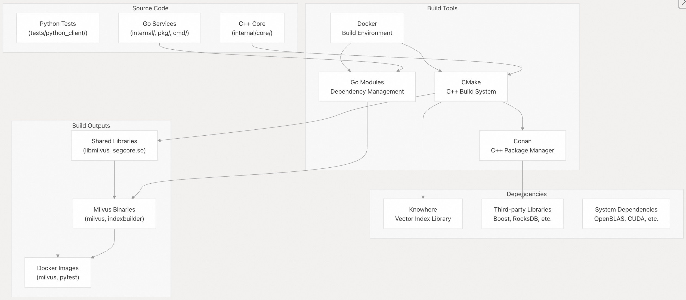
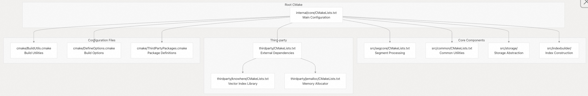
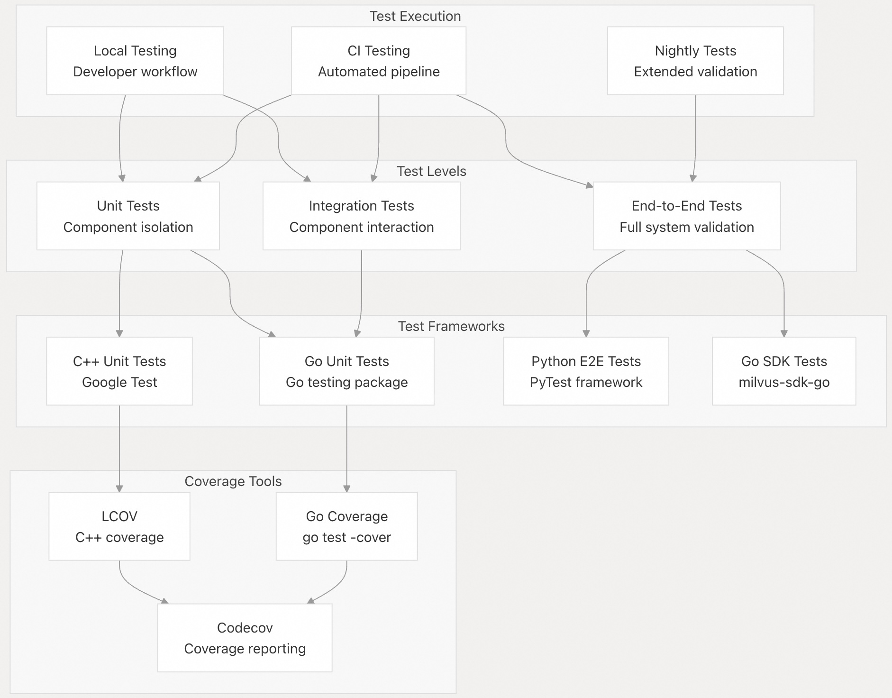
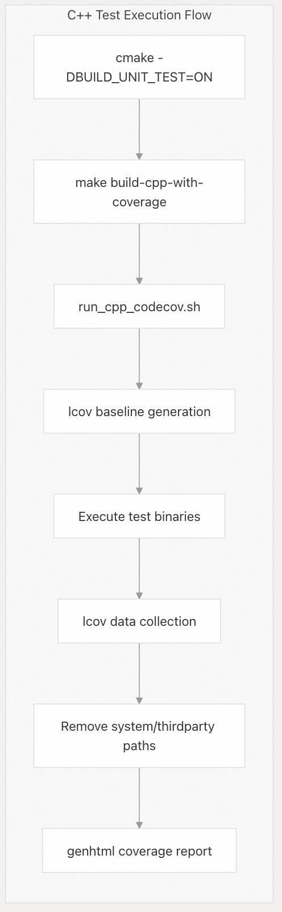
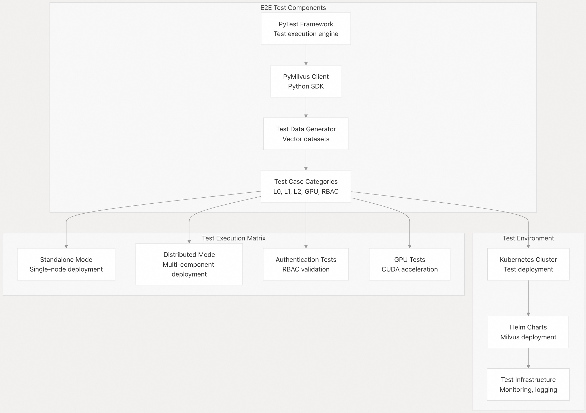
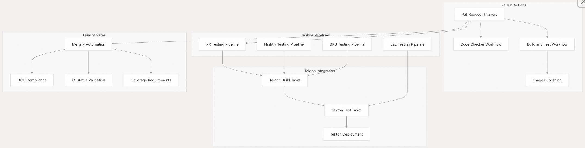
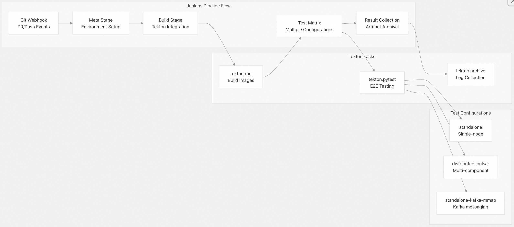
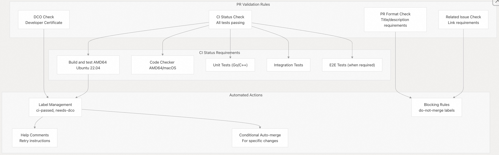
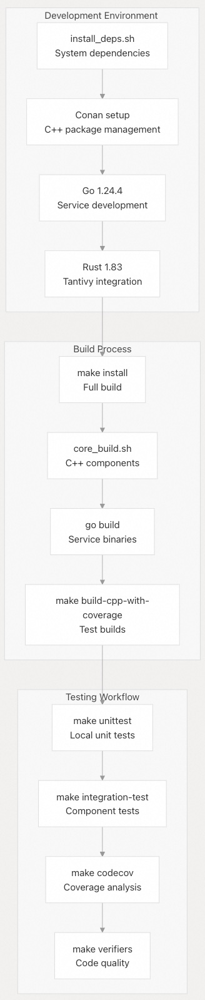
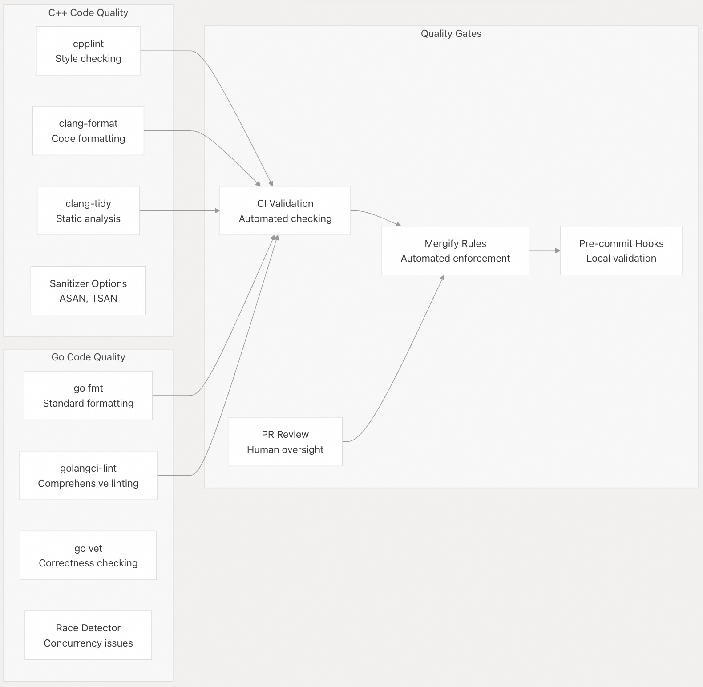

## Milvus 源码学习: 7 开发与测试  
                                                          
### 作者                                                         
digoal                                                        
                                                       
### 日期                                                      
2025-10-28                                                      
                                                        
### 标签                                                        
Milvus , 源码学习                                                         
                                                        
----                                                        
                                                        
## 背景      
本文介绍 Milvus 的开发工作流程、构建过程和测试基础设施。分享关于从源代码构建 Milvus、运行各种测试套件以及理解持续集成流水线的全面信息。  
  
## 构建系统架构  
  
Milvus 采用多语言构建系统，结合了用于 C++ 组件的 CMake、用于服务组件的 Go 模块，以及用于依赖项的各种包管理器。构建过程使用 Docker 进行容器化，以确保不同平台间的环境一致性。  
  
### 构建系统概览  
  
  
  
构建系统通过主构建脚本 `core_build.sh` 进行协调，该脚本处理：  
  
* 通过 Conan 进行依赖项解析  
* 使用 CMake 进行 C++ 编译  
* Go 服务编译  
* Docker 镜像创建  
  
来源:  
- [`scripts/core_build.sh` 1-308](https://github.com/milvus-io/milvus/blob/18371773/scripts/core_build.sh#L1-L308)  
- [`internal/core/CMakeLists.txt` 1-338](https://github.com/milvus-io/milvus/blob/18371773/internal/core/CMakeLists.txt#L1-L338)  
- [`internal/core/thirdparty/CMakeLists.txt` 1-51](https://github.com/milvus-io/milvus/blob/18371773/internal/core/thirdparty/CMakeLists.txt#L1-L51)  
  
### CMake 配置结构  
  
  
  
CMake 系统通过在 `DefineOptions.cmake` 中定义的编译时选项(compile-time options)支持多种构建配置：  
  
* `BUILD_UNIT_TEST`: 启用 C++ 单元测试  
* `BUILD_COVERAGE`: 启用代码覆盖率报告  
* `MILVUS_GPU_VERSION`: 构建时包含 GPU 支持  
* `USE_ASAN`: 启用 AddressSanitizer 进行调试  
* `BUILD_DISK_ANN`: 启用基于磁盘的向量索引  
  
来源:  
- [`internal/core/CMakeLists.txt` 17-338](https://github.com/milvus-io/milvus/blob/18371773/internal/core/CMakeLists.txt#L17-L338)  
- [`internal/core/src/segcore/CMakeLists.txt` 1-22](https://github.com/milvus-io/milvus/blob/18371773/internal/core/src/segcore/CMakeLists.txt#L1-L22)  
- [`internal/core/src/common/CMakeLists.txt` 1-14](https://github.com/milvus-io/milvus/blob/18371773/internal/core/src/common/CMakeLists.txt#L1-L14)  
- [`internal/core/cmake/BuildUtils.cmake` 1-2](https://github.com/milvus-io/milvus/blob/18371773/internal/core/cmake/BuildUtils.cmake#L1-L2)  
  
### Docker 构建环境  
  
Milvus 使用容器化的构建环境来确保跨不同平台的可复现构建：  
  
| 环境 | 基础镜像 | 目的 | 关键组件 |  
| --- | --- | --- | --- |  
| Ubuntu 20.04 | `ubuntu:focal-20220426` | 主要开发 | GCC、CMake、Conan、Go 1.24.4 |  
| Ubuntu 22.04 | `ubuntu:jammy-20240530` | 最新稳定版 | GCC-12、CMake 3.31、Rust 1.83 |  
| Amazon Linux 2023 | `amazonlinux:2023` | 企业部署 | RHEL 兼容工具 |  
| Rocky Linux 8 | `rockylinux/rockylinux:8` | 企业替代方案 | 基于 RPM 的包管理 |  
| GPU Ubuntu 20.04 | `nvidia/cuda:11.8.0-devel-ubuntu20.04` | CUDA 开发 | NVIDIA CUDA 工具包 |  
  
每个构建器镜像包含：  
  
* **开发工具**: GCC/G++、CMake、Ninja、Git、Make  
* **语言运行时**: Go 1.24.4、Python 3、Rust 1.83  
* **包管理器**: Conan 1.64.1、vcpkg  
* **库**: OpenBLAS、Azure SDK、Google Test  
  
来源:  
- [`build/docker/builder/cpu/ubuntu20.04/Dockerfile` 1-62](https://github.com/milvus-io/milvus/blob/18371773/build/docker/builder/cpu/ubuntu20.04/Dockerfile#L1-L62)  
- [`build/docker/builder/cpu/ubuntu22.04/Dockerfile` 1-68](https://github.com/milvus-io/milvus/blob/18371773/build/docker/builder/cpu/ubuntu22.04/Dockerfile#L1-L68)  
- [`build/docker/builder/gpu/ubuntu20.04/Dockerfile` 1-96](https://github.com/milvus-io/milvus/blob/18371773/build/docker/builder/gpu/ubuntu20.04/Dockerfile#L1-L96)  
  
## 测试基础设施  
  
Milvus 实现了全面的测试策略，包含多个测试级别和框架，覆盖 C++ 核心组件和 Go 服务。  
  
### 测试架构概览  
  
  
  
来源:  
- [`scripts/run_cpp_codecov.sh` 1-105](https://github.com/milvus-io/milvus/blob/18371773/scripts/run_cpp_codecov.sh#L1-L105)  
- [`.github/workflows/main.yaml` 114-314](https://github.com/milvus-io/milvus/blob/18371773/.github/workflows/main.yaml#L114-L314)  
  
### C++ 单元测试框架  
  
C++ 核心使用 Google Test 框架，并通过 `run_cpp_codecov.sh` 脚本管理自定义测试执行：  
  
  
  
测试执行脚本执行以下操作：  
  
1. **基线生成 (Baseline Generation)**: 使用 `lcov -c -i` 创建初始覆盖率数据  
2. **测试执行 (Test Execution)**: 运行 `internal/core/output/unittest/` 中的所有二进制文件  
3. **覆盖率收集 (Coverage Collection)**: 使用 `lcov -c -d` 捕获运行时覆盖率  
4. **数据过滤 (Data Filtering)**: 从覆盖率中移除系统和第三方路径  
5. **报告生成 (Report Generation)**: 创建 HTML 覆盖率报告  
  
关键测试配置选项：  
  
* `BUILD_COVERAGE=ON`: 启用 `-fprofile-arcs -ftest-coverage` 标志  
* `USE_ASAN=ON`: 启用 AddressSanitizer 进行内存错误检测  
* 测试二进制文件在输出目录中自动发现  
  
来源:  
- [`scripts/run_cpp_codecov.sh` 34-105](https://github.com/milvus-io/milvus/blob/18371773/scripts/run_cpp_codecov.sh#L34-L105)  
- [`internal/core/CMakeLists.txt` 261-267](https://github.com/milvus-io/milvus/blob/18371773/internal/core/CMakeLists.txt#L261-L267)  
  
### Go 测试框架  
  
Go 服务使用标准的 Go 测试包，并附加了集成测试支持：  
  
| 测试类型 | 模式 | 执行 | 目的 |  
| --- | --- | --- | --- |  
| 单元测试 | `*_test.go` | `go test ./...` | 组件测试 |  
| 集成测试 | `tests/integration/` | `make integration-test` | 服务交互 |  
| 基准测试 | `*_bench_test.go` | `go test -bench=.` | 性能验证 |  
  
测试过程包括：  
  
* **并行执行 (Parallel Execution)**: 测试使用 `-p` 标志并行运行  
* **覆盖率收集 (Coverage Collection)**: 使用 `go test -cover` 进行覆盖率报告  
* **竞态检测 (Race Detection)**: 在 CI 环境中使用 `-race` 标志运行  
* **超时处理 (Timeout Handling)**: 配置超时以防止测试挂起  
  
集成测试需要外部依赖项：  
  
* **Pulsar**: 消息队列服务  
* **Etcd**: 元数据存储  
* **MinIO**: 对象存储  
* **Azure/GCP**: 云存储服务（启用时）  
  
来源:  
- [`.github/workflows/main.yaml` 169-270](https://github.com/milvus-io/milvus/blob/18371773/.github/workflows/main.yaml#L169-L270)  
  
### 端到端 (E2E, end-to-end) 测试框架  
  
E2E 测试使用 Python 和 PyTest 框架来验证完整的系统功能：  
  
  
  
E2E 测试配置包括：  
  
* **测试类别**: L0（基础）、L1（功能）、L2（压力）、GPU、RBAC  
* **部署选项**: 独立 (Standalone)、分布式-Pulsar、分布式-Kafka  
* **并行执行**: 使用 `-n` 参数配置并行度  
* **超时控制**: 单个测试和全局超时配置  
  
来源:  
- [`tests/docker/.env` 1-8](https://github.com/milvus-io/milvus/blob/18371773/tests/docker/.env#L1-L8)  
- [`ci/jenkins/Nightly.groovy` 213-232](https://github.com/milvus-io/milvus/blob/18371773/ci/jenkins/Nightly.groovy#L213-L232)  
  
## CI/CD 流水线架构  
  
Milvus 采用混合 CI/CD 方法，使用 GitHub Actions 和 Jenkins 来处理开发工作流程的不同方面。  
  
### CI/CD 系统概览  
  
  
  
来源:  
- [`.github/workflows/main.yaml` 1-314](https://github.com/milvus-io/milvus/blob/18371773/.github/workflows/main.yaml#L1-L314)  
- [`ci/jenkins/PR.groovy` 1-147](https://github.com/milvus-io/milvus/blob/18371773/ci/jenkins/PR.groovy#L1-L147)  
- [`.github/mergify.yml` 1-576](https://github.com/milvus-io/milvus/blob/18371773/.github/mergify.yml#L1-L576)  
  
### GitHub Actions 工作流程  
  
GitHub Actions 处理代码质量检查和基本构建验证：  
  
| 工作流程 | 触发器 | 目的 | 关键步骤 |  
| --- | --- | --- | --- |  
| `main.yaml` | Push/PR | 构建和单元测试 | 构建 C++、Go 单元测试、集成测试 |  
| `code-checker.yaml` | Push/PR | 代码质量 | Linting、格式化、静态分析 |  
| `mac.yaml` | Push/PR | macOS 兼容性 | 跨平台构建验证 |  
| `publish-builder.yaml` | 构建器更改 | 更新构建镜像 | 多架构 Docker 构建 |  
  
主要工作流程执行：  
  
1. **构建步骤 (Build Step)**: 使用 `USE_ASAN=OFF` 编译 C++ 核心和 Go 服务  
2. **单元测试 (Unit Testing)**: 并行运行 C++ 和 Go 单元测试  
3. **集成测试 (Integration Testing)**: 验证组件交互  
4. **覆盖率报告 (Coverage Reporting)**: 上传覆盖率数据到 Codecov  
  
工作流程配置支持：  
  
* **矩阵构建 (Matrix Builds)**: 多种操作系统和架构组合  
* **缓存 (Caching)**: Conan 和 Go 模块缓存以加快构建速度  
* **构建产物 (Artifacts)**: 保留构建产物和测试结果  
* **并发控制 (Concurrency)**: 自动取消过时的构建  
  
来源:  
- [`.github/workflows/main.yaml` 44-314](https://github.com/milvus-io/milvus/blob/18371773/.github/workflows/main.yaml#L44-L314)  
- [`.github/workflows/code-checker.yaml` 36-133](https://github.com/milvus-io/milvus/blob/18371773/.github/workflows/code-checker.yaml#L36-L133)  
  
### Jenkins 流水线集成  
  
Jenkins 流水线处理包括 E2E 验证在内的全面测试：  
  
  
  
Jenkins 流水线特性：  
  
* **Tekton 集成**: 使用 Tekton 进行 Kubernetes 原生 CI/CD  
* **矩阵测试 (Matrix Testing)**: 跨多个配置并行执行  
* **资源管理 (Resource Management)**: CPU 和内存限制以实现稳定执行  
* **构建产物管理 (Artifact Management)**: 全面的日志和结果收集  
* **超时处理 (Timeout Handling)**: 可配置的超时和自动清理  
  
关键 Jenkins 流水线文件：  
  
* `PR.groovy`: Pull Request 验证流水线  
* `Nightly.groovy`: 全面夜间测试  
* `UT-CPP.groovy`: 专用的 C++ 单元测试  
* `PRGPU.groovy`: GPU 特定测试流水线  
  
来源:  
- [`ci/jenkins/PR.groovy` 1-147](https://github.com/milvus-io/milvus/blob/18371773/ci/jenkins/PR.groovy#L1-L147)  
- [`ci/jenkins/Nightly.groovy` 1-298](https://github.com/milvus-io/milvus/blob/18371773/ci/jenkins/Nightly.groovy#L1-L298)  
- [`ci/jenkins/UT-CPP.groovy` 1-75](https://github.com/milvus-io/milvus/blob/18371773/ci/jenkins/UT-CPP.groovy#L1-L75)  
  
### Mergify 自动化  
  
Mergify 提供自动化 PR 管理和质量门禁(quality gate)强制执行：  
  
  
  
Mergify 规则包括：  
  
* **DCO 强制执行 (DCO Enforcement)**: 确保所有提交都已签名  
* **CI 状态验证 (CI Status Validation)**: 要求通过多个 CI 系统的状态检查  
* **PR 格式规则 (PR Format Rules)**: 强制执行标题模式（如 `feat:`、`fix:`、`enhance:` 等）  
* **问题链接 (Issue Linking)**: 要求实质性更改关联 GitHub 问题  
* **自动重试命令 (Auto-retry Commands)**: 提供命令来重试失败的 CI 作业  
  
该系统支持在过渡期间接受传统和新 CI 系统的状态，以实现 CI 系统间的迁移。  
  
来源:  
- [`.github/mergify.yml` 10-576](https://github.com/milvus-io/milvus/blob/18371773/.github/mergify.yml#L10-L576)  
  
## 开发工作流程  
  
Milvus 的开发工作流程集成了本地开发与全面的 CI/CD 流水线，以确保代码质量和系统可靠性。  
  
### 本地开发环境设置  
  
开发人员可以使用提供的依赖项安装脚本设置完整的构建环境：  
  
  
  
开发环境设置支持多种平台：  
  
* **Linux**: Ubuntu 20.04/22.04、CentOS 7、Amazon Linux 2023  
* **macOS**: macOS 13+ 和 Homebrew 包管理  
* **Windows**: MSYS2 环境和 MinGW-w64  
  
平台特定的依赖项安装：  
  
* **Linux**: 使用 `apt` 或 `yum` 包管理器  
* **macOS**: 使用 Homebrew 安装大部分依赖项  
* **Windows**: 在 MSYS2 环境中使用 pacman  
  
来源:  
- [`scripts/install_deps.sh` 19-104](https://github.com/milvus-io/milvus/blob/18371773/scripts/install_deps.sh#L19-L104)  
- [`scripts/install_deps_msys.sh` 1-49](https://github.com/milvus-io/milvus/blob/18371773/scripts/install_deps_msys.sh#L1-L49)  
- [`scripts/core_build.sh` 79-308](https://github.com/milvus-io/milvus/blob/18371773/scripts/core_build.sh#L79-L308)  
  
### 基于容器的开发  
  
为了一致的开发环境，支持基于 Docker 的开发：  
  
| 开发镜像 | 目的 | 关键工具 |  
| --- | --- | --- |  
| `milvusdb/milvus-env:ubuntu20.04-*` | 主要开发 | 构建工具、调试 |  
| `milvusdb/milvus-env:ubuntu22.04-*` | 最新环境 | 现代工具链 |  
| `milvusdb/milvus-env:gpu-ubuntu22.04-*` | GPU 开发 | CUDA 工具包、GPU 调试 |  
  
容器开发特性：  
  
* **卷挂载 (Volume Mounting)**: 源代码和构建缓存持久化  
* **IDE 集成**: VSCode Dev Container 支持  
* **调试支持 (Debugging Support)**: GDB、AddressSanitizer 集成  
* **热重载 (Hot Reload)**: 文件监控以实现快速开发周期  
  
来源:  
- [`build/docker/builder/cpu/ubuntu20.04/Dockerfile` 49-51](https://github.com/milvus-io/milvus/blob/18371773/build/docker/builder/cpu/ubuntu20.04/Dockerfile#L49-L51)  
- [`build/docker/builder/gpu/ubuntu22.04/Dockerfile` 33-35](https://github.com/milvus-io/milvus/blob/18371773/build/docker/builder/gpu/ubuntu22.04/Dockerfile#L33-L35)  
  
### 代码质量标准  
  
Milvus 通过自动化工具强制执行全面的代码质量标准：  
  
  
  
代码质量强制执行包括：  
  
* **格式化标准 (Formatting Standards)**: 所有语言的一致代码格式  
* **Linting 规则 (Linting Rules)**: 全面的风格和最佳实践检查  
* **静态分析 (Static Analysis)**: 潜在错误和安全问题的检测  
* **测试覆盖率 (Test Coverage)**: 新代码的最低覆盖率要求  
* **文档 (Documentation)**: 公共 API 文档要求  
  
来源:  
- [`internal/core/CMakeLists.txt` 186-253](https://github.com/milvus-io/milvus/blob/18371773/internal/core/CMakeLists.txt#L186-L253)  
- [`.github/workflows/code-checker.yaml` 59-64](https://github.com/milvus-io/milvus/blob/18371773/.github/workflows/code-checker.yaml#L59-L64)  
  
    
#### [期望 PostgreSQL|开源PolarDB 增加什么功能?](https://github.com/digoal/blog/issues/76 "269ac3d1c492e938c0191101c7238216")
  
  
#### [PolarDB 开源数据库](https://openpolardb.com/home "57258f76c37864c6e6d23383d05714ea")
  
  
#### [PolarDB 学习图谱](https://www.aliyun.com/database/openpolardb/activity "8642f60e04ed0c814bf9cb9677976bd4")
  
  
#### [PostgreSQL 解决方案集合](../201706/20170601_02.md "40cff096e9ed7122c512b35d8561d9c8")
  
  
#### [德哥 / digoal's Github - 公益是一辈子的事.](https://github.com/digoal/blog/blob/master/README.md "22709685feb7cab07d30f30387f0a9ae")
  
  
#### [About 德哥](https://github.com/digoal/blog/blob/master/me/readme.md "a37735981e7704886ffd590565582dd0")
  
  

  
