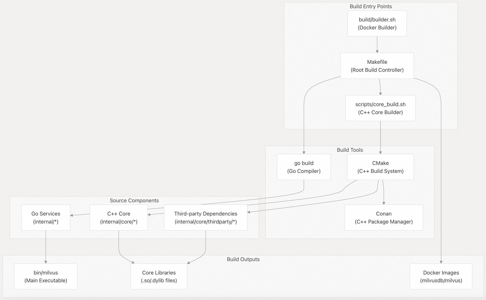
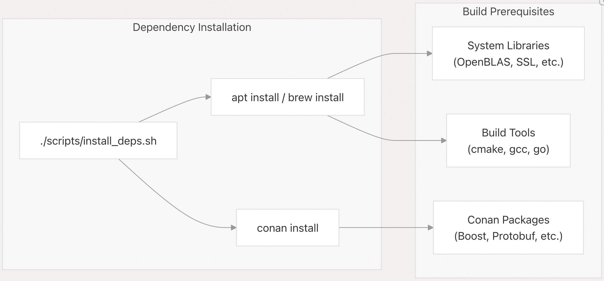
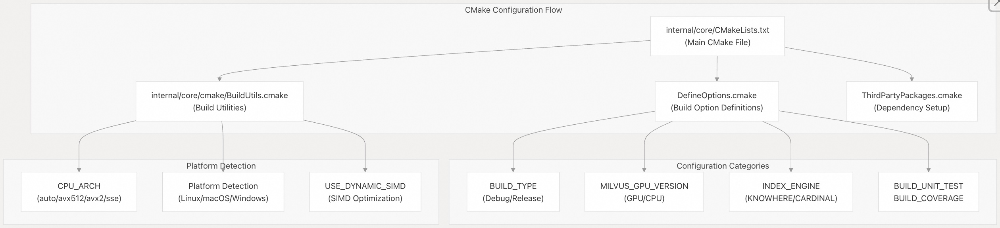
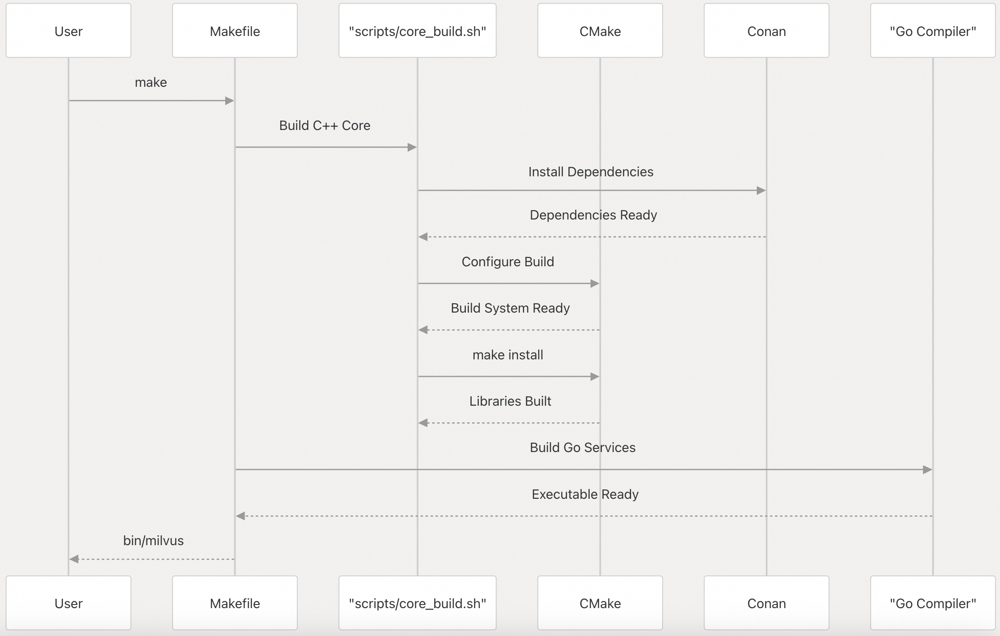
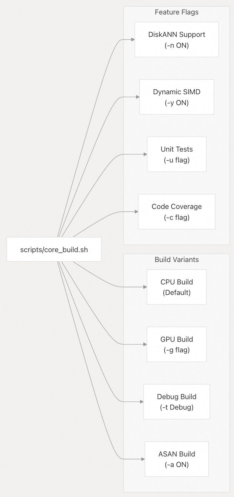
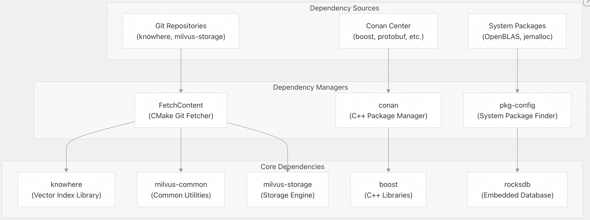
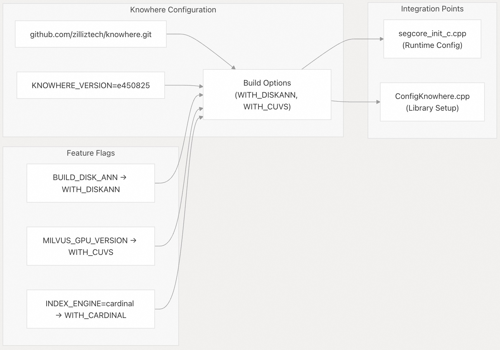
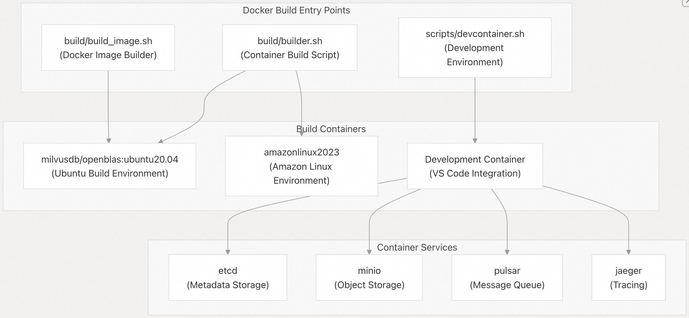
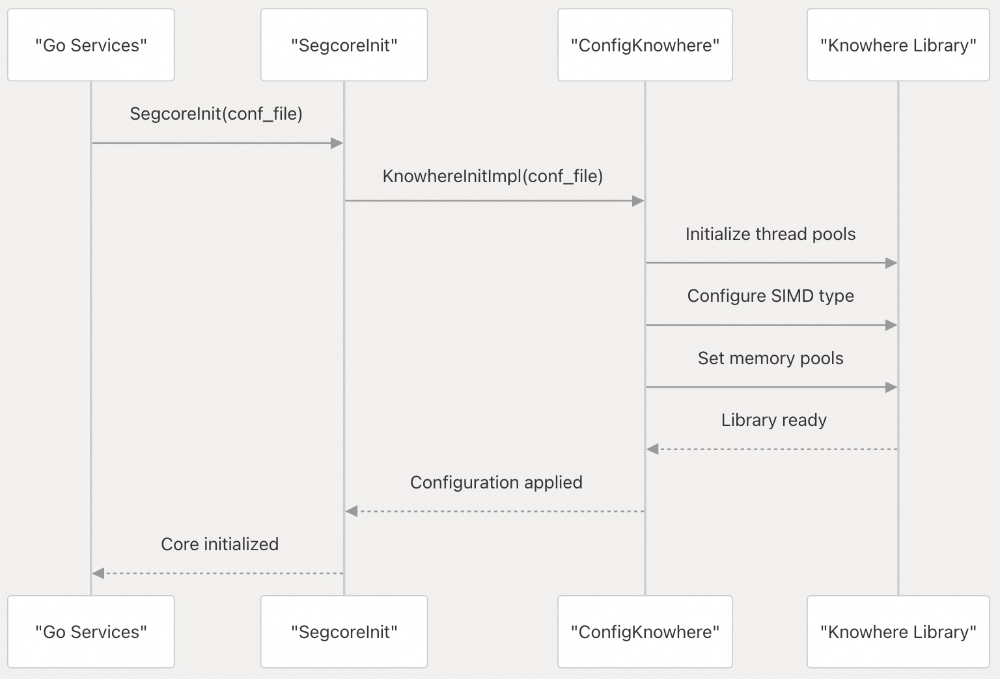

## Milvus 源码学习: 7.1 构建系统(Build System)  
                                                            
### 作者                                                           
digoal                                                          
                                                         
### 日期                                                        
2025-10-28                                                        
                                                          
### 标签                                                          
Milvus , 源码学习                                                           
                                                          
----                                                          
                                                          
## 背景        
Milvus 构建系统管理着一个混合 Go/C++ 代码库的编译和链接，其中包含大量的第三方依赖项。本文介绍构建架构、依赖项管理、配置选项以及本地和容器化环境的构建过程。  
  
## 构建架构  
  
Milvus 使用多层构建系统，协调 Go 和 C++ 编译以及第三方依赖项管理：  
  
    
  
**来源:**  
- [`README.md` 190-203](https://github.com/milvus-io/milvus/blob/18371773/README.md#L190-L203)  
- [`DEVELOPMENT.md` 183-213](https://github.com/milvus-io/milvus/blob/18371773/DEVELOPMENT.md#L183-L213)  
- [`scripts/core_build.sh` 1-308](https://github.com/milvus-io/milvus/blob/18371773/scripts/core_build.sh#L1-L308)  
- [`build/README.md` 1-210](https://github.com/milvus-io/milvus/blob/18371773/build/README.md#L1-L210)  
  
## 构建工具和依赖项  
  
### 核心构建工具  
  
构建系统需要几个基本的工具，并有特定的版本要求：  
  
| 工具 | 最低版本 | 目的 |  
| --- | --- | --- |  
| `go` | 1.21 | Go 服务编译 |  
| `cmake` | 3.18 | C++ 构建系统 |  
| `gcc`/`clang` | 12/15 | C++ 编译器 |  
| `conan` | 1.61 | C++ 包管理 |  
  
    
  
**来源:**  
- [`DEVELOPMENT.md` 94-175](https://github.com/milvus-io/milvus/blob/18371773/DEVELOPMENT.md#L94-L175)  
- [`scripts/README.md` 13-39](https://github.com/milvus-io/milvus/blob/18371773/scripts/README.md#L13-L39)  
- [`README.md` 165-174](https://github.com/milvus-io/milvus/blob/18371773/README.md#L165-L174)  
  
### CMake 配置系统  
  
C++ 核心使用 CMake，并通过 [`internal/core/CMakeLists.txt` 17-338](https://github.com/milvus-io/milvus/blob/18371773/internal/core/CMakeLists.txt#L17-L338) 管理广泛的配置选项：  
  
    
  
**来源:**  
- [`internal/core/CMakeLists.txt` 17-338](https://github.com/milvus-io/milvus/blob/18371773/internal/core/CMakeLists.txt#L17-L338)  
- [`internal/core/cmake/BuildUtils.cmake` 1-250](https://github.com/milvus-io/milvus/blob/18371773/internal/core/cmake/BuildUtils.cmake#L1-L250)  
- [`scripts/core_build.sh` 90-107](https://github.com/milvus-io/milvus/blob/18371773/scripts/core_build.sh#L90-L107)  
  
## 构建过程  
  
### 本地构建过程  
  
主构建过程通过根 `Makefile` 和核心构建脚本进行协调：  
  
    
  
[`DEVELOPMENT.md` 189-213](https://github.com/milvus-io/milvus/blob/18371773/DEVELOPMENT.md#L189-L213) 中的关键构建命令：  
  
* `make` - 完整构建（C++ 核心 + Go 服务）  
* `make SKIP_3RDPARTY=1` - 跳过依赖项检查以加快重建速度  
* `./scripts/install_deps.sh` - 安装构建依赖项  
  
**来源:**  
- [`DEVELOPMENT.md` 183-213](https://github.com/milvus-io/milvus/blob/18371773/DEVELOPMENT.md#L183-L213)  
- [`README.md` 190-203](https://github.com/milvus-io/milvus/blob/18371773/README.md#L190-L203)  
- [`scripts/core_build.sh` 240-308](https://github.com/milvus-io/milvus/blob/18371773/scripts/core_build.sh#L240-L308)  
  
### 构建配置选项  
  
[`scripts/core_build.sh` 108-190](https://github.com/milvus-io/milvus/blob/18371773/scripts/core_build.sh#L108-L190) 脚本接受众多配置标志：  
  
| 标志 | 描述 | 默认值 |  
| --- | --- | --- |  
| `-t BUILD_TYPE` | 构建类型 (Debug/Release) | Release |  
| `-g` | 启用 GPU 版本 | OFF |  
| `-u` | 构建单元测试 | OFF |  
| `-s CUDA_ARCH` | CUDA 架构 | DEFAULT |  
| `-n BUILD_DISK_ANN` | 启用 DiskANN 索引 | OFF |  
| `-a USE_ASAN` | Address Sanitizer | OFF |  
| `-y USE_DYNAMIC_SIMD` | 动态 SIMD | ON |  
  
    
  
**来源:**  
- [`scripts/core_build.sh` 108-190](https://github.com/milvus-io/milvus/blob/18371773/scripts/core_build.sh#L108-L190)  
- [`DEVELOPMENT.md` 185](https://github.com/milvus-io/milvus/blob/18371773/DEVELOPMENT.md#L185-L185)  
  
## 第三方依赖项  
  
### 依赖项管理架构  
  
Milvus 通过结合 Conan、FetchContent 和 git 子模块的分层系统来管理第三方依赖项：  
  
    
  
### 关键第三方组件  
  
[`internal/core/thirdparty/CMakeLists.txt` 32-50](https://github.com/milvus-io/milvus/blob/18371773/internal/core/thirdparty/CMakeLists.txt#L32-L50) 文件协调依赖项构建：  
  
1. **Knowhere** - 向量索引和搜索库  
2. **milvus-common** - 通用工具和数据结构  
3. **milvus-storage** - 存储层抽象  
4. **RocksDB** - 嵌入式键值数据库  
5. **jemalloc** - 内存分配器（仅限 Linux）  
  
**来源:**  
- [`internal/core/thirdparty/CMakeLists.txt` 25-51](https://github.com/milvus-io/milvus/blob/18371773/internal/core/thirdparty/CMakeLists.txt#L25-L51)  
- [`internal/core/thirdparty/knowhere/CMakeLists.txt` 14-66](https://github.com/milvus-io/milvus/blob/18371773/internal/core/thirdparty/knowhere/CMakeLists.txt#L14-L66)  
- [`internal/core/thirdparty/jemalloc/CMakeLists.txt` 14-88](https://github.com/milvus-io/milvus/blob/18371773/internal/core/thirdparty/jemalloc/CMakeLists.txt#L14-L88)  
  
### Knowhere 集成  
  
Knowhere，核心向量索引库，通过 [`internal/core/thirdparty/knowhere/CMakeLists.txt` 15-66](https://github.com/milvus-io/milvus/blob/18371773/internal/core/thirdparty/knowhere/CMakeLists.txt#L15-L66) 集成：  
  
    
  
**来源:**  
- [`internal/core/thirdparty/knowhere/CMakeLists.txt` 15-66](https://github.com/milvus-io/milvus/blob/18371773/internal/core/thirdparty/knowhere/CMakeLists.txt#L15-L66)  
- [`internal/core/src/segcore/segcore_init_c.cpp` 24-230](https://github.com/milvus-io/milvus/blob/18371773/internal/core/src/segcore/segcore_init_c.cpp#L24-L230)  
- [`internal/core/src/config/ConfigKnowhere.cpp` 30-133](https://github.com/milvus-io/milvus/blob/18371773/internal/core/src/config/ConfigKnowhere.cpp#L30-L133)  
  
## Docker 构建系统  
  
### 容器构建架构  
  
Milvus 提供了一个基于 Docker 的构建系统，用于跨环境的可复现构建：  
  
    
  
### 容器构建命令  
  
[`build/README.md` 63-77](https://github.com/milvus-io/milvus/blob/18371773/build/README.md#L63-L77) 中的关键 Docker 构建命令：  
  
* `build/builder.sh make` - 在容器中构建  
* `build/builder.sh make verifiers` - 运行验证检查  
* `build/builder.sh make unittest` - 运行单元测试  
* `export OS_NAME=amazonlinux2023` - 选择构建操作系统  
  
**来源:**  
- [`build/README.md` 59-77](https://github.com/milvus-io/milvus/blob/18371773/build/README.md#L59-L77)  
- [`build/README.md` 78-131](https://github.com/milvus-io/milvus/blob/18371773/build/README.md#L78-L131)  
- [`DEVELOPMENT.md` 31-34](https://github.com/milvus-io/milvus/blob/18371773/DEVELOPMENT.md#L31-L34)  
  
## 配置与初始化  
  
### 运行时配置系统  
  
C++ 核心使用一个配置系统，将 Go 配置桥接到 C++ 运行时设置：  
  
    
  
[`internal/core/src/segcore/segcore_init_c.h` 24-123](https://github.com/milvus-io/milvus/blob/18371773/internal/core/src/segcore/segcore_init_c.h#L24-L123) 中的关键配置函数：  
  
* `SegcoreInit()` - 使用配置文件初始化核心  
* `SegcoreSetSimdType()` - 配置 SIMD 指令集  
* `SegcoreSetKnowhereBuildThreadPoolNum()` - 设置构建线程池大小  
* `SegcoreSetKnowhereSearchThreadPoolNum()` - 设置搜索线程池大小  
  
**来源:**  
- [`internal/core/src/segcore/segcore_init_c.cpp` 24-230](https://github.com/milvus-io/milvus/blob/18371773/internal/core/src/segcore/segcore_init_c.cpp#L24-L230)  
- [`internal/core/src/segcore/segcore_init_c.h` 24-123](https://github.com/milvus-io/milvus/blob/18371773/internal/core/src/segcore/segcore_init_c.h#L24-L123)  
- [`internal/core/src/config/ConfigKnowhere.cpp` 30-133](https://github.com/milvus-io/milvus/blob/18371773/internal/core/src/config/ConfigKnowhere.cpp#L30-L133)  
  
### 平台特定配置  
  
构建系统自动检测和配置平台特定设置：  
  
| 平台 | 配置 | 目的 |  
| --- | --- | --- |  
| Linux x86_64 | AVX/SSE 检测 | SIMD 优化 |  
| Linux aarch64 | `--with-lg-page=16` | 64KB 页大小支持 |  
| macOS Intel | LLVM/Clang 设置 | Apple 工具链 |  
| macOS Apple Silicon | ARM64 配置 | 原生 Apple Silicon |  
  
**来源:**  
- [`scripts/core_build.sh` 34-77](https://github.com/milvus-io/milvus/blob/18371773/scripts/core_build.sh#L34-L77)  
- [`DEVELOPMENT.md` 463-516](https://github.com/milvus-io/milvus/blob/18371773/DEVELOPMENT.md#L463-L516)  
- [`internal/core/thirdparty/jemalloc/CMakeLists.txt` 47-50](https://github.com/milvus-io/milvus/blob/18371773/internal/core/thirdparty/jemalloc/CMakeLists.txt#L47-L50)  
  
    
#### [期望 PostgreSQL|开源PolarDB 增加什么功能?](https://github.com/digoal/blog/issues/76 "269ac3d1c492e938c0191101c7238216")
  
  
#### [PolarDB 开源数据库](https://openpolardb.com/home "57258f76c37864c6e6d23383d05714ea")
  
  
#### [PolarDB 学习图谱](https://www.aliyun.com/database/openpolardb/activity "8642f60e04ed0c814bf9cb9677976bd4")
  
  
#### [PostgreSQL 解决方案集合](../201706/20170601_02.md "40cff096e9ed7122c512b35d8561d9c8")
  
  
#### [德哥 / digoal's Github - 公益是一辈子的事.](https://github.com/digoal/blog/blob/master/README.md "22709685feb7cab07d30f30387f0a9ae")
  
  
#### [About 德哥](https://github.com/digoal/blog/blob/master/me/readme.md "a37735981e7704886ffd590565582dd0")
  
  

  
