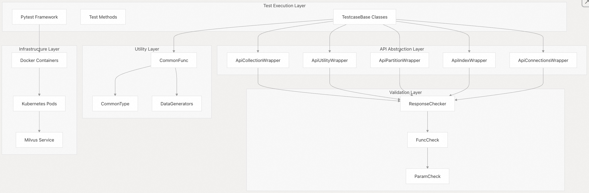
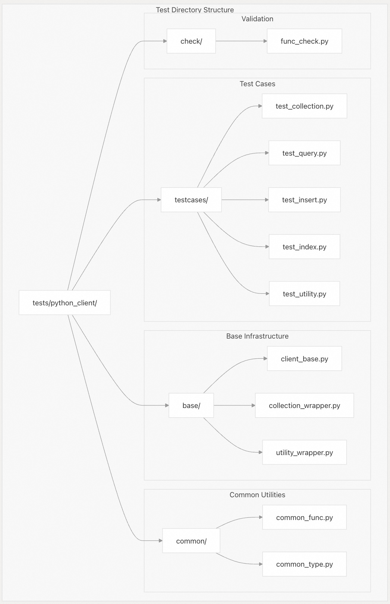
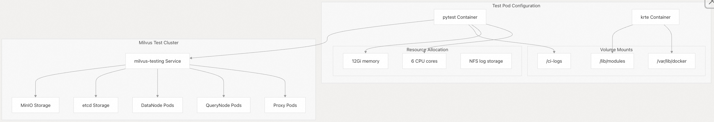

## Milvus 源码学习: 7.2 测试框架(Testing Framework)  
                                                              
### 作者                                                             
digoal                                                            
                                                           
### 日期                                                          
2025-10-29                                                          
                                                            
### 标签                                                            
Milvus , 源码学习                                                             
                                                            
----                                                            
                                                            
## 背景          
本文介绍 Milvus 综合测试框架，它提供了自动化测试能力，用于验证功能、性能和集成场景。该框架主要由基于 Python 的测试套件和广泛的 CI/CD 集成组成。  
  
## 测试框架架构  
  
Milvus 测试框架遵循分层架构，将测试逻辑、API 抽象和基础设施管理分离开来：  
  
### 核心测试堆栈  
  
  
  
**来源:**  
- [`tests/python_client/base/client_base.py` 1-50](https://github.com/milvus-io/milvus/blob/18371773/tests/python_client/base/client_base.py#L1-L50)  
- [`tests/python_client/check/func_check.py` 1-50](https://github.com/milvus-io/milvus/blob/18371773/tests/python_client/check/func_check.py#L1-L50)  
- [`tests/python_client/common/common_func.py` 1-50](https://github.com/milvus-io/milvus/blob/18371773/tests/python_client/common/common_func.py#L1-L50)  
  
### 测试组织结构  
  
  
  
**来源:**  
- [`tests/python_client/testcases/test_collection.py` 1-25](https://github.com/milvus-io/milvus/blob/18371773/tests/python_client/testcases/test_collection.py#L1-L25)  
- [`tests/python_client/base/client_base.py` 1-25](https://github.com/milvus-io/milvus/blob/18371773/tests/python_client/base/client_base.py#L1-L25)  
- [`tests/python_client/common/common_func.py` 1-25](https://github.com/milvus-io/milvus/blob/18371773/tests/python_client/common/common_func.py#L1-L25)  
  
## 测试基类和封装器  
  
### TestcaseBase 类  
  
`TestcaseBase` 类是所有测试用例的基础，提供通用的设置、清理和实用方法：  
  
**主要职责：**  
* 连接管理和清理  
* Collection（集合）生命周期管理  
* 资源组管理  
* 测试环境初始化  
  
**核心方法：**  
* `setup_method()`: 初始化测试对象和连接  
* `teardown_method()`: 清理资源和 Collection  
* `init_collection_general()`: 使用默认配置创建 Collection  
* `init_collection_wrap()`: 创建 Collection 封装器用于测试  
  
**来源:**  
- [`tests/python_client/base/client_base.py` 24-100](https://github.com/milvus-io/milvus/blob/18371773/tests/python_client/base/client_base.py#L24-L100)  
  
### API 封装器类  
  
该框架提供了封装器类，用于抽象 Milvus API 调用并添加特定于测试的功能：  
  
| 封装器类 | 目的 | 关键方法 |  
| --- | --- | --- |  
| `ApiCollectionWrapper` | Collection 操作 | `init_collection()`、`insert()`、`search()`、`query()` |  
| `ApiUtilityWrapper` | 实用工具操作 | `loading_progress()`、`index_building_progress()` |  
| `ApiPartitionWrapper` | Partition（分区）操作 | `init_partition()`、`load()`、`release()` |  
| `ApiIndexWrapper` | Index（索引）操作 | `init_index()`、`drop()` |  
| `ApiConnectionsWrapper` | 连接管理 | `connect()`、`disconnect()`、`list_connections()` |  
  
**来源:**  
- [`tests/python_client/base/collection_wrapper.py` 24-50](https://github.com/milvus-io/milvus/blob/18371773/tests/python_client/base/collection_wrapper.py#L24-L50)  
- [`tests/python_client/base/utility_wrapper.py` 16-50](https://github.com/milvus-io/milvus/blob/18371773/tests/python_client/base/utility_wrapper.py#L16-L50)  
  
## 测试数据生成和验证  
  
### 数据生成框架  
  
测试框架包括全面的数据生成实用程序，用于创建测试数据集：  
  
**常见数据类型：**  
* 标量字段：`int8`、`int16`、`int32`、`int64`、`float`、`double`、`bool`、`varchar`  
* 向量字段：`FLOAT_VECTOR`、`BINARY_VECTOR`、`SPARSE_FLOAT_VECTOR`、`FLOAT16_VECTOR`、`BFLOAT16_VECTOR`  
* 复杂类型：`JSON`、`ARRAY` 字段  
* 文本处理：带有 BM25 和自定义分词器的全文搜索  
  
**关键生成器函数：**  
* `gen_default_collection_schema()`: 创建标准 Collection Schema（模式）  
* `gen_default_dataframe_data()`: 生成 pandas DataFrame 测试数据  
* `gen_vectors()`: 为不同维度创建向量数据  
* `gen_all_datatype_collection_schema()`: 创建包含所有支持字段类型的 Schema  
  
**来源:**  
- [`tests/python_client/common/common_func.py` 765-900](https://github.com/milvus-io/milvus/blob/18371773/tests/python_client/common/common_func.py#L765-L900)  
- [`tests/python_client/common/common_type.py` 61-120](https://github.com/milvus-io/milvus/blob/18371773/tests/python_client/common/common_type.py#L61-L120)  
  
### 响应验证系统  
  
`ResponseChecker` 类提供 API 响应的全面验证：  
  
**验证类型：**  
* 成功/失败状态检查  
* 错误代码和消息验证  
* 响应内容验证  
* 查询结果验证  
* 性能指标验证  
  
**检查任务：**  
* `check_collection_property`: 验证 Collection 元数据  
* `check_search_results`: 验证搜索结果准确性  
* `check_query_results`: 验证查询响应内容  
* `err_res`: 检查错误响应和消息  
  
**来源:**  
- [`tests/python_client/check/func_check.py` 27-134](https://github.com/milvus-io/milvus/blob/18371773/tests/python_client/check/func_check.py#L27-L134)  
  
## 测试执行环境  
  
### 基于容器的测试执行  
  
测试在专用的 Docker 容器中运行，提供隔离和可复现的环境：  
  
**Pytest 容器配置：**  
* 基础镜像：`harbor.milvus.io/dockerhub/milvusdb/pytest:20241023-3b024f9`  
* 通过 `requirements.txt` 管理 Python 依赖项  
* 资源分配：6 个 CPU 核心，12Gi 内存  
* 用于 CI 日志和工件存储的卷挂载  
  
**关键依赖项：**  
* `pytest==8.3.4` 及各种插件（`pytest-cov`、`pytest-xdist`、`pytest-rerunfailures`）  
* `pymilvus==2.6.0rc170` 用于 Milvus 客户端操作  
* 科学计算：`numpy`、`pandas`、`scikit-learn`  
* 文本处理：`jieba`、`bm25s`、`tantivy` 用于全文本搜索测试  
  
**来源:**  
- [`tests/python_client/requirements.txt` 1-85](https://github.com/milvus-io/milvus/blob/18371773/tests/python_client/requirements.txt#L1-L85)  
- [`ci/jenkins/pod/e2e.yaml` 10-25](https://github.com/milvus-io/milvus/blob/18371773/ci/jenkins/pod/e2e.yaml#L10-L25)  
  
### Kubernetes 测试编排  
  
  
  
**来源:**  
- [`ci/jenkins/pod/e2e.yaml` 1-85](https://github.com/milvus-io/milvus/blob/18371773/ci/jenkins/pod/e2e.yaml#L1-L85)  
- [`ci/jenkins/pod/rte.yaml` 1-84](https://github.com/milvus-io/milvus/blob/18371773/ci/jenkins/pod/rte.yaml#L1-L84)  
  
## 测试类别和结构  
  
### 功能测试类别  
  
测试套件根据功能组织成几个类别：  
  
| 测试类别 | 文件 | 关键测试类 | 目的 |  
| --- | --- | --- | --- |  
| Collection 管理 | `test_collection.py` | `TestCollectionParams`、`TestCollectionDataframe`、`TestLoadCollection` | Collection 的 CRUD、加载、DataFrame 集成 |  
| 查询操作 | `test_query.py` | `TestQueryParams` | 查询表达式解析、结果验证 |  
| 数据操作 | `test_insert.py`、`test_delete.py` | `TestInsertParams`、`TestDeleteParams` | 数据插入、删除、更新插入（upsert）操作 |  
| 索引管理 | `test_index.py` | `TestIndexParams`、`TestIndexOperation` | 索引创建、管理、优化 |  
| 实用功能 | `test_utility.py` | `TestUtilityParams` | 系统实用工具、资源管理 |  
| Compaction（压缩） | `test_compaction.py` | `TestCompactionParams` | 段（Segment）压缩和优化 |  
  
**来源:**  
- [`tests/python_client/testcases/test_collection.py` 56-100](https://github.com/milvus-io/milvus/blob/18371773/tests/python_client/testcases/test_collection.py#L56-L100)  
- [`tests/python_client/testcases/test_query.py` 60-100](https://github.com/milvus-io/milvus/blob/18371773/tests/python_client/testcases/test_query.py#L60-L100)  
- [`tests/python_client/testcases/test_insert.py` 32-80](https://github.com/milvus-io/milvus/blob/18371773/tests/python_client/testcases/test_insert.py#L32-L80)  
  
### 测试参数化和标签  
  
测试使用广泛的参数化和标签进行有组织的执行：  
  
**用例标签：**  
* `CaseLabel.L0`: 冒烟测试和关键功能  
* `CaseLabel.L1`: 核心功能测试  
* `CaseLabel.L2`: 扩展功能和边缘情况  
* `CaseLabel.L3`: 性能和压力测试  
* `CaseLabel.ClusterOnly`: 分布式部署测试  
* `CaseLabel.GPU`: GPU 特定功能测试  
  
**参数化示例：**  
* 数据类型：测试跨不同字段类型和向量维度运行  
* 二进制/稀疏向量：针对不同向量类型的专门测试  
* 动态字段：有/无 Schema 灵活性的测试  
* 一致性级别：不同的保证一致性级别  
  
**来源:**  
- [`tests/python_client/common/common_type.py` 371-400](https://github.com/milvus-io/milvus/blob/18371773/tests/python_client/common/common_type.py#L371-L400)  
- [`tests/python_client/testcases/test_collection.py` 69-75](https://github.com/milvus-io/milvus/blob/18371773/tests/python_client/testcases/test_collection.py#L69-L75)  
  
## CI/CD 集成  
  
### 自动化测试执行  
  
测试框架与基于 Jenkins 的 CI/CD 流水线集成，实现自动化执行：  
  
**测试执行流程：**  
1. **环境设置**：使用 Helm Chart 部署 Milvus 集群  
2. **测试准备**：安装依赖项并配置测试环境  
3. **并行执行**：在多个 worker 进程中运行测试  
4. **结果收集**：收集测试结果并生成报告  
5. **清理**：拆除测试资源并收集日志  
  
**关键配置参数：**  
* `PARALLEL_NUM=6`: 并行测试 worker 的数量  
* `MILVUS_SERVICE_NAME`: 目标 Milvus 服务进行测试  
* `MILVUS_CLUSTER_ENABLED`: 启用分布式模式测试  
  
**来源:**  
- [`tests/scripts/ci_e2e.sh` 35-55](https://github.com/milvus-io/milvus/blob/18371773/tests/scripts/ci_e2e.sh#L35-L55)  
- [`tests/docker/.env` 1-8](https://github.com/milvus-io/milvus/blob/18371773/tests/docker/.env#L1-L8)  
  
### 测试环境管理  
  
脚本管理测试环境的完整生命周期：  
  
**安装脚本：**  
* `install_milvus.sh`: 使用 Helm 部署 Milvus，具有可配置参数  
* `get_release_name.sh`: 为测试隔离生成唯一的发布名称  
* `ci_logs.sh`: 收集和组织测试执行日志  
  
**配置管理：**  
* 针对不同测试场景（PR 测试、夜间构建、GPU 测试）的 YAML 配置文件  
* 用于测试参数的环境变量管理  
* 资源分配和节点亲和性规则  
  
**来源:**  
- [`tests/scripts/install_milvus.sh` 26-60](https://github.com/milvus-io/milvus/blob/18371773/tests/scripts/install_milvus.sh#L26-L60)  
- [`tests/scripts/values/ci/pr.yaml` 1-50](https://github.com/milvus-io/milvus/blob/18371773/tests/scripts/values/ci/pr.yaml#L1-L50)  
  
## 性能和负载测试  
  
### 测试数据规模管理  
  
该框架支持不同规模的测试：  
  
**默认测试规模：**  
* `default_nb = 2000`: 标准测试数据集大小  
* `default_nb_medium = 5000`: 中等规模测试  
* 可配置的维度和向量计数  
* 使用大型数据集进行批量插入测试  
  
**性能测试实用程序：**  
* 使用 `locust==2.25.0` 进行负载测试  
* 使用 `psutil==5.9.4` 进行内存使用监控  
* 查询性能测量和验证  
* 并发操作测试  
  
**来源:**  
- [`tests/python_client/common/common_type.py` 10-25](https://github.com/milvus-io/milvus/blob/18371773/tests/python_client/common/common_type.py#L10-L25)  
- [`tests/python_client/requirements.txt` 78-79](https://github.com/milvus-io/milvus/blob/18371773/tests/python_client/requirements.txt#L78-L79)  
  
### 资源管理测试  
  
测试验证资源管理和集群行为：  
  
**资源组测试：**  
* 节点分配和资源隔离  
* 副本管理和负载均衡  
* 查询节点扩展和故障转移场景  
  
**压缩和优化：**  
* 段合并和优化测试  
* 删除操作压缩验证  
* 存储效率测量  
  
**来源:**  
- [`tests/python_client/testcases/test_compaction.py` 18-50](https://github.com/milvus-io/milvus/blob/18371773/tests/python_client/testcases/test_compaction.py#L18-L50)  
- [`tests/python_client/base/client_base.py` 90-120](https://github.com/milvus-io/milvus/blob/18371773/tests/python_client/base/client_base.py#L90-L120)  
    
#### [期望 PostgreSQL|开源PolarDB 增加什么功能?](https://github.com/digoal/blog/issues/76 "269ac3d1c492e938c0191101c7238216")
  
  
#### [PolarDB 开源数据库](https://openpolardb.com/home "57258f76c37864c6e6d23383d05714ea")
  
  
#### [PolarDB 学习图谱](https://www.aliyun.com/database/openpolardb/activity "8642f60e04ed0c814bf9cb9677976bd4")
  
  
#### [PostgreSQL 解决方案集合](../201706/20170601_02.md "40cff096e9ed7122c512b35d8561d9c8")
  
  
#### [德哥 / digoal's Github - 公益是一辈子的事.](https://github.com/digoal/blog/blob/master/README.md "22709685feb7cab07d30f30387f0a9ae")
  
  
#### [About 德哥](https://github.com/digoal/blog/blob/master/me/readme.md "a37735981e7704886ffd590565582dd0")
  
  

  
