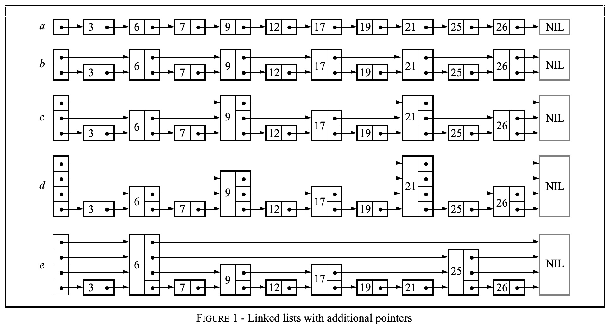
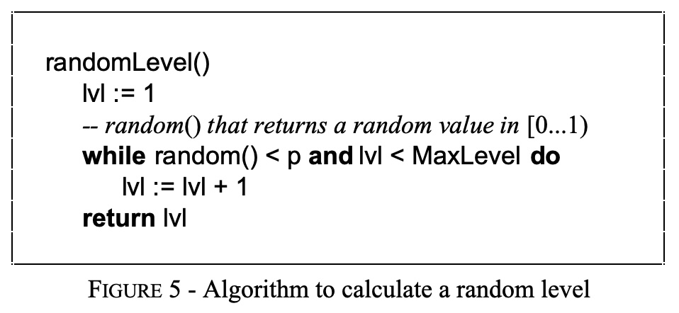
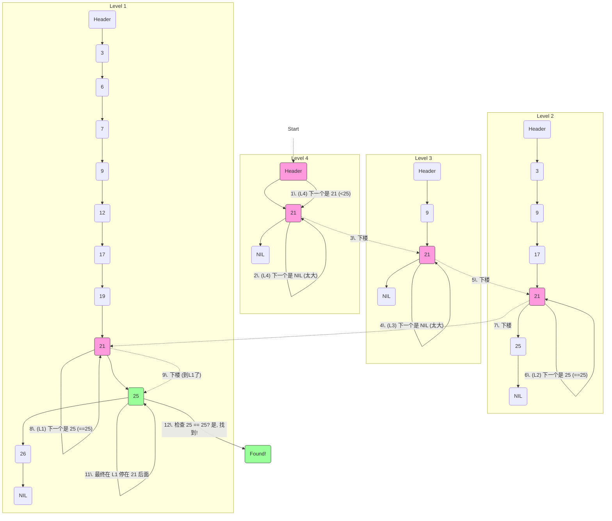
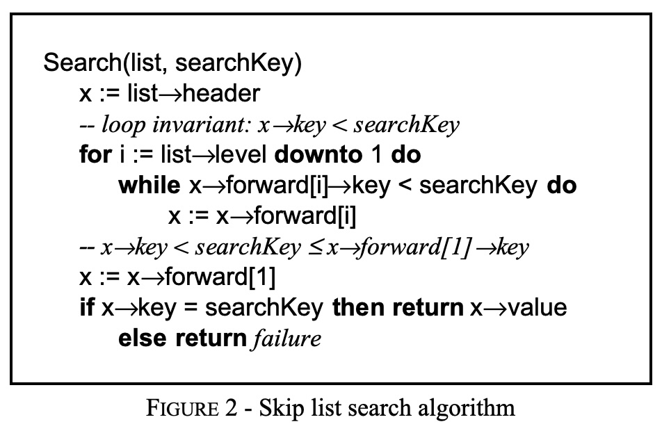
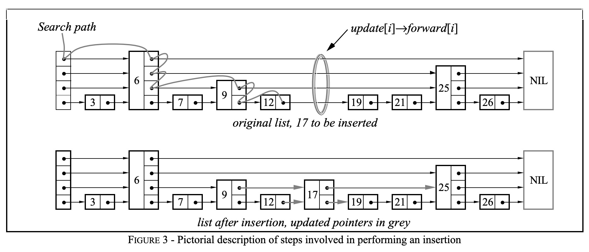
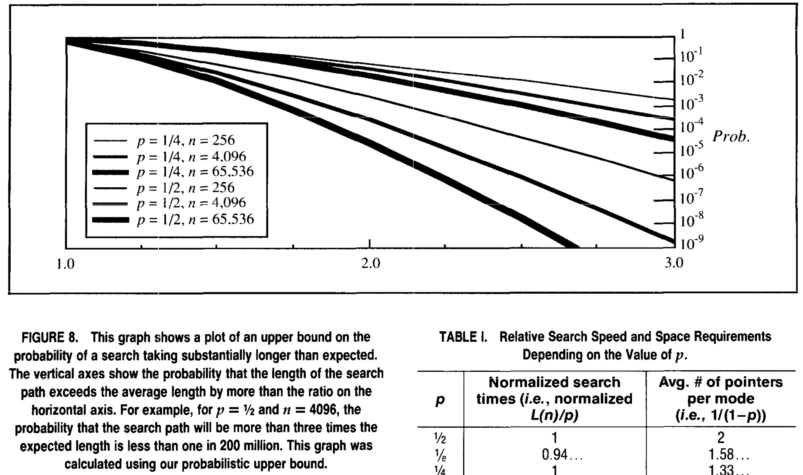
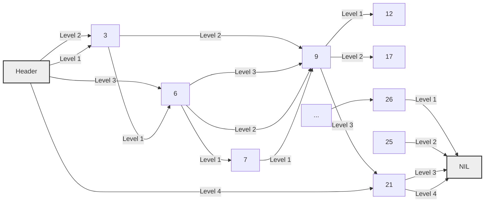
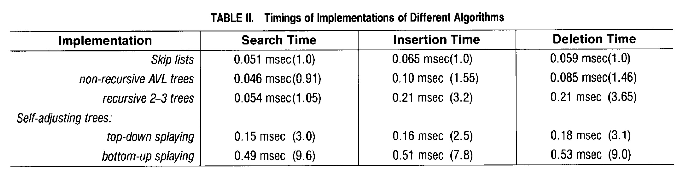
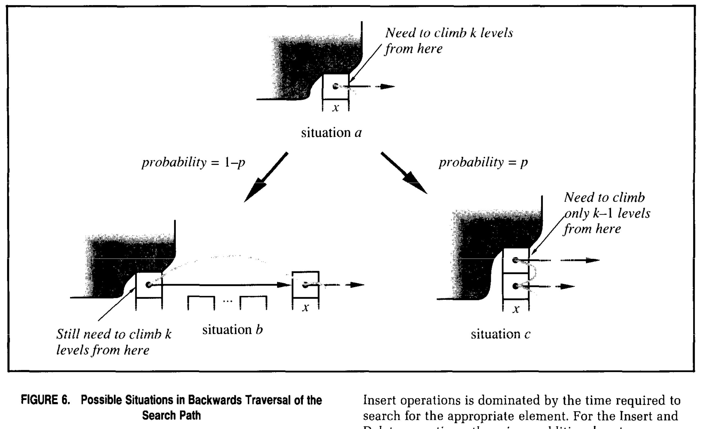

## AI论文解读 | Skip Lists: A Probabilistic Alternative to Balanced Trees
        
### 作者        
digoal        
        
### 日期        
2025-10-29        
        
### 标签        
PostgreSQL , PolarDB , DuckDB , AI , 论文解读        
        
----        
        
## 背景  
      
https://dl.acm.org/doi/pdf/10.1145/78973.78977        
  
提示:          
```          
读懂《Skip Lists: A Probabilistic Alternative to Balanced Trees》这篇论文需要提前掌握哪些基础知识, 请使用中文通熟易懂的讲解这些基础知识, 可以引用论文中的图、表或使用Markdown支持的图形(text,mermaid等)增加解释性. 
  
使用中文通熟易懂的解读《Skip Lists: A Probabilistic Alternative to Balanced Trees》这篇论文, 其中的关键内容请着重讲解, 可以引用论文中的图、表或使用Markdown支持的图形(text,mermaid等)增加解释性. 
  
提取《Skip Lists: A Probabilistic Alternative to Balanced Trees》这篇论文中的重要术语, 使用中文对这些术语进行通熟易懂的讲解, 可以引用论文中的图、表或使用Markdown支持的图形(text,mermaid等)增加解释性. 
```     
  
## 1 前置知识 
  
要透彻理解威廉·普格 (William Pugh) 的这篇经典论文《跳表：平衡树的一种概率性替代方案》，你需要先掌握一些计算机科学的基础知识。这篇论文的精妙之处在于它用一种更简单、更高效的方法解决了一个经典问题 。

你需要了解的基础知识主要分为三类：**基础数据结构**、**算法性能分析**和**基础概率论**。

-----

### 1\. 基础数据结构

跳表是作为“平衡树”的替代品被提出来的 。因此，你必须先理解“树”是用来干什么的，以及它有什么问题。

#### 链表 (Linked List)

这是理解跳表的基础。跳表本质上是一个“加了快车道”的有序链表 。

  * **是什么？** 一种数据结构，每个节点包含一个值和指向下一个节点的指针。

  * **在论文中：** 论文的图1a就是一个标准的有序链表 。在链表中搜索一个元素（例如 25），你必须从头开始，一个一个地检查，平均时间复杂度为 $O(n)$ 。    

    ```mermaid
    graph LR
        style Header fill:#eee,stroke:#333,stroke-width:2px
        style NIL fill:#eee,stroke:#333,stroke-width:2px

        Header --> 3 --> 6 --> 7 --> 9 --> 12 --> 17 --> 19 --> 21 --> 25 --> 26 --> NIL
    ```

#### 二叉搜索树 (Binary Search Tree, BST)

论文开篇就提到了二叉树 。

  * **是什么？** 一种树形结构，每个节点的左子树都比它小，右子树都比它大。这使得搜索、插入和删除操作的平均时间复杂度达到 $O(\log n)$ ，非常快。

  * **有什么问题？** 论文明确指出了它的核心缺陷：如果元素是**按顺序插入**的（例如，先插 3，再插 6，再插 7...），二叉搜索树会“退化”成一个链表 。

  * **"退化" (Degenerate) 的后果：** 搜索性能从 $O(\log n)$ 急剧下降到 $O(n)$ ，失去了树的优势。

    ```mermaid
    graph TD
        subgraph "平衡的BST (性能好)"
            B(9) --> A(6)
            B --> C(17)
            A --> D(3)
            A --> E(7)
            C --> F(12)
            C --> G(19)
        end

        subgraph "退化的BST (性能差)"
            H(3) --> I(6)
            I --> J(7)
            J --> K(9)
            K --> L(12)
            L --> M(17)
            M --> N(19)
        end
    ```

#### 平衡树 (Balanced Trees, e.g., AVL 树, 2-3 树)

这是跳表要挑战的“传统解决方案”。

  * **是什么？** 为了解决 BST 的退化问题，平衡树被发明出来。它们通过复杂的“旋转”操作来**严格强制**树保持平衡 。
  * **有什么问题？** 论文指出，平衡树的算法（如插入和删除）非常复杂，难以实现 ，并且这些维护平衡的操作本身有不小的性能开销 。

-----

### 2\. 算法性能分析

你需要能看懂论文是如何比较不同数据结构的“快慢”的。

#### 大 O 表示法 (Big O Notation)

这是衡量算法效率的标准语言。

  * **$O(n)$ (线性时间):** 性能随数据量 $n$ 线性增长。链表搜索就是 $O(n)$ 。
  * **$O(\log n)$ (对数时间):** 性能非常高。数据量翻倍，时间只增加一个常数。平衡树和跳表的搜索、插入、删除操作的**期望时间**都是 $O(\log n)$ 。

#### 性能保证类型 (Types of Performance Bounds)

这是论文的一个核心论点。

  * **最坏情况 (Worst-case):** 平衡树提供 $O(\log n)$ 的最坏情况时间保证 。这意味着在任何情况下，它都一样快。
  * **摊销 (Amortized):** 另一种结构“自调节树”(Splay Trees) 提供 $O(\log n)$ 的摊销时间保证。这意味着单次操作可能很慢（ 甚至 $O(n)$ ），但一系列操作的*平均*时间很快 。
  * **概率性 (Probabilistic):** **这就是跳表的核心**。跳表不提供严格的最坏情况保证 。它的 $O(\log n)$ 是一个**概率性保证**或**期望时间** 。这意味着它*有可能*会很慢（比如退化成链表），但论文通过数学分析证明，发生这种情况的概率极低 。

> 比如论文中提到，对于一个有 250 多个元素的字典，一次搜索花费的时间超过期望时间 3 倍的概率小于百万分之一 。

-----

### 3\. 概率论基础 (Probability Fundamentals)

这是理解跳表**如何工作**和**为什么它能工作**的关键。跳表用“概率性平衡”代替了“严格强制的平衡” 。

#### 随机数 (Random Numbers)

跳表在插入一个新节点时，会通过“抛硬币”的方式（即查询随机数生成器）来决定这个节点的“层级” (level) 。

  * **层级 (Level):** 一个节点被随机分配为 $k$ 层，它就有 $k$ 个向前的指针 。
  * **论文中的实现：** 论文的图 5 (Figure 5) 展示了如何生成一个随机层级 。    

#### 概率 `p`

这是控制跳表结构的关键参数。

  * **是什么？** 论文定义 `p` 为一个节点拥有 $i+1$ 层指针的概率（前提是它已经有了 $i$ 层指针）。
  * **例如 `p = 1/2` ：**
      * 所有节点都有第 1 层。
      * 有 1/2 的节点有第 2 层。
      * 有 1/4 的节点有第 3 层。
      * 有 1/8 的节点有第 4 层...
  * **结构：** 这就天然形成了一个“金字塔”结构，如图 1e 所示 。高层级的指针可以“跳过” (skip) 大量中间节点 ，实现快速搜索。    

#### 期望值 (Expected Value)

由于跳表的结构是随机的，它的性能分析不能是绝对的，而必须是“期望的”。

  * **期望时间 (Expected Time):** 当论文说搜索时间是 $O(\log n)$ 时，它指的是在所有可能的随机结构中，搜索时间的*平均值* 。
  * **期望空间 (Expected Space):** 论文也分析了期望的空间使用。例如，当 $p=1/2$ 时，平均每个节点需要 2 个指针；当 $p=1/4$ 时，平均每个节点需要 1.33 个指针 。

-----

### 总结

你需要带着以下背景知识来阅读这篇论文：

1.  **问题：** 有序链表搜索 $O(n)$ 太慢。二叉搜索树在有序插入时会退化成 $O(n)$ 。
2.  **传统方案：** 平衡树用复杂的旋转操作来保证 $O(\log n)$ 的最坏情况性能，但实现困难且有额外开销。
3.  **跳表的方案：** 将有序链表（第 1 层）和随机性结合。通过“抛硬币”（ 概率 $p$ ）为节点增加更高层级的“快车道”指针。
4.  **结果：** 得到一个在**期望**（平均）情况下达到 $O(\log n)$ 性能的数据结构，其实现（搜索、插入、删除）算法远比平衡树简单 。

掌握了这些，你就能轻松理解为什么跳表在当时是一个如此简洁且高效的创新。

您想更深入地了解跳表的**搜索** (Search) 和**插入** (Insert) 算法是如何利用这些层级指针工作的吗？
  
## 2 解读论文 
  
这是一篇非常经典的计算机科学论文。威廉·普格（William Pugh）在文中介绍了一种名为**跳表（Skip List）的数据结构，它巧妙地使用概率**来代替平衡树中复杂的平衡算法，却能达到几乎相同的性能。

这篇论文的核心思想是：**与其用复杂的规则（如AVL树的旋转）来严格保持数据结构的平衡，不如“随缘”——用随机“抛硬币”的方式来构建一个多层次的链表，它在“期望”上是平衡的，并且实现起来简单得惊人 。**

下面，我将为您通俗易懂地解读这篇论文的关键内容。

-----

### 1\. 论文要解决的“痛点”：平衡树的“烦”

在跳表出现之前，如果想存储一组有序的数据（比如一个字典），并且希望能快速地（在 $O(\log n)$ 时间内）进行搜索、插入和删除，那么“平衡二叉搜索树”（Balanced Trees）是标准的解决方案 。

  * **普通二叉搜索树（BST）的问题：** 如果你按顺序插入数据（例如：1, 2, 3, 4, 5...），它会“退化”成一个链表，搜索性能从 $O(\log n)$ 急剧下降到 $O(n)$ 。
  * **平衡树（如 AVL 树）的方案：** 它们通过复杂的“旋转”操作来严格保持树的平衡 。
  * **论文指出的“痛点”：** 平衡树的算法（尤其是插入和删除） **非常复杂** ，难以实现和调试 。这种复杂性带来的“常数因子”开销很大，导致它们在实际运行中可能并不快。

### 2\. “跳表”的核心思想：多层“快车道”

作者的思路清奇，他从最简单的**有序链表**出发。

  

1.  **图 1a (普通链表)：** 这是一个标准的有序链表 。要查找 25，你必须从头开始，一步一步走（3, 6, 7...），平均需要 $O(n)$ 时间。  

    ```mermaid
    graph LR
        Header --> 3 --> 6 --> 7 --> 9 --> 12 --> 17 --> 19 --> 21 --> 25 --> 26 --> NIL
    ```

2.  **图 1b (加一层)：** 如果我们给每隔一个节点增加一个“快车道”指针，让它指向“下下个”节点 。查找 25 时，你可以先走快车道 (3 -\> 7 -\> 12 -\> 19 -\> 25)，速度快了近一倍 。

3.  **图 1d (理想状态)：** 终极形态是，第1层是普通链表，第2层每隔1个节点一个指针，第3层每隔3个节点一个指针，第 $i$ 层每隔 $2^{i-1}-1$ 个节点一个指针 。这样，你就可以像二分查找一样，从最高层开始“跳”，搜索时间可以达到 $O(\log n)$ 。

4.  **理想的“痛点”：** 这种完美的结构（图 1d）在插入或删除时是“不切实际的”，因为一次插入可能导致后面所有指针的重排 。

-----

### 3\. 关键创新：用“概率”代替“规则”

这是论文的“灵光一闪”：我们不需要一个**严格完美**的多层结构，只需要一个**大致如此**的结构就行了。

**核心机制：**
当插入一个新节点时，我们通过“抛硬币”来随机决定这个节点的“层高”（level）。

  * 论文使用一个概率 $p$ （ 通常取 $1/2$ 或 $1/4$ ） 。
  * 新节点被分配为 Level 1。
  * 抛一次硬币（或生成一个随机数），如果小于 $p$ ，它的层级再加 1（变为 Level 2）。
  * 再抛一次，如果还小于 $p$ ，层级再加 1（变为 Level 3）... 
  * 以此类推，直到抛硬币失败或达到最大层高（MaxLevel）。

  

**结果 (图 1e)：**
我们得到了一个随机的、类似图 1e 的结构 。在这个结构中：

  * 约 50% 的节点是 1 层（ 如果 $p=1/2$ ）。
  * 约 25% 的节点是 2 层 。
  * 约 12.5% 的节点是 3 层 。

这个随机生成的结构，在**统计期望**上，就和我们理想中的（图 1d）金字塔结构非常相似。**最关键的是，节点的层高一旦确定，就再也不会改变 。** 这使得插入和删除操作变得极其简单。

-----

### 4\. 跳表的核心算法（重点）

所有操作都基于**搜索**算法。

#### A. 搜索 (Search) 算法

搜索的过程就像“下楼”：**永远先尝试走高层的“快车道”，走不通了再下楼** 。

**目标：** 搜索 25。
**路径：** 如下图所示，我们从 Header 的最高层出发。



  

**伪代码（图 2）解释：**

1.  `x` 从 `header` 开始。
2.  `i` 从最高层 `list->level` 循环到底层 1。
3.  **`while` 循环：** 在第 `i` 层，只要 `x` 的下一个节点 `x->forward[i]` 的键值 *小于* `searchKey`，就一直往前走 (`x := x->forward[i]`)。
4.  （`while` 循环结束）说明 `x->forward[i]` 太大了，不能再在第 `i` 层前进了。
5.  `i` 减 1（下楼），重复第 3 步。
6.  循环结束后，`i=1` 的 `while` 循环也结束了。此时 `x` 位于 `searchKey` 应该在的位置的“前一个”节点 。
7.  最后检查 `x->forward[1]` 是不是我们要找的 `searchKey` 。

#### B. 插入 (Insert) 算法

  

插入操作是“**先搜索，再拼接**” 。

1.  **搜索并记录路径：** 像搜索一样，但额外用一个 `update` 数组 。`update[i]` 记录在第 `i` 层“下楼”前的最后一个节点 。
2.  **随机层高：** 为新节点（例如要插入 17）生成一个随机层高 `lvl` 。假设 17 随机到了 3 层。
3.  **拼接 (Splice)：** 见**图 3**。对新节点 `x`，从 $i=1$ 到 `lvl` (3) 执行：  
      * `x->forward[i] = update[i]->forward[i]` （新节点的指针指向“旧”的下一个节点）。
      * `update[i]->forward[i] = x` （“旧”的上一个节点指向新节点）。

> **(见图 3)** `update` 数组记录了插入 17 之前，路径上所有的“拐角处”（即灰色搜索路径箭头指向的节点 12, 9, 6 等）。插入 17 时，17 的 L1 指针指向 19（即 `update[1]` (12) 曾指向的 19），然后 `update[1]` (12) 改为指向 17。L2 和 L3 同理。

#### C. 删除 (Delete) 算法

删除是插入的逆过程：“**先搜索，再断开**”。

1.  **搜索并记录路径：** 和插入一样，用 `update` 数组记录搜索路径 。
2.  **断开 (Bypass)：** 找到要删除的节点 `x` 。
3.  从 $i=1$ 到 `x` 的层高，执行：
      * `update[i]->forward[i] = x->forward[i]` （让 `update[i]` 节点“跳过” `x`，直接指向 `x` 的下一个节点）。
4.  **清理：** 释放 `x` 节点的内存 。

-----

### 5\. 性能与分析：为什么它很好？

#### A. 概率保证 (Probabilistic Bound)

跳表不提供**最坏情况**保证（你运气极差，所有节点都只有 1 层，它就退化成链表）。但论文的概率分析（图 8）表明，这种情况的概率低到可以忽略不计 。

  

> **(见图 8)** 对于一个 $n=4096$ 的跳表（ $p=1/2$ ），一次搜索花费的时间超过**期望时间 3 倍**的概率，小于**二百万分之一**（ $5 \times 10^{-7}$ ，图上 $10^{-6}$ 和 $10^{-7}$ 之间 ）。

#### B. 时间与空间 (Table 1)

  

  * **时间：** 所有操作（搜索、插入、删除）的**期望时间**都是 $O(\log n)$ 。这和平衡树一样 。
  * **空间：** **表 1** 显示了 $p$ 值的权衡 。
      * `p = 1/2`：平均每个节点 2 个指针 。
      * `p = 1/4`：平均每个节点 1.33 个指针 。
      * 论文推荐 `p = 1/4`，因为它在空间和时间上取得了很好的平衡 。

#### C. 实践性能 (Table 2) - 关键的胜利

  

论文的**表 2** 是最有说服力的。它比较了优化后的跳表和其他数据结构的实际运行时间（在 $2^{16}$ 个元素上）。

| 实现 | 搜索时间 | 插入时间 | 删除时间 |
| :--- | :--- | :--- | :--- |
| **Skip lists (跳表)** | 0.051 msec (1.0) | 0.065 msec (1.0) | 0.059 msec (1.0) |
| non-recursive AVL trees | 0.046 msec (0.91) | 0.10 msec (1.55) | 0.085 msec (1.46) |
| recursive 2-3 trees | 0.054 msec (1.05) | 0.21 msec (3.2) | 0.21 msec (3.65) |
| Self-adjusting trees | 0.15 msec (3.0) | 0.16 msec (2.5) | 0.18 msec (3.1) |

**结论一目了然：**

  * **搜索：** 跳表和高度优化的非递归 AVL 树一样快，比其他树都快 。
  * **插入/删除：** **跳表完胜！** 它的插入和删除速度比 AVL 树快了 **50%** 以上，比 2-3 树快了 **3 倍**以上 。

-----

### 总结：论文的贡献

这篇论文的结论是，**从理论上讲，你不需要跳表**，因为平衡树可以做到所有事并且有最坏情况保证。

**但是，从实践上讲，跳表是巨大的胜利：**

1.  **极度简单：** 跳表的算法非常容易实现和理解 。
2.  **性能极高：** 由于算法简单（例如，非递归且内部循环开销极小），它的“常数因子”非常低，导致实际运行速度（尤其是插入和删除）比复杂（且优化过的）平衡树要快得多 。

跳表用一种优雅的、基于概率的简单设计，在实践中打败了那些“严格完美”但无比复杂的传统数据结构。

您想了解更多关于跳表如何处理并发（多线程）操作的吗？论文作者提到这也是跳表的一个巨大优势。
  
## 3 术语 
  
好的，我从《Skip Lists: A Probabilistic Alternative to Balanced Trees》这篇论文中提取了最关键的术语，并为您提供通俗易懂的中文讲解。

-----

### 核心概念 (Core Concepts)

#### 1\. Skip Lists (跳表)

  * **讲解：** 这就是本篇论文的主角。它是一种数据结构，用来替代“平衡树” 。你可以把它想象成一个**带“快车道”的多层有序链表**。
  * 它最底第 1 层是一个标准的有序链表，包含所有元素 。
  * 往上，第 2 层、第 3 层... 包含的节点越来越少，就像高速公路上的“快车道”。高层级的指针可以让你“跳过” (skip) 大量中间节点，从而实现快速查找 。
  * **图示：** 论文的**图 1e** 就展示了一个随机生成的跳表示例。它不像图 1d 那样结构完美均匀，但同样在顶层（如节点 6 和 25）提供了可以“跳过”大量中间节点的“快车道”。

  

#### 2\. Balanced Trees (平衡树)

  * **讲解：** 这是跳表要对标和替换的“传统”数据结构 ，例如 AVL 树或 2-3 树 。
  * 平衡树使用一套严格的规则（如“旋转”）来确保树在任何插入或删除后都保持平衡 ，以此保证 $O(\log n)$ 的最坏情况搜索性能。
  * **“痛点”：** 论文指出，平衡树的算法（尤其是插入和删除）非常复杂 ，难以实现，并且维护平衡的开销很大。

#### 3\. Probabilistic Balancing (概率性平衡)

  * **讲解：** 这是跳表的核心思想，也是它与平衡树最大的不同。
  * 平衡树依赖“严格强制的平衡” (strictly enforced balancing) 规则 。
  * 跳表则依赖“概率性平衡” 。它在插入新节点时，通过“抛硬币”（即查询随机数生成器 ）来随机决定这个节点的“层高” (level)。
  * 这种随机性使得跳表**在期望上**是平衡的，并且实现起来极其简单 。

-----

### 结构组件 (Structural Components)

#### 4\. Level k Node (k级节点)

  * **讲解：** 这是跳表中的基本单元。一个节点被称作“k级节点”，意思是它有 $k$ 个“前向指针” (forward pointers) ，指针的索引从 1 到 $k$ 。
  * 该节点的第 $i$ 个指针，指向它右侧 **第一个层级至少为 $i$** 的节点 。
  * **图示：** 在论文**图 1e** 中：
      * 节点 `7`, `9`, `12`, `17`, `19`, `21`, `26` 都是 1 级节点。
      * 节点 `3`, `25` 是 2 级节点。
      * 节点 `6` 是 3 级节点。

  

#### 5\. Header (头节点) 和 NIL (哨兵节点)

  * **讲解：** 这是跳表的两个“辅助”节点，它们让算法变得更简洁。
  * **Header (头节点):** 位于列表最开始的特殊节点 。它拥有最高级别（MaxLevel）的指针 ，作为所有搜索的**起点** 。
  * **NIL (哨兵节点):** 位于列表最末尾的特殊节点 。它的键值被设置为“比任何合法键值都大” ，所有层的指针都最终指向它 ，充当“终点站”的角色。




#### 6\. 概率 $p$ ( Probability $p$ )

  * **讲解：** 这是控制跳表“形状”的关键参数 。一个节点拥有 $i$ 层指针，那么它同时拥有 $i+1$ 层指针的概率就是 $p$ 。
  * **举例：** 论文最初的例子（图 1d）中 $p=1/2$ 。这意味着 50% 的节点是 1 级，25% 是 2 级，12.5% 是 3 级，以此类推 。
  * **权衡 (表 1)：** 改变 $p$ 会影响时空效率 。    
      * **p = 1/2**：平均每个节点 2 个指针 。
      * **p = 1/4**：平均每个节点 1.33 个指针 。
      * 论文推荐 $p=1/4$ ，因为它在空间和时间上取得了很好的平衡 。

-----

### 算法关键 (Algorithmic Keys)

#### 7\. Search Path (搜索路径)

  * **讲解：** 这是在跳表中查找一个元素所经过的路径，也是所有操作（搜索、插入、删除）的基础 。
  * **算法 (图 2)：** 从 Header 的最高层开始 。在当前层级上前进，直到下一个节点太大（超过目标）。然后下降到下一层级 ，重复此过程，直到第 1 层 。     
  * **图示：** 论文的**图 3**（上半部分）用灰色的箭头线清晰地标示出了“Search path”（搜索路径） 。它展示了为了插入 17，搜索算法是如何从 Header 开始，在第 3 层跳到 6，再跳到 9，然后（9 的下一个 21 太大）下降到第 2 层，跳到 12，再（12 的下一个 19 太大）下降到第 1 层，并停在 12 处。    

#### 8\. update[] vector (update[] 数组)

  * **讲解：** 这是**插入 (Insert)** 和**删除 (Delete)** 算法中至关重要的辅助工具 。
  * 它是一个大小为 MaxLevel 的数组。在搜索目标位置（准备插入或删除）的过程中，`update[i]` 会被设置为“在第 $i$ 层上，搜索路径所能到达的、最靠右的那个节点” 。
  * **作用 (图 3)：** 当搜索完成，准备插入新节点 17 时，`update` 数组已经存好了所有需要被修改指针的节点（即图 3 中，搜索路径“拐弯”的地方，如 12、9、6 等）。这样算法就可以快速地进行“拼接”操作。  

#### 9\. randomLevel() (随机层级生成)

  * **讲解：** 用于在**插入**新节点时，决定这个新节点的层高 。
  * **算法 (图 5)：** 它从 1 级开始 ，然后不断“抛硬币”（即 `random() < p`），每成功一次，层级 `lvl` 就加 1 ，直到失败或达到 MaxLevel 。    
  * **伪代码 (图 5)：**
    ```
    lvl := 1
    // 只要随机数小于p，并且没超过最大层高
    while random() < p and lvl < MaxLevel do
        lvl := lvl + 1
    return lvl
    ```

-----

### 性能分析 (Performance Analysis)

#### 10\. Performance Bounds (性能保证)

  * **讲解：** 论文对比了三种不同的性能承诺 。
  * **Worst-case (最坏情况):** **平衡树**的承诺 。保证**单次**操作绝不会超过 $O(\log n)$ 。这对于实时系统很重要 。
  * **Amortized (摊销):** **自调节树** (Self-adjusting trees) 的承诺 。保证**一系列**操作的平均时间是 $O(\log n)$ ，但**单次**操作可能很慢（ 比如 $O(n)$ ） 。
  * **Probabilistic (概率性):** **跳表**的承诺 。不保证最坏情况，但保证任何操作“**极大概率**”会很快 。例如，**图 8** 显示，一个有 4096 个元素的跳表，搜索时间超过期望 3 倍的概率小于二百万分之一。    

#### 11\. $L(n)$

  * **讲解：** 这是一个公式， $L(n) = \log_{1/p}n$ 。
  * 它代表了一个包含 $n$ 个元素的跳表“理想”的最高层级 。例如，如果 $p=1/2$ ， $L(n) = \log_2 n$ 。
  * 这个值用来帮助确定 `MaxLevel`（最大层高常量） 和分析算法的期望成本 。

#### 12\. Constant factors (常数因子)

  * **讲解：** 这是一个在实践中非常重要的概念 。
  * 尽管平衡树和跳表的“大O表示法”都是 $O(\log n)$ ，但论文的**表 2** 显示，由于跳表的算法实现**极其简单**（例如，插入/删除的核心循环只有几行代码），它的实际运行时间（即“常数因子”）远低于复杂的平衡树。    
  * **表 2** 数据显示，跳表的插入和删除速度比高度优化的非递归 AVL 树快 **1.5 倍**，比 2-3 树快 **3 倍**以上 。

希望这份讲解能帮助您理解这篇论文的精华！您想继续了解论文中关于性能分析的数学推导（如图 6 的反向分析法）吗？    
  
## 参考        
         
https://dl.acm.org/doi/pdf/10.1145/78973.78977    
        
<b> 以上内容基于DeepSeek、Qwen、Gemini及诸多AI生成, 轻微人工调整, 感谢杭州深度求索人工智能、阿里云、Google等公司. </b>        
        
<b> AI 生成的内容请自行辨别正确性, 当然也多了些许踩坑的乐趣, 毕竟冒险是每个男人的天性.  </b>        
    
#### [期望 PostgreSQL|开源PolarDB 增加什么功能?](https://github.com/digoal/blog/issues/76 "269ac3d1c492e938c0191101c7238216")
  
  
#### [PolarDB 开源数据库](https://openpolardb.com/home "57258f76c37864c6e6d23383d05714ea")
  
  
#### [PolarDB 学习图谱](https://www.aliyun.com/database/openpolardb/activity "8642f60e04ed0c814bf9cb9677976bd4")
  
  
#### [PostgreSQL 解决方案集合](../201706/20170601_02.md "40cff096e9ed7122c512b35d8561d9c8")
  
  
#### [德哥 / digoal's Github - 公益是一辈子的事.](https://github.com/digoal/blog/blob/master/README.md "22709685feb7cab07d30f30387f0a9ae")
  
  
#### [About 德哥](https://github.com/digoal/blog/blob/master/me/readme.md "a37735981e7704886ffd590565582dd0")
  
  

  
