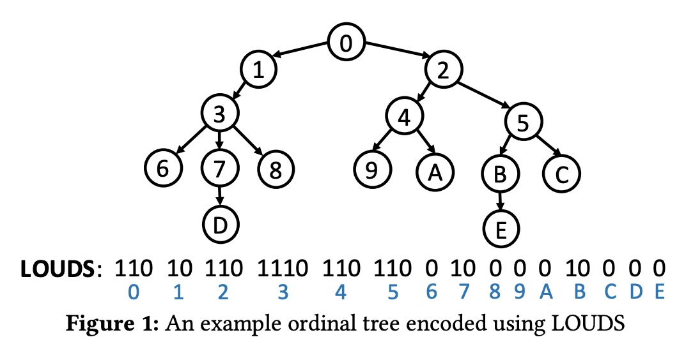
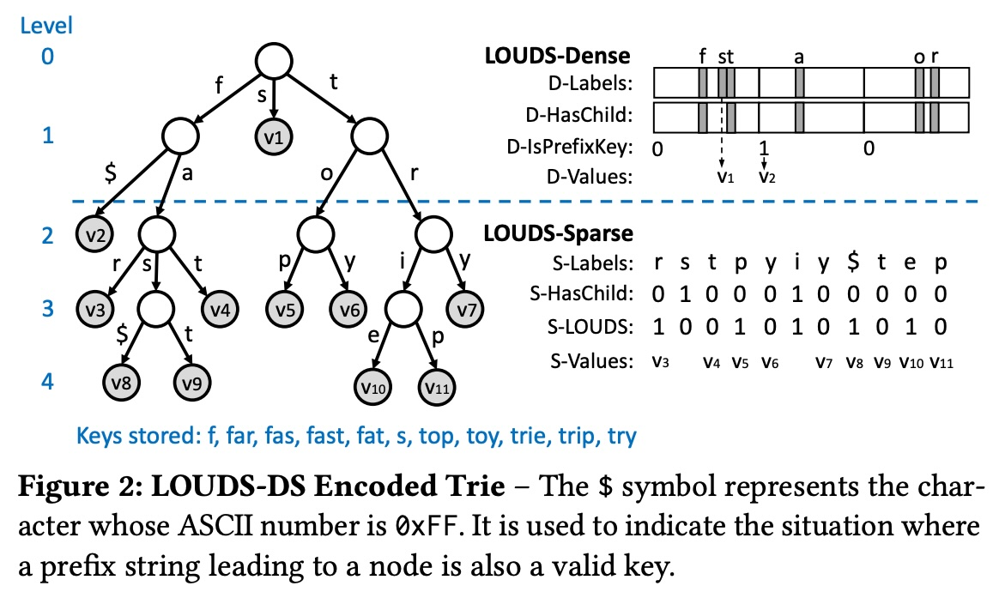
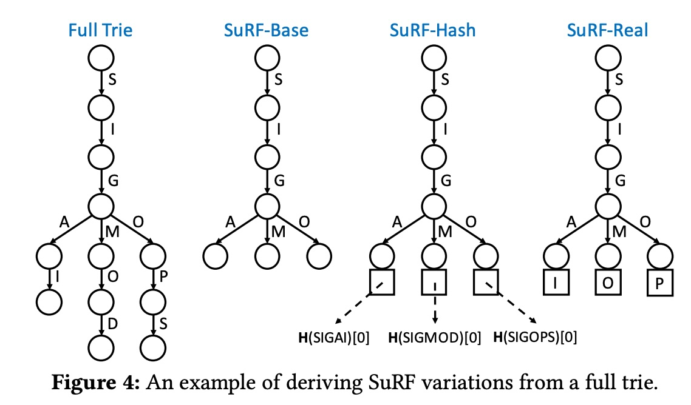
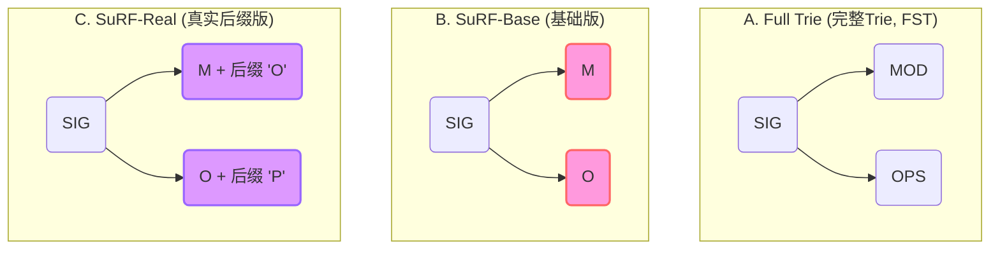
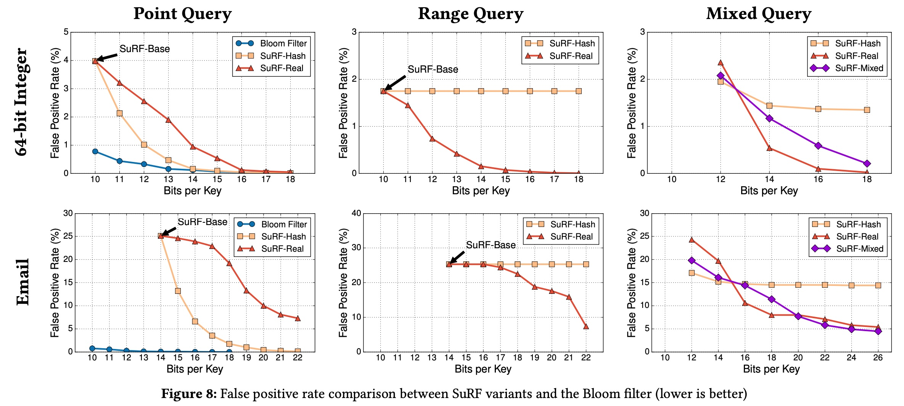
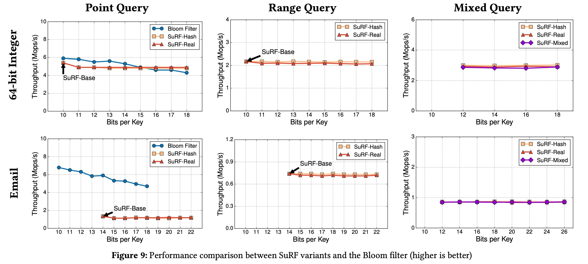
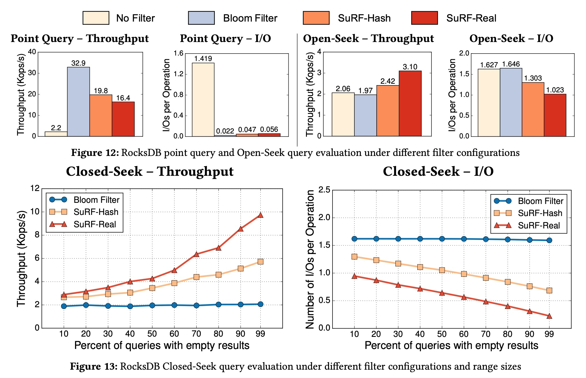
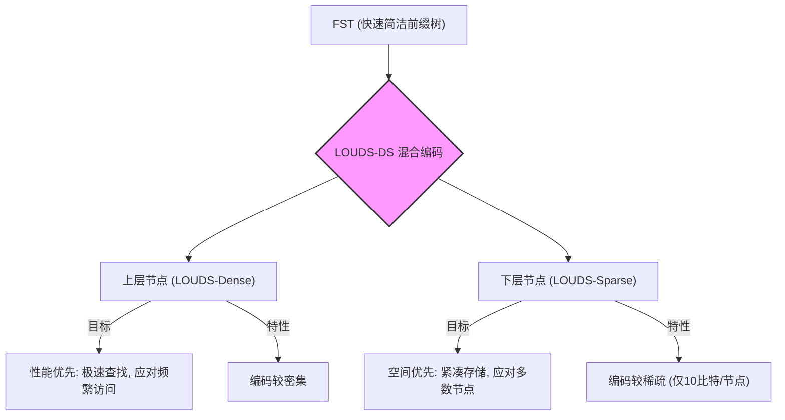

## AI论文解读 | SuRF: Practical Range Query Filtering with Fast Succinct Tries
        
### 作者        
digoal        
        
### 日期        
2025-10-29        
        
### 标签        
PostgreSQL , PolarDB , DuckDB , AI , 论文解读        
        
----        
        
## 背景  
      
https://www.cs.cmu.edu/~huanche1/publications/surf_paper.pdf        
  
提示:          
```          
读懂《SuRF: Practical Range Query Filtering with Fast Succinct Tries》这篇论文需要提前掌握哪些基础知识, 请使用中文通熟易懂的讲解这些基础知识, 可以引用论文中的图、表或使用Markdown支持的图形(text,mermaid等)增加解释性. 
  
使用中文通熟易懂的解读《SuRF: Practical Range Query Filtering with Fast Succinct Tries》这篇论文, 其中的关键内容请着重讲解, 可以引用论文中的图、表或使用Markdown支持的图形(text,mermaid等)增加解释性. 
  
提取《SuRF: Practical Range Query Filtering with Fast Succinct Tries》这篇论文中的重要术语, 使用中文对这些术语进行通熟易懂的讲解, 可以引用论文中的图、表或使用Markdown支持的图形(text,mermaid等)增加解释性. 
```     
  
## 1 前置知识 
  
这篇论文  非常经典，但确实融合了多个领域的知识。要透彻理解它，你需要一个“知识全家桶”。

别担心，我会用最通俗易懂的中文为你拆解这些必备的基础知识。

---

### 1. 核心背景：为什么需要"过滤器" (Filter)?

想象一个超大型图书馆，你要找一本书。

* **传统方法**：你有一个总索引（B+树），告诉你书在哪个架子上。这很精确，但索引本身也很大。
* **LSM-Tree (日志结构合并树)**：这是论文中 RocksDB  使用的存储模型。它更像一个“混乱”的图书馆，新书不断被打包（SSTables）放到不同的楼层（Levels）。
    * **问题**：为了找一本书，你可能需要去*好几个*楼层查看各自的索引 。这非常慢，因为“去一个新楼层”就像一次昂贵的磁盘I/O（磁盘读写）。

#### 必备知识 (1): 布隆过滤器 (Bloom Filter)

为了解决这个问题，LSM-Tree 在每个楼层的入口放了一个“保安”——这就是**布隆过滤器** 。

* **作用**：你问保安：“《数据库系统》在这一层吗？”
* **保安的回答 (单边错误)** ：
    * 如果他说 **"不在"**：那这本书 *100% 不在*这一层。你省了大量时间，不用进去找了。
    * 如果他说 **"可能在"**：这本书*有可能*在 (也可能不在)。你才需要真正进去（访问磁盘）确认一下。
* **关键特性**：它非常小 ，可以常驻内存，查询极快，但有**假阳性率 (False Positive Rate)**  (即保安错判“可能在”)。

---

### 2. SuRF的动机：布隆过滤器的“硬伤”

布隆过滤器虽然好，但它是个“糊涂保安”。

* **硬伤**：它只能回答“**某个特定的键**在吗？”（如 "key 42"）。
* **无法回答**：“**某个范围**的键在吗？”（如 "key 42 到 1000 之间有书吗？"）。

如果你问布隆过滤器这个问题，它只能"谢邀，告辞"。而数据库中**范围查询 (Range Query)**  非常普遍。

**SuRF (Succinct Range Filter) 的目标**：做一个*既能*查单点、*又能*查范围、*还很小*的“超级保安” 。

---

### 3. SuRF的核心武器：字典树 (Trie)

SuRF 抛弃了布隆过滤器的“哈希”思路，改用了**字典树 (Trie)**（也叫前缀树）。

#### 必备知识 (2): 字典树 (Trie)

Trie 是一种树形结构，非常适合存储字符串或键。它通过“共享前缀”来节省空间。

* **优点**：Trie 本身就**天然支持范围查询**。因为它的键是按字典序排列的，你遍历树的一部分就能找到一个范围内的所有键。
* **缺点**：传统的 Trie 用“指针”连接节点，一个指针就 64位，这导致它**超级占内存**，根本没法当“过滤器”用。

**SuRF 的核心**：就是基于一种叫 **FST (Fast Succinct Trie)**  的数据结构。

---

### 4. 核心魔法 (1)：如何让Trie“精简” (Succinct)？

"Succinct" (精简) 是个术语，意思是用接近“信息论下限”的空间来存储 。 FST 的空间消耗仅为每个节点 10 比特 (10 bits) 。

它是怎么做到的？答案是：**不用指针，用位图 (Bitmap)**。

#### 必备知识 (3): LOUDS 与 `rank` / `select`

FST 使用了一种叫 **LOUDS (Level-Ordered Unary Degree Sequence)**  的编码方式。

1.  **编码树结构**：它把整棵树的“形状”（谁有几个孩子）用一个**超长的位图 (Bitmap)**（一串 0 和 1）来表示 。
    * 例如论文图1  中，LOUDS 序列 `110 10 110 1110 ...` 就编码了那棵树的结构。    
2.  **导航树**：既然没有指针，怎么在树上“移动”（比如从父节点找到子节点）呢？ 
    * 答案是靠两个强大的位操作原语 (primitive)：`rank` 和 `select` 。

#### 必备知识 (4): `rank` 和 `select`

这是理解 FST 导航的关键 。

* **`rank₁(i)`**：计算在位图的前 `i` 位中，**总共有多少个 '1'** 。
* **`select₁(i)`**：计算在位图中，**第 `i` 个 '1' 出现在哪个位置** 。

通过对 LOUDS 位图和其它辅助位图执行 `rank` 和 `select`，FST 可以在*不使用任何指针*的情况下，计算出任意节点的父节点、第k个子节点的位置 。这非常快（接近 O(1) 复杂度） 且极度节省空间。

---

### 5. 核心魔法 (2)：如何让Trie“快速” (Fast)？

#### 必备知识 (5): LOUDS-DS 混合编码

单纯的 LOUDS (论文里的 LOUDS-Sparse)  虽然省空间，但访问慢。

FST 的一大创新是 **LOUDS-DS** (DS = Dense-Sparse) ：

* **上层 (LOUDS-Dense)**：Trie 的上几层节点少，但访问最频繁。这里用一种“空间换时间”的快速位图编码 (D-Labels, D-HasChild...) 。
* **下层 (LOUDS-Sparse)**：Trie 的下层节点多，但访问稀疏。这里用“时间换空间”的 LOUDS 编码 (S-Labels, S-LOUDS...) 。

你看论文的 **Figure 2**  就清晰地画出了这个分界。这种混合策略让 FST 兼顾了速度和空间 。    

### 6. 核心魔法 (3)：如何让Trie“近似” (Approximate)？

FST 本身是一个**精确**的 Trie 结构 。但作为“过滤器”，我们不介意一点点“假阳性”，来换取更小的空间。SuRF 是如何从 FST 变成“近似”的呢？

**答案：Trie 截断 (Truncation)** 。

请看论文的 **Figure 4** 。    

* **Full Trie (左1)**：存储了完整的键，如 "SIGMOD", "SIGOPS"。这是精确的。
* **SuRF-Base (左2)**：只存储到能区分它们的最短前缀，比如 'M' 和 'P' 。它把 "MOD" 和 "OPS" 都砍掉了。
    * **问题**：这时如果你查询 "SIGMETRICS"，它顺着 'M' 路径走下去，发现 'M' 存在，就会误报“可能存在”。这就是假阳性。
* **SuRF-Hash / SuRF-Real (右2 / 右1)**：为了降低假阳性率，SuRF 在被截断的叶节点上，额外存储了几个比特的**后缀 (Suffix)** 。
    * **SuRF-Hash**：存储键的哈希值的最后几位 。
    * **SuRF-Real**：存储键的*真实*后续几位 （如图4中的 'O' 和 'P'）。
    * 通过这几位后缀，SuRF 可以过滤掉更多查询，大大降低假阳性率 。

---

### 总结：你需要掌握的基础知识

要读懂这篇论文，你需要提前了解：

1.  **LSM-Tree 和 布隆过滤器**：明白为什么我们需要过滤器，以及现有过滤器的痛点 (不能查范围) 。
2.  **字典树 (Trie)**：理解 SuRF 的理论基础，为什么它天然支持范围查询 。
3.  **精简数据结构 (Succinct DS)**：这是核心黑科技。理解“不用指针，用位图”的思想 。
4.  **`rank` 和 `select` 操作**：理解在位图上实现树导航的具体机制 。
5.  **假阳性率 (FPR)**：理解衡量过滤器性能的核心指标 ，以及 SuRF 是如何通过“截断+后缀”来实现空间和准确率的权衡 (Trade-off) 。

希望这份导读能帮你扫清障碍！

您希望我深入解释 LOUDS 和 rank/select 的具体工作原理，还是讲解 SuRF 在 RocksDB 中的应用流程呢？
  
## 2 解读论文 
  
这是一篇影响力很大的论文，它提出了一种名为 **SuRF (Succinct Range Filter)** 的新型数据结构 。

简单来说，SuRF 就像一个“超级保安”，它被部署在数据库访问磁盘的“大门口”。它的职责是**拦截那些注定会“白跑一趟”的查询请求**，从而减少昂贵的磁盘I/O 。

与传统的“保安”（布隆过滤器）相比，SuRF 不仅能处理“查张三在不在？”（**单点查询**），还能高效处理“查姓‘张’的人在不在？”（**范围查询**），而这正是传统方案的“硬伤” 。

-----

### 1\. 问题的根源：LSM-Tree 和布隆过滤器

要理解 SuRF 的价值，我们必须先知道它要解决的问题。

  * **背景 (LSM-Tree)**：论文中以 RocksDB 为例 ，它使用一种叫 LSM-Tree 的存储结构 。在这种结构中，数据被存储在磁盘上多个不可变的文件（SSTable）中，分布在不同的“层级” (Level) 。
  * **痛点 (读放大)**：当你查询一个数据时，系统可能不确定它在哪一层，最坏情况下需要检查*每一层*的文件 。磁盘读写（I/O）非常慢，这种“到处找”的行为会导致查询性能急剧下降 。
  * **传统解决方案 (布隆过滤器)**：为了避免白白读取磁盘，RocksDB 会在内存中为每个 SSTable 文件保留一个**布隆过滤器 (Bloom Filter)** 。
      * **工作方式**：查询一个键（Key）时，先问内存中的布隆过滤器。
      * **优点**：它有“单边错误” 。如果它说“**不在**”，那这个键就 **100% 不在**这个文件里，系统就可以跳过这次磁盘 I/O 。
      * **致命缺陷**：布隆过滤器基于哈希，它**无法处理范围查询** 。你不能问它 “*key 42 到 1000 之间*有数据吗？” 。

**SuRF 的核心目标**：设计一种新的过滤器，它必须像布隆过滤器一样**小而快**，但同时要能高效**支持范围查询**。

-----

### 2\. SuRF 的“秘密武器”：FST (Fast Succinct Trie)

SuRF 的基石是一种全新的数据结构，叫做**快速精简字典树 (Fast Succinct Trie, FST)** 。

#### 什么是字典树 (Trie)？

字典树 (Trie)，也叫前缀树。它通过共享前缀来存储键。

  * **优点**：Trie 天然就支持范围查询。因为键是按字典序存储的，范围查询就是遍历树的一个子树。
  * **缺点**：传统的 Trie 节点需要存储大量“指针”来指向子节点，这导致它**极其消耗内存**，根本不适合做“过滤器”。

#### FST 如何做到“精简” (Succinct) 和“快速” (Fast)？

FST 的天才之处在于它几乎**不使用指针**，而是用一系列高度优化的**位图 (Bitmap)** 来编码整棵树的结构。

**1. 核心编码：LOUDS (Level-Ordered Unary Degree Sequence)**
FST 使用 LOUDS 来表示树的“形状” 。它按“层级顺序”（广度优先）遍历树，并用“一元编码”记录每个节点的*子节点数量* 。

例如，在 **Figure 1** 中，节点 3 有三个孩子，它就被编码为 `1110` 。    

**2. 核心导航：`rank` 和 `select` 操作**
既然没有指针，FST 如何从父节点找到子节点呢？它依赖两个强大的位操作 ：

  * **`rank₁(i)`**：计算在位图的前 `i` 位中，总共有多少个 '1' 。
  * **`select₁(i)`**：计算在位图中，第 `i` 个 '1' 出现在哪个位置 。

通过对 LOUDS 位图和一些辅助位图执行 `rank` 和 `select`，FST 可以在*常量时间*内计算出任意节点的父节点或子节点的位置，其效果等同于指针导航。

**3. 核心创新：LOUDS-DS (混合编码)**
这是 FST 性能的关键。作者观察到：

  * Trie 的**上层**节点少，但几乎每次查询都会访问，非常“热” 。
  * Trie 的**下层**节点多，占了绝大部分空间，但访问较“冷” 。

因此，FST 采用了混合编码方案 **LOUDS-DS (Dense-Sparse)** ，如 **Figure 2** 所示 ：    

  * **LOUDS-Dense (上层)**：使用一种快速的位图编码，牺牲一点空间换取极高的查询性能（一次数组查找） 。
  * **LOUDS-Sparse (下层)**：使用空间效率极高的 LOUDS 编码，确保整体足够“精简” 。

这种设计让 FST 兼顾了高性能和高压缩率，最终每个节点平均只消耗约 **10 比特 (bits)** ，这已经接近信息论的理论下限 。

-----

### 3\. 从 FST (精确) 到 SuRF (近似)

FST 本身是一个**精确**的 Trie，它存储了完整的键 。但作为“过滤器”，我们不介意牺牲一点点准确性（允许假阳性）来换取*更小*的空间 。

SuRF 的做法是：**Trie 截断 (Truncation)**。

这个过程在 **Figure 4**  中有清晰的展示：    



1.  **SuRF-Base (基础版)**：这是最简单的 SuRF。它只存储足以区分键的*最短前缀* 。如上图 B 所示，"SIGMOD" 和 "SIGOPS" 被截断为 "SIG-M" 和 "SIG-O" 。

      * **问题**：这会导致很高的假阳性率 (FPR)。例如，一个不存在的查询 "SIGMETRICS" 会匹配到 "SIG-M" 路径，导致误报（假阳性） 。

2.  **SuRF-Hash (哈希后缀版)**：为了降低假阳性，SuRF 在被截断的叶节点上，额外存储几位原始键的**哈希值**作为“后缀” 。

      * **优点**：能有效降低*单点查询*的假阳性率 。
      * **缺点**：哈希值是无序的，对*范围查询*的假阳性率没有任何帮助 。

3.  **SuRF-Real (真实后缀版)**：这是 SuRF 的完全体。它在叶节点上存储原始键中*紧随前缀*的几位**真实数据**作为“后缀” 。

      * 如上图 C 所示，它存储 "SIG-M" 和后缀 "O" (来自 "SIGM**O**D")；"SIG-O" 和后缀 "P" (来自 "SIGO**P**S") 。
      * **优点**：真实后缀保留了键的顺序信息，因此它**同时降低了单点查询和范围查询的假阳性率** 。

-----

### 4\. 实验效果：SuRF 表现如何？

论文通过在 RocksDB 中替换布隆过滤器来验证 SuRF 的真实效果 。

#### 关键发现 1：SuRF vs 布隆过滤器 (微基准测试)

在 **Figure 8**  和 **Figure 9**  中：      

  * **单点查询 (Point Query)**：对于*相同大小*，布隆过滤器的假阳性率 (FPR) 通常更低 。SuRF-Hash 可以通过增加后缀位数来追赶 。
  * **范围查询 (Range Query)**：这是 SuRF 的主场。SuRF-Real 的 FPR 随着后缀位数增加而显著降低；而 SuRF-Hash 的 FPR 则完全不变（因为哈希无助于范围查询） 。

#### 关键发现 2：在 RocksDB 中的实战表现

这是最重要的结论，展示在 **Figure 12** 和 **Figure 13** 中。   

  * **坏消息 (单点查询)**：在最坏情况下（查询所有不存在的键），使用 SuRF 的 RocksDB **性能下降了高达 40%** 。
      * **原因**：在*相同内存*下，SuRF 的单点查询 FPR (0.2%) 略高于布隆过滤器 (0.1%) ，导致了更多的“误报”和不必要的磁盘 I/O。
  * **好消息 (范围查询)**：SuRF 带来了巨大提升。
      * **Open-Seek (无上界范围查询)**：速度提升了 **1.5 倍** 。
      * **Closed-Seek (有上界范围查询)**：速度最高提升了 **5 倍**！ 。
      * **原因**：当范围查询未命中数据时（例如 99% 的查询返回空） ，SuRF 能高效地拦截几乎所有的磁盘 I/O，而没有过滤器的 RocksDB 则必须读取每个层级的 SSTable 才能确认范围为空 。

### 总结

SuRF 是一项杰出的创新。它基于一种新颖的 **FST (Fast Succinct Trie)** 数据结构，通过**混合编码 (LOUDS-DS)** 和**Trie截断 (SuRF-Real)** 技术，成功地创造了一种*既能*处理单点查询、*又能*处理范围查询的紧凑型过滤器。

它在 RocksDB 上的实验证明，它可以用“**单点查询性能适度下降**”  的微小代价，换来“**范围查询性能最高 5 倍**”  的巨大收益，是现代存储引擎一个极具价值的优化方向 。

您希望我进一步解释 FST 中的 `rank/select` 导航细节，还是 SuRF 如何在 RocksDB 中处理 `Seek` 查询的流程呢？
  
## 3 术语 
  
这篇论文《SuRF: Practical Range Query Filtering with Fast Succinct Tries》介绍了一种高性能、紧凑的数据结构 SuRF，它改进了传统布隆过滤器无法处理范围查询的局限性。以下是论文中的重要术语及其通俗易懂的中文讲解：

-----

### 1\. Succinct Range Filter (SuRF)

**中文名称：** 简洁范围过滤器

**核心概念：**
SuRF 是一种**快速且紧凑**的数据结构，用于进行**近似成员测试**（Approximate Membership Tests）。

**主要特点：**

  * **支持范围查询：** 最大的创新是它不仅支持传统的单键查找（如布隆过滤器），还支持多种**范围查询**（Range Queries），例如开放范围查询（查找大于某个键的所有键）、封闭范围查询（查找两个键之间的键）和范围计数 。
  * **单边错误保证：** 像布隆过滤器一样，SuRF 保证**单边错误**（one-sided errors）。这意味着：
      * 如果一个键**存在**，它一定会返回“存在”（**绝无假阴性**，即绝不会漏报）。
      * 如果一个键**不存在**，它**可能**错误地返回“存在”（**有假阳性**，False Positive）。
  * **基础：** SuRF 基于一种名为 **FST** 的新数据结构构建 。

### 2\. Fast Succinct Trie (FST)

**中文名称：** 快速简洁前缀树

**核心概念：**
FST 是 SuRF 的**核心基础**，它是一种**空间效率极高**（Succinct）的静态前缀树（Trie）。

**关键优势：**

  * **性能优异：** FST 的点查询和范围查询性能可以媲美甚至优于最先进的、非压缩的、保持顺序的索引结构（如 B+Tree、ART）。
  * **空间紧凑：** FST 每个节点仅消耗约 **10 比特**，这非常接近信息论所能达到的最小空间占用 。

### 3\. Succinct (简洁/紧凑)

**中文名称：** 简洁/紧凑

**核心概念：**
在计算机科学中，“简洁”是一种数据结构特性，指其占用的内存空间**非常接近信息论的下限**（即编码信息所需的最小位数）。FST 之所以被称为“简洁”，就是因为它在保持高性能的同时，做到了极端的空间压缩 。

### 4\. LOUDS-DS 混合编码 (Hybrid Encoding Scheme)

**中文名称：** LOUDS-DS 混合编码方案

**核心概念：**
FST 通过结合两种不同的 LOUDS（Level-Ordered Unary Degree Sequence，层次序一元度序列）编码方案，实现了性能和空间效率的平衡，这种混合方案被称为 **LOUDS-DS** 。

该设计基于一个观察：前缀树的**上层**（靠近根节点）访问频率高（“热”），但节点数量少；**下层**访问频率低（“冷”），但节点数量多 。

  * **LOUDS-Dense (密集 LOUDS):** 用于编码前缀树的**上层** 。
      * **特性：** 牺牲一些空间，换取**极快**的查找性能（子节点查找只需要一次数组查找）。
  * **LOUDS-Sparse (稀疏 LOUDS):** 用于编码前缀树的**下层** 。
      * **特性：** 空间效率高，每个节点编码更紧凑，确保整个结构的总大小保持最小 。
  * **截止层（Cutoff Level）：** 上下层之间的划分点是可调的，用户可以根据需求调整，以权衡性能与空间 。




### 5\. Rank & Select Primitives

**中文名称：** 秩和选择（基本操作原语）

**核心概念：**
这些是简洁数据结构（如 FST）中用于**树导航**的基本位操作。它们允许在压缩后的位向量上以**常数时间**（O(1)）执行查找操作 。

  * **Rank (秩)：** 给定一个位向量和位置 $i$ ，计算从起始位置到 $i$ 处 **1** 的数量（ $rank_1(i)$ ）或 **0** 的数量（ $rank_0(i)$ ）。
      * *通俗解释：* 告诉我到这个位置为止，总共有多少个 1。
  * **Select (选择)：** 给定一个位向量，返回第 $i$ 个 **1** 出现的位置（ $select_1(i)$ ）或第 $i$ 个 **0** 出现的位置（ $select_0(i)$ ）。
      * *通俗解释：* 告诉我第 $i$ 个 1 出现在哪里。

### 6\. Key Suffixes (键后缀位)

**中文名称：** 键后缀位

**核心概念：**
这是 SuRF 从精确索引 FST 转换为**近似过滤器**的关键设计 。SuRF 通过**截断** FST 的低层，并用少量后缀位来替代被截断的信息，从而节省内存并控制假阳性率 。

SuRF 根据后缀位的来源和用途，提供了四种变体：

| SuRF 变体 | 后缀位内容 | 作用 | 适用场景 |
| :--- | :--- | :--- | :--- |
| **SuRF-Base** | 无后缀位 | 仅存储足以唯一标识键的前缀 。 | 空间要求极高，可容忍高 FPR。 |
| **SuRF-Hash** | 键的 **哈希值** 后缀位 。 | 极大地降低**点查询** FPR 。 | 点查询工作负载为主。 |
| **SuRF-Real** | 键的 **真实键值** 后缀位 。 | 降低**点查询和范围查询**的 FPR，因为真实键位保留了顺序 。 | 范围查询工作负载为主。 |
| **SuRF-Mixed** | **哈希后缀**和**真实后缀**的组合 。 | 提供 FPR 调优的完整频谱 。 | 混合点查询和范围查询工作负载。 |

**图 4 示例（仅概念图）：**    

| 完整前缀树 (Full Trie) | SuRF-Base (基本) | SuRF-Hash (哈希后缀) | SuRF-Real (真实后缀) |
| :--- | :--- | :--- | :--- |
| 存储键：SIGAI | 仅存储前缀到 **G** (或 I/M/P 的前一个字符) | **G** 节点下存储 H(SIGAI) 的哈希位 | **G** 节点下存储 **I** (真实键位) |
| 作用：精确索引 | 作用：极省空间但 FPR 高 | 作用：点查询 FPR 极低 | 作用：范围查询 FPR 降低 |
  
## 参考        
         
https://www.cs.cmu.edu/~huanche1/publications/surf_paper.pdf    
        
<b> 以上内容基于DeepSeek、Qwen、Gemini及诸多AI生成, 轻微人工调整, 感谢杭州深度求索人工智能、阿里云、Google等公司. </b>        
        
<b> AI 生成的内容请自行辨别正确性, 当然也多了些许踩坑的乐趣, 毕竟冒险是每个男人的天性.  </b>        
    
#### [期望 PostgreSQL|开源PolarDB 增加什么功能?](https://github.com/digoal/blog/issues/76 "269ac3d1c492e938c0191101c7238216")
  
  
#### [PolarDB 开源数据库](https://openpolardb.com/home "57258f76c37864c6e6d23383d05714ea")
  
  
#### [PolarDB 学习图谱](https://www.aliyun.com/database/openpolardb/activity "8642f60e04ed0c814bf9cb9677976bd4")
  
  
#### [PostgreSQL 解决方案集合](../201706/20170601_02.md "40cff096e9ed7122c512b35d8561d9c8")
  
  
#### [德哥 / digoal's Github - 公益是一辈子的事.](https://github.com/digoal/blog/blob/master/README.md "22709685feb7cab07d30f30387f0a9ae")
  
  
#### [About 德哥](https://github.com/digoal/blog/blob/master/me/readme.md "a37735981e7704886ffd590565582dd0")
  
  

  
