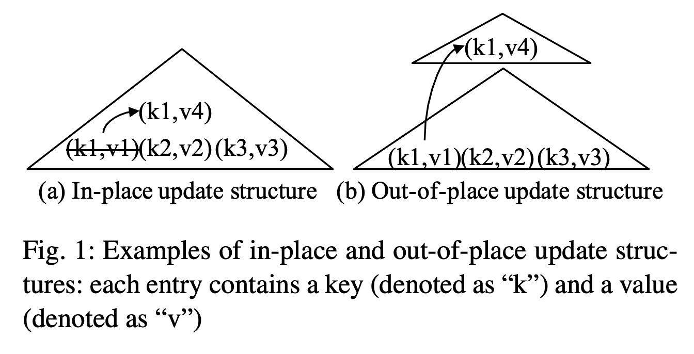
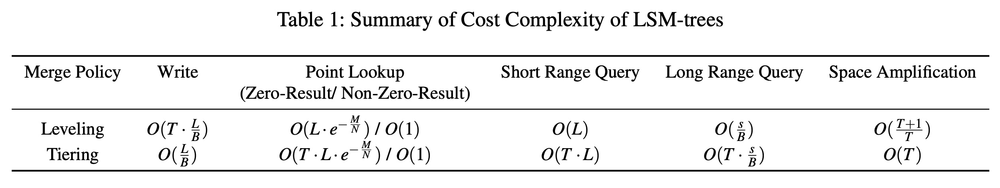
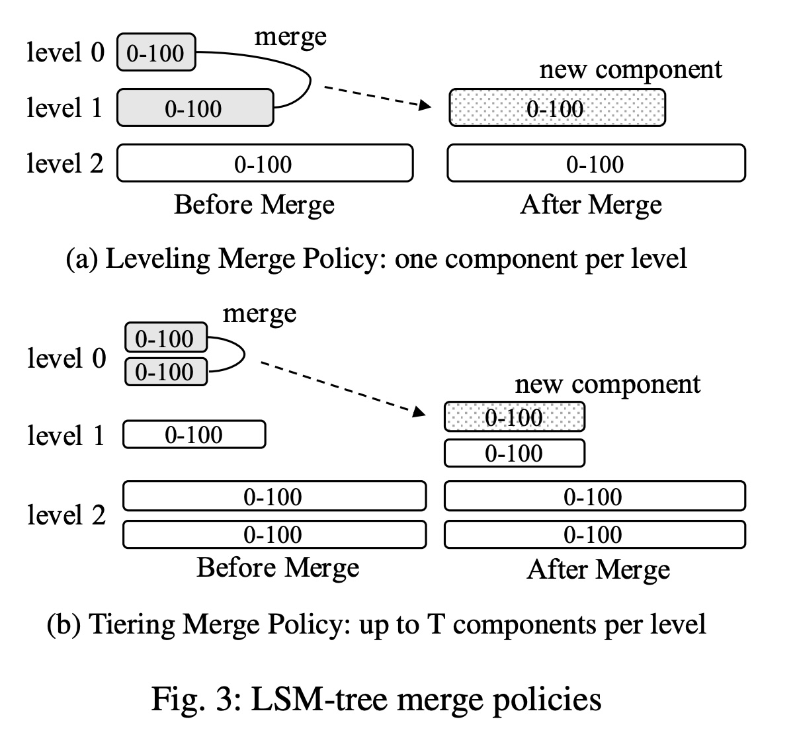
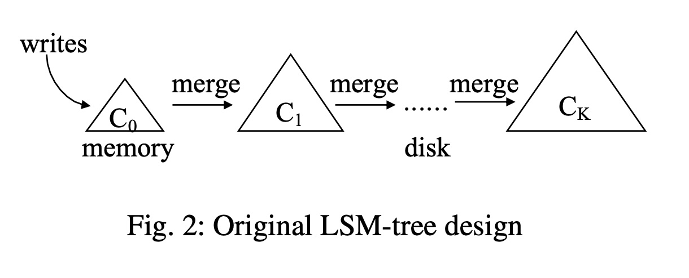
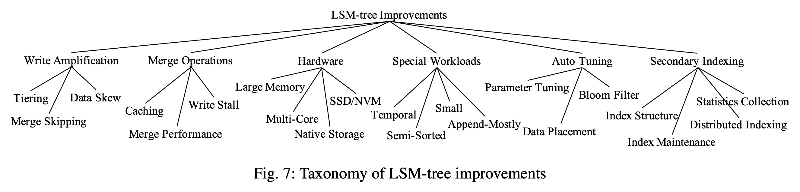

## AI论文解读 | LSM-based Storage Techniques: A Survey
        
### 作者        
digoal        
        
### 日期        
2025-10-29        
        
### 标签        
PostgreSQL , PolarDB , DuckDB , AI , 论文解读        
        
----        
        
## 背景  
      
https://arxiv.org/pdf/1812.07527        
  
提示:          
```          
读懂《LSM-based Storage Techniques: A Survey》这篇论文需要提前掌握哪些基础知识, 请使用中文通熟易懂的讲解这些基础知识, 可以引用论文中的图、表或使用Markdown支持的图形(text,mermaid等)增加解释性. 
  
使用中文通熟易懂的解读《LSM-based Storage Techniques: A Survey》这篇论文, 其中的关键内容请着重讲解, 可以引用论文中的图、表或使用Markdown支持的图形(text,mermaid等)增加解释性. 
  
提取《LSM-based Storage Techniques: A Survey》这篇论文中的重要术语, 使用中文对这些术语进行通熟易懂的讲解, 可以引用论文中的图、表或使用Markdown支持的图形(text,mermaid等)增加解释性. 
```     
  
## 1 前置知识 
  
要完全读懂这篇关于LSM-tree（Log-Structured Merge-tree，日志结构合并树）的综述论文 ，你需要一些数据库、数据结构和计算机系统的基础知识。LSM-tree是许多现代NoSQL数据库（如LevelDB, RocksDB, Cassandra）的核心存储技术 。

这篇论文的目的是对LSM-tree的各种优化技术进行分类和总结 。所以，在深入了解这些“优化”之前，你必须先扎实地掌握它“基础”是什么。

以下是你需要提前掌握的核心基础知识，我会用通俗易懂的方式为你讲解：

### 1\. 基础数据结构：B+树 (B+ Tree)

在LSM-tree出现之前，绝大多数关系型数据库（如MySQL）都使用 $B^{+}$ 树作为其核心索引结构。

  * **它是什么？** 你可以把它想象成一个图书馆里管理所有图书的“目录卡片系统”。它是一个多层、平衡的树形结构。

  * **它如何工作？** 当你要存入一条新数据（比如一本新书）时，系统会找到它在 $B^{+}$ 树中对应的位置（比如“科幻类”的某个书架），然后**直接在那个位置上**插入这条记录。

  * **核心特点：原地更新 (In-place update)**

      * 就像论文中 **Figure 1a**  展示的，当你把 `(k1, v1)` 更新为 `(k1, v4)` 时，你是**直接擦除**旧值 `v1`，在**同一个地方**写入新值 `v4` 。    

    

    ```text
    [ (k1, v1) | (k2, v2) | (k3, v3) ]
          |
          V  更新 (k1, v4)
    [ (k1, v4) | (k2, v2) | (k3, v3) ]  <-- 直接在原处修改
    ```

  * **权衡 (Trade-off)：** 这种方式“读”性能很好（因为数据总是在一个固定位置），但“写”性能较差。因为每次写入都可能需要深入到树的叶子节点，这个过程会产生大量的**随机I/O**（见下一节）。

### 2\. 计算机I/O模型：顺序I/O vs 随机I/O

这是理解LSM-tree设计**动机**的最关键概念。

  * **内存 (RAM) vs 磁盘 (Disk)：** 内存读写速度飞快，但断电数据就没了；磁盘读写速度慢，但数据能永久保存。
  * **磁盘的特性：** 无论你用的是老式机械硬盘(HDD)还是现代固态硬盘(SSD)，它们都存在一个共性：
      * **顺序I/O (Sequential I/O)：** 像听磁带一样，**连续**地从头到尾读写一大块数据。这个过程非常快 。
      * **随机I/O (Random I/O)：** 像给CD换歌一样，**跳跃**地访问磁盘上不连续的、零散的数据块。这个过程非常慢 。

$B^{+}$ 树的“原地更新”问题在于，它会产生大量的**随机I/O**。而LSM-tree的设计哲学就是：**想尽一切办法，把所有的“随机写”操作转换成“顺序写”操作** 。

### 3\. LSM-tree 的核心思想

LSM-tree 通过一个巧妙的机制实现了上述目标。

  * **核心特点：异地更新 (Out-of-place update)**

      * 如论文中 **Figure 1b**  所示，当你更新 `(k1, v1)` 为 `(k1, v4)` 时，LSM-tree**不会去修改**旧的 `v1`，而是直接把 `(k1, v4)` 作为一个**全新的记录**写入到一个新位置 。    

  * **基本流程：**

    1.  **写入内存 (Memtable)：** 所有的写入请求（增、删、改）都首先被写入到内存中的一个数据结构（称为 **Memtable** 或 **$C_0$**） 。内存访问非常快，所以写入操作立即返回。
    2.  **刷盘 (Flush)：** 当Memtable写满后，系统会把它“冻结”并**顺序地**写入到磁盘，形成一个**不可变的**（immutable）文件。这个文件在论文中被称为 **SSTable** (Sorted String Table)  或 **$C_1$** 。
    3.  **合并 (Merge / Compaction)：** 随着时间推移，磁盘上会积累大量零散的SSTable文件 。系统后台会定期运行“合并”操作：把几个小的、旧的SSTable读入内存，合并排序后，再**顺序地**写出一个新的、大的SSTable 。

    

    ```text
    (1) 写入
     [ 内存 Memtable ]  <-- (k1,v4), (k2,v2) ...

          | (2) 内存满了，刷盘 (Flush)
          V
     [ 磁盘 SSTable-1 ]  (顺序写)

     (又写满了...)
          | (2) 刷盘 (Flush)
          V
     [ 磁盘 SSTable-2 ]  (顺序写)

          | (3) 合并 (Merge)
          V
     [ 磁盘 SSTable-3 (合并了1和2) ] (顺序写)
    ```

  * **关键点：** 从始至终，所有的磁盘写入操作（Flush和Merge）都是**顺序I/O**，这极大地提高了写入性能 。

### 4\. 三大“放大效应” (Amplification)

理解了LSM-tree的基本流程后，你必须理解它带来的“代价”。这篇论文中所有的优化技术，几乎都是围绕着解决这“三大放大效应”展开的。

1.  **写放大 (Write Amplification):**

      * **定义：** 你（用户）明明只向数据库写入了1次数据，但数据库（LSM-tree）在后台的合并过程中，可能把这份数据反复读出、写入了5次、10次 。
      * **例子：** 你写入 `(k1, v1)`，它被刷到 $SSTable_1$ 。后来 $SSTable_1$ 和 $SSTable_2$ 合并成 $SSTable_3$ ，你的 `(k1, v1)` 就被**重写**了一次。再后来 $SSTable_3$ 和 $SSTable_4$ 合并...
      * **影响：** 消耗磁盘I/O带宽，并且会缩短SSD的寿命（因为SSD有写入次数限制）。

2.  **读放大 (Read Amplification):**

      * **定义：** 你（用户）只想读取1条数据，但数据库（LSM-tree）可能需要访问**多个文件**才能找到它。
      * **例子：** 你要找 `k1` 的最新值。系统必须先查 Memtable，如果没找到，再去查 $SSTable_1$ ，再查 $SSTable_2$ ... 直到在某个文件里找到它 。
      * **影响：** 查询性能（尤其是点查询）会随着磁盘上文件数量的增加而变差。

3.  **空间放大 (Space Amplification):**

      * **定义：** 你的数据库里实际只有10GB的有效数据，但它却占用了30GB的磁盘空间。
      * **例子：** 你把 `(k1, v1)` 更新为 `(k1, v2)`，又更新为 `(k1, v3)`。在后台合并完成之前，`v1`、`v2`、`v3` 这三个版本的数据可能同时存在于磁盘上 。
      * **影响：** 浪费存储空间，增加成本。

**论文中的 Table 1  完美总结了不同策略在这些“放大效应”上的权衡。**     

### 5\. 两种核心合并策略 (Merge Policy)

为了管理磁盘上的SSTable文件，LSM-tree主要有两种策略，如论文 **Figure 3**  所示。理解这两种策略是读懂论文第3节“改进”的基础。     

  * **Leveling (层级合并):**

      * **结构 (Figure 3a) ：** 磁盘被分为很多层 (Level 1, Level 2, ...)。**每一层只允许有一个**（或一个很大的）SSTable组件 。
      * **合并方式：** 当Level 1的数据（来自内存）满了，它会和Level 2的**整个组件**合并，形成新的Level 2。
      * **权衡：**
          * **优点：** **读放大低**（因为每层只有一个文件，查询很快）。**空间放大低**（因为合并很频繁，旧数据很快被清理）。
          * **缺点：** **写放大非常高**（因为Level 2的数据会被Level 1的数据反复合并，重写很多次）。

  * **Tiering (分层合并):**

      * **结构 (Figure 3b) ：** **每一层允许有多个**（比如 $T$ 个）SSTable组件 。
      * **合并方式：** 只有当Level 1**攒满了 $T$ 个文件**后，才会把这 $T$ 个文件一起合并，形成一个新文件，放入Level 2。
      * **权衡：**
          * **优点：** **写放大低**（数据只在“攒满”时才被合并一次）。
          * **缺点：** **读放大高**（因为你可能要查 $T \times L$ 个文件）。**空间放大高**（因为旧数据在“攒满”之前会一直存在）。

### 6\. 关键优化：布隆过滤器 (Bloom Filter)

这是LSM-tree解决“读放大”问题的最主要手段 。

  * **它是什么？** 它是一个非常省空间的数据结构，用于快速判断“一个元素**是否可能**在一个集合中”。
  * **它的特点：**
      * 它**绝不会“漏报”** ：如果它说“这个key**不**在文件里”，那这个key就100%不在 。
      * 它**可能会“误报”** （false positive）：如果它说“这个key**可能**在文件里”，那么你才需要真正去打开文件检查。但它说的“可能”有小概率是错的 。
  * **LSM-tree如何使用它？**
      * 系统会为**每一个**SSTable文件关联一个布隆过滤器 。
      * 当你要查找 `k1` 时，你不需要真的去读取每个SSTable。你只用先问它们的布隆过滤器：
          * $SSTable_1$ 的过滤器说：“**不在**”。 -\> 你就直接跳过 $SSTable_1$ 。
          * $SSTable_2$ 的过滤器说：“**不在**”。 -\> 你就直接跳过 $SSTable_2$ 。
          * $SSTable_3$ 的过滤器说：“**可能在**”。-\> 你这才去打开 $SSTable_3$ 文件进行查找 。
      * 这极大地提高了**不存在的key**的查询速度，显著降低了读放大。

-----

### 总结

在你开始阅读这篇论文之前，请确保你理解了以下几个核心权衡：

1.  **$B^{+}$树 (原地更新)** vs **LSM-tree (异地更新)** 。
2.  LSM-tree通过牺牲“读性能”和“空间”，换取了极高的“写性能”（通过将随机I/O转为顺序I/O）。
3.  **写放大**、**读放大**、**空间放大**是LSM-tree的三个核心“痛点”，也是所有优化的出发点 。
4.  **Leveling**策略（低读放大，高写放大） 和 **Tiering**策略（高读放大，低写放大） 是两种基础的、相反的优化方向。
5.  **布隆过滤器**  是LSM-tree用来缓解“读放大”问题的关键组件。

当你掌握了这些基础知识后，你就能轻松理解论文中（第3节）提到的各种改进技术，比如它们是如何在“三大放大效应”之间做出更精妙的权衡和取舍的。
  
## 2 解读论文 
  
好的，这篇《LSM-based Storage Techniques: A Survey》（LSM-based 存储技术：一篇综述）是一篇非常经典和全面的学术论文。我来为你用通俗易懂的中文解读一下它的核心内容。

想象一下，你是一家超大型图书馆（数据库）的管理员，每天有成千上万的人来还书（写入数据）和借书（读取数据）。

### 1. 问题的起点：为什么需要 LSM-tree？

在LSM-tree出现之前，最流行的管理方式是 **$B^{+}$树**。

* **$B^{+}$树 (B+ Tree)**：这种方法很像一个管理有序卡片的系统。当有人还一本书（写入数据）时，你必须马上找到这本书在书架上的**确切位置**，把它插进去 。这叫做 **“原地更新” (In-place update)** ，如论文的 **Figure 1a** 所示。    
* **问题**：如果还书的人络绎不绝，你（磁盘）就得不停地在各个书架间跑来跑去（**随机I/O**），效率非常低 。

**LSM-tree (Log-Structured Merge-tree)** 的核心思想就是为了解决这个“写入效率低”的问题 。

* **LSM-tree 的做法**：你不再把书立刻插回原位。而是在图书馆入口放一个“临时还书车”（ **内存组件 $C_0$** ） 。
* **优点**：所有人还书时，只需把书扔到这个车里就行了，速度飞快 。这把“随机写”变成了“顺序写”。

---

### 2. LSM-tree 的核心工作流程

LSM-tree 的工作就像一个多层级的“图书处理流水线”，如论文 **Figure 2** 所示：    

1.  **写入 (Write)**：所有新书（数据）都先被扔进内存中的“还书车”（ 称为 **Memtable** 或 **$C_0$** ） 。
2.  **刷盘 (Flush)**：当“还书车”满了，你不能再往里放了。于是你把这车书打包成一个**不可修改**的箱子（称为 **SSTable**），然后**顺序地**（非常快）放到地上的一个临时区域（**磁盘组件 $C_1$**） 。
3.  **合并 (Merge / Compaction)**：地上很快会堆满越来越多的小箱子（ $C_1$ , $C_2$ , ... , $C_k$ ）。这会导致一个新问题：

    * **找书（读取）变慢了**：当有人要借一本书（读取数据）时，你得先看“还书车”（ $C_0$ ）里有没有，没有的话，再挨个翻地上的每一个箱子（ $C_1$ , $C_2$ ... ），因为你不知道书在哪 。

    为了解决这个问题，你（系统）会在图书馆晚上关门后（后台）进行“整理” 。你会把地上几个小箱子里的书都倒出来，合并并排好序，再装进一个更大的新箱子里 。

---

### 3. 关键权衡：三大“放大效应”

LSM-tree 用“写得快”换来了一些代价，这就是论文中反复提到的 **三大“放大效应”** 。几乎所有的优化都是围绕它们展开的。

* **1. 读放大 (Read Amplification)**
    * **问题**：你明明只想找 1 本书，却不得不翻遍 10 个箱子才能找到它 。
    * **如何缓解 (关键优化)**：**布隆过滤器 (Bloom Filter)** 。
    * **通俗解释**：你给每个箱子配了一个“速查表”。这个表能**非常快**地告诉你：“你要找的这本书**肯定不在**我这个箱子里”。这样，你就可以跳过很多箱子，大大提高查找效率 。

* **2. 写放大 (Write Amplification)**
    * **问题**：用户只还了 1 次书（写入1次），但你在后台整理、合并箱子的过程中，这本书可能被你反复搬运、重写了 5 次、10 次 。
    * **影响**：这会消耗大量的磁盘I/O ，并且会缩短SSD（固态硬盘）的寿命 。

* **3. 空间放大 (Space Amplification)**
    * **问题**：图书馆里明明只有 1 万本**有效**的书，但因为地上堆了很多未合并、包含旧版本（比如同一本书的旧版）的箱子，导致你实际占用了 3 万本书的空间 。

---

### 4. 两种核心“合并策略”（权衡的艺术）

如何整理（合并）箱子，是LSM-tree性能权衡的核心。论文在 **Figure 3** 中对比了两种主流策略：    

* **(a) Leveling (层级合并)**
    * **策略**：非常“洁癖”的策略。它把磁盘分成很多层（Level 1, Level 2...），并规定**每一层最多只能有 1 个大箱子** 。
    * **合并方式**：当Level 1的箱子满了，它会**立刻**被拿去和Level 2的那个大箱子合并，形成一个新的Level 2箱子 。
    * **权衡**：
        * **优点**：**读放大很低**（因为每层只有1个箱子，找书快） 。**空间放大很低**（因为旧数据很快被清理）。
        * **缺点**：**写放大非常高**（因为Level 2的箱子会被Level 1的箱子反复重写） 。
    * **代表**：LevelDB , RocksDB 。

* **(b) Tiering (分层合并)**
    * **策略**：比较“懒”的策略。它允许**每一层堆叠多个（比如T=10个）箱子** 。
    * **合并方式**：只有当Level 1堆满了10个箱子，才**一次性**把这10个箱子合并成1个大箱子，扔到Level 2去 。
    * **权衡**：
        * **优点**：**写放大非常低**（因为数据在每一层只被合并1次） 。
        * **缺点**：**读放大很高**（你可能要查T x L个箱子） 。**空间放大很高** 。
    * **代表**：HBase , Cassandra 。

论文中的 **Table 1 (表1)**  对这两种策略的成本做了精辟的总结，这是理解LSM-tree性能的核心。    

---

### 5. 论文的核心贡献：LSM-tree 改进技术的“分类地图”

这篇论文最重要的贡献，就是画出了 **Figure 7 (图7)**  这张“LSM-tree 优化技术分类地图”。它告诉我们，所有的研究工作都在从以下6个方面进行努力：    

1.  **减少写放大 (Write Amplification)** 
    * **目标**：解决 Leveling 策略写放大的问题。
    * **方法**：大部分研究都是在 Tiering 策略（写放大低）的基础上进行改良，试图在不牺牲太多读取性能的前提下降低写放大 。

2.  **优化合并操作 (Merge Operations)** 
    * **目标**：让后台的“合并”过程更平滑、更智能。
    * **问题**：合并操作会占用大量CPU和I/O，可能导致系统突然卡顿（**写暂停 Write Stall**） 。
    * **方法**：例如 bLSM 提出的“弹簧-齿轮”调度器 ，或者 VT-tree 提出的“缝合”技术（Stitching），避免不必要的I/O。

3.  **利用新硬件 (Hardware)** 
    * **目标**：LSM-tree 是为慢速磁盘设计的，如何适应新硬件？
    * **方法**：
        * **大型内存**：用更大的“还书车”（内存）来减少刷盘次数 。
        * **SSD/NVM**：SSD的随机读取也很快，因此催生了 **WiscKey**  这样的设计——**键值分离** 。
        * **键值分离 (WiscKey)** ：这是一个重大改进。LSM-tree（箱子）里只存放很小的“索引卡片”（Key），而庞大的“书本”（Value）则统一顺序存放到一个大仓库（Value Log） 。合并时只合并“索引卡片”，写放大**极大降低** 。但代价是范围查询和垃圾回收（GC）变得更复杂 。

4.  **处理特殊负载 (Special Workloads)** 
    * **目标**：针对特定场景优化。
    * **方法**：比如 **LSM-trie**  专为大量“小数据”优化；其他研究则针对时间序列数据（append-mostly）进行优化 。

5.  **自动调优 (Auto-Tuning)** 
    * **目标**：LSM-tree 参数太多（合并策略、大小比例T...），用户很难配好 。
    * **方法**：**Monkey**  和 **Dostoevsky**  是这方面的代表。它们通过数学模型来自动计算出在当前工作负载下，最优的参数组合（比如是该用Leveling还是Tiering？内存该给布隆过滤器分多少？）。

6.  **二级索引 (Secondary Indexing)** 
    * **目标**：我们不仅想按“书名”（主键）找书，还想按“作者”（非主键）找书。
    * **问题**：在LSM-tree上维护二级索引非常困难，因为数据在不断地合并和移动 。
    * **方法**：研究如何高效地、异步地去维护这些二级索引，比如 DELI  和 Diff-Index 。

---

### 总结

这篇论文为你梳理了LSM-tree从一个简单的“日志结构”思想，演变为一个复杂、高性能、但充满权衡的存储引擎的全过程。

**你只需要记住：**
1.  LSM-tree 的核心是用 **“顺序写”** 换取**极高写入性能** 。
2.  它必须在 **读放大、写放大、空间放大** 这三者之间做出艰难的权衡 。
3.  **Leveling（洁癖）** 和 **Tiering（懒人）** 是两种基础的、相反的合并策略 。
4.  所有的现代优化（如键值分离、自动调优）都是在试图打破或优化这个“不可能三角”，以适应不同的硬件和工作负载。
  
## 3 术语 
  
这篇论文《LSM-based Storage Techniques: A Survey》对日志结构合并树（LSM-tree）技术进行了全面的综述。以下是论文中提取的重要术语及其通俗易懂的中文讲解。

### 核心术语与概念

#### 1. 日志结构合并树 (Log-Structured Merge-tree, LSM-tree)

* **定义与原理：** LSM-tree 是一种存储索引结构，广泛应用于现代 NoSQL 系统（如 BigTable, RocksDB, Cassandra）的存储层 。它与传统的索引结构（如 B+-tree）最大的区别在于采用了**非原地更新**的策略 。
* **工作机制：** 所有写入操作（插入、更新、删除）首先在**内存组件 ( $C_0$ )** 中缓冲，当内存组件满后，会以**顺序 I/O** 的方式将其刷新到磁盘，形成一个不可变的**磁盘组件 ( $C_i$ )**。后台会持续运行 **合并（Merge/Compaction）** 操作，将旧的磁盘组件合并成新的、更大的组件，以删除过时数据和提升查询效率 。
* **优势：** 由于写入操作主要发生在内存和顺序磁盘 I/O 中，LSM-tree 提供了出色的**写入性能**、高空间利用率和简化了并发控制及恢复过程 。

#### 2. 组件 (Component) / 运行段 (Run)

* **定义：** LSM-tree 由一系列组件 $C_0, C_1, \dots, C_k$ 组成 。
    * **$C_0$（内存组件/Memtable）：** 位于内存中，用于接收所有传入的写入操作 。
    * **$C_1 \dots C_k$（磁盘组件/SSTable）：** 位于磁盘上，由内存组件刷新而来，是**不可变**的有序数据结构 。在文献中，磁盘组件也常被称为**运行段 (Run)** 。

#### 3. 有序字符串表 (Sorted-String Table, SSTable)

* **定义：** 现代 LSM-tree 实现中，磁盘组件通常会被**范围分区 (range-partition)** 成多个固定大小的小分区，这些小分区就是 SSTable 。
* **结构：** SSTable 包含一个按键排序的键值对列表（数据块）和一个索引块（存储数据块的键范围） 。
* **作用：** 采用 SSTable 分区可以：
    1.  将大型合并操作分解成多个较小的操作，限制了每次合并的处理时间 。
    2.  优化具有顺序键或倾斜更新的工作负载，只合并键范围重叠的组件 。

#### 4. 合并策略 (Merge Policy)

LSM-tree 的性能核心在于其合并（Compaction）策略。论文中主要介绍了两种实践中常用的策略，它们由一个**大小比例 $T$** 控制 。

| 策略名称 | 中文解释 | 每层组件数 | 优点 (优化目标) | 缺点 (权衡) |
| :--- | :--- | :--- | :--- | :--- |
| **分级合并 (Leveling Merge Policy)** | 每层只维护**一个**组件 。每次合并操作会将 $L$ 层的组件与 $L+1$ 层中键范围重叠的部分合并。 | 1  | 优化**查询性能**和**空间利用率**（组件少） 。 | **写入放大高**（合并频率高，写入成本高） 。 |
| **分层合并 (Tiering Merge Policy)** | 每层最多维护 **$T$ 个**组件 。当组件达到 $T$ 个时，所有 $T$ 个组件会被合并成一个新组件并移动到下一层。 | $\le T$  | 优化**写入性能**（合并频率低） 。 | **查询性能和空间利用率差**（组件多） 。 |

#### 5. 布隆过滤器 (Bloom Filter)

* **定义：** 一种空间效率高的**概率性数据结构**，用于回答“某个键是否存在于集合中”的查询 。
* **特性：**
    * 可能产生**假阳性 (False Positive)**：报告键存在，但它可能不存在 。
    * 绝不会产生**假阴性 (False Negative)**：报告键不存在，它就一定不存在 。
* **在 LSM-tree 中的应用：** 布隆过滤器可以建立在磁盘组件之上，用于在进行**点查询 (Point Lookup)** 时，快速判断一个键是否可能存在于该组件中 。这大大减少了不必要的磁盘 I/O，从而提高了查询性能 。

### 性能衡量指标 (Amplification)

LSM-tree 的设计需要在写入成本、读取成本和存储成本之间进行权衡 (RUM 猜想) 。这三种成本通常用以下“放大”指标来衡量：

| 术语 | 中文解释 | 衡量对象 | 含义 (越低越好) |
| :--- | :--- | :--- | :--- |
| **写入放大 (Write Amplification, WA)** | 写入到磁盘的总数据量与用户写入的原始数据量之比 。 | 写入成本 (Update Cost, U) | 衡量合并操作（Compaction）产生的额外写入开销 。 |
| **读取放大 (Read Amplification, RA)** | 完成一次读取操作（查询）所需的磁盘 I/O 次数 。 | 读取成本 (Read Cost, R) | 衡量查询时需要检查的组件（SSTable）数量 。 |
| **空间放大 (Space Amplification, SA)** | 存储的总条目数与唯一条目数之比 。 | 存储成本 (Memory/Storage Cost, M) | 衡量由于尚未被垃圾回收的过时版本记录而产生的额外存储空间占用 。 |

**总结：**

LSM-tree 是一种高度可调优的结构 。

* **分级策略**：牺牲**写入放大**，换取更低的**读取放大**和**空间放大**。
* **分层策略**：牺牲**读取放大**和**空间放大**，换取更低的**写入放大**。
  
## 参考        
         
https://arxiv.org/pdf/1812.07527    
        
<b> 以上内容基于DeepSeek、Qwen、Gemini及诸多AI生成, 轻微人工调整, 感谢杭州深度求索人工智能、阿里云、Google等公司. </b>        
        
<b> AI 生成的内容请自行辨别正确性, 当然也多了些许踩坑的乐趣, 毕竟冒险是每个男人的天性.  </b>        
    
#### [期望 PostgreSQL|开源PolarDB 增加什么功能?](https://github.com/digoal/blog/issues/76 "269ac3d1c492e938c0191101c7238216")
  
  
#### [PolarDB 开源数据库](https://openpolardb.com/home "57258f76c37864c6e6d23383d05714ea")
  
  
#### [PolarDB 学习图谱](https://www.aliyun.com/database/openpolardb/activity "8642f60e04ed0c814bf9cb9677976bd4")
  
  
#### [PostgreSQL 解决方案集合](../201706/20170601_02.md "40cff096e9ed7122c512b35d8561d9c8")
  
  
#### [德哥 / digoal's Github - 公益是一辈子的事.](https://github.com/digoal/blog/blob/master/README.md "22709685feb7cab07d30f30387f0a9ae")
  
  
#### [About 德哥](https://github.com/digoal/blog/blob/master/me/readme.md "a37735981e7704886ffd590565582dd0")
  
  

  
