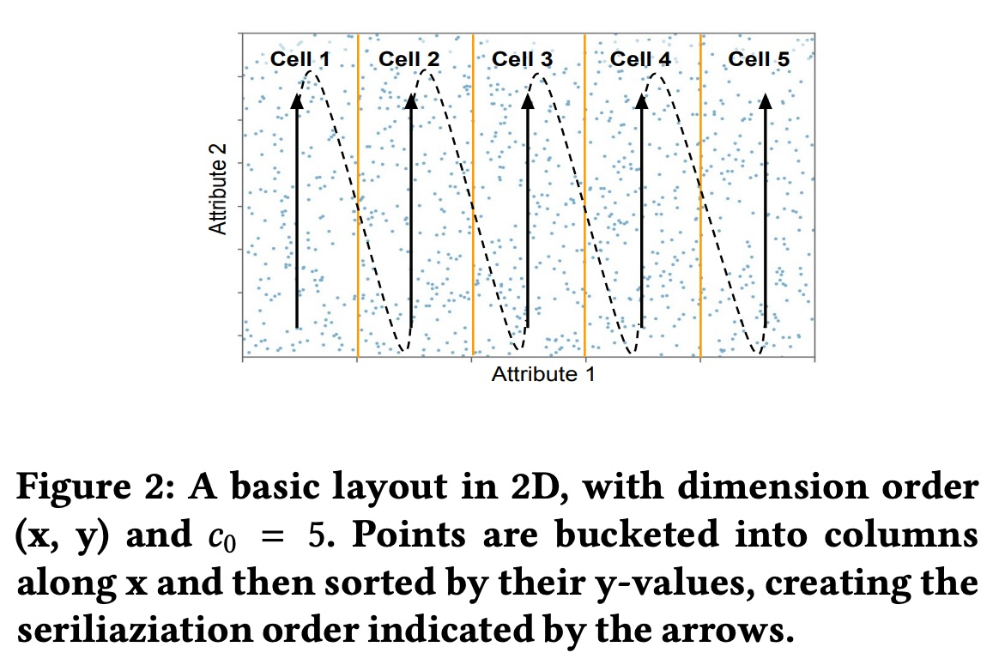
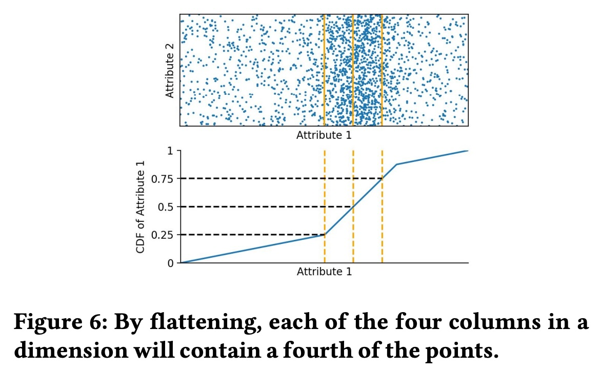
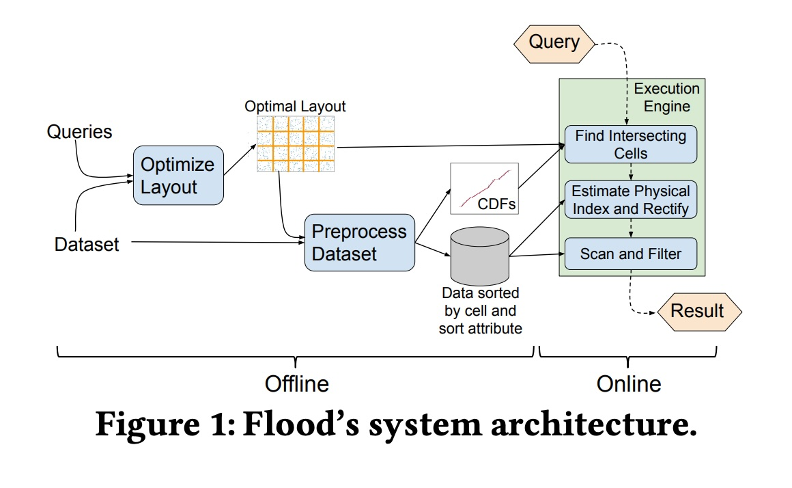
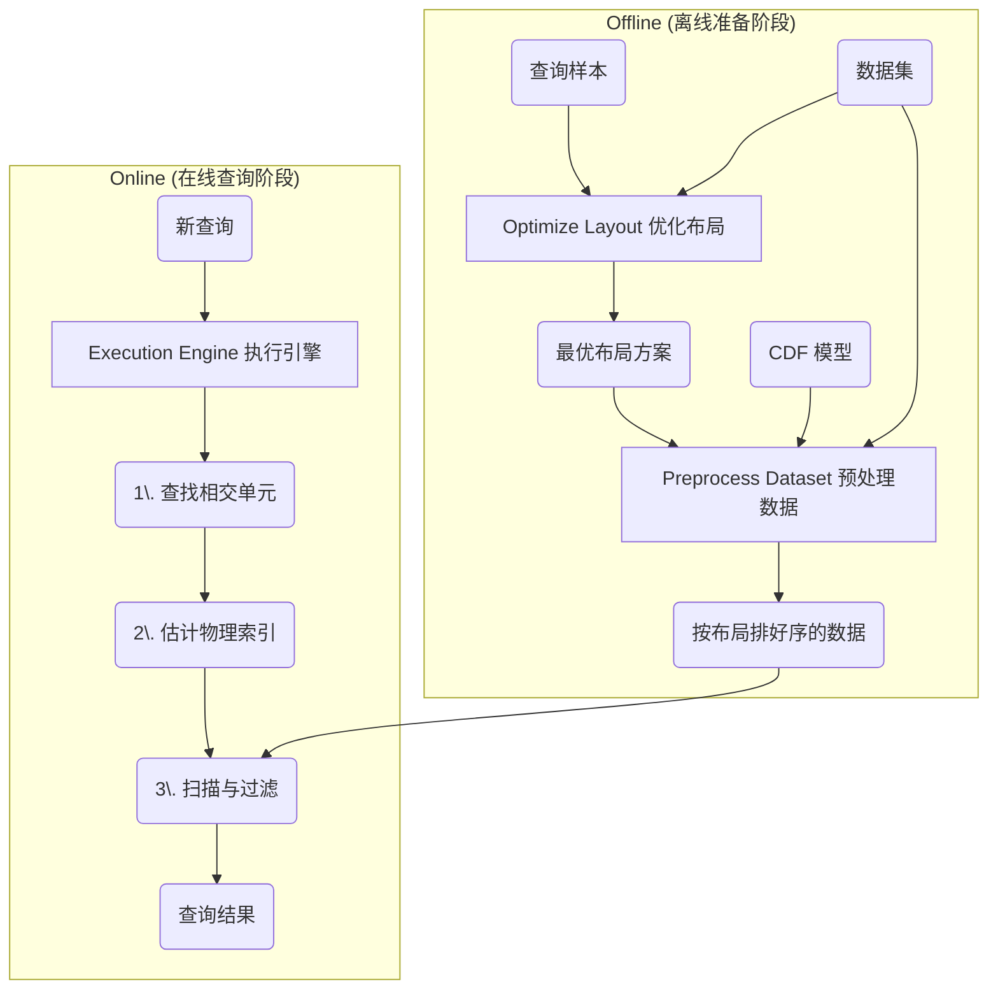
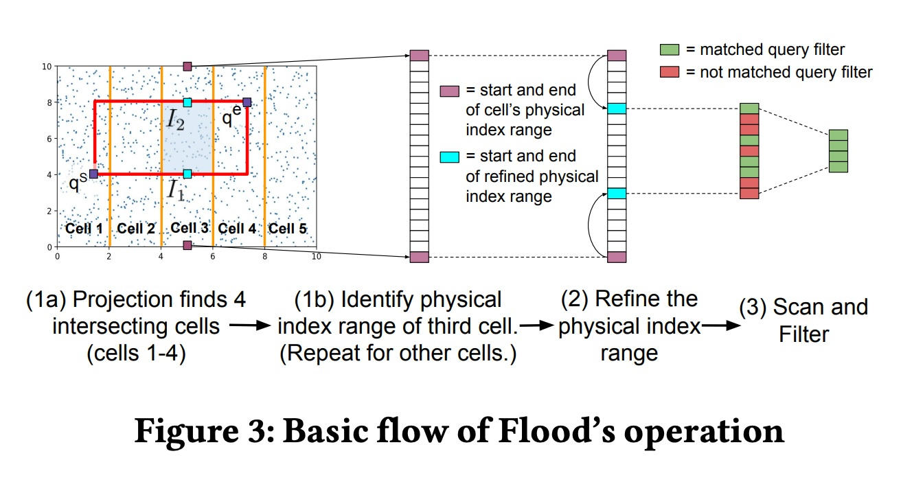
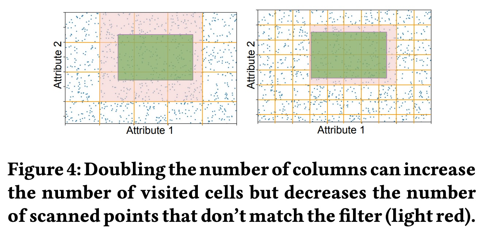
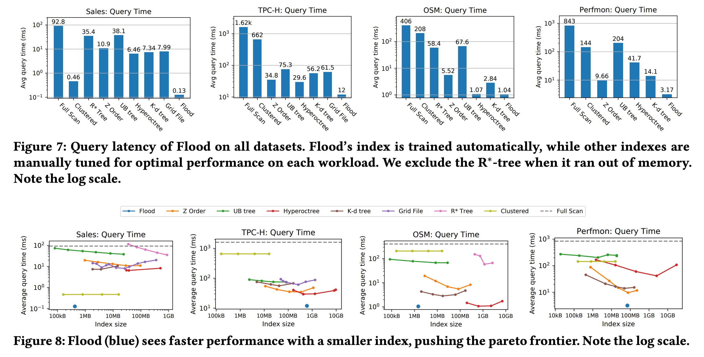
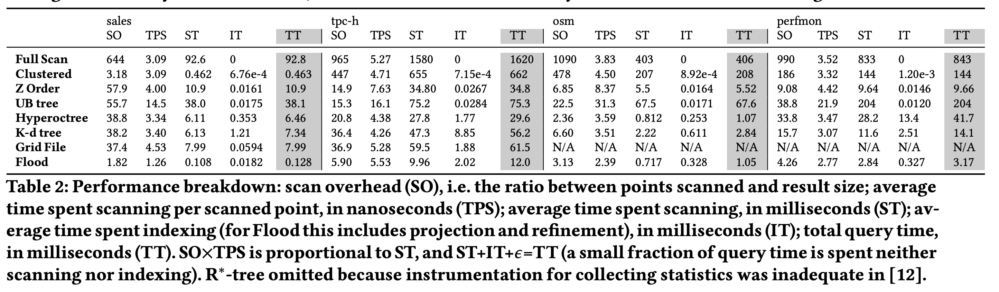

## AI论文解读 | Learning Multi-dimensional Indexes
        
### 作者        
digoal        
        
### 日期        
2025-10-29        
        
### 标签        
PostgreSQL , PolarDB , DuckDB , AI , 论文解读        
        
----        
        
## 背景  
      
https://dl.acm.org/doi/pdf/10.1145/3318464.3380579        
  
提示:          
```          
读懂《Learning Multi-dimensional Indexes》这篇论文需要提前掌握哪些基础知识, 请使用中文通熟易懂的讲解这些基础知识, 可以引用论文中的图、表或使用Markdown支持的图形(text,mermaid等)增加解释性. 
  
使用中文通熟易懂的解读《Learning Multi-dimensional Indexes》这篇论文, 其中的关键内容请着重讲解, 可以引用论文中的图、表或使用Markdown支持的图形(text,mermaid等)增加解释性. 
  
提取《Learning Multi-dimensional Indexes》这篇论文中的重要术语, 使用中文对这些术语进行通熟易懂的讲解, 可以引用论文中的图、表或使用Markdown支持的图形(text,mermaid等)增加解释性. 
```     
  
## 1 前置知识 
  
理解《Learning Multi-dimensional Indexes》这篇论文，你需要具备以下几个领域的基础知识。这篇论文的核心是介绍一个名为 **Flood** 的新型数据库索引 ，它**利用机器学习技术**来自动优化多维数据的查询性能 。

为了让你更容易理解，我将为你“通俗易懂”地讲解这些必备知识点：

---

### 1. 数据库索引 (Database Indexing) 基础

这是理解这篇论文的“为什么” (Why) 的关键。

* **什么是索引？**
    想象一本很厚的书，你想找某个特定的知识点。如果没有目录，你只能一页一页地翻（这叫“全表扫描”）。索引就像是书的**目录**，它告诉你某个词条在哪一页，让你能“跳”到那一页，大大加快查找速度。在数据库中，索引就是这样一个帮助快速定位数据的数据结构。

* **什么是多维索引？**
    * **单维索引**：就像书的目录只按“拼音首字母”排序。如果你想查“年龄 = 30岁”的人，这种索引很管用 。
    * **多维索引**：如果你想查“年龄在 30 到 40 岁之间” **并且** “工资在 10万到 20万之间”的人，单维索引就不好使了。你需要一个能同时处理“年龄”和“工资”这两个维度的索引，这就是多维索引 。

* **什么是聚集索引 (Clustered Index)？**
    聚集索引规定了数据在磁盘（或内存）上的**物理存储顺序** 。想象一下，你不是在书后面建目录，而是直接把书的内容按拼音顺序重新排版。Flood 就是一种聚集索引 ，它会决定数据点该如何物理排列。

### 2. 经典的多维索引结构

论文中提到了很多 Flood 用来对比的“现有技术” 。了解它们，你才能明白 Flood 好在哪里。

* **树形索引 (k-d 树, R-Tree)**
    你可以把它们想象成“俄罗斯套娃”或“切蛋糕”。它们通过不断地把数据空间“切”成更小的矩形区域（或“盒子”）来组织数据 。查询时，就像打开一层层套娃，只检查那些和你的查询范围相交的盒子。
* **空间填充曲线 (Z-ordering)**
    这是一个很巧妙的技巧。它能把一个二维（或多维）的点，通过一种固定的“Z”字形遍历顺序，转换成一个一维的数值 。这样，我们就可以用成熟的单维索引（如 B-Tree）来管理多维数据了。
* **网格文件 (Grid File)**
    **这是理解 Flood 的关键！** Flood 自称是“网格索引的变体” 。
    * **基本思想**：就像在地图上画网格，把二维空间分割成很多个“单元格” (Cell) 。每个单元格负责存储落在它范围内的数据点。
    * **Flood 的改进**：传统的网格文件很难调整（比如网格该画多密） 。Flood 则是**自动学习**如何“画网格”，以适应特定的数据和查询需求 。

    你可以这样理解 Flood 的基本结构 (见论文图2 )：    
    * 假设有2个维度（属性1，属性2）。
    * Flood 决定在“属性1”上切 5 刀，分成了 5 个“列”（Cell 1 到 Cell 5） 。
    * “属性2”则作为“排序维度” (sort dimension) 。
    * 在每个 Cell 内部（例如 Cell 1），所有数据点都按“属性2”的值进行物理排序 。
    * 所有 Cell 1 的数据存完后，再存 Cell 2 的数据，以此类推 。

### 3. 机器学习 (Machine Learning) 与“学习型索引”

这是论文的“如何做” (How) 的核心。

* **什么是“学习型索引” (Learned Index)？**
    这是本篇论文的基石，源于 2018 年的一篇开创性论文《The Case for Learned Index Structures》 。
    * **核心思想**：索引（比如 B-Tree）的本质是一个函数，它把一个“键”(Key) 映射到它在内存中的“物理位置”(Position)。
    * `Index(Key) -> Position`
    * 传统索引使用树、哈希表等结构来 *近似* 这个函数。
    * “学习型索引”则认为，**机器学习模型**（如神经网络、回归模型）也可以 *学习* 这个函数！
    * 如果数据有规律（比如数据是 1, 2, 3... 这样的序列），模型可以学到 `Position = Key - 1` 这个公式，从而完全取代索引结构，既快又省空间。

* **Flood 如何使用 ML？**
    Flood 在两个关键地方使用了 ML：
    1.  **用于“布局优化”的成本模型 (Cost Model)**
        Flood 需要决定很多参数：用哪个维度来排序？其他维度各切分成多少个单元格？
        为了做出最佳决策，它训练了一个机器学习模型（如随机森林） 来充当“预言家”。这个模型能**预测**在某个特定布局下，执行查询大概需要多少时间 (Time) 。
        `Time = w_p * N_c + w_r * N_c + w_s * N_s` 
        （ $N_c$ 是单元格数， $N_s$ 是扫描点数 ）
        Flood 会尝试不同的布局参数，选那个模型预测“总时间”最短的布局 。

    2.  **用于“数据建模”的 CDF 模型**
        这部分和下面的统计学知识紧密相关。

### 4. 统计学：CDF 和数据分布

这是 Flood 解决“数据倾斜”问题的关键。

* **数据倾斜 (Skew) vs. 均匀分布**
    * **均匀分布**：数据是均匀散开的。
    * **倾斜分布**：数据是“扎堆”的 。比如，大部分人的工资都很低，少数人非常高。
    * **问题**：如果使用简单的“等宽”网格（如上图），在数据稀疏的地方（高工资区），单元格是空的；在数据密集的地方（低工资区），单元格会“爆满” 。这会导致查询性能极差。

* **什么是 CDF (累积分布函数)？**
    CDF (Cumulative Distribution Function) 是一个统计学函数 。
    * **通俗解释**：它告诉你，“小于等于某个值 $x$ 的数据占总数据量的百分比是多少？”
    * 例如，在一个班级里，`CDF(60分)` 可能等于 25%（表示25%的人不及格）；`CDF(100分)` 等于 100%。

* **Flood 的“扁平化” (Flattening) 技巧**
    Flood 不用“等宽”的网格，而是用 CDF 来画网格，确保**每个单元格包含的数据点数量大致相等** 。
    * **见论文 Figure 6** ：    
        * 在上半部分的散点图中，数据明显“扎堆”在中间。
        * 下半部分是该维度（属性1）的 CDF 曲线。
        * Flood 不在“属性1”的值域上等分（如 20, 40, 60, 80），而是在 CDF 的值域（Y轴）上等分（如 25%, 50%, 75%） 。
        * 再映射回“属性1”（X轴），你会发现网格线在数据密集处变得更密，在稀疏处变得更疏。
    * **结果**：这样切分后，每个单元格（比如0%-25%的单元格）里的数据量都差不多 。这就叫“扁平化” 。
    * Flood 使用 **RMI (递归模型索引)**  这种学习型结构来高效地拟合 CDF 曲线。

### 5. 数据库系统概念

这些是论文所处的“环境”。

* **OLAP vs. OLTP**
    * **OLTP (在线事务处理)**：侧重于快速的、小规模的“增删改查”。比如银行转账、下订单。
    * **OLAP (在线分析处理)**：侧重于复杂的、大规模的“查询分析”。比如“统计过去一年里，所有分店的总销售额” 。
    * Flood 明确表示自己是为 **OLAP** 和**只读**工作负载优化的 。

* **In-Memory (内存数据库)**
    Flood 是一个“内存中”(in-memory) 的索引 。这意味着它假设所有数据都存在于 RAM（内存）中，而不是传统的硬盘 (Disk) 上。在内存中，CPU 计算（比如运行模型）的开销相对更突出，而数据读取延迟则非常低。

* **Column Store (列存储)**
    OLAP 数据库通常使用“列存储” 。
    * **行存储**：一行数据（如张三, 30岁, 10万工资）存在一起。
    * **列存储**：一列数据（如所有人的年龄）存在一起。
    * 当查询“计算所有人平均年龄”时，列存储只需读取“年龄”这一列，非常快。

---

### 总结：你需要懂什么？

要读懂这篇论文，你需要：

1.  **（数据库）** 知道什么是索引，特别是多维索引，以及为什么“全表扫描”很慢。
2.  **（数据结构）** 对 R-Tree, Z-ordering，特别是 **Grid File**（网格文件）有基本了解。
3.  **（机器学习）** 理解“学习型索引”的核心思想：**模型可以替代数据结构**，以及如何用模型（如随机森林）去预测成本（Cost Model）。
4.  **（统计学）** 理解什么是 **CDF (累积分布函数)**，以及为什么真实世界的数据是“倾斜的”(Skewed)，Flood 如何用 CDF 来“扁平化”数据（ **Figure 6** ）。   

简单来说，Flood 就是一个**智能的、会学习的网格文件 (Grid File)**。它通过 **学习查询（Cost Model）** 来决定网格的**最佳布局**，通过 **学习数据（CDF Model）** 来决定网格的**最佳划分**，从而实现超高的查询性能 。

您希望我深入讲解其中某一个概念（比如 "Flattening" 或 "Cost Model"）吗？
  
## 2 解读论文 
  
好的，这是一篇非常经典的“学习型索引”领域的论文。我将为你通俗易懂地解读《Learning Multi-dimensional Indexes》（学习多维索引）这篇论文，并重点讲解它的核心内容。

-----

### 1\. 论文简介：Flood 是什么？

这篇论文  介绍了一个名为 **Flood** 的新型数据库索引 。

  * **它的用途是？**
    专门为“内存数据库” (In-memory) 设计，用于极大地加快“多维数据”的“只读”查询（即 OLAP 分析型查询） 。

  * **什么是“多维查询”？**
    就是你的查询条件 (SQL中的 `WHERE` 语句) 同时涉及多个列（维度）。例如：
    `SELECT COUNT(*)`
    `FROM sales`
    `WHERE (年龄 BETWEEN 30 AND 40)`
    `AND (工资 BETWEEN 100000 AND 200000)`
    `AND (地区 = '华北')`
    这是一个三维查询（年龄、工资、地区）。

  * **Flood 的“绝活”是什么？**
    它是一个 **“会学习”** 的索引。它能**自动**分析你的 **数据长什么样**（数据分布）以及你**平时怎么查**（查询模式），然后“量身定制”出一个最优的索引结构和数据物理布局 。

  * **效果如何？**
    论文声称，Flood 的查询性能比那些“手工调优”的传统多维索引（如 R-Tree 或 Z-ordering） **快了最高三个数量级**（也就是 1000 倍！）。

-----

### 2\. 核心问题：传统索引“笨”在哪里？

在 Flood 出现之前，数据库管理员 (DBA) 已经有很多多维索引技术可选，比如 R-Tree、k-d 树、Z-ordering（Z序曲线）等 。但它们有三个重大缺陷：

1.  **极难调优 (Hard to tune):**  DBA 必须像个“老中医”一样，凭经验去猜测哪个列最重要，数据的排序该怎么定（比如 Vertica 数据库）。这需要对数据和查询都有极深的理解，费时费力 。
2.  **性能不一致 (Inconsistent performance):**  没有一种索引能“包打天下”。可能 R-Tree 在这个数据集上快，换个数据集 Z-ordering 又反超了 。
3.  **无法精细定制 (Cannot be tailored):**  传统索引的“可调参数”太少了（比如页面大小），无法为一个特定的数据集和查询模式做到“极致优化”。

**Flood 的目标就是：** 做一个“智能”索引，把“调优”这个活儿从人手里接过来，用机器学习自动搞定 。

-----

### 3\. Flood 的核心思想：两大“学习”法宝

Flood 的成功依赖于它的两大核心技术，它既“学习数据”，也“学习查询”。

  * **法宝一：学习“查询模式” (Learning from the Workload)**
    Flood 会分析你的历史查询（或一个样本查询集），搞清楚：你经常查哪些列？哪些列总是一起查？哪些列的过滤性更强（比如“地区”比“年龄”筛掉的人更多）？ 基于这些信息，它会自动优化整个索引的“布局” (Layout) 。

  * **法宝二：学习“数据分布” (Learning from the Data)**
    真实世界的数据几乎都是“倾斜”的（Skewed），即数据分布极不均匀 。比如，大部分人收入集中在某个区间，极少数人收入特别高。Flood 使用统计学中的 **CDF (累积分布函数)** 模型来学习这种不均匀的分布，然后把数据“**扁平化**” (Flattening) ，映射到一个更均匀的空间里。

-----

### 4\. 关键技术点 1：Flood 的架构与工作原理

我们先看 Flood 是如何组织数据和处理查询的。

#### 4.1 Flood 的系统架构 (参考 Figure 1)

  

Flood 的工作分为“离线”和“在线”两部分 。



  * **离线 (Offline):** Flood 综合分析“查询样本”和“数据集”，通过“优化布局”模块  产出一个“最优布局方案” 。然后，“预处理数据”模块  根据这个布局方案和数据的 CDF 模型 ，把原始数据进行重排序，并存入内存 。
  * **在线 (Online):** 当一个新查询来了，执行引擎  只需要三步：(1) 找到查询命中了哪些单元格 ；(2) 精确估计这些单元格在内存中的物理位置 ；(3) 只扫描这些极小范围的数据并过滤 。

#### 4.2 Flood 的数据布局 (参考 Figure 2)

  

Flood 的核心是一种“**网格索引**” (Grid Index) 的变体 。

  * 假设我们有 $d$ 个维度，Flood 会选择其中 $d-1$ 个维度来“画网格” ，而**最后一个维度（第 $d$ 维）作为“排序维度”** (Sort Dimension) 。
  * **请看论文中的 Figure 2** ：这是一个二维的例子（属性1，属性2）。
      * Flood 选择“属性1”作为**网格维度**，把它切分成了 5 个单元 (Cell 1 到 Cell 5) 。
      * 它选择“属性2”作为**排序维度**。
      * **数据的物理存储顺序是：**
        1.  先把 Cell 1 里的所有数据点，**按照“属性2”的值排好序**，依次存入内存 。
        2.  接着，再把 Cell 2 里的所有数据点，也**按照“属性2”的值排好序**，紧挨着 Cell 1 存入内存 。
        3.  依此类推...
      * Figure 2 中那个 Z 字形的箭头，就代表了数据在内存中的实际物理存储顺序 。

#### 4.3 Flood 的查询流程 (参考 Figure 3)

理解了数据布局，查询流程就简单了（**请看论文中的 Figure 3** ）：    

1.  **步骤 1: Projection (投影)**
    一个查询（图中的红色矩形框）来了。Flood 首先计算这个红框与哪些“网格单元”相交 。在 Figure 3 的例子中，它命中了 Cell 1, 2, 3, 4 。Flood 维护了一个“单元表” (Cell Table)，记录了每个 Cell 在内存中的起始位置，所以这步非常快 。

2.  **步骤 2: Refinement (精炼)**
    这是最关键的一步。现在 Flood 知道要查 Cell 1 到 4。但它能做得更好！
    因为它知道**每个 Cell 内部是按“排序维度”（比如属性2）排好序的** 。

      * 查询红框在“属性2”上也有一个范围（ 比如 $a \le R.S \le b$ ）。
      * Flood 可以在每个 Cell 的数据内部（比如 Cell 3），利用这个排序特性，通过二分查找或模型预测，**极快地定位**到 $R.S \ge a$ 的第一个点 $I_1$ 和 $R.S \le b$ 的最后一个点 $I_2$ 。
      * 如图 3 所示，Cell 3 对应的物理索引范围（灰色条带） 就被“精炼”成了更小的（蓝绿色条带）。

3.  **步骤 3: Scan and Filter (扫描与过滤)**
    Flood 只需要扫描那些被“精炼”后的极小物理范围 。如图 3 最右侧所示，它只扫描蓝绿色条带中的数据，然后过滤掉那些不完全匹配的红点，只保留匹配的绿点 。

-----

### 5\. 关键技术点 2：Flood 的两大“学习”秘诀（重点！）

上面讲的只是 Flood 的“骨架”，它的“灵魂”在于如何利用机器学习来决定这个“骨架”该长成什么样。

#### 5.1 秘诀一：学习数据——用 CDF “扁平化” (Flattening)

  * **问题：** 上面 Figure 2 的切分是“等宽”的 。如果数据分布不均，比如 90% 的数据点都挤在 Cell 3 怎么办？这会导致 Cell 3 巨大无比，扫描起来很慢 。    
  * **Flood 的解决方案：** **不等宽切分！** 它使用 CDF (累积分布函数) 模型来指导切分，确保**每个单元格里的数据点数量大致相等** 。
  * **请看论文中的 Figure 6** ：    
      * **上半图**：是原始数据，可以清晰看到数据点在“属性1”上是“扎堆”在中间的。
      * **下半图**：是“属性1”的 CDF 曲线。X 轴是属性值，Y 轴是“小于等于该值的数据占总量的百分比” 。
      * **Flood 的做法**：它不在 X 轴（属性值）上等分，而是在 **Y 轴（百分比）上等分** 。比如它决定切 4 个单元，它就在 Y 轴的 25%, 50%, 75% 处切三刀 。
      * **结果**：这三刀映射回 X 轴（看图 6 中的虚线），你会发现：在数据稀疏的地方（两端），单元格非常宽；在数据密集的地方（中间），单元格变得非常窄。
      * 这就是“**扁平化**” (Flattening) ：通过智能切分，把一个不均匀的分布，变成了每个单元格“负载”均匀的布局。Flood 使用 RMI (一种学习型索引) 来高效拟合这个 CDF 曲线 。

#### 5.2 秘诀二：学习查询——用“成本模型”优化布局

现在数据被“扁平化”了，但 Flood 仍需做两个关键决策 ：

1.  **选哪个维度当“排序维度”？** （那个第 $d$ 维）
2.  **其他 $d-1$ 个“网格维度”，每个该切分成多少列？** (比如属性1切100列，属性3切10列？) 


  * **这是一个权衡 (Trade-off)**：
      * 网格切得越细（**参考 Figure 4** ），单元格 (Cell) 越多，扫描时需要过滤的“无效数据”（图 4 浅红色部分）就越少，**Scan 步骤越快** 。    
      * 但是，单元格越多，**Projection 和 Refinement 步骤就越慢**（因为要处理的单元格变多了）。
  * **Flood 的解决方案：** 它建立了一个**成本模型 (Cost Model)** ，来*预测*不同布局下的总查询时间。
      * `总时间 = (投影开销 * 单元格数) + (精炼开销 * 单元格数) + (扫描开销 * 扫描点数)`
      * 即 `Time(D,q,L) = w_p * N_c + w_r * N_c + w_s * N_s` 
  * **如何学习？**
    这里的 $w_p, w_r, w_s$ (即每一步操作的单位时间) 并不是常数，它受 CPU 缓存、数据局部性等复杂因素影响 。
    Flood 另辟蹊径：它使用一个**机器学习模型（随机森林）**  来*学习*预测这些 $w$ 值。
  * **优化过程**：
    Flood 会尝试所有 $d$ 种“排序维度”的可能 。对于每一种可能，它使用**梯度下降算法**  来搜索 $d-1$ 个网格维度的最佳切分列数 $\{c_i\}$ ，其目标就是让上面那个“成本模型”预测出的**总时间最小** 。
    这个过程在“离线”阶段完成，虽然需要一些时间，但一旦找到最优布局，在线查询将变得极快。

-----

### 6\. 实验效果：Flood 真的“遥遥领先”吗？

论文的实验结果非常惊艳，我们重点看两个图：    

  * **Figure 7 (总性能对比)**  

      * 这张柱状图显示了在 4 个真实数据集上，不同索引的平均查询时间（越低越好）。
      * **结论**：Flood (最右侧的蓝色柱子) 在**所有**数据集上都取得了**最低**的查询延迟 。
      * **更重要的是**：其他索引的性能非常不稳定 。比如，Clustered（传统单维索引）在 Sales 数据集上是第二名 ，但在 TPC-H 上慢了 187 倍 。这证明了 Flood 的“自适应”能力是实实在在的优势。

  * **Figure 8 (性能 vs. 空间 帕累托图)**  

      * 这张图的 X 轴是“索引大小”（越左越小），Y 轴是“查询时间”（越下越快）。**最理想的位置是左下角**。
      * **结论**：Flood (图中的蓝色圆点) 在所有四个数据集上，都牢牢占据了“左下角”的帕累托最优位置 。
      * **举个例子**：在 OSM 数据集上，Flood 的查询速度与 Hyperoctree (一种树形索引) 相当，但它的**索引体积 (Index size) 却小了 20 倍以上** ！

-----

### 7\. 总结与启示

《Learning Multi-dimensional Indexes》这篇论文的核心贡献在于证明了：

1.  **“学习”是可行的：** 索引结构不再需要人类专家“手工调优”，可以通过机器学习模型自动、智能地生成 。
2.  **“双重学习”是关键：** Flood 之所以强大，因为它**同时学习“数据分布”（通过 CDF 扁平化）**  和 **“查询模式”（通过成本模型优化布局）** 。
3.  **结果是颠覆性的：** Flood 这种“量身定制”的索引，在性能和空间占用上，可以全面碾压那些“通用”的传统索引 。

Flood 的出现，为后续的“学习型数据库系统”（如 SageDB） 奠定了坚实的基础。

希望这个解读对您有帮助！您是否想了解更多关于“扁平化”或“成本模型”的细节？
  
## 3 术语 
  
以下是论文《Learning Multi-dimensional Indexes》中的一些重要术语及其通俗易懂的中文讲解。

-----

### 核心概念：Flood 索引

#### 1\. Flood (洪水索引)

  * **讲解：** 这是本篇论文提出的一种**新型的、学习型的多维内存索引** 。
  * **目标：** 传统的多维索引（如R树）难以调优，且在不同数据和查询下的性能不稳定 。Flood的目标是**自动适应特定的数据集和查询负载**（workload），通过共同优化索引结构和数据的存储布局来实现高性能 。
  * **核心技术：** 它使用“网格布局”(Grid Layout)  作为基础，并结合了“扁平化”(Flattening)  和“成本模型”(Cost Model)  等学习技术。
  * **效果：** 论文称，在真实世界的数据库上，Flood在处理带有多维过滤条件的范围查询时，比现有技术快了最多三个数量级 。

-----

### 现有技术（背景与问题）

#### 2\. Multi-dimensional Indexes (多维索引)

  * **讲解：** 这是一种数据库技术，用于加速对**多个数据列（维度）同时进行过滤**的查询 。
  * **示例：** 比如查询 `SELECT * FROM sales WHERE region = 'East' AND date BETWEEN '2025-01-01' AND '2025-01-31'`。这个查询同时过滤了 `region` 和 `date` 两个维度。
  * **常见的例子：** R-Trees (R树)、k-d trees (k-d树)  以及 Z-ordering (Z排序) 。
  * **论文指出的问题：** 这些传统索引“难以调优”，且没有一种索引能在所有情况下都表现最好 。

#### 3\. Z-ordering (Z排序)

  * **讲解：** 一种经典的多维索引技术，它通过一种特殊的计算（称为空间填充曲线），将一个多维数据点（例如二维坐标 `(x, y)`） **转换成一个单一的一维值**（Z值）。
  * **工作方式：** 数据库将所有数据点按它们的Z值排序存储。这样，原本在多维空间中“邻近”的点，在Z排序后的一维序列中也倾向于“邻近”。
  * **应用：** 论文提到 Amazon Redshift  和 SparkSQL  都在使用Z排序。

-----

### Flood 的核心机制与技术

#### 4\. Grid Layout (网格布局)

  * **讲解：** 这是 Flood 索引的基础数据结构，是“网格文件”(Grid Files)  的一种变体 。

  * **工作方式：** 假设有 $d$ 个维度，Flood 会选择其中 $d-1$ 个维度，像棋盘一样将数据空间划分成一个个的“单元格”(cells) 。

  * **关键区别：** Flood 还会选择**第 $d$ 个维度作为“排序维度”** 。落在同一个单元格 (cell) 里的所有数据点，都会按照这个排序维度的值进行排序存储 。

  * **图示理解：** 论文的图2 (Figure 2)  展示了一个二维数据的布局。     

    > 假设有“属性1”和“属性2”两个维度：  
    > 1\.  Flood 选择“属性1”作为网格维度，将其分为5列 (Cell 1 到 Cell 5) 。  
    > 2\.  选择“属性2”作为排序维度。  
    > 3\.  存储时，Cell 1 中所有的数据点按“属性2”的值排序列出，接着是 Cell 2 中按“属性2”排序的数据点，以此类推 。  

    您可以使用以下Mermaid图表来帮助理解这个串行化存储的概念（模拟 Figure 2 ）：

    ```mermaid
    graph TD
        subgraph "数据空间 (按属性1划分)"
            C1(Cell 1) -- "内部按属性2排序" --> C1
            C2(Cell 2) -- "内部按属性2排序" --> C2
            C3(Cell 3) -- "内部按属性2排序" --> C3
            C4(Cell 4) -- "内部按属性2排序" --> C4
            C5(Cell 5) -- "内部按属性2排序" --> C5
        end

        subgraph "物理存储顺序 (串行化)"
            Start(开始) --> D1(Cell 1 的数据)
            D1 --> D2(Cell 2 的数据)
            D2 --> D3(Cell 3 的数据)
            D3 --> D4(Cell 4 的数据)
            D4 --> D5(Cell 5 的数据)
            D5 --> End(结束)
        end
    ```

#### 5\. Sort Dimension (排序维度)

  * **讲解：** 在 Flood 的网格布局中，被单独拿出来用于在**单元格 (cell) 内部**对数据点进行排序的那个维度 。
  * **最大优势：** **查询过滤条件中如果包含“排序维度”，则该维度的扫描开销为零** 。
  * **原因：** 因为数据在该维度上局部有序，Flood 可以非常快地（例如通过二分查找或模型预测） 定位到查询范围的精确起止点，而不需要扫描该范围之外的任何数据 。

#### 6\. Flattening (扁平化)

  * **讲解：** 这是 Flood 用来**解决数据倾斜 (skewed data) 问题**的关键技术 。
  * **问题：** 真实世界的数据分布很不均匀。如果像 Figure 2  那样简单地“等宽”划分网格，可能会导致某个单元格挤满了数据，而其他单元格却是空的，这会严重影响扫描效率 。    
  * **解决方案：** Flood 不看数据的原始值（如1、10、1000），而是看它们在**数据分布中的百分位**（即CDF，累积分布函数）。
  * **效果：** Flood 学习数据的经验CDF模型 ，然后根据CDF的值来切分网格。如论文图6 (Figure 6)  所示，即使数据在“属性1”上高度聚集，扁平化处理后也能保证每个网格列（column）大致包含相同数量的数据点 。这使得网格划分更加均衡。     

#### 7\. Cost Model (成本模型)

  * **讲解：** Flood 之所以是“学习型”索引，关键在于它使用一个成本模型来**自动决定最佳的网格布局** 。
  * **优化的目标：** 它需要决定：(1) 选哪个维度作“排序维度”？ (2) 其它 $d-1$ 个维度各划分成多少列？ 。
  * **模型公式：** 论文将总查询时间建模为三个部分：
    $Time(D,q,L) = w_p N_c + w_r N_c + w_s N_s$ 
      * $N_c$ : 查询命中的单元格 (cell) 数量 。
      * $N_s$ : 实际扫描的点 (record) 数量 。
      * $w_p, w_r, w_s$ : 分别代表“投影”、“精炼”和“扫描”操作的单位时间成本（权重） 。
  * **如何学习：** 这些 $w$ 权重不是固定的，会受到硬件、数据、查询等多方面因素的影响 。Flood **使用机器学习（随机森林回归）** 来训练模型，使其能够准确预测不同布局下的 $w$ 权重，进而找到总时间 $Time$ 最小的布局方案 。

#### 8\. Query Workflow: Projection & Refinement (查询工作流：投影与精炼)

  * **讲解：** 这是 Flood 在线执行查询的两个核心步骤，在论文的图1和图3中有清晰展示 。         
  * **步骤1：Projection (投影)**
      * 当一个查询（例如 `WHERE a < X < b AND c < Y < d`）到来时，这个查询定义了一个“超矩形”(hyper-rectangle) 。
      * “投影”步骤就是快速计算出，这个超矩形与哪些网格单元 (cells) 相交 。
  * **步骤2：Refinement (精炼)**
      * 此步骤**仅在查询条件包含“排序维度”时**触发 。
      * 对于“投影”步骤找到的每个单元格，Flood 利用该单元格内部（按排序维度）的有序性，进一步缩小需要扫描的物理范围 。
      * 例如，单元格C3包含了“排序维度”值从1到1000的数据，但查询只需要300到400，精炼步骤会直接定位到300和400对应的物理地址，跳过1-299和401-1000的数据。

-----

### Flood 使用的具体模型

#### 9\. Recursive Model Index (RMI) (递归模型索引)

  * **讲解：** 一种在论文[23]中提出的著名学习型索引结构 。它本质上是 **“模型套模型”** ，即一个模型的层次结构 ，例如一个顶层模型预测数据的大致位置，再由多个第二层模型（专家）负责更精确的预测。
  * **在 Flood 中的用途：** 主要用于“扁平化”(Flattening) 步骤 。Flood 为每个网格维度训练一个 RMI，用这个 RMI 来近似模拟该维度的数据分布（CDF）。

#### 10\. Piecewise Linear Model (PLM) (分段线性模型)

  * **讲解：** 一种用多条直线段来近似模拟数据分布（CDF）的模型 。
  * **在 Flood 中的用途：** 用于**加速“精炼”(Refinement) 步骤** 。
  * **原因：** 在“精炼”时，即使数据在单元格内部是有序的，使用二分查找也可能因为涉及的单元格太多而变得很慢 。
  * **工作方式：** Flood 为每个单元格的排序维度数据训练一个轻量级的 PLM 。当需要精炼时，它首先用 PLM 快速 *估计* 出查询范围的起止点，然后再通过小范围的本地搜索来修正模型的预测误差 。

-----

### 评估指标

#### 11\. Scan Overhead (扫描开销)

  * **讲解：** 论文中用于评估索引效率的一个关键指标。
  * **定义：** 索引在查询过程中**扫描的总点数**与查询结果**实际匹配的点数**之间的比率 。
  * **意义：** 扫描开销越低越好。如果开销是100，意味着为了找到1个匹配的点，索引额外扫描了99个不相关的点 。
  * **论文结论：** 论文的表2 (Table 2)  显示，Flood 通过其优化的布局，在大多数数据集上实现了最低的扫描开销 (SO) ，证明了其跳过不相关数据的能力。   
  
## 参考        
         
https://dl.acm.org/doi/pdf/10.1145/3318464.3380579    
        
<b> 以上内容基于DeepSeek、Qwen、Gemini及诸多AI生成, 轻微人工调整, 感谢杭州深度求索人工智能、阿里云、Google等公司. </b>        
        
<b> AI 生成的内容请自行辨别正确性, 当然也多了些许踩坑的乐趣, 毕竟冒险是每个男人的天性.  </b>        
    
#### [期望 PostgreSQL|开源PolarDB 增加什么功能?](https://github.com/digoal/blog/issues/76 "269ac3d1c492e938c0191101c7238216")
  
  
#### [PolarDB 开源数据库](https://openpolardb.com/home "57258f76c37864c6e6d23383d05714ea")
  
  
#### [PolarDB 学习图谱](https://www.aliyun.com/database/openpolardb/activity "8642f60e04ed0c814bf9cb9677976bd4")
  
  
#### [PostgreSQL 解决方案集合](../201706/20170601_02.md "40cff096e9ed7122c512b35d8561d9c8")
  
  
#### [德哥 / digoal's Github - 公益是一辈子的事.](https://github.com/digoal/blog/blob/master/README.md "22709685feb7cab07d30f30387f0a9ae")
  
  
#### [About 德哥](https://github.com/digoal/blog/blob/master/me/readme.md "a37735981e7704886ffd590565582dd0")
  
  

  
