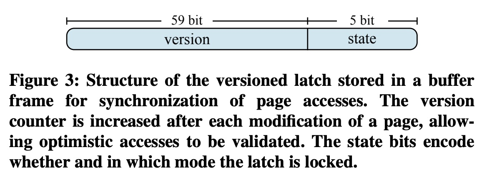
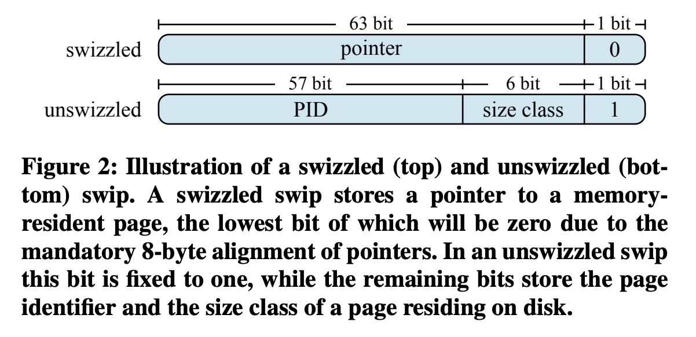
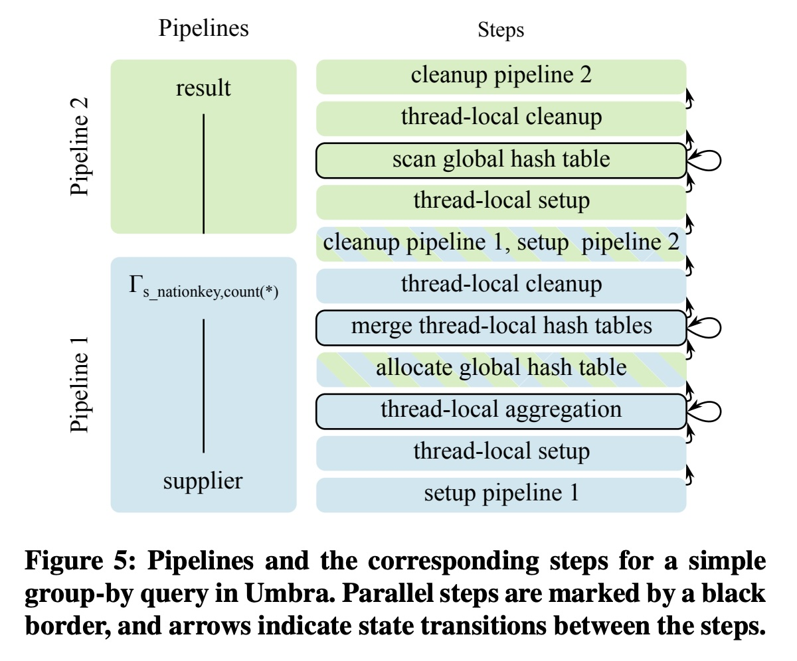
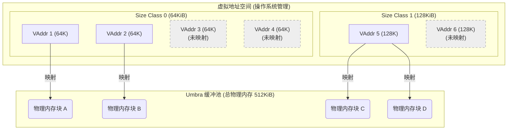
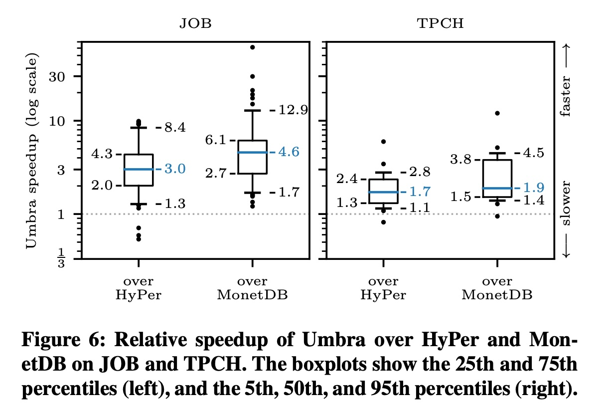
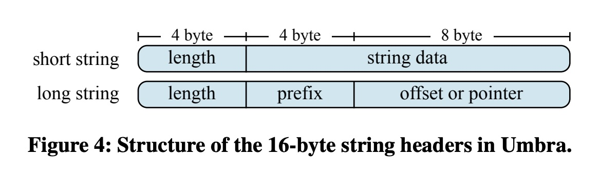

## AI论文解读 | Umbra: A Disk-Based System with In-Memory Performance
        
### 作者        
digoal        
        
### 日期        
2025-10-29        
        
### 标签        
PostgreSQL , PolarDB , DuckDB , AI , 论文解读        
        
----        
        
## 背景  
      
https://www.vldb.org/cidrdb/papers/2020/p29-neumann-cidr20.pdf        
  
提示:          
```          
读懂《Umbra: A Disk-Based System with In-Memory Performance》这篇论文需要提前掌握哪些基础知识, 请使用中文通熟易懂的讲解这些基础知识, 可以引用论文中的图、表或使用Markdown支持的图形(text,mermaid等)增加解释性. 
  
使用中文通熟易懂的解读《Umbra: A Disk-Based System with In-Memory Performance》这篇论文, 其中的关键内容请着重讲解, 可以引用论文中的图、表或使用Markdown支持的图形(text,mermaid等)增加解释性. 
  
提取《Umbra: A Disk-Based System with In-Memory Performance》这篇论文中的重要术语, 使用中文对这些术语进行通熟易懂的讲解, 可以引用论文中的图、表或使用Markdown支持的图形(text,mermaid等)增加解释性. 
```     
  
## 1 前置知识 
  
理解《Umbra: A Disk-Based System with In-Memory Performance》这篇论文，你需要对现代数据库管理系统（DBMS）的内部工作原理有比较扎实的了解。这篇论文的核心是介绍一个名为 **Umbra** 的系统 ，它试图在“磁盘系统”（成本低、容量大）和“内存系统”（速度快）之间找到一个最佳平衡点，实现“鱼与熊掌兼得” 。

以下是读懂这篇论文所需的关键基础知识，我会用尽量通俗的语言来解释：

### 1. 核心背景：内存 vs. 磁盘数据库

你需要首先理解两种主流数据库架构的区别：

* **纯内存数据库 (In-Memory DBMS):**
    * **代表:** 论文中提到的 HyPer (Umbra 的“前身”) , SAP HANA  等。
    * **工作方式:** 假设所有数据都存放在 RAM（内存）中 。
    * **优点:** 速度极快，因为内存读写比磁盘快几个数量级 。
    * **缺点:** RAM 非常昂贵 ，且容量增长缓慢 。如果数据量超过内存大小，系统性能会急剧下降甚至崩溃 。

* **传统磁盘数据库 (Disk-Based DBMS):**
    * **工作方式:** 数据主要存储在磁盘（HDD 或 SSD）上，内存中只保留一个“缓冲池”（Buffer Pool），用来缓存最常用的数据 。
    * **优点:** 成本低，可扩展性强（SSD 既便宜又快）。
    * **缺点:** 性能瓶颈在于磁盘 I/O 和缓冲池管理。

**Umbra 的定位：** Umbra 是一个“磁盘系统” ，但它专为 **SSD** 优化 ，并配备了**超大内存缓冲** 。它的目标是：当数据在内存中时，性能媲美纯内存系统；当数据在磁盘上时，也能优雅地高效处理 。

---

### 2. 关键知识点：缓冲管理器 (Buffer Manager)

这是理解本论文**最核心**的部分。缓冲管理器是磁盘数据库的“大脑”，负责决定哪些数据页（Page）应该留在内存里，哪些应该被T出内存（写回磁盘）。

* **“页” (Page):** 数据库从磁盘读取数据的最小单位。
* **传统设计的痛点:** 传统缓冲管理器使用**固定大小的页**（Fixed-Size Pages）。这会带来很大麻烦 。
    > 想象一下：你的存储单元全是 4KB 的小盒子。如果你要存一个 100KB 的大字符串或一个字典，你必须把它切成 25 块，分散存在 25 个盒子里 。当你需要读取它时，你必须再把这 25 块找出来拼在一起 。这个过程非常复杂且低效。
* **Umbra 的核心创新：可变大小的页 (Variable-Size Pages)** 。
    > Umbra 说：为什么不直接用 64KB、128KB、256KB 等不同大小的盒子呢？ 这样，那个 100KB 的字符串就可以被完整地放进一个 128KB 的盒子里 。
    * **请看论文中的图 1：**    
            * **图 1 解释：** Umbra 将页按照大小（如 64KB, 128KB, 256KB...）分成了不同的“**大小类**” (Size Class 0, 1, 2...) 。它允许不同大小的页共存于一个缓冲池中 。

---

### 3. 操作系统知识：虚拟内存 (Virtual Memory)

**“Umbra 是如何实现可变大小页的管理，而又不产生大量内存碎片的？”** 答案是：它利用了操作系统的**虚拟内存**机制 。

* **虚拟地址 vs. 物理地址:**
    * 程序使用的是“虚拟地址”（一个逻辑上的地址）。
    * 操作系统通过“页表”（Page Table）将其映射到“物理地址”（RAM 上的真实位置）。
* **Umbra 的技巧 (mmap):**
    * Umbra 使用 `mmap` 系统调用 ，为 **每一个“大小类”** 都预先“保留”（Reserve）一块**巨大**的**虚拟地址空间** 。
    * “保留”不等于“分配”。此时它**不消耗任何物理内存**（RAM）。
    * **请再次参考图 1：**
        * “inactive page (no physical memory mapping)”  和 “reserved virtual memory”  就代表那些只在虚拟空间中存在的“空壳子”。
        * 当 Umbra 真的需要从 SSD 加载一个 128KB 的页时，它会从 128KB 对应的虚拟地址空间中拿一个“空壳子”，把数据读进来，这时操作系统**才会**在页表中建立映射，为其分配**物理内存** 。
        * 当这个页被“T出”时，Umbra 使用 `madvise` (MADV_DONTNEED)  通知操作系统：“这块物理内存我不用了，你可以回收了” 。
    * **好处:** 完美避免了缓冲池中的“外部碎片”问题 。

---

### 4. 数据库并发控制 (Concurrency Control)

当很多个查询（线程）同时读写数据时，如何保证数据不错乱？这就需要并发控制。

* **Latch (闩锁):** 一种轻量级的“锁”，用于保护数据库内部的数据结构（比如一个数据页），防止多线程同时修改它 。
* **痛点:** 频繁地获取和释放锁（latch）会成为性能瓶颈 。
* **Umbra 的方案：版本化闩锁 (Versioned Latches)**  和 **乐观闩锁 (Optimistic Latching)** 。
    * **请看论文中的图 3：**    
            * **图 3 解释：** 每个页的头部都有一个 64 位整数 。其中 59 位是“**版本号**” ，5 位是“**状态**” 。
    * **工作方式（乐观模式）:**
        1.  一个“读取”线程过来，它不加锁，而是先记住当前页的**版本号**（比如 V=10）。
        2.  然后它开始读取数据 。
        3.  读完后，它再次检查版本号。
            * 如果版本号还是 V=10，说明在它读取期间，**没有人修改**过这个页。读取成功 。
            * 如果版本号变成了 V=11，说明有个“写入”线程修改了数据（写入者在释放锁时会增加版本号 ）。读取失败，线程必须**重试** 。
    * **好处:** 在读多写少的场景下，线程之间几乎没有锁的争抢 。

* **指针“混写” (Pointer Swizzling):**
    * **请看论文中的图 2：**    
            * **图 2 解释：** Umbra 用一个 64 位的整数 (称为 "swip") 来引用一个页 。
    * 它利用了内存地址**对齐**的特性（指针的最后几位总是 0）。
    * **Swizzled (已“混写”) :** 如果最后 1 位是 **0** ，表示这个页**在内存中**，这个 64 位值就是它的**内存地址**（指针）。
    * **Unswizzled (未“混写”) :** 如果最后 1 位是 **1** ，表示这个页**在磁盘上**，这个 64 位值存的是它的**页ID (PID)** 和它所属的**大小类 (size class)** 。
    * **好处:** 访问一个页时，只需检查最后一位，就能立刻知道它在内存还是在磁盘，非常高效 。

---

### 5. 查询处理与执行 (Query Processing)

* **查询编译 (Query Compilation):**
    * 这是 HyPer 和 Umbra 的“祖传技能” 。
    * 传统数据库是“解释执行”查询计划，一步一步来。
    * Umbra 会把整个查询计划**编译**成高效的**本地机器码**（Machine Code），就像你编译 C++ 程序一样，执行效率极高。
* **自适应编译 (Adaptive Compilation):**
    * 编译本身也需要时间。对于只跑一次的小查询，编译反而不划算 。
    * Umbra 的策略是：先“**解释执行**” 。如果发现这个查询很复杂、要处理很多数据，它就会在**运行时** （Just-In-Time, JIT） **触发编译**，把剩下的工作交给编译好的机器码去跑 。
* **流水线和步骤 (Pipelines and Steps):**
    * **请看论文中的图 5：**    
            * **图 5 解释：** Umbra 将一个查询计划分解成模块化的“流水线” (Pipelines) 和“步骤” (Steps) 。这就像一个“状态机” ，使得查询的调度和执行（尤其是并行执行）更加灵活 。

---

### 总结

要读懂这篇论文，你需要具备以下知识储备：

1.  **数据库基础：** 了解内存数据库 vs. 磁盘数据库的优缺点。
2.  **核心组件：** 深入理解**缓冲管理器**（Buffer Manager）的职责。
3.  **操作系统：** 掌握**虚拟内存**、`mmap` 和 `madvise` 的概念，这是理解 Umbra 如何实现可变大小页（图 1）的关键。    
4.  **并发控制：** 知道什么是 Latch，以及**乐观并发控制**（图 3）和 **指针“混写”** （图 2）的工作原理。      
5.  **查询执行：** 了解**即时编译 (JIT)** 和 **流水线执行模型**（图 5）的概念。    
 
掌握了这些，你就能明白 Umbra 是如何巧妙地利用操作系统特性（虚拟内存）来构建一个新颖的缓冲管理器（可变大小页），并结合先进的执行引擎（JIT 编译），最终实现了“在 SSD 上的内存级性能”。

希望这份讲解对你有帮助！你是否想了解更多关于“指针混写”（Pointer Swizzling）的具体工作流程？
  
## 2 解读论文 
  
这是一篇非常出色的数据库系统论文。它介绍了一个名为 **Umbra** 的系统，其核心目标是解决一个经典难题：如何让数据库**既像内存数据库一样快，又像磁盘数据库一样便宜且容量大** 。

Umbra 的答案是：通过一系列聪明的软硬件协同设计，打造一个**以 SSD 为基础，但性能直逼纯内存**的系统 。

下面，我将为你通俗易懂地解读这篇论文的几个关键创新点。

### 核心问题：鱼与熊掌不可兼得？

在 Umbra 出现之前，数据库世界主要有两个流派：

1.  **纯内存数据库 (In-Memory)：** 如 Umbra 的前身 HyPer 。它们假设所有数据都在 RAM（内存）中。
      * **优点：** 极快，因为内存读写速度无与伦比 。
      * **缺点：** 极贵！论文提到，2TB 的服务器内存（DRAM）大约要 20,000 美元 。而且内存容量增长缓慢 。如果数据放不下，性能会骤降 。
2.  **传统磁盘数据库 (Disk-Based)：** 它们的数据主要在磁盘（HDD 或 SSD）上，内存只用作“缓冲池” (Buffer Pool) 。
      * **优点：** 便宜，容量大。论文提到，一个 2TB 的 SSD 只要 500 美元，是内存价格的 1/40 。
      * **缺点：** 慢。即使是 SSD，也比内存慢得多，而且传统的缓冲管理机制会带来不小的性能开销。

**Umbra 的定位：** Umbra 认为，纯内存系统“不经济” (uneconomical) 。它选择做**一个磁盘系统**，但专门为现代 SSD 的高带宽（数 GB/s）和大型内存缓冲池重新设计 。它的目标是：**当数据在内存中时，性能与纯内存系统相当；当数据在磁盘上时，也能优雅地扩展** 。

-----

### 关键技术一：革命性的缓冲管理器 (Buffer Manager)

这是 Umbra **最核心的创新** 。缓冲管理器的职责是决定哪些数据页 (Page) 留在内存，哪些被踢回 SSD。

#### 1\. 痛点：传统“固定大小的页”

传统数据库（包括之前的 LeanStore ）都使用**固定大小的页**（比如 8KB 或 64KB） 。这会带来一个大麻烦：

> **通俗举例：** 假设你的存储单元全是 4KB 的小盒子。如果你要存一个 100KB 的大字符串或一个压缩字典 ，你必须把它切成 25 块，分散存在 25 个盒子里。当你需要读取它时，你必须再把这 25 块找出来拼在一起 。这个过程非常复杂且低效。

#### 2\. Umbra 的解法：“可变大小的页” (Variable-Size Pages)

Umbra 说：为什么不直接用 64KB、128KB、256KB... 等不同大小的盒子呢？ 这样，那个 100KB 的对象就可以被完整地放进一个 128KB 的盒子里，处理起来就像在内存中一样简单高效 。

**请看论文中的图 1：**    

 

  * **图 1 解释：** Umbra 将页按照大小（如 64KiB, 128KiB...）分成了不同的“**大小类**” (Size Class 0, 1, 2...) 。
  * 它允许**所有大小的页共享同一个缓冲池** 。

#### 3\. 实现的魔法：利用“虚拟内存”

你可能会问：在一个大内存池里管理不同大小的“盒子”，不会产生很多“内存碎片”（Fragmentation）吗？

Umbra 的回答是：**不会，因为它利用了操作系统的“虚拟内存” (Virtual Memory) 机制** 。

> **核心技巧：**  
> 1\.  **预留 (Reserve)：** Umbra **为每一个“大小类”都通过 `mmap` 系统调用“预留”一块巨大**的**虚拟地址空间** 。比如，为 64KB 的页预留 512GB 虚拟地址，为 128KB 的页也预留 512GB...  
> 2\.  **不占物理内存：** “预留”不等于“分配”。此时它**不消耗任何物理内存 (RAM)** 。它们只是操作系统页表里的“空头支票”。  
> 3\.  **加载 (Load)：** 当需要从 SSD 加载一个 128KB 的页时，Umbra 才告诉操作系统：“请把数据读到 128KB 预留空间中的这个地址” 。这时，操作系统**才会**在页表中建立映射，为其分配**物理内存** 。  
> 4\.  **释放 (Evict)：** 当这个页被“T出”时，Umbra 使用 `madvise` (MADV\_DONTNEED) 通知操作系统：“这块物理内存我不用了，你可以回收了” 。  

**这个过程可以用下图来理解：**



  * **好处：** Umbra 只管理虚拟地址，操作系统负责管理物理内存。完美避免了物理内存的外部碎片问题 。

-----

### 关键技术二：为性能而生的低开销组件

为了实现“媲美内存”，Umbra 必须消除传统数据库的各种瓶颈。

#### 1\. 指针“混写” (Pointer Swizzling)

  * **痛点：** 传统数据库需要一个全局的“哈希表”来查找“页ID” (PID) 对应的“内存地址”。在多核CPU上，这个哈希表会成为巨大的瓶颈 。
  * **Umbra 的解法：** 使用一个 64 位的智能指针，称为 **"swip"** 。

**请看论文中的图 2：**    
 

  * **图 2 解释：** 它利用了内存地址**对齐**的特性（指针的最后几位总是 0）。
  * **Swizzled (已“混写”) ：** 如果最后 1 位是 **0**，表示这个页**在内存中**。这个 64 位值就是它的**内存地址**（指针） 。
  * **Unswizzled (未“混写”) ：** 如果最后 1 位是 **1**，表示这个页**在磁盘上**。剩下的 63 位存的是它的**页ID (PID)** 和它所属的**大小类 (size class)** 。
  * **好处：** 访问一个页时，只需检查最后一位 (`if(swip & 1)`)，就能立刻知道它在内存还是在磁盘，不需要任何查表，开销极低 。

#### 2\. 版本化闩锁 (Versioned Latches)

  * **痛点：** 数据库需要用“锁”(Latches)来保护数据页，防止多线程同时修改导致数据错乱 。但在高并发下，频繁的加锁、解锁会产生激烈竞争 。
  * **Umbra 的解法：** 乐观地假设“冲突很少”，使用**版本化闩锁**。

**请看论文中的图 3：**    
 

  * **图 3 解释：** 每个页的头部都有一个 64 位整数，其中 59 位是“**版本号**”，5 位是“**状态**” 。
  * **乐观读取 (Optimistic Mode) 工作方式：**
    1.  一个“读取”线程过来，它**不加锁**，而是先记住当前页的**版本号**（比如 V=10） 。
    2.  然后它开始读取数据（此时没有竞争） 。
    3.  读完后，它再次检查版本号 。
    4.  如果版本号还是 V=10，说明在它读取期间，**没有人修改**过这个页。读取成功。
    5.  如果版本号变成了 V=11（说明有“写入”线程修改了数据，并在释放锁时增加了版本号 ），则读取失败，线程必须**重试** 。
  * **好处：** 在读多写少的场景下，线程之间几乎没有锁的争抢，实现了极高的并发性 。

-----

### 关键技术三：自适应编译与执行

Umbra 和 HyPer 一样，都是“查询编译”型数据库，它们会把 SQL 查询翻译成高效的机器码来执行 。但 Umbra 走得更远。

  * **痛点：** HyPer 总是会编译查询 。但编译本身也需要时间。对于只跑一次的小查询（OLTP），花在编译上的时间可能比执行时间还长（论文提到最差情况多花 29 倍时间） 。
  * **Umbra 的解法：自适应编译 (Adaptive Compilation)** 。
    1.  **先解释执行：** 查询来了，Umbra 先在一个高效的“虚拟机”中**解释执行** IR (中间表示) 。
    2.  **动态决策：** Umbra 会跟踪执行进度。如果发现这个查询步骤要处理的数据量很大（比如一个复杂的 OLAP 查询） 。
    3.  **JIT 编译：** 它会**在运行时**（Just-In-Time）触发编译，将这个步骤的 IR 翻译成 LLVM 机器码 。
  * **好处：** 简单查询（OLTP）响应极快（无需编译）；复杂查询（OLAP）也能获得编译执行的高性能 。

**请看论文中的图 5：**    
 

  * **图 5 解释：** Umbra 将一个查询计划分解成模块化的“流水线” (Pipelines) 和“步骤” (Steps) 。这种模块化设计使得“自适应编译”和灵活的并行调度（Morsel-driven）成为可能 。

-----

### 性能表现 (图 6)

口说无凭，Umbra 的性能到底如何？    

 

  * **图 6 解释：** 这个箱型图（boxplot）显示了 Umbra 相对于 HyPer 和 MonetDB 的**加速比**。线在 1.0 以上代表 Umbra 更快。
  * **关键结论 1：** Umbra 甚至比它的**纯内存前身 HyPer 更快**！在 JOB 基准测试上，几何平均快 **3.0** 倍；在 TPCH 上快 **1.8** 倍 。
  * **为什么？** 主要归功于“自适应编译”策略，它为 HyPer 耗时巨多的短查询节省了大量编译时间 。
  * **关键结论 2：** 缓冲管理器开销极低。论文中的微基准测试显示，禁用缓冲管理器（纯内存模式）和启用它（Umbra 模式）相比，性能平均差异**小于 6%** 。这证明了 Umbra 的缓冲设计几乎是“零开销”的。
  * **关键结论 3：** I/O 性能强大。在 I/O 密集型测试中，Umbra 能跑满 SSD 的带宽（达到 1.13 GiB/s），证明了其缓冲管理器可以优雅地处理数据在磁盘上的情况 。

### 总结

Umbra 是一篇里程碑式的论文。它证明了，通过**深刻理解现代硬件**（多核 CPU、大内存、快 SSD）和**操作系统**（虚拟内存），并进行**全栈协同设计**（可变大小页、指针混写、版本化闩锁、自适应编译），一个**磁盘数据库完全可以实现纯内存数据库的性能** 。它成功地实现了性能、成本和容量的“三赢”。

希望这个解读对你有帮助！你是否想了解更多关于 Umbra 是如何处理“字符串”（图 4）的细节？    
  
## 3 术语 
  
好的，这篇论文《Umbra: A Disk-Based System with In-Memory Performance》介绍了一个非常创新的数据库系统。以下是这篇论文中几个最关键术语的通俗讲解，希望能帮你理解它的核心思想。

### 1\. 缓冲管理器 (Buffer Manager)

  * **讲解：** 缓冲管理器是磁盘数据库的“大管家”。数据库的数据主要存储在较慢的 SSD（磁盘）上 ，而内存（RAM）又快又贵 。缓冲管理器的职责就是决定：**哪些数据页 (Page) 应该被加载到内存中以便快速访问，以及当内存满了，哪些“不常用”的数据页应该被“踢”回 SSD** 。
  * **Umbra 的创新：** Umbra 实现了一个**新颖的、低开销的**缓冲管理器 ，这是它能实现“内存级性能”的关键。

-----

### 2\. 固定大小页 (Fixed-Size Pages) vs. 可变大小页 (Variable-Size Pages)

这是理解 Umbra **最核心创新**的地方。

  * **固定大小页 (Fixed-Size Pages)：**
      * **讲解：** 这是传统数据库的做法 。想象一下，你的仓库里只有**一种尺寸的箱子**（比如 64KiB）。
      * **痛点：** 当你要存储一个很大的对象时（比如一张高清图片或一个长字符串），你必须把它“切”成很多小块，分别装在好几个箱子里 。当你需要读取它时，你又得把这几个箱子都找出来，再把数据拼装回去 。这个过程非常复杂且低效。
  * **可变大小页 (Variable-Size Pages)：**
      * **讲解：** 这是 Umbra 的“杀手锏” 。Umbra 的仓库里有**多种尺寸的箱子**（比如 64KiB, 128KiB, 256KiB...）。
      * **优势：** 当你要存储那个大对象时，你**直接找一个足够大的箱子（比如 256KiB）把它完整地放进去**。这样，存取都非常简单高效，几乎和在纯内存中操作一样快 。

-----

### 3\. 大小类 (Size Classes) 与 虚拟内存 (Virtual Memory)

Umbra 使用了两种技术来巧妙地实现“可变大小页”：

  * **大小类 (Size Classes)：**

      * **讲解：** Umbra 将不同大小的页（箱子）进行分类，称为“大小类” 。
      * **参考图 1：** 论文的图 1 展示了这一点。Size Class 0 对应 64KiB 的页，Size Class 1 对应 128KiB，Size Class 2 对应 256KiB，以此类推，每一类的大小都是前一类的两倍 。   

  * **虚拟内存 (Virtual Memory)：**

      * **讲解：** 你可能会问，在一个内存池里管理这么多不同大小的“箱子”，不会产生很多无法使用的“内存碎片”吗？Umbra 的答案是：**利用操作系统的“虚拟内存”机制** 。
      * **工作原理：**
        1.  **预留 (mmap)：** Umbra 在启动时，会为**每一个“大小类”都“预留”一块巨大**的**虚拟地址空间**（比如都预留 512GB）。这只是个“空头支票”，**不消耗任何实际的物理内存 (RAM)** 。
        2.  **映射 (Mapping)：** 当 Umbra 真的需要加载一个 128KiB 的页时，它才告诉操作系统：“请把 SSD 上的数据读到 128KiB 虚拟空间里的这个地址”。这时，操作系统**才会**在页表中建立映射，并分配一块**物理内存**（如图 1 中的 "active page" ）。
        3.  **释放 (madvise)：** 当这个页被“踢”出内存时，Umbra 会使用 `madvise(MADV_DONTNEED)` 通知操作系统：“这块物理内存我不用了，你可以回收了” 。
      * **好处：** Umbra 完美地避免了物理内存的碎片问题，因为物理内存的分配和释放完全由操作系统管理 。

-----

### 4\. 指针“混写” (Pointer Swizzling) 与 Swip

这是 Umbra 用来消除性能瓶颈的另一个妙招。

  * **痛点：** 传统数据库需要一个全局“哈希表”来查找“页ID (PID)”对应的“内存地址”。在多核 CPU 上，所有线程都去查这个表，会导致严重的性能瓶颈 。
  * **指针“混写” (Pointer Swizzling)：**
      * **讲解：** Umbra 使用一种低开销的“去中心化”地址翻译技术 。它使用一个 64 位的特殊整数，称为 **"Swip"** 。
  * **Swip (Swizzled/Unswizzled Pointer)：**
      * **讲解：** 这是一个 64 位的“智能指针”，它本身就能告诉你数据在内存还是在磁盘。

      * **参考图 2：** 论文的图 2 展示了 Swip 的结构。它利用了内存地址对齐（指针的最低位总是 0）的特性 。    

          * **Swizzled (已混写)：** 如果最低位是 **0** 。这 64 位值就是一个**直接的内存地址（指针）** 。
          * **Unswizzled (未混写)：** 如果最低位是 **1** 。这 64 位值存的就是**页ID (PID)** 和 **大小类 (Size Class)** 。

      * **工作流程：**

        ```mermaid
        graph TD
            A(访问一个 Swip) --> B{检查最低位是否为 1 ?};
            B -- 是 (Unswizzled) --> C[数据在磁盘上<br>Swip 包含 PID 和 Size Class<br> ];
            C --> D(调用缓冲管理器, 从 SSD 加载数据);
            B -- 否 (Swizzled) --> E[数据在内存中<br>Swip 是一个直接的内存指针<br> ];
            E --> F(直接访问内存数据);
        ```

      * **好处：** 访问数据时，只需要一个 `if` 判断，就能知道数据在哪里，几乎没有开销 。

-----

### 5\. 版本化闩锁 (Versioned Latches) 与 乐观闩锁 (Optimistic Latching)

这是 Umbra 用于高并发控制的机制。

  * **痛点：** 多线程同时读写一个数据页时，需要“加锁”(Latch) 来防止数据错乱。但频繁加锁、解锁会导致严重的线程“排队”现象，即**锁竞争** 。
  * **版本化闩锁 (Versioned Latches)：**
      * **讲解：** Umbra 为每个内存中的数据页配备了一个“版本化闩锁” 。
      * **参考图 3：** 这是一个 64 位的整数，主要分为两部分：一个 59 位的**版本号 (Version Counter)** 和一个 5 位的**状态 (State)** 。    
  * **乐观闩锁 (Optimistic Latching)：**
      * **讲解：** 这是 Umbra 的“乐观”策略，**尤其针对读取操作** 。
      * **工作原理（读取线程）：**
        1.  **不加锁：** 线程A 准备读取页面。它不加锁，而是先**记住**当前页的**版本号**（比如 V=10）。
        2.  **读数据：** 线程A 开始自由地读取页面内容 。
        3.  **验证：** 读完后，线程A **再次检查**页面的版本号 。
              * **情况一：** 版本号**还是 V=10**。这说明在读取期间，没有其他线程修改过这个页面。**读取成功！**
              * **情况二：** 版本号**变成了 V=11**。这说明在读取时，有另一个线程（线程B）获取了独占锁，修改了数据，并在释放锁时将版本号+1 。**读取失败！** 线程A 必须**重试**整个读取操作 。
      * **好处：** 在“读多写少”的场景下，绝大多数读取操作都不需要加锁，也**不会**相互等待，从而极大地提高了并发性能 。

-----

### 6\. 自适应编译 (Adaptive Compilation)

这是 Umbra 在查询执行引擎上的创新。

  * **背景：** Umbra 和它的前身 HyPer 都是“编译型”数据库，它们会把 SQL 查询翻译成高效的机器码（就像编译 C++ 程序一样）来执行 。
  * **痛点：** “编译”本身需要时间。对于很简单的查询（比如 OLTP），花在编译上的时间可能比执行时间还长 。
  * **自适应编译 (Adaptive Compilation)：**
      * **讲解：** Umbra 采用了一种更聪明的“混合”策略 。
      * **工作原理：**
        1.  **先解释执行：** 查询来了，Umbra 先不编译，而是通过一个高效的**字节码解释器 (bytecode format)** 来执行 。这几乎没有启动延迟。
        2.  **动态跟踪：** Umbra 会在执行时“观察”这个查询 。
        3.  **JIT 编译：** 如果它发现这个查询步骤“很费时”（比如要处理上亿条数据），它才会**在运行时**（Just-In-Time）触发**即时编译**，将这部分代码翻译成超高速的 LLVM 机器码来执行 。
      * **好处：** 简单查询（OLTP）响应极快（无需编译）；复杂查询（OLAP）也能获得编译执行的极致性能 。

希望这份讲解能帮助你理解 Umbra 系统的精髓！
  
## 参考        
         
https://www.vldb.org/cidrdb/papers/2020/p29-neumann-cidr20.pdf    
        
<b> 以上内容基于DeepSeek、Qwen、Gemini及诸多AI生成, 轻微人工调整, 感谢杭州深度求索人工智能、阿里云、Google等公司. </b>        
        
<b> AI 生成的内容请自行辨别正确性, 当然也多了些许踩坑的乐趣, 毕竟冒险是每个男人的天性.  </b>        
    
#### [期望 PostgreSQL|开源PolarDB 增加什么功能?](https://github.com/digoal/blog/issues/76 "269ac3d1c492e938c0191101c7238216")
  
  
#### [PolarDB 开源数据库](https://openpolardb.com/home "57258f76c37864c6e6d23383d05714ea")
  
  
#### [PolarDB 学习图谱](https://www.aliyun.com/database/openpolardb/activity "8642f60e04ed0c814bf9cb9677976bd4")
  
  
#### [PostgreSQL 解决方案集合](../201706/20170601_02.md "40cff096e9ed7122c512b35d8561d9c8")
  
  
#### [德哥 / digoal's Github - 公益是一辈子的事.](https://github.com/digoal/blog/blob/master/README.md "22709685feb7cab07d30f30387f0a9ae")
  
  
#### [About 德哥](https://github.com/digoal/blog/blob/master/me/readme.md "a37735981e7704886ffd590565582dd0")
  
  

  
