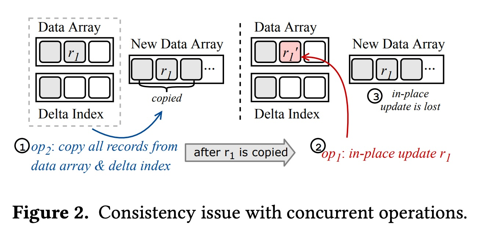
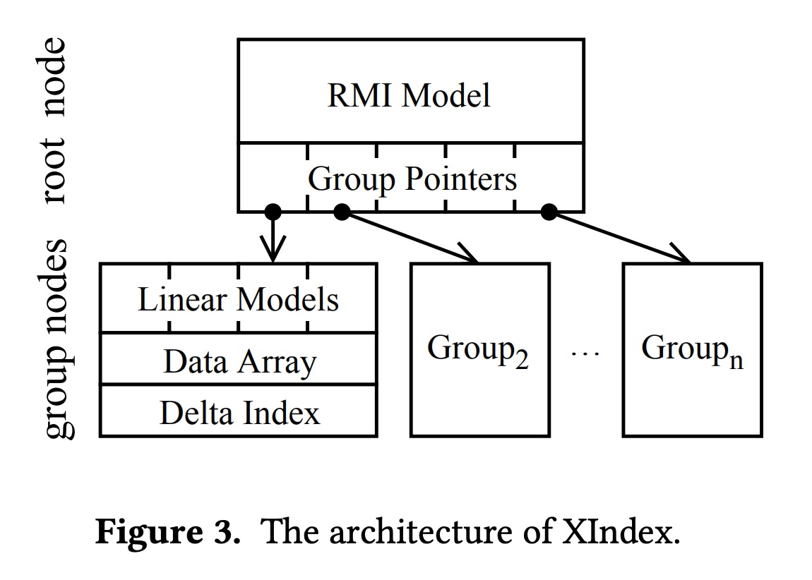
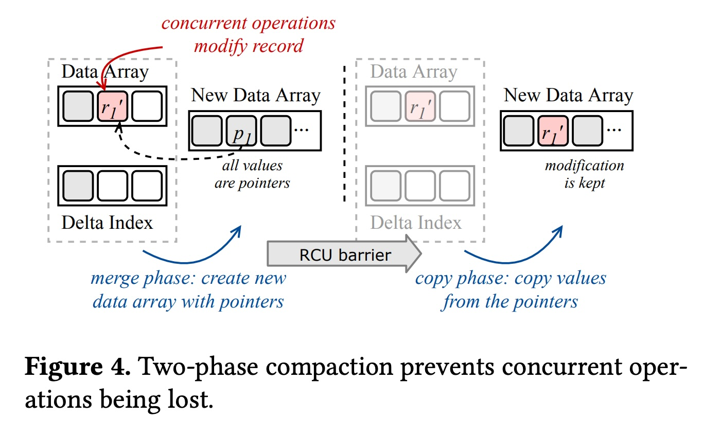
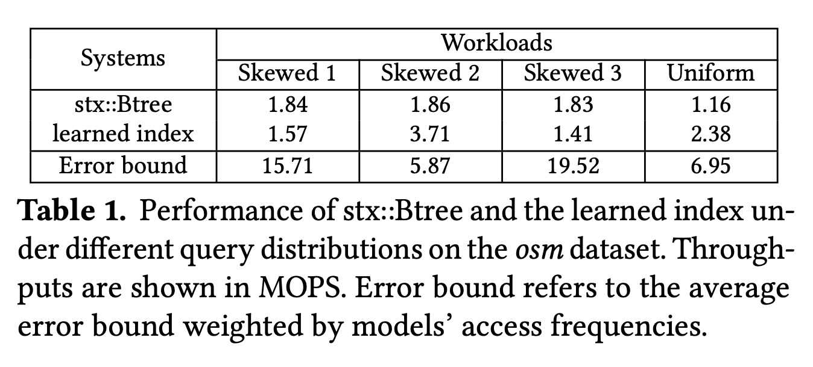
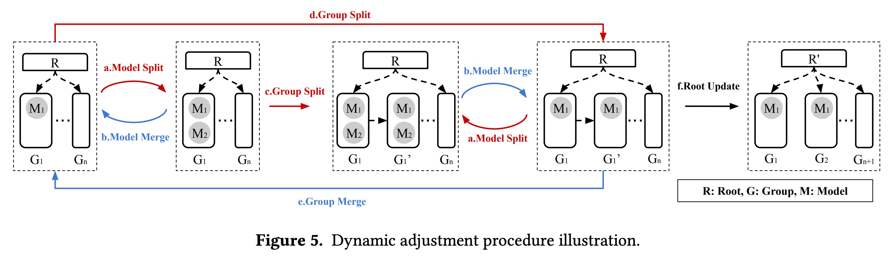
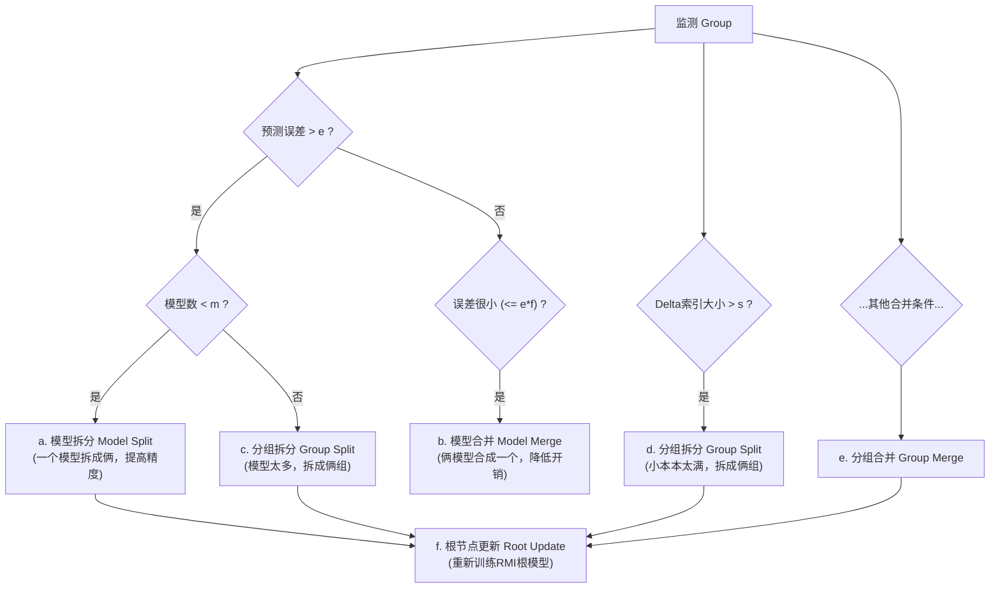
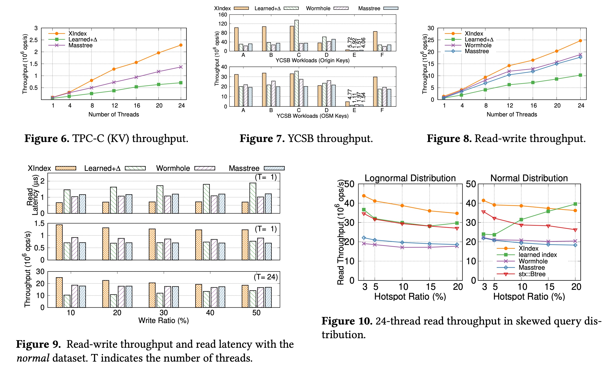
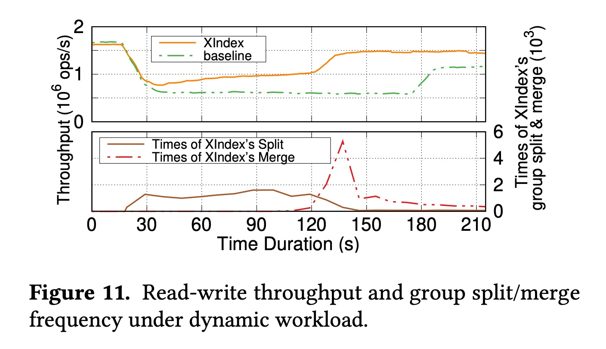
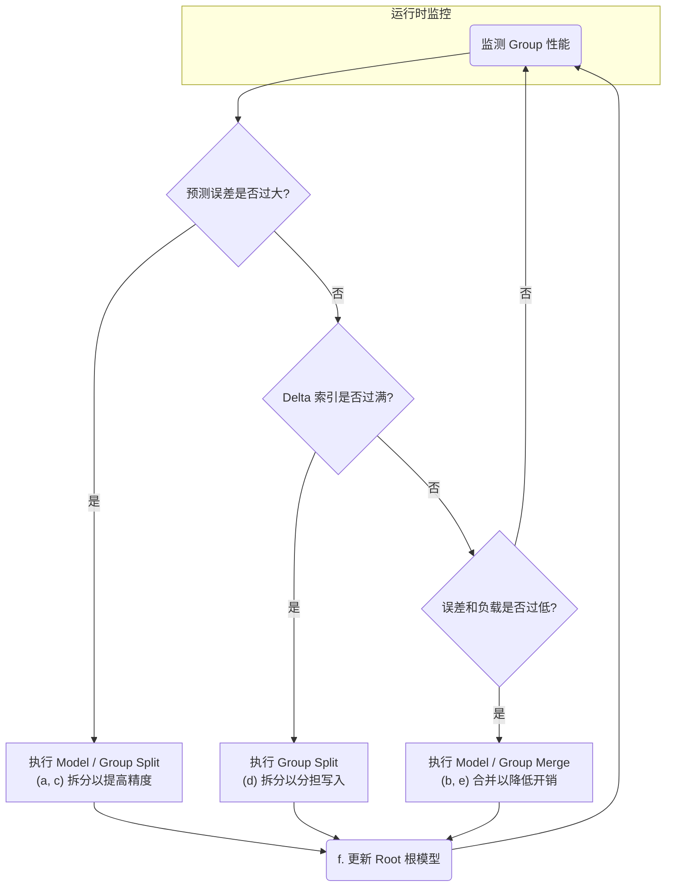

## AI论文解读 | XIndex: A Scalable Learned Index for Multicore Data Storage
        
### 作者        
digoal        
        
### 日期        
2025-10-29        
        
### 标签        
PostgreSQL , PolarDB , DuckDB , AI , 论文解读        
        
----        
        
## 背景  
      
https://dl.acm.org/doi/pdf/10.1145/3332466.3374547        
  
提示:          
```          
读懂《XIndex: A Scalable Learned Index for Multicore Data Storage》这篇论文需要提前掌握哪些基础知识, 请使用中文通熟易懂的讲解这些基础知识, 可以引用论文中的图、表或使用Markdown支持的图形(text,mermaid等)增加解释性. 
  
使用中文通熟易懂的解读《XIndex: A Scalable Learned Index for Multicore Data Storage》这篇论文, 其中的关键内容请着重讲解, 可以引用论文中的图、表或使用Markdown支持的图形(text,mermaid等)增加解释性. 
  
提取《XIndex: A Scalable Learned Index for Multicore Data Storage》这篇论文中的重要术语, 使用中文对这些术语进行通熟易懂的讲解, 可以引用论文中的图、表或使用Markdown支持的图形(text,mermaid等)增加解释性. 
```     
  
## 1 前置知识 
  
理解这篇论文《XIndex: A Scalable Learned Index for Multicore Data Storage》确实需要一些跨学科的知识。简单来说，**XIndex 是一种在多核 CPU 上运行得非常快的新型数据库索引**。

它最大的特点是“学习型”（Learned），即用 AI 模型来“猜”数据在哪，而不是像传统索引那样一步步“查”。同时，它还解决了一个大难题：如何让这种“学习型索引”在很多人（多核）同时读写数据（并发）时不出错，并且速度依然很快。

为了帮助你透彻理解这篇论文，你需要提前掌握以下几个领域的基础知识：

---

### 1. 核心知识：数据结构（索引）

你首先需要知道**什么是索引**，以及最经典的索引结构 **B-Tree (B树)**。

* **索引 (Index):** 就像一本书的目录。没有目录，你找一个知识点（数据）就得从第一页翻到最后一页。有了目录，你可以快速定位到章节，然后再找具体的页码。索引就是数据库中用来加速查询的数据结构。
* **B-Tree (B树):** 这是几十年来数据库索引的“标准答案”。它是一种“多路平衡搜索树”。
    * **通俗理解：** 想象一个多层的树状文件柜。
    * 顶层（根节点）有几个抽屉，标签是 [A-G], [H-N], [O-Z]。
    * 你要找 "Smith"，你打开 [O-Z] 抽屉。
    * 里面又分了 [O-Q], [R-T], [U-Z]。
    * 你打开 [R-T]，最后在里面找到了 "Smith" 的档案。
    * B树的特点是这棵“树”总是保持**平衡**的，所以无论你查什么数据，要“往下跳”的层数（查询时间）都基本一样，非常稳定。论文中也提到了 B 树的多层结构  并将其作为性能对比的基准 。

### 2. 核心知识：学习型索引 (Learned Index)

这是 XIndex 的理论基础，源自一篇开创性论文 。XIndex 正是基于这个理念构建的 。

* **核心思想：** 传统 B 树是一个“模型”，它通过树形结构来帮你定位数据。而“学习型索引”认为，索引也可以被看作一个**预测模型**，它能“学习”你数据的分布规律 。
* **它是如何工作的？**
    1.  **学习分布：** 模型会学习你数据的“累积分布函数”（CDF）。
    2.  **预测位置：** 当你查询一个键（Key）时，模型不“查找”，而是“预测”这个 Key 在排好序的数组中**大概在什么位置** 。
    3.  **处理误差：** 预测总有误差。所以模型会告诉你一个“误差范围”（Error Bound）。比如模型预测 "Smith" 在第 1000 位，误差是 $\pm$5 。
    4.  **最后搜索：** 你只需要在 `[995, 1005]` 这个小范围内用传统方法（如二分查找）精确定位就行了 。

* **RMI (Recursive Model Indexes):** 为了提高预测精度，学习型索引通常使用“递归模型索引”（RMI）。这就像 B 树的多层结构 ：
    * 第一层模型（根）不直接预测位置，而是预测该用**哪个**第二层模型 。
    * 第二层模型（叶）再来预测数据在数组中的具体位置 。
    * XIndex 的根节点就用了一个 RMI 模型 。

### 3. 核心知识：并发编程 (Concurrent Programming)

这是理解 XIndex **为什么“可扩展”(Scalable)** 的关键。原版的学习型索引不支持修改（写入、删除），更别提“并发写入”了。XIndex 的核心贡献之一就是解决了这个问题 。

你需要了解在多核 CPU (Multicore) 上同时读写数据会遇到什么问题，以及经典的解决方案：

* **并发冲突 (Data Race):** 想象一下，一个线程（线程A）正在复制一份数据，准备做修改；与此同时，另一个线程（线程B）直接在**原始数据**上进行了修改。
    * 论文中的 **图 2 ** 完美展示了这个问题：    
    * $op_2$ （比如合并操作）先把 $r_1$ 复制到新数组 。
    * $op_1$ （比如更新操作）紧接着修改了**旧数组**里的 $r_1$ 。
    * $op_2$ 完成了它的工作，但它复制的是**旧**的 $r_1$ 。
    * 结果： $op_1$ 的更新**丢失了** 。

* **你需要了解的并发技术：** XIndex 综合运用了多种经典技术 。
    * **锁 (Locking):** 最简单的办法。谁要修改数据，谁就先“上锁”，别人不准动 。XIndex 使用了“细粒度锁”(Fine-grained locking)，只锁住要修改的那一小块数据（比如单个记录 ），而不是锁住整个索引，从而提高效率 。
    * **乐观并发控制 (OCC):** “先干活，再检查”。线程们“乐观”地假设自己不会和别人冲突。在最后提交修改时，才检查数据版本号（`version` ）。如果发现数据已经被别人改了，就放弃本次修改，从头再试一次 。
    * **RCU (Read-Copy-Update, 读-复制-更新):** 这是个很酷的技术 。它能让“读”操作 **完全不需要等待** “写”操作。
        * **通俗理解：** 当你要修改数据时，你**不**在原地修改。
        1.  你先**复制**一份数据。
        2.  在**副本**上进行修改。
        3.  修改完成后，你（原子地）把指向数据的**指针**从旧数据“切换”到新副本上。
        * 在这期间，老的“读”线程可以继续访问旧数据；新的“读”线程会自动访问新数据。等所有访问旧数据的线程都完成后，系统再安全地删除旧数据。XIndex 的合并操作就严重依赖 RCU 屏障（RCU barrier）。

### 4. 数据库/存储系统概念

最后，你需要了解一些高性能存储系统（尤其是键值存储，Key-Value Store）是如何处理“写入”的。

* **Delta Index (增量索引):**
    * 直接修改一个排好序的大数组是非常慢的（因为要移动大量数据）。
    * XIndex 的做法是： **更新操作（Update）** 直接在原地改（in-place）。 **插入操作（Insert）** 则先写入一个叫 `Delta Index`（增量索引）的“小本本”上 。
    * 这可以在论文 **图 3** 的架构中看到，每个 `group node`（分组节点）都包含 `Data Array`（主数据）和 `Delta Index`（增量数据）。    
    * 查询时，必须先查 `Data Array`，如果没查到，再查 `Delta Index` 。

* **Compaction (合并):**
    * “小本本”(`Delta Index`) 不能无限增大，否则查询会变慢。
    * `Compaction`（合并） 就是一个后台过程，它会定期把 `Delta Index` 里的新数据和 `Data Array` 里的老数据**合并**，生成一个**新**的、排好序的 `Data Array` 。

* **Two-Phase Compaction (两阶段合并):**
    * 这是 XIndex 的**核心创新** ，它用来解决**图 2 ** 中的“更新丢失”问题。    
    * **图 4 ** 展示了这个过程：    
    1.  **阶段 1 (Merge Phase):** 创建新数组，但不直接复制数据，而是存入指向旧数据的**指针** 。
    2.  **RCU 屏障:** 等待所有线程都“看到”这个新的指针数组 。
    3.  **阶段 2 (Copy Phase):** 遍历新数组，通过指针把数据**真正复制**过来 。
    * **妙处何在？** 如果在阶段 1 和阶段 2 之间，有个并发线程（如图 4 中的 `concurrent operations`）修改了 $r_1$ ，没关系。到阶段 2 复制时，它会通过指针读到**最新**的 $r_1$ 值，并将其复制到新数组中 。这样，更新就不会丢失了 。

### 总结

你需要的基础知识和它们在论文中的应用可以用下表概括：

| 基础知识领域 | 关键概念 | 在论文中的应用（为什么你需要懂） |
| :--- | :--- | :--- |
| **数据结构** | B-Tree (B树) | 索引的基础。XIndex 是 B 树的一种演进，也是论文的核心性能对比对象 。 |
| **机器学习** | 线性模型、CDF (累积分布函数) | “学习型索引”的核心。XIndex 用这些模型来**预测**数据位置 。 |
| **并发编程** | 锁、RCU、OCC、数据竞争 | XIndex 的核心卖点。它为“学习型索引”提供了高并发、可扩展的读写能力 。 |
| **数据库系统** | 增量索引 (Delta Index)、合并 (Compaction) | XIndex 处理“写入”的机制。它通过“两阶段合并”解决了并发写入时的“更新丢失”问题 。 |

掌握了这些，你就能明白 XIndex 是如何巧妙地将 AI 预测、并发控制和传统数据库技术结合起来，创造出一个高性能索引的。

希望这份指南对你有帮助！你是否想让我深入解释一下 "RCU (读-复制-更新)" 或 "两阶段合并" 的工作细节？
  
## 2 解读论文 
  
好的，这是一篇非常经典的系统论文。我会为你通俗易懂地解读《XIndex》，并重点讲解它的核心创新。

### 一句话总结 XIndex：

XIndex 是一种 **“既聪明又灵活”** 的新型数据库索引。

  * **“聪明”** 是因为它像 AlphaGo 一样，使用**机器学习模型**来“学习”数据的分布规律，从而能像“猜”一样快速定位数据 。
  * **“灵活”** 是因为它解决了“学习型索引”的两个致命弱点：它**支持高并发的读写** ，并且能**在运行时动态调整结构**以适应数据变化 。

-----

### 1\. XIndex 要解决什么“痛点”？

要理解 XIndex，我们必须先知道它“革命”的对象：

  * **传统索引 (如 B-Tree)：** 像一本书的“多级目录”。它非常稳定、可靠，支持增删改查。但无论数据长什么样，它都一层一层地往下查，有点“死板”。
  * **学习型索引 (Learned Index)：** 这是 XIndex 的“理论基础”。它提出一个革命性想法：索引本质上不就是个函数吗？`f(key) = position`（输入一个键，返回它在磁盘上的位置）。
      * 这个函数 `f` 难道不能用一个 AI 模型（比如神经网络）来“拟合”吗？
      * 如果数据很有规律（比如 1, 2, 3...），模型一下就学会了，查询效率远超 B-Tree 。

**但是，这个“聪明”的“学习型索引”有两大“致命痛点”：**

1.  **“只会读，不会写”（只读性）：**

      * 模型一旦训练好，是基于“排好序的静态数组”的 。
      * 如果你想插入一条新数据（比如在 1 和 2 之间插入 1.5），整个数组就乱了，模型就“失效”了，必须**重排数据并重新训练模型** 。这在真实数据库里是不可接受的。

2.  **“并发噩梦”（并发性差）：**

      * 就算我们想办法让它支持写入（比如先写到旁边的小本本上），在多核 CPU 上，当多个线程同时读写时，会产生数据冲突。
      * **论文中的图 2**  完美展示了这个问题：一个“更新操作” ( $op_1$ ) 可能会**丢失**！    
          * 一个后台线程 ( $op_2$ ) 正在合并数据，它刚把旧数据 $r_1$ 复制到新位置 。
          * 几乎同时，一个用户线程 ( $op_1$ ) 更新了**旧位置**的 $r_1$ 。
          * 后台线程 $op_2$ 不知道这件事，它继续工作。
          * **结果：** 用户 $op_1$ 的更新永久丢失了。

3.  **“看天吃饭”（对数据分布敏感）：**

      * 模型的预测精度依赖数据分布。如果数据分布很均匀，它表现很好。
      * **如表 1 所示** ，在一些“热点数据”高度集中的场景下（Skewed 1 和 Skewed 3），它的预测误差极大，导致性能反而**不如**传统的 B-Tree 。    

**XIndex 的目标：** 创造一个索引，既享受“学习型索引”的查询速度，又彻底解决上述的“写入”、“并发”和“敏感”三大难题。

-----

### 2\. XIndex 的三大核心创新（法宝）

XIndex 的架构如 **图 3** 所示 ，它是一个两层结构：`root node`（根节点，本身是个学习模型）用来索引 `group nodes`（分组节点）。每个分组节点管理自己的数据 。    

为了解决上述痛点，XIndex 拿出了三个法宝：

#### 法宝一：增量索引 (Delta Index) - 解决“写入”问题

这借鉴了传统数据库的做法。

  * **更新 (Update)：** XIndex 对已存在的数据，直接在原地修改 (in-place) 。
  * **插入 (Insert)：** 新插入的数据，不直接动主数据 (`Data Array`)，而是先写入一个叫 `Delta Index` 的“小本本”（增量索引）里 。
  * **合并 (Compaction)：** 当“小本本”写满了，后台线程会启动“合并”程序，把 `Delta Index` 和 `Data Array` 合并成一个新的、排好序的 `Data Array`，并重新训练这个 group 的学习模型 。

这就解决了“只能读不能写”的问题。但是，在“合并”时，法宝二必须登场了。

#### 法宝二：两阶段合并 (Two-Phase Compaction) - 解决“并发写入”问题

这是 XIndex **最核心的创新**，它漂亮地解决了 **图 2** 中的“更新丢失”问题。    

**请看图 4** ，它展示了这个精妙的过程：   

1.  **阶段一：合并阶段 (Merge Phase)**

      * 后台线程开始合并。它创建了一个“新数据数组”(`New Data Array`)。
      * **关键：** 它不直接复制数据，而是遍历旧数据 (`Data Array`) 和增量数据 (`Delta Index`)，在新数组里**只存放指向旧数据的“指针”** ( e.g., $p\_1$ ) 。

2.  **（并发操作发生）**

      * 就在阶段一结束、阶段二开始前，一个用户线程（如图 4 中的 `concurrent operations`）跑过来，**更新了**旧数组中的 $r\_1$ （ 把它变成了 $r\_1'$ ) 。
      * 注意，它修改的是旧数据，而新数组里存的是指针 $p\_1$ ， $p\_1$ 仍然指向 $r\_1$ 的内存地址。

3.  **阶段二：复制阶段 (Copy Phase)**

      * 后台线程执行一个 RCU 屏障（一种同步机制），确保所有线程都知道新数组的存在。
      * 然后，它开始遍历新数组（里面全是“指针”）。当它处理 $p\_1$ 时，它会**通过指针去读取数据**。
      * 此时，它读到的是已经被用户线程**更新过**的 $r\_1'$ 。
      * 它将 $r_1'$ 真正复制到新数组中，替换掉指针 $p\_1$ 。

**结果：** 并发的更新操作被完美地保留了下来 ，**图 2** 的数据丢失问题被彻底解决。    

#### 法宝三：运行时动态调整 - 解决“性能敏感”问题

为了解决“看天吃饭”的问题，XIndex 会在运行时“自我体检”和“动态变形”。

**请看图 5**  和 **表 2** ，XIndex 会根据预设的阈值（比如最大预测误差 `e`、增量索引最大尺寸 `s`）来触发不同的操作：        



  * **(a, c) 模型/分组拆分：** 当 XIndex 发现某个 group 的“热点数据”太多，导致模型预测误差太大（大于阈值 `e`），它就会自动进行“拆分”（Model Split 或 Group Split）。把一个大问题拆成几个小问题，每个小模型就能学得更准。
  * **\_ (d) 分组拆分：\_** 当 `Delta Index`（小本本）太大时，也会触发拆分 。
  * **\_ (b, e) 模型/分组合并：\_** 反之，如果数据变得稀疏，误差很小，它会“合并”（Merge）模型或分组，减少管理开销 。

通过这套动态调整机制，XIndex 始终能将其结构适配于当前的数据分布，从而保持高性能。

-----

### 3\. 实验效果：XIndex 真的快吗？

是的，实验数据证明了 XIndex 的全面胜利。

1.  **高并发性 (图 6, 图 8)：**    

      * 在 TPC-C（模拟真实数据库负载）和 10% 写入的基准测试中，XIndex（橙线）的性能随着 CPU 核心数（线程数）的增加**几乎线性增长** 。
      * 而其他方案（如 Masstree、Learned+Δ）很快就达到了瓶颈。这证明了 XIndex 的并发控制（特别是两阶段合并）非常高效。

2.  **高吞吐 (图 7, 图 9)：**

      * 在 YCSB（标准键值存储测试）中，XIndex 在读写混合（A, B）、只读（C）和读改写（F）负载下均表现优异 。
      * 在**图 9** 中，无论写入比例是 10% 还是 50%，XIndex 的吞吐量（Throughput）始终最高，且读取延迟（Read Latency）始终最低 。

3.  **强适应性 (图 11)：**    

      * 这是最关键的实验。研究者测试了一个“动态变化”的负载：
      * 在第 20 秒，他们突然改变了数据分布（从正态分布切换到线性分布）。
      * **Baseline (蓝线，关闭了动态调整)：** 性能立刻崩溃，并且一直无法恢复。
      * **XIndex (橙线)：** 性能短暂下降后，后台线程开始疯狂进行 `group split` 和 `group merge`（如图中下半部分所示）。
      * **结果：** XIndex 迅速“适应”了新的数据分布，性能在第 30 秒就开始回升，并最终**实现了 140% 的性能提升** 。这完美证明了其“动态调整”机制的有效性。

### 总结

XIndex 通过三大创新：**增量索引**、**两阶段合并** 和 **运行时动态调整**，成功地将“学习型索引”从一个“理论上很快的玩具”变成了一个“可在多核 CPU 上用于真实数据库的高性能、高并发索引”。
  
## 3 术语 
  
以下是从《XIndex: A Scalable Learned Index for Multicore Data Storage》这篇论文中提取的重要术语及其通俗讲解。

-----

### 1\. 核心概念：学习型索引

#### 🔹 Learned Index (学习型索引)

  * **通俗讲解：**
    这是一种“颠覆性”的索引思想 。传统的 B-Tree 索引像一本“多级目录”，你必须一层层往下翻（A-G, H-N, O-Z...）才能找到数据。
    而“学习型索引”更像一个“聪明的预言家”。它通过**机器学习模型**（比如线性回归或神经网络）来“学习”你数据的分布规律 。
  * **工作方式：**
    当你查询一个键（Key）时，它**不“查找”，而是“预测”** 。“嘿，根据我的学习，你要找的 'Smith' 应该在数据数组的第 1000 个位置附近。” 这一步到位，可能比 B-Tree 爬好几层楼快得多 。
  * **相关术语：CDF (累积分布函数)**
    这是“学习”的数学原理。模型学习的就是键的“累积分布函数”（CDF），这个函数能告诉你“小于等于某个键的数据占了总数据的百分之几”，从而直接映射到位置 。

#### 🔹 RMI (Recursive Model Indexes - 递归模型索引)

  * **通俗讲解：**
    这是“学习型索引”的一种具体实现架构，它模仿了 B-Tree 的多层结构 。
  * **工作方式：**
    一个模型（“预言家”）可能无法“看透”所有数据 。RMI 就建立了一个“预言家”的层级体系：
    1.  **顶层模型（根）：** 它不预测最终位置，而是预测“这件事该归哪个二层模型管” 。
    2.  **二层模型（叶）：** 它只负责一小部分数据，因此预测得更准，直接给出数据在数组中的位置 。
  * **在 XIndex 中：** XIndex 的“根节点”（`root node`）就使用了一个 RMI 模型来索引它下面的“分组节点”（`group nodes`）。

#### 🔹 Error Bound (误差范围)

  * **通俗讲解：**
    “预言家”总有算错的时候。`Error Bound` 就是模型给出的“纠错保证” 。
  * **工作方式：**
    模型预测一个位置 `pred(key)` 后，会同时告诉你一个“误差范围”：`[min_err, max_err]` 。
    它保证真实数据一定在这个 `[pred(key) + min_err, pred(key) + max_err]` 的小区间内 。
    你只需要在这个**极小的范围**内使用传统方法（如二分查找）就能精确定位 。
  * **意义：** 误差范围越小，最终的二分查找就越快，查询性能越好 。

-----

### 2\. 核心难题：如何处理“写入”

#### 🔹 Delta Index (增量索引)

  * **通俗讲解：**
    学习型索引是基于“排好序的静态数组”训练的，一旦插入新数据，整个数组就乱了，模型就“失效”了 。
    `Delta Index` 就是一个“**小本本**”或“**缓冲区**” 。
  * **工作方式：**
    XIndex 规定， **更新（Update）** 操作可以直接在原数据上改。但 **插入（Insert）** 操作，一律先写到这个 `Delta Index`（小本本）上 。
    查询时，先查主数据 (`Data Array`)，如果没找到，再查这个 `Delta Index` 。
  * **位置：** 在 **图 3** 的架构中，每个 `group node`（分组节点）都自带一个 `Data Array` 和一个 `Delta Index` 。    

#### 🔹 Compaction (合并)

  * **通俗讲解：**
    “小本本”（`Delta Index`）不能无限增大，否则查询时每次都要翻“小本本”，性能会变差 。
    `Compaction` 就是一个**后台整理**的过程，它定期把“小本本”里的新数据和“主数据”合并，生成一个全新的、排好序的“主数据” (`Data Array`)，并为这个新数组重新训练模型 。
  * **难题：** 这个“合并”过程很慢 ，而且如果此时有并发写入，就会发生数据丢失，如 **图 2** 所示 。   

-----

### 3\. XIndex 的核心创新：并发与自适应

#### 🌟 Two-Phase Compaction (两阶段合并)

  * **通俗讲解：**
    这是 XIndex **最核心的创新**，用于解决 **图 2** 中的“并发更新丢失”问题 。它把“合并”这个危险操作拆成了两个安全的阶段。    

  * **请看图 4 (Figure 4) 的演示：**    

      * **阶段一：合并阶段 (Merge Phase)**
        后台线程创建“新数组”，但**不**直接复制数据。它在新数组里只存放指向旧数据（`Data Array` 或 `Delta Index` 中）的 **“指针”** 。
      * **阶段二：复制阶段 (Copy Phase)**
        后台线程先设置一个“屏障”（RCU barrier），确保所有线程都“看到”这个新数组了 。然后，它才开始遍历新数组，**通过“指针”把数据真正复制过来** 。

  * **为什么能行？**

      * 如果在阶段一和阶段二之间，一个用户线程（如图 4 中的 `concurrent operations`）更新了旧数据 $r\_1$ （ 把它变成了 $r\_1'$ ) 。
      * 没关系！到阶段二复制时，后台线程通过指针 $p_1$ 读到的是**已经被更新过的** $r\_1'$ 。
      * **结果：** 并发更新被完美保留，数据不会丢失 。

#### 🔹 RCU (Read-Copy-Update - 读-复制-更新)

  * **通俗讲解：**
    一种经典的并发控制技术，XIndex 用它来配合“两阶段合并” 。
  * **核心思想：**
    “读”操作（Reader）可以不加锁，自由进行。
    “写”操作（Writer）通过“**复制**”来完成：
    1.  **Copy：** 复制一份你要修改的数据。
    2.  **Update：** 在**副本**上修改。
    3.  **Publish：** 修改完成后，用一个原子操作（比如改指针）把副本“发布”为正式版本。
    4.  旧版本要等到所有正在读它的“读”线程都离开后，才能安全销毁 。
  * **在 XIndex 中：** RCU 屏障（barrier）被用在两阶段合并的中间，确保所有线程都从“旧指针数组”切换到“新指针数组” 。

#### 🔹 Structure Update (结构更新)

  * **通俗讲解：**
    这是 XIndex 的“**自适应**”能力，用来解决它对数据分布敏感的问题（如 **表 1** 所示的性能波动）。    
  * **工作方式：**
    XIndex 会在**运行时**（Runtime）监控自己的性能。如果发现某个“分组”（group）的预测误差太大（`Error Bound` \> 阈值 `e`），或者“小本本”（`Delta Index`）太满了（`buf` \> 阈值 `s`），它就会自动“变形” 。
  * **具体操作（见 图 5 和 表 2）：**       
      * `Model Split` (模型拆分): 把一个不准的大模型拆成多个更准的小模型 。
      * `Group Split` (分组拆分): 如果模型太多，就把一个“分组”拆成两个 。
      * `Model Merge` / `Group Merge` (模型/分组合并): 反之，如果数据变少了，就把多余的模型或分组“合并”起来，减少开销 。

这个过程可以用下面的流程图来概括：


  
## 参考        
         
https://dl.acm.org/doi/pdf/10.1145/3332466.3374547    
        
<b> 以上内容基于DeepSeek、Qwen、Gemini及诸多AI生成, 轻微人工调整, 感谢杭州深度求索人工智能、阿里云、Google等公司. </b>        
        
<b> AI 生成的内容请自行辨别正确性, 当然也多了些许踩坑的乐趣, 毕竟冒险是每个男人的天性.  </b>        
    
#### [期望 PostgreSQL|开源PolarDB 增加什么功能?](https://github.com/digoal/blog/issues/76 "269ac3d1c492e938c0191101c7238216")
  
  
#### [PolarDB 开源数据库](https://openpolardb.com/home "57258f76c37864c6e6d23383d05714ea")
  
  
#### [PolarDB 学习图谱](https://www.aliyun.com/database/openpolardb/activity "8642f60e04ed0c814bf9cb9677976bd4")
  
  
#### [PostgreSQL 解决方案集合](../201706/20170601_02.md "40cff096e9ed7122c512b35d8561d9c8")
  
  
#### [德哥 / digoal's Github - 公益是一辈子的事.](https://github.com/digoal/blog/blob/master/README.md "22709685feb7cab07d30f30387f0a9ae")
  
  
#### [About 德哥](https://github.com/digoal/blog/blob/master/me/readme.md "a37735981e7704886ffd590565582dd0")
  
  

  
