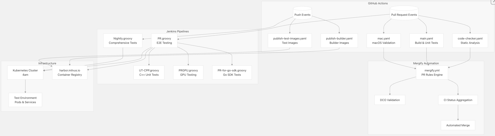
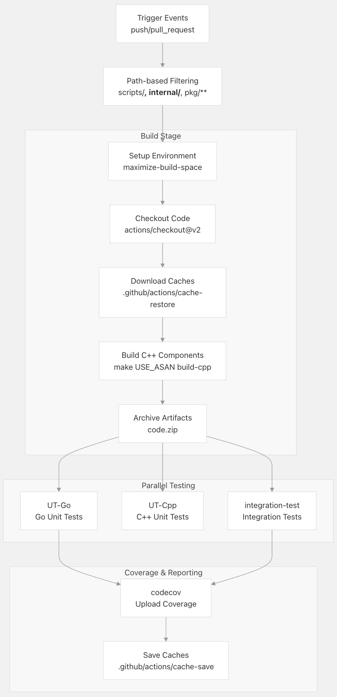
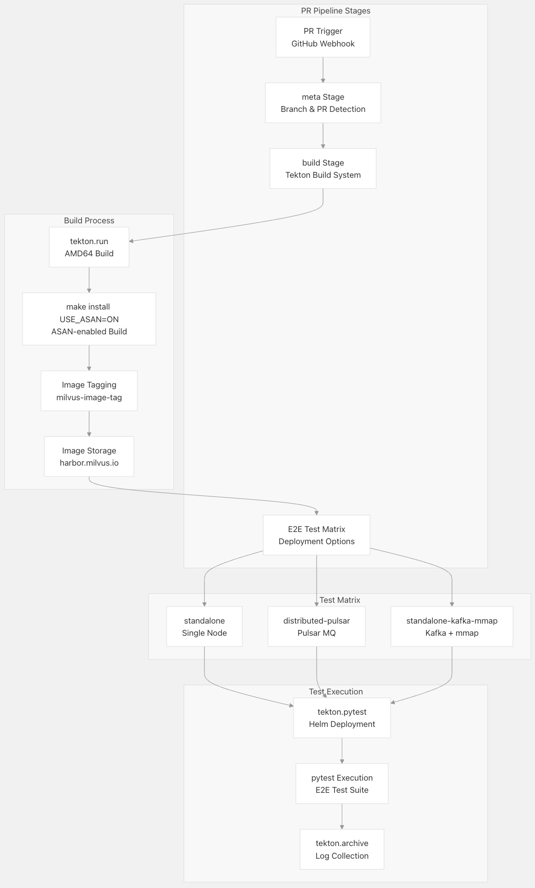
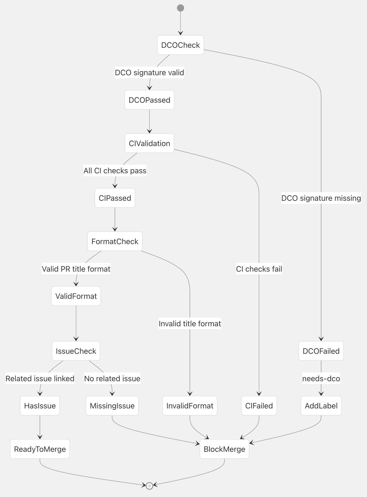
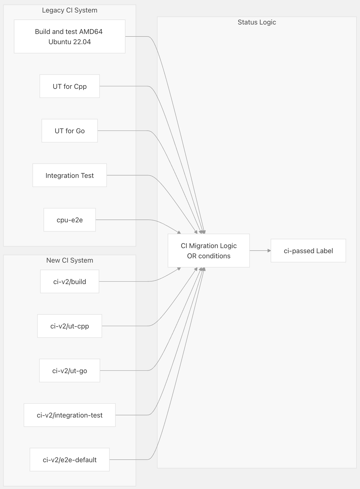
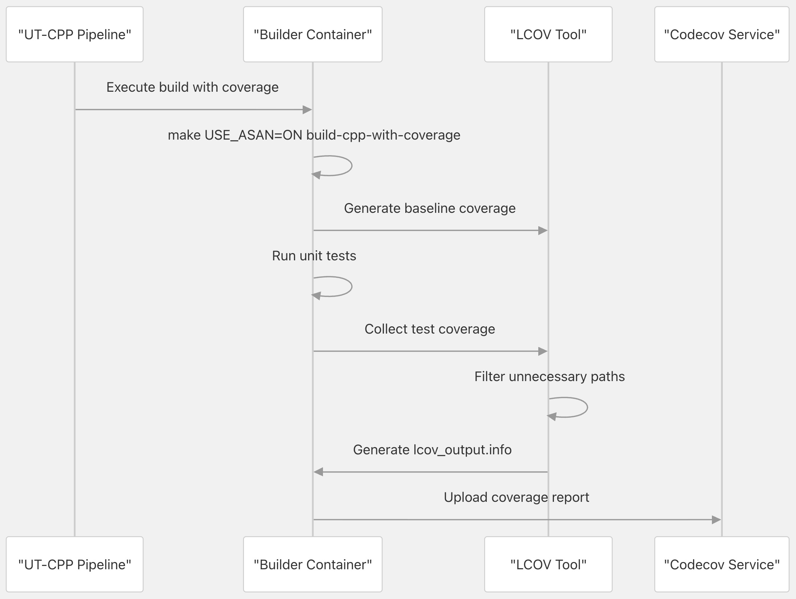
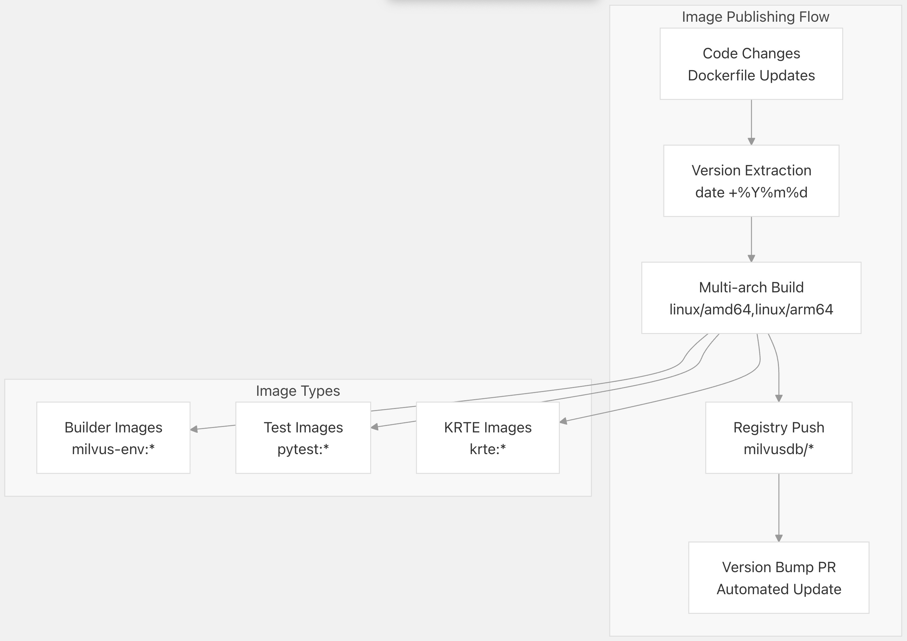

## Milvus 源码学习: 7.3 持续集成/持续部署 (CI/CD) 流水线   
                                                                
### 作者                                                               
digoal                                                              
                                                             
### 日期                                                            
2025-10-29                                                            
                                                              
### 标签                                                              
Milvus , 源码学习                                                               
                                                              
----                                                              
                                                              
## 背景      
本文介绍 Milvus 项目的持续集成和持续部署（CI/CD）基础设施，包括 GitHub Actions 工作流程 (workflows)、Jenkins 流水线 (pipelines)、自动化拉取请求（PR）管理，以及容器镜像发布流程。  
  
## CI/CD 架构概述 (CI/CD Architecture Overview)  
  
Milvus CI/CD 系统采用混合架构（hybrid architecture），结合了用于轻量级操作的 **GitHub Actions** 和用于资源密集型测试工作负载（resource-intensive testing workloads）的 **Jenkins**。  
  
  
  
**源文件 (Sources):**  
- [`.github/workflows/main.yaml` 1-314](https://github.com/milvus-io/milvus/blob/18371773/.github/workflows/main.yaml#L1-L314)  
- [`.github/mergify.yml` 1-576](https://github.com/milvus-io/milvus/blob/18371773/.github/mergify.yml#L1-L576)  
- [`ci/jenkins/PR.groovy` 1-147](https://github.com/milvus-io/milvus/blob/18371773/ci/jenkins/PR.groovy#L1-L147)  
- [`ci/jenkins/Nightly.groovy` 1-298](https://github.com/milvus-io/milvus/blob/18371773/ci/jenkins/Nightly.groovy#L1-L298)  
  
## GitHub Actions 工作流程 (GitHub Actions Workflows)  
  
### 构建和测试工作流程 (Build and Test Workflow)  
  
主要的 GitHub Actions 工作流程处理拉取请求（PR）和推送（pushes）的构建（building）、测试（testing）和代码覆盖率（code coverage）报告。  
  
  
  
该工作流程使用并发控制 (concurrency control) 来取消之前的运行 (previous runs)：  
- [`.github/workflows/main.yaml` 40-42](https://github.com/milvus-io/milvus/blob/18371773/.github/workflows/main.yaml#L40-L42)  
  
**源文件 (Sources):**  
- [`.github/workflows/main.yaml` 44-314](https://github.com/milvus-io/milvus/blob/18371773/.github/workflows/main.yaml#L44-L314)  
- [`tests/docker/.env` 1-8](https://github.com/milvus-io/milvus/blob/18371773/tests/docker/.env#L1-L8)  
  
### 代码质量和验证 (Code Quality and Validation)  
  
多个工作流程确保了跨不同平台的代码质量：  
  
| 工作流程 (Workflow) | 目的 (Purpose) | 关键任务 (Key Jobs) | 触发器 (Triggers) |  
| :--- | :--- | :--- | :--- |  
| `code-checker.yaml` | 静态分析和 Linting（Static analysis and linting） | Ubuntu 22.04, AmazonLinux, RockyLinux | PR/推送 (Push) |  
| `mac.yaml` | macOS 兼容性验证 (compatibility validation) | macOS 13 构建验证 (build verification) | PR/推送 (Push) |  
| `publish-builder.yaml` | 构建器镜像发布 (Builder image publishing) | 多架构 (Multi-arch) Docker 构建 | 构建器更改 (Builder changes) |  
| `publish-test-images.yaml` | 测试镜像发布 (Test image publishing) | PyTest 镜像更新 | 测试依赖 (Test dependencies) |  
  
**源文件 (Sources):**  
- [`.github/workflows/code-checker.yaml` 36-133](https://github.com/milvus-io/milvus/blob/18371773/.github/workflows/code-checker.yaml#L36-L133)  
- [`.github/workflows/mac.yaml` 34-78](https://github.com/milvus-io/milvus/blob/18371773/.github/workflows/mac.yaml#L34-L78)  
- [`.github/workflows/publish-builder.yaml` 24-91](https://github.com/milvus-io/milvus/blob/18371773/.github/workflows/publish-builder.yaml#L24-L91)  
  
## Jenkins 流水线 (Jenkins Pipelines)  
  
### 拉取请求流水线 (Pull Request Pipeline)  
  
Jenkins PR 流水线使用 Tekton 共享库 (shared library) 协调（orchestrates）跨多个部署配置的全面 **端到端测试（E2E testing）**。  
  
  
  
**源文件 (Sources):**  
- [`ci/jenkins/PR.groovy` 49-77](https://github.com/milvus-io/milvus/blob/18371773/ci/jenkins/PR.groovy#L49-L77)  
- [`ci/jenkins/PR.groovy` 96-114](https://github.com/milvus-io/milvus/blob/18371773/ci/jenkins/PR.groovy#L96-L114)  
  
### 专用流水线 (Specialized Pipelines)  
  
CI 系统包含多个用于特定测试场景的专用 Jenkins 流水线：  
  
* **C++ 单元测试（C++ Unit Tests）**: 带有启用 **ASAN** (AddressSanitizer) 的构建和代码覆盖率收集的专用流水线。  
    - [`ci/jenkins/UT-CPP.groovy` 46-72](https://github.com/milvus-io/milvus/blob/18371773/ci/jenkins/UT-CPP.groovy#L46-L72)  
* **GPU 测试（GPU Testing）**: 针对启用 GPU 的工作负载的专用流水线。  
    - [`ci/jenkins/PRGPU.groovy` 41-75](https://github.com/milvus-io/milvus/blob/18371773/ci/jenkins/PRGPU.groovy#L41-L75)  
* **Go SDK 测试（Go SDK Testing）**: 针对 Go SDK 兼容性的验证流水线。  
    - [`ci/jenkins/PR-for-go-sdk.groovy` 49-78](https://github.com/milvus-io/milvus/blob/18371773/ci/jenkins/PR-for-go-sdk.groovy#L49-L78)  
* **夜间构建（Nightly Builds）**: 包含多种配置的全面夜间测试。  
    - [`ci/jenkins/Nightly.groovy` 52-82](https://github.com/milvus-io/milvus/blob/18371773/ci/jenkins/Nightly.groovy#L52-L82)  
  
**源文件 (Sources):**  
- [`ci/jenkins/UT-CPP.groovy` 1-75](https://github.com/milvus-io/milvus/blob/18371773/ci/jenkins/UT-CPP.groovy#L1-L75)  
- [`ci/jenkins/PRGPU.groovy` 1-243](https://github.com/milvus-io/milvus/blob/18371773/ci/jenkins/PRGPU.groovy#L1-L243)  
- [`ci/jenkins/Nightly.groovy` 1-298](https://github.com/milvus-io/milvus/blob/18371773/ci/jenkins/Nightly.groovy#L1-L298)  
  
## 自动化拉取请求管理 (Automated Pull Request Management)  
  
Mergify 提供自动化 PR 管理，具有用于验证 (validation)、标签 (labeling) 和合并 (merging) 的复杂规则。  
  
### DCO 和验证规则 (DCO and Validation Rules)  
  
  
  
Mergify 配置强制执行多个验证层：  
  
1.  **DCO 合规性（DCO Compliance）**:  
    - [`.github/mergify.yml` 63-86](https://github.com/milvus-io/milvus/blob/18371773/.github/mergify.yml#L63-L86)  
2.  **CI 状态验证（CI Status Validation）**:  
    - [`.github/mergify.yml` 93-128](https://github.com/milvus-io/milvus/blob/18371773/.github/mergify.yml#L93-L128)  
3.  **PR 格式验证（PR Format Validation）**:  
    - [`.github/mergify.yml` 380-433](https://github.com/milvus-io/milvus/blob/18371773/.github/mergify.yml#L380-L433)  
4.  **Issue 链接要求（Issue Linking Requirements）**:  
    - [`.github/mergify.yml` 299-336](https://github.com/milvus-io/milvus/blob/18371773/.github/mergify.yml#L299-L336)  
  
**源文件 (Sources):**  
- [`.github/mergify.yml` 56-576](https://github.com/milvus-io/milvus/blob/18371773/.github/mergify.yml#L56-L576)  
  
### CI 状态聚合 (CI Status Aggregation)  
  
在 CI 系统迁移期间，Mergify 系统聚合来自多个来源的 CI 结果：  
  
  
  
**源文件 (Sources):**  
- [`.github/mergify.yml` 219-293](https://github.com/milvus-io/milvus/blob/18371773/.github/mergify.yml#L219-L293)  
  
## 构建和测试流水线详情 (Build and Test Pipeline Details)  
  
### 容器构建流程 (Container Build Process)  
  
构建系统使用容器化环境，并使用特定的构建器镜像 (builder images) 来确保跨不同平台的一致编译。  
  
| 平台 (Platform) | 基础镜像 (Base Image) | 关键特性 (Key Features) |  
| :--- | :--- | :--- |  
| Ubuntu 20.04 | `ubuntu:focal-20220426` | GCC, Clang, ASAN 支持 |  
| Ubuntu 22.04 | `ubuntu:jammy-20240530` | GCC-12, 现代工具链 (Modern toolchain) |  
| AmazonLinux 2023 | `amazonlinux:2023` | 企业兼容性 (Enterprise compatibility) |  
| RockyLinux 8 | `rockylinux/rockylinux:8` | RHEL 兼容性 |  
  
**源文件 (Sources):**  
- [`build/docker/builder/cpu/ubuntu20.04/Dockerfile` 12-62](https://github.com/milvus-io/milvus/blob/18371773/build/docker/builder/cpu/ubuntu20.04/Dockerfile#L12-L62)  
- [`build/docker/builder/cpu/ubuntu22.04/Dockerfile` 12-68](https://github.com/milvus-io/milvus/blob/18371773/build/docker/builder/cpu/ubuntu22.04/Dockerfile#L12-L68)  
  
### 测试环境配置 (Test Environment Configuration)  
  
Jenkins 流水线利用 Kubernetes Pod 模板 (pod templates) 来确保一致的测试环境：  
```  
# Pod configuration example from rte.yaml  
apiVersion: v1  
kind: Pod  
spec:  
  containers:  
  - name: main  
    image: milvusdb/krte:20211213-dcc15e9  
    resources:  
      limits: {cpu: "6", memory: "12Gi"}  
  - name: pytest    
    image: harbor.milvus.io/dockerhub/milvusdb/pytest:20241023-3b024f9  
```  
  
**源文件 (Sources):**  
- [`ci/jenkins/pod/rte.yaml` 1-84](https://github.com/milvus-io/milvus/blob/18371773/ci/jenkins/pod/rte.yaml#L1-L84)  
- [`ci/jenkins/pod/e2e.yaml` 1-85](https://github.com/milvus-io/milvus/blob/18371773/ci/jenkins/pod/e2e.yaml#L1-L85)  
  
### 代码覆盖率流水线 (Code Coverage Pipeline)  
  
C++ 单元测试流水线包括使用 **LCOV** 进行的全面代码覆盖率收集：  
  
  
  
**源文件 (Sources):**  
- [`scripts/run_cpp_codecov.sh` 38-105](https://github.com/milvus-io/milvus/blob/18371773/scripts/run_cpp_codecov.sh#L38-L105)  
- [`ci/jenkins/UT-CPP.groovy` 50-61](https://github.com/milvus-io/milvus/blob/18371773/ci/jenkins/UT-CPP.groovy#L50-L61)  
  
## 容器镜像发布 (Container Image Publishing)  
  
### 多架构构建流程 (Multi-Architecture Build Process)  
  
发布工作流程支持使用 Docker Buildx 为 AMD64 和 ARM64 平台构建多架构容器 (multi-architecture container builds)。  
  
  
  
**源文件 (Sources):**  
- [`.github/workflows/publish-builder.yaml` 76-83](https://github.com/milvus-io/milvus/blob/18371773/.github/workflows/publish-builder.yaml#L76-L83)  
- [`.github/workflows/publish-test-images.yaml` 44-76](https://github.com/milvus-io/milvus/blob/18371773/.github/workflows/publish-test-images.yaml#L44-L76)  
  
### 自动化版本管理 (Automated Version Management)  
  
发布的镜像会通过 GitHub Actions 触发自动化版本更新，这些 Actions 会创建拉取请求 (PR) 来更新镜像引用 (image references)：  
  
* **构建器镜像版本** (`Builder image versions`) 在 `.env` 文件中：  
    - [`.github/actions/bump-builder-version/action.yaml` 20-35](https://github.com/milvus-io/milvus/blob/18371773/.github/actions/bump-builder-version/action.yaml#L20-L35)  
* **测试镜像版本** (`Test image versions`) 在 Pod 配置中：  
    - [`.github/workflows/publish-test-images.yaml` 67-76](https://github.com/milvus-io/milvus/blob/18371773/.github/workflows/publish-test-images.yaml#L67-L76)  
* **KRTE 镜像版本** (`KRTE image versions`) 在 Jenkins Pod 规范中：  
    - [`.github/workflows/publish-krte-images.yaml` 58-64](https://github.com/milvus-io/milvus/blob/18371773/.github/workflows/publish-krte-images.yaml#L58-L64)  
  
**源文件 (Sources):**  
- [`.github/actions/bump-builder-version/action.yaml` 1-55](https://github.com/milvus-io/milvus/blob/18371773/.github/actions/bump-builder-version/action.yaml#L1-L55)  
- [`.github/workflows/publish-test-images.yaml` 61-97](https://github.com/milvus-io/milvus/blob/18371773/.github/workflows/publish-test-images.yaml#L61-L97)  
  
## 基础设施和配置 (Infrastructure and Configuration)  
  
### Kubernetes 测试基础设施 (Kubernetes Test Infrastructure)  
  
Jenkins 流水线在一个名为 "4am" 的 Kubernetes 集群上执行，该集群具有专用的节点池（node pools）：  
  
* **E2E 节点** (`E2E nodes`): 带有 `node-role.kubernetes.io/e2e` 标签，用于测试工作负载隔离 (test workload isolation)。  
* **GPU 节点** (`GPU nodes`): 带有 `nvidia.com/gpu.present` 标签，用于启用 GPU 的测试。  
* **资源配额** (`Resource quotas`): 可配置的每种测试类型的 CPU/内存限制。  
  
**源文件 (Sources):**  
- [`tests/scripts/values/ci/pr.yaml` 5-17](https://github.com/milvus-io/milvus/blob/18371773/tests/scripts/values/ci/pr.yaml#L5-L17)  
- [`tests/scripts/values/ci/pr-gpu.yaml` 25-36](https://github.com/milvus-io/milvus/blob/18371773/tests/scripts/values/ci/pr-gpu.yaml#L25-L36)  
  
### 日志管理和归档 (Log Management and Archiving)  
  
CI 系统使用 **NFS 挂载存储** (`NFS-mounted storage`) 实现了全面的日志收集：  
```  
# Log archiving process  
LOG_DIR=${LOG_DIR:-/ci-logs/}  
RELEASE_NAME=${RELEASE_NAME:-milvus-testing}  
tar -zcvf ${ARTIFACTS_NAME:-artifacts}.tar.gz ${RELEASE_LOG_DIR}/*  
```  
  
**源文件 (Sources):**  
- [`tests/scripts/ci_logs.sh` 82-103](https://github.com/milvus-io/milvus/blob/18371773/tests/scripts/ci_logs.sh#L82-L103)  
- [`ci/jenkins/pod/rte.yaml` 80-84](https://github.com/milvus-io/milvus/blob/18371773/ci/jenkins/pod/rte.yaml#L80-L84ƒ)  
    
#### [期望 PostgreSQL|开源PolarDB 增加什么功能?](https://github.com/digoal/blog/issues/76 "269ac3d1c492e938c0191101c7238216")
  
  
#### [PolarDB 开源数据库](https://openpolardb.com/home "57258f76c37864c6e6d23383d05714ea")
  
  
#### [PolarDB 学习图谱](https://www.aliyun.com/database/openpolardb/activity "8642f60e04ed0c814bf9cb9677976bd4")
  
  
#### [PostgreSQL 解决方案集合](../201706/20170601_02.md "40cff096e9ed7122c512b35d8561d9c8")
  
  
#### [德哥 / digoal's Github - 公益是一辈子的事.](https://github.com/digoal/blog/blob/master/README.md "22709685feb7cab07d30f30387f0a9ae")
  
  
#### [About 德哥](https://github.com/digoal/blog/blob/master/me/readme.md "a37735981e7704886ffd590565582dd0")
  
  

  
