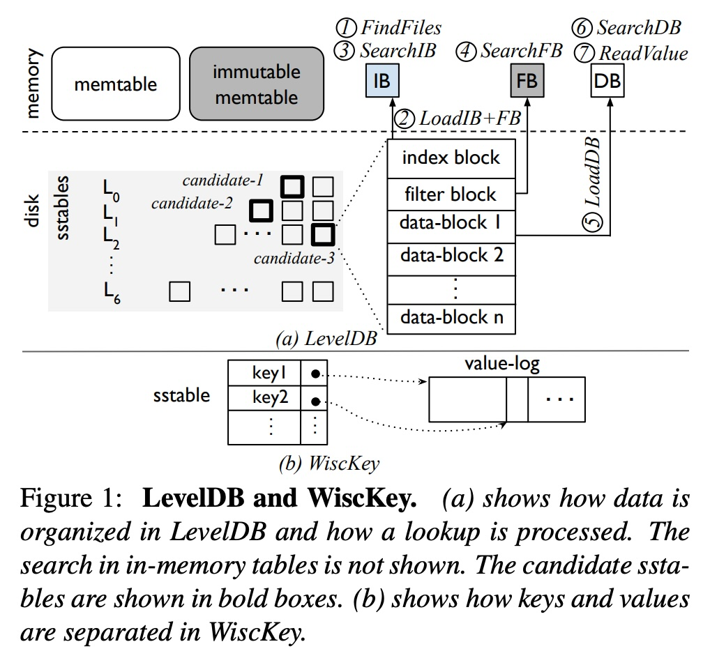
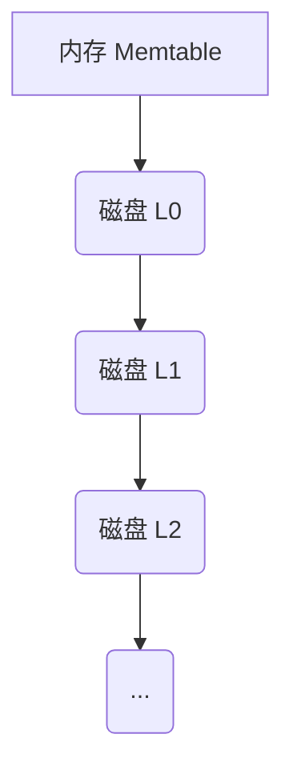
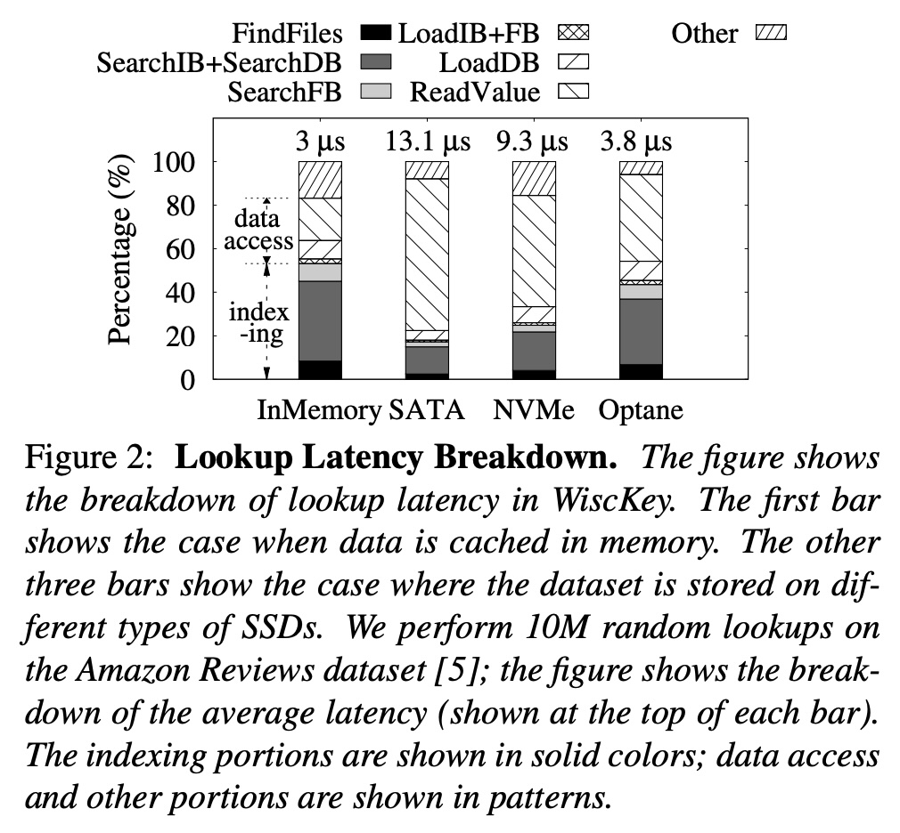
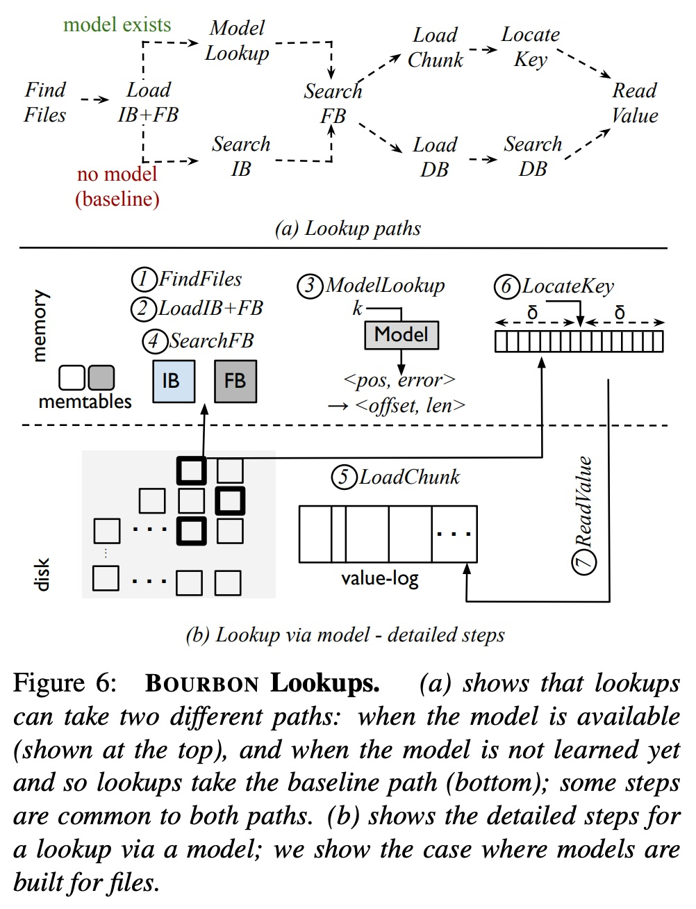
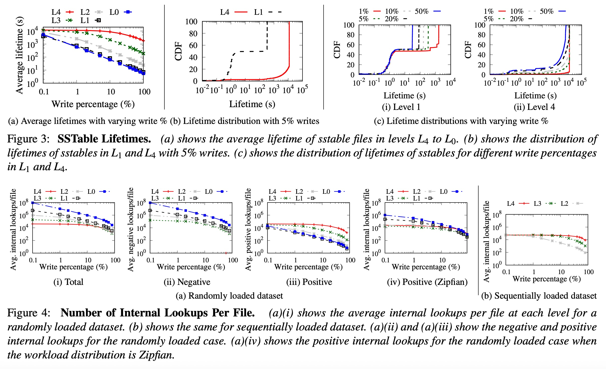
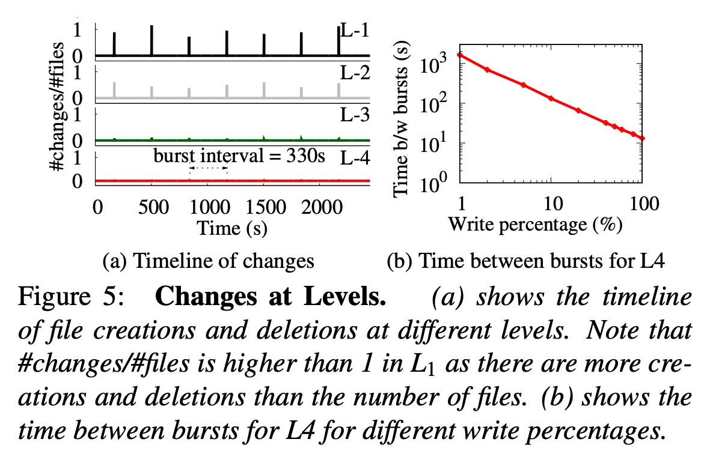
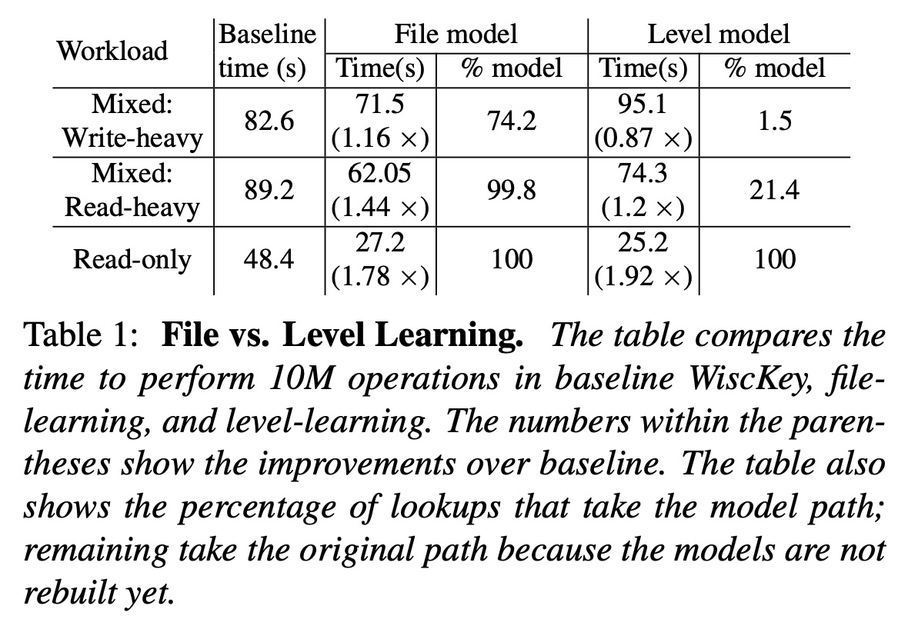
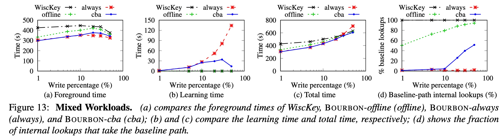

## AI论文解读 | From WiscKey to Bourbon: A Learned Index for Log-Structured Merge Trees
        
### 作者        
digoal        
        
### 日期        
2025-10-30        
        
### 标签        
PostgreSQL , PolarDB , DuckDB , AI , 论文解读        
        
----        
        
## 背景  
      
https://www.usenix.org/system/files/osdi20-dai_0.pdf        
  
提示:          
```          
读懂《From WiscKey to Bourbon: A Learned Index for Log-Structured Merge Trees》这篇论文需要提前掌握哪些基础知识, 请使用中文通熟易懂的讲解这些基础知识, 可以引用论文中的图、表或使用Markdown支持的图形(text,mermaid等)增加解释性. 
  
使用中文通熟易懂的解读《From WiscKey to Bourbon: A Learned Index for Log-Structured Merge Trees》这篇论文, 其中的关键内容请着重讲解, 可以引用论文中的图、表或使用Markdown支持的图形(text,mermaid等)增加解释性. 
  
提取《From WiscKey to Bourbon: A Learned Index for Log-Structured Merge Trees》这篇论文中的重要术语, 使用中文对这些术语进行通熟易懂的讲解, 可以引用论文中的图、表或使用Markdown支持的图形(text,mermaid等)增加解释性. 
```     
  
## 1 前置知识 
  
要完全理解这篇论文《From WiscKey to Bourbon: A Learned Index for Log-Structured Merge Trees》，您需要对数据库系统和基础机器学习有一些前置知识。

简单来说，这篇论文的核心思想是：**用一种简单的机器学习模型（“Bourbon”）来优化一个本已很高效的键值存储系统（“WiscKey”），使其“查找”数据的速度变得更快**。

以下是您需要掌握的基础知识，我会用通俗易懂的方式并结合论文中的图表来解释：

### 1. 核心数据结构：日志结构合并树 (LSM-Tree)

LSM-Tree（Log-Structured Merge Tree）是许多现代NoSQL数据库（如 LevelDB, RocksDB, Cassandra）的核心 。

* **设计初衷**：为了解决传统B-Tree（关系型数据库常用）“写入”数据慢的问题 。LSM-Tree 的设计目标是实现极高的**写入吞吐量**。
* **工作原理**（见论文 `Figure 1(a)` ）：    
    1.  **内存写入 (Memtable)**：所有新的写入请求（增、删、改）都先快速写入内存中的一个叫 `memtable` 的结构 。这非常快，因为内存读写远快于磁盘。
    2.  **刷盘 (Immutable Memtable -> SSTable)**：当 `memtable` 写满后，它会变成“只读”状态（`immutable memtable` ），然后被完整地、顺序地写入到磁盘上的一个文件（称为 `SSTable`） 。这种“顺序写入”对机械硬盘和SSD都非常友好，速度很快。
    3.  **分层 (Levels)**：磁盘上的 `SSTable` 文件被组织成多个“层级”（Level） ，比如 $L_0, L_1, L_2, \dots, L_6$ 。 $L_0$ 层最新， $L_6$ 层最老 。
    4.  **合并 (Compaction)**：后台会有一个“合并”进程 ，像归并排序一样，定期把上层（ 如 $L_1$ ）的SSTable文件和下层（ 如 $L_2$ ）的合并，清除掉旧的或已删除的数据，然后生成新的 $L_2$ 文件 。
* **LSM-Tree 的“痛点”：查找 (Lookup)**
    因为数据是分层的，且最新的数据总在最上层，所以一次“查找”操作必须像“筛子”一样一层一层往下找 ：
    > **查找路径**：先查 `memtable` -> 再查 `immutable memtable` -> 再查 $L_0$ -> 再查 $L_1$ ... 直到在某一层的某个SSTable文件中找到数据 。

    这种多层查找（尤其是当SSTable文件很多时）会显著拖慢“读取”性能。**这篇论文的主要目标就是优化这个查找过程** 。

### 2. 论文的起点：WiscKey 键值分离

论文标题中的 "From WiscKey..." 表明，他们的工作是建立在 WiscKey 这个系统之上的 。

* **WiscKey 是什么**：它是一种对标准 LSM-Tree 的优化设计 。
* **核心思想：键值分离 (Key-Value Separation)** 。
    * 在标准的LSM-Tree（如 `Figure 1(a)`）中，SSTable文件里同时存着“键 (Key)”和“值 (Value)”。如果“值”很大（比如一张图片或一个大JSON），那么在“合并”时，系统需要读写和排序这些庞大的数据，导致效率低下（称为“写放大”） 。
    * WiscKey 的做法（如 `Figure 1(b)` ）是：    
        1.  LSM-Tree 的 SSTable 里**只存“键 (Key)”和“值的位置指针 (pointer)”** 。
        2.  所有实际的“值 (Value)”被单独存放在一个叫 `value-log` 的大日志文件中 。
* **为什么这很重要**：
    1.  “合并”操作变得飞快，因为它只处理很小的“键+指针” 。
    2.  SSTable文件变得非常小，小到经常可以**整个缓存在内存中** 。
    3.  （对本论文最关键的一点）SSTable中的记录（键+指针）都变成了**固定大小**。这为使用机器学习模型进行“位置预测”提供了巨大便利 。

### 3. 论文的核心技术：学习型索引 (Learned Index)

这是理解论文的第二个关键概念 。

* **传统索引**：就像一本书的目录，它告诉你“第5章在第100页”。在数据库中，这通常是B-Tree或SSTable中的“索引块 (index block)” 。你要找一个键，需要通过“二分查找”  来定位，这个过程的复杂度是 $O(\log n)$ 。
* **学习型索引**：它试图用一个**机器学习模型**来替代这个“目录” 。
    * **核心思想**：如果我知道数据是“如何分布的”，我就可以*预测*一个键“大概”在什么位置。
    * **通俗比喻**：
        * **传统索引**：查找字典里的单词 "banana"。你先翻到中间 "M"，发现 "b" 在前面；再翻到 "F"，发现 "b" 在前面... 这就是二分查找 $O(\log n)$ 。
        * **学习型索引**：你训练一个模型来学习所有单词的分布。你问模型 "banana" 在哪？模型通过计算，*直接预测* "banana" 大概在字典的第 5000 个位置，误差不超过 $\pm 10$ 个词 。
    * **优势**：模型预测（一次计算）是 $O(1)$ 复杂度，远快于 $O(\log n)$ 的查找 。你只需要跳到预测位置，然后在很小的误差范围内（ $\pm 10$ 个词 ）进行本地搜索就行了 。

**Bourbon 系统就是把“学习型索引”这个思想，应用到了 WiscKey 的 SSTable 文件中** 。当需要在一个 SSTable 文件里查找某个键时，它不再使用二分查找，而是用模型来“预测”这个键的位置 。

### 4. 论文的具体模型：分段线性回归 (PLR)

论文里提到，Bourbon 使用的模型是 "greedy piecewise linear regression" (贪心分段线性回归) 。

* **这是什么**：一种非常简单、非常快的机器学习模型。
* **工作原理**：它不用一个复杂平滑的曲线（比如神经网络）来拟合所有数据，而是用**很多条短的直线段**来“大致描绘”数据的分布 。
* **为什么用它**：
    1.  **训练快 (Fast Training)**：算法（Greedy-PLR）只需要遍历一次数据就能建好模型 。这在LSM-Tree这种不断有新SSTable文件生成（即需要不断训练新模型）的环境下至关重要。
    2.  **查询快 (Fast Inference)**：预测时，先快速（二分）找到键在哪条“直线段”上 ，然后用一个简单的 $y = mx + b$ 公式就能算出预测位置 。
    3.  **占用空间小 (Low Space)**：只需要存储每条线段的“斜率”和“截距”即可 。

---

### 总结：您需要提前了解的知识点

为了帮您更好地梳理，您可以对照这个清单来准备：

| 基础知识 | 它是什么？ | 为什么在这篇论文中很重要？ |
| :--- | :--- | :--- |
| **LSM-Tree** | 一种为“高写入”优化的数据结构。数据分层存储。 | 论文的优化对象。它的“读取”操作（跨层查找）是性能瓶颈。 |
| **SSTable** | (Sorted String Table) LSM-Tree 存在磁盘上的只读、有序文件。 | Bourbon 为**每个SSTable文件**建立一个学习型索引模型 。 |
| **Compaction (合并)** | LSM-Tree 后台整理数据的过程。 | 这个过程会创建新的、删除旧的SSTable，意味着模型需要被“重新学习” 。 |
| **WiscKey** | 一种LSM-Tree的变体，它将“键”和“值”分开存储。 | Bourbon 建立在 WiscKey 之上 。WiscKey的“键值分离”使SSTable中的记录大小固定，极大简化了模型的预测难度 。 |
| **Learned Index** | 用ML模型替代传统索引（如B-Tree）来进行位置预测。 | 这是论文的核心技术。目标是将 $O(\log n)$ 的查找变为 $O(1)$ 的预测 。 |
| **线性回归** | 基础的机器学习模型，用直线（ $y=mx+b$ ）来拟合数据。 | Bourbon 用的 PLR  就是它的一个变种，用多条直线来拟合数据分布 。 |
| **CDF (累积分布函数)** | 一个统计学概念，表示数据集中小于等于某个值的元素所占的比例。 | 学习型索引本质上就是在学习数据的CDF 。模型（PLR）就是在拟合这个CDF。 |

掌握了这些概念后，您就能很清楚地理解论文在做什么了：它在 WiscKey 的 LSM-Tree 架构上，为每一个 SSTable 文件都训练了一个轻量级的 PLR 模型，以此来加速文件内的查找，同时还设计了一套“成本收益分析”策略 ，来智能地决定“何时”以及“是否”值得为某个SSTable文件训练模型。

希望这份解释对您有帮助！您想先深入了解哪个概念，比如 LSM-Tree 的查找流程，还是 Learned Index 的工作原理？
  
## 2 解读论文 
  
好的，这是一篇非常经典的系统论文，它巧妙地将机器学习（ML）与一个成熟的数据存储系统（LSM-Tree）结合了起来。

我将为您通俗易懂地解读这篇论文的核心内容。

### 论文一句话总结

这篇论文介绍了 **Bourbon** 系统，它在 **WiscKey**（一个优化的键值存储系统）的基础上，引入了**学习型索引 (Learned Index)**，并且设计了一套智能的**成本收益分析 (Cost-Benefit Analysis)** 策略，来决定“何时”以及“是否”使用机器学习模型，最终显著提升了LSM-Tree的“查找”性能 。

-----

### 1\. 问题的起点：LSM-Tree 查起来太慢

首先，我们需要理解论文要优化的对象：**LSM-Tree (日志结构合并树)**。

  * **它擅长什么？** 极快的“写入”速度。
  * **它头疼什么？** 较慢的“查找”速度 。

LSM-Tree 就像一个多层的文件柜（如论文 `Figure 1(a)` 所示） 。    



1.  所有新数据先写入最快的**内存 (Memtable)** 。
2.  内存写满后，刷到磁盘上，成为第0层 **(L0)** 。
3.  L0满了会和L1合并，以此类推，数据一层层往下沉 。
4.  **查找的痛点**：因为数据分布在所有层，当你要找一个键 (Key) 时，你必须像筛子一样**从上到下依次查找**：先查内存 -\> 再查L0 -\> 再查L1... 直到找到为止 。这导致一次查找可能需要多次I/O和计算。
 
**论文用 `Figure 2` 证明了问题的严重性**：    
在数据被缓存到内存 (In-Memory) 的情况下， **“索引 (Indexing)”** （图中深色和灰色部分）占了总查找时间的一半以上 。这意味着，即使I/O很快，CPU在“查找索引”上也浪费了大量时间。

### 2\. 论文的基石：为什么选择 WiscKey？

论文标题是 "From WiscKey to Bourbon"，WiscKey 是他们的起点。

WiscKey 本身就是对标准 LSM-Tree 的一个重大优化，它采用了 **“键值分离”** 技术 。

  * **标准LSM (Figure 1a)**：SSTable 文件中混着“键 (Key)”和“值 (Value)” 。    
  * **WiscKey (Figure 1b)**：
      * LSM-Tree 的 SSTable 里只存“键 (Key)”和“值的位置指针 (Pointer)” 。
      * 所有庞大的“值 (Value)”被单独存放在一个大日志文件 (`value-log`) 中 。

这个设计对 Bourbon 至关重要，因为它带来了两个巨大好处：

1.  SSTable文件变得非常小（因为不存Value），小到可以**常驻内存** 。这让 `Figure 2` 中“内存索引”的开销问题更加凸显。
2.  SSTable 中的记录（键+指针）都变成了**固定大小** 。这对机器学习模型来说是天大的好事，因为预测“位置”变得极其简单。

### 3\. 核心思想：用“模型预测”替代“二分查找”

Bourbon 的核心技术是**学习型索引 (Learned Index)** 。

想象一下在一部超厚的字典里查单词 "Bourbon"：

  * **传统索引 (二分查找)**：你先翻到中间 (M)，发现B在前面；再翻到 (F)，发现B在前面... 这个过程的复杂度是 $O(\log n)$ 。SSTable 中的索引块 (Index Block) 就是这么干的 。
  * **学习型索引 (模型预测)**：你通过学习（比如你“知道”B是第2个字母），*直接预测* "Bourbon" 大概在字典的 5% 处。你翻过去，发现周围是 "Bordeaux"，你只需在附近（一个很小的误差 $\delta$ 范围内）找一下就能找到 "Bourbon" 。这个过程是 $O(1)$ 。

Bourbon 使用了一种简单高效的模型：**分段线性回归 (PLR)** 。它用很多条短直线来拟合一个SSTable文件内“键”的分布 。

**Bourbon 的新查找路径 (Figure 6b)** ：    
当需要在 SSTable 文件中查找时，它不再加载“索引块”进行二分查找，而是：

1.  **ModelLookup (新)** ：用PLR模型预测键 `k` 的位置 `pos` 和最大误差 `δ` 。
2.  **LoadChunk (新)** ：只加载 `pos` 周围 `±δ` 范围内的一个小数据块 (Chunk) 。而老方法是加载整个数据块 (Data Block) 。
3.  **LocateKey (新)** ：在那个很小的 Chunk 内快速定位到 `k` 。

### 4\. 论文的精华：5条“学习指南”与成本收益分析

LSM-Tree 的数据是不断变化的（因为合并操作），模型会频繁失效。Bourbon 最精妙的地方，在于它**不盲目地学习**，而是先通过深入分析（`Figure 3, 4, 5`）总结出了5条“学习指南”，并据此设计了**成本收益分析器 (Cost-Benefit Analyzer)** 。

  

**分析得出的指南 (Section 3.2)**：

1.  **指南1：优先学习低层级 (L3, L4...)** 。
      * *原因*：`Figure 3(a)` 显示，低层级的文件“活得久” (Lifetime 长) 。为它们建模型更划算。
2.  **指南2：学习前“等一等” (Wait)** 。
      * *原因*：`Figure 3(b)` 显示，即使在低层级，也有（约2%）的文件刚出生就“夭折”了（Short-lived）。不能浪费资源去学它们。Bourbon 默认等待 50ms 。
3.  **指南3：别忽视高层级 (L0, L1)** 。
      * *原因*：`Figure 4(a)(ii)` 显示，高层级虽然变化快，但它们承受了大量的“无效查找 (Negative lookups)” 。加速它们收益很高。
4.  **指南4：感知工作负载 (Workload-aware)** 。
      * *原因*：一个文件是否值得学，取决于它被访问的“热度”，而不是只看它在哪一层 。
5.  **指南5：别学“整个层级”** 。
      * *原因*：`Figure 5` 和 `Table 1` 显示，在有写入时，“整个层级”的变化非常快 。刚学好的模型马上就失效了，得不偿失。因此，Bourbon 决定**只按“文件”粒度学习** 。      

**Bourbon 的智能大脑：成本收益分析器 (CBA)** 

基于上述指南，CBA 会为每个“等待”了50ms的SSTable文件计算：

  * **成本 (Cost)**： $C_{model}$ = 训练这个模型需要多长时间？（与文件大小成正比） 
  * **收益 (Benefit)**： $B_{model}$ = (每次查找节省的时间) $\times$ (这个文件未来预计被查找的次数) 

**决策：当 $B_{model} > C_{model}$ 时，Bourbon 才会决定为这个文件启动后台线程学习模型** 。

### 5\. 关键结果：Bourbon 为什么成功了？

`Figure 13` 完美展示了 Bourbon 的智能之处。论文对比了三种策略：    

  * **Bourbon-offline (只学一次，绿色)**：写入发生后，新数据没有模型，查找很快退化 。
  * **Bourbon-always (激进学习，蓝色)**：只要有新文件就学 。
      * *优点*：查找速度最快 (图a `Foreground time` 最低) 。
      * *缺点*：后台“学习时间”开销巨大 (图b `Learning time` 爆表)，导致总开销(图c)最高 。
  * **Bourbon-cba (智能学习，红色)**：使用成本收益分析器 。
      * *结果*：它获得了**接近 "always" 的查找速度** (图a)，同时保持了**极低的后台学习开销** (图b)，最终实现了**最低的总工作时间** (图c) 。

**一句话总结结果**：Bourbon 的 CBA 策略取得了“激进学习”的好处（查找快），同时避免了其高昂的后台开销（总成本低）。在只读场景下，它带来了 1.23x 到 1.78x 的性能提升 。

-----

### 结论

《From WiscKey to Bourbon》的贡献 **不仅仅是“把ML用在LSM-Tree上”** ，而是通过深入的系统分析，回答了在LSM-Tree这种“动态变化”的系统中应用ML的**一系列关键问题**：

1.  **学什么？**（WiscKey 中固定大小的键+指针）
2.  **在哪学？**（按“文件”粒度学，而不是“层级”）
3.  **何时学？**（使用成本收益分析器 (CBA)，平衡收益与开销）

它证明了即使是简单、轻量级的模型（PLR），只要与系统设计（LSM-Tree的特性）和智能策略（CBA）深度结合，也能产生巨大的性能收益。
  
## 3 术语 
  

  
## 参考        
         
https://www.usenix.org/system/files/osdi20-dai_0.pdf    
        
<b> 以上内容基于DeepSeek、Qwen、Gemini及诸多AI生成, 轻微人工调整, 感谢杭州深度求索人工智能、阿里云、Google等公司. </b>        
        
<b> AI 生成的内容请自行辨别正确性, 当然也多了些许踩坑的乐趣, 毕竟冒险是每个男人的天性.  </b>        
    
#### [期望 PostgreSQL|开源PolarDB 增加什么功能?](https://github.com/digoal/blog/issues/76 "269ac3d1c492e938c0191101c7238216")
  
  
#### [PolarDB 开源数据库](https://openpolardb.com/home "57258f76c37864c6e6d23383d05714ea")
  
  
#### [PolarDB 学习图谱](https://www.aliyun.com/database/openpolardb/activity "8642f60e04ed0c814bf9cb9677976bd4")
  
  
#### [PostgreSQL 解决方案集合](../201706/20170601_02.md "40cff096e9ed7122c512b35d8561d9c8")
  
  
#### [德哥 / digoal's Github - 公益是一辈子的事.](https://github.com/digoal/blog/blob/master/README.md "22709685feb7cab07d30f30387f0a9ae")
  
  
#### [About 德哥](https://github.com/digoal/blog/blob/master/me/readme.md "a37735981e7704886ffd590565582dd0")
  
  

  
