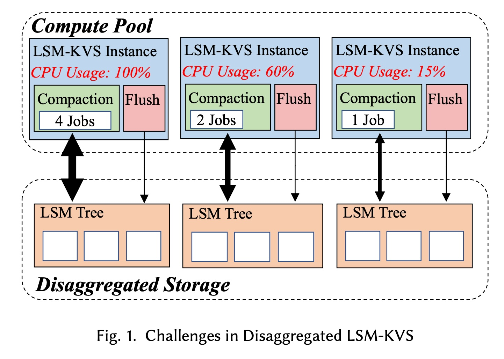
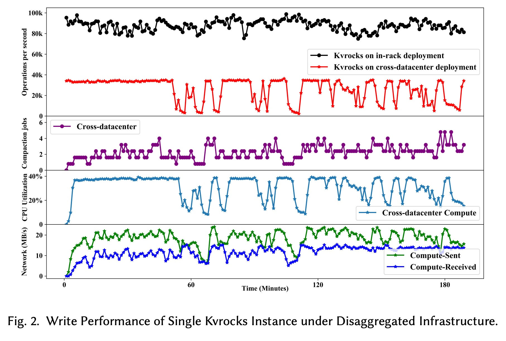
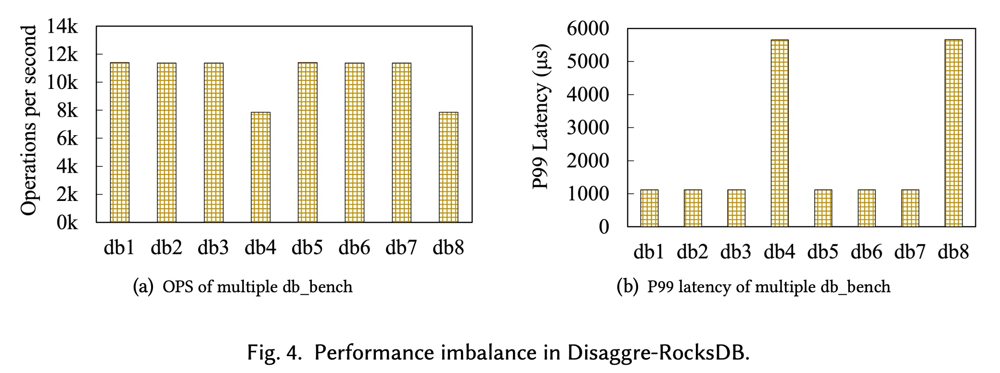
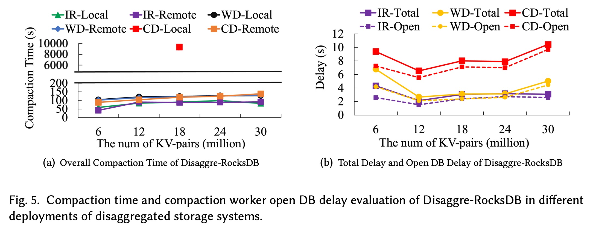
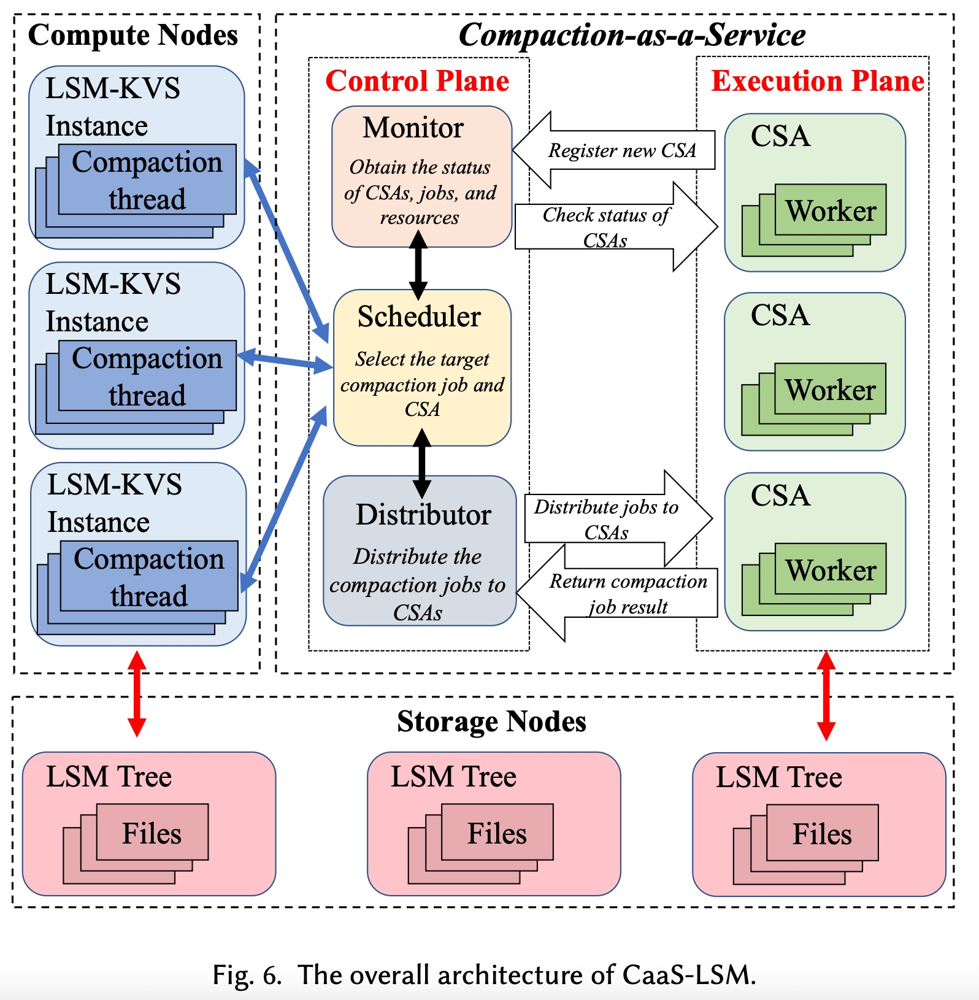
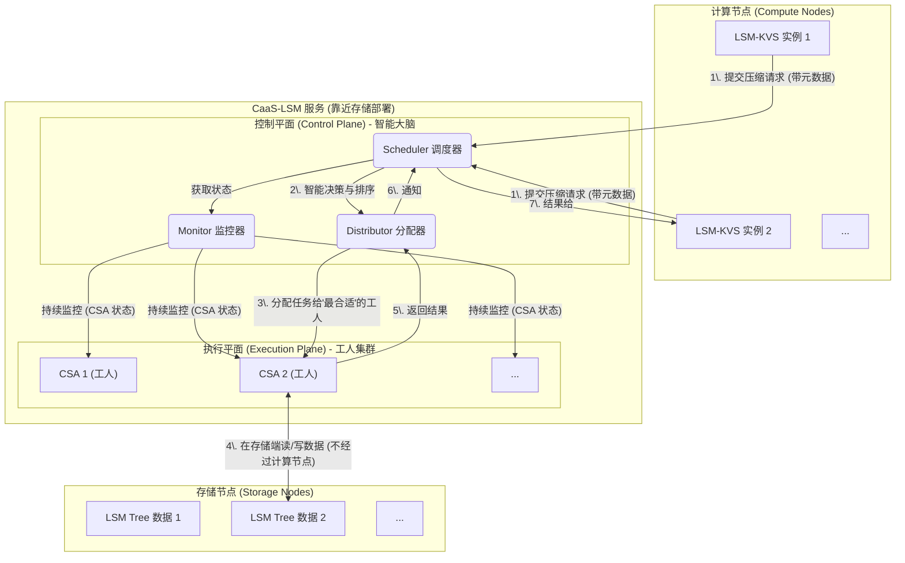
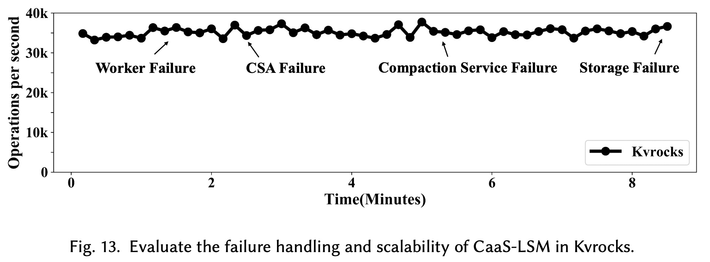

## AI论文解读 | CaaS-LSM: Compaction-as-a-Service for LSM-based Key-Value Stores in Storage Disaggregated Infrastructure
        
### 作者        
digoal        
        
### 日期        
2025-10-30        
        
### 标签        
PostgreSQL , PolarDB , DuckDB , AI , 论文解读        
        
----        
        
## 背景  
      
https://dl.acm.org/doi/pdf/10.1145/3654927        
  
提示:          
```          
读懂《CaaS-LSM: Compaction-as-a-Service for LSM-based Key-Value Stores in Storage Disaggregated Infrastructure》这篇论文需要提前掌握哪些基础知识, 请使用中文通熟易懂的讲解这些基础知识, 可以引用论文中的图、表或使用Markdown支持的图形(text,mermaid等)增加解释性. 
  
使用中文通熟易懂的解读《CaaS-LSM: Compaction-as-a-Service for LSM-based Key-Value Stores in Storage Disaggregated Infrastructure》这篇论文, 其中的关键内容请着重讲解, 可以引用论文中的图、表或使用Markdown支持的图形(text,mermaid等)增加解释性. 
  
提取《CaaS-LSM: Compaction-as-a-Service for LSM-based Key-Value Stores in Storage Disaggregated Infrastructure》这篇论文中的重要术语, 使用中文对这些术语进行通熟易懂的讲解, 可以引用论文中的图、表或使用Markdown支持的图形(text,mermaid等)增加解释性. 
```     
  
## 1 前置知识 
  
要完全读懂这篇论文，您需要先掌握一些关于数据库、数据结构和分布式系统的基础知识。这篇论文的核心是解决一个在特定“云架构”下运行“特定类型数据库”时遇到的“性能问题”。

我将为您逐一分解这些基础知识点：

### 1\. 什么是“键值存储” (Key-Value Store)？

**键值存储 (KVS)** 是最简单的一种数据库。您可以把它想象成一个超级巨大、速度超快的“字典”或“哈希表”。

  * 您通过一个唯一的 **“键” (Key)** （比如，用户ID "user:1001"）
  * 来存取一个 **“值” (Value)** （比如，该用户的个人信息 "{"name": "Alice", "age": 30}"）

这篇论文中提到的 **RocksDB**  就是目前业界最流行的一种键值存储引擎。

### 2\. 什么是“LSM-Tree” (Log-Structured Merge-Tree)？

这是理解本文**最核心**的基础知识。LSM-Tree 是一种专门为“写入”操作优化的数据结构，RocksDB  等许多KVS都使用它。

它的工作原理（简化版）如下：

1.  **写入内存：** 当您写入一条新数据（Key-Value对）时，LSM-Tree 不会立即去修改硬盘上的旧数据。相反，它会先把这条新数据写在内存中的一个叫 **MemTable** 的有序集合里 。这非常快，因为内存读写远快于硬盘。
2.  **刷入硬盘：** 当 MemTable 写满后，系统会把它“冻结”，然后像一个“快照”一样，作为一个完整的、不可修改的、有序的文件（称为 **SST 文件**）刷到硬盘上 。这个文件被放在 **Level-0 (L0)** 层 。
3.  **分层结构：** 随着时间推移，L0 会堆积大量SST文件。LSM-Tree 还有一个分层结构（L1, L2, L3...）。
4.  **读取数据：** 当您要读取一个“键”时，系统必须：
      * 先查内存中的 MemTable。
      * 如果没找到，就去 L0 层的 *所有* SST 文件中查找。
      * 如果还没找到，就去 L1 层找，然后是 L2... 直到找到为止。

> **关键问题：** 随着数据不断写入，L0 层的文件会越来越多。这会导致读取性能急剧下降，因为每次读取都可能要检查几十甚至上百个文件。

### 3\. 什么是“压缩” (Compaction)？

**Compaction（压缩）** 就是为了解决上述LSM-Tree读取性能下降问题的核心机制。

  * **工作内容：** 它是一种后台维护任务，会定期地把某一层（比如 L*i*）的SST文件和下一层（L*i+1*）的SST文件进行**合并**（Merge）。
  * **目的：**
    1.  **减少文件数量：** 把多个小文件合并成一个有序的大文件，这样读取时就不用再查找那么多文件了。
    2.  **清理垃圾数据：** 在合并过程中，把那些已经被“删除”或“更新”（即旧版本）的数据彻底清除掉 。

> **Compaction 的“痛点”：**
> 这个“合并”过程非常消耗资源。它需要读取大量旧文件，进行排序和合并，然后再写入新文件 。这会**大量占用 CPU 和网络I/O** 。当系统很忙时，Compaction 任务就会和用户的正常读写请求“抢资源”，导致性能抖动甚至卡顿（称为“写暂停” Write Stalls）。

### 4\. 什么是“存储分离架构” (Storage Disaggregated Infrastructure)？

这是这篇论文所处的**环境背景**。

  * **传统架构（Monolithic）：** 一台服务器上既有 CPU、内存，也挂载着本地硬盘 。计算和存储“绑定”在一起。
  * **分离架构（Disaggregated）：** 在现代云数据中心里，计算和存储是“分离”的 。
      * **计算池 (Compute Pool)：** 一堆只负责运行程序（比如LSM-KVS实例）的服务器 。
      * **存储池 (Storage Pool)：** 另一堆只负责存数据（比如SST文件）的服务器 。
      * 它们之间通过**高速网络**连接 。

您可以通过论文中的图1  来理解这个架构的挑战：   

```text
      +-----------------------------------------+
      |      计算池 (Compute Pool)                |
      |  [LSM-KVS 实例1] [LSM-KVS 实例2] [LSM-KVS 实例3] |
      |  (CPU: 100%)    (CPU: 60%)      (CPU: 15%)      |  <-- 资源不均衡
      |  (Compaction: 4) (Compaction: 2) (Compaction: 1) |
      +-----------------------------------------+
                    ^
                    | (网络连接)
                    v
      +-----------------------------------------+
      |      存储池 (Disaggregated Storage)       |
      |  [LSM Tree 数据] [LSM Tree 数据] [LSM Tree 数据] |
      +-----------------------------------------+
```

### 5\. 综合挑战：为什么“Compaction”在“存储分离”下问题更严重？

现在，把“痛点3”和“环境4”结合起来，就是这篇论文要解决的核心问题：

1.  **Compaction 在哪执行？** 在分离架构下，LSM-KVS 实例运行在**计算节点**上 。
2.  **数据在哪？** SST 文件存储在**存储节点**上 。
3.  **问题来了：** 当计算节点上的 LSM-KVS 实例要执行 Compaction 时，它必须：
      * 通过网络从“存储池” **读取** 海量的SST文件数据 。
      * 在“计算节点”上用宝贵的 CPU 资源进行合并计算 。
      * 再通过网络把合并后的新SST文件**写回**到“存储池” 。

这导致了**巨大的网络流量**  和 **CPU 资源浪费** ，严重影响了KVS实例的正常服务性能。

### 论文的解决方案：CaaS-LSM

理解了上述所有背景，您就能看懂论文的标题了：**CaaS-LSM (Compaction-as-a-Service for LSM)** 。

  * **CaaS (Compaction-as-a-Service)：** 论文提出，不要在“计算节点”上执行 Compaction。
  * **怎么做？** 建立一个独立的、第三方的“压缩即服务” 。这个服务（论文中的 **Control Plane** 和 **Execution Plane** ）专门负责 Compaction 任务。
  * **好处：**
    1.  **解耦 (Decouples)：** 计算节点（LSM-KVS实例）从繁重的 Compaction 任务中解脱出来，CPU可以专心处理用户请求 。
    2.  **减少网络流量：** Compaction 任务被“下放”到*靠近*存储池的地方执行 。数据读写主要在存储池内部完成，不再占用计算节点和存储池之间的昂贵网络带宽 。
    3.  **全局调度：** 这个“CaaS”服务可以统一管理*所有*LSM-KVS实例的 Compaction 请求，进行智能调度和负载均衡 ，解决了图1中那种资源忙闲不均的问题 。    

-----

### 总结

要读懂这篇论文，您需要的基础知识地图如下：

**KVS (键值存储)** -\> **LSM-Tree (核心数据结构)** -\> **Compaction (LSM的维护机制及其痛点)** -\> **存储分离架构 (论文的运行环境)** -\> **CaaS (论文提出的新型解决方案)**。

希望这份讲解对您理解论文有帮助！您是否希望我详细解释一下 CaaS-LSM 中的“控制平面 (Control Plane)”和“执行平面 (Execution Plane)”是如何协作的？
  
## 2 解读论文 
  
这是一篇关于**数据库系统优化**的论文。简单来说，它提出了一种名为 **CaaS-LSM** 的新架构，专门用于解决一种流行的数据库引擎 (LSM-KVS，如 RocksDB) 在现代“存算分离”的云架构下遇到的严重性能问题 。

“CaaS” 的意思是“**压缩即服务**”(Compaction-as-a-Service)。这篇论文的**核心思想**是：将 LSM 数据库中一项极其消耗资源的内部维护任务——“压缩 (Compaction)”，从数据库实例中“**解耦**”出来，变成一个**独立、无状态、可智能调度的外部服务** 。

-----

### 1\. 核心问题：为什么在“存算分离”下，数据库会变慢？

要理解这篇论文的价值，我们首先要明白它解决了什么“痛点”。

#### 基础知识 1：LSM-KVS 和它的“压缩”任务

  * **LSM-KVS (LSM 键值存储)**：这是许多现代数据库（如 RocksDB, Cassandra）的核心引擎 。
  * **工作原理**：它为了追求极快的“写入”速度，写入数据时会先写到内存，然后批量刷到硬盘上，形成一个个小的、只读的**SST 文件** 。
  * **问题**：时间一长，硬盘上的小文件会堆积如山。这会导致“读取”性能急剧下降，因为一次查询可能要检查几十上百个文件 。
  * **解决方案：压缩 (Compaction)**：LSM 引擎会启动一个后台任务，定期将这些小文件合并（归并排序）成更大的新文件，并在这个过程中清理掉过期数据 。
  * **“痛点”** ：**压缩任务非常消耗资源**。它会疯狂占用 CPU 和磁盘 I/O，与用户的正常读写请求“抢资源”，导致性能抖动甚至卡顿（称为“写暂停”）。

#### 基础知识 2：“存算分离”架构

  * **存算分离 (Storage Disaggregation)**：这是现代云数据中心的主流架构 。
  * **是什么**：计算资源（CPU、内存）和存储资源（硬盘）不在同一台物理服务器上。它们分别位于“**计算池**”和“**存储池**”中，通过高速网络连接 。

#### 核心冲突：当“压缩”遇到“存算分离”

在传统架构下，CPU 和硬盘在同一台机器上，压缩任务虽然消耗资源，但数据读写是本地的。但在“存算分离”架构下，情况变得非常糟糕：

1.  LSM 数据库实例运行在“**计算节点**”上 。
2.  SST 数据文件存储在“**存储节点**”上 。
3.  当“计算节点”上的实例决定执行一次“压缩”时，它必须：
      * 通过网络，从“存储节点” **读取** 海量的旧 SST 文件数据 。
      * 在“计算节点”上用宝贵的 CPU **计算**合并。
      * 再通过网络，将合并后的新 SST 文件**写回**到“存储节点” 。

这会在计算节点和存储节点之间产生**巨大的网络流量**，严重堵塞网络，并占用计算节点的 CPU，导致数据库的整体性能急剧下降 。

  

> **直观感受：**  
> 论文中的 **图 2**（Figure 2）生动地展示了这个问题。  
> * 在“机架内”部署（网络好）时，Kvrocks（一个基于 RocksDB 的数据库）的吞吐量（OPS）稳定在 80k-100k 左右 。  
> * 当切换到“跨数据中心”部署（网络差）时，吞吐量暴跌到 40k 以下，并伴随频繁的、深度的性能下降（最低跌至 1k），这就是因为压缩任务在和正常请求抢夺本就稀缺的网络带宽 。  

-----

### 2\. 现有方案的缺陷

为了解决这个问题，学术界和工业界（如 Meta 的 Disaggre-RocksDB）已经提出了一些“压缩卸载”方案，即把压缩任务交给存储节点附近的“工人”去干 。

但这篇论文指出，现有的方案**做得不够好**，存在四大缺陷 ：

1.  **强依赖和资源不均**：数据库实例和“压缩工人”通常是**静态绑定**的 。这会导致“忙的忙死，闲的闲死”。如 **图 4** (Figure 4) 所示，db4 和 db8 的性能就因为它们绑定的“工人”太忙而变得极差 。    
2.  **缺乏全局调度**：当多个数据库实例同时运行时，系统无法“**分清主次**”。一个实例的非紧急压缩任务（如 L5-L6 合并）可能会抢占另一个实例的紧急压缩任务（如 L0-L1 合并），导致后者性能崩溃 。
3.  **本地/远程决策僵化**：远程压缩虽然好，但也有启动开销（如 **图 5** 所示，`Open DB Delay` 可能长达 10 秒） 。当系统不忙时，在本地执行压缩可能反而更快。现有方案缺乏这种**动态权衡** 。    
4.  **复杂的错误处理**：远程执行会引入各种网络瞬时错误、“工人”节点崩溃等，现有方案**完全忽略**了这些复杂的故障处理 。

-----

### 3\. CaaS-LSM 的“妙计”：一个真正解耦的智能服务

CaaS-LSM 提出了一个全新的架构（如论文 **图 6** 所示），引入了两个核心平面来解决上述所有问题 。   



#### 关键设计 1：执行平面 (Execution Plane) - “无状态的工人”

  * **CSA (Compaction Service Agent)**：这就是“压缩工人” 。它们是一个集群，部署在靠近存储的地方 。
  * **核心特性：无状态 (Stateless)** 。这是 CaaS-LSM 灵活性的关键。LSM 实例在提交请求时，会打包一个 `CompactionServiceInput`，包含执行该任务所需的所有信息（如配置、SST 文件列表、授权等）。
  * **好处**：任何一个 CSA 都能处理任何一个实例的任何一个压缩任务 。这使得“执行平面”可以**随意扩缩容**（增加或减少 CSA 节点），并且极大地简化了负载均衡和故障恢复 。

#### 关键设计 2：控制平面 (Control Plane) - “聪明的大脑”

这是 CaaS-LSM 的**灵魂** 。它是一个中央管理者，负责解决所有调度和资源问题 。

1.  **全局监控 (Monitor)**：

      * 它通过心跳机制**实时监控**所有 CSA 的健康状况和负载情况（CPU、内存、正在执行的任务数）。
      * 它也维护所有 LSM 实例的注册信息 。

2.  **智能调度 (Scheduler)**：

      * **全局优先级队列**：它接收*所有* LSM 实例的压缩请求，并把它们放进一个**全局的优先级队列**中 。
      * **智能排序**：它不再是“先来后到”，而是根据**任务的紧急程度**来排序 。例如：
          * L0-L1 的紧急压缩任务**永远优先于** L4-L5 的后台维护任务 。
          * 压缩“得分”高（代表该层更“乱”）的任务优先 。
          * 甚至可以根据应用（如 Nebula 还是 Kvrocks）来设置不同优先级 。
      * **CSA 选择**：当决定执行一个任务时，它会根据 Monitor 的信息，选择一个**当前最空闲、资源最充足**的 CSA 去执行 。这就完美解决了 **图 4** 中的资源不均问题。   

3.  **混合调度 (Hybrid Scheduling)**：

      * CaaS-LSM 并不“迷信”远程压缩。控制平面会**动态估算**两种方案的耗时 。
      * **决策规则** ：
        1.  如果计算节点（LSM 实例本地）CPU 很高（\>95%）？**强制远程执行**。
        2.  如果所有 CSA 都很忙？**在本地执行**（如果本地有空闲资源）。
        3.  如果估算下来，在本地执行（包括排队时间）比在远程执行（包括网络和启动开销） **更快** ？**就在本地执行**。
      * 这实现了本地和远程执行的**最佳平衡** 。

#### 关键设计 3：精细的容错处理 (Fault Tolerance)

CaaS-LSM 提供了比以往方案**强大得多**的容错能力 。它将故障分为三级 ：

1.  **作业级故障**（如瞬时 I/O 错误）：控制平面会**自动重试**该作业，或者将其**重新调度**到另一个健康的 CSA 上 。
2.  **CSA 级故障**（如一个“工人”节点崩溃）：Monitor 会检测到心跳丢失 。控制平面会立刻将该 CSA 移出可用列表，并将其上**所有未完成的任务**重新放回优先级队列，交给其他健康 CSA 执行 。LSM 实例**完全无感**，服务不中断。
3.  **服务级故障**（如整个“控制平面”挂了）：系统会自动“**安全回退**”。LSM 实例在发现无法连接到 CaaS 服务时，会自动切换回**传统模式**，在本地执行所有压缩任务 。虽然性能会下降，但**服务可用性得到了保障**。

> **直观感受：**  
> 论文的 **图 13** (Figure 13) 完美展示了这一点。      
> * 在 100s 时，研究人员**手动杀死**了一个正在工作的 Worker -\> OPS（吞吐量） **几乎没有抖动** ，因为任务被自动重新调度了 。  
> * 在 160s 时，**杀死**了一个 CSA 节点 -\> OPS **依然平稳** 。  
> * 在 320s 时，**关闭了所有 CSA**（整个执行平面） -\> OPS **还是平稳的**！因为系统自动回退到了“本地压缩”模式 。  
> * 直到 520s **关闭 HDFS（存储）** ，系统才真正停止（因为数据没了）。  

-----

### 4\. 实验效果（结论）

CaaS-LSM 的设计取得了显著的成功：

1.  **碾压传统方案 (Rocks-Local)**：在网络条件差的“跨数据中心”场景下，CaaS-LSM 实现了高达 **8 倍**的吞吐量提升，并将 P99 延迟（衡量性能抖动的关键指标）降低了 **98%** 。
2.  **优于最强对手 (Disaggre-RocksDB)**：在同等条件下，CaaS-LSM 凭借其**智能全局调度**和**负载均衡**能力，性能比 Meta 的方案还高出 **61%** 。
3.  **赋能真实应用**：将 CaaS-LSM 应用于图数据库 **Nebula** 和键值数据库 **Kvrocks**，在跨数据中心部署时，分别带来了 **8 倍**和 **56%** 的吞吐量提升 。

### 总结

CaaS-LSM 的核心贡献在于，它不只是简单地“卸载”压缩任务，而是创造了一个 **解耦的、无状态的、带智能大脑（控制平面）的“压缩即服务”** 。它通过**全局调度、动态负载均衡、混合执行和精细的容错机制**，完美解决了 LSM 数据库在存算分离架构下的性能瓶颈、资源浪费和稳定性问题 。
  
## 3 术语 
  
好的，这篇论文提出了一种名为 CaaS-LSM 的新架构，用于优化特定类型的数据库（LSM-KVS）在现代云环境（存储分离）下的性能。

以下是理解这篇论文所需掌握的核心术语及其通俗讲解：

### 1\. LSM-based Key-Value Stores (LSM-KVS) - 基于LSM树的键值存储

  * **通俗讲解：**
    这是一种特殊的数据库，非常擅长“**写入**”数据 。您可以把它想象成一个只进不出的“记账本”。当您存入新数据（一个“键”和对应的“值”，比如：Key="user101", Value="用户信息"）时，它不是马上去找旧记录并修改，而是直接在“记账本”的**新的一页**（内存中的 `MemTable`）上记一笔 。这使得写入操作非常快 。
  * **工作原理：**
    当内存中的“一页纸”写满后，它会把这一整页（现在称为 `SST` 文件）原封不动地扔到硬盘上 。随着时间推移，硬盘上会堆积成千上万的这种“历史页面”（SST文件），并分成了不同的“层级”（Level）。
  * **相关术语：**
      * **RocksDB**：论文中用于实现和评估 CaaS-LSM 的一个具体的、非常流行的 LSM-KVS 数据库 。
      * **SST (Sorted String Table) 文件**：LSM 数据库在硬盘上存储数据的文件格式，文件内部的数据是排好序的 。

-----

### 2\. Compaction (压缩)

  * **通俗讲解：**
    这是 LSM 数据库进行“**内部整理**”或“**内务管理**”的过程 。由于 LSM 不断地只写新文件，硬盘上会堆积大量文件，其中很多数据可能是“已删除”或“已过时”的（因为新版本在其他文件里）。
  * **工作原理：**
    `Compaction` 就像一个后台的“清洁工”，它会定期地：
    1.  从某一层（比如 `Level-0`）拿起几个旧文件。
    2.  从下一层（比如 `Level-1`）也拿起几个文件。
    3.  把它们全部读入内存，合并、排序，并**丢弃**那些过时或已删除的数据 。
    4.  最后，把整理好的、更干净、更紧凑的新文件写回 `Level-1`。
  * **关键问题：**
    这个“整理”过程非常**消耗资源**。它会产生大量的读写操作（I/O），论文提到它可能占LSM数据库总 I/O 的 **90%** 。同时，它也非常**消耗 CPU** 。这个过程会和用户的正常读写请求“抢资源”，导致性能抖动 。

-----

### 3\. Storage Disaggregated Infrastructure (存储分离架构)

  * **通俗讲解：**
    这是现代云数据中心的主流设计 。在这种架构下，“**计算**”（CPU和内存）和“**存储**”（硬盘）是**分开**的，不在同一台物理服务器上 。

  * **架构示意图：**
    您可以把数据中心想象成两个独立的“资源池”，它们之间通过高速网络连接 。

      * **计算池 (Compute Pool)：** 运行数据库程序（LSM-KVS 实例）的地方 。
      * **存储池 (Storage Pool)：** 真正存放数据文件（SST 文件）的地方 。

    <!-- end list -->

    ```text
    +---------------------------+
    |    计算池 (Compute Pool)    |
    |  [LSM-KVS 实例 1]         |  <-- 数据库程序在这里运行
    |  [LSM-KVS 实例 2]         |
    +---------------------------+
                 ^
                 |
            (高速网络)
     (Compaction 产生巨大的网络流量)
                 |
                 v
    +---------------------------+
    |   存储池 (Storage Pool)   |
    |  [LSM Tree 数据文件]        |  <-- 数据库文件在这里存储
    +---------------------------+
    ```

  * **核心冲突：**
    当“计算池”的数据库实例要执行 `Compaction` 时，它必须：

    1.  通过网络，从“存储池” **读取** 海量的旧 SST 文件 。
    2.  在“计算池”上用宝贵的 CPU **计算**合并。
    3.  再通过网络，把合并后的新 SST 文件**写回**到“存储池” 。
        这会在本就繁忙的网络上造成**巨大的流量**，严重影响数据库的正常性能 。

-----

### 4\. Write Stalls (写暂停)

  * **通俗讲解：**
    这就是数据库（LSM-KVS）因为“内部整理”（Compaction）跟不上“写入”速度而发生的 **“罢工”或“卡顿”** 。
  * **发生原因：**
    当 Compaction 任务堆积得太多，导致 `Level-0` 层的文件数量达到上限时 ，数据库会**强制暂停**所有新的写入请求 ，直到后台的 Compaction 完成，腾出空间为止。
  * **论文的成果：**
    CaaS-LSM 通过高效处理 Compaction，在跨数据中心环境下可以**避免 99% 的写暂停** 。

-----

### 5\. CaaS-LSM (本文提出的新架构)

  * **通俗讲解：**
    CaaS-LSM 是论文作者提出的一个新架构，全称是“**压缩即服务**的 LSM” 。

  * **核心思想：**
    **“解耦”** 。它将繁重的 `Compaction` 任务从数据库实例中剥离出来，交给一个 **独立的、外部的、专业的“压缩服务”** 去做 。

      * **打个比方：** 数据库实例（LSM-KVS）就像一个**餐厅的主厨**（在“计算池”），他的主要工作是“炒菜”（处理用户请求）。
      * `Compaction` 就像“**洗碗**”。
      * **传统方案：** 主厨（KVS 实例）在炒菜的间隙，还得自己去洗碗。这占用了他宝贵的时间和精力（CPU 资源），还可能把厨房（网络）弄得一团糟。
      * **CaaS-LSM 方案：** 餐厅（CaaS-LSM 架构）专门雇佣了一个**洗碗工团队**（`Execution Plane`），并设立了一个**洗碗间**（靠近“存储池”）。主厨只需要把脏盘子（Compaction 请求）交给**领班**（`Control Plane`），领班会智能地安排最闲的洗碗工去处理。主厨自己则可以专心炒菜。

-----

### 6\. CaaS-LSM 的关键组件 (来自论文图6)
  

CaaS-LSM 服务主要由两个“平面”组成 ：

#### 6.1 Control Plane (控制平面)

  * **通俗讲解：**
    这是 CaaS 服务的“**智能大脑**”或“**调度中心**” 。它负责管理和协调所有的压缩任务。
  * **主要功能：**
      * **Monitor (监控器)：** 实时监控所有“工人”（CSA）的健康状况和忙碌程度 。
      * **Scheduler (调度器)：** 接收所有数据库实例发来的“洗碗”请求，根据**优先级**（比如 L0-L1 的紧急任务优先于 L5-L6 的普通任务）和**CSA的负载**，来决定“哪个任务”由“哪个工人”去执行 。
      * **Distributor (分配器)：** 负责将任务实际派发给选定的“工人”（CSA） 。

#### 6.2 Execution Plane (执行平面)

  * **通俗讲解：**
    这是 CaaS 服务的“**工人集群**”或“**执行工厂**” 。它专门部署在 **靠近“存储池”** 的地方 ，负责实际干活（执行 Compaction）。
  * **主要组成：**
      * **Compaction Service Agents (CSA)：** 这就是具体的“**压缩工人**” 。每个 CSA 都是一个独立的进程或节点 ，它从“控制平面”接收任务，直接在“存储池”附近读写数据 ，完成后再通知“控制平面”。

-----

### 7\. Stateless Execution (无状态执行)

  * **通俗讲解：**
    这是 CaaS-LSM 设计上的一个**关键特性** 。
  * **含义：**
    “无状态”意味着“工人”（CSA）自己**不记事**。它不需要知道数据库的任何历史状态 。
  * **实现方式：**
    每次数据库实例（主厨）提交一个压缩任务（脏盘子）时，会把执行该任务**所需的所有信息**（比如：要合并哪些文件、数据库的配置、数据访问权限等）打包成一个“**工作指令**”(`CompactionServiceInput`) 。
  * **好处：**
      * **高灵活性：** 任何一个“工人”（CSA）都能处理任何一个任务，因为所有信息都在“指令”里 。
      * **易于伸缩和容错：** 如果一个“工人”崩溃了，“控制平面”可以立刻把同一个“指令”派给另一个健康的“工人”去执行，任务不会丢失 。

-----

### 8\. Local-Remote Combined Scheduling (本地-远程混合调度)

  * **通俗讲解：**
    这是“控制平面”里一个非常智能的**决策机制** 。
  * **含义：**
    它认识到“远程压缩”（交给 CSA）并不总是最快的 。比如，如果一个任务很小，或者所有 CSA 都很忙，那么远程执行的排队和网络开销可能比在本地（KVS 实例自己）执行还要慢 。
  * **决策逻辑：**
    `Scheduler`（调度器）会像一个精明的经理一样做**权衡**：
    1.  它会**估算**在“本地”执行的耗时 。
    2.  它也会**估算**在“远程”执行的耗时（包括排队时间）。
    3.  然后**动态地**选择一个 **“估算下来最快”** 的方案去执行 。
  * **好处：**
    这确保了系统在各种负载情况下都能自适应地选择最优路径，而不是“一条路走到黑” 。
  
## 参考        
         
https://dl.acm.org/doi/pdf/10.1145/3654927    
        
<b> 以上内容基于DeepSeek、Qwen、Gemini及诸多AI生成, 轻微人工调整, 感谢杭州深度求索人工智能、阿里云、Google等公司. </b>        
        
<b> AI 生成的内容请自行辨别正确性, 当然也多了些许踩坑的乐趣, 毕竟冒险是每个男人的天性.  </b>        
    
#### [期望 PostgreSQL|开源PolarDB 增加什么功能?](https://github.com/digoal/blog/issues/76 "269ac3d1c492e938c0191101c7238216")
  
  
#### [PolarDB 开源数据库](https://openpolardb.com/home "57258f76c37864c6e6d23383d05714ea")
  
  
#### [PolarDB 学习图谱](https://www.aliyun.com/database/openpolardb/activity "8642f60e04ed0c814bf9cb9677976bd4")
  
  
#### [PostgreSQL 解决方案集合](../201706/20170601_02.md "40cff096e9ed7122c512b35d8561d9c8")
  
  
#### [德哥 / digoal's Github - 公益是一辈子的事.](https://github.com/digoal/blog/blob/master/README.md "22709685feb7cab07d30f30387f0a9ae")
  
  
#### [About 德哥](https://github.com/digoal/blog/blob/master/me/readme.md "a37735981e7704886ffd590565582dd0")
  
  

  
