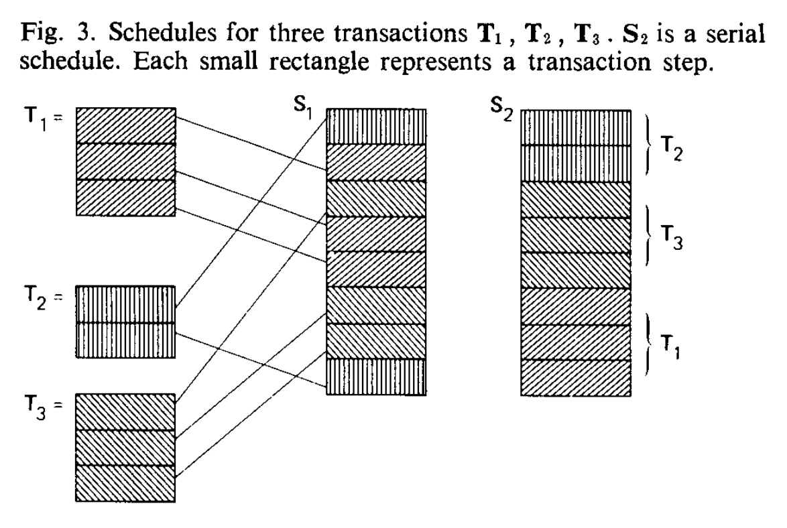
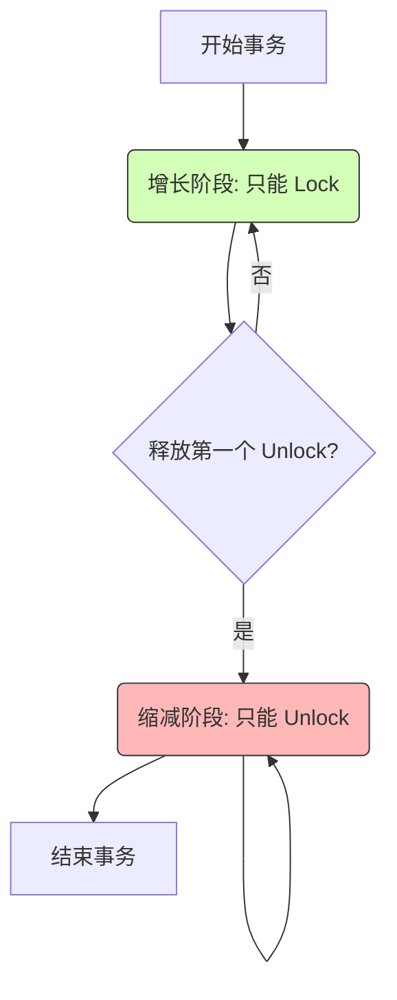
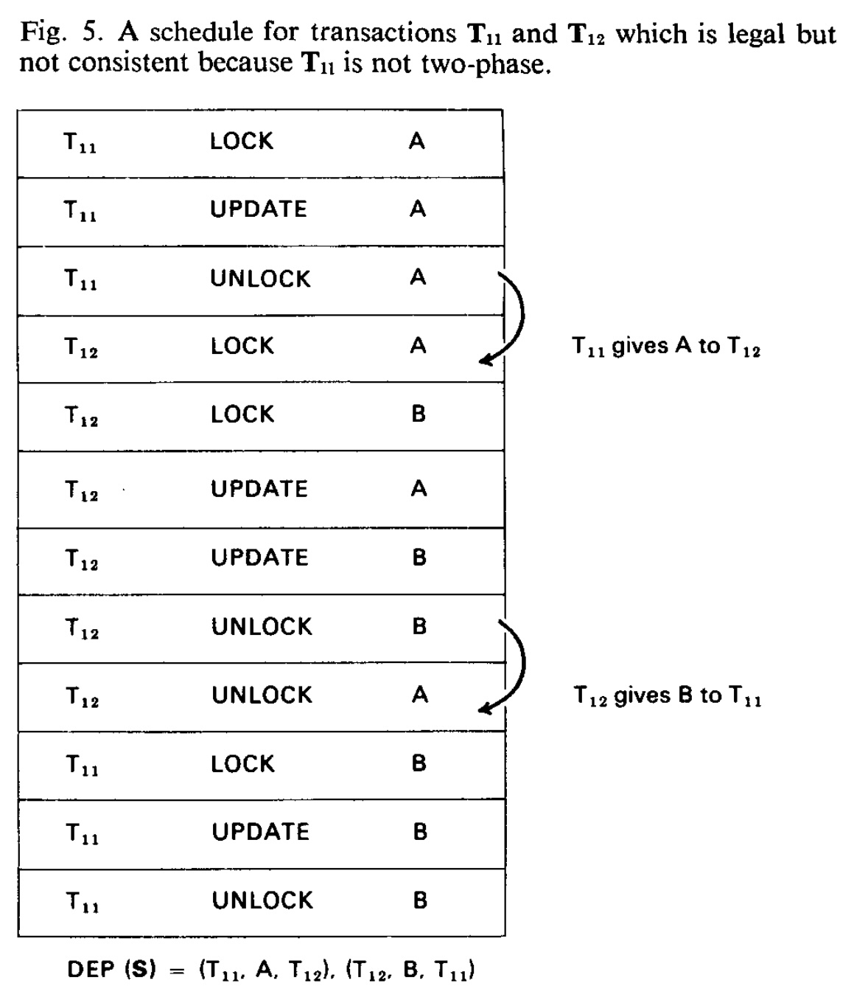
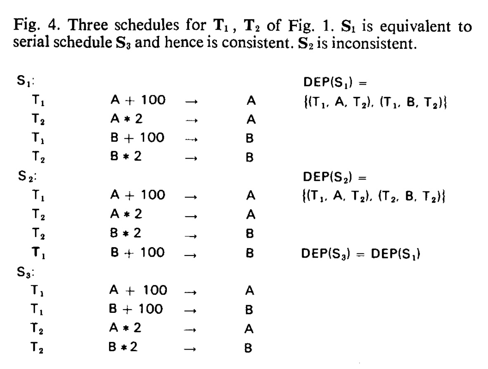
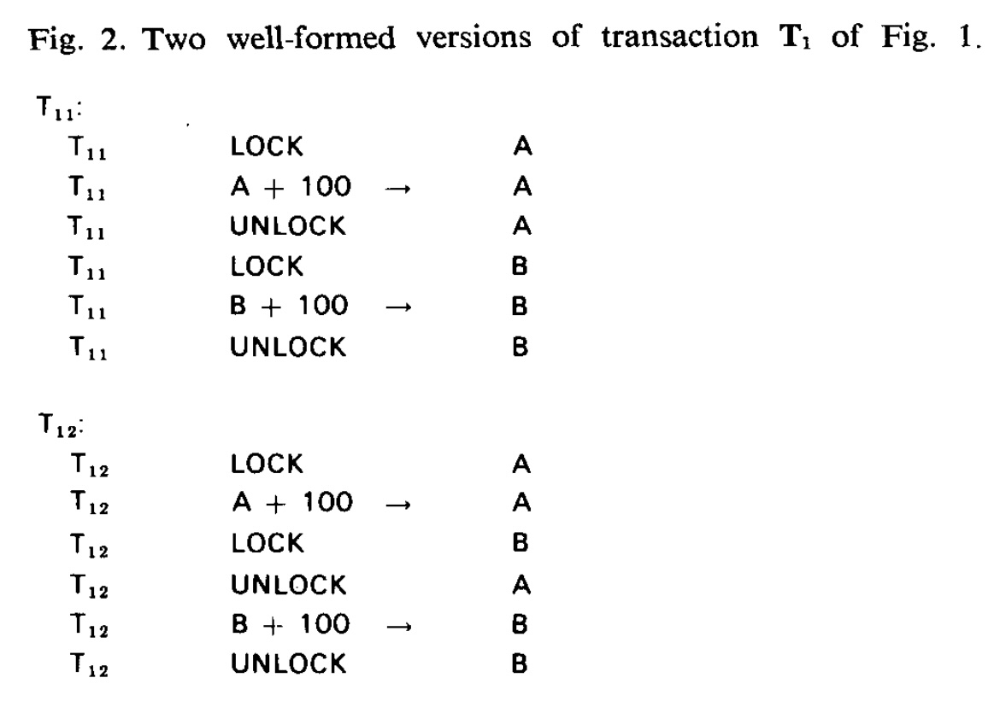
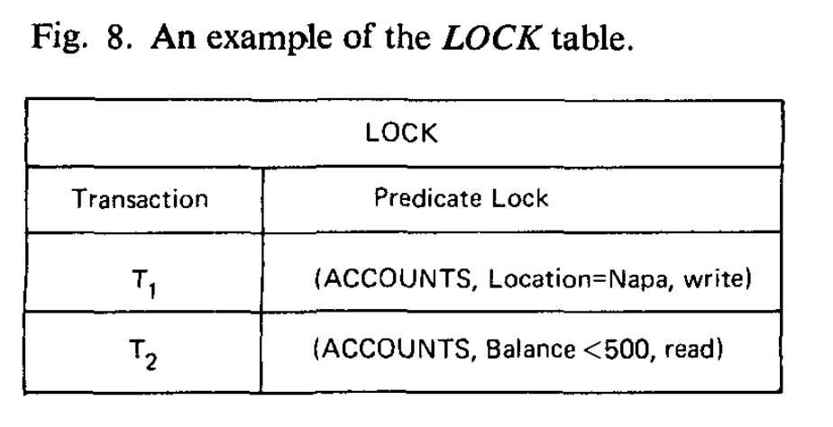

## AI论文解读 | The Notions of Consistency and Predicate Locks in a Database System
        
### 作者        
digoal        
        
### 日期        
2025-10-30        
        
### 标签        
PostgreSQL , PolarDB , DuckDB , AI , 论文解读        
        
----        
        
## 背景  
      
https://dl.acm.org/doi/pdf/10.1145/360363.360369        
  
提示:          
```          
读懂《The Notions of Consistency and Predicate Locks in a Database System》这篇论文需要提前掌握哪些基础知识, 请使用中文通熟易懂的讲解这些基础知识, 可以引用论文中的图、表或使用Markdown支持的图形(text,mermaid等)增加解释性. 
  
使用中文通熟易懂的解读《The Notions of Consistency and Predicate Locks in a Database System》这篇论文, 其中的关键内容请着重讲解, 可以引用论文中的图、表或使用Markdown支持的图形(text,mermaid等)增加解释性. 
  
提取《The Notions of Consistency and Predicate Locks in a Database System》这篇论文中的重要术语, 使用中文对这些术语进行通熟易懂的讲解, 可以引用论文中的图、表或使用Markdown支持的图形(text,mermaid等)增加解释性. 
```     
  
## 1 前置知识 
  
要读懂这篇开创性的论文《The Notions of Consistency and Predicate Locks in a Database System》，你需要对数据库理论有几个核心的基础概念。这篇论文（发表于1976年）为现代数据库系统中的“事务处理”和“并发控制”奠定了基石。

简而言之，这篇论文主要在解决一个核心问题：**如何允许多个用户同时操作一个数据库，同时保证每个人看到的数据都是正确、不混乱的？**

以下是你需要提前掌握的基础知识，我会用尽可能通俗的语言，并引用论文中的图表来解释。

-----

### 1\. 事务 (Transaction)

**这是最基础的概念。**

  * **通俗理解：** 事务就是一系列数据库操作（比如读、写、更新）的“打包”。这个“包”要么**全部完成**，要么**全部不做**（回滚），不能只做一半。
  * **论文中的例子：** 论文中提到一个银行转账的例子 。从A账户转100块到B账户，这个事务包含两个动作：
    1.  A账户 减 100
    2.  B账户 加 100
        在第1步完成而第2步未完成时，系统总金额会暂时“少”100块，这就处于一个“不一致”的状态 。事务的目的就是保证用户不会看到这个中间状态。
  * **论文中的定义：** 论文将事务定义为“一致性的单元” (units of consistency) 。它假设每个事务如果单独执行，都能将数据库从一个**一致的状态**（所有数据都满足预设规则）转换到另一个**一致的状态** 。

### 2\. 一致性 (Consistency)

**这是事务要达成的“目标”。**

  * **通俗理解：** “一致性”指的是数据库中的数据始终满足所有预定义的业务规则。
  * **论文中的例子：** 论文在引言中举了几个例子 ：
      * “A” 等于 “B” 
      * “C” 是 “D” 中空闲单元格的计数 
      * （在图7的银行例子中）“所有Napa地区账户的余额总和” 必须等于 “ASSETS表中Napa地区的总资产” 。    
  * **你需要知道的：** 并发操作（多用户同时读写）是“一致性”的最大威胁。

### 3\. 并发 (Concurrency) 与 调度 (Schedule)

**这是问题的“根源”和“表现形式”。**

  * **并发 (Concurrency)：** 指的是数据库系统在同一时间段内，通过交叉执行（interleaving）来自多个事务的动作，来处理这些事务 。这样做是为了提高系统性能和效率 。
  * **调度 (Schedule)：** 指的是系统交叉执行这些事务动作的**具体顺序** 。

**论文中的图3 ** 非常好地展示了这一点：    

  * $T_1, T_2, T_3$ 是三个独立的事务。
  * $S_2$ 是一个**串行调度 (Serial Schedule)**：它先把 $T_2$ 完整跑完，再跑 $T_3$ ，最后跑 $T_1$ 。这种方式最安全，绝对不会出错，但效率很低（就像银行只有一个窗口，所有人排队）。
  * $S_1$ 是一个**非串行调度 (Nonserial Schedule)**：它把 $T_1, T_2, T_3$ 的动作打碎并交错执行 。这种方式效率高，但非常危险，可能会导致数据混乱。

> **图3  解释：** 左侧是三个事务 $T_1, T_2, T_3$ 。右侧的 $S_1$ 是一个并发（交错）调度， $S_2$ 是一个串行（顺序）调度。

### 4\. 可串行化 (Serializability) (论文称 "Consistent Schedule")

**这是并发控制的“黄金标准”。**

  * **通俗理解：** 我们想要 $S_1$ （并发）的**高效率**，又想要 $S_2$ （串行）的**安全性**。怎么办？
  * **解决方案：** 找出一个“好的”并发调度（ $S_1$ ），它的执行结果必须和**某一个**串行调度（ 如 $S_2$ ）的执行结果**完全一样**。如果做到了，这个并发调度就是“可串行化的”。
  * **论文中的定义：** 论文称这种“好的”调度为 **“一致的调度” (Consistent Schedule)** 。它定义为：一个调度，如果它“等价于” (equivalent) 某个串行调度，那它就是一致的 。
  * **如何判断“等价”？** 论文引入了 **“依赖关系” (Dependency Relation)** 。简单说，如果 $T_1$ 写入了数据A，然后 $T_2$ 读取或写入了数据A，那么在任何“等价”的调度中， $T_1$ 都必须在 $T_2$ 之前。只要这个先后依赖关系不出现“循环”（ 比如 $T_1$ 依赖 $T_2$ ， $T_2$ 又依赖 $T_1$ ），这个调度就是一致的（可串行化的） 。

### 5\. 锁 (Locking)

**这是实现“可串行化”的“主要手段”。**

  * **通俗理解：** 就像上厕所要锁门。当一个事务要修改数据A时，它必须先“锁”住A 。在它“解锁”A之前，其他任何事务都不能修改A（如果只是读取，有时可以共享）。
  * **论文中的动作：** 引入了 `lock` 和 `unlock` 动作 。

-----

### 6\. 两阶段锁定 (Two-Phase Locking, 2PL)

**这是本文的第一个“核心贡献”。**

论文证明了一个非常重要的结论：**我们如何“正确地”使用锁来保证调度一定是“一致的”（可串行化的）？**

答案就是 **“两阶段锁定” (2PL)** 。

  * **规则：** 一个事务的执行过程必须分为两个阶段：
    1.  **增长阶段 (Growing Phase):** 事务**可以**获取锁 (`lock`)，但**不能**释放任何锁 。
    2.  **缩减阶段 (Shrinking Phase):** 一旦事务释放了**第一个**锁 (`unlock`)，它就进入缩减阶段 。在此阶段，事务**只能**释放锁，**绝对不能**再获取任何新的锁 。

我用一个图来帮你理解：



  * **论文中的关键定理：** 如果所有事务都遵守“两阶段锁定”和“良构”(well-formed，即操作数据前必须先锁住它 )，那么**任何**合法的调度都是**一致的**（即 可串行化）。
  * **反面教材 (Figure 5)：** 论文使用 **图5 ** 展示了如果不遵守2PL会发生什么。    
      * $T_{11}$ 这个事务**不是**两阶段的 ，因为它 `Unlock A` 之后，又去 `Lock B` 。  
      * 这导致了一个“合法但不一致”的调度： $T\_{11}$ 给了 $T\_{12}$ 数据A，而 $T\_{12}$ 却给了 $T\_{11}$ 数据B 。这形成了一个“依赖环”，在任何串行调度中都不可能发生，因此数据错了。      

### 7\. 谓词逻辑 (Predicate Logic) 与 幻读 (Phantom)

**这是本文的第二个“核心贡献”，也是最难的部分。**

  * **问题背景：** 传统的锁是锁“物理”实体（比如某一行、某一页）。但这在数据库中不够用。

  * **幻读 (Phantom) 问题：** 这是论文要解决的关键问题 。

  * **论文中的例子 (Figure 7)：**     

    1.  事务 $T_1$ （审计）要计算所有在 'Napa' 地区的账户余额总和。
    2.  $T_1$ 首先锁住了所有**已存在**的 'Napa' 账户（比如 32123 和 5320），并计算总和（1050 + 287 = 1337）。
    3.  这时，事务 $T_2$ **插入 (INSERT)** 了一个**新的** 'Napa' 账户（比如 5321，余额100）。
    4.  $T_2$ 同时更新了 ASSETS 表中 'Napa' 的总资产（1337 + 100 = 1437）。 $T_2$ 提交。
    5.  $T_1$ （审计）继续执行，它去读取 ASSETS 表中的 'Napa' 总资产，读到的是 1437 。
    6.  **灾难发生：** $T_1$ 发现自己算的总和 (1337) 与 ASSETS 表中的总资产 (1437) 不相等 ！它看到了一个不一致的状态。
    7.  $T_2$ 插入的那个新账户，对于 $T_1$ 来说，就像一个“幻影” (Phantom) 。

  * **解决方案：谓词锁 (Predicate Locks)** 

      * **通俗理解：** 与其锁住“已经存在的记录”，不如锁住一个“条件”或“查询标准” 。
      * 在上面的例子中， $T_1$ 不应该只锁住 (32123, 5320) 这两条记录，它应该申请一个 **`Location = 'Napa'`** 的“谓词锁” 。
      * 这个“谓词锁”不仅锁住了所有**当前**满足 `Location = 'Napa'` 的记录，也锁住了所有**未来可能**满足这个条件的“幻影”记录 。
      * 当 $T_2$ 试图插入一条 `Location = 'Napa'` 的新纪录时，它的插入动作与 $T_1$ 的谓词锁**发生冲突 (Conflict)** ， $T_2$ 必须等待 $T_1$ 结束。

  * **你需要知道的：**

      * **谓词 (Predicate)：** 就是一个返回“真”或“假”的逻辑表达式，比如 `Location = 'Napa'`  或 `Balance > 500`。
      * **可满足性 (Satisfiability)：** 实现谓词锁的难点在于，系统必须能判断两个谓词（ 比如 $P_1$ : `Location = 'Napa'` 和 $P_2$ : `Balance > 500` ）是否“可满足” (Satisfiable)，即是否可能存在一条记录同时满足这两个条件 。如果可能，那么这两个锁就冲突了。
      * **简单谓词 (Simple Predicates)：** 论文最后指出，判断任意复杂谓词的冲突是“递归不可解”的（即计算机无法做到），因此建议限制在“简单谓词”（如 `字段 <op> 常量` 的组合）上，这样冲突检测才可行 。

-----

### 总结：你需要掌握的知识点

| 核心概念 | 通俗解释 | 为什么需要它？ |
| :--- | :--- | :--- |
| **事务 (Transaction)** | 一个“要么全做，要么全不做”的操作包 。 | 保证数据库操作的原子性和一致性。 |
| **一致性 (Consistency)** | 数据满足所有业务规则（如 A=B） 。 | 数据库的最终目标，保证数据正确。 |
| **并发 (Concurrency)** | 多个事务“同时”穿插执行 。 | 提高系统效率和响应速度。 |
| **调度 (Schedule)** | 事务动作的具体执行顺序 。 | 并发执行的具体表现形式。 |
| **可串行化 (Serializability)** | 一个并发调度的执行结果，与“某个”串行顺序执行的结果相同 。 | 并发控制的“黄金标准”，兼顾效率与安全。 |
| **锁 (Locking)** | 一种同步机制，（如 `lock`, `unlock`） 。 | 实现可串行化的主要技术手段。 |
| **两阶段锁定 (2PL)** | 事务分为“只加锁”和“只解锁”两个阶段 。 | 论文的**核心贡献1**：一种保证可串行化的**锁协议**。 |
| **幻读 (Phantom)** | 一个事务两次读取，中间“凭空”多出/少了几条记录 。 | 传统“行锁”无法解决的并发问题。 |
| **谓词锁 (Predicate Lock)** | 锁住一个“查询条件”（如 `Location='Napa'`） 。 | 论文的**核心贡献2**：解决“幻读”问题的**锁机制**。 |

掌握了这些概念，你就能理解这篇论文试图解决的问题、提出的解决方案以及它们为什么重要了。

希望这份解释对你有帮助！你希望我深入讲解其中某一个概念，比如“两阶段锁定”和“谓词锁”的区别吗？
  
## 2 解读论文 
  
这是一篇在数据库领域具有里程碑意义的论文。它在1976年首次系统性地定义了现代数据库（乃至区块链等）中至关重要的几个核心概念：**事务 (Transaction)**、**一致性 (Consistency)** 和 **并发控制 (Concurrency Control)**。

简单来说，这篇论文解决了两个核心问题：

1.  **问题一：** 当很多人（事务）同时读写数据库时，如何防止数据错乱，保证每个事务都感觉自己是“独自”在操作数据库？
      * **答案：** 论文证明了**两阶段锁定 (Two-Phase Locking, 2PL)** 协议是保证数据一致性（可串行化）的充分条件 。
2.  **问题二：** 传统的“锁”只能锁住“已存在的记录”，但如果一个事务正在汇总数据，另一个事务“插入”了一条新记录，怎么办？
      * **答案：** 论文提出了**谓词锁 (Predicate Locks)**  的概念，通过锁住一个“查询条件”（谓词）来解决这种“幻读” (Phantom) 问题 。

下面，我将为你详细解读这篇论文的精华内容。

-----

### 🔑 关键贡献一：一致性 (Consistency) 与 两阶段锁定 (2PL)

这篇论文首先要解决的是“并发”带来的“一致性”问题。

#### 1\. 什么是“一致性”和“事务”？

  * **一致性 (Consistency)：** 指数据库中的数据在任何时刻都必须满足预先设定的所有规则 。例如，论文中提到：
      * “A” 必须等于 “B” 。
      * 银行应用中，所有账户的存款总和必须恒定（在转账时）。
  * **事务 (Transaction)：** 是“一致性的单元” 。论文假设，**单个**事务在执行时，会把数据库从一个一致的状态带到另一个一致的状态 。
      * 比如“转账”事务，它包含“A账户减钱”和“B账户加钱”。单独执行时，总额不变，保持了一致性。
      * 但如果在“A减钱”和“B加钱”的**中间**，数据库处于一个“钱变少了”的**暂时不一致**状态 。

#### 2\. “并发”带来的问题

当多个事务**交错执行 (interleaving)** 时，就可能出大问题。

  * **调度 (Schedule)：** 论文将事务动作的这种交错执行顺序称为“调度” 。
  * **串行调度 (Serial Schedule)：** 事务一个接一个排队执行（ 如 **图3** 中的 $S_2$ ）。这种方式绝对安全（一致），但效率极低 。
  * **非串行调度 (Nonserial Schedule)：** 事务的动作穿插执行（ 如 **图3** 中的 $S_1$ ）。效率高，但有风险 。

  

> **图3 释义：** $S_2$ 是串行调度（ $T_2 \rightarrow T_3 \rightarrow T_1$ ）， $S_1$ 是并发调度（动作被打散交错）。

#### 3\. 如何保证并发的“正确性”？

论文提出了“一致的调度” (Consistent Schedule) ——在今天的数据库理论中，我们称之为 **“可串行化” (Serializability)**。

  * **定义：** 一个并发调度（ 如 $S_1$ ），如果其执行结果与**某一个**串行调度（ 如 $S_2$ ）的执行结果**完全等价**，那么这个并发调度就是“一致的” 。
  * **判断依据：** 论文引入了“依赖关系” (Dependency Relation) 。如果 $T_1$ 写了A，然后 $T_2$ 读了A，那么 $T_2$ 就依赖 $T_1$ 。如果调度中出现了“依赖环”（ 如 $T_1 \rightarrow T_2$ 且 $T_2 \rightarrow T_1$ ），那这个调度就是**不一致的** 。
  * **图4** 中的 $S_2$ 就是一个不一致的调度： $T_1$ 给了 $T_2$ 数据A， $T_2$ 却给了 $T_1$ 数据B 。这在任何串行调度中都不可能发生。    

#### 4\. 解决方案：两阶段锁定 (Two-Phase Locking, 2PL)

论文证明了，要保证调度“一致”（可串行化），事务必须遵守一个简单的规则：**两阶段锁定 (2PL)** 。

**2PL规则** ：

1.  **增长阶段 (Growing Phase)：** 事务**可以**获取锁 (`lock`)，但**不能**释放任何锁 。
2.  **缩减阶段 (Shrinking Phase)：** 一旦事务释放了**第一个**锁 (`unlock`)，它就进入缩减阶段。在此阶段，事务**只能**释放锁，**绝对不能**再获取任何新的锁 。

我们可以用一个简单的状态图来理解：


**为什么这很重要？**

论文使用 **图2** 和 **图5** 举了一个反例：

  * 在 **图2** 中 ，事务 $T_{11}$ **不是**两阶段的，因为它 `UNLOCK A` 之后，又去 `LOCK B` 。    
  * 在 **图5** 中 ，当这个非2PL的 $T_{11}$ 与另一个事务 $T_{12}$ 并发执行时，产生了一个**合法但“不一致”的调度** 。    
  * 这个调度的依赖关系是： $T_{11} \rightarrow T_{12}$ （在A上）并且 $T_{12} \rightarrow T_{11}$ （在B上）。这是一个“依赖环”，导致了数据不一致。

**核心结论 (定理)：**

> 如果一个事务集合中的**所有**事务都是**良构的**（Well-formed，即操作数据前必须先锁住它 ）并且**都是两阶段的**，那么**任何**合法的调度都是**一致的**（即 可串行化）。

这个定理是现代数据库并发控制的基石。

-----

### 🔑 关键贡献二：谓词锁 (Predicate Locks) 与 幻读 (Phantom)

论文的第二部分解决了2PL协议本身的一个棘手问题。

#### 1\. “幻读” (Phantom) 问题

传统的锁是锁在“实体” (Entity) 上的，比如某一行记录 。但这在数据库查询中是不够的，因为数据库是“按值”访问的，而不是按“物理地址” 。

论文用 **图7** 的银行数据库（ACCOUNTS 和 ASSETS）举例，生动地描述了 **“幻影” (Phantom) 问题** ：    

1.  **事务 $T_1$** (审计) 开始执行，它的任务是检查 'Napa' 地区所有账户的余额 (Balance) 总和，是否等于 ASSETS 表中 'Napa' 的总资产 (Total) 。
2.  $T_1$ 首先查询 ACCOUNTS 表，锁住所有 `Location = 'Napa'` 的**已有**记录（如 32123 和 5320），并计算总和（1050 + 287 = 1337）。
3.  此时，**事务 $T_2$** (储户) **插入 (INSERT)** 了一条**新的** 'Napa' 账户记录 `(Napa, 5321, 100)`。
4.  因为这条记录在 $T_1$ 开始时还**不存在**， $T_1$ **无法**提前锁住它。这条新记录就像一个“幻影” 。
5.  $T_2$ 接着更新了 ASSETS 表中 'Napa' 的 Total 值为 $1337 + 100 = 1437$ 。 $T_2$ 提交。
6.  $T_1$ 继续执行，它去读取 ASSETS 表，读到 'Napa' 的 Total 是 1437 。
7.  **一致性被破坏！** $T_1$ 发现自己算出的总和 (1337) 与它读到的总资产 (1437) **不相等** 。

#### 2\. 解决方案：谓词锁 (Predicate Locks)

为了解决“幻影”问题，论文提出了一种全新的锁机制：**谓词锁 (Predicate Locks)** 。

  * **核心思想：** 不再锁“物理存在的记录”，而是锁住一个“逻辑条件”（即**谓词**）。
  * **如何工作：**
      * 在上面的例子中， $T_1$ 不应该去锁 (32123, 5320) 这两条记录。
      * $T_1$ 应该向系统申请一个谓词锁：`LOCK(ACCOUNTS, "Location = 'Napa'", read)` 。
      * 这个锁会“锁住”所有**满足该谓词的元组集合**，无论它们现在是否存在 。
  * **解决幻读：**
      * 当 $T_2$ 试图**插入**新记录 `(Napa, 5321, 100)` 时，系统会检查这个新元组是否满足其他事务持有的谓词锁。
      * 系统发现，新元组的 `Location` 是 'Napa'，这满足了 $T_1$ 的谓词 `"Location = 'Napa'"`。
      * 因此， $T_2$ 的插入操作与 $T_1$ 的谓词锁**发生冲突 (Conflict)** 。 $T_2$ 必须**等待**，直到 $T_1$ 释放该锁 。

#### 3\. 谓词锁的实现

如何判断两个谓词锁是否冲突？

  * `P1 = "Location = 'Napa'"`
  * `P2 = "Balance > 500"`

这两个谓词锁冲突吗？是的，因为可能存在一个元组（如 `(Napa, ..., 501)`）同时满足这两个条件。

论文指出，如果谓词（逻辑公式）任意复杂，判断它们是否“可满足” (Satisfiable) 是一个 **“递归不可解”** 的难题 。

为了让这个机制在工程上可行，论文提出：

  * **限制谓词的复杂度：** 只允许使用 **“简单谓词” (Simple Predicates)** 。
  * “简单谓词”指的是 `(字段名) (操作符) (常量)` 这样的原子谓词的布尔组合 。例如：`((Location = 'Napa') OR (Location = 'Santa Rosa')) AND (Balance < 200)` 。
  * 对于这种“简单谓词”，系统**可以**通过算法（如转换为析取范式 DNF）来有效地判断两个谓词的交集（ $P_1 \land P_2$ ）是否可能为真，从而判断它们是否冲突 。

-----

### 论文总结与深远影响

《The Notions of Consistency and Predicate Locks in a Database System》是一篇奠基之作。

1.  它首次在形式上定义了“一致性调度”（可串行化），并给出了实现它的**充分条件**：**两阶段锁定 (2PL)**。这成为了后续所有并发控制算法的黄金标准和参照物。
2.  它敏锐地指出了“物理锁”的局限性，发现了“幻读”问题，并提出了**谓词锁**这一创新概念，从根本上解决了“按值访问”的并发冲突问题 。

今天我们学习数据库事务的 **ACID** 特性（原子性、一致性、隔离性、持久性），其中“隔离性” (Isolation) 的最高级别——“可串行化隔离” (Serializable Isolation)——的理论基础，很大程度上就源于这篇论文所定义的“两阶段锁定”和“谓词锁”。
  
## 3 术语 
  
这篇论文《The Notions of Consistency and Predicate Locks in a Database System》是数据库并发控制领域的奠基之作。它系统性地定义了事务处理的许多核心概念。

以下是这篇论文中关键术语的提取和通俗讲解：

-----

### 1\. 一致性 (Consistency)

  * **通俗讲解：**
    一致性指的是数据库中的数据必须始终满足一组预先定义好的规则（称为“一致性约束”）。
  * **论文中的例子：**
      * “A” 等于 “B” 。
      * “C” 是 “D” 中空闲单元格的计数 。
      * 在 **图7**  的银行数据库中，一个隐含的约束是：“所有Napa地区账户(ACCOUNTS)的余额(Balance)总和”必须等于“Napa地区的总资产(ASSETS)的Total值” 。    
  * **为什么重要：**
    数据库的最终目的是保证数据“正确”。一致性就是“正确”的代名词。

### 2\. 事务 (Transaction)

  * **通俗讲解：**
    事务是“一致性的单元” 。它是一个操作序列（“动作”的集合），这个序列要么**全部执行**，要么**全部不执行**。
  * **论文中的例子：**
    论文提到一个转账的例子：A账户扣款，B账户存款 。在这两个动作之间，系统会暂时处于“不一致”的状态（总金额少了）。事务的作用就是把这些动作“打包”，保证其他用户不会看到这个不一致的中间状态。
  * **核心假设：**
    论文假设，每一个事务如果**单独**执行，都能将数据库从一个一致的状态转变为另一个一致的状态（即“事务保持一致性”）。

### 3\. 调度 (Schedule)

  * **通俗讲解：**
    当多个事务同时（并发）运行时，数据库系统实际执行这些事务中所有“动作” (Actions) 的**具体交错顺序**，就称为“调度” 。
  * **论文中的图示 (图3 )：**     
      * **串行调度 (Serial Schedule):** 像 $S_2$ 那样，事务一个接一个排队执行（ 先 $T_2$ ，再 $T_3$ ，最后 $T_1$ ），没有任何交错 。串行调度永远是“一致的” 。
      * **非串行调度 (Nonserial Schedule):** 像 $S_1$ 那样，为了提高效率， $T_1, T_2, T_3$ 的动作被“打碎”并交错执行 。

### 4\. 一致的调度 (Consistent Schedule)

  * **通俗讲解：**
    这就是现代数据库理论中的 **“可串行化” (Serializable)**。
    一个并发（非串行）的调度，如果其执行的最终结果和效果，与**某一个**串行调度的结果**完全等价** (equivalent)，那么这个调度就是“一致的” 。
  * **论文中的图示 (图4 )：**    
      * $S_1$ 是一个并发调度，但论文指出它等价于串行调度 $S_3$ ，因此 $S_1$ 是**一致的** 。
      * $S_2$ 也是一个并发调度，但它的执行结果（ $T_1$ 给了 $T_2$ 数据A， $T_2$ 却给了 $T_1$ 数据B ） 无法通过任何串行顺序（要么 $T_1$ 在 $T_2$ 前，要么 $T_2$ 在 $T_1$ 前）实现，因此 $S_2$ 是**不一致的** 。

### 5\. 良构的事务 (Well-formed Transaction)

  * **通俗讲解：**
    论文对事务提出的一个基本要求：事务在对任何数据（实体）进行读、写等操作之前，**必须**先持有该数据的锁 。并且，事务在结束时必须释放它持有的所有锁 。
  * **为什么重要：**
    这是实现并发控制的前提。如果你“先斩后奏”（先操作再加锁），锁就失去意义了。论文证明，要保证一致性，事务必须是良构的 。

### 6\. 两阶段 (Two-Phase)

  * **通俗讲解：**
    这是本文提出的**核心锁协议**，即著名的“两阶段锁定”(2PL)。它规定了事务**如何**获取和释放锁，以确保调度是“一致的”（可串行化）。

  * **规则定义 ：**

    1.  **增长阶段 (Growing Phase):** 在这个阶段，事务**可以**请求（`lock`）新的锁 。
    2.  **缩减阶段 (Shrinking Phase):** 这个阶段从事务**第一次**释放（`unlock`）某个锁开始 。一旦进入此阶段，事务**只能**释放锁，**绝对不能**再请求任何新的锁 。

  * **图示 (Mermaid):**

    ```mermaid
    graph TD
        A[开始事务] --> B(增长阶段: 只能 Lock);
        B --> C{释放第一个 Unlock?};
        C -- 否 --> B;
        C -- 是 --> D(缩减阶段: 只能 Unlock);
        D --> D;
        D --> E[结束事务];
    ```

  * **论文中的图示 (图2 )：**    

      * $T_{12}$ 是**两阶段**的：它先 `LOCK A`，再 `LOCK B`，然后才开始 `UNLOCK` 。
      * $T_{11}$ **不是两阶段**的：它 `LOCK A`、`UNLOCK A`，然后又去 `LOCK B`。它在“缩减阶段”（释放A）后又进入了“增长阶段”（请求B）。

  * **核心定理：**
    论文证明：如果所有事务都是“良构的”且“两阶段的”，那么**任何**合法的调度（即遵守锁规则的调度 ）都是**一致的**（可串行化）。

-----

### 7\. 幻影 (Phantoms)

  * **通俗讲解：**
    这是论文发现的一个严重问题，即“幻读”。当事务 $T_1$ 锁住了一批“已存在”的数据时，事务 $T_2$ 却**插入 (Insert)** 或**删除 (Delete)** 了一条**新的**数据，而这条新数据“刚好”也符合 $T_1$ 的查询条件。这条“凭空”出现或消失的数据，对 $T_1$ 来说就像一个“幻影” 。
  * **论文中的例子 (基于 图7 )：**    
    1.  事务 $T_1$ （审计）要统计所有 `Location = 'Napa'` 的账户总额 。它锁住了所有**已存在**的 'Napa' 账户（如图7中的2条）。
    2.  此时，事务 $T_2$ **插入**了一条**新的** 'Napa' 账户 。
    3.  $T_1$ 之前无法锁住这个“幻影” ，导致 $T_1$ 读到的数据是“不一致”的（它统计的总额对不上 $T_2$ 更新后的总资产）。

### 8\. 谓词锁 (Predicate Locks)

  * **通俗讲解：**
    这是论文提出的、用于解决“幻影”问题的创新方案 。
    谓词锁的核心思想是：**不锁“已有的数据”，而是锁“一个查询条件（谓词）”** 。
  * **论文中的例子 (基于 图8 )：**    
      * 事务 $T_1$ 申请一个谓词锁：`(ACCOUNTS, Location = 'Napa', write)` 。
      * 这个锁不仅锁住了**当前**所有 'Napa' 的账户，也锁住了所有**未来可能**被插入或修改为 'Napa' 的“幻影”账户 。
      * 当 $T_2$ 试图插入一条 `Location = 'Napa'` 的新纪录时，系统会发现这个新数据满足了 $T_1$ 的谓词锁，两者发生“冲突” (Conflict) ， $T_2$ 必须等待 $T_1$ 结束。

### 9\. 简单谓词 (Simple Predicate)

  * **通俗讲解：**
    论文指出，判断任意复杂的两个谓词（条件）是否冲突（即是否有交集）是一个“递归不可解”的难题（即计算机无法在有限时间内保证算出结果）。
  * **解决方案：**
    为了让“谓词锁”在工程上可行，论文建议将锁的条件限制在“简单谓词”的范围内 。
  * **定义：**
    “简单谓词”是由 `(字段名) (操作符) (常量)` 这种原子形式（如 `Location = 'Napa'` 或 `Balance < 200`）通过 AND, OR, NOT 组合而成的表达式 。
  * **好处：**
    对于简单谓词，系统**可以**通过算法（如转为析取范式 DNF）来有效判断它们是否冲突 。
  
## 参考        
         
https://dl.acm.org/doi/pdf/10.1145/360363.360369    
        
<b> 以上内容基于DeepSeek、Qwen、Gemini及诸多AI生成, 轻微人工调整, 感谢杭州深度求索人工智能、阿里云、Google等公司. </b>        
        
<b> AI 生成的内容请自行辨别正确性, 当然也多了些许踩坑的乐趣, 毕竟冒险是每个男人的天性.  </b>        
    
#### [期望 PostgreSQL|开源PolarDB 增加什么功能?](https://github.com/digoal/blog/issues/76 "269ac3d1c492e938c0191101c7238216")
  
  
#### [PolarDB 开源数据库](https://openpolardb.com/home "57258f76c37864c6e6d23383d05714ea")
  
  
#### [PolarDB 学习图谱](https://www.aliyun.com/database/openpolardb/activity "8642f60e04ed0c814bf9cb9677976bd4")
  
  
#### [PostgreSQL 解决方案集合](../201706/20170601_02.md "40cff096e9ed7122c512b35d8561d9c8")
  
  
#### [德哥 / digoal's Github - 公益是一辈子的事.](https://github.com/digoal/blog/blob/master/README.md "22709685feb7cab07d30f30387f0a9ae")
  
  
#### [About 德哥](https://github.com/digoal/blog/blob/master/me/readme.md "a37735981e7704886ffd590565582dd0")
  
  

  
