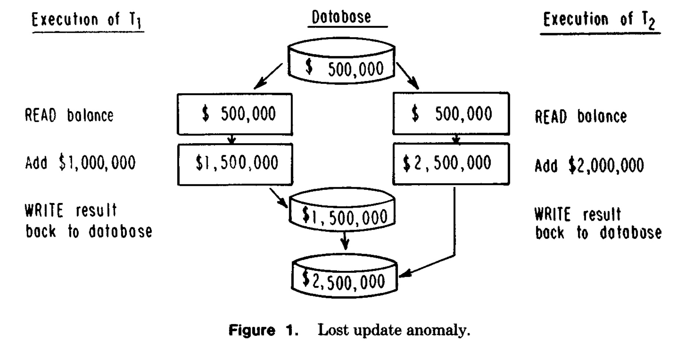
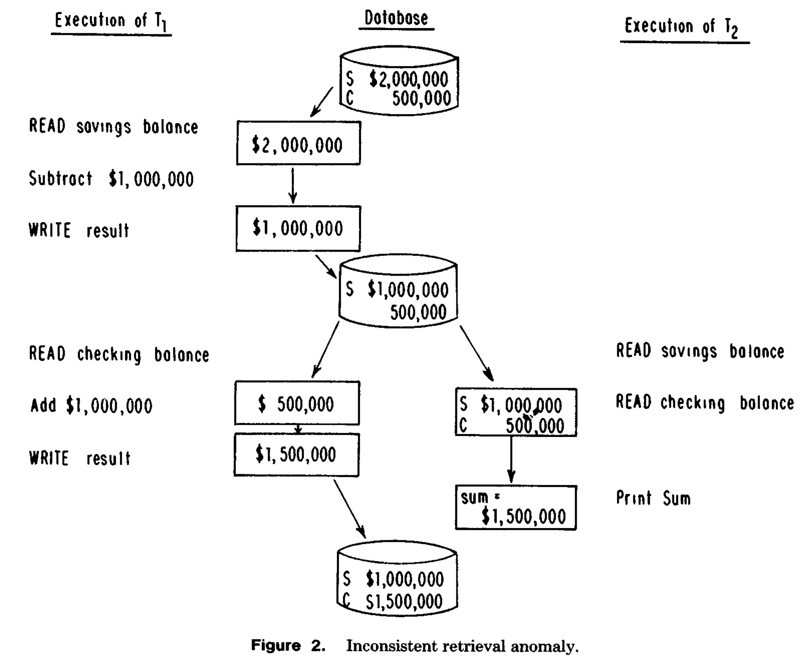
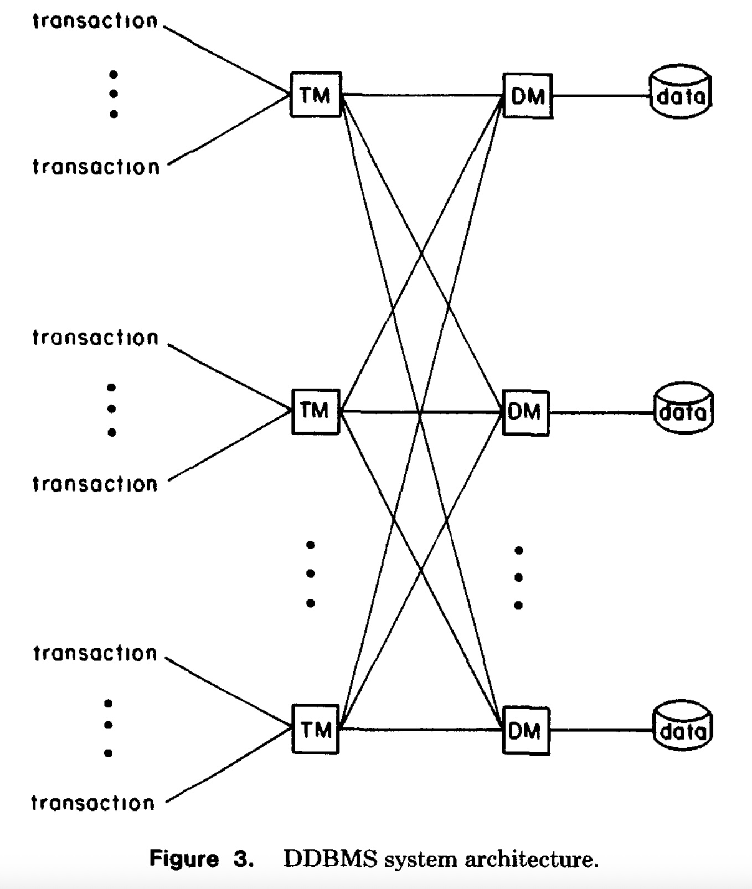
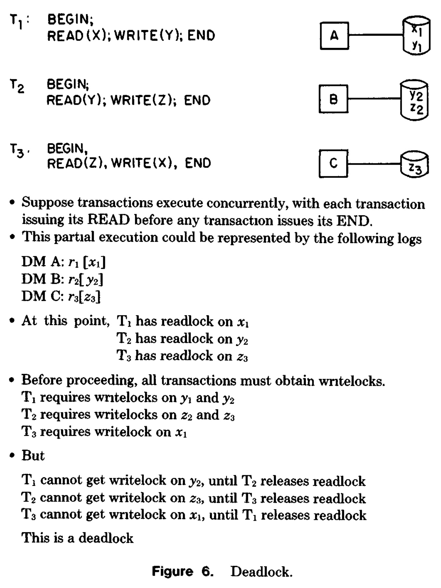
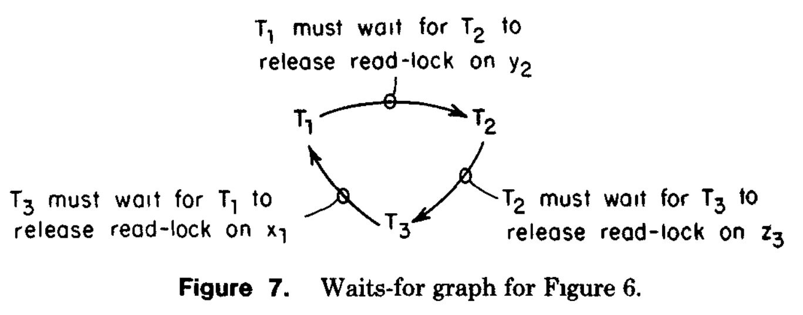
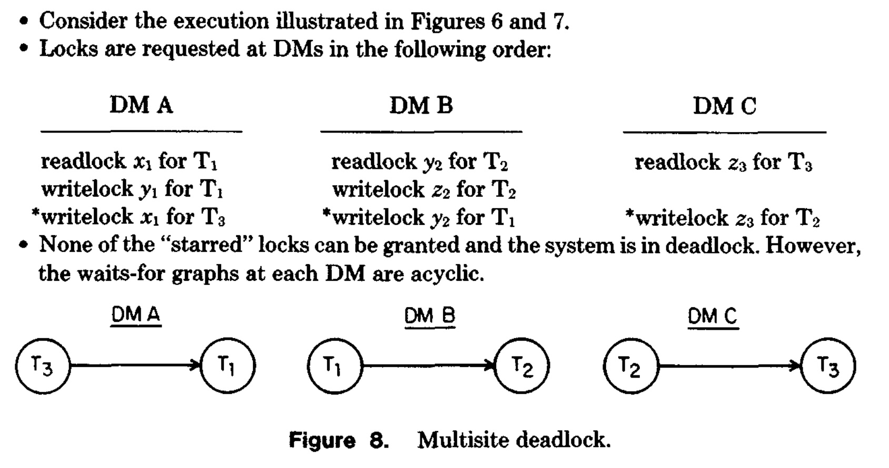
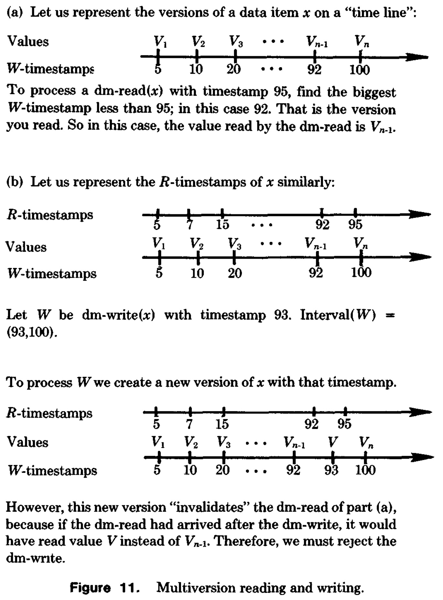
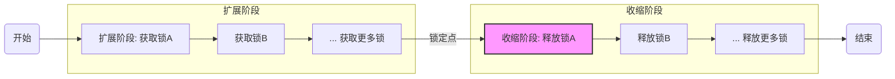

## AI论文解读 | Concurrency Control in Distributed Database Systems
        
### 作者        
digoal        
        
### 日期        
2025-10-30        
        
### 标签        
PostgreSQL , PolarDB , DuckDB , AI , 论文解读        
        
----        
        
## 背景  
      
https://dl.acm.org/doi/pdf/10.1145/356842.356846        
  
提示:          
```          
读懂《Concurrency Control in Distributed Database Systems》这篇论文需要提前掌握哪些基础知识, 请使用中文通熟易懂的讲解这些基础知识, 可以引用论文中的图、表或使用Markdown支持的图形(text,mermaid等)增加解释性. 
  
使用中文通熟易懂的解读《Concurrency Control in Distributed Database Systems》这篇论文, 其中的关键内容请着重讲解, 可以引用论文中的图、表或使用Markdown支持的图形(text,mermaid等)增加解释性. 
  
提取《Concurrency Control in Distributed Database Systems》这篇论文中的重要术语, 使用中文对这些术语进行通熟易懂的讲解, 可以引用论文中的图、表或使用Markdown支持的图形(text,mermaid等)增加解释性. 
```     
  
## 1 前置知识 
  
理解这篇经典的1981年论文《分布式数据库系统中的并发控制》(Concurrency Control in Distributed Database Systems)  确实需要一些前置知识。这是一篇里程碑式的“综述”论文，它系统地梳理和分解了这个问题 。

简单来说，这篇论文的核心是**解决一个核心矛盾**：我们希望数据库能被很多人“同时”访问（并发，Concurrency）以提高效率，但又要保证在数据被“分布式”（Distributed）存储在不同电脑上时，每个人的操作不会互相干扰，导致数据出错。

为了读懂这篇论文，您最好提前掌握以下5个基础知识点：

### 1\. 核心概念：事务 (Transaction)

**这是理解一切的起点。**

  * **是什么？** 事务是数据库操作的一个“工作单元”，它要么完全执行，要么根本不执行 。论文中将其视为一个完整且正确的计算单元 。
  * **为什么重要？** 论文中讨论的所有操作都是以事务为单位的，例如从A账户转账到B账户，这涉及“读取A”、“修改A”、“读取B”、“修改B”等一系列操作，这些操作必须被捆绑成一个事务。
  * **关键特性 (ACID):** 虽然论文没有明确用 "ACID" 这个词，但它完全是围绕这个概念展开的：
      * **A - 原子性 (Atomicity):** “要么全做，要么全不做”。
      * **I - 隔离性 (Isolation):** 并发执行的事务互相不干扰，给用户一种“好像只有我一个人在用数据库”的错觉 。这篇论文的**核心就是如何实现隔离\_性\_**。
      * **C - 一致性 (Consistency):** 事务执行前后，数据库都处于“正确”的状态 。
      * **D - 持久性 (Durability):** 一旦事务提交，其结果就是永久的。

### 2\. 问题的根源：并发异常 (Concurrency Anomalies)

**这是并发控制“为什么”存在的理由。**

如果系统没有并发控制，多个事务在同一时间交叉执行，就会导致数据混乱。论文在引言部分就举了两个经典的例子：

  * **丢失更新 (Lost Updates)**

      * **通俗解释：** 两个人同时给同一个账户存款。
      * **过程（如图1所示）：**     
        1.  事务T1读取余额（ $500,000 ）。
        2.  事务T2也读取余额（ $500,000 ）。
        3.  T1计算新余额（ $1,500,000 ） 并写入数据库 。
        4.  T2计算新余额（ $2,500,000 ） 并写入数据库 。
      * **结果：** T1的存款操作（ 增加了 $1,000,000 ）被T2的操作覆盖了，T1的更新“丢失”了 。

  * **不一致读取 (Inconsistent Retrievals)**

      * **通俗解释：** 一个人在统计两个账户的总余额，而另一个人正在这两个账户之间转账。
      * **过程（如图2所示）：**    
        1.  事务T1（转账）从S账户读取余额（ $2,000,000 ）。
        2.  T1减去 $1,000,000，并将新余额（ $1,000,000 ）写回S账户 。
        3.  **此时**，事务T2（统计）介入，读取S账户余额（ $1,000,000 ） 和C账户余额（ $500,000 ）。
        4.  T2打印总和（ $1,500,000 ）。
        5.  T1继续执行，给C账户增加 $1,000,000，并写回（ $1,500,000 ）。
      * **结果：** 数据库最终是正确的（ 总额 $2,500,000 ），但T2读取到了一个“中间状态”，导致它统计的总额少了 $1,000,000 。

### 3\. “正确”的标尺：可串行化 (Serializability)

**这是并发控制“要做到什么”的标准。**

  * **串行 (Serial) 执行：** 事务一个接一个地执行，完全不交叉 。这肯定是正确的，但效率太低。
  * **可串行化 (Serializable) 执行：** 这是并发控制的**黄金标准**。它指一种并发（交叉）执行，其最终结果和对数据库造成的影响，与*某一种*串行执行的效果**完全相同** 。
  * **冲突 (Conflict)：** 论文的理论基础是将问题分解为“冲突” 。当两个事务访问同一数据，且至少一个是写操作时，就发生了冲突 。
      * 读-写 (rw) 冲突 
      * 写-写 (ww) 冲突 
  * **核心思想：** 并发控制的目标就是管理这些`rw`和`ww`冲突的顺序，确保它们（在逻辑上）等同于一个串行顺序 。

### 4\. “分布式”的挑战：系统模型与原子提交

**这解释了为什么“分布式”会使问题变得更难。**

  * **系统模型 (DDBMS Architecture):** 论文假设系统由多个“站点”（计算机）组成 。每个站点上有：

      * **TM (Transaction Manager / 事务管理器):** 负责监督用户事务 。
      * **DM (Data Manager / 数据管理器):** 负责管理存储在本地的数据 。
      * **网络 (Network):** 负责TM和DM之间的通信 。

    你可以用这个文本图来理解（类似论文中的图3 ）：    

    ```text
    用户  --> [ TM ] -- (网络) --> [ DM ] --> (数据)
                        |
                        +-- (网络) --> [ DM ] --> (数据)
    ```

  * **核心挑战：** 在这种分布式模型下，一个事务可能需要更新多个站点的数据 。如果事务执行到一半，某个站点崩溃了，或者网络断了，怎么办？如何保证事务的“原子性”（要么全做，要么全不做）？

  * **解决方案：两阶段提交 (Two-Phase Commit, 2PC)**
    这篇论文*假定*系统使用2PC来解决原子性问题。2PC是实现分布式原子性的标准方法 。

      * **阶段1：准备/投票阶段 (Prewrite)** 
          * TM（协调者）向所有参与的DM（参与者）发送“准备提交”请求（`prewrite`命令 ）。
          * DM收到后，把要修改的数据写入安全存储（日志），并回复TM“准备好了”或“失败”。
      * **阶段2：提交/执行阶段 (Commit)** 
          * **如果**TM收到所有DM的“准备好了”，它就向所有人发送“正式提交”（`dm-write`命令 ）的指令。
          * **如果**有任何一个DM回复“失败”或超时，TM就向所有人发送“中止”（Abort）指令。

### 5\. 基础同步知识：锁与死锁 (Locking & Deadlock)

**这提供了解决问题的一种基础工具（论文中称为2PL）。**

  * **锁 (Locking)：** 这是操作系统和数据库中最常见的同步工具。在对数据进行读写前，必须先“获取”该数据的锁 。
      * **读锁 (Readlock):** 共享的。多个事务可以同时持有读锁。
      * **写锁 (Writelock):** 独占的。一个事务持有写锁时，其他事务不能持有任何锁（读或写）。
  * **死锁 (Deadlock)：** 这是使用锁必然带来的副作用 。
      * **通俗解释：** T1锁住了A，然后想去锁B；同时T2锁住了B，然后想去锁A。双方互相等待对方释放资源，导致永久卡住。
      * **论文中的例子 (图6和图7) ：** 论文展示了一个更复杂的循环等待：      
          * T1（持有x1的读锁）等待T2（释放y2的读锁）以便获取y2的写锁 。
          * T2（持有y2的读锁）等待T3（释放z3的读锁）以便获取z3的写锁 。
          * T3（持有z3的读锁）等待T1（释放x1的读锁）以便获取x1的写锁 。
          * 这就形成了一个 T1 -\> T2 -\> T3 -\> T1 的等待环，即死锁。

-----

### 总结

如果您掌握了以上5个基础知识点：

1.  **事务 (Transaction)** 的概念（尤其是ACID）。
2.  为什么需要并发控制（即**并发异常**）。
3.  “正确”的标准是什么（即**可串行化**）。
4.  “分布式”带来的挑战和解决方案（即**2PC**）。
5.  一种基本的同步手段及其副作用（即**锁与死锁**）。

那么，这篇论文的主体内容对您来说就会非常清晰：它是在这个基础上，系统性地**介绍和比较**了两种实现“可串行化”隔离性的主流技术：

1.  **基于两阶段锁 (Two-Phase Locking, 2PL) 的技术** 
2.  **基于时间戳排序 (Timestamp Ordering, T/O) 的技术** 

论文的伟大之处在于它提供了一个统一的框架 ，将所有已知的并发控制算法（当时有20多种 ）分解为这两种基本技术的变体和组合 。

希望这个分解能帮助您入门！您想让我详细解释一下两阶段锁 (2PL) 还是时间戳排序 (T/O) 吗？
  
## 2 解读论文 
  
这是一篇石破天惊的论文。在1981年，分布式数据库领域（DDBMS）还处于“极度动荡”的混沌状态 ，有20多种并发控制算法，每一种都声称自己是最好的，但它们术语不同、假设各异，让人难以理解和比较 。

这篇由 Philip A. Bernstein 和 Nathan Goodman 撰写的论文 ，就如同在混沌中投下了一道光。它没有再提出第21种算法，而是提供了一个**统一的分析框架**，石破天惊地指出：**所有**已知的实用算法，其实都是由**两种基本技术**（两阶段锁和时间戳排序）的变体“拼装”而成的 。

本文将为您通俗地解读这篇论文的精华内容。

### 论文的核心思想：化繁为简的“分解”大法

这篇论文的“心脏”  是一个绝妙的分解：

> **并发控制问题 = 读-写同步 (rw) + 写-写同步 (ww)** 

这是什么意思呢？

  * **并发冲突**只在两种情况下发生：
    1.  一个事务想**读**，另一个事务想**写**同一个数据（`rw` 冲突） 。
    2.  两个事务都想**写**同一个数据（`ww` 冲突） 。
  * **读-读 (rr)** 不会冲突，所以我们不用管。

论文指出，任何一个完整的并发控制“方法”（Method），都必须包含解决这两个子问题的“技术”（Technique） 。

而解决这两个子问题的技术，万变不离其宗，只有两大流派：

1.  **两阶段锁 (Two-Phase Locking, 2PL)**：我先占住，你再用。
2.  **时间戳排序 (Timestamp Ordering, T/O)**：咱俩排个队，按顺序来。

这篇论文的伟大之处在于，它证明了我们可以**自由组合**这两个流派的技术。比如，我们可以用“锁”来解决 `rw` 冲突，用“时间戳”来解决 `ww` 冲突。

接下来，我们详细解读这两大技术流派及其在分布式环境下的挑战。

-----

### 关键技术一：两阶段锁 (2PL)

2PL 的哲学是 **“悲观”** 的：它假设冲突很可能会发生，所以它使用“锁”来*显式地检测和防止*冲突 。

#### 1\. 2PL 的核心规则

一个事务的执行分为两个阶段 ：

1.  **扩展阶段 (Growing Phase)**：只能**获取**锁，不能释放锁 。
2.  **收缩阶段 (Shrinking Phase)**：一旦**释放了第一个锁**，就进入此阶段，只能**释放**锁，不能再获取新锁 。

这个严格的规则保证了事务的执行是**可串行化**的 。事务的“锁定点”（Locked Point，即获取到所有锁的那个时刻）决定了它在串行顺序中的位置 。

#### 2\. 分布式环境下的 2PL (关键变体)

在分布式系统中，数据和锁管理器可以放在不同地方，于是产生了不同的 2PL 实现方式 ：

  * **基本 (分布式) 2PL**：锁管理器和数据放在一起 。
      * `Read(X)`：事务只需要在它*实际读取*的那个副本（ 比如 $x_1$ ）上加“读锁” 。
      * `Write(X)`：事务必须在 X 的**所有副本**（ $x_1, x_2, ... x_m$ ）上都加上“写锁” 。
  * **主副本 2PL (Primary Copy 2PL)**：
      * 为每个数据 X 指定一个“主副本”（ 比如 $x_1$ ） 。
      * **所有**对 X 的访问（无论是读还是写），都必须先去 $x_1$ 上获取对应的锁 。
  * **中心化 2PL (Centralized 2PL)**：
      * 整个系统只有一个“中央锁管理器” 。
      * 在访问*任何*数据之前，都必须先向这个中央站点申请锁 。

#### 3\. 2PL 的阿喀琉斯之踵：死锁 (Deadlock)

2PL 的最大麻烦在于，它会产生**死锁** 。当事务互相等待对方持有的锁时，就会形成一个等待环路。

论文中的 **图6** 和 **图7** 完美地展示了这一点：      

  * T1 需要 Y 上的写锁，但 T2 持有 Y 上的读锁（T1 等待 T2） 。
  * T2 需要 Z 上的写锁，但 T3 持有 Z 上的读锁（T2 等待 T3） 。
  * T3 需要 X 上的写锁，但 T1 持有 X 上的读锁（T3 等待 T1） 。

这就形成了一个**死锁环**：`T1 -> T2 -> T3 -> T1`。

在分布式系统中，检测死锁更麻烦。如 **图8** 所示，每个站点（DM A, B, C）的**局部**等待图（Local waits-for graph）可能都没有环，但**全局**（Global）等待图却存在一个环 。    

**解决方案**有两种：

1.  **死锁预防 (Prevention)**：*不让*环形成。通过给事务分配优先级或时间戳，当冲突发生时，系统根据规则（如 "Wait-Die" 或 "Wound-Wait"）决定是“等待”还是“中止” (Restart) 。
2.  **死锁检测 (Detection)**：*允许*环形成，但要能*发现并打破*它。系统通过合并所有站点的局部等待图来构造一个全局等待图 ，然后定期搜索这个图中的环 。一旦发现环，就选择一个“受害者”（Victim）事务并将其“中止” 。

-----

### 关键技术二：时间戳排序 (T/O)

T/O 的哲学是 **“乐观”** 的：它假设冲突不常发生。它不使用锁，而是*预先*给每个事务分配一个全局唯一的时间戳 (Timestamp, `ts`) 。

#### 1\. T/O 的核心规则

T/O 强制所有**冲突操作**都必须按照**时间戳顺序**执行 。

  * **基本 T/O**：
      * 每个数据 `x` 都会记录它被访问过的最大“读时间戳” `R-ts(x)` 和“写时间戳” `W-ts(x)` 。
      * **规则 1 (读)**：当事务 T (时间戳为 `ts(T)`) 想 `Read(x)`：
          * 如果 `ts(T) < W-ts(x)`，意味着 `x` 已经被一个“更晚”（更新）的事务重写了。T 的读取“来得太晚”，**必须中止 (Reject)** 。
      * **规则 2 (写)**：当事务 T (时间戳为 `ts(T)`) 想 `Write(x)`：
          * 如果 `ts(T) < R-ts(x)`，意味着 `x` 已经被一个“更晚”的事务读取了。T 的写入“来得太晚”，**必须中止 (Reject)** 。

#### 2\. T/O 的关键变体（重大改进）

基本 T/O 频繁的中止操作是不可接受的。因此，论文介绍了几个关键的优化变体：

  * **托马斯写规则 (Thomas' Write Rule, TWR)**：
      * 这是针对 `ww` 冲突的优化 。
      * 当事务 T 试图 `Write(x)`，如果发现 `ts(T) < W-ts(x)`，我们**不需要中止 T**，而是可以**直接忽略 (Ignore)** 这次写入 。
      * **为什么？** 因为一个更新的（时间戳更大）的值已经写入了，T 的写入已经“过时”了，忽略它不影响最终结果 。
  * **多版本 T/O (Multiversion T/O, 或 MVCC)**：
      * 这是针对 `rw` 冲突的革命性改进 。
      * **核心思想**：不要覆盖旧数据，而是为数据 `x` 保留多个**历史版本**，每个版本都有其写入时的时间戳 。
      * **规则 (读)**：当事务 T (时间戳为 `ts(T)`) 想 `Read(x)`：
          * **永远不会被拒绝！** 
          * 系统会选择时间戳**小于** `ts(T)` 且最接近 `ts(T)` 的那个版本给它 。
      * **图11a** 形象地展示了这一点 ：一个时间戳为 95 的读操作，会读取由时间戳为 92 的事务所写入的 $V_{n-1}$ 版本，而忽略时间戳为 100 的 $V_n$ 版本 。    
  * **保守 T/O (Conservative T/O)**：
      * 这是 T/O 的“悲观”版本，它试图*完全避免*中止 。
      * **规则**：当一个操作（如 `Read(x)`）到达时，调度器会 **“延迟”（Delay）** 它的执行，直到调度器*确信*所有时间戳更早的*冲突操作*（如 `Write(x)`）都已经被处理完毕了 。

-----

### 巅峰之作：48种“混搭”的并发控制方法

这篇论文的高潮在第5章“集成的并发控制方法” 。作者们展示了他们的框架是多么强大。

他们指出，`rw` 同步技术和 `ww` 同步技术可以被视为独立的组件，可以“混搭”（Mix and Match） 。

#### 1\. “纯” 2PL 方法 (12 种)

`rw` 和 `ww` 都用 2PL。例如，`rw` 用“基本2PL”，`ww` 用“主副本2PL” 。

#### 2\. “纯” T/O 方法 (12 种)

`rw` 和 `ww` 都用 T/O。例如，`rw` 用“保守T/O”，`ww` 用“托马斯写规则(TWR)” ——这正是著名的 **SDD-1** 数据库系统的并发控制算法 。

#### 3\. “混合” 2PL 和 T/O 方法 (24 种)

这是最具开创性的部分 。论文证明了 2PL 和 T/O 可以协同工作 。

  * **2PL (用于 rw) + T/O (用于 ww)** 
      * **例子（方法2：基本2PL + TWR）** ：
          * 事务在“读”数据时，需要获取“读锁” 。
          * 事务在“写”数据时，需要获取“写锁”（只为了和“读锁”冲突） 。
          * **关键点**：事务的“写锁”之间**互不冲突** ！`ww` 冲突完全交给 T/O 和 TWR 来处理 。
          * **效果**：这允许两个事务**并发地写入**同一个数据项而*不会互相阻塞* 。这是纯 2PL 方法永远无法实现的 。
  * **T/O (用于 rw) + 2PL (用于 ww)** 
      * **例子（方法17：多版本T/O + 基本2PL）** ：
          * `rw` 冲突：通过多版本 T/O 解决，读操作永远不会被拒绝 。
          * `ww` 冲突：通过 2PL 解决，事务在执行前必须获取所有“写锁” 。
          * **效果**：`rw` 冲突永远不会导致事务中止 。事务中止的唯一原因是为了解决 `ww` 冲突引发的“死锁” 。

### 结论与意义

Bernstein 和 Goodman 的这篇论文，以一种前所未有的方式统一了分布式并发控制领域。

1.  **提供了统一框架**：它提供了一个通用的系统模型和术语，使所有算法都可以在同一个维度上被比较 。
2.  **指明了核心问题**：它将并发控制分解为 `rw` 和 `ww` 两个子问题，极大地简化了分析 。
3.  **揭示了内在联系**：它证明了所有（48种！）实用算法都可以由 2PL 和 T/O 两种基本技术组合而成 。

这篇论文发表后，研究的重点不再是发明全新的、怪异的算法，而是转向了论文最后指出的方向：**性能** 。既然我们已经知道了所有可能的算法（这个“菜单”），那么接下来的问题就是：

> “在不同的系统和应用场景下，这48种方法中，哪一种才是最好的？” 

这篇论文标志着并发控制领域从“混沌”走向了“有序”，是所有数据库从业者和研究者的必读经典。
  
## 3 术语 
  
这篇论文  是分布式数据库领域的奠基之作，它系统性地梳理和统一了“并发控制” (Concurrency Control) 这个复杂的问题 。

以下是这篇论文中至关重要的术语，以及它们的通俗讲解。

-----

### 1\. 核心问题与目标

#### 并发控制 (Concurrency Control)

  * **通俗讲解：** 就像一个十字路口的“交通警察” 。当很多用户（事务）想在同一时间访问和修改数据库时，并发控制负责协调他们的行为 ，防止他们“撞车”（即数据出错）。
  * **目标：** 它的目标是让每个用户感觉“好像只有我一个人在用这个系统” ，即使系统实际上是多用户并发访问的 。

#### 事务 (Transaction)

  * **通俗讲解：** 指用户执行的一个“工作单元”或一个“完整的计算” 。
  * **关键假设：** 论文假设每个事务本身都是“正确”的 。如果让它单独在一个一致的数据库上运行，它执行完毕后会留下一个正确且一致的数据库 。
  * **例子：** 银行转账（从A账户读余额、扣款、向B账户读余额、加款）是一个经典的事务。

#### 并发异常 (Concurrency Anomalies)

  * **通俗讲解：** 如果没有“交通警察”（并发控制），多个事务同时运行时可能导致的“车祸”现场 。
  * **论文中的两个经典例子：**
    1.  **丢失更新 (Lost Updates)** 
          * **场景：** 两个人（T1 和 T2）同时向同一个账户（初始 $500,000）存款 。
          * **过程（如图1所示 ）：**    
            1.  T1 读取余额 $500,000 。
            2.  T2 也读取余额 $500,000 。
            3.  T1 加上 $1,000,000，写入新余额 $1,500,000 。
            4.  T2 加上 $2,000,000，写入新余额 $2,500,000 。
          * **结果：** T1 的存款操作（增加了 $1,000,000）被 T2 的写入“覆盖”了，T1的更新丢失了 。
    2.  **不一致读取 (Inconsistent Retrievals)** 
          * **场景：** T1 正在从A账户向B账户转账 $1,000,000 ，同时 T2 正在统计A、B两个账户的总余额 。
          * **过程（如图2所示 ）：**    
            1.  T1 从A账户扣款 $1,000,000（A 余额从 $2M 变为 $1M）。
            2.  **此时**，T2 介入，读取了A的余额（ $1M ）和B的余额（ $500k ）。
            3.  T2 打印总和： $1,500,000 。
            4.  T1 继续执行，给B账户加上 $1,000,000（B 余额变为 $1.5M）。
          * **结果：** 数据库最终是正确的（总额 $2.5M），但 T2 读取到了一个“中间状态”，导致它统计的总额少了 $1,000,000 。

#### 可串行化 (Serializability)

  * **通俗讲解：** 并发控制的“黄金标准”，即“正确性”的定义 。
  * **串行执行 (Serial Execution)：** 指事务一个接一个地执行，完全不交叉 。串行执行总是被认为是正确的 。
  * **可串行化执行：** 指一种并发（交叉）执行，其最终结果和对数据库的影响，与*某一种*串行执行的效果**完全相同** 。
  * **目标：** 并发控制要做的就是确保所有的并发执行都是可串行化的 。

-----

### 2\. 论文的核心框架

#### 冲突 (Conflict)

  * **通俗讲解：** 决定了操作顺序是否“要紧” 。
  * **定义：** 当两个（来自不同事务的）操作访问*同一个*数据项，并且*至少一个*是“写”操作时，它们就冲突了 。
  * **类型：**
      * **读-写 (rw) 冲突** 
      * **写-写 (ww) 冲突** 
  * **意义：** 可串行化理论（如论文中的定理1）的核心就是管理这些冲突的顺序 。

#### 论文的核心分解 (The Decomposition)

  * **通俗讲解：** 这是本文的“庖丁解牛”大法。论文的“心脏”是把并发控制问题分解为两个主要的子问题 ：
    1.  **读-写同步 (rw synchronization)** 
    2.  **写-写同步 (ww synchronization)** 
  * **技术 (Technique) vs. 方法 (Method)：**
      * **同步技术 (Synchronization Technique):** 解决 *rw 或 ww* 子问题的算法（如 2PL）。
      * **并发控制方法 (Concurrency Control Method):** 解决*整个*并发控制问题的完整算法（通常是 rw 和 ww 技术的组合）。

-----

### 3\. 流派一：两阶段锁 (2PL)

这是一种“悲观”技术，它通过*显式地检测和防止*冲突来同步事务 。

#### 两阶段锁 (Two-Phase Locking, 2PL)

  * **通俗讲解：** 事务在访问数据前必须先“加锁”，并且必须遵守“先借后还”的规则。
  * **核心规则：**
    1.  **访问规则：** 读数据前必须持有“读锁” (readlock) ，写数据前必须持有“写锁” (writelock) 。
    2.  **两阶段规则：** 事务一旦*释放了任何一个锁*，它就不能再*获取任何新的锁* 。
  * **两个阶段：**
      * **扩展阶段 (Growing phase):** 事务只获取锁 。
      * **收缩阶段 (Shrinking phase):** 事务只释放锁 。
  * **锁定点 (Locked Point):** 事务持有其所需全部锁的那个时刻 。事务的锁定点顺序决定了它们的串行化顺序 。




#### 死锁 (Deadlock)

  * **通俗讲解：** 2PL 机制的必然副作用 。当 T1 等待 T2 释放的锁，而 T2 同时在等待 T1 释放的锁时，就发生了“你等我、我等你”的僵局。
  * **等待图 (Waits-for graph):** 一种用于描述死锁的工具 。
      * 节点 (Node) = 事务 。
      * 边 (Edge) `T_i -> T_j` = T\_i 正在等待 T\_j 。
      * 如果图中出现“环” (Cycle)，就代表发生了死锁 。
  * **分布式死锁：** 在 DDBMS 中，单个站点的局部等待图可能没有环，但全局组合起来却有环（如论文**图8**所示）。     
  * **解决方案：**
      * **死锁预防 (Prevention):** "谨慎"方案，在可能导致循环等待时，主动“中止” (abort) 某个事务 。
      * **死锁检测 (Detection):** "放任"方案，允许死锁发生，然后系统定期构造等待图、搜索环，一旦发现环，就选择一个“受害者” (victim) 事务并中止它 。

-----

### 4\. 流派二：时间戳排序 (T/O)

这是一种“乐观”技术，它*预先*选择一个串行化顺序（即时间戳顺序），并强迫事务按这个顺序执行 。

#### 时间戳排序 (Timestamp Ordering, T/O)

  * **通俗讲解：** 事务在开始时由 TM（事务管理器）分配一个全局唯一的“号码”（即时间戳, `ts`）。所有DM（数据管理器）都必须按照“号码”顺序来处理冲突的操作 。
  * **基本 T/O (Basic T/O)：**
      * DM 为每个数据 `x` 维护它被访问过的最大 `R-ts(x)` (读时间戳) 和 `W-ts(x)` (写时间戳) 。
      * **读规则：** 如果一个读操作的 `ts` 小于 `W-ts(x)`，说明它“来晚了”（数据已被更新），该读操作被**拒绝 (Reject)** 并中止 。
      * **写规则：** 如果一个写操作的 `ts` 小于 `R-ts(x)`，说明它“来晚了”（数据已被更新的事务读取），该写操作也被**拒绝 (Reject)** 。

#### T/O 的重要变体

  * **托马斯写规则 (Thomas' Write Rule, TWR):**
      * **通俗讲解：** 针对 `ww` 冲突的优化 。
      * **规则：** 如果一个“写”操作 `W` “来晚了” (`ts(W) < W-ts(x)`)，我们*不必拒绝*它，可以直接**忽略 (ignore)** 这次写入 。因为一个更新的值已经存在了，这个过时的写入可以被安全地跳过 。
  * **多版本 T/O (Multiversion T/O)：**
      * **通俗讲解：** 针对 `rw` 冲突的革命性优化，也是现代数据库（如PostgreSQL）中 MVCC 的理论基础 。
      * **规则：** 系统不覆盖旧数据，而是为数据项 `x` 维护多个历史版本（(W-ts, value) 对） 。
      * **读操作：** 永远**不会被拒绝** 。它总是读取那个时间戳小于它自己 `ts` 的最新版本 。
      * **图示 (基于图11a )：**    
        ```text
        数据 x 的版本: [ (ts=10, V1), (ts=20, V2), (ts=92, V3), (ts=100, V4) ]

        一个事务 (ts=95) 来读取 x：
        它会跳过 ts=100 (太新)，选择 ts=92 (小于95的最大时间戳)。
        因此，它读取 V3 。
        ```
  * **保守 T/O (Conservative T/O)：**
      * **通俗讲解：** T/O 中的“悲观”派，旨在通过“等待”来*消除*中止 。
      * **规则：** 调度器会**延迟 (delay)** 一个操作，直到它确信所有时间戳更早的*冲突操作*都已经到达并处理完毕 。

-----

### 5\. 分布式事务的基石

#### 两阶段提交 (Two-Phase Commit, 2PC)

  * **通俗讲解：** 解决分布式“原子性”问题（要么全做，要么全不做 ）的标准流程。
  * **问题：** 在 DDBMS 中，一个事务 T 可能更新多个站点（DM）的数据 。如果 T 的 TM（事务管理器）在只发出了部分 `dm-write` (写入) 命令后就崩溃了，数据库就会处于不一致状态 。
  * **两个阶段：**
    1.  **阶段一 (投票/预写阶段)：**
          * TM 向所有涉及的 DM 发送 `prewrite` (预写) 命令 。
          * DM 收到后，将要修改的数据写入“安全存储” (secure storage)（但*不*正式更新数据库），并回复 TM “OK” 。
    2.  **阶段二 (提交/执行阶段)：**
          * TM 收集到所有 DM 的 “OK” 后，向所有 DM 发出 `dm-write` (正式写入) 命令 。
          * DM 此时才将安全存储中的值复制到数据库中 。
          * （如果TM在阶段一未收到所有“OK”，则会发送“Abort”中止命令）。
  
## 参考        
         
https://dl.acm.org/doi/pdf/10.1145/356842.356846    
        
<b> 以上内容基于DeepSeek、Qwen、Gemini及诸多AI生成, 轻微人工调整, 感谢杭州深度求索人工智能、阿里云、Google等公司. </b>        
        
<b> AI 生成的内容请自行辨别正确性, 当然也多了些许踩坑的乐趣, 毕竟冒险是每个男人的天性.  </b>        
    
#### [期望 PostgreSQL|开源PolarDB 增加什么功能?](https://github.com/digoal/blog/issues/76 "269ac3d1c492e938c0191101c7238216")
  
  
#### [PolarDB 开源数据库](https://openpolardb.com/home "57258f76c37864c6e6d23383d05714ea")
  
  
#### [PolarDB 学习图谱](https://www.aliyun.com/database/openpolardb/activity "8642f60e04ed0c814bf9cb9677976bd4")
  
  
#### [PostgreSQL 解决方案集合](../201706/20170601_02.md "40cff096e9ed7122c512b35d8561d9c8")
  
  
#### [德哥 / digoal's Github - 公益是一辈子的事.](https://github.com/digoal/blog/blob/master/README.md "22709685feb7cab07d30f30387f0a9ae")
  
  
#### [About 德哥](https://github.com/digoal/blog/blob/master/me/readme.md "a37735981e7704886ffd590565582dd0")
  
  

  
