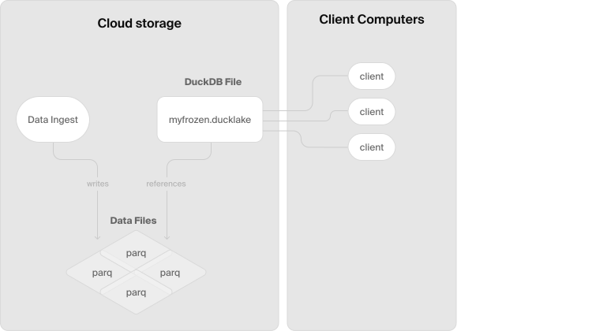
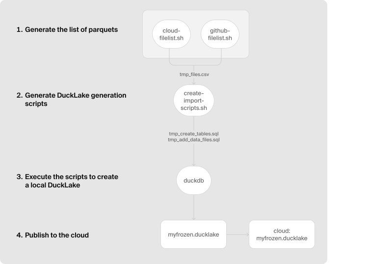
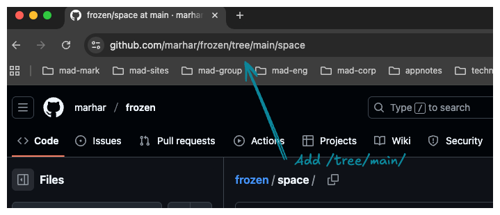

## DuckLake推出真ServerLess(无需Catalog元数据库)玩法: `Frozen DuckLakes`    
                                                                  
### 作者                                                                 
digoal                                                                
                                                               
### 日期                                                              
2025-10-30                                                              
                                                                
### 标签                                                                
DuckLake , Catalog , Serverless , Frozen DuckLakes , 一写多读 , 时间旅行 , parquet , 内置元数据(duckdb datafile)                                                                 
                                                                
----                                                                
                                                                
## 背景     
[DuckLake](https://ducklake.select/)是一款DuckDB的插件, 也是一款基于DuckDB的云服务(整合了云存储和元数据管理), 就看你怎么使用它.     
    
之前有过对应的产品介绍文章.      
- [《DuckLake 更新, 支持Iceberg互换数据及Geometry类型等》](../202509/20250920_04.md)      
- [《用 “DuckDB/DuckLake + ECharts + LLM” 实现一个BI智能数据可视化产品?》](../202506/20250620_02.md)      
- [《再见分布式湖仓一体, 你好DuckLake》](../202505/20250528_02.md)      
    
**DuckLakes** 通常由两个组件组成：**目录数据库 (catalog database)** 和**存储 (storage)**。    
    
显然，为了表示数据，某种形式的存储是必不可少的。    
    
但是，我们能否在不设置目录数据库(元数据库)的情况下托管一个 DuckLake 呢？    
    
可以, 这就是本文的核心: 实际上是把元数据存到了duckdb datafile中, 而这个datafile也放到了对象存储里面. 所以你可以理解为对象存储既包含了parquet数据文件, 也包含了指向数据文件的元数据(duckdb datafile).      
    
我们将展示如何在没有数据库服务器的情况下创建一个只读的**基于云的 DuckLake (cloud-based DuckLake)**。我们称之为 “**Frozen DuckLake**”，因为它只读，并且除了云存储系统之外没有其他活动部件 (no moving parts)。     
    
下面看看这篇文章, **如何构建没有活动部件（no moving parts）的高性能数据湖 (data lakes)。**    
- https://ducklake.select/2025/10/24/frozen-ducklake/    
    
### **多用户、无服务器 (Serverless) 数据访问的 Frozen DuckLakes**    
    
    
    
#### **Frozen DuckLake 概览**    
    
Frozen DuckLakes 有几个优势：    
    
  * 除了存储 **Parquet** 数据文件之外，它们的**成本开销 (cost overhead)** 几乎为零。    
  * Frozen DuckLake 可以用于**面向公众的数据 (public-facing data)**（例如，公共存储桶），因为除了云或 HTTP 文件访问之外，不需要额外的服务。    
  * 它们使数据可以在 **SQL** 数据库中立即可访问，无需特殊配置。    
  * 它们允许数据文件存在于**不同的云环境 (cloud environments)** 中，同时可以从同一个 Frozen DuckLake 中引用。    
    
最棒的是，虽然一个 “Frozen DuckLake” 确实是**时间冻结 (frozen in time)** 的，但仍然可以通过创建新的 Frozen DuckLake 来更新数据。可以通过保留 **DuckDB 数据库文件 (DuckDB database file)** 的修订版本来访问旧版本 —— 或者仅仅通过使用[**时间旅行 (time travel)**](https://ducklake.select/docs/stable/duckdb/usage/time_travel.html)。例如，要回溯一周，您可以使用：    
    
```sql    
FROM table AT (TIMESTAMP => (now() - "1 week"::INTERVAL));    
```    
    
-----    
    
#### **设计 Frozen DuckLakes**    
    
##### **设置和要求**    
    
当我们开始考虑使用 DuckLake 来存储一些**归档数据 (archival data)** 时，我们的设置如下：    
    
  * 数据是**只读 (read-only)** 的，存储在云存储桶 (cloud buckets) 中。    
  * 我们有一个**多读、单写模型 (multi-reader, single-writer model)**，其中一个进程会定期更新归档。    
    
我们希望满足三个要求：    
    
  * 一个外部程序正在创建 Parquet 文件 —— 我们不希望**中断 (disrupt)** 这一工作流程 (workflow)。    
  * 我们不希望为了拥有一个归档而支持、支付或**运营一个云数据库服务器 (cloud database server)**。    
  * 我们不希望阻止一个传统的**多用户 (multi-user) DuckLake** 与我们的只读归档副本并行运行。    
    
##### **设计**    
    
首先，我们的工作流程继续将组织成**存储桶 (buckets)** 的 **Parquet 文件**存储在我们的**云存储系统 (cloud storage system)** 上。这是一个**一次写入系统 (write-once system)** —— Parquet 文件一旦写入，就不会被修改或移动。    
    
其次，我们定期将这些 Parquet 文件的状态**快照 (snapshot)** 到一个 DuckLake 中。使用 `ducklake_add_data_files()` **函数 (function)** 可以让我们快速**摄取 (ingest)** 一个 Parquet 文件中的所有数据。这是一个快速的只读操作，因为 DuckLake 只需要读取 **Parquet 元数据 (Parquet metadata)**。我们在单台计算机上执行此操作，写入到一个本地的 **DuckDB 格式的 DuckLake 文件 (DuckDB-formatted DuckLake file)** 中。所有数据引用都指向云存储桶中的 Parquet 文件。这为我们提供了一个可工作的、驻留在单台机器上的**单用户 DuckLake (single-user DuckLake)**。然后，我们通过将其复制到云存储来 “**发布 (publish)**” 该 DuckLake 文件。一旦发布，任何可以访问云存储的客户端都可以以**只读模式 (read-only mode)** 访问该 DuckLake。    
    
我们将快照和发布步骤称为 “**冻结一个 DuckLake (freezing a DuckLake)**”。在这篇文章的其余部分，我们将展示一个 **GitHub** 上的**实时演示 (live demo)**，然后详细介绍如何使用 **对象存储 (object storage)（AWS S3 或兼容）** 和 **HTTPS** 创建和部署 Frozen DuckLakes。    
    
    
    
-----    
    
#### **实时演示 (Live Demo)**    
    
这里有一个驻留在 **GitHub** 上的小型**太空任务数据库 (database of space missions)**。您可以使用此命令访问该数据库并亲自尝试以下查询。    
    
```    
duckdb ducklake:https://raw.githubusercontent.com/marhar/frozen/main/space.ducklake    
// 我个人理解, space.ducklake 就是元数据库对应的数据文件.      
    
SHOW TABLES;    
    
┌──────────────┐    
│ name         │    
│ varchar      │    
├──────────────┤    
│ astronauts   │    
│ mission_crew │    
│ missions     │    
│ spacecraft   │    
└──────────────┘    
```    
    
我们可以像这样列出代表国家最多的太空任务：    
    
```sql    
SELECT    
  m.name as mission,    
  count(DISTINCT a.nationality) AS nationalities,    
  string_agg(DISTINCT a.nationality, ', ') AS countries_represented    
FROM missions m    
JOIN mission_crew mc ON m.mission_id = mc.mission_id    
JOIN astronauts a ON mc.astronaut_id = a.astronaut_id    
WHERE mc.primary_crew = true    
GROUP BY m.mission_id, m.name    
HAVING count(DISTINCT a.nationality) > 1    
ORDER BY nationalities DESC    
LIMIT 4;    
    
┌─────────────────────────────┬──────────────┬────────────────────────────────────────────────┐    
│ mission                     │ nationalities│ countries_represented                          │    
│ varchar                     │ int64        │ varchar                                        │    
├─────────────────────────────┼──────────────┼────────────────────────────────────────────────┤    
│ International Space Station │ 7            │ Italy, UK, Denmark, USA, France, Japan, Russia │    
│ SpaceX Crew-5               │ 5            │ Denmark, Italy, Germany, Japan, USA            │    
│ SpaceX Crew-7               │ 4            │ Denmark, Italy, USA, France                    │    
│ SpaceX Crew-6               │ 4            │ Denmark, Japan, Italy, France                  │    
└─────────────────────────────┴──────────────┴────────────────────────────────────────────────┘    
```    
    
此查询仅使用**存储 (storage)** 从一个 Frozen DuckLake 中提供服务；您可以在 GitHub **仓库 (repo)** 中查看这些文件。    
    
-----    
    
#### **创建和冻结一个 DuckLake**    
    
创建和冻结一个 DuckLake 需要四个步骤：    
    
1.  收集要包含在 DuckLake 中的**数据文件 (data files)** 列表。    
2.  生成一个 **DuckLake 创建脚本 (creation script)**。该脚本必须负责**表创建 (table creation)** 和**数据填充 (data population)**。    
3.  创建**本地 DuckLake**。    
4.  **发布 (Publish)** DuckLake。    
    
从视觉上看，这个过程如下所示：    
    
    
    
我们将在下面详细介绍这些步骤。完整的脚本可在 [`marhar/duckdb_tools`](https://github.com/marhar/duckdb_tools/tree/main/frozen-ducklake) GitHub **仓库 (repository)** 中找到。    
    
##### **收集数据文件列表**    
    
在一个典型的 Frozen DuckLake 场景中，有另一个程序正在创建将被**冻结 (frozen)** 和**发布 (published)** 的 **Parquet 文件**。它可能是一个**周期性归档系统 (periodic archival system)**、一个正在收集和组织训练数据的 **ML 数据系统 (ML data system)**，甚至是另一个**实时 DuckLake (live DuckLake)**。**数据生成系统 (data generating system)** 的关键要求是：    
    
  * 它们必须生成 Parquet 文件，并将其放置在某个可访问的**存储系统 (storage system)** 中。    
  * 与每个文件相关的**表名 (table name)** 可以从**路径 (path)** 或**文件名 (filename)** 中派生出来。例如，`stations.2025-01.parquet` 可能是 2025 年 1 月的站点信息**转储 (dump)**。（当然，如果您有来自生成系统的适当**元数据 (metadata)**，您也可以使用它。例如，可能存在将文件 `6235b4d2611184.parquet` 与 `stations` 表关联起来的元数据。）    
    
> **多站点 Frozen DuckLakes (Multi-site Frozen DuckLakes)。** 一个 Frozen DuckLake 不限于引用单个**仓库 (repository)** 或**数据存储 (data store)** 中的数据文件。在创建 DuckLake 文件时，可以添加对**多个站点 (multiple sites)** 的文件引用。这可能是集成在**不同环境 (different environments)** 中运行的两个独立系统的有效方法。    
    
如果我们使用的是 **DuckDB** 直接支持的**云存储 (cloud storage)**，例如 **S3** 或 **GCS**，使用 DuckDB 内置的 [**递归文件通配 (recursive file globbing)**](https://duckdb.org/docs/stable/data/multiple_files/overview.html#multi-file-reads-and-globs) 可以使任务变得非常简单：    
    
```sql    
COPY (    
  SELECT file AS full_path    
  FROM glob('s3://mybucket/mypath/**/*.parquet')    
) TO 'tmp_files.csv';    
```    
    
如果我们要构建一个存储在 **GitHub** 上的数据文件列表，我们将不得不使用 **GitHub API** 来查询和遍历 GitHub 仓库，使用 [`github-filelist.sh`](https://github.com/marhar/duckdb_tools/blob/main/frozen-ducklake/bin/github-filelist.sh) 中的类似逻辑：    
    
```bash    
pprocess() {    
  CPATH=https://api.github.com/repos/$REPO/contents/$DPATH    
  curl -s $CPATH > $TMPJ    
  # print Parquet files, then recurse into all subdirs    
  duckdb -noheader -ascii -c "    
    SELECT download_url FROM '$TMPJ' WHERE type='file' AND name LIKE '%.parquet' ORDER BY name;"    
  for DPATH in $(duckdb -noheader -ascii -c "    
    SELECT path FROM '$TMPJ' WHERE type='dir' ORDER BY name;"); do    
    process $REPO $DPATH    
  done    
}    
echo full_path > tmp_files.csv    
process $REPO $DPATH >> tmp_files.csv    
```    
    
这两种方法的完整代码都在上面提到的仓库中，分别为 [`cloud-filelist.sh`](https://github.com/marhar/duckdb_tools/blob/main/frozen-ducklake/bin/cloud-filelist.sh) 和 [`github-filelist.sh`](https://github.com/marhar/duckdb_tools/blob/main/frozen-ducklake/bin/github-filelist.sh) 。如果您需要实现一个**自定义文件列表器 (custom file lister)**，其中之一可能是一个很好的模型。    
    
如果存储位置在 **GitHub** 上（就像我们的演示中一样），我们将运行如下命令。请注意路径中额外的 `"/tree/main/"`：    
    
```    
./github-filelist.sh https://github.com/marhar/frozen/tree/main/space    
```    
    
    
    
在云服务提供商上，我们将运行类似如下的命令。    
    
```    
./cloud-filelist.sh s3://mybucket/myfolder    
```    
    
无论如何，这些程序的输出都是相同的：一个包含单个字段的 **CSV** 文件，即数据文件的**完整路径 (full path)**，它将作为下一步的**输入 (input)**。    
    
```    
full_path    
https://raw.githubusercontent.com/marhar/frozen/main/space/astronauts.p1.parquet    
https://raw.githubusercontent.com/marhar/frozen/main/space/astronauts.p2.parquet    
https://raw.githubusercontent.com/marhar/frozen/main/space/mission_crew.p1.parquet    
...    
```    
    
##### **生成创建脚本**    
    
文件 [`create-import-scripts.sql`](https://github.com/marhar/duckdb_tools/blob/main/frozen-ducklake/bin/create-import-scripts.sql) 包含创建生成**本地 DuckLake** 所需的两个 **SQL 文件 (SQL files)** 的逻辑。    
    
您可以在 `frozen_parms` **表 (table)** 中自定义任何**参数创建逻辑 (parameter creation logic)**（例如更改表名的派生方式）。默认代码将本地 DuckLake 文件命名为 `myfrozen.ducklake`，您可以在发布时更改它。    
    
生成的文件 `tmp_create_tables.sql` 为每个表包含一行，看起来像这样。与每个表关联的第一个 Parquet 文件的 **schema (模式)** 用于指定 **schema (模式)**。    
    
```sql    
CREATE TABLE myfrozen.astronauts AS SELECT * FROM read_parquet('https://raw.githubusercontent.com/marhar/frozen/main/space/astronauts.p1.parquet') WITH NO DATA;    
```    
    
`"WITH NO DATA"` 是一个 **DuckDB 扩展 (DuckDB extension)**；它的作用与 `"LIMIT 0"` 相同，但强调**不会获取或处理任何数据 (no data will be fetched or processed)**。    
    
生成的文件 `tmp_add_data_files.sql` 应该为每个 Parquet 文件包含一行，如下所示，调用 `ducklake_add_data_files`，并带上**附加名称 (attach name)**、**表名 (table name)** 和一个 **DuckDB 可读的文件引用 (duckdb-readable file reference)**。    
    
```sql    
CALL ducklake_add_data_files(    
  'myfrozen',    
  'astronauts',    
  'https://raw.githubusercontent.com/marhar/frozen/main/space/astronauts.p2.parquet'    
);    
```    
    
> 我个人的理解, 这一步是往一个名为`myfrozen`的冻结中添加`表名`和`数据文件`的映射关系.      
    
##### **创建本地 DuckLake**    
    
生成两个 **SQL 文件**后，在 **DuckDB 会话 (DuckDB session)** 中运行这些命令。    
    
```sql    
LOAD ducklake;    
LOAD httpfs;    
ATTACH 'ducklake:myfrozen.ducklake' AS myfrozen (DATA_PATH 'tmp_always_empty');    
.read tmp_create_tables.sql    
.read tmp_add_data_files.sql    
```    
    
会产生一个名为 `myfrozen.ducklake` 的本地 **DuckDB 风格的 DuckLake 文件 (DuckDB flavor DuckLake file)**。    
    
您可以**附加 (attach)** 到这个 DuckLake 并**验证您的数据 (verify your data)** 是否符合您的预期。    
    
请注意，**DATA\_PATH** 将为每个表填充一个空子目录。**DATA\_PATH** 在其他方面应该完全为空，因为我们只使用 `ducklake_add_data_files()` 来填充 Frozen DuckLake。在访问时，不会引用此目录，因此在发布时无需考虑。请注意，在这个示例中我们实际上可以跳过指定**数据路径 (data path)**，但我们想要强调（与**非冻结 DuckLake (non-frozen DuckLake)** 不同）此目录是不需要的。    
    
> **基于云的 Frozen DuckLakes 的 DATA\_PATH。** 将数据路径指定为**云存储桶 (cloud storage bucket)**，例如，(`DATA_PATH 's3://tmp_always_empty'`)，以确保当 DuckDB 附加到 DuckLake 时，会**自动加载 (autoloaded)** 相应的**存储模块 (storage module)**。    
    
##### **幂等文件添加 (Idempotent File Addition)**    
    
请注意，在同一个文件上多次调用 `ducklake_add_data_files()` 将导致数据**重复 (duplicated)**。此函数的未来版本可能会添加一个 **"仅一次 (only-once)" 标志 (flag)**；在此之前，我们可以通过查看 `ducklake_data_file` 表中的 **path 列 (path column)** 来判断文件是否已被添加。    
    
当添加文件 `X.parquet` 时：    
```    
- if X.parquet NOT IN column ducklake_data_path.path:    
  - CALL ducklake_add_data_files(..., X.parquet)    
```    
    
请注意，您必须根据 DuckLake 文档的[**路径页面 (Paths page)**](https://ducklake.select/docs/stable/duckdb/usage/paths)，确保路径**正确解析 (resolved correctly)**。例如，两个不同的字符串 `/foo/bar.parquet` 和 `/foo/./bar.parquet` 指的是**同一个文件 (same file)**。如果所有文件路径都是**相对于同一个基目录 (relative to the same base directory)** 生成的，则这不是一个问题。    
    
##### **发布**    
    
如果您使用的是**云存储 (cloud storage)**，只需将您的本地 DuckLake 文件复制到云存储，例如：    
    
```bash    
aws s3 cp myfrozen.ducklake s3://mybucket/space-missions.ducklake    
```    
    
在我们**基于 GitHub 的示例 (GitHub-based example)** 中，我们只是将 DuckLake 文件添加到了**仓库 (repository)** 中。（请注意，对于**实际部署 (real-world deployments)**，您可能不会在 GitHub 中存储大型数据库。）    
    
请注意，在 **ATTACH** 命令中指定的 **DATA\_PATH** 永远不会填充数据。它不需要复制到云端，并且在 DuckLake 被冻结后可以删除。    
    
##### **访问（现已冻结的）DuckLake**    
    
一旦 DuckLake 文件**发布到云端 (published to the cloud)**，您可以使用任何**标准 DuckLake 方法 (standard DuckLake methods)** 访问它    
    
使用 **ATTACH**，并提供**云引用 (cloud reference)**：    
    
```sql    
ATTACH 'ducklake:https://raw.githubusercontent.com/marhar/frozen/main/space.ducklake' AS space;    
USE space;    
```    
    
使用 DuckLake `ducklake:` **语法 (syntax)**：    
    
```    
duckdb ducklake:https://raw.githubusercontent.com/marhar/frozen/main/space.ducklake    
```    
    
##### **更新**    
    
更新 Frozen DuckLake 是**简单直接 (straightforward)** 的。最简单的方法是使用上述过程从头开始**重新生成和发布 (regenerate and publish)** DuckLake 文件。如果这太慢，并且您能够**跟踪哪些文件是新添加的 (track which files have been newly added)**，您可以通过对新文件调用 `ducklake_add_data_files()` 来更新本地 **DuckDB**，然后**重新发布 (republish)** 更新后的 DuckLake 文件。    
    
> 更新元数据对应的duckdb文件(例如上面的`space.ducklake`), 然后覆盖.      
    
##### **版本控制 (Versioning)**    
    
当 **DuckDB** 检测到**新的 DuckLake 版本 (new DuckLake version)** 时，它将自动**升级其模式 (upgrade its schema)**。当然，这对于**只读 Frozen DuckLake (read-only Frozen DuckLake)** 是不可能的，因此您必须**手动升级 (upgrade manually)** DuckLake 文件。    
    
1.  **下载 (Download)** DuckLake 文件。    
2.  使用 **DuckDB** **附加 (Attach)** 到本地 DuckLake 文件。    
3.  执行任何 **DuckLake 查询 (query)**；`SHOW TABLES` 是一个方便的查询。这会触发 **DuckLake 模式升级 (schema upgrade)**。    
4.  将**升级后的文件 (upgraded file)** 复制回**云存储 (cloud storage)**。    
    
如果您无法**控制访问您的 Frozen DuckLake 的客户端 (control of the clients)**，复制您的原始 DuckLake 并**以新名称发布 (publish it under a new name)** 可能很有用，这样**旧客户端 (older clients)** 就可以访问它。    
    
##### **执行工作流程 (Workflow)**    
    
执行仓库中的**示例工作流程文件 (sample workflow file)** 会产生以下输出…    
    
```    
./sample-workflow.sh    
    
LOAD ducklake;    
LOAD httpfs;    
ATTACH 'ducklake:myfrozen.ducklake' AS myfrozen (DATA_PATH 'tmp_always_empty');    
CREATE TABLE myfrozen.astronauts AS SELECT * FROM read_parquet('https://raw.githubusercontent.com/marhar/frozen/main/space/astronauts.p1.parquet') WITH NO DATA;    
CREATE TABLE myfrozen.mission_crew AS SELECT * FROM read_parquet('https://raw.githubusercontent.com/marhar/frozen/main/space/mission_crew.p1.parquet') WITH NO DATA;    
...    
CALL ducklake_add_data_files( 'myfrozen', 'astronauts', 'https://raw.githubusercontent.com/marhar/frozen/main/space/astronauts.p1.parquet' );    
CALL ducklake_add_data_files( 'myfrozen', 'astronauts', 'https://raw.githubusercontent.com/marhar/frozen/main/space/astronauts.p2.parquet' );    
CALL ducklake_add_data_files( 'myfrozen', 'mission_crew', 'https://raw.githubusercontent.com/marhar/frozen/main/space/mission_crew.p1.parquet' );    
...    
    
┌──────────────┐    
│ name         │    
│ varchar      │    
├──────────────┤    
│ astronauts   │    
│ mission_crew │    
│ missions     │    
│ spacecraft   │    
└──────────────┘    
```    
    
-----    
    
#### **性能**    
    
在我的 MacBook 上使用 **Wi-Fi 连接 (Wi-Fi connection)** 创建和发布一个包含约 **110 亿行 (11 billion rows)** 数据、存储在 **4,030 个基于 S3 的 Parquet 文件 (S3-based Parquet files)** 中的 Frozen DuckLake 大约耗时 **22 分钟**。    
    
```    
tables: 66    
parquet files: 4030    
total parquet file size: 247.7G    
total rows: 10,852,000,226    
Preparing the build script: 1.3 seconds    
Building the Frozen DuckLake: 21:47 minutes (about 3 files/sec)    
```    
    
-----    
    
#### **总结**    
    
在这篇博客文章中，我们展示了如何创建一个 **Frozen DuckLake**，它只使用**存储组件 (storage component)** 来表示数据，包括一个**只读的 DuckDB 数据库文件 (read-only DuckDB database file)**。我们还展示了如何创建 Frozen DuckLake 的**新修订版本 (new revisions)**。    
    
这篇文章不涉及**模式迁移 (schema migration)**；如果需求允许，我们将在**未来的博客文章 (future blog post)** 中讨论这个主题。    
        
#### [期望 PostgreSQL|开源PolarDB 增加什么功能?](https://github.com/digoal/blog/issues/76 "269ac3d1c492e938c0191101c7238216")
  
  
#### [PolarDB 开源数据库](https://openpolardb.com/home "57258f76c37864c6e6d23383d05714ea")
  
  
#### [PolarDB 学习图谱](https://www.aliyun.com/database/openpolardb/activity "8642f60e04ed0c814bf9cb9677976bd4")
  
  
#### [PostgreSQL 解决方案集合](../201706/20170601_02.md "40cff096e9ed7122c512b35d8561d9c8")
  
  
#### [德哥 / digoal's Github - 公益是一辈子的事.](https://github.com/digoal/blog/blob/master/README.md "22709685feb7cab07d30f30387f0a9ae")
  
  
#### [About 德哥](https://github.com/digoal/blog/blob/master/me/readme.md "a37735981e7704886ffd590565582dd0")
  
  

  
