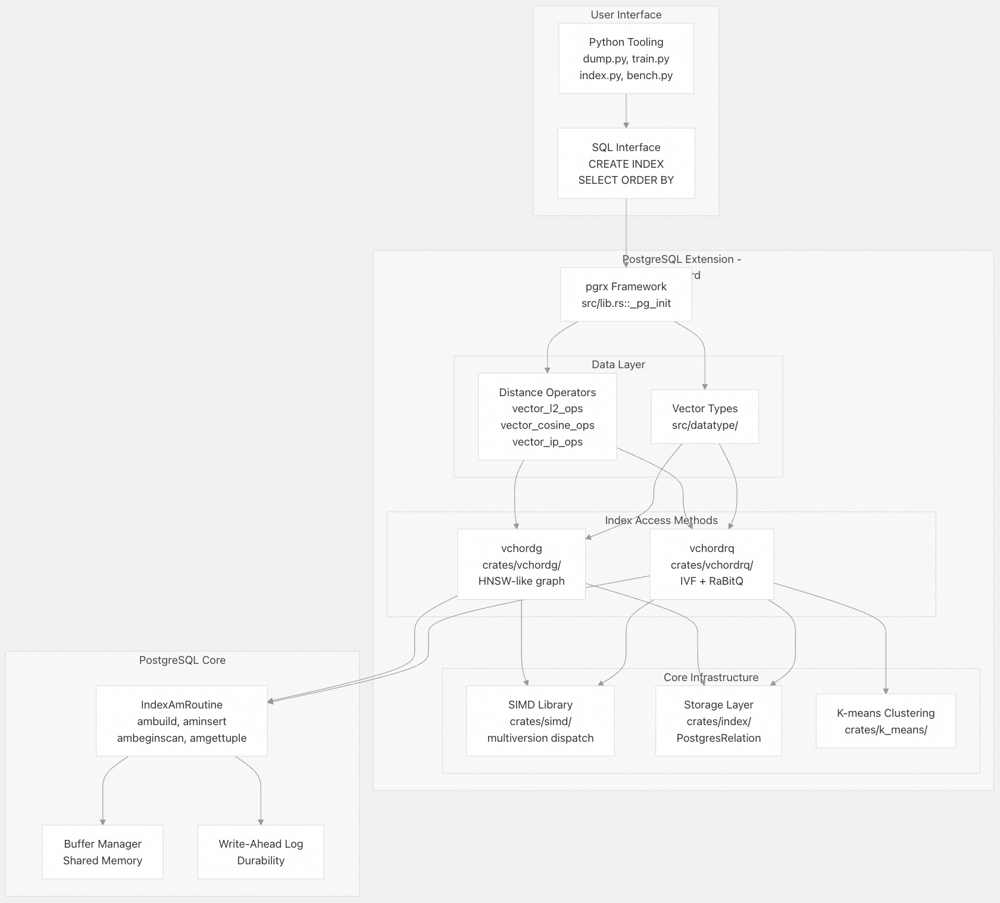
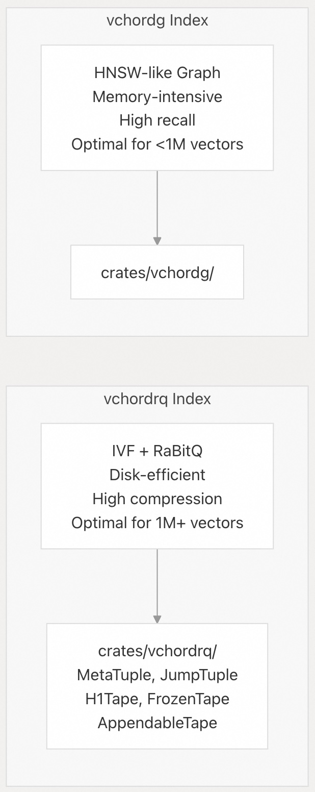
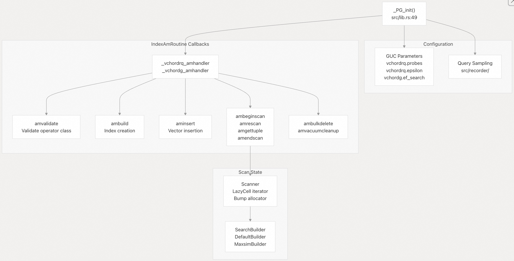

## VectorChord 源码学习: 1 概览  
                                                                
### 作者                                                               
digoal                                                              
                                                             
### 日期                                                            
2025-10-30                                                            
                                                              
### 标签                                                              
VectorChord , 源码学习                                                               
                                                              
----                                                              
                                                              
## 背景            
**VectorChord** 是一个 PostgreSQL 扩展（extension），专为可扩展（scalable）、高性能（high-performance）和磁盘效率高（disk-efficient）的向量相似性搜索（vector similarity search）而设计。它使用 `pgrx` 框架（framework）以 Rust 语言构建，为大规模向量数据库（large-scale vector databases）提供生产级（production-grade）的近似最近邻（Approximate Nearest Neighbor, ANN）搜索能力，能够以有限的内存占用（limited memory footprint）处理数十亿（billions）个向量。  
  
本文介绍 VectorChord 的架构（architecture）、核心组件（core components）以及与 PostgreSQL 集成（integration）的高级介绍。  
  
## 目的和定位（Purpose and Positioning）  
  
VectorChord 是 `pgvecto.rs` 的继任者，提供了更高的稳定性、性能和成本效益。它完全兼容 `pgvector` 的数据类型（data types）和操作符（operators），同时提供针对大规模部署优化的增强型索引方法（enhanced index methods）。该扩展能以 1 美元的成本存储 400,000 个 768 维向量，与 Pinecone 的优化存储相比，存储的向量数量最多可达 6 倍；与 `pgvector/pgvecto.rs` 在同等成本下相比，最多可达 26 倍。  
  
该系统针对需要满足以下条件的生产环境：  
  
* **高维向量存储（High-dimensional vector storage）**: 支持高达 60,000 维的向量。  
* **内存高效搜索（Memory-efficient search）**: 使用 32GB RAM 查询 1 亿（100M）个 768 维向量，在 95% 召回率（recall）下，P50 延迟（latency）为 35 毫秒。  
* **快速索引构建（Fast index building）**: 比 `pgvector` 的 HNSW 实现快 16 倍。  
* **水平可扩展性（Horizontal scalability）**: 通过 PostgreSQL 只读副本（read replicas）扩展到 10,000+ QPS。  
  
**来源:**  
- [`README.md` 29-60](https://github.com/tensorchord/VectorChord/blob/ac12e257/README.md#L29-L60)  
  
## 系统组件（System Components）  
  
VectorChord 由四个主要层组成，它们协同工作以提供高效的向量搜索能力：  
  
    
  
**来源:**  
- [`src/lib.rs` 1-82](https://github.com/tensorchord/VectorChord/blob/ac12e257/src/lib.rs#L1-L82)  
- [`Cargo.toml` 1-113](https://github.com/tensorchord/VectorChord/blob/ac12e257/Cargo.toml#L1-L113)  
- [`README.md` 29-46](https://github.com/tensorchord/VectorChord/blob/ac12e257/README.md#L29-L46)  
  
### 扩展入口点（Extension Entry Point）  
  
VectorChord 通过 PostgreSQL 的扩展加载机制（extension loading mechanism）进行初始化。当在 `shared_preload_libraries` 中进行配置时，[src/lib.rs49-63](https://github.com/tensorchord/VectorChord/blob/ac12e257/src/lib.rs#L49-L63) 中的 `_PG_init` 函数会在服务器启动期间被调用。该函数：  
  
1.  验证正确的加载上下文（必须在共享库预加载期间）。  
2.  通过 `index::init()` 初始化索引访问方法处理程序（index access method handlers）。  
3.  通过 `recorder::init()` 注册查询采样钩子（query sampling hooks）。  
4.  保留 `vchord` GUC 参数命名空间（namespace）。  
  
该扩展使用 `pgrx` 的 `pg_module_magic!` 宏来声明其元数据（metadata），并嵌入用于类型定义（type definitions）和最终确定步骤（finalization steps）的 SQL 引导脚本（bootstrap scripts）。  
  
**来源:**  
- [`src/lib.rs` 23-63](https://github.com/tensorchord/VectorChord/blob/ac12e257/src/lib.rs#L23-L63)  
- [`Cargo.toml` 39](https://github.com/tensorchord/VectorChord/blob/ac12e257/Cargo.toml#L39-L39)  
  
### Crate 组织（Crate Organization）  
  
VectorChord 被组织成一个包含多个专注 crate 的 Cargo 工作空间（workspace）：  
  
| Crate | 目的（Purpose） | 关键依赖项（Key Dependencies） |  
| :--- | :--- | :--- |  
| `vchord` | 主扩展库，SQL 接口 | `pgrx`、`vchordrq`、`vchordg`、`simd` |  
| `vchordrq` | IVF + RaBitQ 索引实现 | `index`、`rabitq`、`k_means` |  
| `vchordg` | 基于图（Graph-based）的索引实现 | `index`、`simd` |  
| `index` | 存储抽象（Storage abstraction），元组系统（tuple system） | `bumpalo`、`distance` |  
| `simd` | 跨平台 SIMD 操作 | （架构特定的内部函数/intrinsics） |  
| `rabitq` | RaBitQ 量化算法（quantization algorithm） | `simd`、`zerocopy` |  
| `k_means` | 用于质心（centroid）生成的聚类（Clustering） | `simd`、`rayon` |  
| `distance` | 距离度量（Distance metric）计算 | `zerocopy` |  
| `vector` | 向量类型定义 | - |  
  
该工作空间在 Linux 和 macOS (x86\_64/aarch64) 上使用 `mimalloc` 作为全局分配器（global allocator），以提高内存性能。  
  
**来源:**  
- [`Cargo.toml` 24-57](https://github.com/tensorchord/VectorChord/blob/ac12e257/Cargo.toml#L24-L57)  
  
## 索引访问方法（Index Access Methods）  
  
VectorChord 提供了两种不同的索引方法，每种都针对不同的工作负载特性进行了优化：  
  
    
  
### vchordrq: 量化倒排文件索引（Quantized Inverted File Index）  
[《AI论文解读 | Product Quantization for Nearest Neighbor Search》](../202506/20250626_01.md)    
  
[《AI论文解读 | THE FAISS LIBRARY》](../202506/20250620_01.md)    
  
`vchordrq` 索引方法实现了一个多层级（multi-layer hierarchical）结构，将倒排文件（Inverted File, IVF）索引与 RaBitQ 压缩相结合：  
  
* **IVF 结构**: 使用 k-means 质心（centroids）划分向量空间，在搜索期间实现高效剪枝（pruning）。  
* **RaBitQ 量化**: 将向量压缩到每维 2 比特（2 bits per dimension），具有理论误差界限（theoretical error bounds），实现 16 倍的压缩率。  
* **层级组织**: 使用 `MetaTuple` 存储全局参数，`JumpTuple` 用于导航，以及三种磁带（tape）类型（`H1Tape` 存储质心，`FrozenTape` 存储压缩向量，`AppendableTape` 存储最近插入的数据）。  
* **重排（Reranking）**: 自动使用全精度（full-precision）向量对候选结果进行重排，以确保准确性。  
  
该方法擅长于磁盘效率至关重要的大规模部署（数百万到数十亿向量）。  
  
**来源:**  
- [`README.md` 47](https://github.com/tensorchord/VectorChord/blob/ac12e257/README.md#L47-L47)  
  
### vchordg: 基于图的索引（Graph-Based Index）  
[《AI论文解读 | Efficient and robust approximate nearest neighbor search using Hierarchical Navigable Small World graphs》](../202506/20250619_02.md)    
  
`vchordg` 索引实现了类似 HNSW (Hierarchical Navigable Small World，分层可导航小世界) 的图结构：  
  
* **图导航（Graph Navigation）**: 通过邻近图（proximity graph）遍历提供快速近似搜索。  
* **内存权衡（Memory Trade-off）**: 比 `vchordrq` 需要更多内存，但提供更高的召回率。  
* **简洁性（Simplicity）**: 适用于较小数据集（<1M 向量）或内存资源充足的场景。  
  
**来源:**  
- [`README.md` 112](https://github.com/tensorchord/VectorChord/blob/ac12e257/README.md#L112-L112)  
  
## PostgreSQL 集成架构（PostgreSQL Integration Architecture）  
  
VectorChord 通过 `pgrx` 框架与 PostgreSQL 的索引访问方法（Index Access Method, IAM）API 深度集成：  
  
    
  
该扩展利用 PostgreSQL 的并行基础设施（parallel infrastructure）进行索引构建，支持通过共享内存（shared memory）和条件变量（condition variables）进行多进程协调（multi-process coordination）。扫描使用惰性求值（lazy evaluation）：`ambeginscan` 分配状态，`amrescan` 配置搜索参数，`amgettuple` 按需执行查询。  
  
**来源:**  
- [`src/lib.rs` 49-63](https://github.com/tensorchord/VectorChord/blob/ac12e257/src/lib.rs#L49-L63)  
  
## 数据类型和操作符（Data Types and Operators）  
  
VectorChord 依赖 `pgvector` 进行向量表示，并扩展了额外的数据类型和操作符：  
  
**向量类型（Vector Types）**:  
  
* `vector`: 标准 `pgvector` 类型（f32 元素）。  
* `halfvec`: 半精度浮点（f16）。  
* `scalar8`: 8 位量化表示。  
* `sphere_vector`: 用于角度度量（angular metrics）的归一化向量（Normalized vectors）。  
* `sphere_halfvec`: 归一化半精度向量。  
  
**距离操作符（Distance Operators）**:  
  
* `<->`: L2（欧几里得/Euclidean）距离。  
* `<=>`: 余弦（Cosine）距离。  
* `<#>`: 负内积（Negative inner product）（用于最大内积搜索/maximum inner product search）。  
* `<<->>`、`<<#>>`、`<<=>>`: 归一化向量的球体搜索变体（Sphere search variants）。  
* MaxSim 操作符: 用于多向量检索（multi-vector retrieval）场景。  
  
这些类型和操作符与 SQL 语法无缝集成，允许使用标准的 `ORDER BY` 子句进行向量搜索查询。  
  
**来源:**  
- [`README.md` 83-106](https://github.com/tensorchord/VectorChord/blob/ac12e257/README.md#L83-L106)  
- [`src/datatype/`](https://github.com/tensorchord/VectorChord/blob/ac12e257/src/datatype/)  
  
## 外部数据管道（External Data Pipeline）  
  
VectorChord 提供 Python 工具用于离线数据处理和外部索引预计算（external index precomputation）：  
  
| 脚本（Script） | 目的（Purpose） | 关键操作（Key Operations） |  
| :--- | :--- | :--- |  
| `dump.py` | 将 PostgreSQL 中的向量导出到 HDF5 | 支持 `pgvector` 的流式提取（Streaming extraction） |  
| `train.py` | 在 CPU 或 GPU 上进行 K-means 聚类 | 使用 FAISS 进行离线质心生成 |  
| `index.py` | 将向量和质心加载到 PostgreSQL | 批量插入，使用外部质心创建索引 |  
| `bench.py` | 基准测试（Benchmark）查询性能 | 召回率、QPS、延迟测量 |  
  
此工作流程支持在数据库外部进行大规模预处理：  
  
1.  **导出**: 使用 `dump.py` 将现有向量提取为 HDF5 格式。  
2.  **训练**: 使用 `train.py` 配合 FAISS 在 GPU 上计算 k-means 质心。  
3.  **加载**: 使用 `index.py` 导入向量和预计算的质心。  
4.  **构建**: 使用外部质心表创建索引（比内部聚类更快）。  
5.  **基准测试**: 使用 `bench.py` 测量性能特征。  
  
外部构建策略通过利用 GPU 加速的聚类，显著加快了超过 5M 向量数据集的索引创建速度。  
  
**来源:**  
- [`scripts/README.md` 1-59](https://github.com/tensorchord/VectorChord/blob/ac12e257/scripts/README.md#L1-L59)  
- [`scripts/dump.py` 1-82](https://github.com/tensorchord/VectorChord/blob/ac12e257/scripts/dump.py#L1-L82)  
- [`scripts/train.py`](https://github.com/tensorchord/VectorChord/blob/ac12e257/scripts/train.py)  
- [`scripts/index.py` 1-248](https://github.com/tensorchord/VectorChord/blob/ac12e257/scripts/index.py#L1-L248)  
- [`scripts/bench.py` 1-267](https://github.com/tensorchord/VectorChord/blob/ac12e257/scripts/bench.py#L1-L267)  
  
## 性能优化栈（Performance Optimization Stack）  
  
VectorChord 通过多层优化策略实现了高性能：  
  
    
  
关键优化技术包括：  
  
1.  **SIMD 抽象（Abstraction）**: `Floating` trait 提供统一的向量操作，`multiversion` 宏在编译时生成架构特定的实现。  
2.  **多架构支持（Multi-Architecture Support）**: 针对 x86\_64 (v2/v3/v4 微架构级别/microarchitecture levels)、ARM NEON/SVE 和其他架构的优化代码路径。  
3.  **内存效率（Memory Efficiency）**: 用于临时扫描分配（temporary scan allocations）的 `Bump Allocator`（碰撞分配器），用于全局分配的 `mimalloc`，以及尽可能采用零拷贝（zero-copy）反序列化。  
4.  **I/O 优化**: 可配置的预取（prefetching）策略，包括对 PostgreSQL 17+ 原生 `read_stream` API 的支持。  
5.  **压缩（Compression）**: RaBitQ 2 比特量化，采用 32 元素批量处理，以优化缓存利用率。  
  
**来源:**  
- [`Cargo.toml` 49-50](https://github.com/tensorchord/VectorChord/blob/ac12e257/Cargo.toml#L49-L50)  
- [`src/lib.rs` 78-81](https://github.com/tensorchord/VectorChord/blob/ac12e257/src/lib.rs#L78-L81)  
  
## 构建和部署（Build and Deployment）  
  
VectorChord 使用 `make` crate 协调的自定义构建系统：  
  
1.  **符号解析（Symbol Parsing）**: `pgrx_embed_vchord` 二进制文件（ [`Cargo.toml` 12-13](https://github.com/tensorchord/VectorChord/blob/ac12e257/Cargo.toml#L12-L13) ）从已编译的 Rust 代码中提取面向 PostgreSQL 的符号。  
2.  **SQL 生成**: 从 Rust 函数签名自动生成 `vchord--VERSION.sql` 安装脚本。  
3.  **C Shim 编译**: `crates/simd/` 中的架构特定 C 文件提供了 Rust 中不可用的内部函数（intrinsics），由 `build.rs` 编译。  
4.  **多平台 CI（Multi-Platform CI）**: GitHub Actions 工作流在 6 个 PostgreSQL 版本 × 多个架构（x86\_64, aarch64, s390x, ppc64le, riscv64）上进行测试。  
5.  **包分发（Package Distribution）**: 发布包括 DEB 包、ZIP 存档、Docker 镜像和 PGXN 发布。  
  
该扩展需要作为共享库安装，并且必须通过 `postgresql.conf` 中的 `shared_preload_libraries` 进行加载才能正确初始化。  
  
**来源:**  
- [`Cargo.toml` 1-13](https://github.com/tensorchord/VectorChord/blob/ac12e257/Cargo.toml#L1-L13)  
- [`src/lib.rs` 51-52](https://github.com/tensorchord/VectorChord/blob/ac12e257/src/lib.rs#L51-L52)  
  
## 配置和调优（Configuration and Tuning）  
  
VectorChord 暴露出几个 GUC (Grand Unified Configuration，统一配置) 参数用于运行时调优：  
  
**vchordrq 参数**:  
  
* `vchordrq.probes`: 要搜索的 IVF 分区数量（默认值因数据集而异）。  
* `vchordrq.epsilon`: 重排（Reranking）扩展因子（1.0 = 不扩展）。  
* 用于预取行为的 I/O 策略选择。  
  
**vchordg 参数**:  
  
* `vchordg.ef_search`: 图遍历期间的候选者数量。  
  
这些参数控制着召回率和性能之间的权衡（recall-performance trade-off），允许用户根据其特定的工作负载需求进行优化。  
  
**来源:**  
- [`scripts/bench.py` 80-81](https://github.com/tensorchord/VectorChord/blob/ac12e257/scripts/bench.py#L80-L81)  
- [`README.md` 61-122](https://github.com/tensorchord/VectorChord/blob/ac12e257/README.md#L61-L122)  
    
# 附录: vchordrq.epsilon 如何优化查询效率?   
## 关于 `vchordrq.epsilon` 参数的深入解析  
  
`vchordrq.epsilon` 这个配置参数, 它是 VectorChord 的 `vchordrq` 索引方法中用于控制重排序(reranking)阶段精度的关键参数。   
  
### 参数定义与配置  
  
`vchordrq.epsilon` 是一个浮点数类型的 GUC(Grand Unified Configuration)参数,默认值为 `1.9`, 取值范围是 `0.0` 到 `4.0`。   
  
您可以在运行时通过以下方式设置:  
  
```sql  
SET vchordrq.epsilon = 1.5;  
```  
  
### 核心用途:控制候选集大小  
  
`epsilon` 参数的核心作用是**控制重排序阶段的候选集大小**, 它是一个误差容忍度的乘数。在 vchordrq 的搜索过程中,系统首先使用量化后的向量进行粗略搜索, 计算出一个粗略距离(`rough`)和误差估计(`err`)。然后,`epsilon` 用于计算下界(lowerbound):  
  
```rust  
let lowerbound = Distance::from_f32(rough - err * epsilon);  
```   
  
这个公式同样应用于 MaxSim 搜索.    
  
### 工作原理  
  
在 IVF(Inverted File)索引的多层搜索中,`epsilon` 影响每一层的候选集筛选:   
  
1. **粗略搜索阶段**: 使用量化向量快速计算距离,得到 `rough` 和 `err`  
2. **下界计算**: `lowerbound = rough - err * epsilon`  
3. **候选集扩展**: 较大的 `epsilon` 值会降低 lowerbound, 使更多候选项被保留进入重排序阶段  
4. **精确重排序**: 对保留的候选项使用原始向量进行精确距离计算  
  
### 参数调优策略  
  
**较大的 epsilon 值(如 1.9)**:  
- 保留更多候选项进入重排序  
- 提高召回率(recall)  
- 增加计算开销和查询延迟  
  
**较小的 epsilon 值(如 0.8)**:  
- 更激进地过滤候选项  
- 降低召回率  
- 减少计算开销,提高查询速度  
  
### 实际使用示例  
  
在召回率评估函数中,`epsilon` 被用作高精度搜索的参数:    
  
测试用例展示了设置 `epsilon` 的方式:    
  
在基准测试脚本中,`epsilon` 作为命令行参数传入, 默认值为 `1.0`.    
  
### 与其他参数的协同  
  
`epsilon` 在搜索选项中与 `probes`、`max_scan_tuples` 等参数一起使用.  
  
在插入操作中,`epsilon` 被硬编码为 `1.9`, 用于确定新向量应该插入到哪个分区.  
  
## Notes  
  
`epsilon` 参数是 vchordrq 索引性能调优的关键旋钮之一。 它通过控制误差容忍度来平衡召回率和查询速度。 在生产环境中,建议根据具体的数据集和查询模式, 通过 `vchordrq_evaluate_query_recall()` 函数来评估不同 `epsilon` 值的效果, 找到最佳的召回率/性能平衡点。   
      
#### [期望 PostgreSQL|开源PolarDB 增加什么功能?](https://github.com/digoal/blog/issues/76 "269ac3d1c492e938c0191101c7238216")
  
  
#### [PolarDB 开源数据库](https://openpolardb.com/home "57258f76c37864c6e6d23383d05714ea")
  
  
#### [PolarDB 学习图谱](https://www.aliyun.com/database/openpolardb/activity "8642f60e04ed0c814bf9cb9677976bd4")
  
  
#### [PostgreSQL 解决方案集合](../201706/20170601_02.md "40cff096e9ed7122c512b35d8561d9c8")
  
  
#### [德哥 / digoal's Github - 公益是一辈子的事.](https://github.com/digoal/blog/blob/master/README.md "22709685feb7cab07d30f30387f0a9ae")
  
  
#### [About 德哥](https://github.com/digoal/blog/blob/master/me/readme.md "a37735981e7704886ffd590565582dd0")
  
  

  
