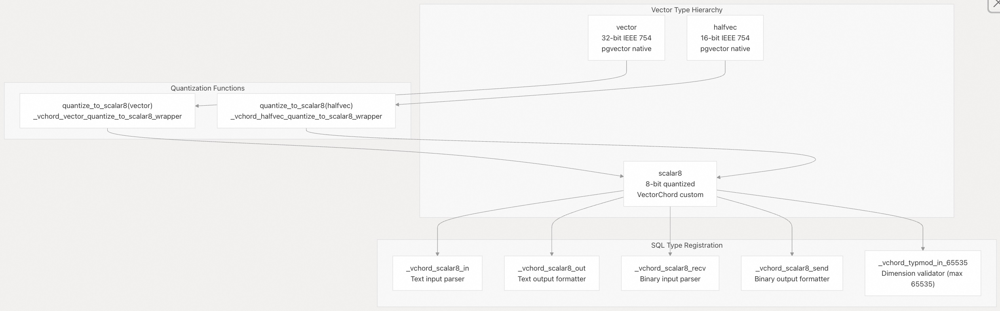
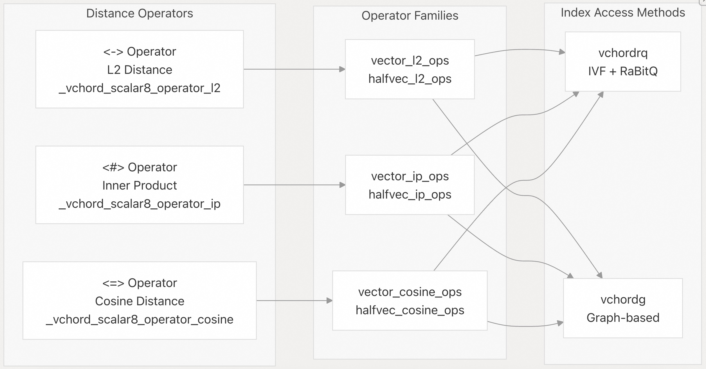
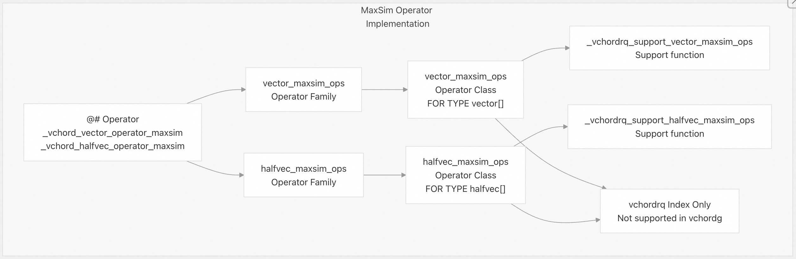
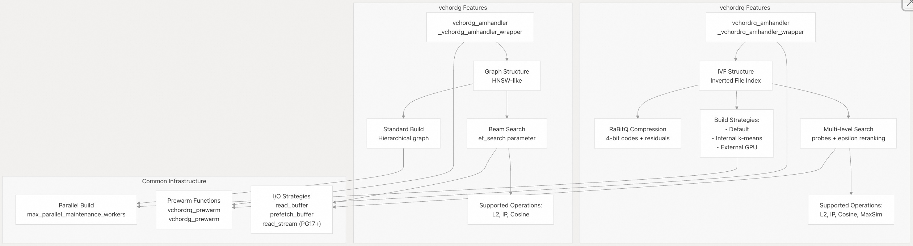
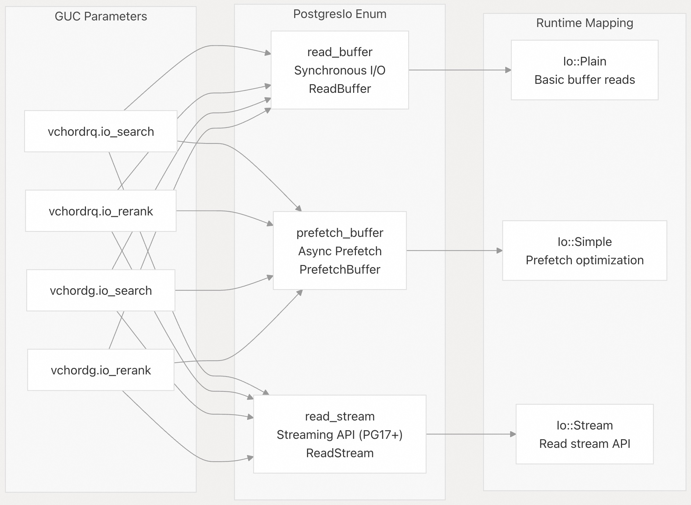
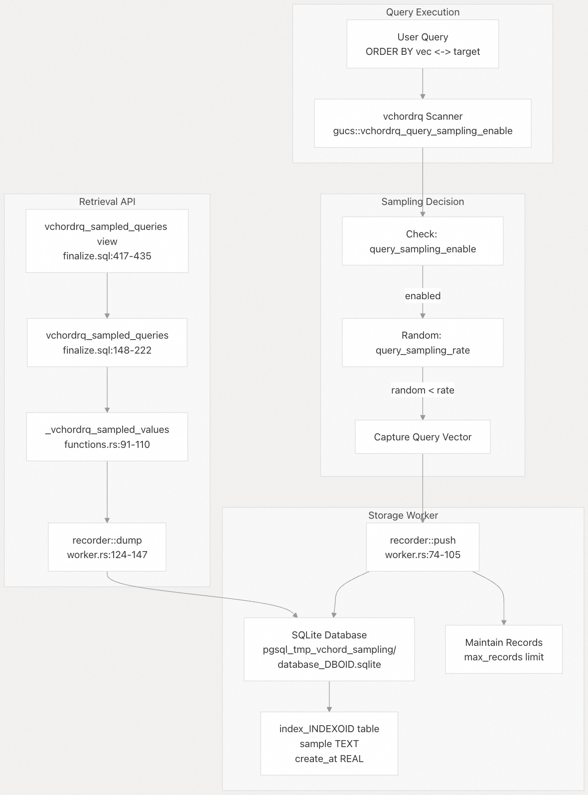
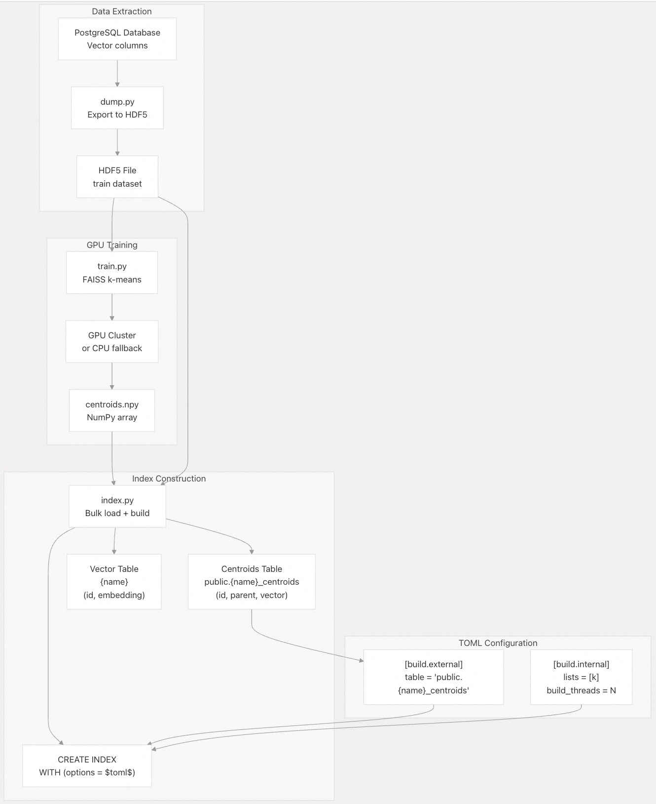

## VectorChord 源码学习: 1.2 功能与能力（Features and Capabilities）  
    
### 作者    
digoal    
    
### 日期    
2025-10-30    
    
### 标签    
VectorChord , 源码学习    
    
----    
    
## 背景    
本文将介绍 VectorChord 中可用的功能与能力，包括支持的数据类型、距离度量（distance metrics）、索引方法（index methods）、查询操作（query operations）以及运行时配置选项（runtime configuration options）。  
  
## 概述（Overview）  
  
VectorChord 提供两种互补的索引策略（`vchordrq` 和 `vchordg`），支持多种向量数据类型并具备量化（quantization）能力，实现了包括专用的 MaxSim 算子在内的多种距离度量，并提供了丰富的运行时配置选项用于性能调优。该扩展在保持与 pgvector 数据类型和语法完全兼容的同时，为大规模部署提供了额外的能力。  
  
来源:    
- [`README.md` 29-61](https://github.com/tensorchord/VectorChord/blob/ac12e257/README.md#L29-L61)    
- [`src/sql/finalize.sql` 1-435](https://github.com/tensorchord/VectorChord/blob/ac12e257/src/sql/finalize.sql#L1-L435)  
  
## 数据类型（Data Types）  
  
### 向量数据类型（Vector Data Types）  
  
VectorChord 支持三种主要的向量数据类型用于存储嵌入（embeddings）：  
  
| 类型（Type） | 精度（Precision） | 每维度字节数（Bytes per Dimension） | 来源（Source） | 使用场景（Use Case） |  
|--------------|------------------|----------------------------------|----------------|---------------------|  
| `vector`     | 32 位浮点（32-bit float） | 4 | pgvector | 标准精度嵌入（Standard precision embeddings） |  
| `halfvec`    | 16 位浮点（16-bit float） | 2 | pgvector | 内存高效存储（Memory-efficient storage） |  
| `scalar8`    | 8 位量化（8-bit quantized） | 1 | VectorChord | 最大压缩（Maximum compression） |  
  
  
  
**向量数据类型系统与量化（Vector Data Type System and Quantization）**  
  
`scalar8` 类型定义为 `STORAGE = EXTERNAL` 且 `INTERNALLENGTH = VARIABLE`，使其能够以 8 位量化方式存储最多 65,535 维的向量。量化函数 `quantize_to_scalar8()` 可将全精度向量转换为此压缩格式。  
  
来源:    
- [`src/sql/finalize.sql` 3-13](https://github.com/tensorchord/VectorChord/blob/ac12e257/src/sql/finalize.sql#L3-L13)    
- [`src/sql/finalize.sql` 139-143](https://github.com/tensorchord/VectorChord/blob/ac12e257/src/sql/finalize.sql#L139-L143)  
  
### 球体类型（Sphere Types）  
  
VectorChord 引入了球体类型（sphere types）用于基于半径的搜索查询（radius-based search queries），将中心向量与半径封装在一起：  
```  
-- Sphere type definitions  
sphere_vector = (center vector, radius REAL)  
sphere_halfvec = (center halfvec, radius REAL)  
sphere_scalar8 = (center scalar8, radius REAL)  
  
-- Construction function  
sphere(vector, real) -> sphere_vector  
```  
  
每种球体类型都与其对应的向量类型配对，以在搜索中启用邻近过滤（proximity filtering）。  
  
来源:    
- [`src/sql/finalize.sql` 15-28](https://github.com/tensorchord/VectorChord/blob/ac12e257/src/sql/finalize.sql#L15-L28)    
- [`src/sql/finalize.sql` 130-137](https://github.com/tensorchord/VectorChord/blob/ac12e257/src/sql/finalize.sql#L130-L137)  
  
## 距离度量与算子（Distance Metrics and Operators）  
  
### 标准距离算子（Standard Distance Operators）  
  
VectorChord 实现了三种与 pgvector 兼容的基础距离度量：  
  
| 算子（Operator） | 度量（Metric） | 公式（Formula） | 算子族后缀（Operator Family Suffix） |  
|------------------|----------------|------------------|--------------------------------------|  
| `<->`            | L2（欧几里得距离，Euclidean） | `sqrt(sum((a[i] - b[i])^2))` | `_l2_ops` |  
| `<#>`            | 内积（负值，Inner Product (Negative)） | `-sum(a[i] * b[i])` | `_ip_ops` |  
| `<=>`            | 余弦距离（Cosine Distance） | `1 - (a·b)/(‖a‖‖b‖)` | `_cosine_ops` |  
  
这些算子适用于 `vector`、`halfvec` 和 `scalar8` 类型。  
  
  
  
**距离算子与索引访问方法的集成（Distance Operator Integration with Index Access Methods）**  
  
来源:    
- [`src/sql/finalize.sql` 32-51](https://github.com/tensorchord/VectorChord/blob/ac12e257/src/sql/finalize.sql#L32-L51)    
- [`src/sql/finalize.sql` 316-329](https://github.com/tensorchord/VectorChord/blob/ac12e257/src/sql/finalize.sql#L316-L329)    
- [`src/sql/finalize.sql` 333-413](https://github.com/tensorchord/VectorChord/blob/ac12e257/src/sql/finalize.sql#L333-L413)  
  
### 球体搜索算子（Sphere Search Operators）  
  
球体算子（sphere operators）支持基于向量是否落在指定半径内的过滤：  
  
| 算子（Operator） | 度量（Metric） | 用法（Usage） |  
|------------------|----------------|---------------|  
| `<<->>`          | L2 球体（L2 sphere） | `vector <<->> sphere_vector` |  
| `<<#>>`          | 内积球体（IP sphere） | `vector <<#>> sphere_vector` |  
| `<<=>>`          | 余弦球体（Cosine sphere） | `vector <<=>> sphere_vector` |  
  
这些算子在算子类（operator classes）中注册为搜索算子（`FOR SEARCH`），而非排序算子（`FOR ORDER BY`）。  
  
来源:    
- [`src/sql/finalize.sql` 53-114](https://github.com/tensorchord/VectorChord/blob/ac12e257/src/sql/finalize.sql#L53-L114)    
- [`src/sql/finalize.sql` 336-337](https://github.com/tensorchord/VectorChord/blob/ac12e257/src/sql/finalize.sql#L336-L337)    
- [`src/sql/finalize.sql` 348-349](https://github.com/tensorchord/VectorChord/blob/ac12e257/src/sql/finalize.sql#L348-L349)  
  
### MaxSim 算子（MaxSim Operator）  
  
`@#` 算子实现了 MaxSim（Maximum Similarity，最大相似度）度量，用于多向量查询（multi-vector queries），这是 `vchordrq` 索引所独有的功能：  
```  
-- MaxSim operator for vector arrays  
vector[] @# vector[] -> float  
  
-- Example: Find documents where any query vector matches any document vector  
SELECT * FROM docs   
ORDER BY doc_embeddings @# query_embeddings   
LIMIT 10;  
```  
  
该算子仅在 `vchordrq` 索引中可用，支持 `vector[]` 和 `halfvec[]` 数组类型。  
  
  
  
**MaxSim 算子架构（MaxSim Operator Architecture）**  
  
来源:    
- [`src/sql/finalize.sql` 116-126](https://github.com/tensorchord/VectorChord/blob/ac12e257/src/sql/finalize.sql#L116-L126)    
- [`src/sql/finalize.sql` 322-323](https://github.com/tensorchord/VectorChord/blob/ac12e257/src/sql/finalize.sql#L322-L323)    
- [`src/sql/finalize.sql` 369-377](https://github.com/tensorchord/VectorChord/blob/ac12e257/src/sql/finalize.sql#L369-L377)  
  
## 索引访问方法（Index Access Methods）  
  
VectorChord 通过 `CREATE ACCESS METHOD` 注册了两种不同的索引访问方法：  
  
### vchordrq 索引方法（vchordrq Index Method）  
```  
CREATE INDEX ON table USING vchordrq (column vector_l2_ops);  
```  
  
**访问方法处理器（Access Method Handler）**: `vchordrq_amhandler()` → `_vchordrq_amhandler_wrapper`  
  
**特性（Characteristics）**:    
- 基于倒排文件（IVF, Inverted File）的索引结构，结合残差量化（residual quantization）    
- 支持 RaBitQ 压缩（RaBitQ compression），以提升内存效率    
- 三种构建策略（build strategies）：    
  - 默认（default）：单质心（single centroid）    
  - 内部（internal）：数据库内 k-means 聚类    
  - 外部（external）：GPU 训练的质心（GPU-trained centroids）    
- 支持所有距离度量（distance metrics）：L2、内积（Inner Product）、余弦（Cosine）和 MaxSim    
- 针对大规模数据集（1 亿+ 向量，100M+ vectors）进行了优化    
- 通过 `probes` 和 `epsilon` 参数可配置召回率（recall）与速度（speed）之间的权衡  
  
来源:    
- [`src/sql/finalize.sql` 224-225](https://github.com/tensorchord/VectorChord/blob/ac12e257/src/sql/finalize.sql#L224-L225)    
- [`src/sql/finalize.sql` 311](https://github.com/tensorchord/VectorChord/blob/ac12e257/src/sql/finalize.sql#L311-L311)  
  
### vchordg 索引方法（vchordg Index Method）  
```  
CREATE INDEX ON table USING vchordg (column vector_l2_ops);  
```  
  
**访问方法处理器（Access Method Handler）**: `vchordg_amhandler()` → `_vchordg_amhandler_wrapper`  
  
**特性（Characteristics）**:    
- 基于图的结构（Graph-based structure），类似 HNSW（HNSW-like）    
- 标准的分层图构建（Standard hierarchical graph build）    
- 采用束搜索算法（Beam search algorithm）    
- 支持 L2、内积（Inner Product）和余弦（Cosine）距离度量（不支持 MaxSim）    
- 针对中等规模数据集（medium-scale datasets）且要求亚秒级延迟（sub-second latency requirements）的场景进行了优化    
- 通过 `ef_search` 和 `beam_search` 参数进行配置  
  
来源:    
- [`src/sql/finalize.sql` 303-304](https://github.com/tensorchord/VectorChord/blob/ac12e257/src/sql/finalize.sql#L303-L304)    
- [`src/sql/finalize.sql` 312](https://github.com/tensorchord/VectorChord/blob/ac12e257/src/sql/finalize.sql#L312-L312)    
- [`src/sql/finalize.sql` 324-329](https://github.com/tensorchord/VectorChord/blob/ac12e257/src/sql/finalize.sql#L324-L329)    
  
  
  
**索引访问方法功能对比（Index Access Method Feature Comparison）**  
  
来源:    
- [`src/sql/finalize.sql` 311-312](https://github.com/tensorchord/VectorChord/blob/ac12e257/src/sql/finalize.sql#L311-L312)    
- [`src/sql/finalize.sql` 316-329](https://github.com/tensorchord/VectorChord/blob/ac12e257/src/sql/finalize.sql#L316-L329)  
  
## 配置参数（GUCs）  
  
VectorChord 通过 PostgreSQL 的 GUC（Grand Unified Configuration，统一配置系统）暴露了丰富的配置选项。  
  
### vchordrq 配置  
  
| 参数（Parameter） | 类型（Type） | 默认值（Default） | 范围（Range） | 上下文（Context） | 描述（Description） |  
|-------------------|--------------|-------------------|---------------|-------------------|----------------------|  
| `vchordrq.enable_scan` | bool | `true` | - | Userset | 启用/禁用索引使用 |  
| `vchordrq.probes` | string | `""` | - | Userset | 要探测的 IVF 分区数量（多级） |  
| `vchordrq.epsilon` | float | `1.9` | 0.0–4.0 | Userset | 重排序阈值乘数（Reranking threshold multiplier） |  
| `vchordrq.max_scan_tuples` | int | `-1` | -1 到 MAX | Userset | 限制结果集大小（-1 = 无限制） |  
| `vchordrq.maxsim_refine` | int | `0` | 0 到 MAX | Userset | MaxSim 精化参数 |  
| `vchordrq.maxsim_threshold` | int | `0` | 0 到 MAX | Userset | MaxSim 阈值参数 |  
| `vchordrq.prefilter` | bool | `false` | - | Userset | 启用预过滤（Prefiltering） |  
| `vchordrq.io_search` | enum | `prefetch_buffer` / `read_stream` | - | Userset | 搜索的 I/O 策略 |  
| `vchordrq.io_rerank` | enum | `prefetch_buffer` / `read_stream` | - | Userset | 重排序的 I/O 策略 |  
  
**查询采样配置（Query Sampling Configuration）**（需超级用户权限）：  
  
| 参数（Parameter） | 类型（Type） | 默认值（Default） | 范围（Range） | 上下文（Context） | 描述（Description） |  
|-------------------|--------------|-------------------|---------------|-------------------|----------------------|  
| `vchordrq.query_sampling_enable` | bool | `false` | - | Suset | 启用查询采样 |  
| `vchordrq.query_sampling_max_records` | int | `0` | 0–10000 | Suset | 每个索引保留的最大查询数 |  
| `vchordrq.query_sampling_rate` | float | `0.0` | 0.0–1.0 | Suset | 采样一个查询的概率 |  
  
来源:    
- [`src/index/gucs.rs` 58-84](https://github.com/tensorchord/VectorChord/blob/ac12e257/src/index/gucs.rs#L58-L84)    
- [`src/index/gucs.rs` 86-194](https://github.com/tensorchord/VectorChord/blob/ac12e257/src/index/gucs.rs#L86-L194)  
  
### vchordg 配置  
  
| 参数（Parameter） | 类型（Type） | 默认值（Default） | 范围（Range） | 上下文（Context） | 描述（Description） |  
|-------------------|--------------|-------------------|---------------|-------------------|----------------------|  
| `vchordg.enable_scan` | bool | `true` | - | Userset | 启用/禁用索引使用 |  
| `vchordg.ef_search` | int | `64` | 1–65535 | Userset | 搜索束宽（Search beam width） |  
| `vchordg.beam_search` | int | `1` | 1–65535 | Userset | 并行束数量（Number of parallel beams） |  
| `vchordg.max_scan_tuples` | int | `-1` | -1 到 MAX | Userset | 限制结果集大小 |  
| `vchordg.io_search` | enum | `prefetch_buffer` / `read_stream` | - | Userset | 搜索的 I/O 策略 |  
| `vchordg.io_rerank` | enum | `prefetch_buffer` / `read_stream` | - | Userset | 重排序的 I/O 策略 |  
  
来源:    
- [`src/index/gucs.rs` 36-56](https://github.com/tensorchord/VectorChord/blob/ac12e257/src/index/gucs.rs#L36-L56)    
- [`src/index/gucs.rs` 201-260](https://github.com/tensorchord/VectorChord/blob/ac12e257/src/index/gucs.rs#L201-L260)  
  
### I/O 策略枚举（I/O Strategy Enumeration）  
  
  
**I/O 策略配置与分发（I/O Strategy Configuration and Dispatch）**  
  
默认 I/O 策略在 PostgreSQL 13–16 中为 `prefetch_buffer`，在 PostgreSQL 17–18 中为 `read_stream`，以便在支持时利用更新的流式读取 API（streaming read API）。  
  
来源:    
- [`src/index/gucs.rs` 19-28](https://github.com/tensorchord/VectorChord/blob/ac12e257/src/index/gucs.rs#L19-L28)    
- [`src/index/gucs.rs` 44-84](https://github.com/tensorchord/VectorChord/blob/ac12e257/src/index/gucs.rs#L44-L84)    
- [`src/index/gucs.rs` 280-296](https://github.com/tensorchord/VectorChord/blob/ac12e257/src/index/gucs.rs#L280-L296)    
- [`src/index/gucs.rs` 351-367](https://github.com/tensorchord/VectorChord/blob/ac12e257/src/index/gucs.rs#L351-L367)  
  
## 查询采样与召回率评估（Query Sampling and Recall Evaluation）  
  
VectorChord 包含一个查询采样子系统，可将执行的查询捕获到 SQLite 数据库中，用于性能分析和召回率（recall）评估。  
  
### 查询采样架构（Query Sampling Architecture）  
  
  
  
**查询采样子系统架构（Query Sampling Subsystem Architecture）**  
  
采样系统将查询存储在位于 `pgsql_tmp_vchord_sampling/database_{database_oid}.sqlite` 的 SQLite 数据库中。目录名以 `pgsql_tmp` 开头，以确保其被排除在 `pg_basebackup` 操作之外。每个索引拥有自己的表，名为 `index_{indexrelid}`。  
  
来源:    
- [`src/recorder/worker.rs` 21-147](https://github.com/tensorchord/VectorChord/blob/ac12e257/src/recorder/worker.rs#L21-L147)    
- [`src/index/functions.rs` 90-110](https://github.com/tensorchord/VectorChord/blob/ac12e257/src/index/functions.rs#L90-L110)    
- [`src/sql/finalize.sql` 145-222](https://github.com/tensorchord/VectorChord/blob/ac12e257/src/sql/finalize.sql#L145-L222)    
- [`src/sql/finalize.sql` 417-435](https://github.com/tensorchord/VectorChord/blob/ac12e257/src/sql/finalize.sql#L417-L435)  
  
### 召回率评估函数（Recall Evaluation Function）  
  
`vchordrq_evaluate_query_recall()` 函数通过将近似结果与真实结果（ground truth）进行比较来衡量索引质量：  
```  
-- Function signature  
vchordrq_evaluate_query_recall(  
    query text,                    -- SQL query returning ctid values  
    exact_search boolean = false,  -- Use exact search for ground truth  
    accu_probes TEXT = NULL,       -- Probes setting for ground truth  
    accu_epsilon real = 1.9        -- Epsilon for ground truth  
) RETURNS real  
  
-- Example: Evaluate recall for all sampled queries  
SELECT AVG(  
    vchordrq_evaluate_query_recall(  
        query => format(  
            'SELECT ctid FROM %I.%I ORDER BY %I OPERATOR(%s) %L LIMIT 10',  
            schema_name, table_name, column_name, operator, value  
        )  
    )  
)  
FROM vchordrq_sampled_queries;  
```  
  
**算法（Algorithm）**:    
- 使用当前设置执行查询 → 得到近似结果（rough results）    
- 使用高精度设置（或精确搜索）执行查询 → 得到准确结果（accu results）    
- 计算召回率（recall） = `|rough ∩ accu| / |accu|`  
  
若未找到结果，该函数返回 `NaN`；若在未设置 `exact_search => true` 的情况下使用 MaxSim，则抛出异常。  
  
来源:    
- [`src/sql/finalize.sql` 230-301]()    
- [`tests/vchordrq/recall.slt` 1-182]()  
  
## 性能特性（Performance Features）  
  
### 并行索引构建（Parallel Index Building）  
  
两种索引方法均通过 PostgreSQL 的维护工作进程（maintenance workers）支持并行构建：  
```  
-- Configure parallel workers  
SET max_parallel_maintenance_workers = 8;  
CREATE INDEX ON table USING vchordrq (column vector_l2_ops);  
```  
  
`scripts/index.py` 脚本通过 `ALTER TABLE ... SET (parallel_workers = N)` 命令进行配置，并将工作进程数量传递给索引构建配置。  
  
来源:    
- [`scripts/index.py` 52-60](https://github.com/tensorchord/VectorChord/blob/ac12e257/scripts/index.py#L52-L60)    
- [`scripts/index.py` 153](https://github.com/tensorchord/VectorChord/blob/ac12e257/scripts/index.py#L153-L153)    
- [`scripts/index.py` 181](https://github.com/tensorchord/VectorChord/blob/ac12e257/scripts/index.py#L181-L181)  
  
### 索引预热（Index Prewarming）  
  
预热函数（prewarm functions）将索引页加载到 PostgreSQL 的共享缓冲区（shared buffers）中，以减少冷启动延迟（cold-start latency）：  
```  
-- Prewarm vchordrq index (specify height level, 0 = all levels)  
SELECT vchordrq_prewarm('index_name'::regclass, 0);  
  
-- Prewarm vchordg index  
SELECT vchordg_prewarm('index_name'::regclass);  
```  
  
**实现（Implementation）**: `_vchordrq_prewarm_wrapper` 和 `_vchordg_prewarm_wrapper` 遍历索引结构并将页面读入共享缓冲区。  
  
来源:    
- [`src/sql/finalize.sql` 227-228](https://github.com/tensorchord/VectorChord/blob/ac12e257/src/sql/finalize.sql#L227-L228)    
- [`src/sql/finalize.sql` 306-307](https://github.com/tensorchord/VectorChord/blob/ac12e257/src/sql/finalize.sql#L306-L307)    
- [`src/index/functions.rs` 22-63](https://github.com/tensorchord/VectorChord/blob/ac12e257/src/index/functions.rs#L22-L63)  
  
### 预取策略（Prefetching Strategies）  
  
VectorChord 实现了多种 I/O 策略以优化页面访问模式（page access patterns）：  
- `read_buffer`：基础的同步 I/O    
- `prefetch_buffer`：异步预取（asynchronous prefetching），用于隐藏 I/O 延迟    
- `read_stream`（PostgreSQL 17+）：使用新的流式读取 API（streaming read API），实现更高效的批量读取    
  
这些策略可独立应用于`搜索`和`重排序`阶段。  
  
来源:    
- [`src/index/gucs.rs` 19-28](https://github.com/tensorchord/VectorChord/blob/ac12e257/src/index/gucs.rs#L19-L28)    
- [`src/index/gucs.rs` 72-84](https://github.com/tensorchord/VectorChord/blob/ac12e257/src/index/gucs.rs#L72-L84)  
  
### SIMD 优化（SIMD Optimization）  
  
所有距离计算和量化操作均利用架构特定的 SIMD 指令。系统在运行时自动检测 CPU 能力，并分发到最优实现：  
- `x86_64`: SSE4.1 → AVX2+FMA → AVX-512 → AVX-512+VPOPCNTDQ  
- `aarch64`: NEON → SVE  
- `s390x`: Vector Facility (z13-z17)  
- `powerpc64`: AltiVec + VSX  
- `riscv64`: Vector Extension  
  
此功能由 `simd` crate 的多版本编译（multiversion compilation）系统处理。  
  
## 外部索引预计算（External Index Precomputation）  
  
VectorChord 支持一种外部工作流，使用 GPU 训练的质心（centroids）构建索引，从而高效处理大规模数据集。  
  
### 工作流管道（Workflow Pipeline）  
  
  
  
**外部索引预计算管道（External Index Precomputation Pipeline）**  
  
### 脚本参考（Script Reference）  
  
| 脚本（Script） | 用途（Purpose） | 关键参数（Key Arguments） |  
|----------------|------------------|----------------------------|  
| `dump.py`      | 从 PostgreSQL 导出向量到 HDF5 | `-n` 表名, `-c` 列名, `-d` 维度, `-o` 输出文件 |  
| `train.py`     | 使用 FAISS 训练 k-means 质心 | `-i` 输入, `-o` 质心, `--lists` k, `-m` 度量, `-g` GPU |  
| `index.py`     | 批量加载向量并构建索引 | `-n` 名称, `-i` 输入, `-c` 质心, `-w` 工作进程数 |  
| `bench.py`     | 基准测试召回率/QPS/延迟 | `-n` 名称, `-i` 输入, `--nprob`, `--epsilon` |  
  
`index.py` 脚本创建一个质心表，其模式(schema)为 `(id integer, parent integer, vector vector(dim))`，其中父子关系定义了分层 IVF 结构。根质心（id=0）的 `parent=NULL`，所有一级质心的 `parent=0`。  
  
来源:    
- [`scripts/README.md` 1-59](https://github.com/tensorchord/VectorChord/blob/ac12e257/scripts/README.md#L1-L59)    
- [`scripts/dump.py` 1-82](https://github.com/tensorchord/VectorChord/blob/ac12e257/scripts/dump.py#L1-L82)    
- [`scripts/index.py` 1-248](https://github.com/tensorchord/VectorChord/blob/ac12e257/scripts/index.py#L1-L248)    
- [`scripts/bench.py` 1-267](https://github.com/tensorchord/VectorChord/blob/ac12e257/scripts/bench.py#L1-L267)    
- [`scripts/index.py` 79-118](https://github.com/tensorchord/VectorChord/blob/ac12e257/scripts/index.py#L79-L118)  
  
### 质心表模式（Centroid Table Schema）  
```  
-- Generated by index.py:add_centroids  
CREATE TABLE {name}_centroids (  
    id integer,      -- Centroid identifier (0 = root)  
    parent integer,  -- Parent centroid ID (NULL for root)  
    vector vector(dim)  
);  
  
-- Root centroid: mean of all centroids  
-- Child centroids: k-means cluster centers  
```  
  
外部构建的 TOML 配置引用此表：  
```  
[build.external]  
table = 'public.{name}_centroids'  
```  
  
来源:    
- [`scripts/index.py` 132-148](https://github.com/tensorchord/VectorChord/blob/ac12e257/scripts/index.py#L132-L148)    
- [`scripts/index.py` 79-118](https://github.com/tensorchord/VectorChord/blob/ac12e257/scripts/index.py#L79-L118)  
  
## 基准测试能力（Benchmarking Capabilities）  
  
`bench.py` 脚本提供全面的性能评估：  
  
**计算的指标（Metrics Calculated）**:    
- 召回率 = `|results ∩ ground_truth| / |ground_truth|`  
- QPS：每秒查询数（Queries per second，已在并行模式下考虑执行时间的重叠）    
- 延迟百分位数（Latency Percentiles）：P50 和 P99，单位为毫秒（milliseconds）  
  
**执行模式（Execution Modes）**:    
- 单进程（`--processes 1`）：单线程，带进度条和实时指标    
- 多进程（`--processes N`）：多进程执行，使用基于覆盖率的 QPS 计算  
  
该脚本使用 `calculate_coverage()` 函数在并行模式下处理重叠的时间区间，以确保吞吐量（QPS）测量的准确性。  
  
来源:    
- [`scripts/bench.py` 27-267](https://github.com/tensorchord/VectorChord/blob/ac12e257/scripts/bench.py#L27-L267)    
- [`scripts/bench.py` 90-108](https://github.com/tensorchord/VectorChord/blob/ac12e257/scripts/bench.py#L90-L108)    
- [`scripts/bench.py` 139-199](https://github.com/tensorchord/VectorChord/blob/ac12e257/scripts/bench.py#L139-L199)  
  
**总结（Summary）**: VectorChord 提供了一套丰富的功能集，涵盖数据类型（`vector`、`halfvec`、`scalar8`）、距离度量（L2、IP、Cosine、MaxSim）、两种互补的索引方法（`vchordrq` 和 `vchordg`）、广泛的运行时配置、带召回率评估的查询采样，以及用于外部 GPU 加速索引构建的工具。所有功能都与 PostgreSQL 的查询规划和执行基础设施无缝集成，同时保持与 pgvector 的兼容性。  
  
# 附录: Beam Search算法详解  
Beam Search是VectorChord的`vchordg`索引方法中使用的核心搜索算法。它是一种图遍历算法, 用于在HNSW风格的图结构中查找最近邻向量 。  
  
## 算法实现  
  
### 核心参数  
  
Beam Search算法由两个关键参数控制 :  
- **`ef_search`**: 搜索时的候选集大小,默认值为64,范围1-65535    
- **`beam_search`**: 并行beam的数量,默认值为1,范围1-65535    
  
### 算法流程  
  
算法的核心实现在`crates/vchordg/src/search.rs`中 :  
- 1\. **初始化**: 从图的起始节点开始,将其加入候选集`candidates`    
- 2\. **迭代搜索**: 从候选集中弹出最优节点,访问其邻居节点    
- 3\. **结果收集**: 维护一个大小为`ef_search`的结果集, 当候选集中最差节点的距离大于结果集中第`ef`个节点时停止    
  
关键代码逻辑:  
- 使用`visited`集合避免重复访问节点    
- `candidates`维护`beam_search`个并行搜索路径    
- 通过预取机制(`prefetch_vertices`和`prefetch_vectors`)优化I/O性能    
  
## 使用方法  
  
### 1. 配置参数  
  
通过PostgreSQL的GUC系统配置 :  
  
```sql  
-- 设置搜索beam宽度(候选集大小)  
SET vchordg.ef_search = 128;  
  
-- 设置并行beam数量  
SET vchordg.beam_search = 2;  
```  
  
### 2. 创建索引  
  
```sql  
CREATE INDEX ON table_name USING vchordg (vector_column vector_l2_ops);  
```  
  
索引创建时也使用beam search算法,由`ef_construction`和`beam_construction`参数控制 。  
  
### 3. 查询执行  
  
查询时,参数会自动应用 :  
  
```sql  
SELECT * FROM table_name   
ORDER BY vector_column <-> '[1,2,3,...]'   
LIMIT 10;  
```  
  
搜索函数会根据向量类型和距离度量调用相应的beam search实现 。  
  
## 性能调优  
  
- **增大`ef_search`**: 提高召回率但降低速度  
- **增大`beam_search`**: 增加并行度,可能提高召回率,但会增加计算开销  
- **I/O策略**: 可配置`vchordg.io_search`和`vchordg.io_rerank`来优化I/O性能    
  
## Notes  
  
Beam search算法在VectorChord中专门用于`vchordg`索引方法,不适用于`vchordrq`索引。`vchordrq`使用不同的IVF+RaBitQ搜索策略。算法实现支持多种向量类型(vector/halfvec)和距离度量(L2/IP/Cosine)  。  
      
#### [期望 PostgreSQL|开源PolarDB 增加什么功能?](https://github.com/digoal/blog/issues/76 "269ac3d1c492e938c0191101c7238216")
  
  
#### [PolarDB 开源数据库](https://openpolardb.com/home "57258f76c37864c6e6d23383d05714ea")
  
  
#### [PolarDB 学习图谱](https://www.aliyun.com/database/openpolardb/activity "8642f60e04ed0c814bf9cb9677976bd4")
  
  
#### [PostgreSQL 解决方案集合](../201706/20170601_02.md "40cff096e9ed7122c512b35d8561d9c8")
  
  
#### [德哥 / digoal's Github - 公益是一辈子的事.](https://github.com/digoal/blog/blob/master/README.md "22709685feb7cab07d30f30387f0a9ae")
  
  
#### [About 德哥](https://github.com/digoal/blog/blob/master/me/readme.md "a37735981e7704886ffd590565582dd0")
  
  

  
