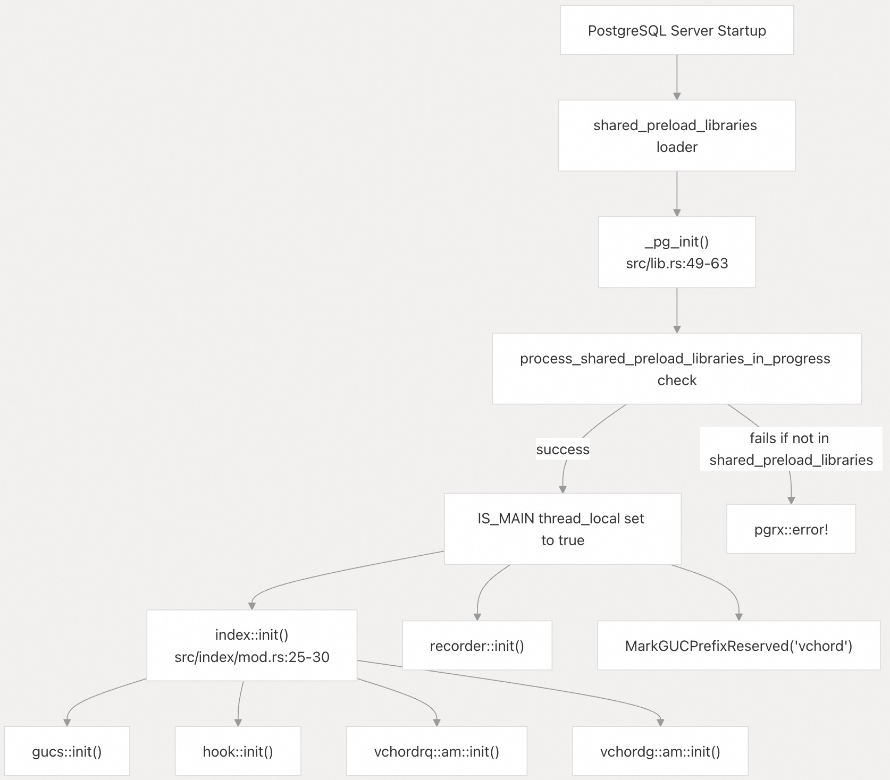
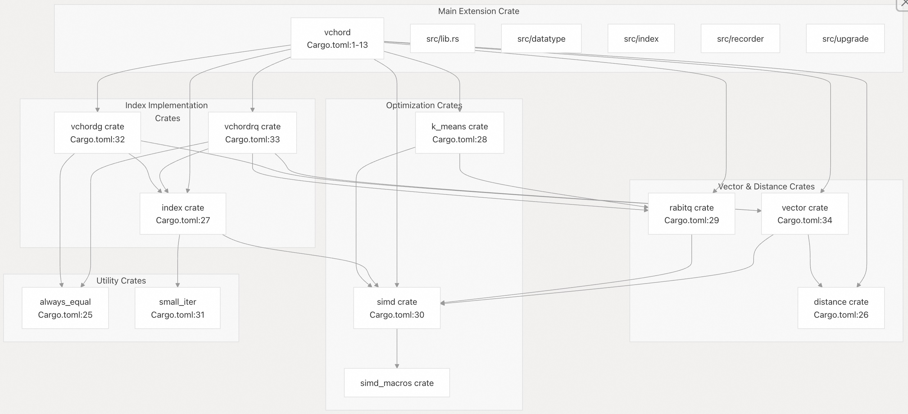
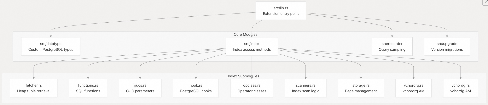
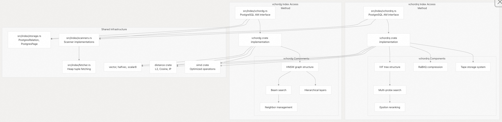
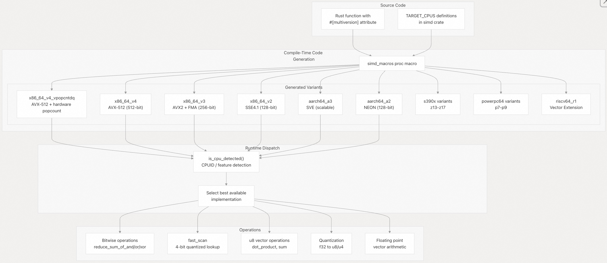
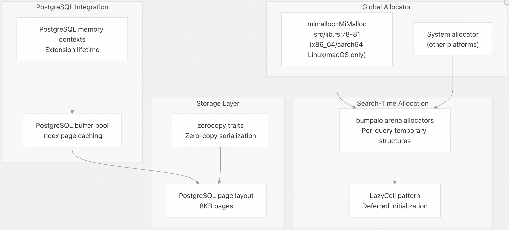
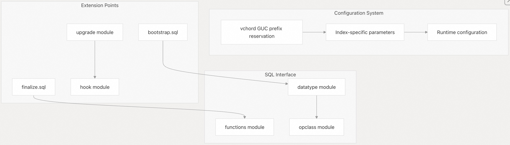

## VectorChord 源码学习: 2 架构（Architecture）  
      
### 作者      
digoal      
      
### 日期      
2025-10-30      
      
### 标签      
VectorChord , 源码学习      
      
----      
      
## 背景      
本文介绍 **VectorChord** 的高层架构设计：它如何作为 `shared_preload_libraries` 扩展集成到 **PostgreSQL** 中，工作区（workspace）的 **crate** 结构，以及两个互补的索引访问方法（index access methods）（`vchordrq` 和 `vchordg`）。  
  
## 系统概览（System Overview）  
  
**VectorChord** 是一个使用 **PGRX 框架**构建的 **PostgreSQL 扩展**（PostgreSQL extension），用于提供高性能的向量相似性搜索（vector similarity search）。它**必须通过 `shared_preload_libraries` 加载**，才能正确初始化其**索引访问方法**（index access methods）和配置系统。该扩展被构建为一个 **Rust 工作区**（Rust workspace），包含一个主扩展 **crate**（`vchord`），该 **crate** 集成了多个专业的内部 **crate**，每个 **crate** 负责不同的功能。  
  
该系统提供了两个针对不同用例优化的**索引访问方法**：  
  
* **`vchordrq`**: 采用 **RaBitQ 量化**（RaBitQ quantization）的**倒排文件索引**（Inverted File Index），适用于大规模、内存受限的部署。  
* **`vchordg`**: **基于图的索引**（Graph-based index）（类似于 **HNSW**），适用于需要亚秒级延迟（sub-second latency）的中等规模部署。  
  
## 高层架构（High-Level Architecture）  
  
### PostgreSQL 集成和扩展加载（PostgreSQL Integration and Extension Loading）  
  
  
  
**图 1：扩展初始化序列（Extension Initialization Sequence）**  
  
该扩展**要求**通过 `shared_preload_libraries` 加载，因为它注册了必须在建立任何数据库连接之前可用的**自定义索引访问方法**（custom index access methods）。`_pg_init()` 函数作为扩展的**入口点**（entry point），负责协调所有子系统的初始化。  
  
来源:  
- [`src/lib.rs` 49-63](https://github.com/tensorchord/VectorChord/blob/ac12e257/src/lib.rs#L49-L63)  
- [`src/index/mod.rs` 25-30](https://github.com/tensorchord/VectorChord/blob/ac12e257/src/index/mod.rs#L25-L30)  
  
### 工作区 Crate 结构（Workspace Crate Structure）  
  
  
  
**图 2：Rust 工作区 Crate 依赖关系（Rust Workspace Crate Dependencies）**  
  
该工作区的设计明确了关注点的分离（separation of concerns）。主 **`vchord` crate** 通过 **PGRX** 处理 **PostgreSQL** 集成，而专业的 **crate** 负责实现核心功能。这种模块化设计（modular design）使得组件可以独立进行测试和开发。  
  
来源:  
- [`Cargo.toml` 1-113](https://github.com/tensorchord/VectorChord/blob/ac12e257/Cargo.toml#L1-L113)  
- [`Cargo.toml` 24-34](https://github.com/tensorchord/VectorChord/blob/ac12e257/Cargo.toml#L24-L34)  
- [`Cargo.toml` 55-57](https://github.com/tensorchord/VectorChord/blob/ac12e257/Cargo.toml#L55-L57)  
  
## 主扩展模块结构（Main Extension Module Structure）  
  
**`vchord` crate** 被组织成专注的模块，负责处理扩展的不同方面：  
  
  
  
**图 3：主扩展模块组织（Main Extension Module Organization）**  
  
每个模块都有特定的职责：  
  
* **`datatype`**: 实现 `scalar8`、`sphere_*` 类型和操作符（operators）  
* **`index`**: 协调索引访问方法（index access method）的实现  
* **`recorder`**: 管理查询采样（query sampling）到 **SQLite**，用于性能分析  
* **`upgrade`**: 处理扩展版本升级  
  
来源:  
- [`src/lib.rs` 18-21](https://github.com/tensorchord/VectorChord/blob/ac12e257/src/lib.rs#L18-L21)  
- [`src/index/mod.rs` 15-23](https://github.com/tensorchord/VectorChord/blob/ac12e257/src/index/mod.rs#L15-L23)  
  
## 双索引访问方法架构（Dual Index Access Method Architecture）  
  
**VectorChord** 提供了两种互补的索引访问方法，每种方法都实现了 **PostgreSQL `IndexAmRoutine` 接口**，但针对不同的部署场景进行了优化。  
  
### 索引方法比较（Index Method Comparison）  
  
| 特性（Feature） | vchordrq | vchordg |  
| :--- | :--- | :--- |  
| **结构（Structure）** | 倒排文件索引（Inverted File Index, IVF） | **分层可导航小世界**（Hierarchical Navigable Small World, HNSW-like） |  
| **压缩（Compression）** | **RaBitQ 4 位量化**（RaBitQ 4-bit quantization） | 无压缩 |  
| **内存效率（Memory Efficiency）** | 极高（4 位代码） | 标准（完整向量） |  
| **构建策略（Build Strategies）** | 默认、内部 k-means、外部 GPU | 标准图构建 |  
| **搜索参数（Search Parameters）** | `probes`、`epsilon` | `ef_search` |  
| **最佳用途（Best For）** | 1 亿以上向量、内存受限（memory-constrained） | 中等规模、亚秒级延迟（sub-second latency） |  
| **独特特性（Unique Features）** | MaxSim 操作符、**重排序**（reranking） | 动态插入 |  
| **距离度量（Distance Metrics）** | L2、余弦（Cosine）、IP、MaxSim | L2、余弦（Cosine）、IP |  
  
来源:  
- [`Cargo.toml` 32-33](https://github.com/tensorchord/VectorChord/blob/ac12e257/Cargo.toml#L32-L33)  
- [`src/index/mod.rs` 22-23](https://github.com/tensorchord/VectorChord/blob/ac12e257/src/index/mod.rs#L22-L23)  
  
### 架构图（Architecture Diagram）  
  
  
**图 4：双索引架构（Dual Index Architecture）**  
  
两种索引方法都实现了相同的 **PostgreSQL 访问方法接口**（access method interface），但采用了截然不同的底层方法。`vchordrq` 索引通过激进的压缩（aggressive compression）在规模上表现出色，而 `vchordg` 则为较小的数据集提供了可预测的性能。  
  
来源:  
- [`src/index/mod.rs` 22-23](https://github.com/tensorchord/VectorChord/blob/ac12e257/src/index/mod.rs#L22-L23)  
- [`src/index/vchordrq.rs`](https://github.com/tensorchord/VectorChord/blob/ac12e257/src/index/vchordrq.rs)  
- [`src/index/vchordg.rs`](https://github.com/tensorchord/VectorChord/blob/ac12e257/src/index/vchordg.rs)  
  
## 内部 Crate 详情（Internal Crate Details）  
  
该工作区包含 14 个内部 **crate**，每个 **crate** 在系统架构中都有特定的作用。  
  
### 核心 Crate（Core Crates）  
  
| Crate | 位置（Location） | 用途（Purpose） | 关键依赖（Key Dependencies） |  
| :--- | :--- | :--- | :--- |  
| **vchord** | `Cargo.toml:1-13` | 主 **PostgreSQL 扩展**、**PGRX** 集成 | `pgrx`、`pgrx-catalog`、`vchordrq`、`vchordg`、`simd`、`rabitq`、`k_means` |  
| **vchordrq** | `Cargo.toml:33` | **IVF** + **RaBitQ 量化索引**实现 | `index`、`rabitq`、`simd`、`vector`、`distance`、`pin-project` |  
| **vchordg** | `Cargo.toml:32` | **基于图的 HNSW 索引**实现 | `index`、`simd`、`vector`、`distance`、`min-max-heap` |  
| **index** | `Cargo.toml:27` | **共享索引基础设施**和算法 | `distance`、`simd`、`vector`、`small_iter`、`dary_heap`、`bumpalo` |  
  
来源:  
- [`Cargo.toml` 24-34](https://github.com/tensorchord/VectorChord/blob/ac12e257/Cargo.toml#L24-L34)  
- [`Cargo.lock` 15-1614](https://github.com/tensorchord/VectorChord/blob/ac12e257/Cargo.lock#L15-L1614)  
  
### 优化和计算 Crate（Optimization and Computation Crates）  
  
| Crate | 位置（Location） | 用途（Purpose） | 关键依赖（Key Dependencies） |  
| :--- | :--- | :--- | :--- |  
| **simd** | `Cargo.toml:30` | 多架构 **SIMD 操作**、**运行时调度**（runtime dispatch） | `simd_macros`、`half`、`seq-macro`、`cc` (build) |  
| **simd_macros** | 由 simd 引用 | **多版本编译**（multiversion compilation）的**过程宏**（Procedural macros） | `proc-macro2`、`quote`、`syn` |  
| **rabitq** | `Cargo.toml:29` | **RaBitQ 向量量化**和压缩 | `simd`、`rand`、`rand_chacha`、`zerocopy` |  
| **k_means** | `Cargo.toml:28` | 用于中心点训练的 **K-means 聚类**（clustering） | `rabitq`、`simd`、`rayon` |  
  
来源:  
- [`Cargo.toml` 28-30](https://github.com/tensorchord/VectorChord/blob/ac12e257/Cargo.toml#L28-L30)  
- [`Cargo.lock` 1308-1328](https://github.com/tensorchord/VectorChord/blob/ac12e257/Cargo.lock#L1308-L1328)  
  
### 向量和距离 Crate（Vector and Distance Crates）  
  
| Crate | 位置（Location） | 用途（Purpose） | 关键依赖（Key Dependencies） |  
| :--- | :--- | :--- | :--- |  
| **vector** | `Cargo.toml:34` | 向量数据类型（`vector`、`halfvec`、`scalar8`） | `distance`、`simd` |  
| **distance** | `Cargo.toml:26` | 距离度量（Distance metric）实现（L2、余弦（Cosine）、IP） | `zerocopy` |  
  
来源:  
- [`Cargo.toml` 26-34](https://github.com/tensorchord/VectorChord/blob/ac12e257/Cargo.toml#L26-L34)  
- [`Cargo.lock` 331-1628](https://github.com/tensorchord/VectorChord/blob/ac12e257/Cargo.lock#L331-L1628)  
  
### 实用工具 Crate（Utility Crates）  
  
| Crate | 位置（Location） | 用途（Purpose） | 依赖关系（Dependencies） |  
| :--- | :--- | :--- | :--- |  
| **always_equal** | `Cargo.toml:25` | 用于相等性的**零大小标记类型**（Zero-size marker type） | 无 |  
| **small_iter** | `Cargo.toml:31` | **栈分配迭代器**（Stack-allocated iterator）实用工具 | 无 |  
  
来源:  
- [`Cargo.toml` 25-31](https://github.com/tensorchord/VectorChord/blob/ac12e257/Cargo.toml#L25-L31)  
- [`Cargo.lock` 15-1332](https://github.com/tensorchord/VectorChord/blob/ac12e257/Cargo.lock#L15-L1332)  
  
### 外部依赖（External Dependencies）  
  
关键的外部依赖包括：  
  
* **pgrx 0.16.1**: **PostgreSQL 扩展框架**，**Rust-to-SQL 桥接**（bridge）([`Cargo.toml` 39](https://github.com/tensorchord/VectorChord/blob/ac12e257/Cargo.toml#L39-L39))  
* **mimalloc**: 适用于 x86_64/aarch64 Linux/macOS 的高性能**分配器**（allocator）([`Cargo.toml` 49-50](https://github.com/tensorchord/VectorChord/blob/ac12e257/Cargo.toml#L49-L50), [`src/lib.rs` 78-81](https://github.com/tensorchord/VectorChord/blob/ac12e257/src/lib.rs#L78-L81))  
* **bumpalo**: 用于临时搜索结构的**竞技场分配器**（Arena allocator），在搜索完成后自动释放 ([`Cargo.toml` 36](https://github.com/tensorchord/VectorChord/blob/ac12e257/Cargo.toml#L36-L36))  
* **dary\_heap**: 用于高效**优先级队列**（priority queues）的 **D-ary 堆** ([`Cargo.toml` 37](https://github.com/tensorchord/VectorChord/blob/ac12e257/Cargo.toml#L37-L37))  
* **rusqlite**: 用于查询采样的**嵌入式 SQLite** ([`Cargo.toml` 42](https://github.com/tensorchord/VectorChord/blob/ac12e257/Cargo.toml#L42-L42))  
* **rayon**: 用于 k-means 训练的**数据并行**（Data parallelism）([`Cargo.lock` 1125-1142](https://github.com/tensorchord/VectorChord/blob/ac12e257/Cargo.lock#L1125-L1142))  
* **zerocopy**: **零拷贝序列化**（Zero-copy serialization）特征（traits）([`Cargo.toml` 47](https://github.com/tensorchord/VectorChord/blob/ac12e257/Cargo.toml#L47-L47))  
  
来源:  
- [`Cargo.toml` 36-47](https://github.com/tensorchord/VectorChord/blob/ac12e257/Cargo.toml#L36-L47)  
- [`Cargo.lock` 1-1986](https://github.com/tensorchord/VectorChord/blob/ac12e257/Cargo.lock#L1-L1986)  
  
## SIMD 优化架构（SIMD Optimization Architecture）  
  
**VectorChord** 通过复杂的**多架构 SIMD 系统**（multi-architecture SIMD system），实现了**可移植**（portable）的**高性能**。该系统在编译时生成专业化的代码变体，并在运行时选择最优的实现。  
  
### 多版本编译系统（Multiversion Compilation System）  
  
  
**图 5：SIMD 多版本架构（SIMD Multiversion Architecture）**  
  
该系统在编译时生成每个 **SIMD 函数**的多个实现，每个实现针对不同的 **CPU 特性级别**（CPU feature level）。在运行时，`is_cpu_detected()` 查询 **CPU 能力**（CPU capabilities）并分派（dispatches）到最优化可用的变体。这种方法提供了最佳性能，而无需手动编写针对特定架构的代码路径。  
  
来源:  
- [`Cargo.toml` 30](https://github.com/tensorchord/VectorChord/blob/ac12e257/Cargo.toml#L30-L30)  
- [`Cargo.lock` 1308-1328](https://github.com/tensorchord/VectorChord/blob/ac12e257/Cargo.lock#L1308-L1328)  
  
### 架构支持矩阵（Architecture Support Matrix）  
  
| 架构（Architecture） | 变体（Variants） | 关键特性（Key Features） | 硬件 Popcount（Hardware Popcount） |  
| :--- | :--- | :--- | :--- |  
| **x86\_64** | v2, v3, v4, v4+vpopcntdq | SSE4.1 → AVX2 → AVX-512 | 仅 v4+vpopcntdq |  
| **aarch64** | a2, a3 | NEON (128-bit), SVE (scalable) | 通过 NEON 指令 |  
| **s390x** | z13-z17 | 向量设备（Vector Facility） | 是 |  
| **powerpc64** | p7-p9 | AltiVec, VSX | 是 |  
| **riscv64** | r1 | 向量扩展（Vector Extension） | 待定（TBD） |  
  
`x86_64_v4_vpopcntdq` 变体通过使用**硬件种群计数指令**（hardware population count instructions），为**位操作**（bitwise operations）提供了显著的性能改进，这对于 **RaBitQ 距离计算**至关重要。  
  
来源:  
- [`Cargo.toml` 30](https://github.com/tensorchord/VectorChord/blob/ac12e257/Cargo.toml#L30-L30)  
  
### 内存管理（Memory Management）  
  
  
**图 6：内存管理层次结构（Memory Management Hierarchy）**  
  
**VectorChord** 使用了多种**分配策略**（allocation strategies）：  
  
* **mimalloc**: **全局分配器**（Global allocator），用于支持平台上的通用分配  
* **bumpalo**: **竞技场分配器**（Arena allocators），用于临时搜索结构，在搜索完成后自动释放  
* **PostgreSQL 上下文**（PostgreSQL contexts）: 与 **PostgreSQL 内存管理**集成，用于扩展生命周期  
* **zerocopy**: 实现了**高效序列化**（efficient serialization），无需中间拷贝  
  
来源:  
- [`src/lib.rs` 78-81](https://github.com/tensorchord/VectorChord/blob/ac12e257/src/lib.rs#L78-L81)  
- [`Cargo.toml` 36-50](https://github.com/tensorchord/VectorChord/blob/ac12e257/Cargo.toml#L36-L50)  
  
## 配置和扩展点（Configuration and Extension Points）  
  
该系统通过 **PostgreSQL 的 GUC**（Grand Unified Configuration，大一统配置）系统提供了广泛的配置，并支持各种**扩展点**（extension points）。  
  
  
  
来源:  
- [`src/lib.rs` 46-47](https://github.com/tensorchord/VectorChord/blob/ac12e257/src/lib.rs#L46-L47)  
- [`src/lib.rs` 62](https://github.com/tensorchord/VectorChord/blob/ac12e257/src/lib.rs#L62-L62)  
- [`src/index/mod.rs` 17-19](https://github.com/tensorchord/VectorChord/blob/ac12e257/src/index/mod.rs#L17-L19)  
  
这种架构使 **VectorChord** 能够提供高性能的**向量相似性搜索**，同时保持清晰的**关注点分离**（separation of concerns）和面向未来增强的**可扩展性**（extensibility）。  
      
#### [期望 PostgreSQL|开源PolarDB 增加什么功能?](https://github.com/digoal/blog/issues/76 "269ac3d1c492e938c0191101c7238216")
  
  
#### [PolarDB 开源数据库](https://openpolardb.com/home "57258f76c37864c6e6d23383d05714ea")
  
  
#### [PolarDB 学习图谱](https://www.aliyun.com/database/openpolardb/activity "8642f60e04ed0c814bf9cb9677976bd4")
  
  
#### [PostgreSQL 解决方案集合](../201706/20170601_02.md "40cff096e9ed7122c512b35d8561d9c8")
  
  
#### [德哥 / digoal's Github - 公益是一辈子的事.](https://github.com/digoal/blog/blob/master/README.md "22709685feb7cab07d30f30387f0a9ae")
  
  
#### [About 德哥](https://github.com/digoal/blog/blob/master/me/readme.md "a37735981e7704886ffd590565582dd0")
  
  

  
