## VectorChord 源码学习: 2.1 PostgreSQL 扩展集成（PostgreSQL Extension Integration）  
        
### 作者        
digoal        
        
### 日期        
2025-10-30        
        
### 标签        
VectorChord , 源码学习        
        
----        
        
## 背景        
本文解释了 VectorChord 如何使用 **pgrx 框架**（framework）作为**扩展**（extension）与 **PostgreSQL** 集成。涵盖了扩展初始化顺序、索引访问方法（Index Access Method）注册、回调（callback）生命周期、扫描操作、并行构建基础设施，以及与 PostgreSQL **缓冲区管理**（buffer management）和**事务系统**（transaction systems）的交互。  
  
## 扩展初始化顺序（Extension Initialization Sequence）  
  
VectorChord 需要通过 `shared_preload_libraries` 加载，以确保在建立数据库连接之前进行正确的初始化。`_PG_init()` 函数作为扩展的**入口点**（entry point）。  
  
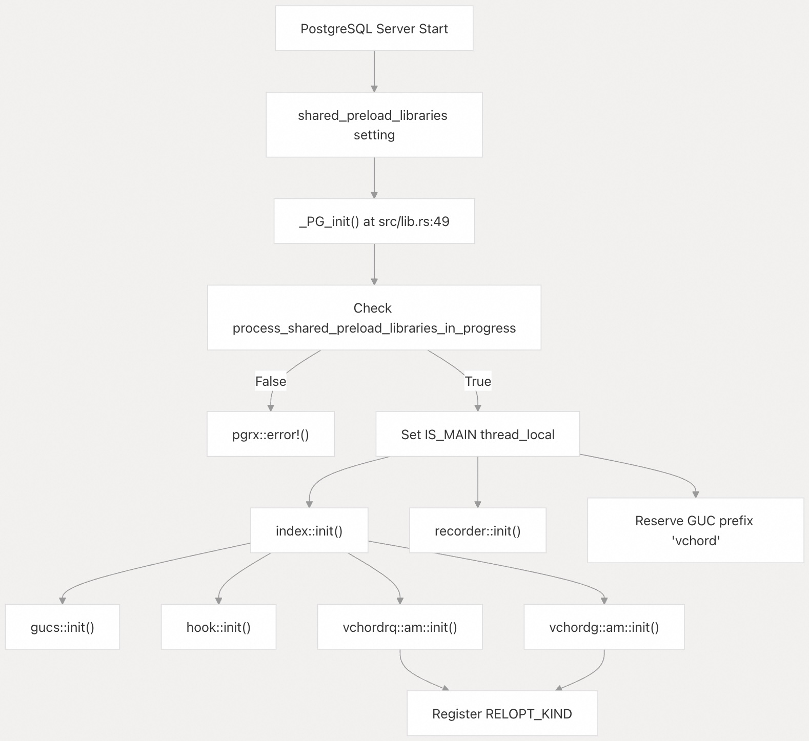  
  
初始化强制执行严格的加载要求：  
```  
if !unsafe { pgrx::pg_sys::process_shared_preload_libraries_in_progress } {  
    pgrx::error!("vchord must be loaded via shared_preload_libraries.");  
}  
```  
  
`IS_MAIN` **线程局部变量**（thread-local variable）用于跟踪当前线程是否是主初始化线程，这用于区分主进程和**后台工作者**（background workers）。  
  
**来源:**  
- [`src/lib.rs` 48-63](https://github.com/tensorchord/VectorChord/blob/ac12e257/src/lib.rs#L48-L63)  
- [`src/index/mod.rs` 25-30](https://github.com/tensorchord/VectorChord/blob/ac12e257/src/index/mod.rs#L25-L30)  
  
## pgrx 框架与模块魔术（pgrx Framework and Module Magic）  
  
VectorChord 使用 **pgrx 框架**将 **Rust 代码**桥接到 PostgreSQL 的 **C API**。`pg_module_magic!()` **宏**（macro）声明了必要的扩展**元数据**（metadata）。  
  
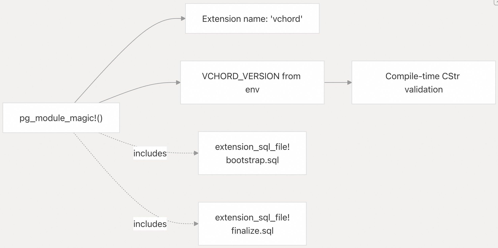  
  
| pgrx 组件（Component） | 目的（Purpose） |  
| --- | --- |  
| `pg_module_magic!()` | 声明扩展名称和版本 |  
| `#[pgrx::pg_guard]` | 包装 C 回调，以处理错误和内存上下文（memory contexts） |  
| `#[pgrx::pg_extern]` | 将 Rust 函数导出为 **SQL 可调用函数**（SQL-callable functions） |  
| `extension_sql_file!()` | 嵌入在 `CREATE EXTENSION` 期间执行的 **SQL 脚本** |  
  
版本字符串在**编译时**（compile time）经过验证，确保不包含**空字节**（null bytes），以防止**运行时错误**（runtime errors）。  
  
**来源:** [`src/lib.rs` 23-46](https://github.com/tensorchord/VectorChord/blob/ac12e257/src/lib.rs#L23-L46)  
  
## 索引访问方法处理器（Index Access Method Handlers）  
  
`vchordrq` 和 `vchordg` 两种索引类型都注册了**访问方法处理器**（access method handlers），这些处理器返回 `IndexAmRoutine` 结构体。当对相应索引类型执行操作时，PostgreSQL 会调用这些处理器。  
  
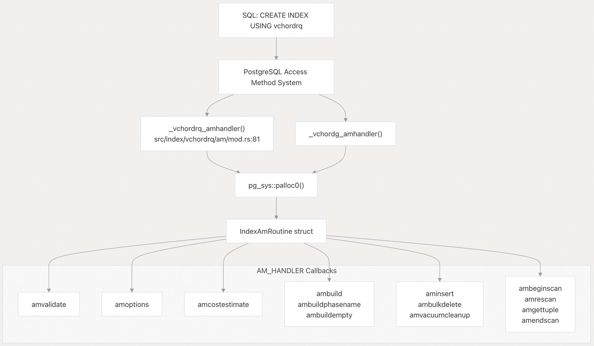  
  
`AM_HANDLER` **常量**（constant）定义了完整的**回调结构**（callback structure）：  
  
| 回调（Callback） | 签名（Signature） | 目的（Purpose） |  
| --- | --- | --- |  
| `amvalidate` | `(Oid) -> bool` | 验证操作符类（operator class）配置 |  
| `amoptions` | `(Datum, bool) -> *bytea` | 解析并验证关系选项（relation options） |  
| `amcostestimate` | `(*PlannerInfo, *IndexPath, ...) -> void` | 为查询规划器（query planner）估计扫描成本 |  
| `ambuild` | `(Relation, Relation, *IndexInfo) -> *IndexBuildResult` | 从堆表（heap table）构建索引 |  
| `ambuildempty` | `(Relation) -> void` | 为**非日志表**（unlogged tables）创建空索引 |  
| `aminsert` | `(Relation, *Datum, *bool, ItemPointer, ...) -> bool` | 插入**单个向量**（single vector） |  
| `ambulkdelete` | `(*IndexVacuumInfo, *IndexBulkDeleteResult, ...) -> *IndexBulkDeleteResult` | **批量删除**（Bulk deletes）**失效元组**（dead tuples） |  
| `amvacuumcleanup` | `(*IndexVacuumInfo, *IndexBulkDeleteResult) -> *IndexBulkDeleteResult` | **Post-vacuum** 维护（清除操作后的维护） |  
| `ambeginscan` | `(Relation, int, int) -> IndexScanDesc` | 初始化索引扫描（index scan） |  
| `amrescan` | `(IndexScanDesc, ScanKey, int, ScanKey, int) -> void` | 重置扫描参数 |  
| `amgettuple` | `(IndexScanDesc, ScanDirection) -> bool` | 获取下一个匹配的**元组**（tuple） |  
| `amendscan` | `(IndexScanDesc) -> void` | 结束扫描并释放资源 |  
  
**来源:** [`src/index/vchordrq/am/mod.rs` 80-129](https://github.com/tensorchord/VectorChord/blob/ac12e257/src/index/vchordrq/am/mod.rs#L80-L129)  
  
## 关系选项系统（Relation Options System）  
  
VectorChord 使用 PostgreSQL 的**关系选项机制**（relation options mechanism）将索引配置存储为 **TOML 字符串**。`RELOPT_KIND` 在初始化期间注册一次。  
  
  
  
`Reloption` 结构体布局：  
```  
#[repr(C)]  
struct Reloption {  
    vl_len_: i32,      // PostgreSQL variable-length header  
    pub options: i32,  // Offset to options string  
}  
```  
  
`Reloption::options()` 方法提取嵌入的 **C 字符串**（C string）：  
```  
unsafe fn options<'a>(this: *const Self) -> &'a CStr {  
    unsafe {  
        let ptr = this.cast::<u8>()  
            .add((&raw const (*this).options).read() as _);  
        CStr::from_ptr(ptr.cast())  
    }  
}  
```  
  
**来源:**   
- [`src/index/vchordrq/am/mod.rs` 35-78](https://github.com/tensorchord/VectorChord/blob/ac12e257/src/index/vchordrq/am/mod.rs#L35-L78)   
- [`src/index/vchordrq/am/mod.rs` 136-153](https://github.com/tensorchord/VectorChord/blob/ac12e257/src/index/vchordrq/am/mod.rs#L136-L153)  
  
## 查询规划的成本估计（Cost Estimation for Query Planning）  
  
`amcostestimate` **回调**对于 PostgreSQL 的**查询规划器**（query planner）决定是否使用向量索引至关重要。它根据索引统计数据和搜索参数计算**启动成本**（startup）和**总成本**（total costs）。  
  
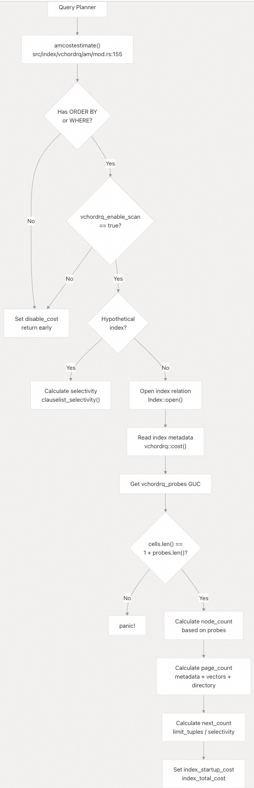  
  
成本计算公式：  
```  
// Node count: sum of nodes visited at each level  
let mut node_count = 0.0;  
for (scale, (numerator, denumerator)) in scale.zip(numerator.zip(denumerator)) {  
    node_count += (scale as f64) * 1.0f64.min((numerator as f64) / (denumerator as f64));  
}  
  
// Page count: metadata + vector pages + directory  
let mut page_count = 0.0;  
page_count += 1.0;  // metadata page  
page_count += node_count * cost.dims as f64 / 60000.0;  // centroid pages  
page_count += probes.iter().sum::<u32>() as f64 * {...};  // result pages  
page_count += cost.cells[0] as f64;  // directory pages  
  
// Costs  
let next_count = f64::max(1.0, (*root).limit_tuples) * f64::min(1000.0, 1.0 / selectivity);  
*index_startup_cost = 0.001 * node_count;  
*index_total_cost = 0.001 * node_count + next_count;  
```  
  
当出现以下情况时，该函数会设置 `disable_cost`（实际上是**无穷大**）：  
  
1. 没有 `ORDER BY` 或 `WHERE` 子句引用索引列  
2. `vchordrq.enable_scan` **GUC** 设置为 `false`  
  
**来源:**   
- [`src/index/vchordrq/am/mod.rs` 155-263](https://github.com/tensorchord/VectorChord/blob/ac12e257/src/index/vchordrq/am/mod.rs#L155-L263)  
  
## 扫描生命周期和迭代器模式（Scan Lifecycle and Iterator Pattern）  
  
向量搜索查询遵循**四个阶段的生命周期**：开始（begin）、重新扫描（rescan）、获取元组（get tuples）、结束（end）。VectorChord 使用带有**迭代器**（iterators）的**惰性求值模式**（lazy evaluation pattern）。  
  
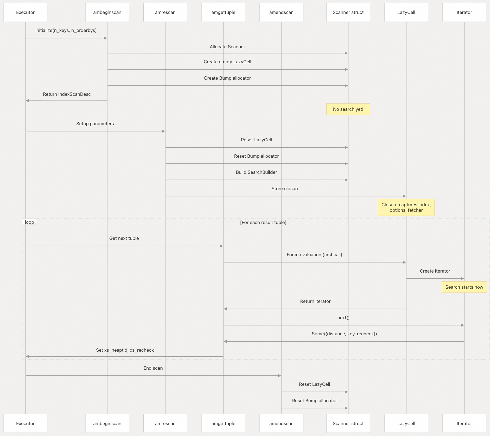  
  
### 扫描器结构（Scanner Structure）  
```  
pub struct Scanner {  
    pub hack: Option<NonNull<pgrx::pg_sys::IndexScanState>>,  
    scanning: LazyCell<Iter, Box<dyn FnOnce() -> Iter>>,  
    bump: Box<bumpalo::Bump>,  
}  
  
type Iter = Box<dyn Iterator<Item = (f32, [u16; 3], bool)>>;  
```  
  
关键设计特征：  
  
| 组件（Component） | 目的（Purpose） |  
| --- | --- |  
| `hack` | 指向 `IndexScanState` 的可选指针，用于**执行器集成**（executor integration） |  
| `scanning: LazyCell` | 将**搜索执行**推迟到**首次元组请求** |  
| `bump: Box<Bump>` | 用于**临时数据**的**快速竞技场分配器**（Fast arena allocator） |  
| 迭代器项（Iterator item） | `(distance, key=[block,offset,extra], recheck)` |  
  
### 惰性求值优势（Lazy Evaluation Benefits）  
  
1. **提前终止**（Early termination）：如果扫描被取消，搜索永远不会执行  
2. **参数验证**（Parameter validation）：所有参数在搜索前得到验证  
3. **内存效率**（Memory efficiency）：分配发生在 `Bump` 中，**批量释放**（bulk freed）  
  
**来源:**   
- [`src/index/vchordrq/am/mod.rs` 408-576](https://github.com/tensorchord/VectorChord/blob/ac12e257/src/index/vchordrq/am/mod.rs#L408-L576)   
- [`src/index/vchordrq/am/mod.rs` 578-584](https://github.com/tensorchord/VectorChord/blob/ac12e257/src/index/vchordrq/am/mod.rs#L578-L584)  
  
## 插入操作（Insert Operations）  
  
`aminsert` **回调**处理**单行插入**（single-row insertions）。PostgreSQL 版本有不同的签名（signatures），通过**条件编译**（conditional compilation）来处理。  
  
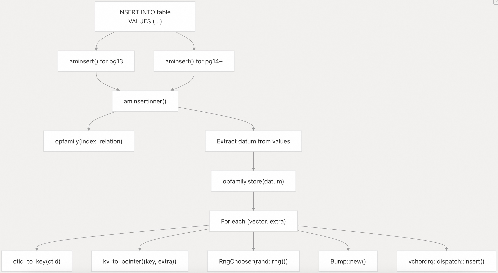  
  
`RngChooser` 为**随机单元格选择**（random cell selection）实现了 `Chooser` **trait**：  
```  
struct RngChooser<T>(T);  
impl<T: RngCore> Chooser for RngChooser<T> {  
    fn choose(&mut self, n: NonZero<usize>) -> usize {  
        rand::Rng::random_range(&mut self.0, 0..n.get())  
    }  
}  
```  
  
对于**单次插入**（single inserts），**随机选择**将向量分布到不同的单元格中。在**并行构建**（parallel builds）期间，则使用基于**工作者 ID**（worker ID）的**确定性选择**（deterministic selection）。  
  
**来源:**   
- [`src/index/vchordrq/am/mod.rs` 265-336](https://github.com/tensorchord/VectorChord/blob/ac12e257/src/index/vchordrq/am/mod.rs#L265-L336)  
  
## 清理和维护操作（Vacuum and Maintenance Operations）  
  
两个回调处理**元组删除**（tuple deletion）和**索引维护**（index maintenance）：`ambulkdelete` 和 `amvacuumcleanup`。  
  
### ambulkdelete: 批量删除（Bulk Deletion）  
  
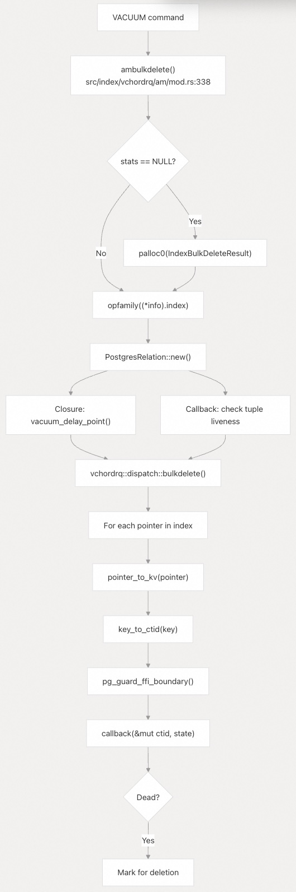  
  
### amvacuumcleanup: Post-Vacuum 维护  
  
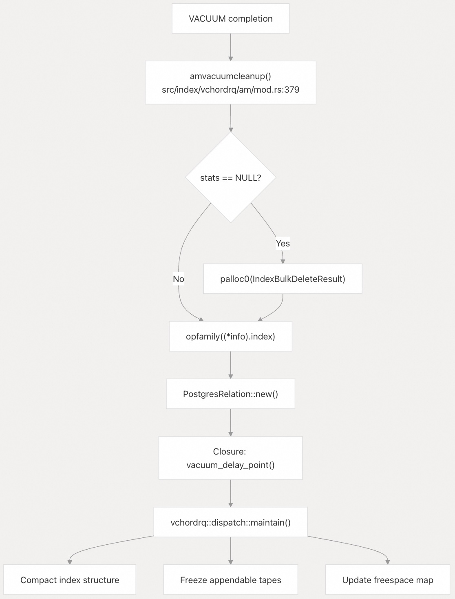  
  
两个回调都使用 `vacuum_delay_point()` 与 PostgreSQL 的**清理节流机制**（vacuum throttling mechanism）协作：  
```  
let check = || unsafe {  
    #[cfg(any(feature = "pg13", ..., feature = "pg17"))]  
    pgrx::pg_sys::vacuum_delay_point();  
    #[cfg(feature = "pg18")]  
    pgrx::pg_sys::vacuum_delay_point(false);  
};  
```  
  
**来源:**   
- [`src/index/vchordrq/am/mod.rs` 338-406](https://github.com/tensorchord/VectorChord/blob/ac12e257/src/index/vchordrq/am/mod.rs#L338-L406)  
  
## 并行构建基础设施（Parallel Build Infrastructure）  
  
VectorChord 支持在 PostgreSQL 17+ 上使用**共享内存**（shared memory）进行**工作者协调**（worker coordination）的**并行索引构建**（parallel index builds）。  
  
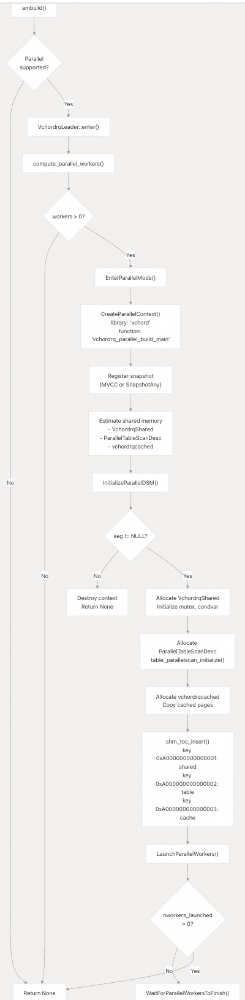  
  
### VchordrqShared 结构体  
  
**共享内存状态**包含**不可变配置**（immutable configuration）和**可变协调字段**（mutable coordination fields）：  
```  
struct VchordrqShared {  
    /* immutable state */  
    heaprelid: pgrx::pg_sys::Oid,  
    indexrelid: pgrx::pg_sys::Oid,  
    isconcurrent: bool,  
  
    /* locking */  
    mutex: pgrx::pg_sys::slock_t,  
    condvar_workers_done: pgrx::pg_sys::ConditionVariable,  
  
    /* mutable state */  
    workers_ready: i32,   // Workers that have started  
    workers_done: i32,    // Workers that have finished  
    indtuples: u64,       // Total tuples processed  
}  
```  
  
### 工作者协调协议（Worker Coordination Protocol）  
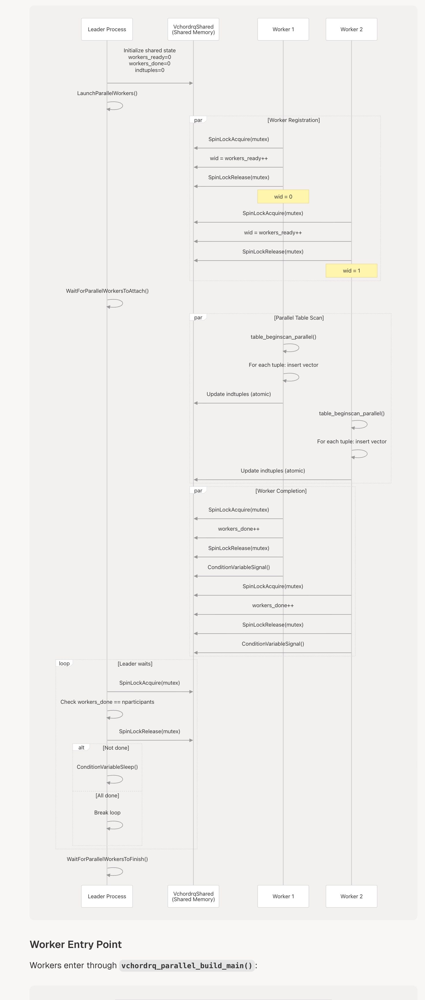  
  
### 工作者入口点（Worker Entry Point）  
  
工作者通过 `vchordrq_parallel_build_main()` 进入：  
  
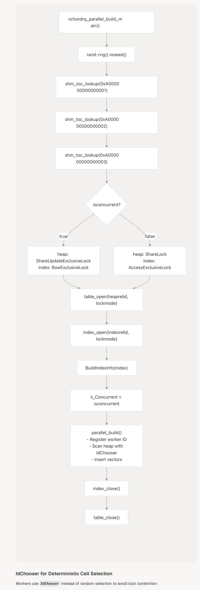  
  
### 用于确定性单元格选择的 IdChooser（IdChooser for Deterministic Cell Selection）  
  
工作者使用 `IdChooser` 而不是**随机选择**来避免**锁争用**（lock contention）：  
```  
struct IdChooser(u32);  // Worker ID  
impl Chooser for IdChooser {  
    fn choose(&mut self, n: NonZero<usize>) -> usize {  
        self.0 as usize % n.get()  
    }  
}  
```  
  
对于**工作者 ID** `wid`，向量根据 `wid % n_cells` 被**确定性地分配**给单元格。这确保了：  
  
1. 工作者之间**没有争用**  
2. **大致均匀分布**  
3. **可重现的构建**（Reproducible builds）  
  
**来源:**   
- [`src/index/vchordrq/am/am_build.rs` 432-770](https://github.com/tensorchord/VectorChord/blob/ac12e257/src/index/vchordrq/am/am_build.rs#L432-L770)   
- [`src/index/vchordrq/am/am_build.rs` 772-823](https://github.com/tensorchord/VectorChord/blob/ac12e257/src/index/vchordrq/am/am_build.rs#L772-L823)   
- [`src/index/vchordrq/am/am_build.rs` 825-941](https://github.com/tensorchord/VectorChord/blob/ac12e257/src/index/vchordrq/am/am_build.rs#L825-L941)   
- [`src/index/vchordrq/am/am_build.rs` 862-867](https://github.com/tensorchord/VectorChord/blob/ac12e257/src/index/vchordrq/am/am_build.rs#L862-L867)  
  
## 页面缓存优化（Page Cache Optimization）  
  
`vchordrqcached` 结构体允许在**并行构建**期间，将**频繁访问的页面**（frequently-accessed pages）**固定**（pinned）在**共享内存**中，从而减少**缓冲区管理器**（buffer manager）的**开销**（overhead）。  
  
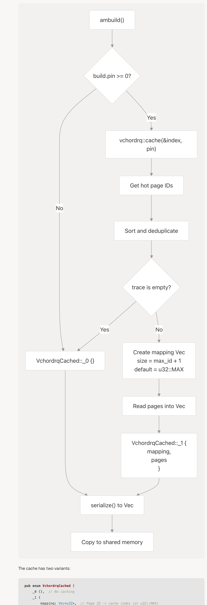  
  
缓存有两种变体：  
```  
pub enum VchordrqCached {  
    _0 {},  // No caching  
    _1 {  
        mapping: Vec<u32>,  // Page ID -> cache index (or u32::MAX)  
        pages: Vec<Box<PostgresPage<vchordrq::Opaque>>>,  
    },  
}  
```  
  
### CachingRelation 包装器  
  
工作者通过 `CachingRelation` **透明地**（transparently）访问**缓存的页面**：  
```  
struct CachingRelation<'a, R> {  
    cache: VchordrqCachedReader1<'a>,  
    relation: R,  
}  
  
impl RelationRead for CachingRelation<'_, R> {  
    fn read(&self, id: u32) -> Self::ReadGuard<'_> {  
        if let Some(page) = self.cache.get(id) {  
            CachingRelationReadGuard::Cached(id, page)  
        } else {  
            CachingRelationReadGuard::Wrapping(self.relation.read(id))  
        }  
    }  
}  
```  
  
`VchordrqCachedReader1::get()` 方法：  
```  
pub fn get(&self, id: u32) -> Option<&'a PostgresPage<vchordrq::Opaque>> {  
    let index = *self.mapping.get(id as usize)?;  
    if index == u32::MAX {  
        return None;  
    }  
    Some(&self.pages[index as usize])  
}  
```  
  
优势：  
  
* **减少缓冲区管理器开销**：热点页面（Hot pages）直接从共享内存访问  
* **减少锁争用**：**缓存页面**（cached pages）无需**缓冲区池锁**（buffer pool locks）  
* **更好的缓存局部性**（cache locality）：页面在内存中**连续**（contiguous）  
  
**来源:**   
- [`src/index/vchordrq/am/am_build.rs` 353-370](https://github.com/tensorchord/VectorChord/blob/ac12e257/src/index/vchordrq/am/am_build.rs#L353-L370)   
- [`src/index/vchordrq/am/am_build.rs` 449-579](https://github.com/tensorchord/VectorChord/blob/ac12e257/src/index/vchordrq/am/am_build.rs#L449-L579)   
- [`src/index/vchordrq/am/am_build.rs` 1363-1448](https://github.com/tensorchord/VectorChord/blob/ac12e257/src/index/vchordrq/am/am_build.rs#L1363-L1448)  
  
## 事务安全性与 MVCC（Transaction Safety and MVCC）  
  
VectorChord 通过**快照隔离**（snapshot isolation）和适当的**锁定**（locking）来遵守 PostgreSQL 的 **MVCC**（Multi-Version Concurrency Control，多版本并发控制）保证。  
  
### 快照类型强制（Snapshot Type Enforcement）  
  
索引扫描强制使用 **MVCC 快照**：  
```  
if unsafe { (*(*scan).xs_snapshot).snapshot_type } != pgrx::pg_sys::SnapshotType::SNAPSHOT_MVCC {  
    pgrx::error!("scanning with a non-MVCC-compliant snapshot is not supported");  
}  
```  
  
### 并发构建与非并发构建（Concurrent vs Non-Concurrent Builds）  
  
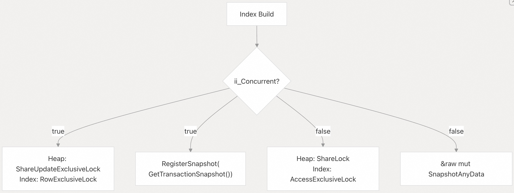  
  
锁模式比较：  
  
| 构建类型（Build Type） | 堆锁（Heap Lock） | 索引锁（Index Lock） | 快照（Snapshot） | 阻塞 DML？ |  
| --- | --- | --- | --- | --- |  
| **Concurrent**（并发） | `ShareUpdateExclusiveLock` | `RowExclusiveLock` | Transaction | No（否） |  
| **Normal**（普通） | `ShareLock` | `AccessExclusiveLock` | Any | Yes（是） |  
  
**并发构建**使用较弱的锁，以允许**并发的 INSERT/UPDATE/DELETE 操作**（concurrent INSERT/UPDATE/DELETE operations）。  
  
### 快照注册（Snapshot Registration）  
```  
let snapshot = if isconcurrent {  
    unsafe { pgrx::pg_sys::RegisterSnapshot(pgrx::pg_sys::GetTransactionSnapshot()) }  
} else {  
    &raw mut pgrx::pg_sys::SnapshotAnyData  
};  
```  
  
注册的**快照**（Snapshots）在**清理**（cleanup）期间被**注销**（unregistered）：  
```  
if is_mvcc_snapshot(self.snapshot) {  
    unsafe { pgrx::pg_sys::UnregisterSnapshot(self.snapshot); }  
}  
```  
  
**来源:**   
- [`src/index/vchordrq/am/mod.rs` 554-557](https://github.com/tensorchord/VectorChord/blob/ac12e257/src/index/vchordrq/am/mod.rs#L554-L557)  
- [`src/index/vchordrq/am/am_build.rs` 647-651](https://github.com/tensorchord/VectorChord/blob/ac12e257/src/index/vchordrq/am/am_build.rs#L647-L651)  
- [`src/index/vchordrq/am/am_build.rs` 792-798](https://github.com/tensorchord/VectorChord/blob/ac12e257/src/index/vchordrq/am/am_build.rs#L792-L798)   
- [`src/index/vchordrq/am/am_build.rs` 581-587](https://github.com/tensorchord/VectorChord/blob/ac12e257/src/index/vchordrq/am/am_build.rs#L581-L587)  
  
## GUC 参数注册（GUC Parameter Registration）  
  
**GUC**（Grand Unified Configuration）**参数**在 `gucs::init()` 期间注册，并预留在 `vchord` **前缀**下。  
  
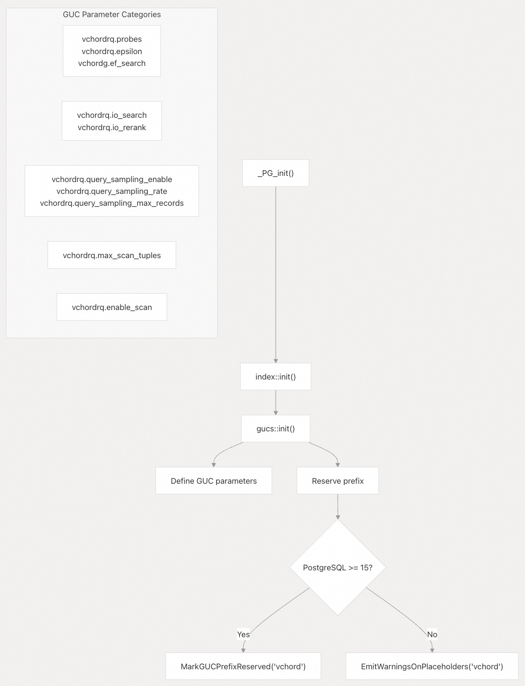  
  
前缀预留防止了**命名冲突**（naming conflicts）：  
```  
#[cfg(any(feature = "pg15", feature = "pg16", feature = "pg17", feature = "pg18"))]  
unsafe {  
    pgrx::pg_sys::MarkGUCPrefixReserved(c"vchord".as_ptr());  
}  
  
#[cfg(any(feature = "pg13", feature = "pg14"))]  
unsafe {  
    pgrx::pg_sys::EmitWarningsOnPlaceholders(c"vchord".as_ptr());  
}  
```  
  
在 **PostgreSQL 15+** 上，`MarkGUCPrefixReserved()` **阻止**其他扩展使用 `vchord.*` **命名空间**（namespace）。在早期版本上，`EmitWarningsOnPlaceholders()` **发出警告**。  
  
**来源:**   
- [`src/lib.rs` 58-62](https://github.com/tensorchord/VectorChord/blob/ac12e257/src/lib.rs#L58-L62)   
- [`src/index/vchordrq/am/mod.rs` 454-462](https://github.com/tensorchord/VectorChord/blob/ac12e257/src/index/vchordrq/am/mod.rs#L454-L462)  
  
## 内存上下文管理（Memory Context Management）  
  
VectorChord 使用 PostgreSQL 的**内存上下文系统**（memory context system）进行**自动清理**（automatic cleanup）。  
  
### 扫描状态分配（Scan State Allocation）  
  
**扫描器状态**（Scanner state）在**当前内存上下文**中分配：  
```  
let scanner: Scanner = Scanner {  
    hack: None,  
    scanning: LazyCell::new(Box::new(|| Box::new(std::iter::empty()))),  
    bump: Box::new(bumpalo::Bump::new()),  
};  
unsafe {  
    (*scan).opaque = CurrentMemoryContext  
        .leak_and_drop_on_delete(scanner)  
        .cast();  
}  
```  
  
`leak_and_drop_on_delete()` 方法：  
  
1. **泄漏**（Leaks）该值以防止 Rust **丢弃**（dropping）它  
2. 注册一个**回调**（callback），以便在**内存上下文被删除**时将其**丢弃**  
  
### 用于临时数据的 Bump 分配器（Bump Allocator for Temporary Data）  
  
每个扫描都维护一个 `bumpalo::Bump` **分配器**：  
```  
bump: Box<bumpalo::Bump>  
```  
  
**Bump 分配**（bump allocation）的优势：  
  
| 特性（Feature） | 优势（Benefit） |  
| --- | --- |  
| **快速分配**（Fast allocation） | 单个**指针增量**（pointer increment） |  
| **无每分配开销**（No per-allocation overhead） | 无**每分配**的元数据 |  
| **批量解除分配**（Bulk deallocation） | 单个 `reset()` 调用 |  
| **竞技场生命周期**（Arena lifetime） | 跨越多个 `amgettuple()` 调用 |  
  
**Bump 分配器**在两个地方被**重置**（reset）：  
  
1. `amrescan()`：当**扫描参数**改变时  
2. `amendscan()`：当**扫描完成**时  
  
```  
scanner.bump.reset();  
```  
  
**来源:**   
- [`src/index/vchordrq/am/mod.rs` 418-425](https://github.com/tensorchord/VectorChord/blob/ac12e257/src/index/vchordrq/am/mod.rs#L418-L425)   
- [`src/index/vchordrq/am/mod.rs` 451](https://github.com/tensorchord/VectorChord/blob/ac12e257/src/index/vchordrq/am/mod.rs#L451-L451)   
- [`src/index/vchordrq/am/mod.rs` 573-576](https://github.com/tensorchord/VectorChord/blob/ac12e257/src/index/vchordrq/am/mod.rs#L573-L576)  
  
## 错误处理与 FFI 边界（Error Handling and FFI Boundaries）  
  
VectorChord 使用 **pgrx guards** 安全地处理跨越 **Rust-C 边界**的错误。  
  
### pg_guard 注解（pg_guard Annotation）  
  
所有 PostgreSQL **回调**都用 `#[pgrx::pg_guard]` **注解**（annotated）：  
```  
#[pgrx::pg_guard]  
pub unsafe extern "C-unwind" fn aminsert(...) -> bool {  
    // Implementation  
}  
```  
  
**Guard 包装器**（The guard wrapper）：  
  
1. 设置 PostgreSQL **错误上下文**（error context）  
2. 捕获 Rust **Panic** 并转换为 PostgreSQL **错误**  
3. 在**展开**（unwinding）期间管理**内存上下文**  
4. **保留事务状态**（Preserves transaction state）  
  
### FFI 边界保护（FFI Boundary Protection）  
  
对 PostgreSQL C 代码的**回调**使用 `pg_guard_ffi_boundary`：  
```  
#[allow(ffi_unwind_calls, reason = "protected by pg_guard_ffi_boundary")]  
unsafe {  
    pg_guard_ffi_boundary(|| {  
        callback(&mut ctid, callback_state)  
    })  
}  
```  
  
这**保护**了代码免受 PostgreSQL 基于 `longjmp` 的**错误处理**的影响，否则会导致跳过 Rust **析构函数**（destructors）。  
  
**来源:**   
- [`src/index/vchordrq/am/mod.rs` 265-277](https://github.com/tensorchord/VectorChord/blob/ac12e257/src/index/vchordrq/am/mod.rs#L265-L277)   
- [`src/index/vchordrq/am/mod.rs` 370-373](https://github.com/tensorchord/VectorChord/blob/ac12e257/src/index/vchordrq/am/mod.rs#L370-L373)   
- [`src/index/vchordrq/am/am_build.rs` 215-230](https://github.com/tensorchord/VectorChord/blob/ac12e257/src/index/vchordrq/am/am_build.rs#L215-L230)  
  
## 全局分配器配置（Global Allocator Configuration）  
  
VectorChord 在支持的平台上使用 **mimalloc** 作为**全局分配器**（global allocator）：  
```  
#[cfg(not(miri))]  
#[cfg(any(target_arch = "x86_64", target_arch = "aarch64"))]  
#[cfg(any(target_os = "linux", target_os = "macos"))]  
#[global_allocator]  
static GLOBAL_ALLOCATOR: mimalloc::MiMalloc = mimalloc::MiMalloc;  
```  
  
平台要求：  
  
| 要求（Requirement） | 值（Value） |  
| --- | --- |  
| **架构**（Architecture） | `x86_64` 或 `aarch64` |  
| **操作系统**（Operating System） | Linux 或 macOS |  
| **非测试**（Not testing） | 未在 Miri 下运行 |  
  
**mimalloc** 提供了：  
  
* **线程局部分配缓存**（Thread-local allocation caches）  
* **快速分配/解除分配**  
* **更好的内存局部性**  
* **更低的碎片化**（Lower fragmentation）  
  
在**不支持的平台**上，使用**系统分配器**（system allocator）。  
  
**来源:**   
- [`src/lib.rs` 77-81](https://github.com/tensorchord/VectorChord/blob/ac12e257/src/lib.rs#L77-L81)  
      
#### [期望 PostgreSQL|开源PolarDB 增加什么功能?](https://github.com/digoal/blog/issues/76 "269ac3d1c492e938c0191101c7238216")
  
  
#### [PolarDB 开源数据库](https://openpolardb.com/home "57258f76c37864c6e6d23383d05714ea")
  
  
#### [PolarDB 学习图谱](https://www.aliyun.com/database/openpolardb/activity "8642f60e04ed0c814bf9cb9677976bd4")
  
  
#### [PostgreSQL 解决方案集合](../201706/20170601_02.md "40cff096e9ed7122c512b35d8561d9c8")
  
  
#### [德哥 / digoal's Github - 公益是一辈子的事.](https://github.com/digoal/blog/blob/master/README.md "22709685feb7cab07d30f30387f0a9ae")
  
  
#### [About 德哥](https://github.com/digoal/blog/blob/master/me/readme.md "a37735981e7704886ffd590565582dd0")
  
  

  
