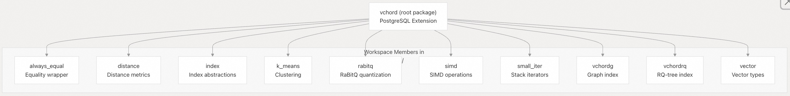
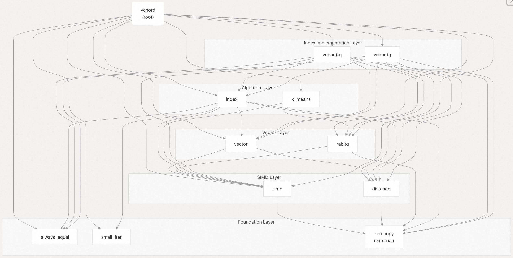
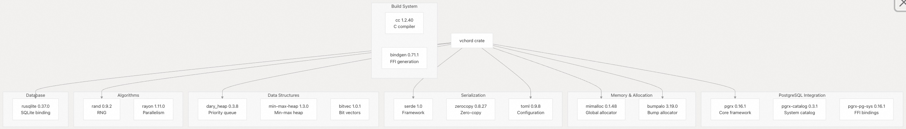

## VectorChord 源码学习: 2.2 Crate（包）结构和依赖项  
          
### 作者          
digoal          
          
### 日期          
2025-10-30          
          
### 标签          
VectorChord , 源码学习          
          
----          
          
## 背景          
本文介绍 **VectorChord** 的 Rust **workspace（工作区）** 结构，包括内部 **crates（包）** 的组织、它们的用途以及外部依赖图。这涵盖了静态代码组织和编译时依赖项。  
  
## 工作区组织 (Workspace Organization)  
  
**VectorChord** 被构建为一个 **Cargo workspace（Cargo 工作区）**，其中包含一个根 **package（包）** `vchord` 和位于 `crates/` 目录中的多个工作区成员 **crates（包）**。该工作区使用 **Cargo's workspace resolver version 3**（Cargo 工作区解析器版本 3），并维护共享的版本和 **linting（代码检查）** 配置。  
  
  
  
### 工作区配置 (Workspace Configuration)  
  
工作区在 [`Cargo.toml` 55-93](https://github.com/tensorchord/VectorChord/blob/ac12e257/Cargo.toml#L55-L93) 中定义了共享设置：  
  
  * **Edition（版本）**: Rust 2024  
  * **Version（版本）**: `0.0.0` (占位符，实际版本在构建时注入)  
  * **Resolver（解析器）**: 版本 3，用于改进依赖项解析  
  
### 共享依赖项 (Shared Dependencies)  
  
常见的**工作区依赖项**被定义一次并重复使用 [`Cargo.toml` 63-72](https://github.com/tensorchord/VectorChord/blob/ac12e257/Cargo.toml#L63-L72)：  
  
  * `bumpalo = "3.19.0"` - **Bump allocator**（碰撞分配器）  
  * `dary_heap = "0.3.8"` - **D-ary heap**（D 叉堆）数据结构  
  * `paste = "1.0.15"` - **Macro token pasting**（宏标记粘贴）  
  * `rand = "0.9.2"` - **Random number generation**（随机数生成）  
  * `rand_chacha = "0.9.0"` - **ChaCha RNG**（ChaCha 随机数生成器）  
  * `seq-macro = "0.3.6"` - **Sequence macros**（序列宏）  
  * `serde = { version = "1.0", features = ["derive"] }` - **Serialization**（序列化）  
  * `validator = { version = "0.20.0", features = ["derive"] }` - **Validation**（验证）  
  * `zerocopy = { version = "0.8.27", features = ["derive"] }` - **Zero-copy parsing**（零拷贝解析）  
  
**来源**:  
  
  - [`Cargo.toml` 1-113](https://github.com/tensorchord/VectorChord/blob/ac12e257/Cargo.toml#L1-L113)  
  - [`Cargo.toml` 55-93](https://github.com/tensorchord/VectorChord/blob/ac12e257/Cargo.toml#L55-L93)  
  
## 根扩展包: vchord (Root Extension Crate: vchord)  
  
`vchord` **crate（包）** 是主要的 **PostgreSQL extension library（PostgreSQL 扩展库）**，它集成了所有工作区成员并提供面向 **PostgreSQL** 的 **API**。  
  
### 包配置 (Crate Configuration)  
  
[`Cargo.toml` 1-13](https://github.com/tensorchord/VectorChord/blob/ac12e257/Cargo.toml#L1-L13) 定义了 **package（包）** 结构：  
  
  * **Name（名称）**: `vchord`  
  * **Library（库）**: `cdylib` 用于 **PostgreSQL** 动态加载，外加 `lib` 用于测试  
  * **Binary（二进制文件）**: `pgrx_embed_vchord` 用于 **SQL generation**（SQL 生成） [`Cargo.toml` 11-13](https://github.com/tensorchord/VectorChord/blob/ac12e257/Cargo.toml#L11-L13)  
  
### PostgreSQL 版本特性 (PostgreSQL Version Features)  
  
该扩展通过 **feature flags（特性标志）** 支持 **PostgreSQL 13-18** [`Cargo.toml` 15-22](https://github.com/tensorchord/VectorChord/blob/ac12e257/Cargo.toml#L15-L22)：  
  
```  
pg13, pg14, pg15, pg16, pg17, pg18  
```  
  
每个特性都会激活相应的 `pgrx` 和 `pgrx-catalog` 特性，以实现版本特定的 **API compatibility**（API 兼容性）。  
  
### 入口点 (Entry Point)  
  
主**入口点** [`src/lib.rs` 48-63](https://github.com/tensorchord/VectorChord/blob/ac12e257/src/lib.rs#L48-L63) 实现了 `_PG_init()`：  
  
  * 通过 `shared_preload_libraries` 验证加载  
  * 通过 `index::init()` 初始化**索引子系统**  
  * 通过 `recorder::init()` 初始化**查询记录器**  
  * 保留 **GUC prefix**（GUC 前缀） `vchord`  
  
### 模块结构 (Module Structure)  
  
[`src/lib.rs` 18-21](https://github.com/tensorchord/VectorChord/blob/ac12e257/src/lib.rs#L18-L21) 将代码组织成以下**模块**：  
  
  * `datatype` - 自定义 **PostgreSQL data types**（数据类型）  
  * `index` - **Index access method implementations**（索引访问方法实现）  
  * `recorder` - **Query sampling infrastructure**（查询采样基础架构）  
  * `upgrade` - **Extension upgrade logic**（扩展升级逻辑）  
  
**来源**:  
  
  - [`Cargo.toml` 1-22](https://github.com/tensorchord/VectorChord/blob/ac12e257/Cargo.toml#L1-L22)  
  - [`src/lib.rs` 18-63](https://github.com/tensorchord/VectorChord/blob/ac12e257/src/lib.rs#L18-L63)  
  
## 内部工作区包 (Internal Workspace Crates)  
  
### 核心算法包 (Core Algorithm Crates)  
  
#### simd  
  
提供**架构特定优化**的**基础 SIMD 抽象层**。  
  
**依赖项**: `cc`, `half`, `rand`, `seq-macro`, `zerocopy`, 内部 `simd_macros`  
  
**目的**:  
  
  * 通过 `Floating` **trait（特性）** 实现统一的 **SIMD interface**（SIMD 接口）  
  * 使用 `multiversion` **macro（宏）** 进行**多架构分派** (**Multi-architecture dispatch**)  
  * **Low-level operations**（低级操作） (位操作, `fast_scan`, `reductions`)  
  * 针对不可用的 Rust **intrinsics（内部函数）** 进行 **C shim compilation**（C shim 编译）  
  
**关键类型**: `Floating`, `F16`, 架构特定模块 (`x86_64_v2`, `x86_64_v3`, `x86_64_v4`, `aarch64_a2`, `aarch64_a3`)  
  
#### distance  
  
提供**距离度量 (Distance metric)** 实现。  
  
**依赖项**: `zerocopy`  
  
**目的**: 对原始**向量数据**进行操作的**距离计算** (L2, **inner product**（内积）, **cosine**（余弦）)，不依赖于高级类型。  
  
#### vector  
  
**Vector type definitions**（向量类型定义）和**转换**。  
  
**依赖项**: `distance`, `simd`  
  
**目的**: 定义具有 **SIMD-accelerated operations**（SIMD 加速操作）和距离计算的**向量类型** (`vector`, `halfvec`)。  
  
#### rabitq  
  
**RaBitQ quantization**（RaBitQ 量化）实现。  
  
**依赖项**: `rand`, `rand_chacha`, `simd`, `zerocopy`  
  
**目的**:  
  
  * 通过**随机旋转**进行**残差量化** (**Residual quantization**)  
  * **32 元素批量压缩**  
  * **Quantized distance calculations**（量化距离计算）  
  
**来源**:  
  
  - [`Cargo.lock` 1308-1318](https://github.com/tensorchord/VectorChord/blob/ac12e257/Cargo.lock#L1308-L1318)  
  - [`Cargo.lock` 331-336](https://github.com/tensorchord/VectorChord/blob/ac12e257/Cargo.lock#L331-L336)  
  - [`Cargo.lock` 1622-1628](https://github.com/tensorchord/VectorChord/blob/ac12e257/Cargo.lock#L1622-L1628)  
  - [`Cargo.lock` 1080-1088](https://github.com/tensorchord/VectorChord/blob/ac12e257/Cargo.lock#L1080-L1088)  
  
### 索引实现包 (Index Implementation Crates)  
  
#### index  
  
两种索引类型共享的**核心索引抽象**。  
  
**依赖项**: `always_equal`, `bumpalo`, `dary_heap`, `distance`, `simd`, `small_iter`, `vector`, `zerocopy`  
  
**目的**:  
  
  * **Generic search builders**（通用搜索构建器） (`DefaultBuilder`, `MaxsimBuilder`)  
  * 具有 **MVCC visibility**（MVCC 可见性）的 **Heap fetching**（堆获取）  
  * **Scanner infrastructure**（扫描器基础架构）  
  * 用于搜索操作的 **Bump allocation**（碰撞分配）  
  
#### vchordrq  
  
基于 **RQ-tree** 的索引，具有 **IVF** 和 **RaBitQ quantization**（RaBitQ 量化）。  
  
**依赖项**: `always_equal`, `distance`, `index`, `pin-project`, `rabitq`, `rand`, `serde`, `simd`, `validator`, `vector`, `zerocopy`  
  
**目的**:  
  
  * 具有 **RaBitQ-compressed centroids**（RaBitQ 压缩质心）的 **IVF hierarchy**（IVF 层次结构）  
  * **Multi-tape storage**（多磁带存储） (`H1Tape`, `FrozenTape`, `AppendableTape`)  
  * **Parallel index building**（并行索引构建）  
  * 具有**重新排序 (reranking)** 的**基于探测 (Probe-based)** 的搜索  
  
**关键类型**: `MetaTuple`, `JumpTuple`, `DirectoryTape`, `H1Tape`, `FrozenTape`, `AppendableTape`  
  
#### vchordg  
  
类似于 **HNSW** 的**基于图的索引**。  
  
**依赖项**: `always_equal`, `distance`, `index`, `min-max-heap`, `rabitq`, `rand`, `serde`, `simd`, `validator`, `vector`, `zerocopy`  
  
**目的**: 类似于 **HNSW** 的图结构，用于**向量搜索**。  
  
**来源**:  
  
  - [`Cargo.lock` 640-652](https://github.com/tensorchord/VectorChord/blob/ac12e257/Cargo.lock#L640-L652)  
  - [`Cargo.lock` 1599-1614](https://github.com/tensorchord/VectorChord/blob/ac12e257/Cargo.lock#L1599-L1614)  
  - [`Cargo.lock` 1582-1597](https://github.com/tensorchord/VectorChord/blob/ac12e257/Cargo.lock#L1582-L1597)  
  
### 实用程序包 (Utility Crates)  
  
#### always\_equal  
  
**依赖项**: 无  
  
**目的**: 始终比较为相等的**包装类型** (**Wrapper type**)，用于数据结构中需要作为**键**但相等性不重要的类型。  
  
#### small\_iter  
  
**依赖项**: 无  
  
**目的**: **栈分配**的**迭代器** (**Stack-allocated iterators**)，以避免在**热路径** (**hot paths**) 中进行**堆分配** (**heap allocations**)。  
  
#### k\_means  
  
**依赖项**: `rabitq`, `rand`, `rayon`, `simd`  
  
**目的**:  
  
  * 用于**质心生成** (**centroid generation**) 的 **K-means clustering**（K 均值聚类）  
  * 使用 **Rayon** 进行**并行处理**  
  * **Sampling and training operations**（采样和训练操作）  
  
**来源**:  
  
  - [`Cargo.lock` 15-17](https://github.com/tensorchord/VectorChord/blob/ac12e257/Cargo.lock#L15-L17)  
  - [`Cargo.lock` 1330-1332](https://github.com/tensorchord/VectorChord/blob/ac12e257/Cargo.lock#L1330-L1332)  
  - [`Cargo.lock` 701-709](https://github.com/tensorchord/VectorChord/blob/ac12e257/Cargo.lock#L701-L709)  
  
## 内部包依赖图 (Internal Crate Dependency Graph)  
  
下图显示了工作区包之间的**依赖关系**：  
  
  
  
**依赖层 (Dependency Layers)**:  
  
1.  **基础 (Foundation)**: 没有内部依赖项的**基本实用程序包**  
2.  **SIMD**: **Performance-critical operations**（性能关键操作）  
3.  **Vector（向量）**: 基于 **SIMD** 构建的**类型定义**  
4.  **Algorithm（算法）**: 使用**向量**的**高级算法**  
5.  **Index Implementation（索引实现）**: 完整的**索引实现**  
  
**来源**:  
  
  - [`Cargo.toml` 24-34](https://github.com/tensorchord/VectorChord/blob/ac12e257/Cargo.toml#L24-L34)  
  - [`Cargo.lock` 640-652](https://github.com/tensorchord/VectorChord/blob/ac12e257/Cargo.lock#L640-L652)  
  - [`Cargo.lock` 1599-1614](https://github.com/tensorchord/VectorChord/blob/ac12e257/Cargo.lock#L1599-L1614)  
  - [`Cargo.lock` 1582-1597](https://github.com/tensorchord/VectorChord/blob/ac12e257/Cargo.lock#L1582-L1597)  
  
## 外部依赖项 (External Dependencies)  
  
### PostgreSQL 集成 (PostgreSQL Integration)  
  
该扩展使用 `pgrx` **framework（框架）** 进行 **PostgreSQL** 集成：  
  
| 依赖项 (Dependency) | 版本 (Version) | 目的 (Purpose) |  
| :--- | :--- | :--- |  
| `pgrx` | 0.16.1 | **Core framework**（核心框架）, **procedural macros**（过程宏）, **FFI bindings**（FFI 绑定） |  
| `pgrx-catalog` | 0.3.1 | **PostgreSQL system catalog access**（PostgreSQL 系统目录访问） |  
| `pgrx-pg-sys` | 0.16.1 | **Low-level PostgreSQL C API bindings**（低级 PostgreSQL C API 绑定） |  
| `pgrx-bindgen` | 0.16.1 | 从 **PostgreSQL headers**（PostgreSQL 头文件）生成 Rust 绑定 |  
| `pgrx-sql-entity-graph` | 0.16.1 | **SQL schema generation**（SQL 模式生成） |  
  
[`Cargo.toml` 39-40](https://github.com/tensorchord/VectorChord/blob/ac12e257/Cargo.toml#L39-L40) 配置 `pgrx` 启用了 `cshim` 特性，允许使用自定义 C 代码。  
  
### 内存管理 (Memory Management)  
  
| 依赖项 (Dependency) | 版本 (Version) | 平台 (Platform) | 目的 (Purpose) |  
| :--- | :--- | :--- | :--- |  
| `mimalloc` | 0.1.48 | x86\_64, aarch64 (Linux/macOS) | **Fast thread-local allocator**（快速线程局部分配器） |  
| `bumpalo` | 3.19.0 | All | 用于**临时分配** (**temporary allocations**) 的 **Arena allocator**（竞技场分配器） |  
  
[`Cargo.toml` 49-50](https://github.com/tensorchord/VectorChord/blob/ac12e257/Cargo.toml#L49-L50) 在支持的平台上**有条件地**启用带有 `local_dynamic_tls` 特性的 `mimalloc`。 [`src/lib.rs` 77-81](https://github.com/tensorchord/VectorChord/blob/ac12e257/src/lib.rs#L77-L81) 将其设置为**全局分配器** (**global allocator**)。  
  
### 数据结构 (Data Structures)  
  
| 依赖项 (Dependency) | 版本 (Version) | 目的 (Purpose) |  
| :--- | :--- | :--- |  
| `dary_heap` | 0.3.8 | 用于**优先级队列** (**priority queues**) 的 **D-ary heap**（D 叉堆） |  
| `min-max-heap` | 1.3.0 | 用于 `vchordg` 的 **Min-max heap**（最小最大堆） |  
| `bitvec` | 1.0.1 | **Bit vectors**（位向量） (通过 `pgrx`) |  
  
### 序列化和验证 (Serialization and Validation)  
  
| 依赖项 (Dependency) | 版本 (Version) | 目的 (Purpose) |  
| :--- | :--- | :--- |  
| `serde` | 1.0 | **Serialization framework**（序列化框架） |  
| `serde_json` | 1.0 | **JSON handling**（JSON 处理） |  
| `serde_cbor` | 0.11.2 | 用于**二进制序列化** (**binary serialization**) 的 **CBOR** |  
| `toml` | 0.9.8 | **TOML configuration parsing**（TOML 配置解析） |  
| `validator` | 0.20.0 | 带有 **derives**（派生宏）的**输入验证** |  
| `zerocopy` | 0.8.27 | **Zero-copy parsing and serialization**（零拷贝解析和序列化） |  
  
### 构建依赖项 (Build Dependencies)  
  
| 依赖项 (Dependency) | 版本 (Version) | 目的 (Purpose) |  
| :--- | :--- | :--- |  
| `cc` | 1.2.40 | **C/C++ compiler integration**（C/C++ 编译器集成） |  
| `bindgen` | 0.71.1 | 生成 Rust **FFI bindings**（FFI 绑定） |  
| `clang-sys` | 1.8.1 | 用于 `bindgen` 的 **Clang integration**（Clang 集成） |  
  
### 实用程序 (Utilities)  
  
| 依赖项 (Dependency) | 版本 (Version) | 目的 (Purpose) |  
| :--- | :--- | :--- |  
| `rand` | 0.9.2 | **Random number generation**（随机数生成） |  
| `rand_chacha` | 0.9.0 | **ChaCha RNG algorithm**（ChaCha 随机数生成算法） |  
| `rayon` | 1.11.0 | **Data parallelism**（数据并行） (`k_means`) |  
| `paste` | 1.0.15 | **Token pasting in macros**（宏中的标记粘贴） |  
| `seq-macro` | 0.3.6 | **Sequence generation macros**（序列生成宏） |  
  
### 数据库 (Database)  
  
| 依赖项 (Dependency) | 版本 (Version) | 目的 (Purpose) |  
| :--- | :--- | :--- |  
| `rusqlite` | 0.37.0 | 用于**查询记录** (**query recording**) 的 **SQLite** |  
| `libsqlite3-sys` | 0.35.0 | **SQLite C library**（SQLite C 库） (**bundled**，捆绑的) |  
  
[`Cargo.toml` 42](https://github.com/tensorchord/VectorChord/blob/ac12e257/Cargo.toml#L42-L42) 配置 `rusqlite` 带有 `bundled` 特性，以**静态包含** (**statically include**) **SQLite**。  
  
**来源**:  
  
  - [`Cargo.toml` 36-47](https://github.com/tensorchord/VectorChord/blob/ac12e257/Cargo.toml#L36-L47)  
  - [`Cargo.toml` 49-50](https://github.com/tensorchord/VectorChord/blob/ac12e257/Cargo.toml#L49-L50)  
  - [`Cargo.lock` 878-896](https://github.com/tensorchord/VectorChord/blob/ac12e257/Cargo.lock#L878-L896)  
  - [`Cargo.lock` 918-926](https://github.com/tensorchord/VectorChord/blob/ac12e257/Cargo.lock#L918-L926)  
  
## 外部依赖项类别 (External Dependency Categories)  
  
  
**来源**:  
  
  - [`Cargo.toml` 36-47](https://github.com/tensorchord/VectorChord/blob/ac12e257/Cargo.toml#L36-L47)  
  - [`Cargo.lock` 1-1986](https://github.com/tensorchord/VectorChord/blob/ac12e257/Cargo.lock#L1-L1986)  
  
## 编译配置文件 (Compilation Profiles)  
  
**VectorChord** 定义了三个针对不同**用例** (**use cases**) 进行优化的**编译配置文件**：  
  
### 开发配置文件 (Development Profile)  
  
[`Cargo.toml` 95-100](https://github.com/tensorchord/VectorChord/blob/ac12e257/Cargo.toml#L95-L100)：  
  
```  
codegen-units = 256  # Fast parallel compilation（快速并行编译）  
lto = "off"          # No link-time optimization（无链接时优化）  
opt-level = 1        # Minimal optimization（最小优化）  
debug = "full"       # Full debug info（完整调试信息）  
strip = "none"       # Keep all symbols（保留所有符号）  
```  
  
### 发布配置文件 (Release Profile)  
  
[`Cargo.toml` 102-107](https://github.com/tensorchord/VectorChord/blob/ac12e257/Cargo.toml#L102-L107)：  
  
```  
codegen-units = 1    # Maximum optimization（最大优化）  
lto = "fat"          # Full link-time optimization（完整链接时优化）  
opt-level = 3        # Maximum optimization（最大优化）  
debug = "none"       # No debug info（无调试信息）  
strip = "debuginfo"  # Strip debug symbols（剥离调试符号）  
```  
  
### 性能分析配置文件 (Profiling Profile)  
  
[`Cargo.toml` 109-112](https://github.com/tensorchord/VectorChord/blob/ac12e257/Cargo.toml#L109-L112)：  
  
```  
inherits = "release" # Release optimizations（继承发布优化）  
debug = "full"       # With debug info（带有调试信息）  
strip = "none"       # Keep symbols for profilers（为性能分析器保留符号）  
```  
  
**来源**:  
  
  - [`Cargo.toml` 95-112](https://github.com/tensorchord/VectorChord/blob/ac12e257/Cargo.toml#L95-L112)  
  
## 代码检查配置 (Linting Configuration)  
  
**工作区范围**的**代码检查规则** [`Cargo.toml` 74-93](https://github.com/tensorchord/VectorChord/blob/ac12e257/Cargo.toml#L74-L93) 强制执行**代码质量**：  
  
### 安全规则 (Safety Rules)  
  
```  
rust.unsafe_code = "deny"  
rust.unsafe_op_in_unsafe_fn = "deny"  
```  
  
所有 **unsafe code**（不安全代码）必须明确标记和文档化。请注意，[`src/lib.rs` 15](https://github.com/tensorchord/VectorChord/blob/ac12e257/src/lib.rs#L15-L15) 允许在 **crate root**（包根）处使用不安全代码，因为 **PostgreSQL** 集成需要 **FFI**。  
  
### 代码质量 (Code Quality)  
  
**允许的复杂度检查项 (Allowed Complexity Lints)**:  
  
  * `clippy.identity_op` - 允许**恒等操作** (**identity operations**) 以提高清晰度  
  * `clippy.too_many_arguments` - 在**系统代码**中很常见  
  * `clippy.type_complexity` - 在需要时允许**复杂类型**  
  
**警告检查项 (Warning Lints)**:  
  
  * `rust.unused_extern_crates` - 对**未使用的外部包导入**发出警告  
  * `rust.unused_import_braces` - 对**不必要的导入大括号**发出警告  
  * `rust.unused_lifetimes` - 对**未使用的生命周期参数**发出警告  
  * `rust.unused_macro_rules` - 对**未使用的宏规则**发出警告  
  * `rust.unused_qualifications` - 对**不必要的路径限定**发出警告  
  
**来源**:  
  
  - [`Cargo.toml` 74-93](https://github.com/tensorchord/VectorChord/blob/ac12e257/Cargo.toml#L74-L93)  
  - [`src/lib.rs` 15](https://github.com/tensorchord/VectorChord/blob/ac12e257/src/lib.rs#L15-L15)  
  
## 构建二进制文件: pgrx\_embed\_vchord (Build Binary: pgrx\_embed\_vchord)  
  
工作区包含一个**二进制目标** [`Cargo.toml` 11-13](https://github.com/tensorchord/VectorChord/blob/ac12e257/Cargo.toml#L11-L13)：  
  
```  
[[bin]]  
name = "pgrx_embed_vchord"  
path = "./src/bin/pgrx_embed.rs"  
```  
  
该**二进制文件**通过以下方式生成 **SQL installation scripts**（SQL 安装脚本）：  
  
1.  解析 Rust 代码以查找**导出的函数**  
2.  提取 **pgrx attribute macros**（pgrx 属性宏）  
3.  生成相应的 **SQL DDL statements**（SQL DDL 语句）  
4.  生成 `vchord--VERSION.sql` 文件  
  
**来源**:  
  
  - [`Cargo.toml` 11-13](https://github.com/tensorchord/VectorChord/blob/ac12e257/Cargo.toml#L11-L13)  
  
## 依赖项版本表 (Dependency Version Table)  
  
下表总结了根 `vchord` **crate（包）** 的所有**直接依赖项**：  
  
| 类别 (Category) | 依赖项 (Dependency) | 版本 (Version) | 特性 (Features) |  
| :--- | :--- | :--- | :--- |  
| **内部 (Internal)** | `always_equal` | `workspace` | - |  
| | `distance` | `workspace` | - |  
| | `index` | `workspace` | - |  
| | `k_means` | `workspace` | - |  
| | `rabitq` | `workspace` | - |  
| | `simd` | `workspace` | - |  
| | `small_iter` | `workspace` | - |  
| | `vchordg` | `workspace` | - |  
| | `vchordrq` | `workspace` | - |  
| | `vector` | `workspace` | - |  
| **PostgreSQL** | `pgrx` | `=0.16.1` | `cshim` |  
| | `pgrx-catalog` | `0.3.1` | `pg13-pg18` (feature-gated，特性门控) |  
| **内存 (Memory)** | `bumpalo` | `workspace` | - |  
| | `mimalloc` | `0.1.48` | `local_dynamic_tls` (conditional，有条件的) |  
| **数据 (Data)** | `dary_heap` | `workspace` | - |  
| **随机 (Random)** | `rand` | `workspace` | - |  
| **序列化 (Serialization)** | `serde` | `workspace` | - |  
| | `toml` | `0.9.8` | - |  
| | `zerocopy` | `workspace` | - |  
| **数据库 (Database)** | `rusqlite` | `0.37.0` | `bundled` |  
| **宏 (Macros)** | `paste` | `workspace` | - |  
| | `seq-macro` | `workspace` | - |  
| **验证 (Validation)** | `validator` | `workspace` | - |  
  
**来源**:  
  
  - [`Cargo.toml` 24-47](https://github.com/tensorchord/VectorChord/blob/ac12e257/Cargo.toml#L24-L47)  
        
#### [期望 PostgreSQL|开源PolarDB 增加什么功能?](https://github.com/digoal/blog/issues/76 "269ac3d1c492e938c0191101c7238216")
  
  
#### [PolarDB 开源数据库](https://openpolardb.com/home "57258f76c37864c6e6d23383d05714ea")
  
  
#### [PolarDB 学习图谱](https://www.aliyun.com/database/openpolardb/activity "8642f60e04ed0c814bf9cb9677976bd4")
  
  
#### [PostgreSQL 解决方案集合](../201706/20170601_02.md "40cff096e9ed7122c512b35d8561d9c8")
  
  
#### [德哥 / digoal's Github - 公益是一辈子的事.](https://github.com/digoal/blog/blob/master/README.md "22709685feb7cab07d30f30387f0a9ae")
  
  
#### [About 德哥](https://github.com/digoal/blog/blob/master/me/readme.md "a37735981e7704886ffd590565582dd0")
  
  

  
